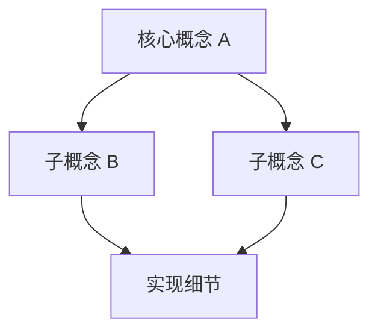

# {{SERIES_TITLE}}

> 一句话说清本系列讲什么、为什么重要。

## 概述

{{TOPIC}} 是 UE 引擎中 {{IMPORTANCE}}。本系列将从基础概念出发，逐步深入到源码层面，帮助你全面理解其设计与实现。

## 核心概念全景

### 概念 A

一段话介绍。

### 概念 B

一段话介绍。

### 概念 C

一段话介绍。

## 与 Lyra 项目的关系

本系列涉及的引擎机制在 Lyra 项目中的对应实现：

| 引擎概念 | Lyra 实现 | 模块文档 |
|---------|----------|---------|
| 概念 A | `ULyraXxx` | [[20-modules/cpp/ULyraXxx]] |
| 概念 B | `ALyraYyy` | [[20-modules/cpp/ALyraYyy]] |

## 学习路线

### 阶段 1：基础（入门）

| 课时 | 标题 | 你将学到 |
|------|------|---------|
| 01 | [[30-tutorials/{{SERIES}}/01-xxx]] | ... |
| 02 | [[30-tutorials/{{SERIES}}/02-xxx]] | ... |

### 阶段 2：核心（中级）

| 课时 | 标题 | 你将学到 |
|------|------|---------|
| 03 | [[30-tutorials/{{SERIES}}/03-xxx]] | ... |
| ... | ... | ... |

### 阶段 3：进阶（高级）

| 课时 | 标题 | 你将学到 |
|------|------|---------|
| NN | [[30-tutorials/{{SERIES}}/NN-xxx]] | ... |

## 前置知识

- 建议先阅读：[[30-tutorials/ue-framework/00-overview]]（UE 框架基础）
- C++ 基础
- UE 编辑器基本操作

## 相关页面

- [[00-meta/learning-paths]] — 学习路线总览
- [[10-architecture/overview]] — Lyra 架构概览
