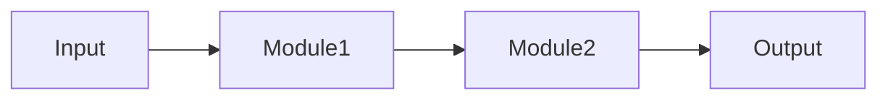

# {{NAME}} 子系统

> 一句话说清这个子系统在项目中的角色。

## 范围

**包含**：
- 代码目录：`Source/LyraGame/.../{{NAME}}/`
- 资产目录：`Content/.../`
- 配置：`Config/...`

**不包含**：（划清和邻居子系统的边界）

## 模块清单

| 模块 | 入口 | 职责 | wiki |
|---|---|---|---|
| ClassA | `Source/LyraGame/.../ClassA.h` | ... | [[20-modules/cpp/ClassA]] |
| ClassB | `Source/LyraGame/.../ClassB.h` | ... | [[20-modules/cpp/ClassB]] |

## 数据流

（关键的数据/控制流。可用 mermaid 图。）

## 关键决策

- [[60-decisions/...]] — 决策标题
- [[60-decisions/...]] — 决策标题

## 演化历史

按时间倒序，每条 1-2 行：

- **2026-Qx**：发生了什么
- **2026-Qx**：发生了什么

## 已知问题与限制

- 限制 1（详见 [[80-gotchas/...]]）
- 限制 2

## 相关页面

- [[10-architecture/overview]]
- [[70-topics/...]]
