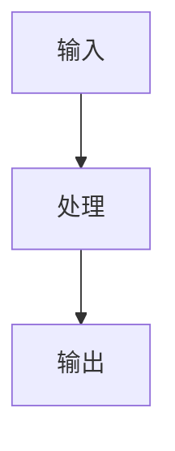
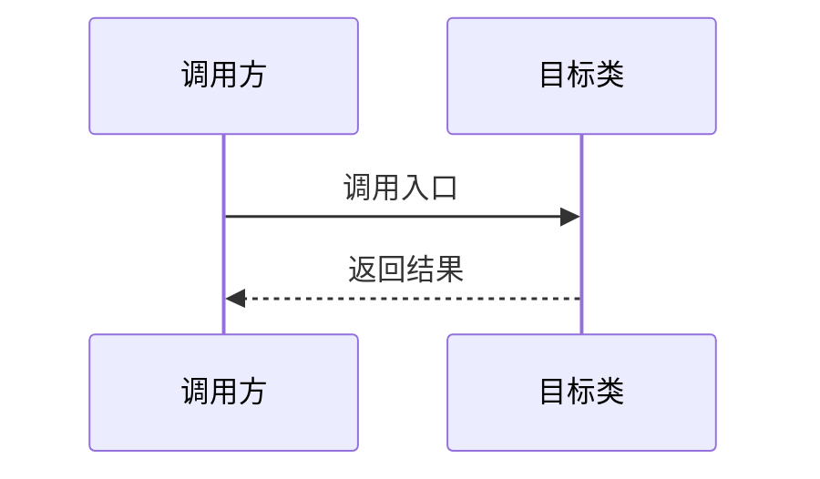

# {{TITLE}}

> 一句话概括本课时的学习目标。

## 概述

本课时讲解 {{TOPIC}}。读完后你将理解：
- 要点 1
- 要点 2
- 要点 3

## 核心概念

### 概念 A

（先给概念直觉——一句话 + 类比，再给技术细节）



### 概念 B

...

## 源码分析

### 关键代码

```cpp
// 核心逻辑（3-5 行）
// 文件：Engine/Source/Runtime/.../Xxx.cpp
void UXxx::KeyFunction()
{
    // 关键步骤
}
```

### 完整流程



## Lyra 实践

### Lyra 中的使用

```cpp
// 文件：Source/LyraGame/.../LyraXxx.cpp
// Lyra 对引擎机制的扩展/定制
```

与引擎默认实现的区别：
- 区别 1
- 区别 2

## 总结与要点

| 要点 | 说明 |
|------|------|
| 要点 1 | ... |
| 要点 2 | ... |
| 要点 3 | ... |

## 相关页面

- [[30-tutorials/{{SERIES}}/{{PREV_LESSON}}]] — 上一课
- [[30-tutorials/{{SERIES}}/{{NEXT_LESSON}}]] — 下一课
- [[20-modules/cpp/...]] — 相关 Lyra 模块
