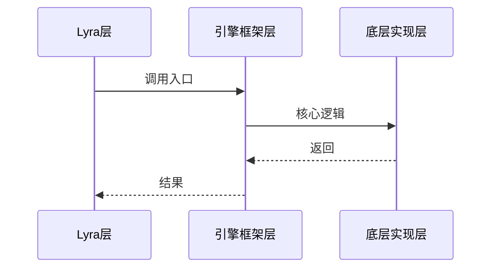

# 工作流：source-trace（源码追踪分析）

从 Lyra 项目代码追踪到引擎源码，建立完整的理解链路。适合"我想知道 XX 是怎么实现的"这类深度技术问题。

## 触发场景

- 用户说"帮我分析 XX 的源码实现"、"trace XX 的调用链"
- 用户问"XX 内部是怎么工作的"（需要追踪到引擎层）
- 用户问"Lyra 的 XX 跟引擎默认实现有什么区别"

## 与 teach 的区别

| | teach | source-trace |
|---|---|---|
| 重点 | 概念理解 + 使用方法 | **内部实现 + 调用链** |
| 深度 | 适中 | **深入到引擎源码** |
| 输出 | 教学式回答 | **调用链图 + 逐层分析** |
| 典型问题 | "GE 是什么" | "GE 的 Apply 到底调了哪些函数" |

## 步骤

### 1. 确认分析目标

向用户确认：
- 要追踪什么？（类名 / 函数名 / 流程名）
- 追踪到多深？（Lyra 层 / 引擎框架层 / 底层实现层）
- 关注什么方面？（性能 / 网络同步 / 生命周期 / 数据流）

### 2. 检索知识库

★ **优先走图谱**（wiki_query.py 含 anchors 命中 + 多类型边），详见 [query 工作流](./query.md#-推荐路径query-py-一击查询)：

```bash
# 用类名 / 函数名 / 关键词查（wiki_query.py 会扫 anchors[].path，从代码反查 wiki 比 rg 更准）
python3 .codebuddy/skills/project-wiki/scripts/wiki_query.py "<ClassName>"

# 已知关联模块页 id → 看其图邻居（含 related / prereq / 同系列教程）
python3 .codebuddy/skills/project-wiki/scripts/wiki_query.py --id 20-modules/cpp/<ClassName>
```

`wiki_query.py` 的 anchor-hit 评分（W_ANCHOR_HIT=1.2）专门针对"从代码反查 wiki"场景，比 `rg path:.*ClassName` 多了 status 警告 + 1-hop 教程邻居召回。

已有覆盖 → 指向已有教程，补充用户要求的额外深度。

只有在 `wiki_query.py` 不可用时才退回手工：
```bash
rg -i '<ClassName>' Docs/30-tutorials/ Docs/20-modules/
rg -l 'path:.*<ClassName>' Docs/
```

### 3. 定位 Lyra 入口

在项目源码中定位入口点：
```bash
# 搜索类定义
rg -n 'class.*<ClassName>' Source/
# 搜索函数实现
rg -n '<FunctionName>' Source/ --include='*.cpp'
```

### 4. 追踪调用链

从 Lyra 代码向下追踪：

```
Lyra 层（Source/LyraGame/...）
  ↓ 调用
引擎框架层（Engine/Source/Runtime/...）
  ↓ 调用
底层实现层（Engine/Source/Core/...）
```

工具：
- LSP `goToDefinition` / `findReferences` / `incomingCalls`
- `rg` 搜索函数调用
- 用户提供的引擎源码路径

### 5. 生成分析文档

输出结构：

```markdown
## 调用链全景



## 逐层分析

### 第 1 层：Lyra 层
- 文件：`Source/LyraGame/...`
- 关键代码 + 解读

### 第 2 层：引擎框架层
- 文件：`Engine/Source/Runtime/...`
- 关键代码 + 解读

### 第 3 层：底层实现
- 文件：`Engine/Source/Core/...`
- 关键代码 + 解读

## 关键设计决策

- 为什么引擎这样设计？
- Lyra 做了哪些定制？

## 相关教程

- [[30-tutorials/...]] - 相关教程链接
```

### 6. 关联已有知识

- 与 `20-modules/cpp/` 模块文档建立交叉引用
- 与 `30-tutorials/` 教程建立关联
- 如果 trace 涉及的引擎模块有对应教程，标注出来

### 7. 可选：crystallize

如果本次分析：
- 是完整的调用链分析（3+ 层深度）
- 覆盖了常见的"为什么"问题
- 有通用学习价值

→ 建议 **crystallize** 为教程页面（可以是某个系列的补充课时，也可以是独立 topic）。

## 注意事项

- **引擎源码路径**：如果用户没有引擎源码本地副本，通过 WebSearch 或 Context7 查找 API 文档
- **版本一致性**：确认分析的引擎版本与项目使用版本一致（见 `00-meta/project-versions.md`）
- **不要复制全文件**：只展示关键行/函数，标注文件路径和行号供用户自行查看
- **性能敏感**：如果追踪涉及 tick/render 等高频调用路径，标注性能影响

## 禁止动作

- ❌ 只分析 Lyra 层不追到引擎层（用户可以自己读 Lyra 代码，trace 的价值在于"更深"）
- ❌ 只贴代码不画图（调用链必须有 mermaid sequenceDiagram 或 flowchart）
- ❌ 猜测引擎实现而不标注"推测"（如果无法确认源码，明确标注）
- ❌ 分析完不关联知识库（必须指出相关教程和模块文档）
