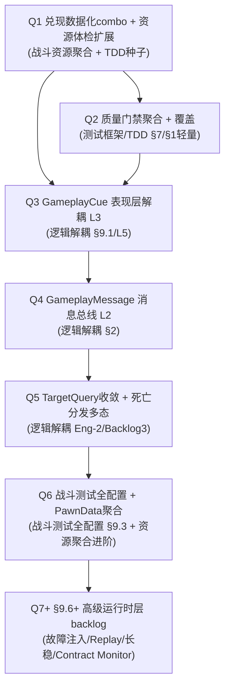

## 现状基线与评价结论

你的总结**正确**：本次 Sprint（Batch 0-6）= 第一版抽象层 + 几个高 ROI 缺口填补，不是把框架单机适用部分 60-70% 深度做完。三处微调：

- **§9 略多于「9.6+ 基本未做」**：`MRGA_PrimarySkill` 已埋 §9.10 影子校验纯函数 hook（`ComputeComboMultiplier`），但 9.6 故障注入 / 9.7 长稳 / 9.8 确定性复盘 / 9.11 Contract Monitor 仍缺。
- **§6 略多于「只有 change_impact + combo coverage」**：还新增了 [audit_gameplay_cues.py](Content/Python/audits/audit_gameplay_cues.py)（§6.4 种子），但 §6.1-6.3（AbilitySet/Ability/GE 系统化体检）仍缺。
- **Batch 5「剩余一半」已坐实**：[MRComboRuleData.h](Source/MyRoguelikeGame/MR/Abilities/MRComboRuleData.h) + [MRGA_PrimarySkill.cpp](Source/MyRoguelikeGame/MR/Abilities/MRGA_PrimarySkill.cpp) 的 `ComputeComboMultiplier` / `ApplyComboSideEffects`（消耗 tag + Cue + 结构化日志）C++ 全实现；`MRGA_HeavyStrike` 继承同一开关。但 `Content/MR/` **无任何 `UMRComboRuleData` 资产**，CDO 的 `ComboRules` 为空 → 运行时**仍走 legacy 硬编码 Frozen→Shatter / Marked**。数据路径目前是「死代码」。

## 推荐迭代路线图（ROI/依赖排序）

每个迭代后续单独走 Plan Lock + REACT + L1-L4，遵守 [ue-agent-contracts.mdc](.cursor/rules/ue-agent-contracts.mdc) 与 [gas-quality-infra-plan.md](docs/plans/gas-quality-infra-plan.md) 的「后续战斗改动门禁」。

- **Q1 — 兑现数据化 combo + 资源体检扩展**（本计划详细展开）。主题：战斗资源高聚合 + TDD 种子。兑现框架 §6 / §10.4-10.5 / §5 样例全流程。最高 ROI、最低风险（内容+审计，C++ 已成）。
- **Q2 — 质量门禁聚合 + 覆盖报告**（测试框架/TDD，§7/§1 轻量版）。把现有 50+ probe/audit + [agent_stack_check.py](.cursor/skills/ue-py-evolve/scripts/agent_stack_check.py) 扩成「一键核心门禁 runner + 覆盖/缺口报告」（消费 `index.json` + [audit_combo_coverage.py](Content/Python/audits/audit_combo_coverage.py)），落地 §1.2 分层金字塔与 §5 完整技能落地流程模板。**不做**真·云 CI / headless 自动化（留 Q7 backlog）。
- **Q3 — GameplayCue 表现层解耦（Lyra-Borrow L3）**。已有 [combat-cue-feedback-plan.md](docs/plans/combat-cue-feedback-plan.md)；与 Q1 的 `CueTag` 字段对接，把表现从 GA/GE 逻辑剥离。兑现 §9.1 视觉证据 + §6.4/6.5。
- **Q4 — GameplayMessage 消息总线（Lyra-Borrow L2）**。已有 [gameplay-message-bus-plan.md](docs/plans/gameplay-message-bus-plan.md)；B3 NDJSON schema 已稳定，HUD/Relic/Combo 改发布订阅。兑现 §2 可观测/解耦。
- **Q5 — TargetQuery 收敛 + 死亡分发多态**（[combat-architecture-backlog.md](docs/plans/combat-architecture-backlog.md) Eng-2 / Backlog Phase 3）。统一 `FMRCombatTargetQuery`，解耦 HUD/Debug/近战/AI 的目标选择硬编码。
- **Q6 — 战斗测试全配置 + 角色配方聚合**。`FMRCombatSandboxDebug`/Scenario Director 升级为全配置 + Manual Mode UMG + 演练场 Tier 2（[skill-training-ground-plan.md](docs/plans/skill-training-ground-plan.md)）+ 场景库；新建 `UMRPawnData`（[combat-architecture-backlog.md](docs/plans/combat-architecture-backlog.md) Lyra-Borrow L5）聚合 loadout。兑现 §9.3 完整 Scenario Director。
- **Q7+ — §9.6+ 高级运行时层 backlog**。故障注入 / 确定性 Replay / 长稳 / Contract Monitor。ADR 0007 已标「暂不做」，转多人或稳定性需求时再评估，不在近期范围。

## Q1 详细计划 — 兑现数据化 combo + 资源体检扩展

**定位**：让 Batch 5 已付费的数据路径真正生效（替代 legacy 死代码），并补 §6.1-6.4 资源体检，使 combo/AbilitySet/GE/Cue 资产可被静态校验。**C++ 不需新增改动**（开关已成）；以内容授权 + Python 审计/探针为主。

### Slice S1 — 创建 combo 数据资产
- 在 [Content/Python/workflows/](Content/Python/workflows) 新增 `setup_combo_rules.py`：用 UE Python 创建两个 `UMRComboRuleData` 资产（参考 [python-blueprint-cdo.md](docs/ue-agent-knowledge/concepts/python-blueprint-cdo.md)、[python-gas-asset-limits.md](docs/ue-agent-knowledge/concepts/python-gas-asset-limits.md)）：
  - `DA_Combo_FrozenShatter`：`RequiredTargetTag=Status.Frozen`、`ConsumeTag=Status.Frozen`、`DamageMultiplier=2.0`、`CueTag=GameplayCue.Combo.Shatter`、`ComboEventName=Combat.Combo.Shatter`。
  - `DA_Combo_Marked`：`RequiredTargetTag=Status.Marked`、`DamageMultiplier=1.3`、`ComboEventName=Combat.Combo.Marked`。

### Slice S2 — 挂载到 GA CDO（激活数据路径）
- `MRGA_HeavyStrike` CDO 的 `ComboRules` = [`DA_Combo_FrozenShatter`]（R 重击的冻→碎）。
- `MRGA_PrimarySkill` CDO 的 `ComboRules` = [`DA_Combo_Marked`]（普攻标记增伤）。
- 挂载后 `ComboRules.Num()>0`，[MRGA_HeavyStrike.cpp:40](Source/MyRoguelikeGame/MR/Abilities/MRGA_HeavyStrike.cpp) 与 [MRGA_PrimarySkill.cpp:1071](Source/MyRoguelikeGame/MR/Abilities/MRGA_PrimarySkill.cpp) 自动切到数据路径，legacy 分支变 fallback。
- **legacy 处置门禁**：Q1 实施中 legacy 硬编码**先保留**作 fallback；S4 探针 + 用户 L4 目视确认数据路径行为等价后，已移除 legacy，当前 `ComboRules` 为空 = 无 combo 效果（遵守 [ue-agent-contracts.mdc](.cursor/rules/ue-agent-contracts.mdc) §2 资产删改门禁）。

### Slice S3 — §6 资源体检扩展
- 新增 [Content/Python/audits/](Content/Python/audits) `audit_combo_rules.py`：校验每个 `DA_Combo` 的 tag 有效且已注册、`DamageMultiplier>=1`、`CueTag` 能解析到已注册 Cue、`ComboEventName` 非空；并断言目标 GA 的 `ComboRules` 非空（防回到死代码）。
- 新增 `audit_ability_sets.py`（§6.1）：`UMRAbilitySet` 的 GrantedAbilities/Attributes/GE 类有效、InputTag 已注册、同 set 无重复 InputTag。
- 视体量并入 §6.3 GE 体检（Modifier 属性存在 / SetByCaller tag 注册 / Cooldown GE 授予对应 tag）；§6.4 复用既有 [audit_gameplay_cues.py](Content/Python/audits/audit_gameplay_cues.py)。
- 全部接入 [agent_stack_check.py](.cursor/skills/ue-py-evolve/scripts/agent_stack_check.py) 静态扫描。

### Slice S4 — TDD 演示探针（证明数据路径生效 + 无回归）
- 用 Batch 1 harness（[mr_ops/scenario.py](Content/Python/mr_ops/scenario.py)、[test_data.py](Content/Python/mr_ops/test_data.py)、[oracle.py](Content/Python/mr_ops/oracle.py)）扩 [probe_combo_freeze_shatter.py](Content/Python/probes/probe_combo_freeze_shatter.py)：Given 冻结木桩 / When 重击 / Then 经 NDJSON facade 读到 `Combat.Combo.Shatter` 事件 + 伤害倍率 + Frozen 被消耗 + Cue 执行；断言伤害仍 47-50（不回归 Phase 8.3）。
- 新增「数据 only」证明：`DA_Combo_Marked` 触发标记增伤的探针断言，**不改任何 C++** —— 兑现「加 combo = 配数据」。

### Slice S5 — 文档/KB 沉淀
- 更新 [feature-contract.md](docs/ue-agent-knowledge/concepts/feature-contract.md) 的 FreezeThenShatter 契约指向数据驱动路径；更新 [combo-freeze-shatter-debug.md](docs/ue-agent-knowledge/concepts/combo-freeze-shatter-debug.md)；在 [gas-quality-infra-plan.md](docs/plans/gas-quality-infra-plan.md) 标 Batch 5「数据资产兑现」完成；`/ue-py-evolve` 沉淀。

### Q1 验收（L1-L4）
- **L2**：若 S3 不引入 C++，可跳过 Build；如加运行时不变量则关 Editor 全量 Build。
- **L3**：`audit_combo_rules` / `audit_ability_sets` / `agent_stack_check --check` 绿；combo coverage 报告新 combo 已覆盖。
- **L4**：`Lvl_MRCombatRoom` PIE 摆队友打冻结木桩，Frozen→Shatter 经**数据路径**仍 47-50 伤害；标记增伤经数据路径生效；**用户目视确认**后再处置 legacy。

## 治理与边界（贯穿）
- 严格按迭代推进，不跨迭代堆叠未验收改动；每迭代单独可回退。
- 不回归 Phase 0-8.4 可玩路径；Combat Sandbox/隔离场不替代 `Lvl_MRFloor` run 验收。
- 不引入 CommonUI / Experience / GameFeature / 联机；§9.6+ 与一切多人/发布/团队规模内容明确留 backlog（ADR 0007）。
- 新增子系统（如 Q4 消息总线、Q6 PawnData）按 [0006-engine-subsystem-adoption.md](docs/design/decisions/0006-engine-subsystem-adoption.md) 先 diff Lyra 锚点再写 ADR。