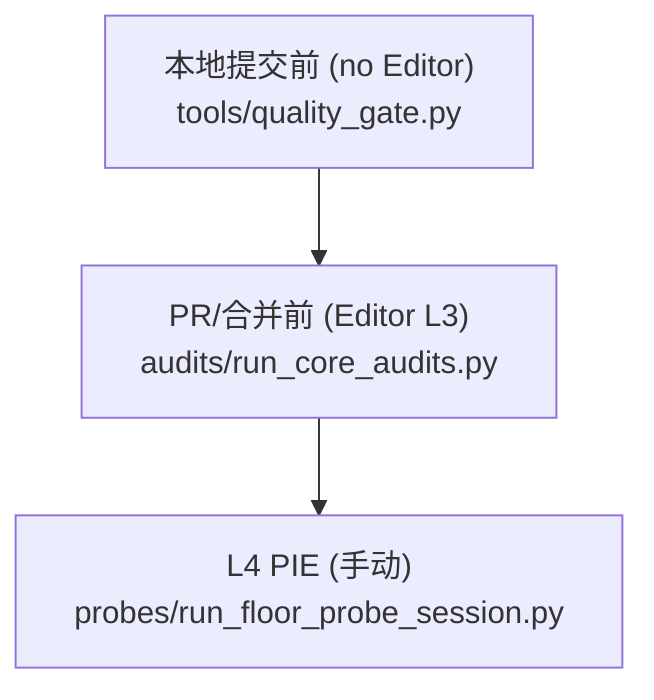

## 目标与定位（Q2 = ROI 第 2 档）

承接 Q1（数据化 combo 已生效）。当前缺「一条命令聚合 + 统一通过/失败 + 覆盖/缺口报告」的门禁层：静态检查([agent_stack_check.py](.cursor/skills/ue-py-evolve/scripts/agent_stack_check.py))、L3 资产审计(各自单跑)、combo 覆盖([audit_combo_coverage.py](Content/Python/audits/audit_combo_coverage.py) 硬编码 catalog) 三者割裂。Q2 把它们收敛为**分层门禁**，并把覆盖升级为**数据驱动**。范围 = 静态层 + Editor L3 聚合器（L4 复用现有 [run_floor_probe_session.py](Content/Python/probes/run_floor_probe_session.py)）。**不做** 真·云 CI / headless PIE 自动化（留后续）。

## 门禁分层（对齐框架 §7.3）

- **本地提交前**：`quality_gate.py`（纯 Python）= agent_stack_check + feature 在位矩阵 + 覆盖摘要。
- **PR/合并前**：`run_core_audits.py`（需 Editor）= 聚合核心 L3 资产体检 + 数据驱动 combo 覆盖。
- **L4**：维持现有 PIE 串场，不在本轮重做。

## 批次 Q2-A — Editor L3 审计聚合器 + 数据驱动覆盖

- 新增 [Content/Python/audits/run_core_audits.py](Content/Python/audits/run_core_audits.py)：按 curated 列表（`audit_combo_rules`、`audit_ability_sets`、`audit_gameplay_cues`，可扩）逐个 `importlib` 执行 `main()`，**catch `SystemExit` 续跑**并汇总 PASS/FAIL，输出 `RUN_CORE_AUDITS_OK` 或失败清单 + exit 1。仅含「加载资产即可」的体检（不含需 PIE/commandlet 的 floor/room 审计）。
- 升级 [audit_combo_coverage.py](Content/Python/audits/audit_combo_coverage.py) 为数据驱动：Editor 下用 `mr_ops.assets` 枚举 `/Game/MR/Abilities/Combo/DA_Combo_*`，读 `combo_event_name` 自动建 catalog，按与 C++ 同逻辑（`Contains Shatter/Marked/Frozen`，见 [MRGameplayLogSubsystem.cpp](Source/MyRoguelikeGame/MR/Logging/MRGameplayLogSubsystem.cpp) `AppendCombatNdjson`）归桶，查最新 `index.json` bucket 计数；无 Editor 时回退现有静态 catalog（保持 CI 可跑）。对 event **无对应 telemetry bucket** 的 combo 显式 flag「需扩 NDJSON 计数」（不静默漏测）。

## 批次 Q2-B — 静态质量门禁聚合 + feature 在位矩阵

- 新增 [Content/Python/tools/quality_gate.py](Content/Python/tools/quality_gate.py)（纯 Python，无 `unreal`，与 [change_impact.py](Content/Python/tools/change_impact.py) 同层）：
  - 依次跑 `agent_stack_check.py`（subprocess）+ feature 在位矩阵 + `audit_combo_coverage` 静态摘要；统一退出码 + 汇总；`--strict` 收紧。
  - **feature 在位矩阵**：内置起始 catalog（`FreezeThenShatter` / `MarkedBonus` / `HeavyStrike`）→ 检查每项是否齐备 {[feature-contract.md](docs/ue-agent-knowledge/concepts/feature-contract.md) 含其契约锚点、对应 `audits/audit_*.py`、`probes/probe_*.py` 存在}；缺项高亮。这把框架 §5「技能落地流程」做成**可机判 checklist**。
- 与既有无-Editor CI（`.github/workflows/doc-check.yml`，治理 Batch 9）对齐：`quality_gate.py` 作为其本地等价/可被其调用。

## 批次 Q2-C — 文档（§7/§1.2/§5）

- 扩 [development-quality-gates.md](docs/ue-agent-knowledge/modules/development-quality-gates.md)（或新建 `modules/quality-gate-tiers.md`）：写清三层门禁映射（commit→`quality_gate` / PR→`run_core_audits` / L4→`run_floor_probe_session`）= 框架 §7.3；§1.2 金字塔（static → L3 asset-health → L4 PIE 行为）；§5 feature 落地流程模板（contract→audit→probe→coverage 五步 checklist，引用 feature 矩阵）。
- 回填 [gas-quality-infra-plan.md](docs/plans/gas-quality-infra-plan.md) 标 Q2 完成；若新建概念页则补 [concepts/index.md](docs/ue-agent-knowledge/concepts/index.md) 与 KB 索引。

## 验收（L1-L3，本轮基本无 L4/C++）

- `python Content/Python/tools/quality_gate.py --check`：绿时 exit 0 并打印 feature 矩阵（contract/audit/probe 在位）+ 覆盖摘要；故意删一项 → 非 0 列缺口。
- Editor 跑 `audits/run_core_audits.py` → `RUN_CORE_AUDITS_OK`（聚合三审计；故意改坏一项 → 汇总 FAIL + exit 1）。
- `audit_combo_coverage` 数据驱动：现有 frozen/shatter/marked 正确 covered（需先有一场 PIE telemetry）；新增一条 DA_Combo 自动进 catalog。
- `agent_stack_check.py --check` / `/ue-doc-audit` 0 error；新脚本无 `agent_stack_check` 禁用模式命中。

## 风险与边界

- 不引入 C++（除非选择 per-combo NDJSON 计数；本轮**不做**，仅 flag 该缺口）。
- 不做 headless/云 CI、不替代 L4 用户 PIE 目视；`run_core_audits` 只聚合「加载资产即可」的审计，不混入需 PIE/commandlet 的 floor/room 审计。
- 聚合器 catch `SystemExit` 续跑，保证一次看全所有失败，不在首个失败处中断。
- feature catalog 先小后扩，避免一次性枚举全部技能造成维护负担。