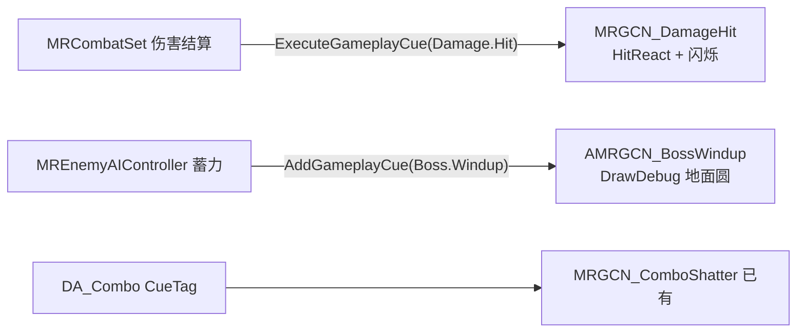

# Q3 — GameplayCue 表现层解耦（Lyra-Borrow L3）

## 背景与现状

- Q1/Q2 已完成；Cue 基建已在位：`MRGCN_StatusFrozen/Marked/ComboShatter` 原生类 + `GCN_MR_*` 蓝图壳 + 冰壳 overlay 材质 + `audit_gameplay_cues`；combo 数据路径经 `Rule->CueTag` 走 `ExecuteGameplayCue`。
- 仍耦合在逻辑层的表现（本轮剥离目标）：
  - `MRCombatSet::PostGameplayEffectExecute`（[MRCombatSet.cpp L52-84](g:/UEProjects/MyRoguelikeGame/Source/MyRoguelikeGame/MR/Attributes/MRCombatSet.cpp)）直接调 `HitReact->PlayHitReact` + editor-only 命中闪烁。
  - Boss 蓄力仅有 loose tag `Status.AttackWindup` + HUD 文本（[MREnemyAIController.cpp L241-341](g:/UEProjects/MyRoguelikeGame/Source/MyRoguelikeGame/MR/AI/MREnemyAIController.cpp)），无世界空间预警。
- [combat-cue-feedback-plan.md](g:/UEProjects/MyRoguelikeGame/docs/plans/combat-cue-feedback-plan.md) L4 四项目视未勾选。

## Slice 1 — C++：Damage Cue 剥离 + Boss 蓄力 Cue

- 新 tag（`MRGameplayTags` + `DefaultGameplayTags.ini`）：`GameplayCue.MR.Damage.Hit`、`GameplayCue.MR.Boss.Windup`。
- 新 `UMRGCN_DamageHit`（Static）：`OnExecute` 内做 `PlayHitReact(Instigator)` + editor-only 命中闪烁（从 CueParams 取 Instigator/EffectCauser）。
- `MRCombatSet::PostGameplayEffectExecute` 伤害分支改为只 `ExecuteGameplayCue(Damage.Hit, Params)`，删除直接组件调用；**不动**锁血/钳制/ProbeImmunity 逻辑。
  - Carry 微门禁：改前 `codegraph_impact` 找断言命中闪烁/HitReact 的探针；改后关 Editor 全量 Build。
- 新 `AMRGCN_BossWindup`（`GameplayCueNotify_Actor`，looping）：WhileActive 每帧 DrawDebug **地面水平圆**（半径≈近战攻击距离）。Visual Debug Gate：仅 DrawDebug 原语，不引入 Decal/Mesh。
- `SetBossWindupStatus` 同步 `AddGameplayCue/RemoveGameplayCue(Boss.Windup)`（含死亡/重置清理路径，配合 B4 不变量「销毁无残留 Cue」）。

## Slice 2 — 资产与 setup

- 扩 `workflows/setup_gameplay_cues.py`：新增 `GCN_MR_Damage_Hit`、`GCN_MR_Boss_Windup` 蓝图壳（reparent 到原生类），路径 `/Game/MR/GameplayCues/`（已在 `GameplayCueNotifyPaths`）。

## Slice 3 — §6.4/6.5 审计 + 门禁对接

- 扩 [audit_gameplay_cues.py](g:/UEProjects/MyRoguelikeGame/Content/Python/audits/audit_gameplay_cues.py)：新 tag/GCN 资产/原生父类检查；新增「Cue 只表现不承担逻辑」静态扫描（`MRGCN_*` 源文件禁止 `ApplyGameplayEffect`/属性写入，§6.5）。
- `tools/quality_gate.py` FEATURES 矩阵追加 `DamageHitCue`、`BossWindupTelegraph` 条目（contract/audit/probe 在位）。

## Slice 4 — §9.1 视觉证据探针（L4 脚本）

- 新 `probes/probe_cue_visual_evidence.py`（PIE，复用 harness + `SetBossWindupStatusForProbe`）：
  - Frozen GE applied → 断言 mesh `GetOverlayMaterial()==MI_MR_FrozenOverlay`（逻辑+视觉同证）；到期→断言 overlay 清空。
  - 伤害结算 → 断言 ASC 无直连调用残留、cue 路径触发（结构化日志/HitReact 状态）。
  - 失败报告带 L5 层 token + `automation screenshot` 截图证据（§9.1 证据型报告）。
- 回归：`probe_combo_freeze_shatter` / `probe_combo_marked_bonus` 复跑不回归（锁血下伤害可见断言不变）。

## Slice 5 — 文档/KB 收尾

- [feature-contract.md](g:/UEProjects/MyRoguelikeGame/docs/ue-agent-knowledge/concepts/feature-contract.md) 补 DamageHit/BossWindup 契约 delta + L0–L7 Diagnose（L1 资源 / L4 时长 / L5 表现分层）。
- 回填 `gas-quality-infra-plan.md` Q3 节、`gas-quality-roadmap.md` 状态表、`combat-cue-feedback-plan.md` 标记吸收；学习导读按 roguelike-learning 规则补链。

## 验收（Plan Lock 锁定项）

- **L2**：关 Editor `Build.bat` 全量成功。
- **L3**：`run_core_audits` → `RUN_CORE_AUDITS_OK`；`quality_gate --check` 含新 feature 行绿；`agent_stack_check --check` 0 error。
- **L4 脚本**：`probe_cue_visual_evidence` + combo 两探针 PASS。
- **L4 用户目视**（含 cue-plan 遗留四项）：冰壳 overlay 可见且到期恢复；碎裂 burst 与普通重击可区分；命中后受击反应/闪烁与改前无回归；Boss 蓄力地面圆出现且挥击后消失；关 `showdebug abilitysystem` 后均可读。

## 边界

- 不引入消息总线（Q4）/ Niagara 正式特效 / Decal/Mesh 范围圈 / CommonUI/GameFeature。
- `UMRAbilityDebugDrawComponent` DrawDebug 地面圆保留为 dev 开关，不替换。
- 锁血/钳制语义不变；探针失败先 remote query 区分产品 bug vs harness 限制。
- 执行轮 L0 静默：仅 Plan 步骤一行回报 + BLOCKED/完成短模板。