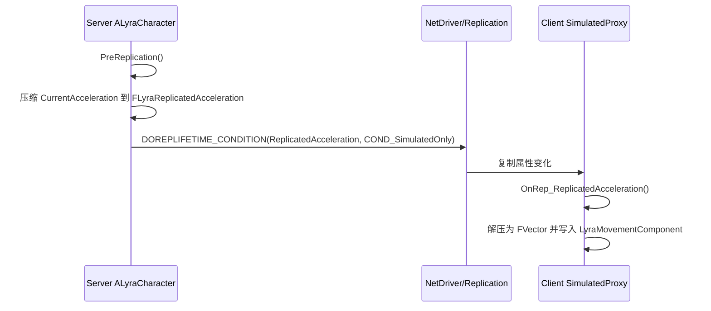
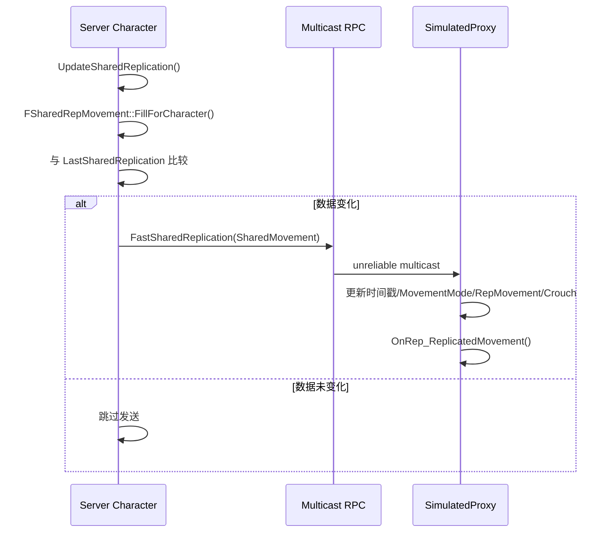
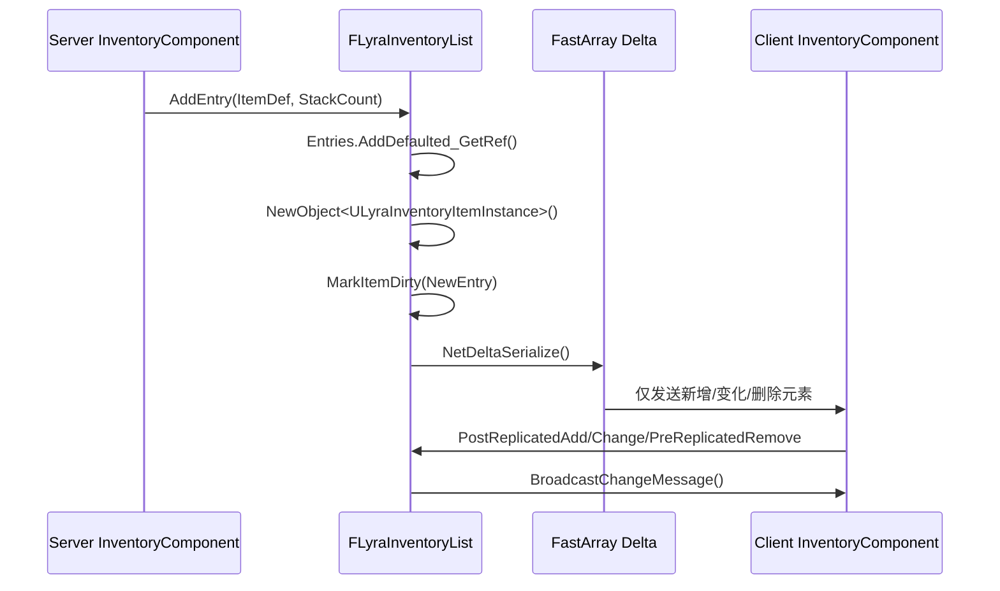
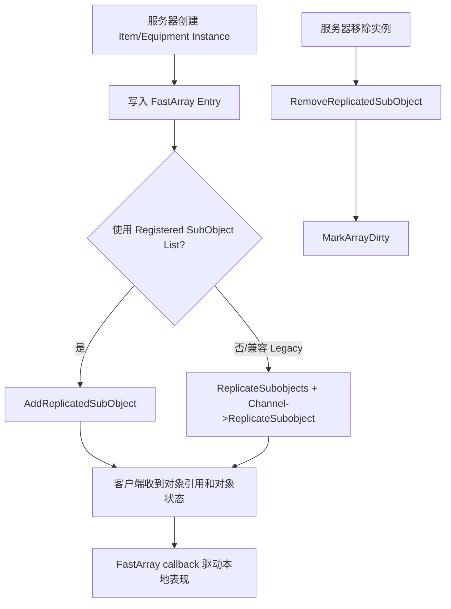
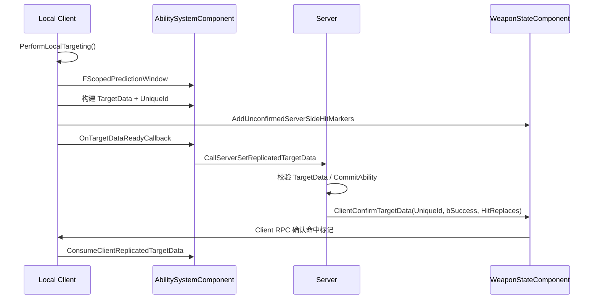
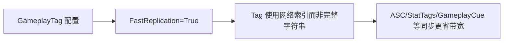
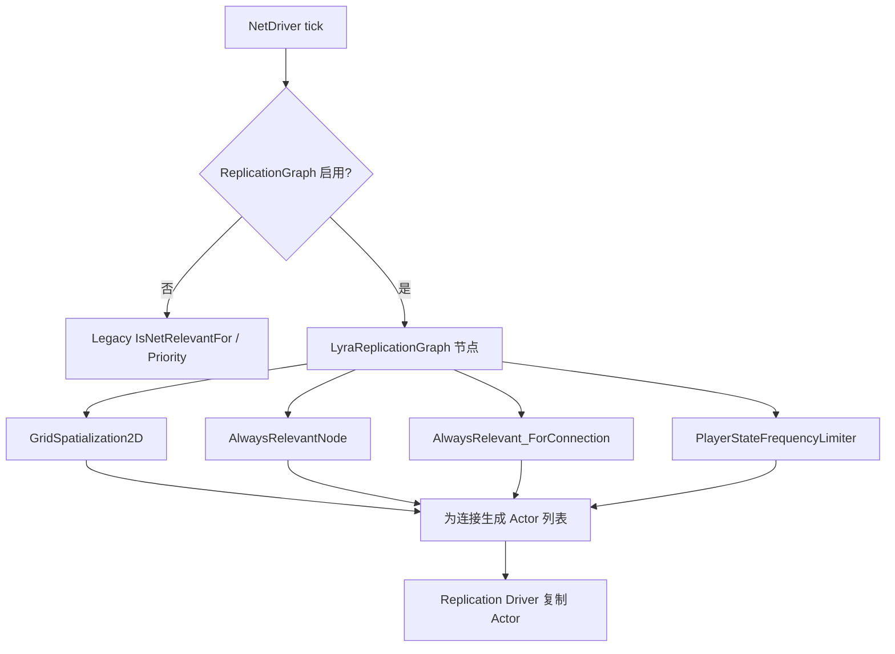

# 网络复制数据流

> 本页用 Lyra 项目源码中的典型场景描述网络同步链路。

## 1. 普通属性复制：Character 加速度

要点：

- 服务端不复制完整浮点加速度，而是复制 3 个量化字段。
- `COND_SimulatedOnly` 避免把该数据发给 AutonomousProxy。
- 客户端 RepNotify 是“解压 + 写入本地移动组件”，不是 gameplay 权威逻辑。

## 2. FastShared movement：跳过默认属性复制时的快路径

要点：

- 这是 Lyra 针对移动同步的带宽优化路径。
- RPC 是 unreliable，不能承载必须到达的 gameplay 状态。
- `FSharedRepMovement` 开启 `WithNetSerializer` 与 `WithNetSharedSerialization`。

## 3. FastArray：Inventory 条目同步

要点：

- `FFastArraySerializer` 解决“数组整体复制太重”的问题。
- Entry 中的 `LastObservedCount` 标记为 `NotReplicated`，只作为客户端本地差量计算辅助。
- 物品实例是 UObject SubObject，需要另行复制，FastArray Entry 的指针本身不足以传输对象状态。

## 4. SubObject 生命周期

要点：

- FastArray 负责“列表结构和条目变化”。
- SubObject 复制负责“条目指向的 UObject 实例状态”。
- Lyra 同时写了 `ReplicateSubobjects` 和 `AddReplicatedSubObject`，便于兼容 Legacy 与 registered list。

## 5. GAS 武器 TargetData 预测

要点：

- 本地先做命中检测是为了手感和预测。
- 服务器仍是权威：最终是否 Commit、是否确认命中由服务器决定。
- `FLyraGameplayAbilityTargetData_SingleTargetHit::NetSerialize` 追加 `CartridgeID`，并在 Iris 配置中列入 `SupportsStructNetSerializerList`。

## 6. GameplayTag 快速复制

Lyra 在 `DefaultGameplayTags.ini` 中设置：

- `FastReplication=True`
- `NumBitsForContainerSize=6`
- `NetIndexFirstBitSegment=16`

这会影响 GAS Tag、StatTags、GameplayCue 等多处网络数据的编码成本。

## 7. RepGraph 复制候选生成

要点：

- RepGraph 优化的是“为每个连接找哪些 Actor 需要考虑复制”。
- Lyra 默认禁用，因此这张图是可选优化路径。
- 一旦启用，`AActor::IsNetRelevantFor` 不再是主要的相关性扩展点。

## 验证建议

每条链路都应至少验证：

- Listen Server 与 Dedicated Server。
- Join-in-progress。
- 丢包与延迟。
- Owner / SimulatedProxy 差异。
- 对象销毁与重生。
- 重复添加/删除 FastArray 元素。
