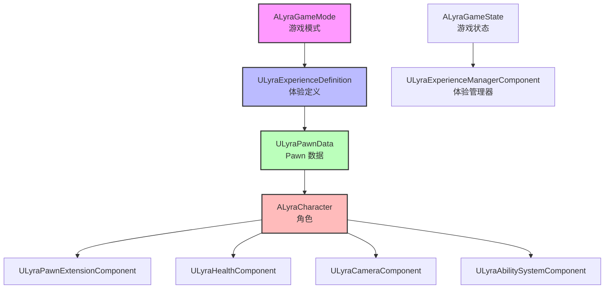
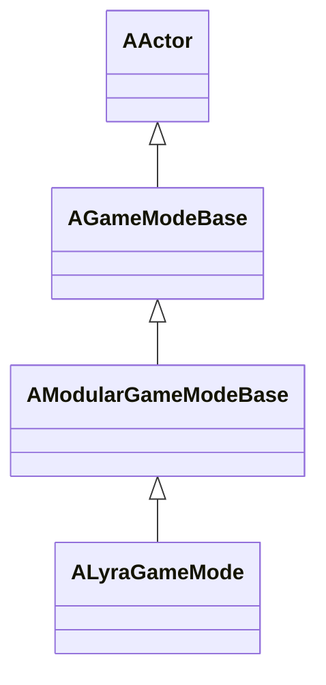
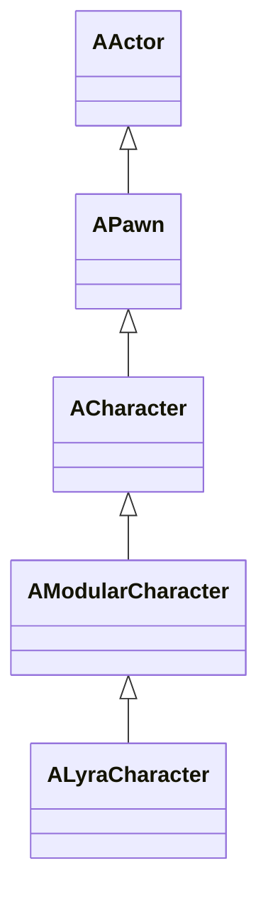
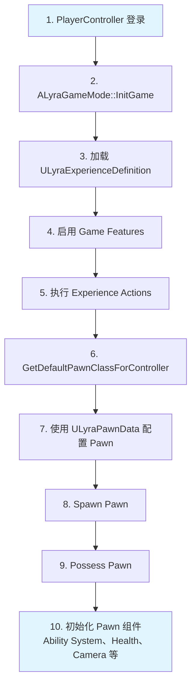
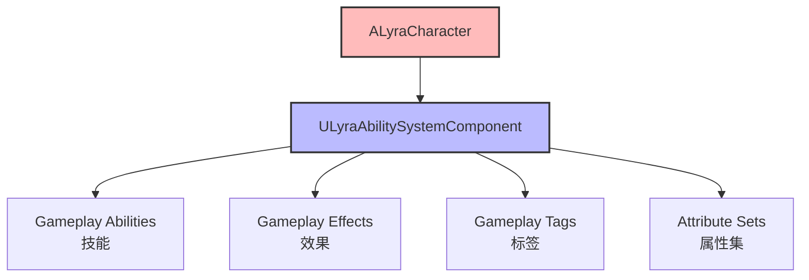

# Lyra 架构概览

> LyraStarterGame 的核心架构设计，基于模块化游戏玩法（Modular Gameplay）和体验系统（Experience System）。

## 核心设计理念

### 1. 模块化游戏玩法（Modular Gameplay）

Lyra 使用 UE5 的模块化游戏玩法框架，将功能分解为可复用的组件：

- **ModularCharacter**：模块化的角色类
- **ModularGameMode**：模块化的游戏模式
- **ModularGameState**：模块化的游戏状态

**优势**：
- 功能解耦，易于维护和扩展
- 组件可复用，减少代码重复
- 支持动态添加/移除功能

### 2. 体验系统（Experience System）

体验系统是 Lyra 的核心创新，定义了游戏的完整体验：

```cpp
class ULyraExperienceDefinition : public UPrimaryDataAsset
{
    // 要启用的游戏功能插件列表
    TArray<FString> GameFeaturesToEnable;
    
    // 默认 Pawn 数据
    TObjectPtr<const ULyraPawnData> DefaultPawnData;
    
    // 加载/激活/停用/卸载时执行的操作列表
    TArray<TObjectPtr<UGameFeatureAction>> Actions;
    
    // 附加操作集
    TArray<TObjectPtr<ULyraExperienceActionSet>> ActionSets;
};
```

**工作流程**：
1. 游戏启动时加载 Experience Definition
2. 启用指定的 Game Feature 插件
3. 执行定义的操作（添加 Ability、Input Binding、Widget 等）
4. 使用 Pawn Data 配置 Pawn

### 3. 组件化架构（Component-Based）

角色功能被分解为多个组件，每个组件负责一个特定功能：

| 组件 | 职责 |
|---|---|
| `ULyraPawnExtensionComponent` | Pawn 扩展基础组件 |
| `ULyraHealthComponent` | 生命值管理 |
| `ULyraCameraComponent` | 相机控制 |
| `ULyraAbilitySystemComponent` | 游戏能力系统 |
| `ULyraHeroComponent` | 英雄角色特有功能 |
| `ULyraEquipmentManagerComponent` | 装备管理 |
| `ULyraInventoryManagerComponent` | 库存管理 |

## 模块依赖关系



## 核心类说明

### ALyraGameMode

**职责**：定义游戏规则和流程

**关键功能**：
- 加载 Experience Definition
- 管理玩家登录和 Pawn 生成
- 处理游戏开始和结束
- 管理玩家重启（Respawn）

**继承关系**：



### ALyraCharacter

**职责**：玩家的角色 Pawn，负责发送事件到各个 Pawn 组件

**关键功能**：
- 实现 Ability System 接口
- 实现 GameplayCue 接口
- 实现团队代理接口
- 管理复制的加速度数据
- 处理死亡序列

**继承关系**：



**实现的接口**：
- `IAbilitySystemInterface`
- `IGameplayCueInterface`
- `IGameplayTagAssetInterface`
- `ILyraTeamAgentInterface`

### ULyraExperienceDefinition

**职责**：定义游戏的完整体验（Pawn、装备、UI、Input 等）

**关键属性**：
- `GameFeaturesToEnable`：要启用的游戏功能插件
- `DefaultPawnData`：默认 Pawn 数据
- `Actions`：游戏功能操作列表
- `ActionSets`：附加操作集

**使用流程**：
1. 在 `ALyraGameMode::InitGame()` 中开始加载 Experience
2. Experience 加载完成后，启用 Game Features
3. 执行所有 Actions（添加 Ability、Input、Widget 等）
4. 使用 `DefaultPawnData` 配置 Player 的 Pawn

## 数据流

### 玩家登录流程



### 能力系统（GAS）集成



## 扩展点

### 添加新功能

1. **创建新的 Pawn 组件**：
   - 继承 `ULyraPawnExtensionComponent`
   - 重写 `OnPawnReadyToInitialize()` 等函数

2. **创建新的 Experience Action**：
   - 继承 `UGameFeatureAction`
   - 实现 `OnGameFeatureActivating()` 和 `OnGameFeatureDeactivating()`

3. **创建新的 Game Feature 插件**：
   - 使用 UE 的插件系统
   - 在 Experience Definition 中启用

## 相关页面

- [[10-architecture/subsystems/experience-system]] - 体验系统详解
- [[10-architecture/subsystems/modular-gameplay]] - 模块化游戏玩法
- [[10-architecture/subsystems/ability-system]] - 游戏能力系统
- [[20-modules/cpp/ALyraCharacter]] - 角色类详解
- [[20-modules/cpp/ALyraGameMode]] - 游戏模式详解

---
> 最后更新：2026-05-16
