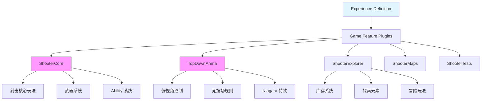
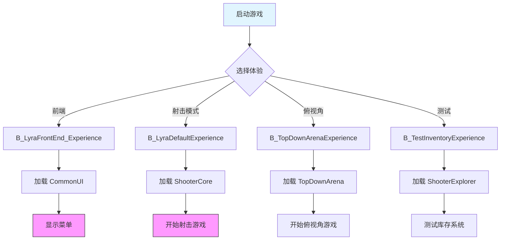
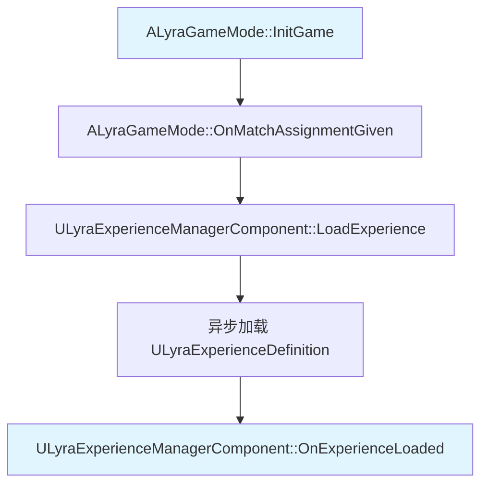
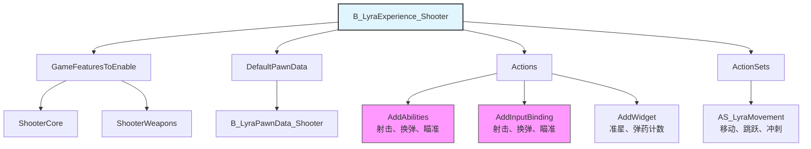

# 体验系统（Experience System）

> Lyra 的核心架构创新，通过 `ULyraExperienceDefinition` 定义游戏的完整体验。

## 概述

体验系统允许开发者通过数据资产（Data Asset）定义游戏的完整体验，包括：
- 启用哪些 Game Feature 插件
- 使用哪个 Pawn Data
- 执行哪些操作（添加 Ability、Input、Widget 等）

**核心理念**：将游戏逻辑从代码中解耦，通过数据驱动的方式配置游戏体验。

## Lyra 预设体验系统

Lyra 项目预设了以下体验系统，展示了不同游戏类型的实现方式：

### 1. B_LyraFrontEnd_Experience（前端菜单体验）

- **路径**：`Content/System/FrontEnd/B_LyraFrontEnd_Experience.uasset`
- **用途**：游戏启动时的主菜单界面
- **启用的 Game Features**：
  - CommonUI（通用 UI 框架）
  - CommonGame（通用游戏框架）
- **Pawn Data**：无（菜单界面不需要 Pawn）
- **Actions**：
  - 添加 UI Widget（菜单界面）
  - 配置输入（鼠标/键盘导航）

### 2. B_LyraDefaultExperience（默认游戏体验）

- **路径**：`Content/System/Experiences/B_LyraDefaultExperience.uasset`
- **用途**：默认的游戏体验（射击游戏模式）
- **启用的 Game Features**：
  - ShooterCore（射击核心玩法）
  - ShooterMaps（地图资源）
  - CommonUI
  - EnhancedInput
- **Pawn Data**：`B_LyraPawnData_Default`
- **Actions**：
  - 添加射击相关 Ability（射击、换弹、瞄准）
  - 添加 Input Binding（WASD移动、鼠标射击等）
  - 添加 HUD Widget（准星、血量、弹药）

### 3. B_TopDownArenaExperience（俯视角竞技场体验）

- **路径**：`Plugins/GameFeatures/TopDownArena/Content/System/Experiences/B_TopDownArenaExperience.uasset`
- **用途**：俯视角竞技场游戏模式
- **启用的 Game Features**：
  - TopDownArena（俯视角玩法系统）
  - GameplayAbilities
  - Niagara（粒子效果）
  - LyraExampleContent
- **Pawn Data**：`B_TopDownPawnData`
- **Actions**：
  - 添加俯视角控制 Ability
  - 添加俯视角相机
  - 添加竞技场 HUD

### 4. B_TopDownArena_Multiplayer_Experience（俯视角竞技场多人体验）

- **路径**：`Plugins/GameFeatures/TopDownArena/Content/System/Experiences/B_TopDownArena_Multiplayer_Experience.uasset`
- **用途**：支持多人的俯视角竞技场模式
- **与单人版的区别**：
  - 启用网络复制
  - 添加多人 HUD（玩家列表、分数等）
  - 配置服务器设置

### 5. B_TestInventoryExperience（测试库存体验）

- **路径**：`Plugins/GameFeatures/ShooterExplorer/Content/System/Experiences/B_TestInventoryExperience.uasset`
- **用途**：测试库存系统
- **启用的 Game Features**：
  - ShooterExplorer（射击+冒险探索）
  - ShooterCore
  - LyraExampleContent
- **Pawn Data**：`B_ExplorerPawnData`
- **Actions**：
  - 添加库存 UI
  - 添加物品拾取 Ability
  - 添加冒险元素（探索、解谜）

## Game Feature 插件架构

Lyra 采用模块化的 Game Feature 插件架构，每个插件封装独立的功能模块：



### 插件详细说明

| 插件名称 | 描述 | 依赖 | 用途 |
|---------|------|------|------|
| **ShooterCore** | 射击游戏核心玩法系统 | GameplayAbilities, ModularGameplay, CommonUI, EnhancedInput | 提供射击、换弹、瞄准等核心功能 |
| **TopDownArena** | 俯视角竞技场玩法 | GameplayAbilities, Niagara | 提供俯视角控制、竞技场规则 |
| **ShooterExplorer** | 射击+冒险探索 | ShooterCore | 扩展 ShooterCore，添加库存、探索元素 |
| **ShooterMaps** | 射击游戏地图 | ShooterCore | 提供预设地图和场景 |
| **ShooterTests** | 测试套件 | ShooterCore, CQTest | 提供自动化测试 |

## 体验系统工作流程




## 核心类

### ULyraExperienceDefinition

**继承自**：`UPrimaryDataAsset`

**职责**：定义游戏的完整体验

**关键属性**：
```cpp
UCLASS(BlueprintType, Const)
class ULyraExperienceDefinition : public UPrimaryDataAsset
{
    // 要启用的游戏功能插件列表
    UPROPERTY(EditDefaultsOnly, Category = Gameplay)
    TArray<FString> GameFeaturesToEnable;
    
    // 默认 Pawn 数据
    UPROPERTY(EditDefaultsOnly, Category = Gameplay)
    TObjectPtr<const ULyraPawnData> DefaultPawnData;
    
    // 加载/激活/停用/卸载时执行的操作列表
    UPROPERTY(EditDefaultsOnly, Instanced, Category = "Actions")
    TArray<TObjectPtr<UGameFeatureAction>> Actions;
    
    // 附加操作集
    UPROPERTY(EditDefaultsOnly, Category = Gameplay)
    TArray<TObjectPtr<ULyraExperienceActionSet>> ActionSets;
};
```

### ULyraExperienceManagerComponent

**继承自**：`UGameStateComponent`

**职责**：管理 Experience 的加载和激活

**关键功能**：
- 加载 Experience Definition
- 跟踪加载进度
- 通知游戏状态何时 Experience 准备就绪

**关键函数**：
```cpp
UCLASS()
class ULyraExperienceManagerComponent : public UGameStateComponent
{
    // 开始加载 Experience
    void LoadExperience(TSoftClassPtr<ULyraExperienceDefinition> ExperienceClass);
    
    // 检查 Experience 是否已加载
    bool IsExperienceLoaded() const;
    
    // Experience 加载完成时的委托
    FOnExperienceLoaded OnExperienceLoaded;
};
```

### ULyraExperienceActionSet

**继承自**：`UPrimaryDataAsset`

**职责**：可复用的操作集，可以被多个 Experience 共享

**使用场景**：
- 多个 Experience 共享相同的 Ability 集
- 多个 Experience 共享相同的 Input 配置
- 模块化复用游戏逻辑

## 工作流程

### 1. 加载 Experience



### 2. 启用 Game Features

Experience Definition 中的 `GameFeaturesToEnable` 列出了需要启用的 Game Feature 插件：

```cpp
// ULyraExperienceDefinition
UPROPERTY(EditDefaultsOnly, Category = Gameplay)
TArray<FString> GameFeaturesToEnable;
```

**示例**：
```cpp
GameFeaturesToEnable.Add("ShooterCore");
GameFeaturesToEnable.Add("TopDownArena");
```

### 3. 执行 Actions

Experience Definition 中的 `Actions` 列出了要执行的操作：

```cpp
// ULyraExperienceDefinition
UPROPERTY(EditDefaultsOnly, Instanced, Category = "Actions")
TArray<TObjectPtr<UGameFeatureAction>> Actions;
```

**内置的 Action 类型**：
- `UGameFeatureAction_AddAbilities`：添加 Ability
- `UGameFeatureAction_AddInputBinding`：添加 Input Binding
- `UGameFeatureAction_AddWidget`：添加 Widget
- `UGameFeatureAction_AddGameplayCuePath`：添加 GameplayCue 路径
- `UGameFeatureAction_SplitscreenConfig`：配置分屏

### 4. 配置 Pawn

Experience Definition 中的 `DefaultPawnData` 定义了 Pawn 的数据：

```cpp
// ULyraPawnData
UCLASS()
class ULyraPawnData : public UPrimaryDataAsset
{
    // 默认 Pawn 类
    UPROPERTY(EditDefaultsOnly, Category = "Pawn")
    TSubclassOf<APawn> PawnClass;
    
    // 要应用的 Ability Sets
    UPROPERTY(EditDefaultsOnly, Category = "Abilities")
    TArray<TObjectPtr<ULyraAbilitySet>> AbilitySets;
    
    // 输入配置
    UPROPERTY(EditDefaultsOnly, Category = "Input")
    TObjectPtr<ULyraInputConfig> InputConfig;
    
    // 相机模式
    UPROPERTY(EditDefaultsOnly, Category = "Camera")
    TSubclassOf<ULyraCameraMode> DefaultCameraMode;
};
```

## 创建自定义 Experience

### 步骤

1. **创建 Experience Definition 资产**：
   - 在内容浏览器中右键 → `Miscellaneous` → `Data Asset`
   - 选择 `ULyraExperienceDefinition` 作为父类
   - 命名为 `B_LyraExperience_Default`

2. **配置 Experience**：
   - 在 `GameFeaturesToEnable` 中添加需要的 Game Feature 插件
   - 在 `DefaultPawnData` 中指定 Pawn Data
   - 在 `Actions` 中添加要执行的操作
   - 在 `ActionSets` 中添加可复用的操作集

3. **在 Game Mode 中使用**：
   - 在 `ALyraGameMode` 中指定要使用的 Experience Definition

### 示例：创建射击游戏 Experience



## 最佳实践

### 1. 模块化设计

- 将可复用的逻辑放到 `ULyraExperienceActionSet` 中
- 使用 Game Feature 插件封装独立功能
- 避免在 Experience Definition 中硬编码逻辑

### 2. 数据驱动

- 尽量通过数据配置游戏逻辑
- 减少 C++ 代码中的硬编码
- 使用 `TSoftClassPtr` 和 `TSoftObjectPtr` 实现软引用

### 3. 异步加载

- Experience 是异步加载的，需要处理加载完成前的状态
- 使用 `AsyncAction_ExperienceReady` 等待 Experience 加载完成
- 在 UI 中显示加载进度

## 相关页面

- [[10-architecture/overview]] - 架构概览
- [[10-architecture/subsystems/modular-gameplay]] - 模块化游戏玩法
- [[20-modules/cpp/ULyraExperienceDefinition]] - Experience Definition 详解
- [[20-modules/cpp/ULyraExperienceManagerComponent]] - Experience 管理器详解

---
> 最后更新：2026-05-16

<!-- nav:auto -->

---

**导航**: [[10-architecture/subsystems/modular-gameplay|modular-gameplay]] →

<!-- /nav:auto -->
