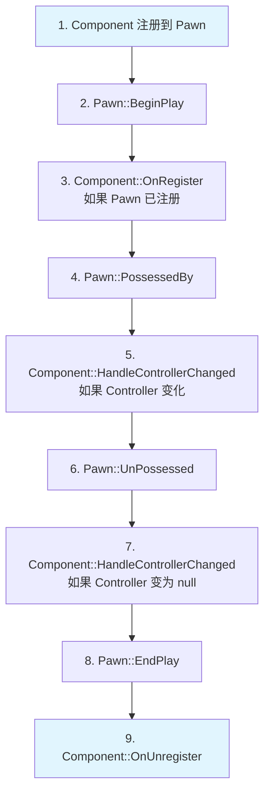
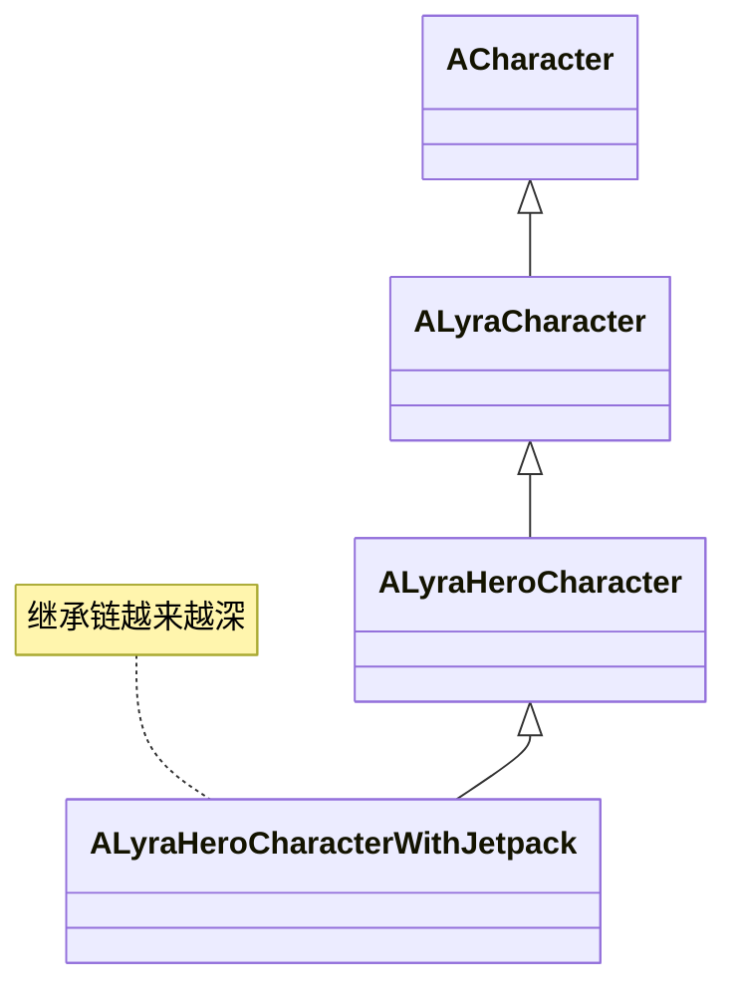
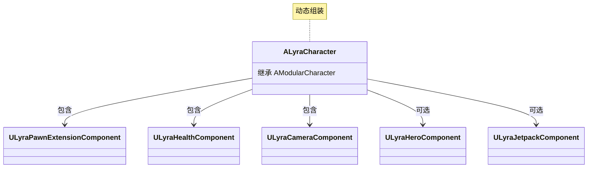

# 模块化游戏玩法（Modular Gameplay）

> UE5 的新架构模式，将功能分解为可复用的组件，替代传统的继承体系。

## 概述

模块化游戏玩法（Modular Gameplay）是 UE5 引入的新架构模式，核心思想是：
- **组合优于继承**：通过组件组合实现功能，而不是深层继承
- **功能解耦**：每个功能模块独立开发、测试、维护
- **动态组装**：运行时动态添加/移除功能模块

## 核心类

### ModularCharacter

**继承自**：`ACharacter`

**职责**：模块化的角色基类，可以附加多个 Pawn Component

**关键特性**：
- 自动注册/注销 Pawn Components
- 提供 Pawn Components 的初始化回调
- 支持运行时动态添加/移除组件

**Lyra 中的使用**：
```cpp
// ALyraCharacter 继承自 AModularCharacter
UCLASS()
class ALyraCharacter : public AModularCharacter, 
                      public IAbilitySystemInterface, 
                      public IGameplayCueInterface, 
                      public IGameplayTagAssetInterface, 
                      public ILyraTeamAgentInterface
{
    // ...
};
```

### ModularGameMode

**继承自**：`AGameModeBase`

**职责**：模块化的游戏模式基类，可以附加多个 Game Mode Components

**关键特性**：
- 自动注册/注销 Game Mode Components
- 提供 Game Mode 级别的功能扩展
- 支持模块化游戏逻辑

**Lyra 中的使用**：
```cpp
// ALyraGameMode 继承自 AModularGameModeBase
UCLASS()
class ALyraGameMode : public AModularGameModeBase
{
    // ...
};
```

### ModularGameState

**继承自**：`AGameStateBase`

**职责**：模块化的游戏状态基类，可以附加多个 Game State Components

**关键特性**：
- 自动注册/注销 Game State Components
- 提供全局游戏状态管理
- 支持模块化状态管理

**Lyra 中的使用**：
```cpp
// ALyraGameState 继承自 AModularGameState
UCLASS()
class ALyraGameState : public AModularGameState, 
                       public IAbilitySystemInterface
{
    // ...
};
```

### PawnComponent

**继承自**：`UActorComponent`

**职责**：可附加到 Pawn 的组件，实现特定功能

**关键特性**：
- 接收 Pawn 事件（Possessed、UnPossessed、Controller Changed 等）
- 可以访问 Pawn 的所有功能
- 支持模块化功能扩展

**Lyra 中的 Pawn Components**：
- `ULyraPawnExtensionComponent`：Pawn 扩展基础组件
- `ULyraHealthComponent`：生命值管理
- `ULyraCameraComponent`：相机控制
- `ULyraHeroComponent`：英雄角色特有功能
- `ULyraEquipmentManagerComponent`：装备管理
- `ULyraInventoryManagerComponent`：库存管理

### GameStateComponent

**继承自**：`UActorComponent`

**职责**：可附加到 Game State 的组件，实现全局功能

**关键特性**：
- 访问 Game State 和 Game Mode
- 管理全局游戏状态
- 支持模块化状态管理

**Lyra 中的 Game State Components**：
- `ULyraExperienceManagerComponent`：Experience 管理器

## 组件生命周期

### Pawn Component 生命周期



### 关键回调

**ULyraPawnExtensionComponent** 提供的关键回调：
```cpp
UCLASS()
class ULyraPawnExtensionComponent : public UPawnComponent
{
    // Pawn 准备初始化时调用
    virtual void OnPawnReadyToInitialize();
    
    // Controller 变化时调用
    virtual void HandleControllerChanged();
    
    // Player State 变化时调用
    virtual void HandlePlayerStateChanged();
    
    // Input 配置变化时调用
    virtual void HandleInputConfigChanged();
};
```

## 优势

### 1. 功能解耦

**传统继承方式**：



**模块化方式**：



### 2. 代码复用

- 组件可以在多个 Pawn 之间复用
- 避免代码重复
- 易于维护和扩展

### 3. 动态组装

- 运行时动态添加/移除组件
- 根据游戏状态调整功能
- 支持 Experience 系统动态配置

## 最佳实践

### 1. 创建新的 Pawn Component

```cpp
UCLASS()
class ULyraMyFeatureComponent : public UPawnComponent
{
    GENERATED_BODY()

public:
    virtual void BeginPlay() override
    {
        Super::BeginPlay();
        
        // 注册到 Pawn Extension Component
        if (ULyraPawnExtensionComponent* PawnExt = ULyraPawnExtensionComponent::FindPawnExtensionComponent(GetOwnerPawn()))
        {
            PawnExt->OnPawnReadyToInitialize.AddUObject(this, &ThisClass::OnPawnReadyToInitialize);
        }
    }

    virtual void EndPlay(const EEndPlayReason::Type EndPlayReason) override
    {
        // 清理资源
        
        Super::EndPlay(EndPlayReason);
    }

private:
    void OnPawnReadyToInitialize()
    {
        // Pawn 准备初始化，可以安全地访问 Ability System、Player State 等
    }
};
```

### 2. 在 Experience Action 中注册组件

```cpp
UCLASS()
class UGameFeatureAction_AddMyFeature : public UGameFeatureAction
{
    GENERATED_BODY()

protected:
    virtual void OnGameFeatureActivating() override
    {
        // 注册组件到 Pawn
        FGameFrameworkComponentManager::GetForActor(GetOwner())->RegisterComponentInitCallback(
            ULyraMyFeatureComponent::StaticClass(),
            FComponentInitDelegate::CreateUObject(this, &ThisClass::OnMyFeatureComponentInitialized)
        );
    }

    virtual void OnGameFeatureDeactivating() override
    {
        // 注销组件
    }

private:
    void OnMyFeatureComponentInitialized(UActorComponent* Component)
    {
        // 组件初始化完成，可以安全地使用
    }
};
```

## 相关页面

- [[10-architecture/overview]] - 架构概览
- [[10-architecture/subsystems/experience-system]] - 体验系统
- [[10-architecture/subsystems/ability-system]] - 能力系统
- [[20-modules/cpp/ULyraPawnExtensionComponent]] - Pawn 扩展组件详解

---
> 最后更新：2026-05-16

<!-- nav:auto -->

---

**导航**: ← [[10-architecture/subsystems/experience-system|experience-system]] · [[10-architecture/subsystems/ability-system|ability-system]] →

<!-- /nav:auto -->
