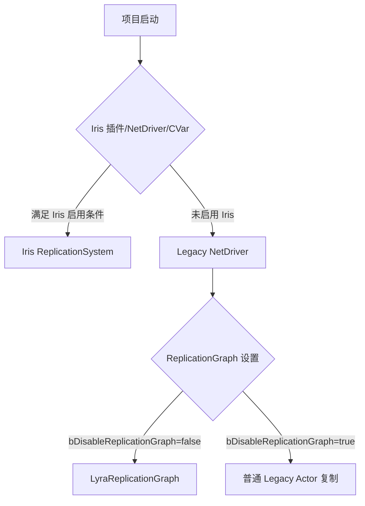
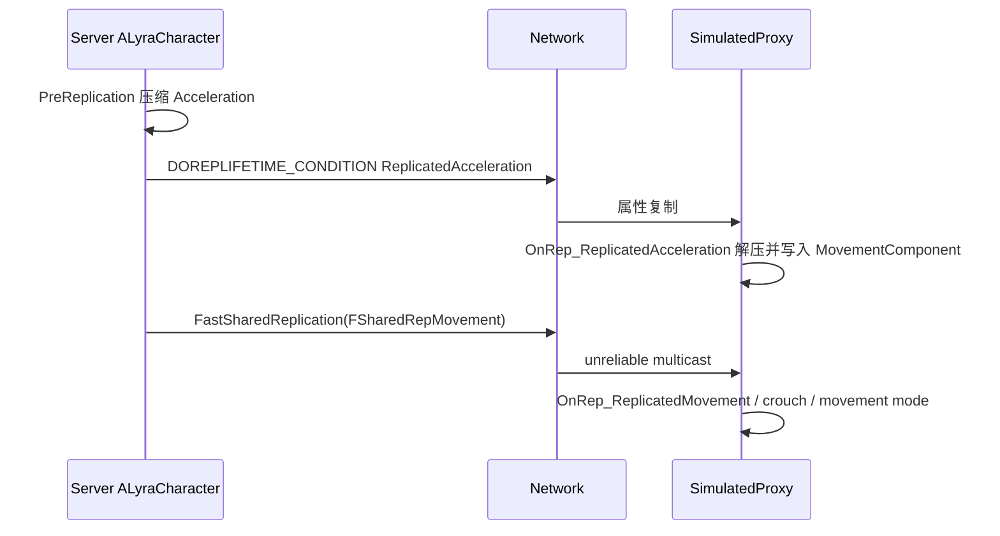

# Lyra 网络同步系统

> 本页记录 Lyra 项目当前网络同步架构事实。外部 UE 原理说明见 `[[30-tutorials/network-sync/00-UE网络通信总览]]`。

## 配置事实

| 项 | 当前状态 | 依据 |
|---|---|---|
| Iris 插件 | 已启用 | `LyraStarterGame.uproject` 中 `Iris` 插件 `Enabled=true` |
| Iris 构建支持 | 已启用 | `Source/LyraGame/LyraGame.Build.cs` 调用 `SetupIrisSupport(Target)` |
| Iris Descriptor 配置 | 已配置 | `DefaultEngine.ini` 的 `[/Script/IrisCore.ReplicationStateDescriptorConfig]` |
| Iris Bridge Filter | 已配置 | `DefaultEngine.ini` 的 `[/Script/IrisCore.ObjectReplicationBridgeConfig]` |
| ReplicationGraph | 有代码与配置，但默认禁用 | `DefaultGame.ini` 中 `bDisableReplicationGraph=True` |
| GameplayTag 快速复制 | 已启用 | `DefaultGameplayTags.ini` 中 `FastReplication=True` |
| SubObject registered list | 默认启用 | `DefaultEngine.ini` 中 `net.SubObjects.DefaultUseSubObjectReplicationList=1` |

## 运行时路径需要区分

Lyra 源码同时包含多种网络同步机制，不能只根据“代码存在”判断运行路径：

当前仓库事实是：Iris 插件和构建支持存在；RepGraph 代码存在但默认禁用。正式判断运行时是否走 Iris，还需要结合 NetDriver 定义、启动参数、CVar 与 PIE/DS 启动日志验证。

## Character 同步

`ALyraCharacter` 是项目内最重要的 Actor 复制样例：

- `ReplicatedAcceleration`：只复制给模拟代理（`COND_SimulatedOnly`），客户端 `OnRep_ReplicatedAcceleration` 解压后写入移动组件。
- `MyTeamID`：团队 ID 通过 `ReplicatedUsing=OnRep_MyTeamID` 同步，并触发团队变更广播。
- `PreReplication`：复制前压缩当前加速度，避免直接复制完整浮点向量。
- `FSharedRepMovement`：自定义 `NetSerialize`，用于快速共享移动路径。
- `FastSharedReplication`：`NetMulticast, unreliable`，用于跳过默认属性复制的帧上广播移动快照。

关键链路：

## PlayerState 与 GAS

`ALyraPlayerState` 持有 Lyra 的 ASC：

- 构造函数中 `AbilitySystemComponent->SetIsReplicated(true)`。
- 复制模式为 `EGameplayEffectReplicationMode::Mixed`。
- `SetNetUpdateFrequency(100.0f)`，说明 ASC 所在 PlayerState 需要较高同步频率。
- `PawnData`、连接类型、团队、Squad、视角旋转使用 PushModel 参数和 `MARK_PROPERTY_DIRTY_FROM_NAME`。
- `StatTags` 使用普通复制，配合 GameplayTag 网络复制配置。

这意味着 Lyra 的 GAS 网络状态主要挂在 PlayerState，而 Pawn/Character 通过 `PawnExtensionComponent` 绑定 Avatar。

## FastArray 模式

Lyra 使用 `FFastArraySerializer` 表达“数组元素级增量同步”：

| 容器 | 文件 | 复制内容 |
|---|---|---|
| `FLyraInventoryList` | `Inventory/LyraInventoryManagerComponent.*` | 背包条目、物品实例、堆叠数量 |
| `FLyraEquipmentList` | `Equipment/LyraEquipmentManagerComponent.*` | 已装备条目、装备实例、授予的 AbilitySet 句柄 |
| `FLyraVerbMessageReplication` | `Messages/LyraVerbMessageReplication.*` | Gameplay message 广播条目 |

共同模式：

1. Entry 继承 `FFastArraySerializerItem`。
2. List 继承 `FFastArraySerializer`。
3. List 实现 `NetDeltaSerialize`。
4. `TStructOpsTypeTraits` 设置 `WithNetDeltaSerializer=true`。
5. 服务端修改后调用 `MarkItemDirty` 或 `MarkArrayDirty`。
6. 客户端通过 `PostReplicatedAdd`、`PostReplicatedChange`、`PreReplicatedRemove` 驱动本地表现或消息。

## SubObject 复制

Inventory 与 Equipment 同时体现两条路径：

- 传统路径：重写 `ReplicateSubobjects(UActorChannel*, FOutBunch*, FReplicationFlags*)`，调用 `Channel->ReplicateSubobject`。
- Registered SubObject 路径：在 `ReadyForReplication` / 添加实例时调用 `AddReplicatedSubObject`，移除时调用 `RemoveReplicatedSubObject`。

由于 `DefaultEngine.ini` 设置了 `net.SubObjects.DefaultUseSubObjectReplicationList=1`，Lyra 的实现已经为 registered subobject list 做了适配。迁移 Iris 时，这部分是重点验证对象。

## ReplicationGraph

`ULyraReplicationGraph` 的注释明确说明：启用 RepGraph 后，`AActor::IsNetRelevantFor` 不再是主要路径，节点负责为每个连接生成待复制 Actor 列表。

Lyra 定义的关键节点：

- `UReplicationGraphNode_GridSpatialization2D`：空间网格节点。
- `UReplicationGraphNode_ActorList`：全局 always relevant 列表。
- `ULyraReplicationGraphNode_AlwaysRelevant_ForConnection`：每连接 always relevant。
- `ULyraReplicationGraphNode_PlayerStateFrequencyLimiter`：PlayerState 频率限制器。

但当前 `bDisableReplicationGraph=True`，所以这是一套“可启用的优化实现”，不是默认运行事实。

## Iris 配置

`DefaultEngine.ini` 的关键配置：

- `SupportsStructNetSerializerList=(StructName=LyraGameplayAbilityTargetData_SingleTargetHit)`：为 Lyra 自定义 TargetData 结构启用 Iris 支持。
- `ObjectReplicationBridgeConfig` 设置 `DefaultSpatialFilterName=Spatial`，但类级 `FilterConfigs` 会覆盖默认策略：`LevelScriptActor=NotRouted`、`Actor=None`、`Info=None`、`PlayerState=None`、`Pawn=Spatial`、`EntityActor.SimObject=None`。注意：`Actor` 被显式设为 `None`，不是 `Spatial`；只有 `Pawn` 明确使用空间过滤。

这表明 Lyra 已经为 Iris 做了项目级适配，但文档中仍需把“配置已存在”和“运行时路径”分开描述。

## Weapon TargetData 与预测

`ULyraGameplayAbility_RangedWeapon` 是 GAS 网络预测样例：

1. 本地客户端执行命中检测，生成 `FGameplayAbilityTargetDataHandle`。
2. 使用 `FScopedPredictionWindow` 绑定预测窗口。
3. 非权威本地端调用 `CallServerSetReplicatedTargetData` 发给服务器。
4. 服务器验证后通过 `ULyraWeaponStateComponent::ClientConfirmTargetData` 可靠 Client RPC 确认命中标记。
5. `FLyraGameplayAbilityTargetData_SingleTargetHit` 通过 `NetSerialize` 追加 `CartridgeID`。

## 项目级建议

- 新增可复制状态时，优先明确“状态权威端、目标客户端、同步频率、是否需要预测”。
- 对数组式 gameplay 状态，优先考虑 FastArray，而不是粗暴复制整个数组。
- 对动态 UObject，必须同时处理创建、注册、移除和生命周期；不要只写 Entry 指针。
- 启用 RepGraph 或 Iris 前，必须用专门地图验证 Join-in-progress、Dormancy、OwnerOnly、SubObject、FastArray、RPC 时序。

## 相关页面

- `[[70-topics/networking-and-synchronization]]`
- `[[10-architecture/data-flow/network-replication-flow]]`
- `[[30-tutorials/network-sync/06-ReplicationGraph与Lyra实践]]`
- `[[30-tutorials/network-sync/iris/00-Iris总览]]`

<!-- nav:auto -->

---

**导航**: ← [[10-architecture/subsystems/ability-system|ability-system]] · [[10-architecture/subsystems/ai-system|ai-system]] →

<!-- /nav:auto -->
