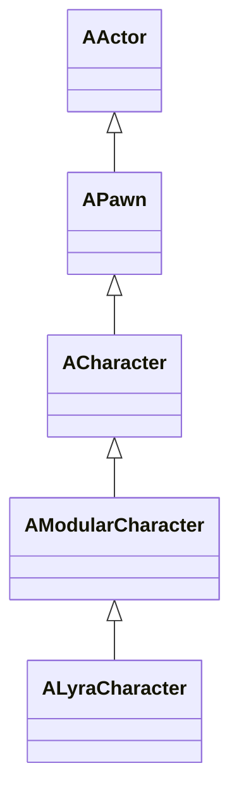
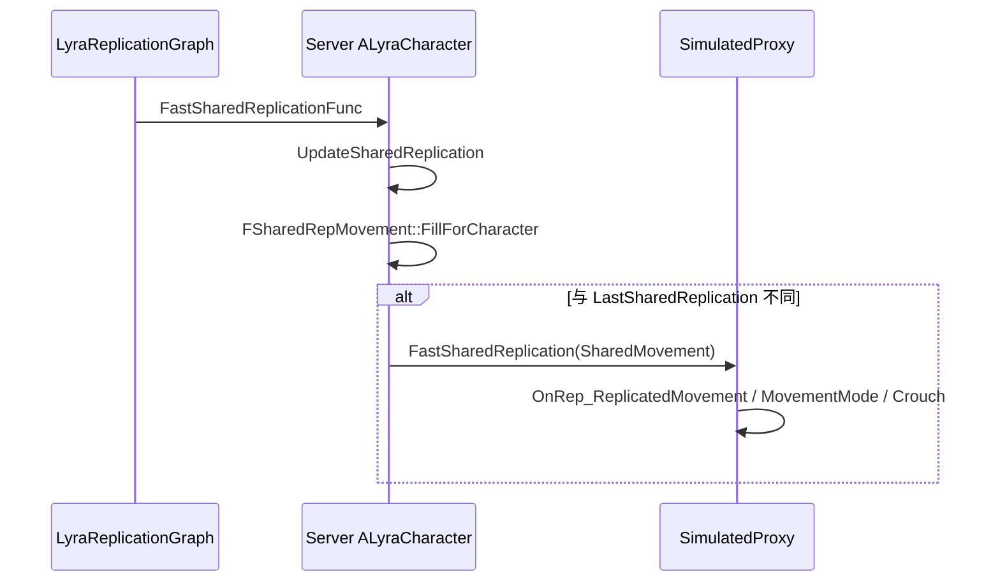

# ALyraCharacter

> Lyra 项目的核心角色类，继承自 `AModularCharacter`，集成了 Ability System、Camera、Health 等功能。

## 概述

`ALyraCharacter` 是 Lyra 项目中的基础角色类，负责：
- 实现 Ability System 接口
- 管理 Pawn Components（Extension、Health、Camera 等）
- 处理复制的加速度数据
- 管理死亡序列
- 实现团队代理接口

## 继承关系



## 实现的接口

- `IAbilitySystemInterface`：Ability System 接口
- `IGameplayCueInterface`：GameplayCue 接口
- `IGameplayTagAssetInterface`：Gameplay Tag 接口
- `ILyraTeamAgentInterface`：团队代理接口

## 关键属性

### 组件

```cpp
// Pawn 扩展组件
UPROPERTY(VisibleAnywhere, BlueprintReadOnly, Category = "Lyra|Character")
TObjectPtr<ULyraPawnExtensionComponent> PawnExtComponent;

// 生命值组件
UPROPERTY(VisibleAnywhere, BlueprintReadOnly, Category = "Lyra|Character")
TObjectPtr<ULyraHealthComponent> HealthComponent;

// 相机组件
UPROPERTY(VisibleAnywhere, BlueprintReadOnly, Category = "Lyra|Character")
TObjectPtr<ULyraCameraComponent> CameraComponent;
```

### 复制数据

```cpp
// 复制的加速度数据
UPROPERTY(Transient, ReplicatedUsing = OnRep_ReplicatedAcceleration)
FLyraReplicatedAcceleration ReplicatedAcceleration;

// 团队 ID
UPROPERTY(ReplicatedUsing = OnRep_MyTeamID)
FGenericTeamId MyTeamID;
```

## 关键函数

### 公共函数

```cpp
// 获取 Lyra Player Controller
UFUNCTION(BlueprintCallable, Category = "Lyra|Character")
ALyraPlayerController* GetLyraPlayerController() const;

// 获取 Lyra Player State
UFUNCTION(BlueprintCallable, Category = "Lyra|Character")
ALyraPlayerState* GetLyraPlayerState() const;

// 获取 Ability System Component
UFUNCTION(BlueprintCallable, Category = "Lyra|Character")
ULyraAbilitySystemComponent* GetLyraAbilitySystemComponent() const;
virtual UAbilitySystemComponent* GetAbilitySystemComponent() const override;

// 获取 Gameplay Tags
virtual void GetOwnedGameplayTags(FGameplayTagContainer& TagContainer) const override;
virtual bool HasMatchingGameplayTag(FGameplayTag TagToCheck) const override;
virtual bool HasAllMatchingGameplayTags(const FGameplayTagContainer& TagContainer) const override;
virtual bool HasAnyMatchingGameplayTags(const FGameplayTagContainer& TagContainer) const override;

// 切换蹲伏
void ToggleCrouch();
```

### 受保护函数

```cpp
// Ability System 初始化/反初始化
virtual void OnAbilitySystemInitialized();
virtual void OnAbilitySystemUninitialized();

// Pawn 事件
virtual void PossessedBy(AController* NewController) override;
virtual void UnPossessed() override;
virtual void OnRep_Controller() override;
virtual void OnRep_PlayerState() override;
virtual void NotifyControllerChanged() override;
virtual void SetupPlayerInputComponent(UInputComponent* PlayerInputComponent) override;

// 死亡处理
virtual void OnDeathStarted(AActor* OwningActor);
virtual void OnDeathFinished(AActor* OwningActor);
void DisableMovementAndCollision();
void DestroyDueToDeath();
void UninitAndDestroy();

// 移动模式变化
virtual void OnMovementModeChanged(EMovementMode PrevMovementMode, uint8 PreviousCustomMode) override;
virtual void OnStartCrouch(float HalfHeightAdjust, float ScaledHalfHeightAdjust) override;
virtual void OnEndCrouch(float HalfHeightAdjust, float ScaledHalfHeightAdjust) override;

// 跳跃
virtual bool CanJumpInternal_Implementation() const;
```

### 网络复制

`ALyraCharacter` 是 Lyra 网络同步专项里的核心 Actor 样例：普通属性复制、RepNotify、自定义 `NetSerialize`、unreliable multicast 和 RepGraph FastShared path 都能在这里观察到。

```cpp
// 快速共享复制（跳过默认属性复制的帧上调用）
UFUNCTION(NetMulticast, unreliable)
void FastSharedReplication(const FSharedRepMovement& SharedRepMovement);

// 生命周期复制属性
virtual void GetLifetimeReplicatedProps(TArray<FLifetimeProperty>& OutLifetimeProps) const override;
virtual void PreReplication(IRepChangedPropertyTracker& ChangedPropertyTracker) override;

// 更新共享复制
virtual bool UpdateSharedReplication();
```

## 数据结构

### FLyraReplicatedAcceleration

```cpp
// 加速度的压缩表示
USTRUCT()
struct FLyraReplicatedAcceleration
{
    // XY 加速度方向，量化为 [0, 2*pi]
    UPROPERTY()
    uint8 AccelXYRadians = 0;
    
    // XY 加速度大小，量化为 [0, MaxAcceleration]
    UPROPERTY()
    uint8 AccelXYMagnitude = 0;
    
    // Z 加速度，量化为 [-MaxAcceleration, MaxAcceleration]
    UPROPERTY()
    int8 AccelZ = 0;
};
```

### FSharedRepMovement

```cpp
// 用于发送快速共享移动更新的类型
USTRUCT()
struct FSharedRepMovement
{
    // 移动复制数据
    UPROPERTY(Transient)
    FRepMovement RepMovement;
    
    // 复制时间戳
    UPROPERTY(Transient)
    float RepTimeStamp = 0.0f;
    
    // 移动模式
    UPROPERTY(Transient)
    uint8 RepMovementMode = 0;
    
    // 是否应用跳跃力
    UPROPERTY(Transient)
    bool bProxyIsJumpForceApplied = false;
    
    // 是否蹲伏
    UPROPERTY(Transient)
    bool bIsCrouched = false;
};
```

## 使用方式

### 1. 创建自定义 Character 类

```cpp
UCLASS()
class ALyraHeroCharacter : public ALyraCharacter
{
    GENERATED_BODY()

public:
    ALyraHeroCharacter(const FObjectInitializer& ObjectInitializer = FObjectInitializer::Get());

protected:
    // 添加新的组件
    UPROPERTY(VisibleAnywhere, BlueprintReadOnly)
    TObjectPtr<ULyraHeroComponent> HeroComponent;
    
    // 重写初始化函数
    virtual void OnAbilitySystemInitialized() override;
    virtual void OnDeathStarted(AActor* OwningActor) override;
};
```

### 2. 配置 Input

```cpp
void ALyraHeroCharacter::SetupPlayerInputComponent(UInputComponent* PlayerInputComponent)
{
    Super::SetupPlayerInputComponent(PlayerInputComponent);
    
    // 设置 Lyra Input Component
    if (ULyraInputComponent* LyraIC = Cast<ULyraInputComponent>(PlayerInputComponent))
    {
        // 绑定 Input Actions
        // ...
    }
}
```

### 3. 处理死亡

```cpp
void ALyraHeroCharacter::OnDeathStarted(AActor* OwningActor)
{
    Super::OnDeathStarted(OwningActor);
    
    // 禁用输入
    if (AController* Controller = GetController())
    {
        DisableInput(Cast<APlayerController>(Controller));
    }
    
    // 播放死亡动画
    // ...
}
```

## 网络同步细节

| 机制 | 源码位置 | 说明 |
|---|---|---|
| `ReplicatedAcceleration` | `GetLifetimeReplicatedProps` | 使用 `DOREPLIFETIME_CONDITION(..., COND_SimulatedOnly)`，只发给模拟代理，避免主控端收到不必要加速度。 |
| `PreReplication` | `ALyraCharacter::PreReplication` | 复制前将 `CurrentAcceleration` 压缩为 3 个小字段：XY 方向、XY 幅度、Z 分量。 |
| `OnRep_ReplicatedAcceleration` | 客户端 RepNotify | 将压缩加速度解压并写入 `ULyraCharacterMovementComponent`。 |
| `FSharedRepMovement::NetSerialize` | `FSharedRepMovement` | 自定义移动快照序列化，携带 `FRepMovement`、时间戳、移动模式、跳跃力和蹲伏状态。 |
| `FastSharedReplication` | `NetMulticast, unreliable` | RepGraph fast shared path 使用的移动快照广播，适合可丢弃的移动表现优化，不承载权威 gameplay 状态。 |
| `MyTeamID` | `ReplicatedUsing=OnRep_MyTeamID` | 团队 ID 复制后广播团队变化。 |

### RepGraph FastShared Path

`ULyraReplicationGraph` 为 `ALyraCharacter` 设置 `FastSharedReplicationFunc`，调用 `ALyraCharacter::UpdateSharedReplication()`。该函数只在权威端填充 `FSharedRepMovement`，并与 `LastSharedReplication` 比较，变化时才调用 `FastSharedReplication`。



### Legacy / Iris 边界

- Legacy 下该 Actor 仍通过 `DOREPLIFETIME`、RepNotify、RPC 和 ActorChannel 复制。
- Iris 下高层声明仍可保留，但底层走 descriptor / fragment / serializer / DataStream；`FSharedRepMovement` 这类自定义序列化结构要重点验证 serializer 支持。
- 无论哪条路径，`FastSharedReplication` 是 unreliable，丢包后应依赖后续移动状态恢复。

## 最佳实践

### 1. 使用组件扩展功能

- 不要直接修改 `ALyraCharacter`，而是创建新的 Pawn Component
- 使用 `ULyraPawnExtensionComponent` 接收 Pawn 事件
- 在 Experience Action 中注册组件

### 2. 正确处理网络复制

- 使用 `FastSharedReplication` 优化移动复制
- 确保所有需要复制的属性都标记为 `Replicated` 或 `ReplicatedUsing`
- 在 `GetLifetimeReplicatedProps` 中注册复制属性

### 3. 实现 Ability System 接口

- 重写 `GetAbilitySystemComponent()` 返回正确的 ASC
- 在 `PossessedBy()` 中初始化 ASC（Server）
- 在 `OnRep_PlayerState()` 中初始化 ASC（Client）

## 相关页面

- [[10-architecture/overview]] - 架构概览
- [[10-architecture/subsystems/modular-gameplay]] - 模块化游戏玩法
- [[10-architecture/subsystems/ability-system]] - 能力系统
- [[20-modules/cpp/ULyraPawnExtensionComponent]] - Pawn 扩展组件
- [[20-modules/cpp/ULyraHealthComponent]] - 生命值组件
- [[20-modules/cpp/ULyraCameraComponent]] - 相机组件

---
> 最后更新：2026-05-16

<!-- nav:auto -->

---

**导航**: [[20-modules/cpp/ALyraGameMode|ALyraGameMode]] →

<!-- /nav:auto -->
