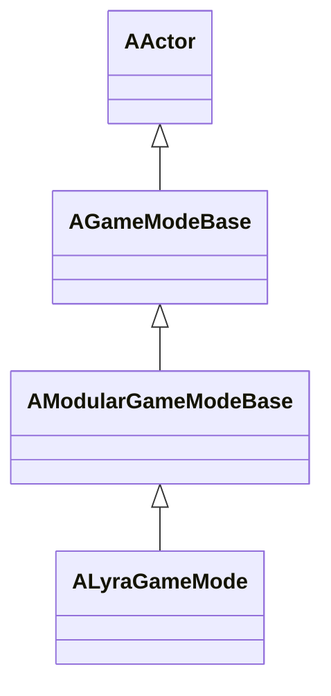
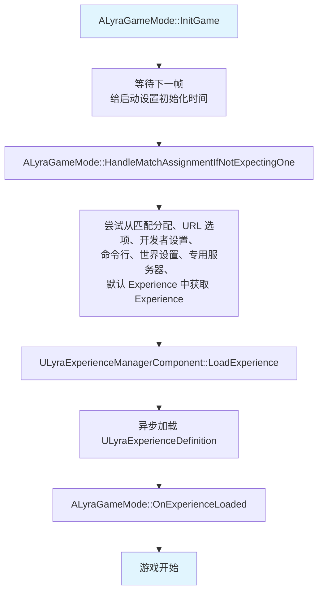
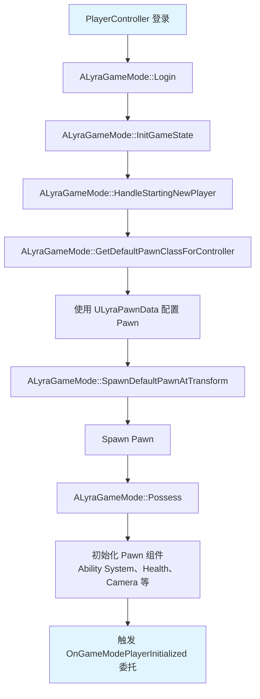
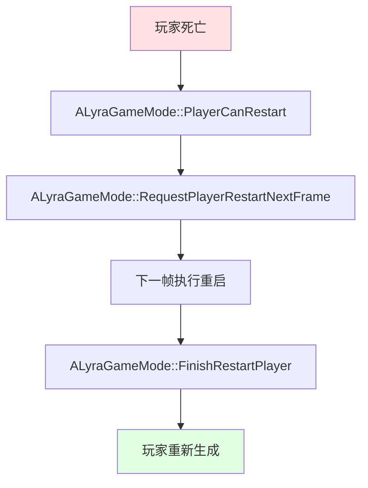

# ALyraGameMode

> Lyra 项目的基础游戏模式类，继承自 `AModularGameModeBase`，负责定义游戏规则和流程。

## 概述

`ALyraGameMode` 是 Lyra 项目中的基础游戏模式类，负责：
- 加载 Experience Definition
- 管理玩家登录和 Pawn 生成
- 处理游戏开始和结束
- 管理玩家重启（Respawn）
- 处理匹配分配

## 继承关系



## 关键属性

### 委托

```cpp
// 玩家登录事件，在玩家或 bot 加入游戏以及无缝和非无缝旅行后触发
DECLARE_MULTICAST_DELEGATE_TwoParams(FOnLyraGameModePlayerInitialized, 
                                     AGameModeBase* /*GameMode*/, 
                                     AController* /*NewPlayer*/);

// Delegate called on player initialization
FOnLyraGameModePlayerInitialized OnGameModePlayerInitialized;
```

## 关键函数

### 公共函数

```cpp
// 获取指定 Controller 的 Pawn Data
UFUNCTION(BlueprintCallable, Category = "Lyra|Pawn")
const ULyraPawnData* GetPawnDataForController(const AController* InController) const;

// 下一帧重启（重生）指定的玩家或 bot
// - 如果 bForceReset 为 true，Controller 将在本帧重置（放弃当前 Possessed 的 Pawn）
UFUNCTION(BlueprintCallable)
void RequestPlayerRestartNextFrame(AController* Controller, bool bForceReset = false);

// 通用的 PlayerCanRestart，可用于玩家 bot 和玩家
bool ControllerCanRestart(AController* Controller);
```

### AGameModeBase 接口重写

```cpp
virtual void InitGame(const FString& MapName, const FString& Options, FString& ErrorMessage) override;
virtual UClass* GetDefaultPawnClassForController_Implementation(AController* InController) override;
virtual APawn* SpawnDefaultPawnAtTransform_Implementation(AController* NewPlayer, const FTransform& SpawnTransform) override;
virtual bool ShouldSpawnAtStartSpot(AController* Player) override;
virtual void HandleStartingNewPlayer_Implementation(APlayerController* NewPlayer) override;
virtual AActor* ChoosePlayerStart_Implementation(AController* Player) override;
virtual void FinishRestartPlayer(AController* NewPlayer, const FRotator& StartRotation) override;
virtual bool PlayerCanRestart_Implementation(APlayerController* Player) override;
virtual void InitGameState() override;
virtual bool UpdatePlayerStartSpot(AController* Player, const FString& Portal, FString& OutErrorMessage) override;
virtual void GenericPlayerInitialization(AController* NewPlayer) override;
virtual void FailedToRestartPlayer(AController* NewPlayer) override;
```

### 受保护函数

```cpp
// Experience 加载完成时的回调
void OnExperienceLoaded(const ULyraExperienceDefinition* CurrentExperience);

// 检查 Experience 是否已加载
bool IsExperienceLoaded() const;

// 匹配分配给定时的回调
void OnMatchAssignmentGiven(FPrimaryAssetId ExperienceId, const FString& ExperienceIdSource);

// 如果没有期望的 Experience，处理匹配分配
void HandleMatchAssignmentIfNotExpectingOne();

// 尝试专用服务器登录
bool TryDedicatedServerLogin();

// 托管专用服务器匹配
void HostDedicatedServerMatch(ECommonSessionOnlineMode OnlineMode);

// 专用服务器初始化用户完成时的回调
UFUNCTION()
void OnUserInitializedForDedicatedServer(const UCommonUserInfo* UserInfo, 
                                        bool bSuccess, 
                                        FText Error, 
                                        ECommonUserPrivilege RequestedPrivilege, 
                                        ECommonUserOnlineContext OnlineContext);
```

## 工作流程

### 1. 初始化游戏



### 2. 玩家登录



### 3. 玩家重启（Respawn）



## 匹配分配优先级

`HandleMatchAssignmentIfNotExpectingOne()` 按以下优先级获取 Experience：

1. **匹配分配**（如果存在）
2. **URL 选项覆盖**
3. **开发者设置**（PIE  only）
4. **命令行覆盖**
5. **世界设置**
6. **专用服务器**
7. **默认 Experience**

## 使用方式

### 1. 创建自定义 Game Mode 类

```cpp
UCLASS()
class ALyraShooterGameMode : public ALyraGameMode
{
    GENERATED_BODY()

public:
    ALyraShooterGameMode(const FObjectInitializer& ObjectInitializer = FObjectInitializer::Get());

protected:
    // 重写玩家重启逻辑
    virtual bool PlayerCanRestart_Implementation(APlayerController* Player) override;
    
    // 重写 Pawn 生成逻辑
    virtual APawn* SpawnDefaultPawnAtTransform_Implementation(AController* NewPlayer, 
                                                           const FTransform& SpawnTransform) override;
};
```

### 2. 配置默认 Pawn Data

在 `ALyraGameMode` 中指定要使用的 Experience Definition：

```cpp
void ALyraShooterGameMode::InitGame(const FString& MapName, 
                                    const FString& Options, 
                                    FString& ErrorMessage)
{
    Super::InitGame(MapName, Options, ErrorMessage);
    
    // Experience 将在 HandleMatchAssignmentIfNotExpectingOne() 中加载
}
```

### 3. 处理玩家登录事件

```cpp
void ALyraShooterGameMode::HandleStartingNewPlayer_Implementation(APlayerController* NewPlayer)
{
    Super::HandleStartingNewPlayer_Implementation(NewPlayer);
    
    // 可以在这里执行自定义逻辑
    // 例如：分配队伍、初始化分数等
    
    // 触发委托
    OnGameModePlayerInitialized.Broadcast(this, NewPlayer);
}
```

## 最佳实践

### 1. 使用 Experience 系统

- 不要硬编码游戏逻辑到 Game Mode 中
- 使用 Experience Definition 配置游戏体验
- 通过 Game Feature 插件和 Experience Actions 扩展功能

### 2. 正确处理玩家重启

- 在 `PlayerCanRestart()` 中检查玩家是否可以重启
- 使用 `RequestPlayerRestartNextFrame()` 延迟重启，避免帧内冲突
- 在 `FinishRestartPlayer()` 中执行重启后的初始化

### 3. 支持专用服务器

- 实现 `TryDedicatedServerLogin()` 和 `HostDedicatedServerMatch()`
- 处理专用服务器的用户初始化
- 支持在线匹配分配

## 相关页面

- [[10-architecture/overview]] - 架构概览
- [[10-architecture/subsystems/experience-system]] - 体验系统
- [[20-modules/cpp/ULyraExperienceDefinition]] - Experience Definition 详解
- [[20-modules/cpp/ALyraGameState]] - 游戏状态详解

---
> 最后更新：2026-05-16

<!-- nav:auto -->

---

**导航**: ← [[20-modules/cpp/ALyraCharacter|ALyraCharacter]] · [[20-modules/cpp/ALyraGameState|ALyraGameState]] →

<!-- /nav:auto -->
