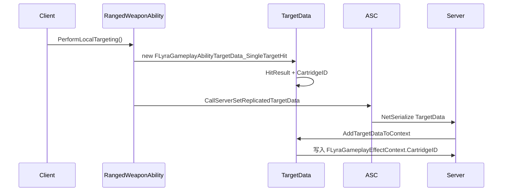

# FLyraGameplayAbilityTargetData_SingleTargetHit

> Lyra 对 `FGameplayAbilityTargetData_SingleTargetHit` 的项目扩展，用于武器命中 TargetData 中携带 cartridge 信息。

## 职责

`FLyraGameplayAbilityTargetData_SingleTargetHit` 负责：

- 继承 GAS 的 `FGameplayAbilityTargetData_SingleTargetHit`。
- 为每发弹丸/弹匣添加 `CartridgeID`。
- 在 `AddTargetDataToContext` 中把 `CartridgeID` 写入 `FLyraGameplayEffectContext`。
- 通过 `NetSerialize` 把 `CartridgeID` 随 TargetData 网络传输。
- 为 `FGameplayAbilityTargetDataHandle` 网络序列化声明 `WithNetSerializer=true`。

## 关键字段/函数

| 符号 | 网络意义 |
|---|---|
| `int32 CartridgeID` | 标识同一 cartridge 中的多次 hit。 |
| `NetSerialize(FArchive& Ar, UPackageMap* Map, bool& bOutSuccess)` | 先调用父类 hit result 序列化，再序列化 `CartridgeID`。 |
| `TStructOpsTypeTraits<...>::WithNetSerializer=true` | 允许 TargetDataHandle 网络序列化该结构。 |
| `GetScriptStruct()` | 返回当前结构类型，供 GAS TargetData 多态处理。 |
| `AddTargetDataToContext` | 将 `CartridgeID` 写入 Lyra 自定义 GE context。 |

## Iris 配置

`DefaultEngine.ini`：

```ini
[/Script/IrisCore.ReplicationStateDescriptorConfig]
+SupportsStructNetSerializerList=(StructName=LyraGameplayAbilityTargetData_SingleTargetHit)
```

UE5.7 源码语义：`SupportsStructNetSerializerList` 表示“即使该 struct 实现了自定义 `NetSerialize` / `NetDeltaSerialize`，仍允许使用默认 Iris `StructNetSerializer`”。因此这是 Lyra 为该 TargetData 结构做的 Iris 适配。

## 武器 TargetData 链路



## 常见坑

- 新增字段后必须同步更新 `NetSerialize`，否则客户端/服务端 TargetData 不一致。
- `NetSerialize` 当前返回 `true`，但没有显式设置 `bOutSuccess`；若未来序列化复杂对象，应谨慎处理失败状态。
- `CartridgeID` 由本地生成，若 gameplay 依赖严格唯一性，需要服务端校验。
- Iris 下自定义 TargetData 必须验证 descriptor config 与实际运行路径。

## 相关页面

- `[[20-modules/cpp/ULyraWeaponStateComponent]]`
- `[[30-tutorials/network-sync/iris/02-IrisNetSerializer]]`
- `[[30-tutorials/network-sync/iris/04-Iris属性复制与RPC流程]]`
- `[[30-tutorials/gas/24-GE上下文信息]]`

<!-- nav:auto -->

---

**导航**: ← [[20-modules/cpp/ULyraReplicationGraph|ULyraReplicationGraph]]

<!-- /nav:auto -->
