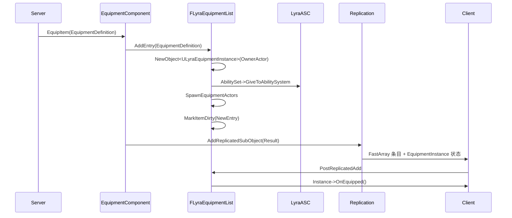
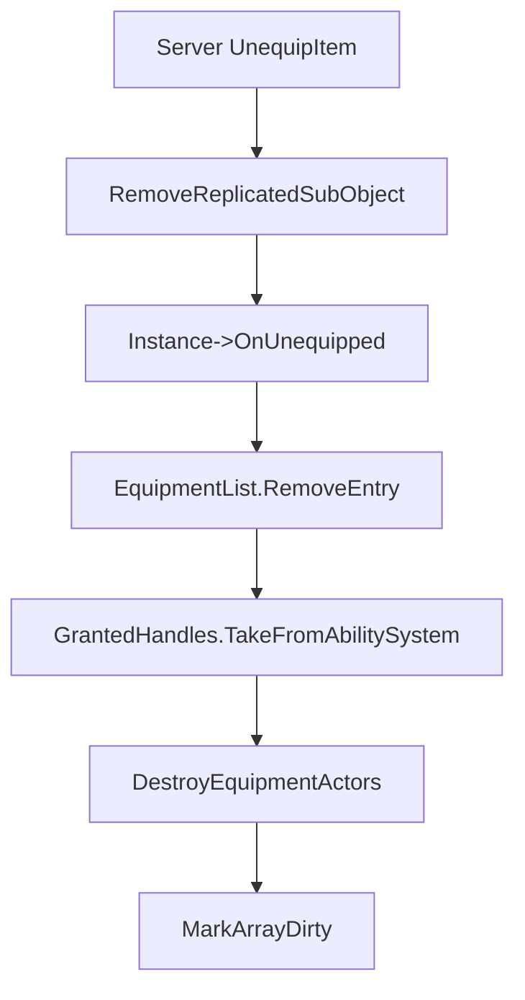

# ULyraEquipmentManagerComponent

> Lyra 的装备管理组件，展示 Equipment FastArray、SubObject 复制和 AbilitySet 授予的组合。

## 职责

`ULyraEquipmentManagerComponent` 负责：

- 服务端权威地装备 / 卸下装备。
- 用 `FLyraEquipmentList` 增量同步已装备条目。
- 创建并复制 `ULyraEquipmentInstance` 子对象。
- 装备时授予 AbilitySet，卸下时回收 AbilitySet。
- 让客户端通过 FastArray callback 触发 `OnEquipped` / `OnUnequipped` 表现。

## 核心结构

| 符号 | 网络意义 |
|---|---|
| `UPROPERTY(Replicated) FLyraEquipmentList EquipmentList` | 已装备列表复制入口。 |
| `FLyraAppliedEquipmentEntry : FFastArraySerializerItem` | 单个装备条目。 |
| `EquipmentDefinition` | 装备定义类。 |
| `Instance` | `ULyraEquipmentInstance` 子对象。 |
| `GrantedHandles` | `NotReplicated`，服务端保存授予 AbilitySet 的句柄。 |
| `FLyraEquipmentList::NetDeltaSerialize` | FastArray 增量复制。 |
| `PostReplicatedAdd` / `PreReplicatedRemove` | 客户端装备/卸装表现回调。 |
| `ReplicateSubobjects` | Legacy 子对象复制路径。 |
| `ReadyForReplication` / `AddReplicatedSubObject` / `RemoveReplicatedSubObject` | registered subobject list / Iris 迁移路径。 |

## EquipmentInstance 网络支持

`ULyraEquipmentInstance`：

- `IsSupportedForNetworking()` 返回 `true`。
- 复制 `Instigator` 与 `SpawnedActors`。
- `RegisterReplicationFragments` 调用 `FReplicationFragmentUtil::CreateAndRegisterFragmentsForObject`。
- `GetWorld()` 通过 owning pawn 获取 world，说明 Outer/owner 关系对生命周期很重要。

## 同步流程

## 卸装流程

## 常见坑

- AbilitySet 授予句柄是 authority-only，不复制到客户端。
- `SpawnedActors` 在 EquipmentInstance 中复制，但其本身是否需要复制/相关性取决于 spawned actor 类配置。
- 卸装时应先处理 SubObject 反注册，再更新 FastArray，避免客户端引用悬挂。
- `PostReplicatedChange` 当前没有实际逻辑；如果装备条目字段未来可变，需要补充客户端变化处理。
- `ULyraEquipmentInstance` 的 Outer 是 Pawn，迁移 Iris 时要验证 root/subobject 关系稳定。

## 相关页面

- `[[10-architecture/subsystems/networking-system]]`
- `[[30-tutorials/network-sync/05-RepLayoutFastArrayNetGUID]]`
- `[[30-tutorials/network-sync/iris/06-IrisObjectReplicationBridge与SubObject]]`

<!-- nav:auto -->

---

**导航**: ← [[20-modules/cpp/ULyraInventoryManagerComponent|ULyraInventoryManagerComponent]] · [[20-modules/cpp/ULyraWeaponInstance|ULyraWeaponInstance]] →

<!-- /nav:auto -->
