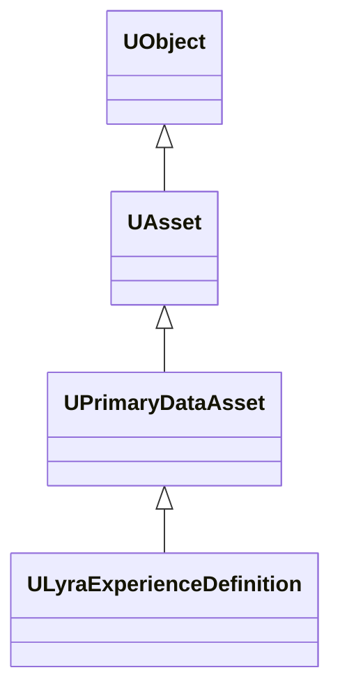
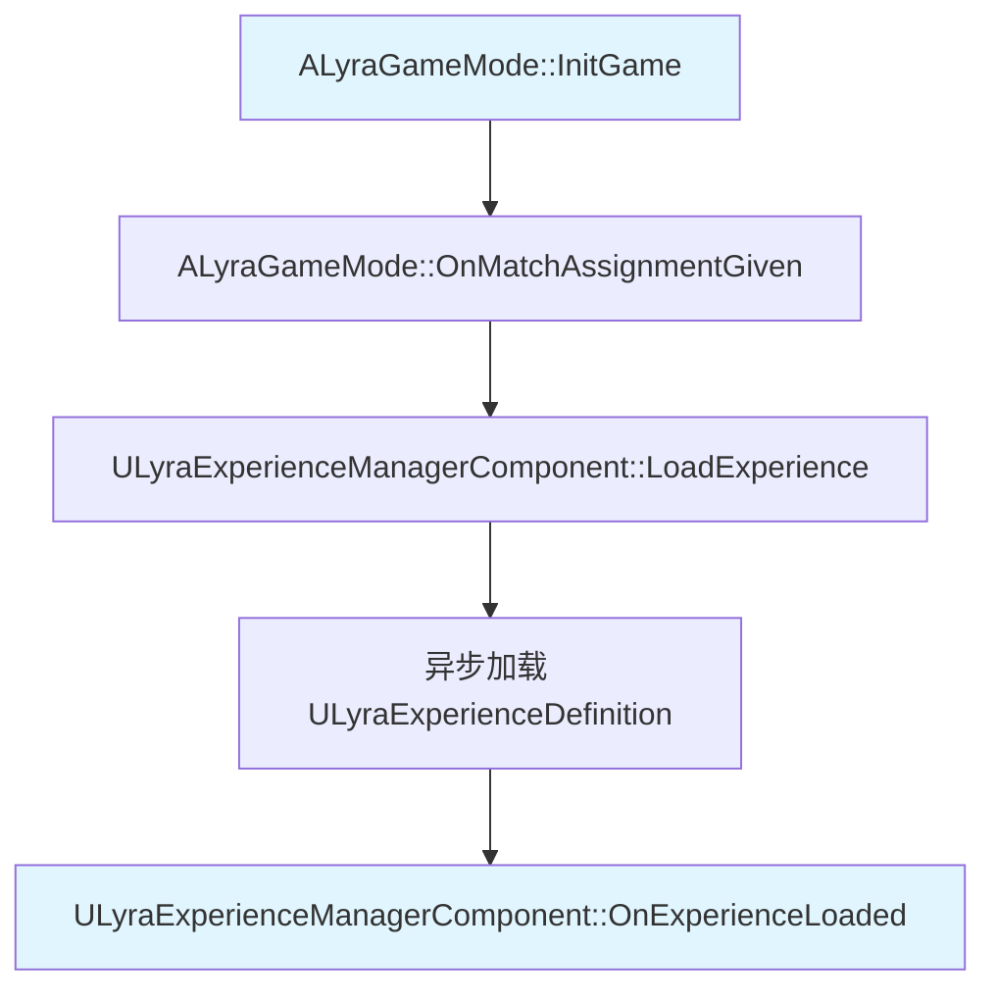
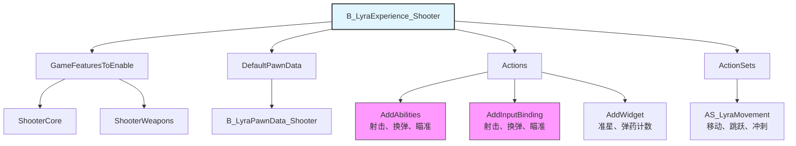

# ULyraExperienceDefinition

> Lyra 项目的核心数据资产，定义游戏的完整体验（Pawn、装备、UI、Input 等）。

## 概述

`ULyraExperienceDefinition` 是 Lyra 体验系统的核心，继承自 `UPrimaryDataAsset`，用于定义游戏的完整体验，包括：
- 启用哪些 Game Feature 插件
- 使用哪个 Pawn Data
- 执行哪些操作（添加 Ability、Input Binding、Widget 等）
- 附加哪些操作集

**核心理念**：将游戏逻辑从代码中解耦，通过数据驱动的方式配置游戏体验。

## 继承关系



## 关键属性

### Game Features

```cpp
// 要启用的游戏功能插件列表
UPROPERTY(EditDefaultsOnly, Category = Gameplay)
TArray<FString> GameFeaturesToEnable;
```

**说明**：列出需要启用的 Game Feature 插件名称。

**示例**：
```cpp
GameFeaturesToEnable.Add("ShooterCore");
GameFeaturesToEnable.Add("ShooterWeapons");
GameFeaturesToEnable.Add("CommonUI");
```

### Default Pawn Data

```cpp
// 默认 Pawn 数据
UPROPERTY(EditDefaultsOnly, Category = Gameplay)
TObjectPtr<const ULyraPawnData> DefaultPawnData;
```

**说明**：指定默认的 Pawn Data，用于配置 Pawn 的 Ability Sets、Input Config、Camera Mode 等。

### Actions

```cpp
// 加载/激活/停用/卸载时执行的操作列表
UPROPERTY(EditDefaultsOnly, Instanced, Category = "Actions")
TArray<TObjectPtr<UGameFeatureAction>> Actions;
```

**说明**：列出要执行的操作，这些操作在 Experience 加载/激活/停用/卸载时执行。

**内置的 Action 类型**：
- `UGameFeatureAction_AddAbilities`：添加 Ability
- `UGameFeatureAction_AddInputBinding`：添加 Input Binding
- `UGameFeatureAction_AddWidget`：添加 Widget
- `UGameFeatureAction_AddGameplayCuePath`：添加 GameplayCue 路径
- `UGameFeatureAction_SplitscreenConfig`：配置分屏

### Action Sets

```cpp
// 附加操作集
UPROPERTY(EditDefaultsOnly, Category = Gameplay)
TArray<TObjectPtr<ULyraExperienceActionSet>> ActionSets;
```

**说明**：列出要附加的操作集，这些操作集可以被多个 Experience 共享，实现逻辑复用。

## 关键函数

### UObject 接口

```cpp
#if WITH_EDITOR
// 验证数据有效性
virtual EDataValidationResult IsDataValid(class FDataValidationContext& Context) const override;
#endif
```

**说明**：在编辑器中验证 Experience Definition 的数据有效性，检查 Actions 是否为空等。

### UPrimaryDataAsset 接口

```cpp
#if WITH_EDITORONLY_DATA
// 更新资产包数据
virtual void UpdateAssetBundleData() override;
#endif
```

**说明**：更新资产包数据，将 Actions 中的附加资产添加到资产包中。

## 使用方式

### 1. 创建 Experience Definition 资产

**步骤**：
1. 在内容浏览器中右键 → `Miscellaneous` → `Data Asset`
2. 选择 `ULyraExperienceDefinition` 作为父类
3. 命名为 `B_LyraExperience_Default`

### 2. 配置 Experience

**GameFeaturesToEnable**：
```
ShooterCore
ShooterWeapons
CommonUI
```

**DefaultPawnData**：
```
B_LyraPawnData_Default
```

**Actions**：
```
AddAbilities (射击、换弹、瞄准)
AddInputBinding (射击、换弹、瞄准)
AddWidget (准星、弹药计数)
```

**ActionSets**：
```
AS_LyraMovement (移动、跳跃、冲刺)
```

### 3. 在 Game Mode 中使用

在 `ALyraGameMode` 中指定要使用的 Experience Definition：

```cpp
void ALyraGameMode::HandleMatchAssignmentIfNotExpectingOne()
{
    // 获取 Experience Id
    FPrimaryAssetId ExperienceId;
    FString ExperienceIdSource;
    
    // 从匹配分配、URL 选项、开发者设置、命令行、世界设置、专用服务器、默认 Experience 中获取
    // ...
    
    // 加载 Experience
    OnMatchAssignmentGiven(ExperienceId, ExperienceIdSource);
}
```

## 工作流程

### 1. 加载 Experience



### 2. 启用 Game Features

Experience Definition 中的 `GameFeaturesToEnable` 列出了需要启用的 Game Feature 插件：

```cpp
// ULyraExperienceDefinition
UPROPERTY(EditDefaultsOnly, Category = Gameplay)
TArray<FString> GameFeaturesToEnable;
```

**示例**：
```cpp
GameFeaturesToEnable.Add("ShooterCore");
GameFeaturesToEnable.Add("TopDownArena");
```

### 3. 执行 Actions

Experience Definition 中的 `Actions` 列出了要执行的操作：

```cpp
// ULyraExperienceDefinition
UPROPERTY(EditDefaultsOnly, Instanced, Category = "Actions")
TArray<TObjectPtr<UGameFeatureAction>> Actions;
```

**内置的 Action 类型**：
- `UGameFeatureAction_AddAbilities`：添加 Ability
- `UGameFeatureAction_AddInputBinding`：添加 Input Binding
- `UGameFeatureAction_AddWidget`：添加 Widget
- `UGameFeatureAction_AddGameplayCuePath`：添加 GameplayCue 路径
- `UGameFeatureAction_SplitscreenConfig`：配置分屏

### 4. 配置 Pawn

Experience Definition 中的 `DefaultPawnData` 定义了 Pawn 的数据：

```cpp
// ULyraPawnData
UCLASS()
class ULyraPawnData : public UPrimaryDataAsset
{
    // 默认 Pawn 类
    UPROPERTY(EditDefaultsOnly, Category = "Pawn")
    TSubclassOf<APawn> PawnClass;
    
    // 要应用的 Ability Sets
    UPROPERTY(EditDefaultsOnly, Category = "Abilities")
    TArray<TObjectPtr<ULyraAbilitySet>> AbilitySets;
    
    // 输入配置
    UPROPERTY(EditDefaultsOnly, Category = "Input")
    TObjectPtr<ULyraInputConfig> InputConfig;
    
    // 相机模式
    UPROPERTY(EditDefaultsOnly, Category = "Camera")
    TSubclassOf<ULyraCameraMode> DefaultCameraMode;
};
```

## 创建自定义 Experience

### 步骤

1. **创建 Experience Definition 资产**：
   - 在内容浏览器中右键 → `Miscellaneous` → `Data Asset`
   - 选择 `ULyraExperienceDefinition` 作为父类
   - 命名为 `B_LyraExperience_Default`

2. **配置 Experience**：
   - 在 `GameFeaturesToEnable` 中添加需要的 Game Feature 插件
   - 在 `DefaultPawnData` 中指定 Pawn Data
   - 在 `Actions` 中添加要执行的操作
   - 在 `ActionSets` 中添加可复用的操作集

3. **在 Game Mode 中使用**：
   - 在 `ALyraGameMode` 中指定要使用的 Experience Definition

### 示例：创建射击游戏 Experience



## 最佳实践

### 1. 模块化设计

- 将可复用的逻辑放到 `ULyraExperienceActionSet` 中
- 使用 Game Feature 插件封装独立功能
- 避免在 Experience Definition 中硬编码逻辑

### 2. 数据驱动

- 尽量通过数据配置游戏逻辑
- 减少 C++ 代码中的硬编码
- 使用 `TSoftClassPtr` 和 `TSoftObjectPtr` 实现软引用

### 3. 异步加载

- Experience 是异步加载的，需要处理加载完成前的状态
- 使用 `AsyncAction_ExperienceReady` 等待 Experience 加载完成
- 在 UI 中显示加载进度

## 相关页面

- [[10-architecture/overview]] - 架构概览
- [[10-architecture/subsystems/experience-system]] - 体验系统
- [[20-modules/cpp/ALyraGameMode]] - 游戏模式详解
- [[20-modules/cpp/ULyraPawnData]] - Pawn 数据详解
- [[20-modules/cpp/ULyraExperienceActionSet]] - Experience 操作集详解

---
> 最后更新：2026-05-16

<!-- nav:auto -->

---

**导航**: ← [[20-modules/cpp/ALyraPlayerState|ALyraPlayerState]] · [[20-modules/cpp/ULyraExperienceActionSet|ULyraExperienceActionSet]] →

<!-- /nav:auto -->
