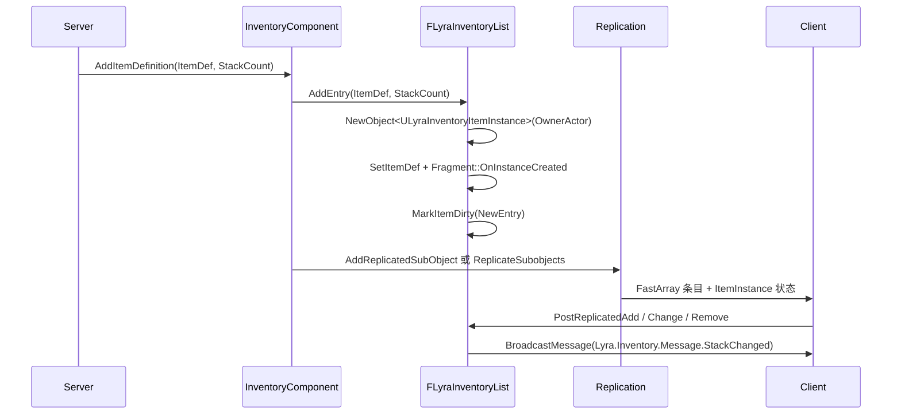

# ULyraInventoryManagerComponent

> Lyra 的背包状态管理组件，展示 FastArray + replicated SubObject 的组合模式。

## 职责

`ULyraInventoryManagerComponent` 负责：

- 在服务端权威地添加、移除、消费物品。
- 用 `FFastArraySerializer` 增量同步背包条目。
- 创建并复制 `ULyraInventoryItemInstance` 子对象。
- 在客户端 FastArray 回调中通过 `UGameplayMessageSubsystem` 广播背包变化。
- 将“列表结构同步”和“物品 UObject 状态同步”拆开。

## 核心结构

| 符号 | 网络意义 |
|---|---|
| `UPROPERTY(Replicated) FLyraInventoryList InventoryList` | 背包列表的复制入口。 |
| `FLyraInventoryEntry : FFastArraySerializerItem` | 单个背包条目。 |
| `FLyraInventoryEntry::Instance` | 指向 `ULyraInventoryItemInstance` 子对象。 |
| `FLyraInventoryEntry::StackCount` | 堆叠数量，随 FastArray 条目复制。 |
| `FLyraInventoryEntry::LastObservedCount` | `NotReplicated`，客户端用于计算变化差量。 |
| `FLyraInventoryList::NetDeltaSerialize` | 调用 `FastArrayDeltaSerialize` 做增量复制。 |
| `PostReplicatedAdd/Change`、`PreReplicatedRemove` | 客户端回调，驱动本地消息广播。 |
| `ReplicateSubobjects` | Legacy 子对象复制路径。 |
| `ReadyForReplication` / `AddReplicatedSubObject` | registered subobject list / Iris 迁移路径。 |

## ItemInstance 网络支持

`ULyraInventoryItemInstance`：

- `IsSupportedForNetworking()` 返回 `true`。
- 复制 `StatTags` 与 `ItemDef`。
- `RegisterReplicationFragments` 调用 `FReplicationFragmentUtil::CreateAndRegisterFragmentsForObject`，为 Iris 创建 fragments。

这说明物品实例不是只靠 FastArray Entry 指针同步，而是独立作为网络子对象同步。

## 同步流程

## 常见坑

- `AddItemDefinition` / `RemoveItemInstance` 是 `BlueprintAuthorityOnly`，写操作应在服务端做。
- FastArray 只同步条目结构；`ULyraInventoryItemInstance` 内部状态必须通过 SubObject 复制同步。
- `FLyraInventoryList::AddEntry(ULyraInventoryItemInstance*)` 当前是 `unimplemented()`，不要依赖该路径。
- `CanAddItemDefinition()` 当前总是 `true`，没有实现容量、唯一性、堆叠上限。
- `GetTotalItemCountByDefinition()` 当前按条目数累加，不是累加 `StackCount`。
- `ConsumeItemsByDefinition()` 直接从 `InventoryList` 删除条目，若未来扩展 SubObject 生命周期，要确保同步调用 `RemoveReplicatedSubObject`。

## 相关页面

- `[[10-architecture/subsystems/networking-system]]`
- `[[30-tutorials/network-sync/05-RepLayoutFastArrayNetGUID]]`
- `[[30-tutorials/network-sync/iris/06-IrisObjectReplicationBridge与SubObject]]`

<!-- nav:auto -->

---

**导航**: ← [[20-modules/cpp/ULyraAbilitySet|ULyraAbilitySet]] · [[20-modules/cpp/ULyraEquipmentManagerComponent|ULyraEquipmentManagerComponent]] →

<!-- /nav:auto -->
