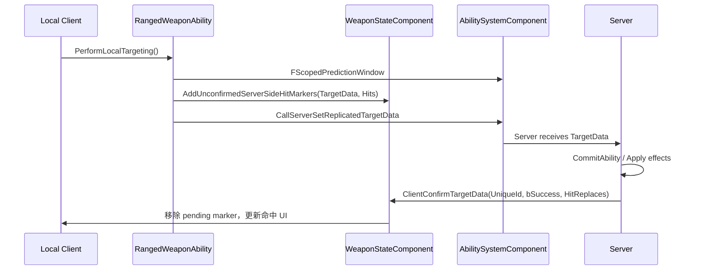

# ULyraWeaponStateComponent

> Controller 上的武器状态组件，负责命中标记确认和本地武器 tick，是 Lyra 武器 TargetData 预测链路的重要一环。

## 职责

`ULyraWeaponStateComponent` 负责：

- 作为 replicated ControllerComponent 存在于 Controller 上。
- 记录本地尚未被服务器确认的命中标记。
- 通过 reliable Client RPC 接收服务器确认。
- 根据确认结果更新屏幕命中提示和最近伤害时间。
- 每帧 tick 当前 ranged weapon instance。

## 关键网络符号

| 符号 | 网络意义 |
|---|---|
| `SetIsReplicatedByDefault(true)` | 组件默认参与复制。 |
| `ClientConfirmTargetData(uint16 UniqueId, bool bSuccess, const TArray<uint8>& HitReplaces)` | reliable Client RPC，服务器确认客户端提交的 TargetData。 |
| `UnconfirmedServerSideHitMarkers` | 客户端本地未确认命中标记缓存，不复制。 |
| `AddUnconfirmedServerSideHitMarkers` | 客户端本地预测命中后记录待确认 UI 数据。 |
| `UpdateDamageInstigatedTime` | 服务端/客户端命中确认后更新最近伤害时间。 |

## TargetData 预测链路

## ClientConfirmTargetData

`ClientConfirmTargetData_Implementation` 会：

1. 按 `UniqueId` 查找 `UnconfirmedServerSideHitMarkers`。
2. 根据 `bSuccess` 和 `HitReplaces` 过滤被服务器替换/无效的命中。
3. 对成功命中调用 `ActuallyUpdateDamageInstigatedTime`。
4. 将成功命中写入 `LastWeaponDamageScreenLocations`。
5. 移除已确认的 batch。

## 常见坑

- `UnconfirmedServerSideHitMarkers` 是本地缓存，不是权威状态。
- `ClientConfirmTargetData` 是 reliable，但不能高频无限堆积。
- `UniqueId` 来自 TargetData，用于关联本地预测和服务端确认；复用或溢出需要测试。
- 命中 UI 成功不等于服务端一定造成伤害。源码现状：`ShouldShowHitAsSuccess` 主要基于队伍伤害关系，尚未过滤“命中但未造成伤害”的情况；`ShouldUpdateDamageInstigatedTime` 也仍按 `EffectCauser != nullptr` 的宽松条件更新。这是已知限制，不是网络确认已经等价于最终伤害结算。
- TargetData 预测链依赖 `PredictionKey` 被正确消费，否则可能出现旧数据回调。

## 相关页面

- `[[30-tutorials/network-sync/iris/04-Iris属性复制与RPC流程]]`
- `[[30-tutorials/gas/23-PredictionKey预判机制]]`
- `[[20-modules/cpp/FLyraGameplayAbilityTargetData_SingleTargetHit]]`

<!-- nav:auto -->

---

**导航**: ← [[20-modules/cpp/ULyraWeaponInstance|ULyraWeaponInstance]] · [[20-modules/cpp/ULyraReplicationGraph|ULyraReplicationGraph]] →

<!-- /nav:auto -->
