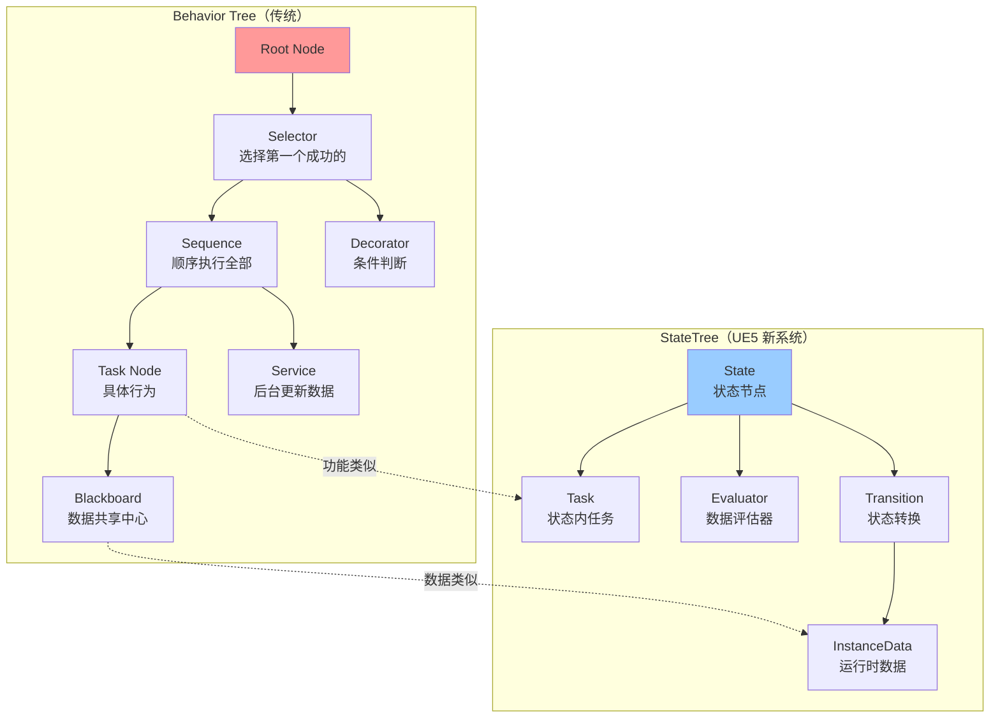
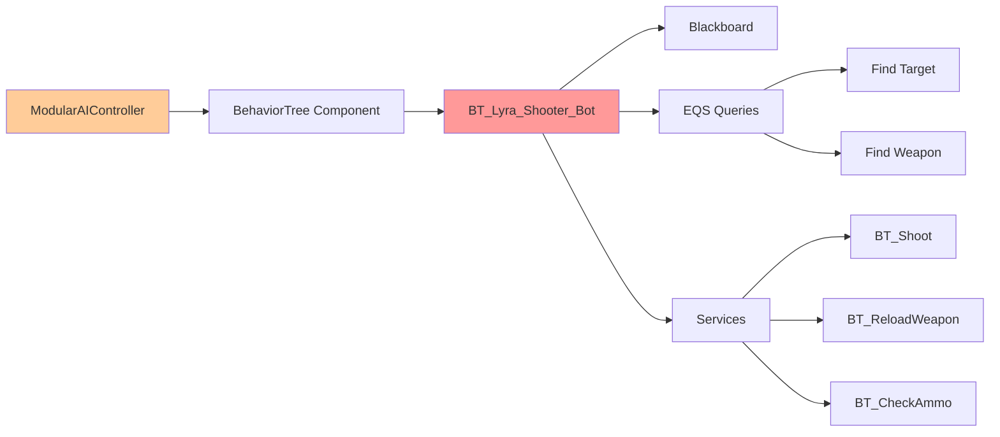
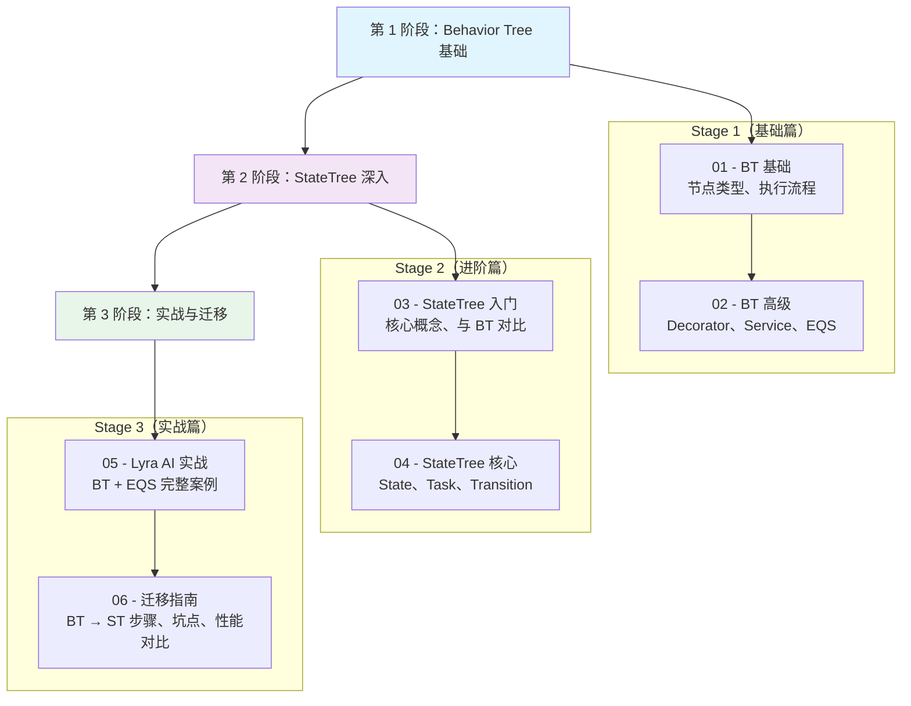

# BehaviorTree与StateTreeAI决策系统完全指南

> 从传统行为树到 UE5 新状态树，系统掌握 UE AI 决策系统的选型、使用与迁移。

---

## 概述

在游戏 AI 开发中，**决策系统**负责控制 NPC 的行为逻辑：
- 敌人如何追击玩家？
- Bot 如何选择武器和瞄准？
- 队友如何配合玩家行动？

UE 提供了两套决策系统：

| 系统 | 定位 | UE 版本 |
|------|------|---------|
| **Behavior Tree（传统行为树）** | UE4 继承的经典框架 | UE4.0+ |
| **StateTree（状态树）** | UE5 引入的新一代框架 | UE5.0+ |

**本系列将系统讲解**：
1. Behavior Tree 的核心机制与使用场景
2. StateTree 的事件驱动架构与性能优势
3. 两者的对比、选型建议与迁移指南

---

## 核心概念全景图



### 两者核心区别

| 维度 | Behavior Tree | StateTree |
|------|---------------|------------|
| **执行模型** | 每帧从 Root 遍历 | 事件驱动，只执行活跃状态 |
| **状态管理** | 隐式（通过节点执行状态） | 显式（State 明确声明） |
| **性能** | 较差（100+ AI 卡顿） | 优秀（事件触发，不轮询） |
| **数据绑定** | Blackboard（全局键值对） | InstanceData（结构化数据） |
| **学习曲线** | 平缓（直观树状结构） | 较陡（状态机 + 任务组合） |
| **Lyra 使用** | ✅ 实际使用 | ❌ 未使用（但文档提到） |

---

## 与 Lyra 项目的关系

### Lyra 的 AI 架构（实际实现）



### 关键文件映射

| 组件 | 文件路径 | 说明 |
|------|----------|------|
| **AI 控制器** | `Plugins/GameFeatures/ShooterCore/Content/Bot/B_AI_Controller_LyraShooter.uasset` | 主动攻击型 Bot |
| **行为树** | `Plugins/GameFeatures/ShooterCore/Content/Bot/BT/BT_Lyra_Shooter_Bot.uasset` | 主行为树 |
| **黑板** | `Plugins/GameFeatures/ShooterCore/Content/Bot/BT/BB_Lyra_Shooter_Bot.uasset` | 黑板数据 |
| **EQS 查询** | `Plugins/GameFeatures/ShooterCore/Content/Bot/EQS/` | 环境查询（找目标、武器等） |
| **服务** | `Plugins/GameFeatures/ShooterCore/Content/Bot/Services/` | 射击、装弹、检查弹药 |

### 为什么 Lyra 没有用 StateTree？

1. **历史原因**：Lyra 最初基于 UE5.0 开发，当时 StateTree 还不够成熟
2. **稳定性**：BehaviorTree 是经过大规模验证的成熟方案
3. **教学资源**：BehaviorTree 文档丰富，学习曲线平缓

**但是**，StateTree 是 UE AI 的未来方向，新项目建议优先考虑。

---

## 系列阅读指南

### 学习路径（3 个阶段）



### 每篇摘要

| 课时 | 标题 | 核心内容 | 难度 |
|------|------|---------|------|
| `00` | **本页** | 系列概览、全景图、学习路线 | ⭐ |
| `01` | **Behavior Tree 基础** | 节点类型、执行流程、Blackboard | ⭐⭐ |
| `02` | **Behavior Tree 高级** | Decorator、Service、EQS 集成 | ⭐⭐⭐ |
| `03` | **StateTree 入门** | 核心概念、与 BT 对比、适用场景 | ⭐⭐ |
| `04` | **StateTree 核心** | State、Task、Transition、Evaluator | ⭐⭐⭐ |
| `05` | **Lyra AI 实战** | BT + EQS 完整案例、模块化架构 | ⭐⭐⭐ |
| `06` | **迁移指南** | BT → ST 步骤、坑点、性能对比 | ⭐⭐⭐⭐ |

---

## 前置知识

本系列假设你已经了解：

- ✅ **C++ 基础**（类、继承、指针）
- ✅ **UE 框架基础**（Actor、Component、Controller）— 详见 [[30-tutorials/ue-framework/00-UE框架概述]]
- ✅ **AI 基本概念**（寻路、感知、决策）

如果你不熟悉 UE 框架，请先完成 **UE 框架系列** 的前 4 篇。

---

## 源码参考路径（UE 5.7）

### Behavior Tree 源码

```text
Engine/Source/Runtime/AIModule/
├── Classes/BehaviorTree/
│   ├── BTNode.h                # UBTNode 基类
│   ├── BTTaskNode.h            # UBTTaskNode 任务节点
│   ├── BTDecorator.h          # UBTDecorator 装饰器
│   ├── BTService.h            # UBTService 服务
│   ├── BTCompositeNode.h      # UBTCompositeNode 复合节点
│   ├── BehaviorTreeComponent.h # UBehaviorTreeComponent 组件
│   └── BlackboardComponent.h  # UBlackboardComponent 黑板
└── Private/BehaviorTree/
    └── BehaviorTreeComponent.cpp # 核心实现
```

### StateTree 源码

```text
Engine/Plugins/Runtime/StateTree/
├── Source/StateTreeModule/Public/
│   ├── StateTree.h                # UStateTree 资产定义
│   ├── StateTreeInstanceData.h    # FStateTreeInstanceData 运行时数据
│   ├── StateTreeExecutionContext.h # FStateTreeExecutionContext 执行上下文
│   ├── StateTreeNodeBase.h        # FStateTreeNodeBase 节点基类
│   ├── StateTreeTaskBase.h        # FStateTreeTaskBase Task 基类
│   └── StateTreeEvaluatorBase.h   # FStateTreeEvaluatorBase Evaluator 基类
└── Source/GameplayStateTreeModule/Public/Components/
    └── StateTreeComponent.h       # UStateTreeComponent 组件
```

### Lyra AI 源码

```text
Plugins/GameFeatures/ShooterCore/Content/Bot/
├── B_AI_Controller_LyraShooter.uasset          # AI 控制器
├── BT/BT_Lyra_Shooter_Bot.uasset              # 行为树
├── BT/BB_Lyra_Shooter_Bot.uasset              # 黑板
├── EQS/                                        # 环境查询
└── Services/                                   # 服务
```

---

## 相关页面

- [[30-tutorials/ue-framework/50-player-system/01-AController详解]] - UE 控制器详解（AIController 基础）
- [[30-tutorials/ue-framework/00-UE框架概述]] - UE 框架总览（前置知识）

---

## 导航

> 📖 **本页是系列概览页**，无上一课。
> 
> 👉 **下一课**：[[30-tutorials/ai-behavior/01-BehaviorTree基础节点类型与执行流程|Behavior Tree 基础（节点类型与执行流程）]]

<!-- nav:auto -->

---

**导航**: [[30-tutorials/ai-behavior/01-BehaviorTree基础节点类型与执行流程|01-BehaviorTree基础节点类型与执行流程]] →

<!-- /nav:auto -->
