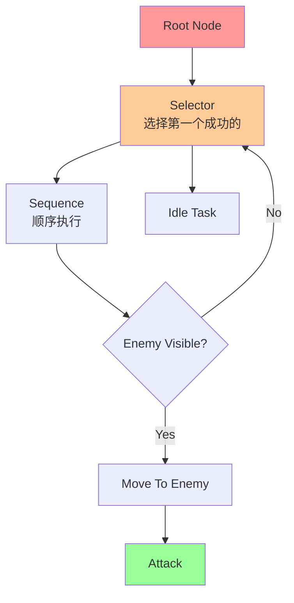
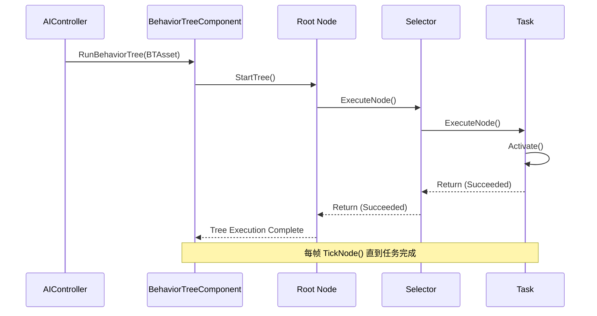
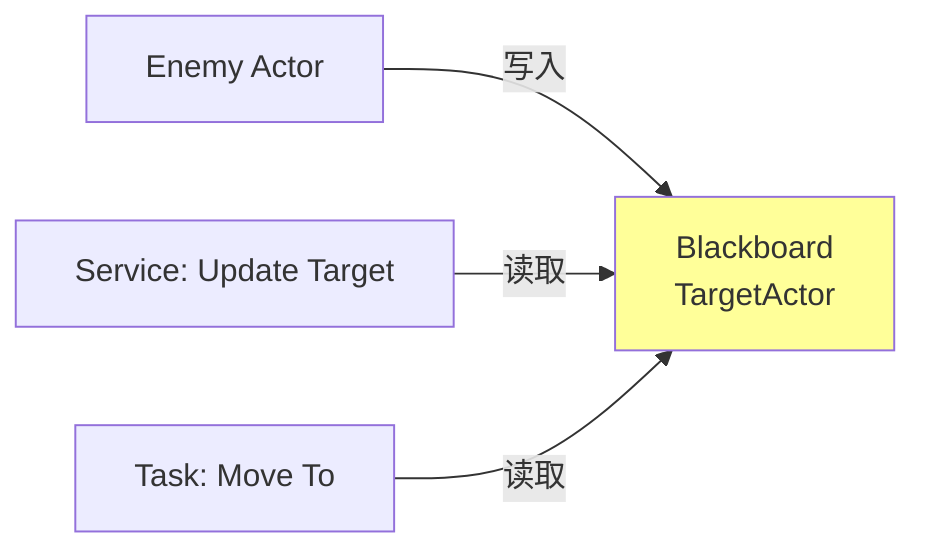

# BehaviorTree基础节点类型与执行流程

> 学习 UE 传统行为树的核心概念：节点类型、执行流程、Blackboard 基础。

---

## 概述

本课将系统讲解 Behavior Tree（行为树）的基础知识：

1. **核心概念** — 什么是行为树？与状态机的区别？
2. **节点类型** — Composite、Task、Decorator、Service
3. **执行流程** — 从 Root 到 Leaf 的遍历机制
4. **Blackboard 基础** — 数据共享中心

学完本课，你将能够：
- ✅ 理解行为树的设计理念
- ✅ 创建简单的行为树资产
- ✅ 配置 Blackboard 并实现基础 AI 逻辑

---

## 核心概念

### 什么是 Behavior Tree？

**概念直觉**：
> 行为树就像 **决策流程图** — 从根节点开始，根据条件选择分支，执行具体任务。



### 与状态机（FSM）的对比

| 维度 | 行为树（BT） | 有限状态机（FSM） |
|------|---------------|-----------------|
| **结构** | 树状层次 | 平面状态转换 |
| **扩展性** | 易于添加新行为 | 状态多时转换爆炸 |
| **可调试** | 可视化树，易于理解 | 状态转换图复杂 |
| **性能** | 每帧遍历，开销较大 | 事件驱动，性能较好 |

---

## 节点类型详解

### 1. Composite Nodes（复合节点）

**作用**：控制子节点的执行顺序。

| 节点类型 | 行为 | 类比 |
|---------|------|------|
| **Selector（选择器）** | 按顺序执行子节点，**第一个成功就返回成功** | "做最优先能做成的" |
| **Sequence（序列）** | 按顺序执行子节点，**一个失败就返回失败** | "一步步完成，一步失败就放弃" |
| **Simple Parallel（简单并行）** | 同时执行主任务和副任务 | "边走边看" |

**源码位置**：
```
Engine/Source/Runtime/AIModule/Classes/BehaviorTree/BTCompositeNode.h
```

**示例**：
```cpp
// UBTCompositeNode 是复合节点基类
UCLASS(Abstract)
class UBTCompositeNode : public UBTNode
{
    // 子节点列表
    TArray<FBTCompositeChild> Children;
    
    // 执行子节点
    virtual int32 GetNextChildHandler(FBehaviorTreeSearchData& SearchData, int32 PrevChildIndx, EBTNodeResult::Type LastResult) const;
};
```

### 2. Task Nodes（任务节点）

**作用**：执行具体的行为（移动、攻击、等待等）。

**常用内置 Task**：
| 节点 | 作用 |
|------|------|
| `BTTask_RunBehavior` | 运行子行为树 |
| `BTTask_Wait` | 等待指定时间 |
| `BTTask_MoveTo` | 移动到目标位置 |
| `BTTask_FinishWithResult` | 强制返回指定结果 |

**源码位置**：
```
Engine/Source/Runtime/AIModule/Classes/BehaviorTree/BTTaskNode.h
```

### 3. Decorator Nodes（装饰器节点）

**作用**：在节点执行**前**进行条件判断，决定是否执行。

**常用内置 Decorator**：
| 节点 | 作用 |
|------|------|
| `BTDecorator_ForceSuccess` | 强制返回成功 |
| `BTDecorator_ForceFailure` | 强制返回失败 |
| `BTDecorator_Conditional` | 基于 Blackboard 键值判断 |
| `BTDecorator_TimeLimit` | 时间限制 |

**源码位置**：
```
Engine/Source/Runtime/AIModule/Classes/BehaviorTree/BTDecorator.h
```

### 4. Service Nodes（服务节点）

**作用**：在行为树**运行期间**持续执行后台逻辑（如更新 Blackboard 数据）。

**常用内置 Service**：
| 节点 | 作用 |
|------|------|
| `BTService_BlueprintBase` | 蓝图可重写的 Service 基类 |
| `BTService_DefaultFocus` | 设置 AI 焦点 |

**源码位置**：
```
Engine/Source/Runtime/AIModule/Classes/BehaviorTree/BTService.h
```

---

## 执行流程深度分析

### 行为树的生命周期



### 关键函数调用链（源码验证）

**起点**：`AAIController::RunBehaviorTree()`

```cpp
// Engine/Source/Runtime/AIModule/Private/AIController.cpp
bool AAIController::RunBehaviorTree(UBehaviorTree* BTAsset)
{
    // 1. 创建 BehaviorTreeComponent（如果不存在）
    UBehaviorTreeComponent* BTComp = FindComponentByClass<UBehaviorTreeComponent>();
    if (!BTComp)
    {
        BTComp = NewObject<UBehaviorTreeComponent>(this);
        BTComp->RegisterComponent();
    }
    
    // 2. 启动行为树
    return BTComp->StartTree(*BTAsset, EBTExecutionMode::Looped);
}
```

**执行核心**：`UBehaviorTreeComponent::StartTree()`

```cpp
// Engine/Source/Runtime/AIModule/Private/BehaviorTree/BehaviorTreeComponent.cpp
void UBehaviorTreeComponent::StartTree(UBehaviorTree& Asset, EBTExecutionMode::Type ExecuteMode)
{
    // 1. 加载行为树资产
    UBehaviorTreeManager* BTManager = UBehaviorTreeManager::GetCurrent(this);
    LoadedBTAsset = BTManager->LoadBehaviorTree(Asset);
    
    // 2. 初始化搜索数据
    FBehaviorTreeSearchData* SearchData = FindSearchData(LoadedBTAsset);
    
    // 3. 从 Root 节点开始执行
    RequestExecution(EBTNodeResult::Succeeded, nullptr, RootNode, 0);
}
```

**每帧更新**：`TickComponent()`

```cpp
// Engine/Source/Runtime/AIModule/Private/BehaviorTree/BehaviorTreeComponent.cpp
void UBehaviorTreeComponent::TickComponent(float DeltaTime, ELevelTick TickType, FActorComponentTickFunction* ThisTickFunction)
{
    Super::TickComponent(DeltaTime, TickType, ThisTickFunction);
    
    // 每帧继续执行当前活跃节点
    if (CurrentActiveNode)
    {
        CurrentActiveNode->TickNode(this, DeltaTime);
    }
}
```

### 性能瓶颈分析

**问题**：为什么 Behavior Tree 性能较差？

1. **每帧从头遍历** — 即使状态没变化，也要从 Root 重新评估
2. **节点实例化开销** — 每个节点都可能创建实例内存
3. **Blackboard 轮询** — Service 节点每帧执行，增加开销

**对比 StateTree**：
- StateTree 是**事件驱动**的，只在状态变化时执行逻辑
- 不需要每帧遍历整棵树

---

## Blackboard 基础

### 什么是 Blackboard？

**概念直觉**：
> Blackboard 就像 **AI 的短期记忆** — 存储当前目标、位置、状态等数据，供行为树节点访问。



### Blackboard 数据结构

**源码位置**：
```
Engine/Source/Runtime/AIModule/Classes/BehaviorTree/BlackboardComponent.h
Engine/Source/Runtime/AIModule/Classes/BehaviorTree/BlackboardData.h
```

**核心类**：

```cpp
// UBlackboardData — 黑板数据资产（定义键值对类型）
UCLASS()
class UBlackboardData : public UDataAsset
{
    // 键值对定义列表
    TArray<FBlackboardEntry> Keys;
};

// UBlackboardComponent — 运行时黑板组件（存储实际值）
UCLASS()
class UBlackboardComponent : public UActorComponent
{
    // 内存块存储所有值
    TArray<uint8> ValueMemory;
    
    // 键值偏移表（快速查找）
    TArray<uint16> ValueOffsets;
    
    // 设置键值
    void SetValueAsObject(FName KeyName, UObject* ObjectValue);
    UObject* GetValueAsObject(FName KeyName) const;
};
```

### 常用键值类型

| 类型 | C++ 类 | 说明 |
|------|---------|------|
| **Object** | `UBlackboardKeyType_Object` | Actor、Pawn 等 UObject |
| **Vector** | `UBlackboardKeyType_Vector` | 3D 位置 |
| **Rotator** | `UBlackboardKeyType_Rotator` | 旋转 |
| **Float** | `UBlackboardKeyType_Float` | 浮点数 |
| **Int** | `UBlackboardKeyType_Int` | 整数 |
| **Bool** | `UBlackboardKeyType_Bool` | 布尔值 |
| **String** | `UBlackboardKeyType_String` | 字符串 |
| **Enum** | `UBlackboardKeyType_Enum` | 枚举值 |

---

## Lyra 实践（Preview）

> ⚠️ **本系列第 5 课将深入分析 Lyra 的 Behavior Tree 实现**。
> 这里是预览：

### Lyra 的 AI 架构

```
ModularAIController（基类）
    ↓
B_AI_Controller_LyraShooter（蓝图扩展）
    ↓
挂载 BehaviorTree: BT_Lyra_Shooter_Bot
    ↓
使用 Blackboard: BB_Lyra_Shooter_Bot
    ↓
Service: BTS_Shoot, BTS_ReloadWeapon, BTS_CheckAmmo
```

### 关键文件位置

```text
/Users/robert/Documents/UECode/LyraStarterGame/Plugins/GameFeatures/ShooterCore/Content/Bot/
├── B_AI_Controller_LyraShooter.uasset       # AI 控制器
├── BT/
│   ├── BT_Lyra_Shooter_Bot.uasset          # 主行为树
│   └── BB_Lyra_Shooter_Bot.uasset          # 黑板数据
├── Services/
│   ├── BTS_Shoot.uasset                    # 射击服务
│   ├── BTS_ReloadWeapon.uasset             # 装弹服务
│   └── BTS_CheckAmmo.uasset               # 检查弹药服务
└── EQS/
    ├── EQS_FindTarget.uasset                # 寻找目标（环境查询）
    └── EQS_FindWeapon.uasset               # 寻找武器
```

---

## 常见问题与陷阱

### 1. Behavior Tree 不执行？

**可能原因**：
- ❌ 没有调用 `AAIController::RunBehaviorTree()`
- ❌ BehaviorTreeComponent 未注册到 AIController
- ❌ 黑板的键值类型不匹配

**解决方法**：
```cpp
// 确保在 Possess Pawn 后调用
void AMyAIController::OnPossess(APawn* InPawn)
{
    Super::OnPossess(InPawn);
    
    if (BehaviorTreeAsset)
    {
        RunBehaviorTree(BehaviorTreeAsset);
    }
}
```

### 2. Service 不执行？

**可能原因**：
- ❌ Service 没有挂载到正确的节点
- ❌ Service 的 `TickInterval` 设置过长
- ❌ 节点未激活（Service 只在所属节点激活时执行）

### 3. Blackboard 值不同步？

**可能原因**：
- ❌ 多个 AI 共享同一个 Blackboard Asset（应该用 Instance-Unique）
- ❌ 键值名称拼写错误
- ❌ 没有调用 `InitializeBlackboard()`

---

## 总结与要点

| 要点 | 说明 |
|------|------|
| **Behavior Tree 结构** | Root → Composite → Task/Decorator/Service |
| **执行模型** | 每帧从 Root 遍历，性能较差 |
| **Blackboard 作用** | 数据共享中心，存储 AI 状态 |
| **节点类型** | Composite（控制流）、Task（执行）、Decorator（条件）、Service（后台） |
| **Lyra 使用** | ✅ 实际使用 BehaviorTree + EQS |
| **未来方向** | StateTree（UE5 新系统，性能更好） |

---

## 相关页面

- [[30-tutorials/ai-behavior/00-BehaviorTree与StateTreeAI决策系统完全指南]] - 系列概览
- [[30-tutorials/ai-behavior/02-BehaviorTree高级DecoratorService与EQS]] - Behavior Tree 高级（下一课）
- [[30-tutorials/ue-framework/50-player-system/01-AController详解]] - UE 控制器详解

---

<!-- nav:auto -->

---

**导航**: ← [[30-tutorials/ai-behavior/00-BehaviorTree与StateTreeAI决策系统完全指南|00-BehaviorTree与StateTreeAI决策系统完全指南]] · [[30-tutorials/ai-behavior/02-BehaviorTree高级DecoratorService与EQS|02-BehaviorTree高级DecoratorService与EQS]] →

<!-- /nav:auto -->
