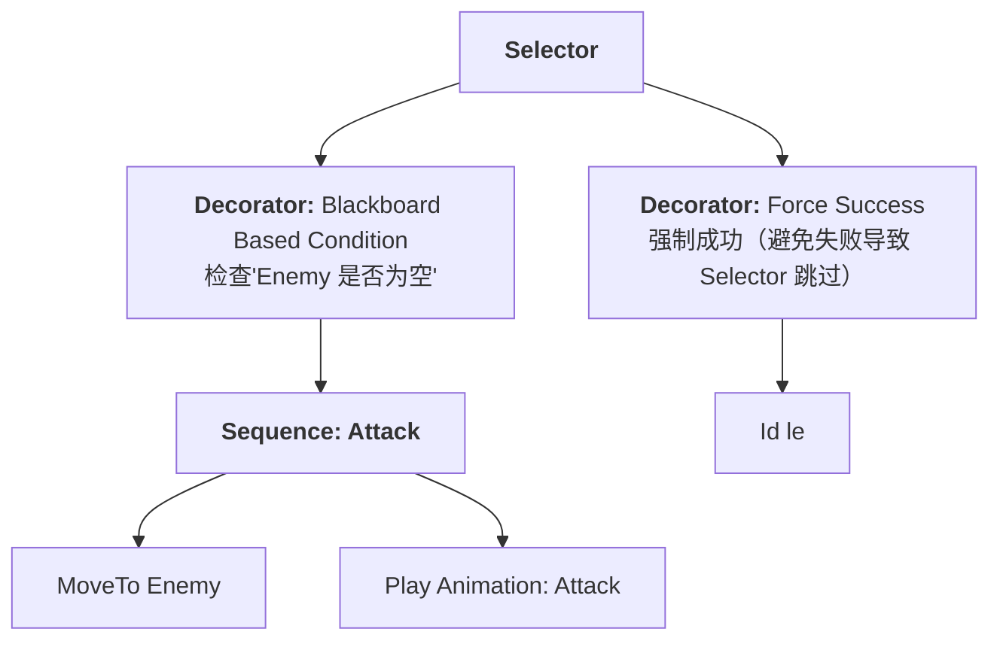
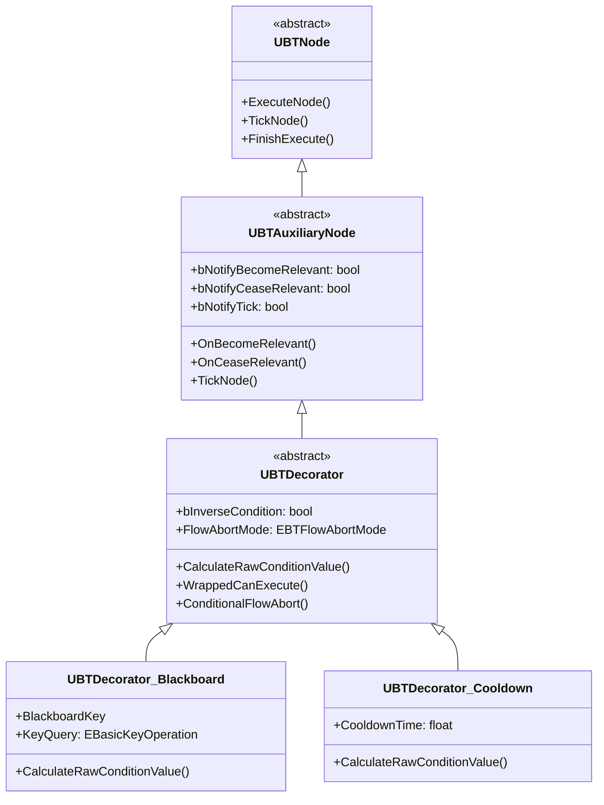
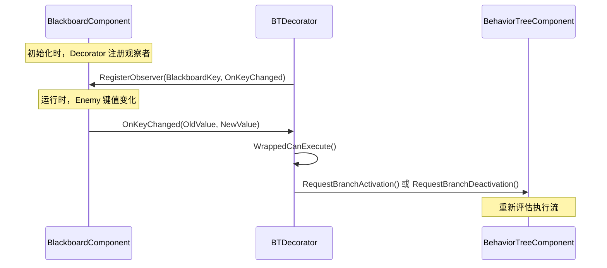
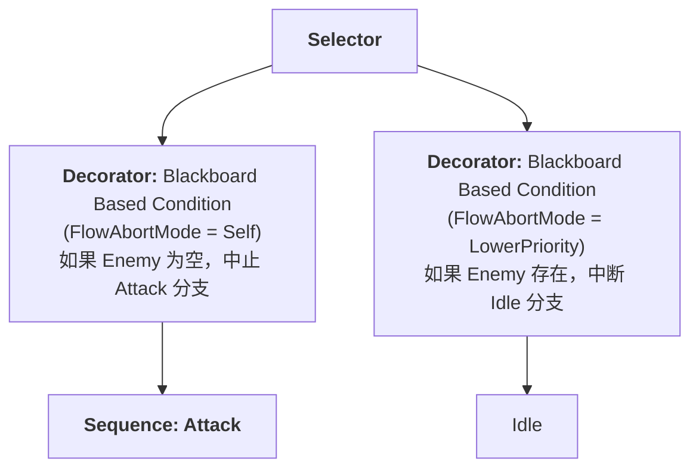
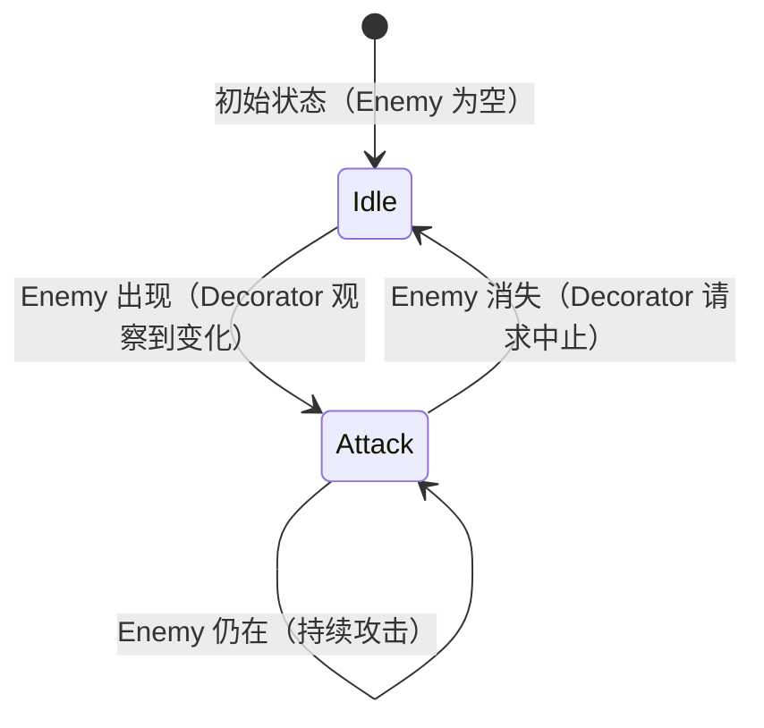
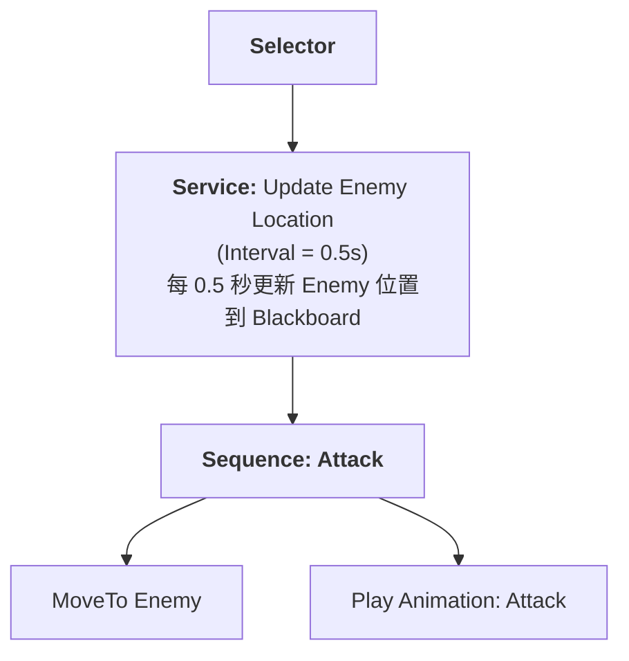
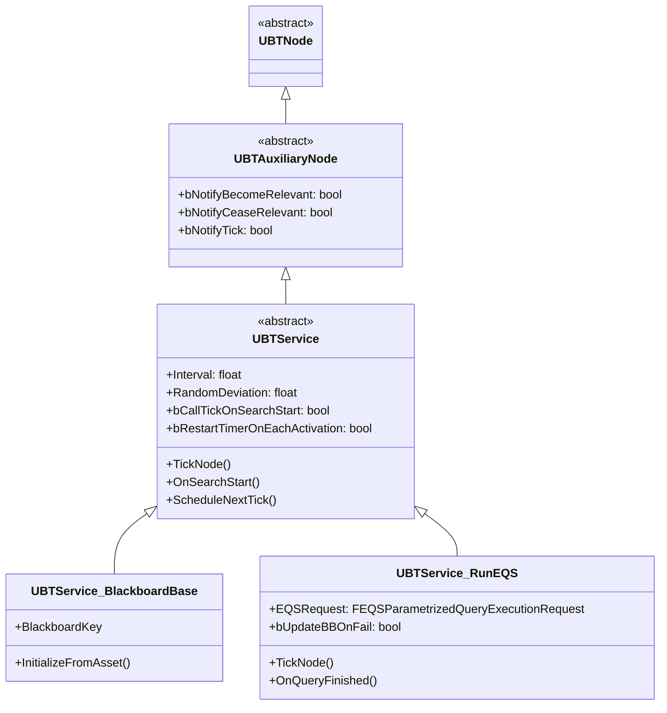
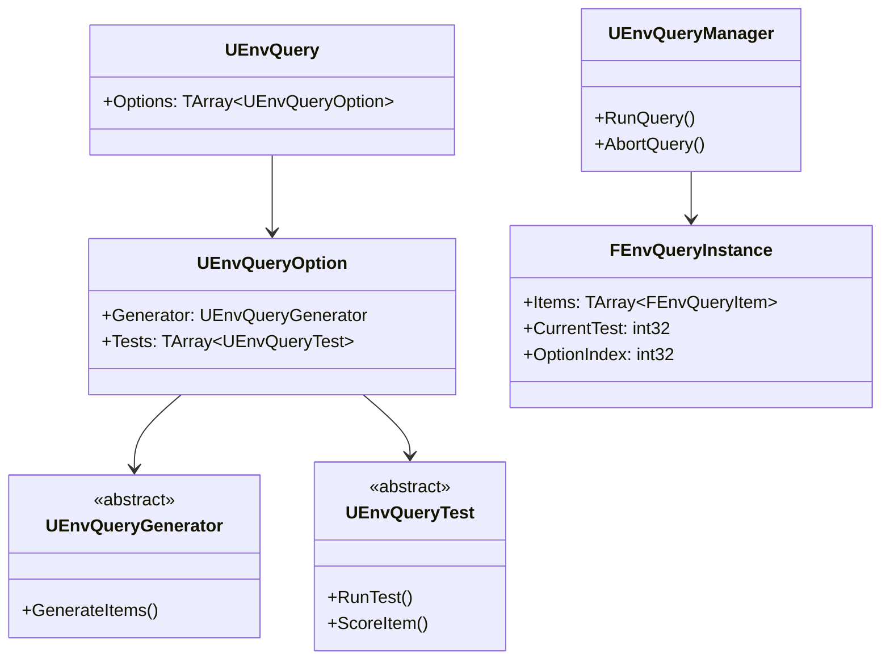
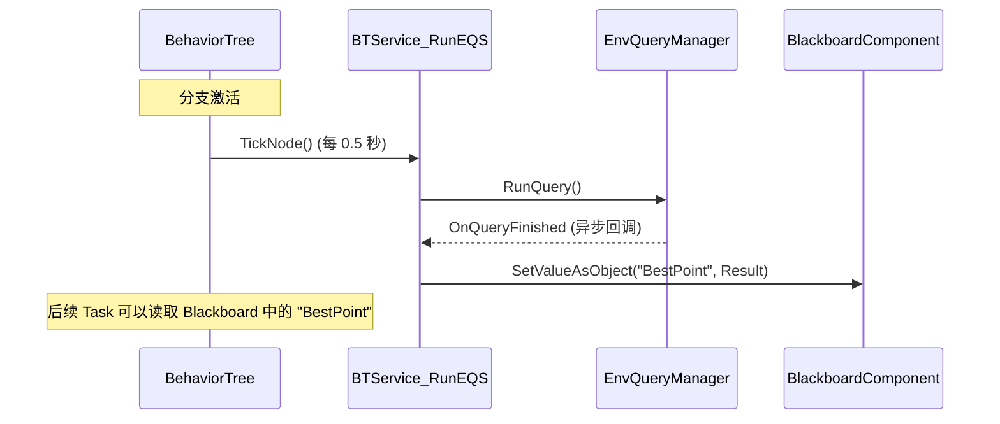
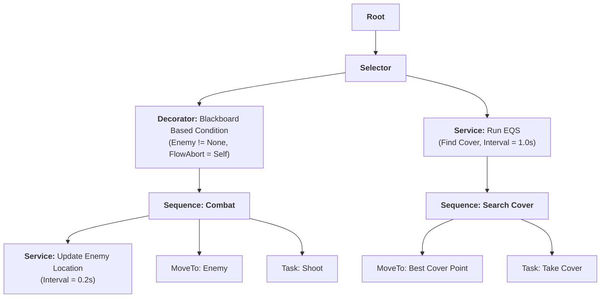

# BehaviorTree高级DecoratorService与EQS

> 深入理解 BehaviorTree 的"增强组件"：Decorator（条件判断）、Service（后台任务）、EQS（环境查询），掌握高性能 AI 决策系统。

## 概述

在 [01-BehaviorTree基础节点类型与执行流程](01-BehaviorTree基础节点类型与执行流程.md) 中，我们学习了 BehaviorTree 的基础：Composite Node（Selector/Sequence）、Task Node、Blackboard。

本课将深入 **3 个高级主题**，它们是复杂 AI 的核心：

1. **Decorator（装饰器）**：条件判断 + 流控制（Flow Abort）
2. **Service（服务）**：后台任务，周期性更新黑板数据
3. **EQS（Environment Query System）**：基于"生成器 + 测试"的智能环境查询

**学完本课你能理解**：
- Decorator 的"观察者模式"如何避免每帧检查？
- Service 如何"后台"更新数据而不阻塞执行？
- EQS 如何选出"最佳"决策点？
- Lyra 如何组合这些功能实现复杂 AI？

---

## 1. Decorator（装饰器）深度分析

### 1.1 核心概念

**Decorator（装饰器）** 是附加在 **Composite Node 子节点** 上的"条件判断器"。



**Decorator 的两个作用**：
1. **条件判断**：检查条件是否满足（如"Enemy 是否存在？"）
2. **流控制（Flow Abort）**：条件变化时，中止正在执行的分支（如"Enemy 消失了，停止攻击"）

### 1.2 核心类继承树



**关键源码位置**（UE5.7）：
- `UBTAuxiliaryNode`：`Engine/Source/Runtime/AIModule/Classes/BehaviorTree/BTAuxiliaryNode.h:30`
- `UBTDecorator`：`Engine/Source/Runtime/AIModule/Classes/BehaviorTree/BTDecorator.h:37`

### 1.3 观察者模式（Observer Pattern）

**问题**：如果 Decorator 每帧都检查条件（如"Enemy 是否存在？"），会浪费 CPU。

**解决方案**：**观察者模式** —— 只在 Blackboard 键值**变化时**重新评估。

#### 1.3.1 观察者模式的工作原理



#### 1.3.2 源码分析：`UBTDecorator::WrappedCanExecute()`

**文件**：`Engine/Source/Runtime/AIModule/Private/BehaviorTree/BTDecorator.cpp:46-50`

```cpp
// [1] 包装函数：处理节点实例化和条件反转
bool UBTDecorator::WrappedCanExecute(UBehaviorTreeComponent& OwnerComp, uint8* NodeMemory) const
{
    // [2] 如果设置了 bCreateNodeInstance，则获取节点实例
    //     否则使用模板节点（共享）
    const UBTDecorator* NodeOb = bCreateNodeInstance ? 
        (const UBTDecorator*)GetNodeInstance(OwnerComp, NodeMemory) : this;
    
    // [3] 核心逻辑：IsInversed() != CalculateRawConditionValue()
    //     - 如果 IsInversed() == true，反转条件结果
    //     - CalculateRawConditionValue() 是子类需要实现的函数
    return NodeOb ? (IsInversed() != NodeOb->CalculateRawConditionValue(OwnerComp, NodeMemory)) : false;
}
```

**设计亮点**：
- 使用 `!=` 操作符实现条件反转（异或逻辑）
- 支持节点实例化（`bCreateNodeInstance`），避免多线程冲突

#### 1.3.3 源码分析：`UBTDecorator::ConditionalFlowAbort()`

**文件**：`Engine/Source/Runtime/AIModule/Private/BehaviorTree/BTDecorator.cpp:88-120`

```cpp
// [1] 条件变化时，请求流中止
void UBTDecorator::ConditionalFlowAbort(UBehaviorTreeComponent& OwnerComp, 
                                        EBTDecoratorAbortRequest RequestMode) const
{
    // [2] 如果 FlowAbortMode == None，不中止
    if (FlowAbortMode == EBTFlowAbortMode::None)
    {
        return;
    }

    // [3] 检查父节点是否在当前行为树实例中
    const int32 InstanceIdx = OwnerComp.FindInstanceContainingNode(GetParentNode());
    if (InstanceIdx == INDEX_NONE)
    {
        return;
    }

    uint8* NodeMemory = OwnerComp.GetNodeMemory((UBTNode*)this, InstanceIdx);
    
    // [4] 重新评估条件
    const bool bPass = WrappedCanExecute(OwnerComp, NodeMemory);
    const bool bAlwaysRequestWhenPassing = (RequestMode == EBTDecoratorAbortRequest::ConditionPassing);

    // [5] 根据条件结果，请求激活或中止分支
    if (!bPass)
    {
        // 条件不满足 → 中止当前分支
        OwnerComp.RequestBranchDeactivation(*this);
    }
    else
    {
        // 条件满足 → 激活当前分支
        // bAlwaysRequestWhenPassing: 如果为 true，每次条件通过都请求（不仅是变化时）
        OwnerComp.RequestBranchActivation(*this, bAlwaysRequestWhenPassing);
    }
}
```

**`EBTDecoratorAbortRequest` 枚举**（定义在 `BTDecorator.h:10-17`）：
- `ConditionResultChanged`：只在条件结果变化时请求（默认，性能最优）
- `ConditionPassing`：只要条件通过就请求（用于需要持续执行的场景）

### 1.4 流控制（Flow Abort）机制

**Flow Abort** 是 Decorator 的"杀手锏"：当条件变化时，自动中止正在执行的分支，重新评估执行流。

#### 1.4.1 `EBTFlowAbortMode` 枚举

```cpp
// 文件：Engine/Source/Runtime/AIModule/Classes/BehaviorTree/BehaviorTreeTypes.h
enum class EBTFlowAbortMode : uint8
{
    None,          // 不中止（只做条件判断）
    Self,          // 中止自身分支（条件失败时，停止执行当前分支）
    LowerPriority, // 中止低优先级分支（条件成功时，中断后面的分支）
    Both           // 两者都中止
};
```

**示例**：



**执行流程**：
1. 初始状态：Enemy 为空 → 执行 `Idle`
2. 敌人出现 → Blackboard 更新 → Decorator 观察到变化 → 请求中止 `Idle` 分支
3. BehaviorTree 重新评估 → 执行 `Attack` 分支

#### 1.4.2 Mermaid 流程图



### 1.5 常用 Decorator 源码分析

#### 1.5.1 `UBTDecorator_Blackboard`（黑板条件）

**文件**：`Engine/Source/Runtime/AIModule/Classes/BehaviorTree/Decorators/BTDecorator_Blackboard.h:36`

**核心逻辑**：
- 检查 Blackboard 键值是否满足特定条件（如"是否为空"、"是否等于"）
- 支持观察者模式（观察 Blackboard 键值变化）

**关键代码**（`BTDecorator_Blackboard.cpp`）：

```cpp
// [1] 条件计算
bool UBTDecorator_Blackboard::CalculateRawConditionValue(UBehaviorTreeComponent& OwnerComp, uint8* NodeMemory) const
{
    const UBlackboardComponent* BlackboardComp = OwnerComp.GetBlackboardComponent();
    if (BlackboardComp == nullptr)
    {
        return false;
    }

    // [2] 根据 KeyQuery 类型，执行不同的检查
    switch (OperationType)
    {
        case EBasicKeyOperation::Set:          // 检查键值是否已设置（不为空）
            return BlackboardComp->IsSet(BlackboardKey.GetSelectedKeyID());
        
        case EBasicKeyOperation::NotSet:      // 检查键值是否为空
            return !BlackboardComp->IsSet(BlackboardKey.GetSelectedKeyID());
        
        // ... 其他操作（Equal、NotEqual、Less、Greater 等）
    }
}
```

#### 1.5.2 `UBTDecorator_Cooldown`（冷却时间）

**文件**：`Engine/Source/Runtime/AIModule/Classes/BehaviorTree/Decorators/BTDecorator_Cooldown.h:22`

**核心逻辑**：
- 限制 Decorator 的评估频率（如"每 5 秒才能再次攻击"）
- 使用 `UBlackboardComponent` 存储冷却结束时间

**关键代码**（`BTDecorator_Cooldown.cpp`）：

```cpp
// [1] 条件计算：检查冷却是否结束
bool UBTDecorator_Cooldown::CalculateRawConditionValue(UBehaviorTreeComponent& OwnerComp, uint8* NodeMemory) const
{
    const UBlackboardComponent* BlackboardComp = OwnerComp.GetBlackboardComponent();
    if (BlackboardComp == nullptr)
    {
        return false;
    }

    // [2] 获取冷却结束时间
    const double CooldownEndTime = BlackboardComp->GetValueAsFloat(CooldownKey.GetSelectedKeyID());
    const double CurrentTime = OwnerComp.GetWorld()->GetTimeSeconds();

    // [3] 如果当前时间 >= 冷却结束时间，允许执行
    return CurrentTime >= CooldownEndTime;
}

// [4] 节点激活时，重新设置冷却时间
void UBTDecorator_Cooldown::OnNodeActivation(FBehaviorTreeSearchData& SearchData)
{
    UBehaviorTreeComponent& OwnerComp = SearchData.OwnerComp;
    UBlackboardComponent* BlackboardComp = OwnerComp.GetBlackboardComponent();
    
    if (BlackboardComp)
    {
        const double CurrentTime = OwnerComp.GetWorld()->GetTimeSeconds();
        const double CooldownEndTime = CurrentTime + CooldownTime;
        
        // [5] 写入 Blackboard，供下次条件检查时使用
        BlackboardComp->SetValueAsFloat(CooldownKey.GetSelectedKeyID(), CooldownEndTime);
    }
}
```

**设计亮点**：
- 冷却时间存储在 Blackboard 中，支持网络同步
- `OnNodeActivation()` 在节点激活时调用，自动设置冷却

### 1.6 性能优化：为什么不用每帧检查？

**问题**：如果 100 个 AI 每帧都检查 Decorator 条件，性能开销多大？

**答案**：使用**观察者模式**，只在 Blackboard 键值变化时重新评估。

**性能对比**：

| 方案 | 每帧检查 | 观察者模式 |
|------|----------|-----------|
| **检查频率** | 每帧（如 60 FPS） | 只在键值变化时 |
| **100 个 AI 的开销** | 100 × 60 = 6000 次/秒 | 100 ×（变化次数）/秒 |
| **适用场景** | 需要实时响应的简单条件 | 大多数 AI 决策 |

**如何实现观察者模式？**

`UBlackboardComponent` 提供了 `RegisterObserver()` API：

```cpp
// 文件：Engine/Source/Runtime/AIModule/Private/BehaviorTree/BlackboardComponent.cpp
void UBlackboardComponent::RegisterObserver(FBlackboard::FKey KeyID, 
                                            UBTDecorator* Decorator, 
                                            FOnBlackboardChangeNotification ObserverDelegate)
{
    // [1] 将 Decorator 添加到观察者列表
    Observers.Add(KeyID, ObserverDelegate);
}

// [2] 当键值变化时，通知所有观察者
void UBlackboardComponent::NotifyObservers(FBlackboard::FKey KeyID)
{
    for (auto& Observer : Observers[KeyID])
    {
        Observer.ExecuteIfBound(*this, KeyID);
    }
}
```

**Lyra 中的实践**：
- Lyra 的 AI 大量使用 `BTDecorator_Blackboard` 观察 `TargetActor` 键值
- 当 `TargetActor` 变化时，自动中止当前行为（如"停止追击，开始攻击"）

---

## 2. Service（服务）深度分析

### 2.1 核心概念

**Service（服务）** 是"后台任务"，在附属的 Composite Node **激活期间**周期性执行。

**与 Decorator 的区别**：

| 维度 | Decorator | Service |
|------|-----------|---------|
| **作用** | 条件判断 + 流控制 | 后台任务（更新黑板数据） |
| **返回值** | 影响执行流（通过 Flow Abort） | 不返回，只更新数据 |
| **执行时机** | 节点激活前检查 | 周期性 Tick 或事件触发 |
| **典型用途** | "Enemy 是否存在？" | "每 0.5 秒更新 Enemy 位置" |

**示例**：



### 2.2 核心类继承树



**关键源码位置**（UE5.7）：
- `UBTService`：`Engine/Source/Runtime/AIModule/Classes/BehaviorTree/BTService.h:34`
- `UBTService_RunEQS`：`Engine/Source/Runtime/AIModule/Classes/BehaviorTree/Services/BTService_RunEQS.h:21`

### 2.3 生命周期与 Tick 机制

#### 2.3.1 生命周期函数

| 函数 | 调用时机 | 典型用途 |
|------|---------|---------|
| `OnBecomeRelevant()` | 附属的 Composite Node **激活**时 | 初始化数据、启动定时器 |
| `OnCeaseRelevant()` | 附属的 Composite Node **停用**时 | 清理数据、停止定时器 |
| `TickNode()` | 每帧或按 `Interval` 周期性调用 | 更新黑板数据 |
| `OnSearchStart()` | 行为树搜索进入该分支时 | 即时检查（必须是非阻塞的） |

#### 2.3.2 Tick 频率控制

**文件**：`Engine/Source/Runtime/AIModule/Private/BehaviorTree/BTService.cpp:105-109`

```cpp
// [1] 调度下一次 Tick
void UBTService::ScheduleNextTick(UBehaviorTreeComponent& OwnerComp, uint8* NodeMemory)
{
    // [2] 计算下一次 Tick 的时间（加入随机偏差）
    const float NextTickTime = FMath::FRandRange(
        FMath::Max(0.0f, Interval - RandomDeviation), 
        (Interval + RandomDeviation)
    );
    
    // [3] 存储到 NodeMemory（运行时状态）
    SetNextTickTime(NodeMemory, NextTickTime);
}
```

**关键属性**：
- `Interval`：Tick 间隔（秒），默认 0.5 秒
- `RandomDeviation`：随机偏差（避免所有 AI 同时 Tick），默认 0.1 秒
- `bRestartTimerOnEachActivation`：每次激活时是否重置定时器

**性能优化**：
- 使用 `RandomDeviation` 避免"同步 Tick"导致的 CPU 峰值
- 设置合理的 `Interval`（如 0.5-1.0 秒），避免过高频率

### 2.4 常用 Service 源码分析

#### 2.4.1 `UBTService_RunEQS`（运行 EQS 查询）

**文件**：`Engine/Source/Runtime/AIModule/Private/BehaviorTree/Services/BTService_RunEQS.cpp:48-70`

**核心逻辑**：
- 周期性运行 EQS 查询
- 将查询结果（最佳项）写入 Blackboard

**关键代码**：

```cpp
// [1] TickNode：每 Interval 秒触发一次 EQS 查询
void UBTService_RunEQS::TickNode(UBehaviorTreeComponent& OwnerComp, uint8* NodeMemory, float DeltaSeconds)
{
    AActor* QueryOwner = OwnerComp.GetOwner();
    AController* ControllerOwner = Cast<AController>(QueryOwner);
    if (ControllerOwner)
    {
        QueryOwner = ControllerOwner->GetPawn();
    }

    if (QueryOwner && EQSRequest.IsValid())
    {
        FBTEQSServiceMemory* MyMemory = CastInstanceNodeMemory<FBTEQSServiceMemory>(NodeMemory);

        // [2] 如果上一次查询已完成，启动新查询
        if (MyMemory->RequestID == INDEX_NONE)
        {
            // [3] 执行 EQS 查询（异步）
            MyMemory->RequestID = EQSRequest.Execute(*QueryOwner, BlackboardComponent, QueryFinishedDelegate);
        }
    }
    
    Super::TickNode(OwnerComp, NodeMemory, DeltaSeconds);
}

// [4] 查询完成回调
void UBTService_RunEQS::OnQueryFinished(TSharedPtr<FEnvQueryResult> Result)
{
    if (Result->IsAborted())
    {
        return;
    }

    bool bSuccess = Result->IsSuccessful() && (Result->Items.Num() >= 1);
    if (bSuccess)
    {
        UBlackboardComponent* MyBlackboard = BTComp->GetBlackboardComponent();
        UEnvQueryItemType* ItemTypeCDO = Result->ItemType->GetDefaultObject<UEnvQueryItemType>();

        // [5] 将最佳结果写入 Blackboard
        bSuccess = ItemTypeCDO->StoreInBlackboard(BlackboardKey, MyBlackboard, 
                                                  Result->RawData.GetData() + Result->Items[0].DataOffset);
    }
    else if (bUpdateBBOnFail)
    {
        // [6] 如果查询失败，清空 Blackboard 键值
        MyBlackboard->ClearValue(BlackboardKey.GetSelectedKeyID());
    }

    MyMemory->RequestID = INDEX_NONE;
}
```

**设计亮点**：
- 异步查询（不阻塞 BehaviorTree 执行）
- 自动管理查询生命周期（避免重复查询）
- 支持查询失败时的 Blackboard 清理

---

## 3. EQS（Environment Query System）集成

### 3.1 EQS 核心概念

**EQS（Environment Query System）** 是 UE 的"智能环境查询系统"，用于选出"最佳决策点"。

**核心思想**：
1. **生成器（Generator）**：产生一组候选点（如"玩家周围 500 单位内的点"）
2. **测试项（Test）**：对每个候选点评分（如"距离越近，分数越高"）
3. **选出最佳项**：加权汇总所有测试项的分数，选出总分最高的候选点

**示例**：AI 需要找"掩体位置"：
1. 生成器：生成"玩家周围 1000 单位内的所有点"
2. 测试项 1：距离玩家越远，分数越高（避免被击中）
3. 测试项 2：有遮挡（墙体），分数越高（提供掩护）
4. 结果：选出"距离远 + 有遮挡"的最佳点

### 3.2 EQS 核心架构



**关键源码位置**（UE5.7）：
- `UEnvQuery`：`Engine/Source/Runtime/AIModule/Classes/EnvironmentQuery/EnvQuery.h`
- `UEnvQueryManager`：`Engine/Source/Runtime/AIModule/Classes/EnvironmentQuery/EnvQueryManager.h:206`

### 3.3 生成器（Generator）分析

#### 3.3.1 常用生成器

| 生成器 | 作用 | 典型用途 |
|--------|------|---------|
| `UEnvQueryGenerator_OnCircle` | 在圆形区域内生成点 | 寻找"环绕玩家的位置" |
| `UEnvQueryGenerator_Cone` | 在锥形区域内生成点 | 寻找"视野内的位置" |
| `UEnvQueryGenerator_ProjectedPoints` | 投影到导航网格 | 确保点可到达 |
| `UEnvQueryGenerator_Points` | 简单点生成器 | 自定义点集合 |

#### 3.3.2 源码分析：`UEnvQueryGenerator_OnCircle`

**文件**：`Engine/Source/Runtime/AIModule/Private/EnvironmentQuery/Generators/EnvQueryGenerator_OnCircle.cpp`

**核心逻辑**：
- 在指定圆心和半径的圆上（或圆内）生成点
- 支持"生成在圆圈上"或"生成在圆圈内"

**关键代码**：

```cpp
// [1] 生成候选点
void UEnvQueryGenerator_OnCircle::GenerateItems(FEnvQueryInstance& QueryInstance)
{
    // [2] 计算圆心（根据 EnvQueryContext）
    FVector CircleCenter = GetContextLocation(QueryInstance, CircleCenterContext);
    
    // [3] 生成点
    TArray<FNavLocation> GeneratedPoints;
    for (int32 i = 0; i < NumberOfPoints; ++i)
    {
        float Angle = (i / (float)NumberOfPoints) * 2.0f * PI;
        FVector PointOffset = FVector(FMath::Cos(Angle), FMath::Sin(Angle), 0) * CircleRadius;
        FNavLocation PointLocation = CircleCenter + PointOffset;
        
        // [4] 投影到导航网格（确保可到达）
        FNavLocation ProjectedLocation;
        UNavigationSystemV1::ProjectPointToNavigation(QueryInstance.World, PointLocation, ProjectedLocation);
        
        GeneratedPoints.Add(ProjectedLocation);
    }
    
    // [5] 将生成的点添加到查询结果
    StoreNavPoints(GeneratedPoints, QueryInstance);
}
```

### 3.4 测试项（Test）分析

#### 3.4.1 常用测试项

| 测试项 | 作用 | 评分逻辑 |
|--------|------|---------|
| `UEnvQueryTest_Distance` | 距离测试 | 距离越近/越远，分数越高（可配置） |
| `UEnvQueryTest_Dot` | 点积测试 | 方向越接近，分数越高（用于"面向玩家"） |
| `UEnvQueryTest_Hidden` | 遮挡测试 | 被遮挡（有墙体），分数越高 |
| `UEnvQueryTest_Pathfinding` | 寻路测试 | 寻路距离越短，分数越高 |

#### 3.4.2 源码分析：`UEnvQueryTest_Distance`

**文件**：`Engine/Source/Runtime/AIModule/Private/EnvironmentQuery/Tests/EnvQueryTest_Distance.cpp`

**核心逻辑**：
- 计算每个候选点到指定 Actor（如"Enemy"）的距离
- 根据 `TestMode` 评分（如"距离越近，分数越高"或"距离越远，分数越高"）

**关键代码**：

```cpp
// [1] 运行测试
void UEnvQueryTest_Distance::RunTest(FEnvQueryInstance& QueryInstance, TArray<FEnvQueryItem>& Items)
{
    // [2] 获取测试目标（如"Enemy"）
    TArray<FVector> ContextLocations;
    QueryInstance.PrepareContext(DistanceToContext, ContextLocations);

    // [3] 对每个候选点，计算距离并评分
    for (FEnvQueryItem& Item : Items)
    {
        float Score = 0.0f;
        for (const FVector& ContextLocation : ContextLocations)
        {
            float Distance = FVector::Dist(Item.Location, ContextLocation);
            
            // [4] 根据 TestMode 评分
            if (TestMode == EEnvTestDistance::Distance3D)
            {
                Score = Distance;
            }
            else if (TestMode == EEnvTestDistance::Distance2D)
            {
                Score = FVector::Dist2D(Item.Location, ContextLocation);
            }
            
            // [5] 归一化到 0-1（1 表示最佳）
            Score = FMath::GetMappedRangeValueClamped(FVector2D(MinDistance, MaxDistance), 
                                                      FVector2D(0.0f, 1.0f), Score);
            
            Item.Score += Score * Weight;  // 加权汇总
        }
    }
}
```

### 3.5 EQS 与 BehaviorTree 集成

**集成方式**：
1. 在 BehaviorTree 中添加 `BTService_RunEQS`
2. 配置 EQS 查询模板（`UEnvQuery` 资产）
3. 配置结果写入的 Blackboard Key
4. Service 会周期性运行 EQS 查询，并将最佳结果写入 Blackboard

**Mermaid 流程图**：



---

## 4. Lyra 中的实践

### 4.1 Lyra 的 BehaviorTree 结构

**Lyra 使用 BehaviorTree + EQS** 实现 Bot AI。

**关键文件**（在 `Plugins/GameFeatures/ShooterCore/` 下）：
- `Content/Bot/BT/BotBehaviorTree.uasset` - Bot 的行为树资产
- `Content/Bot/EQS/` - EQS 查询资产

**Lyra 的 BehaviorTree 结构**（简化）：



### 4.2 Lyra 如何使用 Decorator/Service

**Decorator**：
- `BTDecorator_Blackboard`：观察 `Enemy` 键值，变化时中止 Combat 分支
- `BTDecorator_Cooldown`：限制"寻找掩体"的频率（每 5 秒一次）

**Service**：
- `BTService_RunEQS`：周期性运行"寻找掩体"EQS 查询
- 自定义 Service：更新 `Enemy` 位置到 Blackboard

### 4.3 Lyra 的 EQS 使用

**Lyra 使用 EQS 寻找"掩体位置"**：

**EQS 配置**：
- **生成器**：`UEnvQueryGenerator_OnCircle`（在 AI 周围 1000 单位内生成点）
- **测试项 1**：`UEnvQueryTest_Distance`（距离 Enemy 越远，分数越高）
- **测试项 2**：`UEnvQueryTest_Hidden`（被遮挡，分数越高）
- **测试项 3**：`UEnvQueryTest_Pathfinding`（寻路距离短，分数越高）

**结果**：选出"距离远 + 有遮挡 + 可达"的最佳掩体位置。

---

## 5. 性能优化和常见陷阱

### 5.1 Decorator 观察者模式的性能优势

**问题**：100 个 AI，每个 AI 有 5 个 Decorator，每帧检查 → 500 次/帧 × 60 FPS = 30000 次/秒。

**解决方案**：观察者模式 → 只在 Blackboard 键值变化时检查。

**优化建议**：
1. 尽量使用观察者模式（默认开启）
2. 避免 `bNotifyTick = true`（每帧检查）
3. 使用 `FlowAbortMode = Self`（只中止自身分支，不影响其他分支）

### 5.2 Service Tick 频率控制

**问题**：100 个 AI，每个 AI 有 3 个 Service，Tick 间隔 0.1 秒 → 3000 次/秒。

**优化建议**：
1. 设置合理的 `Interval`（0.5-1.0 秒）
2. 使用 `RandomDeviation`（避免同步 Tick）
3. 对于不重要的更新，使用 `bCallTickOnSearchStart = true`（只在搜索时更新一次）

### 5.3 EQS 查询频率优化

**问题**：EQS 查询是 CPU 密集型操作（生成点 + 评分）。

**优化建议**：
1. 设置合理的查询间隔（1.0-2.0 秒）
2. 限制生成器的点数量（如 `NumberOfPoints = 10`）
3. 使用"时间切片"（EQS 支持分帧执行，避免卡顿）

### 5.4 常见错误（反模式）

| 反模式 | 为什么不行 | 正确做法 |
|--------|-----------|---------|
| Decorator 每帧检查 | 性能瓶颈 | 使用观察者模式 |
| Service Tick 间隔太短 | CPU 开销大 | 设置合理 Interval（≥0.5s） |
| EQS 查询频率太高 | CPU 峰值 | 设置合理间隔（≥1.0s） |
| 在 Service 中执行阻塞操作 | 卡顿 | 使用异步查询（如 EQS） |
| 忘记设置 `bNotifyBecomeRelevant` | 生命周期函数不调用 | 在构造函数中使用 `INIT_SERVICE_NODE_NOTIFY_FLAGS()` |

---

## 总结与要点

| 要点 | 说明 |
|------|------|
| **Decorator** | 条件判断 + 流控制，使用观察者模式避免每帧检查 |
| **Service** | 后台任务，周期性更新黑板数据，支持 Tick 频率控制 |
| **EQS** | 智能环境查询，生成器 + 测试项，选出最佳决策点 |
| **性能优化** | 观察者模式 + 合理 Tick 间隔 + EQS 时间切片 |
| **Lyra 实践** | Decorator 观察 Enemy，Service 运行 EQS，实现复杂 AI 决策 |

---

## 相关页面

- ← [[30-tutorials/ai-behavior/01-BehaviorTree基础节点类型与执行流程|上一课：Behavior Tree 基础]]
- → [[30-tutorials/ai-behavior/03-StateTree入门|下一课：StateTree 入门]]
- [[30-tutorials/ai-behavior/00-BehaviorTree与StateTreeAI决策系统完全指南|系列概览]]

<!-- nav:auto:end -->

<!-- nav:auto -->

---

**导航**: ← [[30-tutorials/ai-behavior/01-BehaviorTree基础节点类型与执行流程|01-BehaviorTree基础节点类型与执行流程]] · [[30-tutorials/ai-behavior/03-StateTree入门|03-StateTree入门]] →

<!-- /nav:auto -->
