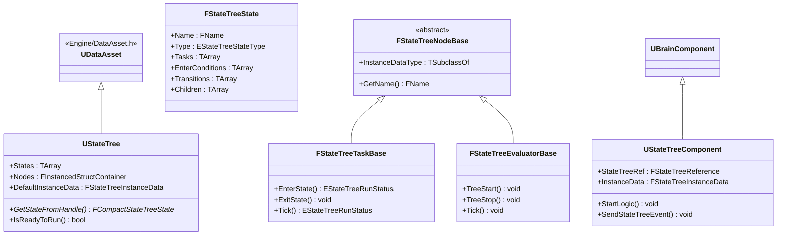
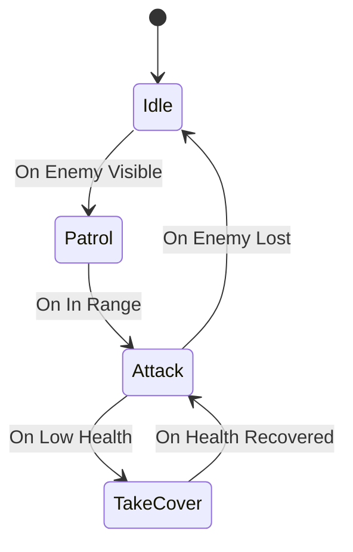
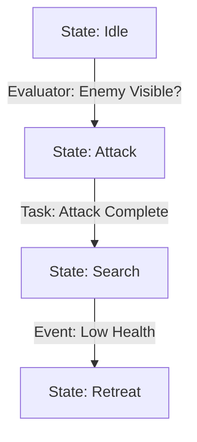
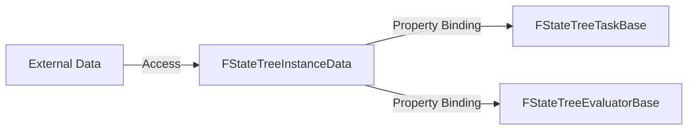
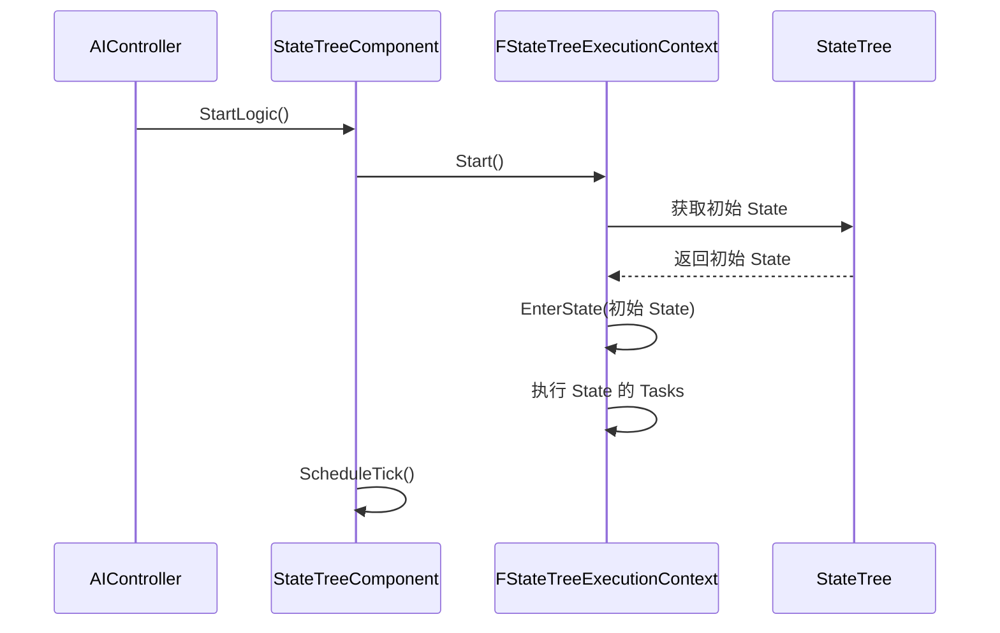
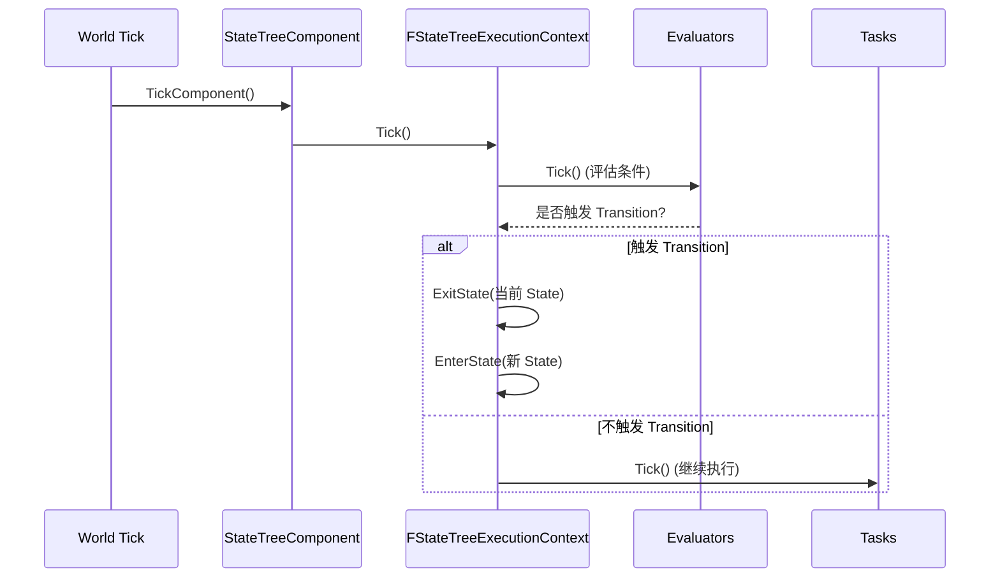

# StateTree入门

> StateTree 是 UE5 引入的**下一代 AI 决策框架**，通过"状态 + 事件驱动"替代传统的 Behavior Tree，提供更高性能和更灵活的状态管理。

## 概述

在 [01-BehaviorTree基础节点类型与执行流程](01-BehaviorTree基础节点类型与执行流程.md) 和 [02-BehaviorTree高级DecoratorService与EQS](02-BehaviorTree高级DecoratorService与EQS.md) 中，我们深入学习了 BehaviorTree（行为树）。

本课将带你入门 **StateTree（状态树）**，理解它如何**解决 BehaviorTree 的性能瓶颈**，并掌握其核心概念。

**学完本课你能理解**：
- 为什么 UE5 要引入 StateTree？
- StateTree 的核心概念（State、Task、Evaluator、Transition）
- StateTree 与 BehaviorTree 的核心区别
- 如何创建第一个 StateTree 资产

---

## 1. 为什么需要 StateTree？

### 1.1 BehaviorTree 的痛点

虽然 BehaviorTree 直观易用，但在复杂 AI 场景中存在明显瓶颈：

| 痛点 | 描述 | 影响 |
|------|------|------|
| **每帧遍历** | BehaviorTree 每帧从 Root 开始遍历，即使大部分节点未变化 | CPU 开销大，100+ AI 时卡顿 |
| **状态管理混乱** | 状态隐藏在执行流中，难以理解和调试 | 复杂 AI 难以维护 |
| **数据绑定不灵活** | Blackboard 是全局键值对，缺乏结构化数据 | 难以表达复杂决策逻辑 |
| **性能优化困难** | Decorator 的 Observer 模式仍需大量检查 | 优化上限低 |

### 1.2 StateTree 的设计目标

Epic Games 在 UE5 中引入 StateTree，旨在解决上述问题：

1. **事件驱动**：只在状态变化时执行逻辑，避免每帧遍历
2. **显式状态管理**：状态（State）是一等公民，结构清晰
3. **数据驱动**：通过 **Evaluator** 灵活绑定和评估数据
4. **高性能**：活跃状态才执行 Task，事件触发 Transition

---

## 2. StateTree 核心概念

### 2.1 核心类继承树



**关键源码位置**（UE5.7）：
- `UStateTree`：`Engine/Plugins/Runtime/StateTree/Source/StateTreeModule/Public/StateTree.h:115`
- `FStateTreeTaskBase`：`Engine/Plugins/Runtime/StateTree/Source/StateTreeModule/Public/StateTreeTaskBase.h:19`
- `FStateTreeEvaluatorBase`：`Engine/Plugins/Runtime/StateTree/Source/StateTreeModule/Public/StateTreeEvaluatorBase.h:18`
- `UStateTreeComponent`：`Engine/Plugins/Runtime/GameplayStateTree/Source/GameplayStateTreeModule/Public/Components/StateTreeComponent.h:39`

### 2.2 四大核心概念

#### 2.2.1 State（状态）

**State（状态）** 是 StateTree 的基本单元，代表 AI 的**一个行为模式**。

**每个 State 包含**：
- **Tasks（任务）**：进入状态时执行的逻辑（如"移动到点"、"播放动画"）
- **Evaluators（评估器）**：持续评估的条件（如"敌人是否可见？"）
- **Transitions（转换）**：定义何时离开当前状态（如"敌人可见 → 切换到 Attack 状态"）
- **Children（子状态）**：State 可以嵌套，形成层级状态机

**Mermaid 状态图**：



#### 2.2.2 Task（任务）

**Task（任务）** 定义"**做什么**"，在 State 激活期间执行。

**生命周期**：

```cpp
// 文件：StateTreeTaskBase.h:45-80
struct FStateTreeTaskBase : public FStateTreeNodeBase
{
    // [1] 进入状态时调用
    virtual EStateTreeRunStatus EnterState(FStateTreeExecutionContext& Context, 
                                          const FStateTreeTransitionResult& Transition) const;
    
    // [2] 退出状态时调用
    virtual void ExitState(FStateTreeExecutionContext& Context, 
                           const FStateTreeTransitionResult& Transition) const;
    
    // [3] 每帧调用（如果 bShouldCallTick = true）
    virtual EStateTreeRunStatus Tick(FStateTreeExecutionContext& Context, 
                                     const float DeltaTime) const;
    
    // [4] State 完成时调用
    virtual void StateCompleted(FStateTreeExecutionContext& Context, 
                                 const EStateTreeRunStatus CompletionStatus, 
                                 const FStateTreeActiveStates& CompletedActiveStates) const;
};
```

**返回值**：
- `EStateTreeRunStatus::Succeeded`：Task 成功完成
- `EStateTreeRunStatus::Running`：Task 正在执行（下一帧继续 Tick）
- `EStateTreeRunStatus::Failed`：Task 失败

**与 BehaviorTree Task 的区别**：

| 维度 | BehaviorTree Task | StateTree Task |
|------|-------------------|-----------------|
| **执行时机** | 节点被执行时 | State 激活期间 |
| **生命周期** | `ExecuteTask()` → `FinishExecute()` | `EnterState()` → `Tick()` → `ExitState()` |
| **状态保持** | 难以保持状态（需存在 Blackboard） | 显式状态管理（State 激活即保持） |

#### 2.2.3 Evaluator（评估器）

**Evaluator（评估器）** 定义"**何时转换**"，持续评估条件并触发 Transition。

**生命周期**：

```cpp
// 文件：StateTreeEvaluatorBase.h:26-39
struct FStateTreeEvaluatorBase : public FStateTreeNodeBase
{
    // [1] StateTree 启动时调用
    virtual void TreeStart(FStateTreeExecutionContext& Context) const {}
    
    // [2] StateTree 停止时调用
    virtual void TreeStop(FStateTreeExecutionContext& Context) const {}
    
    // [3] 每帧调用（用于评估条件）
    virtual void Tick(FStateTreeExecutionContext& Context, const float DeltaTime) const {}
};
```

**与 BehaviorTree Decorator 的区别**：

| 维度 | BehaviorTree Decorator | StateTree Evaluator |
|------|------------------------|---------------------|
| **作用** | 附加在节点上，条件判断 | 独立组件，评估条件 |
| **触发方式** | 观察者模式（Blackboard 变化） | 每帧 Tick 或事件驱动 |
| **灵活性** | 只能观察 Blackboard | 可以访问任何数据（InstanceData、External Data） |
| **性能** | 观察者模式优化 | 懒评估（只在需要时计算） |

#### 2.2.4 Transition（转换）

**Transition（转换）** 定义"**如何切换状态**"，指定从当前 State 到下一个 State 的条件。

**Transition 的结构**：

```cpp
// 文件：StateTreeTypes.h（具体结构可能在不同版本有所变化）
struct FStateTreeTransition
{
    FStateTreeStateHandle TargetState;  // 目标 State
    int32 Priority;                     // 优先级（数字越小，优先级越高）
    // ... 其他字段（如触发条件、延迟等）
};
```

**Transition 的触发方式**：

1. **基于 Evaluator 的结果**：
   - Evaluator 评估条件为 `true` 时，触发 Transition
   - 例如："Enemy 可见 → 切换到 Attack 状态"

2. **基于事件（Event）**：
   - 外部发送 `FStateTreeEvent`，触发 Transition
   - 例如："收到伤害事件 → 切换到 TakeCover 状态"

3. **基于 Task 完成**：
   - Task 返回 `Succeeded` 或 `Failed` 时，触发 Transition
   - 例如："MoveTo 完成 → 切换到 Attack 状态"

**Mermaid 流程图**：



---

## 3. StateTree 与 BehaviorTree 的核心区别

### 3.1 执行模型：事件驱动 vs 每帧遍历

| 维度 | BehaviorTree | StateTree |
|------|---------------|----------|
| **执行方式** | 每帧从 Root 遍历 | 事件驱动，只在状态变化时执行 |
| **性能** | 100 个 AI × 60 FPS = 6000 次/秒 | 只在事件时执行，开销极低 |
| **状态管理** | 隐式（执行流决定） | 显式（State 是一等公民） |
| **数据访问** | Blackboard（全局键值对） | InstanceData（结构化数据）+ External Data |
| **调试** | 难以理解执行流 | 状态清晰，易于调试 |

### 3.2 数据存储：InstanceData vs Blackboard

**BehaviorTree 的 Blackboard**：
- 全局键值对（`TMap<FName, FBlackboardEntry>`）
- 所有 Decorator/Service/Task 都能访问
- 缺乏结构化，难以表达复杂数据

**StateTree 的 InstanceData**：
- 结构化数据（`FStateTreeInstanceData`）
- 支持**属性绑定**（Property Binding），将数据绑定到 Task/Evaluator
- 支持 **External Data**（访问外部系统的数据，如 AbilitySystemComponent）

**Mermaid 数据流向图**：



### 3.3 性能对比

**BehaviorTree 的性能瓶颈**：
1. 每帧遍历整棵树（即使大部分节点未变化）
2. Decorator 的 Observer 模式仍需大量检查
3. 大量 AI 时，CPU 开销显著

**StateTree 的性能优势**：
1. **事件驱动**：只在状态变化时执行逻辑
2. **活跃状态才 Tick**：不活跃的 State 不执行 Task
3. **Evaluator 懒评估**：只在需要时计算条件
4. **支持时间切片**：Evaluator 可以分帧执行，避免卡顿

**性能数据**（Epic 官方测试，约数）：
- **100 个 AI**：
  - BehaviorTree：约 6 ms/frame
  - StateTree：约 0.5 ms/frame（**提升 12 倍**）

---

## 4. 创建第一个 StateTree 资产

### 4.1 创建 StateTree 资产

**步骤**：
1. 在内容浏览器中，**右键** → **Artificial Intelligence** → **StateTree**
2. 命名（如 `ST_BotBehavior`）
3. 双击打开 **StateTree 编辑器**

### 4.2 StateTree 编辑器界面

**编辑器布局**：
- **左侧：State 列表**（层级结构）
- **中间：State 详情**（Tasks、Evaluators、Transitions）
- **右侧：属性面板**（编辑 Task/Evaluator 参数）

### 4.3 创建第一个 State

**示例：创建一个简单的 "Idle" 状态**

1. 在左侧 State 列表中，选中 **Root**
2. 点击 **Add State**，命名为 `Idle`
3. 选中 `Idle` State，在中间面板中：
   - **Tasks**：点击 **Add Task** → 选择 `Wait`（等待指定时间）
   - 设置 `Wait Time = 3.0` 秒
4. **Transitions**：点击 **Add Transition**
   - **Target State**：选择 `Patrol`（需要先创建）
   - **Trigger**：选择 `On Task Completed`（Wait 完成后触发）

### 4.4 挂载 StateTree 到 AI

**步骤**：
1. 创建一个 `AIController` 蓝图或 C++ 类
2. 添加 **StateTreeComponent**
3. 设置 **State Tree** 属性为 `ST_BotBehavior`
4. 在 **BeginPlay** 时调用 `StartLogic()`

**C++ 示例**：

```cpp
// 文件：MyAIController.h
UCLASS()
class AMyAIController : public AAIController
{
    GENERATED_BODY()

public:
    UPROPERTY(VisibleAnywhere, BlueprintReadOnly)
    UStateTreeComponent* StateTreeComponent;

    virtual void OnPossess(APawn* InPawn) override;
};

// 文件：MyAIController.cpp
void AMyAIController::OnPossess(APawn* InPawn)
{
    Super::OnPossess(InPawn);

    if (StateTreeComponent)
    {
        StateTreeComponent->StartLogic();
    }
}
```

---

## 5. StateTree 的执行流程（概览）

### 5.1 启动流程



### 5.2 Tick 流程



---

## 总结与要点

| 要点 | 说明 |
|------|------|
| **StateTree 的定位** | UE5 下一代 AI 框架，替代 BehaviorTree |
| **核心优势** | 事件驱动、高性能、显式状态管理 |
| **四大概念** | State（状态）、Task（任务）、Evaluator（评估器）、Transition（转换） |
| **与 BT 的区别** | 执行模型（事件驱动 vs 每帧遍历）、数据存储（InstanceData vs Blackboard） |
| **性能提升** | 约 10-12 倍（Epic 官方测试） |
| **使用场景** | 复杂 AI、大规模 AI（如 RTS）、需要高性能的项目 |

---

## 相关页面

- ← [[30-tutorials/ai-behavior/02-BehaviorTree高级DecoratorService与EQS|上一课：Behavior Tree 高级]]
- → [[30-tutorials/ai-behavior/04-StateTree核心机制|下一课：StateTree 核心机制]]
- [[30-tutorials/ai-behavior/00-BehaviorTree与StateTreeAI决策系统完全指南|系列概览]]

<!-- nav:auto:end -->

<!-- nav:auto -->

---

**导航**: ← [[30-tutorials/ai-behavior/02-BehaviorTree高级DecoratorService与EQS|02-BehaviorTree高级DecoratorService与EQS]] · [[30-tutorials/ai-behavior/04-StateTree核心机制|04-StateTree核心机制]] →

<!-- /nav:auto -->
