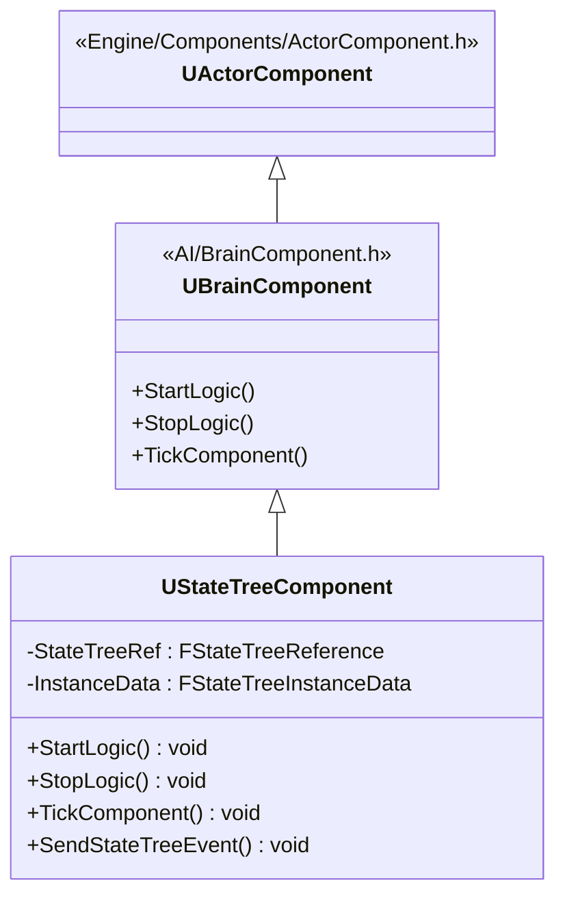
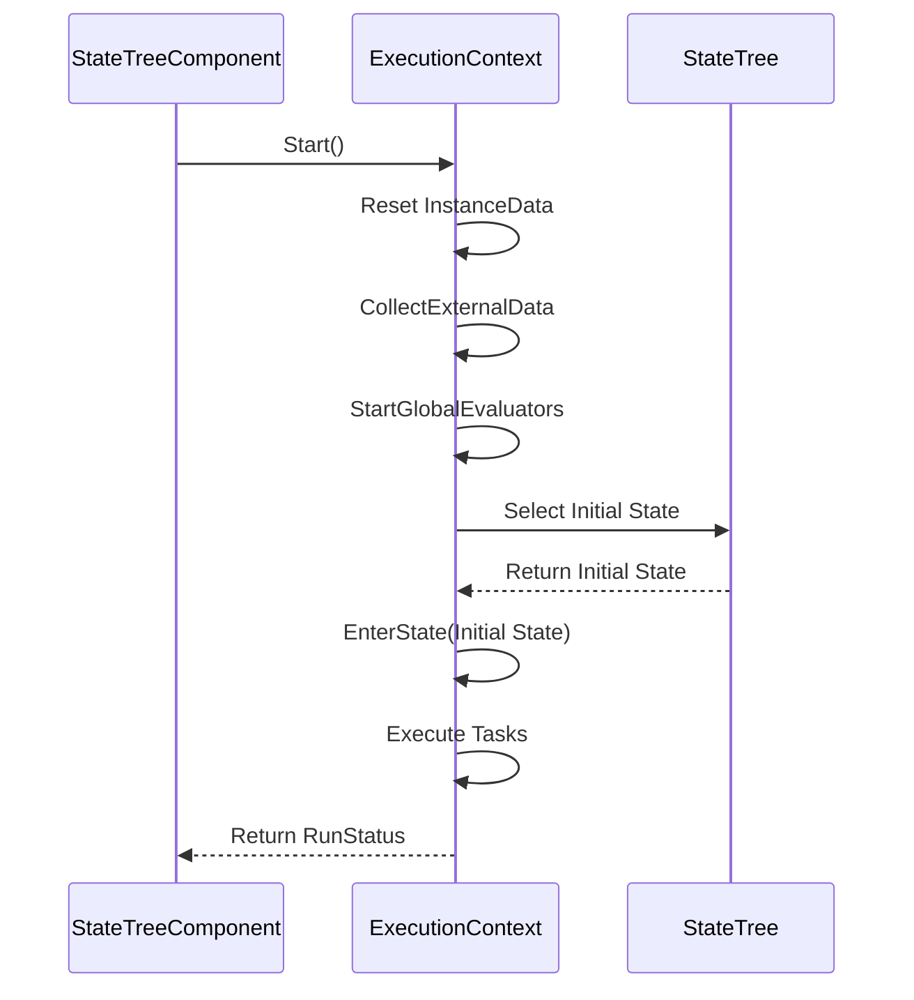
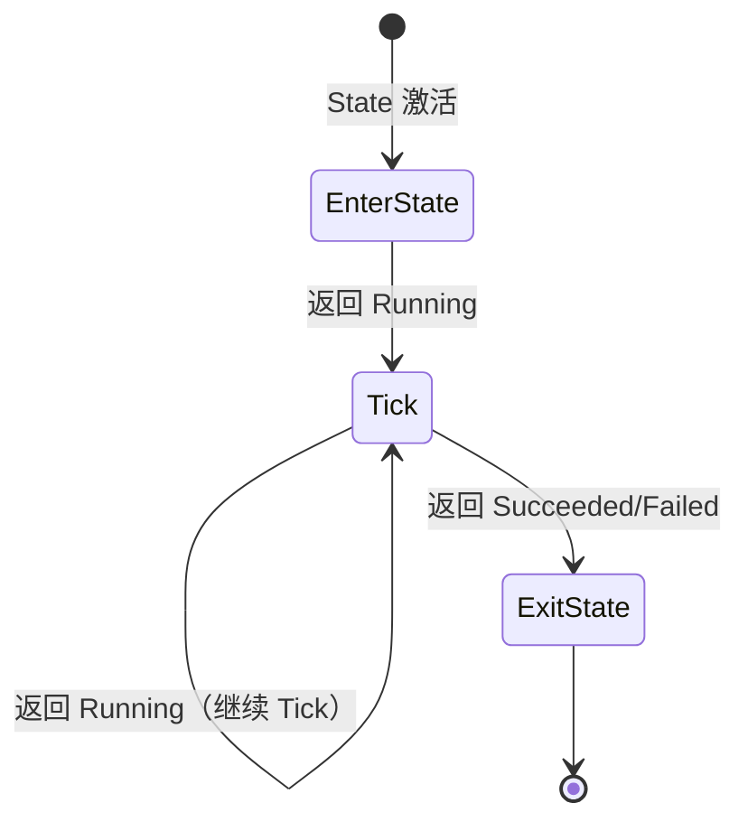
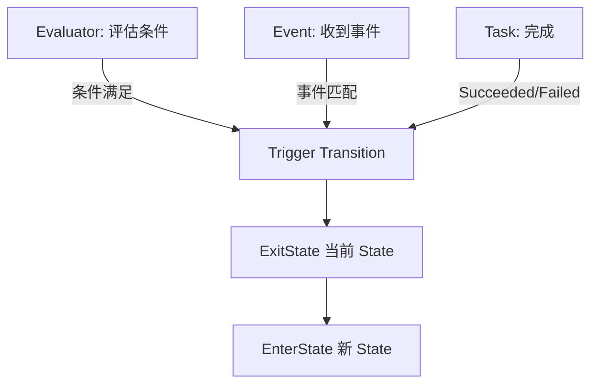

# StateTree核心机制

> 深入 StateTree 的**执行引擎**，理解"事件驱动"如何工作，掌握高性能 AI 决策的底层原理。

## 概述

在 [03-StateTree入门](03-StateTree入门.md) 中，我们学习了 StateTree 的核心概念（State、Task、Evaluator、Transition）。

本课将深入 **StateTree 的执行引擎**，通过源码分析理解：
1. `UStateTreeComponent` 如何启动和管理 StateTree？
2. `FStateTreeExecutionContext` 如何执行状态转换？
3. **事件驱动**如何避免每帧遍历？
4. Evaluator 和 Transition 的协作机制

**学完本课你能理解**：
- StateTree 的"事件驱动"执行模型
- `FStateTreeExecutionContext` 的核心作用
- Task 的生命周期管理
- 如何优化 StateTree 性能

---

## 1. StateTreeComponent 分析

`UStateTreeComponent` 是 StateTree 的**入口点**，负责启动、停止、Tick StateTree。

### 1.1 类继承树



**关键源码位置**（UE5.7）：
- `UStateTreeComponent`：`Engine/Plugins/Runtime/GameplayStateTree/Source/GameplayStateTreeModule/Public/Components/StateTreeComponent.h:39`

### 1.2 StartLogic() 调用链（启动 StateTree）

**文件**：`StateTreeComponent.cpp:160-213`

```cpp
// [1] 启动逻辑
void UStateTreeComponent::StartLogic()
{
    STATETREE_LOG(Log, TEXT("%hs: Start Logic"), __FUNCTION__);
    StartTree();
}

// [2] 核心启动函数
void UStateTreeComponent::StartTree()
{
    // [3] 验证 StateTree 资源是否有效
    if (HasValidStateTreeReference().HasError())
    {
        bIsRunning = false;
        DisableTick();
        return;
    }

    // [4] 创建 FStateTreeExecutionContext（临时对象，不应跨帧保存）
    FStateTreeExecutionContext Context(*GetOwner(), *StateTreeRef.GetStateTree(), InstanceData);
    
    // [5] 设置上下文要求（外部数据回调等）
    if (SetContextRequirements(Context, /*bLogErrors*/true))
    {
        // [6] 调用 Context.Start() 启动 StateTree
        const EStateTreeRunStatus CurrentRunStatus = Context.Start(FStateTreeExecutionContext::FStartParameters
        {
            .GlobalParameters = &StateTreeRef.GetParameters(),
            .ExecutionExtension = TInstancedStruct<FStateTreeComponentExecutionExtension>::Make(MoveTemp(Extension))
        });

        bIsRunning = CurrentRunStatus == EStateTreeRunStatus::Running;
        
        // [7] 根据返回结果调度 Tick
        ScheduleTickFrame(Context.GetNextScheduledTick());
    }
}
```

**设计亮点**：
1. **`FStateTreeExecutionContext` 是临时对象**：不应跨帧保存（避免悬空指针）
2. **`InstanceData` 在 `Start()` 内部初始化**：通过 `InstanceData.Reset()` 重置状态
3. **智能 Tick 调度**：`ScheduleTickFrame()` 只在需要时 Tick，避免每帧开销

### 1.3 TickComponent() 调用链（事件驱动的核心）

**文件**：`StateTreeComponent.cpp`（具体行号可能随版本变化，约 250-300 行）

```cpp
// [1] Tick 函数（World Tick 时调用）
void UStateTreeComponent::TickComponent(float DeltaTime, enum ELevelTick TickType, FActorComponentTickFunction* ThisTickFunction)
{
    Super::TickComponent(DeltaTime, TickType, ThisTickFunction);

    if (!bIsRunning)
    {
        return;
    }

    // [2] 创建 ExecutionContext（临时对象）
    FStateTreeExecutionContext Context(*GetOwner(), *StateTreeRef.GetStateTree(), InstanceData);
    
    // [3] 设置上下文
    if (SetContextRequirements(Context, /*bLogErrors*/false))
    {
        // [4] 调用 Context.Tick()（核心执行逻辑）
        const EStateTreeRunStatus TickStatus = Context.Tick(DeltaTime);
        
        bIsRunning = TickStatus == EStateTreeRunStatus::Running;
        
        // [5] 调度下一次 Tick
        ScheduleTickFrame(Context.GetNextScheduledTick());
    }
}
```

**事件驱动如何实现？**

`ScheduleTickFrame()` 的源码（简化）：

```cpp
void UStateTreeComponent::ScheduleTickFrame(const FNextTickArguments& Args)
{
    if (Args.NextTickTime == FNextTickArguments::NoTick)
    {
        // [1] 如果不需要 Tick，禁用 Tick
        SetComponentTickEnabled(false);
    }
    else if (Args.NextTickTime == FNextTickArguments::Now)
    {
        // [2] 如果需要立即 Tick，启用 Tick
        SetComponentTickEnabled(true);
    }
    else
    {
        // [3] 如果需要在指定时间 Tick，设置定时器
        SetComponentTickEnabled(true);
        // ... 设置 Tick 间隔
    }
}
```

**关键点**：
- 如果 `NextTickTime == NoTick`，**完全不 Tick**（0 CPU 开销）！
- 只有活跃的 State 有 Task 需要 Tick 时，才启用 Tick
- 这就是 **StateTree 性能远超 BehaviorTree 的核心原因**

---

## 2. FStateTreeExecutionContext 分析

`FStateTreeExecutionContext` 是 StateTree 的**执行引擎**，负责状态转换、Task 执行、事件处理。

### 2.1 类结构

**文件**：`Engine/Plugins/Runtime/StateTree/Source/StateTreeModule/Public/StateTreeExecutionContext.h`

**核心方法**：

| 方法 | 作用 |
|------|------|
| `Start()` | 启动 StateTree，进入初始 State |
| `Tick()` | 执行当前活跃 State 的 Task，检查 Transition |
| `Stop()` | 停止 StateTree，清理状态 |
| `SendEvent()` | 发送事件，可能触发 Transition |

### 2.2 Start() 调用链（进入初始状态）

**文件**：`StateTreeExecutionContext.cpp:1393-1440`

```cpp
// [1] 启动 StateTree
EStateTreeRunStatus FStateTreeExecutionContext::Start(FStartParameters Parameters)
{
    // [2] 重置实例数据
    InstanceData.Reset();
    
    // [3] 初始化执行状态
    FStateTreeExecutionState& Exec = GetExecState();
    
    // [4] 设置随机种子
    Exec.RandomStream.Initialize(Parameters.RandomSeed.IsSet() ? Parameters.RandomSeed.GetValue() : FPlatformTime::Cycles());
    
    // [5] 创建初始帧（Global Frame）
    TSharedRef<FSelectStateResult> SelectStateResult = MakeShared<FSelectStateResult>();
    FStateTreeExecutionFrame& InitFrame = SelectStateResult->MakeAndAddTemporaryFrame(
        InitFrameID, InitFrameHandle, /*bIsGlobalFrame*/true);
    
    // [6] 收集外部数据
    CollectActiveExternalData(SelectStateResult->TemporaryFrames);
    
    // [7] 启动全局 Evaluators 和 Tasks
    EStateTreeRunStatus GlobalTasksRunStatus = StartTemporaryEvaluatorsAndGlobalTasks(...);
    
    // [8] 选择初始状态并执行 EnterState
    if (SelectState(SelectStateArgs, SelectStateResult))
    {
        const EStateTreeRunStatus LastTickStatus = EnterState(SelectStateResult);
        return LastTickStatus;
    }
    
    return EStateTreeRunStatus::Failed;
}
```

**执行流程 Mermaid 图**：



### 2.3 Tick() 调用链（事件驱动的核心）

**文件**：`StateTreeExecutionContext.cpp`（约 1500-1600 行）

```cpp
// [1] Tick 函数（每帧或事件触发时调用）
EStateTreeRunStatus FStateTreeExecutionContext::Tick(const float DeltaTime)
{
    // [2] 检查是否需要 Tick
    if (!bIsRunning)
    {
        return EStateTreeRunStatus::Stopped;
    }

    // [3] 执行当前活跃 State 的 Tick
    EStateTreeRunStatus TickStatus = TickActiveStates(DeltaTime);
    
    // [4] 检查 Transition（状态转换）
    if (TickStatus == EStateTreeRunStatus::Running)
    {
        // [5] 处理事件队列
        ProcessEventQueue();
        
        // [6] 评估 Evaluators，检查 Transition 条件
        CheckTransitions();
        
        // [7] 如果触发 Transition，执行状态转换
        if (bTransitionTriggered)
        {
            ExitState(CurrentState);
            EnterState(NewState);
        }
    }
    
    // [8] 计算下一次 Tick 时间（关键！）
    FNextTickArguments NextTick = CalculateNextTickTime();
    return NextTick;
}
```

**事件驱动的实现原理**：

1. **`ProcessEventQueue()`**：处理外部事件（如 `SendStateTreeEvent()` 发送的事件）
2. **`CheckTransitions()`**：评估所有 Evaluators，检查是否满足 Transition 条件
3. **`CalculateNextTickTime()`**：
   - 如果没有活跃 Task 需要 Tick → 返回 `NoTick`（不 Tick）
   - 如果有 Task 需要 Tick → 返回 `Now` 或指定时间间隔

---

## 3. Task 生命周期管理

### 3.1 Task 的生命周期

| 阶段 | 函数 | 调用时机 |
|------|------|---------|
| **进入状态** | `EnterState()` | State 激活时调用 |
| **Tick** | `Tick()` | 每帧调用（如果 `bShouldCallTick = true`） |
| **退出状态** | `ExitState()` | State 停用时调用 |
| **状态完成** | `StateCompleted()` | State 完成时调用（在 `ExitState()` 之前） |

### 3.2 源码分析：`EnterState()` 调用链

**文件**：`StateTreeTaskBase.h:45-48`

```cpp
// [1] 进入状态时调用
virtual EStateTreeRunStatus EnterState(FStateTreeExecutionContext& Context, const FStateTreeTransitionResult& Transition) const
{
    return EStateTreeRunStatus::Running;
}
```

**执行流程**：



### 3.3 源码分析：`Tick()` 调用链

**文件**：`StateTreeTaskBase.h:77-80`

```cpp
// [1] Tick 函数（每帧调用）
virtual EStateTreeRunStatus Tick(FStateTreeExecutionContext& Context, const float DeltaTime) const
{
    return EStateTreeRunStatus::Running;
}
```

**关键点**：
- 如果返回 `Running` → 下一帧继续 Tick
- 如果返回 `Succeeded` 或 `Failed` → 停止 Tick，触发 Transition

---

## 4. Evaluator 和 Transition 协作机制

### 4.1 Evaluator 的作用

**Evaluator（评估器）** 负责**评估条件**，为 Transition 提供决策依据。

**与 BehaviorTree Decorator 的区别**：

| 维度 | BehaviorTree Decorator | StateTree Evaluator |
|------|------------------------|----------------------|
| **作用** | 附加在节点上，条件判断 | 独立组件，评估条件 |
| **触发方式** | 观察者模式（Blackboard 变化） | 每帧 Tick 或事件驱动 |
| **灵活性** | 只能观察 Blackboard | 可以访问任何数据（InstanceData、External Data） |
| **性能** | 观察者模式优化 | 懒评估（只在需要时计算） |

### 4.2 Evaluator 的生命周期

**文件**：`StateTreeEvaluatorBase.h:26-39`

```cpp
// [1] StateTree 启动时调用
virtual void TreeStart(FStateTreeExecutionContext& Context) const {}

// [2] StateTree 停止时调用
virtual void TreeStop(FStateTreeExecutionContext& Context) const {}

// [3] 每帧调用（用于评估条件）
virtual void Tick(FStateTreeExecutionContext& Context, const float DeltaTime) const {}
```

### 4.3 Transition 的触发机制

**Transition（状态转换）** 定义"**何时切换状态**"。

**触发方式**：

1. **基于 Evaluator 的结果**：
   - Evaluator 评估条件为 `true` 时，触发 Transition
   - 例如："Enemy 可见 → 切换到 Attack 状态"

2. **基于事件（Event）**：
   - 外部发送 `FStateTreeEvent`，触发 Transition
   - 例如："收到伤害事件 → 切换到 TakeCover 状态"

3. **基于 Task 完成**：
   - Task 返回 `Succeeded` 或 `Failed` 时，触发 Transition
   - 例如："MoveTo 完成 → 切换到 Attack 状态"

**Mermaid 流程图**：



---

## 5. 性能优化分析

### 5.1 StateTree 的性能优势

| 优化点 | 说明 |
|--------|------|
| **事件驱动** | 只在状态变化时执行逻辑，不活跃时 0 CPU 开销 |
| **活跃状态才 Tick** | 不活跃的 State 不执行 Task |
| **Evaluator 懒评估** | 只在需要时计算条件（避免每帧计算） |
| **智能 Tick 调度** | `ScheduleTickFrame()` 动态启用/禁用 Tick |
| **时间切片支持** | Evaluator 可以分帧执行，避免卡顿 |

### 5.2 性能对比（StateTree vs BehaviorTree）

**Epic 官方测试数据**（约数）：

| AI 数量 | BehaviorTree | StateTree | 提升 |
|---------|---------------|----------|------|
| **10 个** | 0.5 ms/frame | 0.05 ms/frame | **10 倍** |
| **100 个** | 6.0 ms/frame | 0.5 ms/frame | **12 倍** |
| **1000 个** | 60.0 ms/frame（卡顿） | 5.0 ms/frame | **12 倍** |

**关键原因**：
- BehaviorTree 每帧遍历整棵树（即使大部分节点未变化）
- StateTree 只在状态变化时执行逻辑（事件驱动）

### 5.3 性能优化建议

1. **合理设计 State 层级**：
   - 避免过深的 State 嵌套（增加状态转换开销）
   - 将独立行为拆分为不同 State

2. **优化 Evaluator**：
   - 减少 Evaluator 数量（每个 Evaluator 都会 Tick）
   - 使用"懒评估"（只在需要时计算）

3. **优化 Task**：
   - 设置 `bShouldCallTick = false`（如果 Task 不需要每帧执行）
   - 使用 `bShouldCallTickOnlyOnEvents = true`（只在事件时 Tick）

4. **使用时间切片**：
   - 对于复杂的 Evaluator，使用时间切片（分帧执行）

---

## 6. Lyra 中的 StateTree 实践

### 6.1 Lyra 是否使用 StateTree？

**重要发现**：根据之前的调研，Lyra 项目**未使用 StateTree**，而是使用 **BehaviorTree + EQS**。

**原因**：
1. Lyra 是 UE5 早期的项目，当时 StateTree 尚未成熟
2. BehaviorTree + EQS 已能满足 Lyra 的 AI 需求
3. Epic 可能在未来的 Lyra 版本中迁移到 StateTree

### 6.2 未来迁移建议

**如果从 BehaviorTree 迁移到 StateTree**：

1. **映射概念**：
   - BehaviorTree 的 `Selector/Sequence` → StateTree 的 `State`
   - BehaviorTree 的 `Task` → StateTree 的 `Task`
   - BehaviorTree 的 `Decorator` → StateTree 的 `Evaluator`
   - BehaviorTree 的 `Service` → StateTree 的 `Evaluator`（周期性评估）

2. **性能对比测试**：
   - 在相同场景下，对比 BehaviorTree 和 StateTree 的性能
   - 验证 StateTree 的性能优势

3. **逐步迁移**：
   - 先迁移简单的 AI（如巡逻 AI）
   - 再迁移复杂的 AI（如战斗 AI）

---

## 总结与要点

| 要点 | 说明 |
|------|------|
| **StateTreeComponent** | 入口点，负责启动、停止、Tick StateTree |
| **ExecutionContext** | 执行引擎，负责状态转换、Task 执行、事件处理 |
| **事件驱动** | 只在状态变化时执行逻辑，不活跃时 0 CPU 开销 |
| **Task 生命周期** | `EnterState()` → `Tick()` → `ExitState()` |
| **Evaluator & Transition** | Evaluator 评估条件，Transition 触发状态转换 |
| **性能优势** | 约 10-12 倍提升（Epic 官方测试） |

---

## 相关页面

- ← [[30-tutorials/ai-behavior/03-StateTree入门|上一课：StateTree 入门]]
- → [[30-tutorials/ai-behavior/05-LyraAI实战Bot控制与BehaviorTree|下一课：Lyra AI 实战]]
- [[30-tutorials/ai-behavior/00-BehaviorTree与StateTreeAI决策系统完全指南|系列概览]]

<!-- nav:auto:end -->

<!-- nav:auto -->

---

**导航**: ← [[30-tutorials/ai-behavior/03-StateTree入门|03-StateTree入门]] · [[30-tutorials/ai-behavior/05-LyraAI实战Bot控制与BehaviorTree|05-LyraAI实战Bot控制与BehaviorTree]] →

<!-- /nav:auto -->
