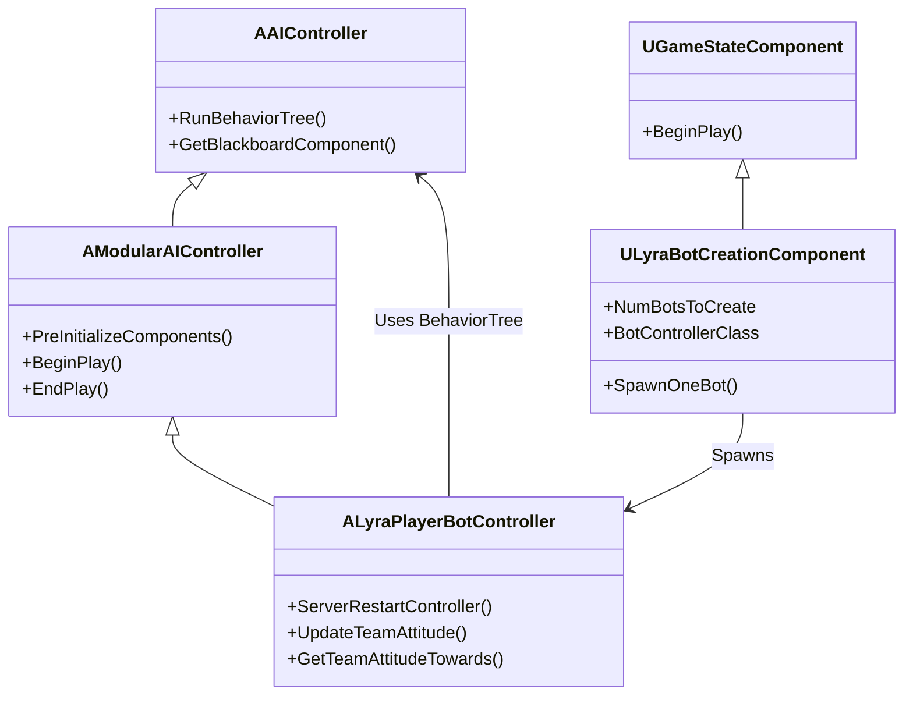
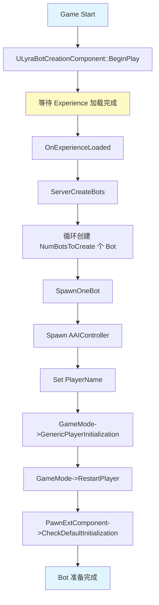
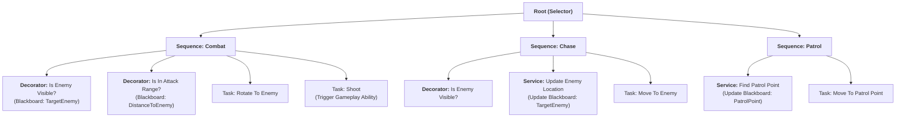

# LyraAI实战Bot控制与BehaviorTree

> 深入解析 Lyra 项目的 AI 系统实现，包括 Bot 创建流程、`ALyraPlayerBotController` 分析、BehaviorTree 使用，以及与 GAS 的集成。

---

## 概述

本文档详细分析 **LyraStarterGame** 项目的 AI 系统实现，帮助你：

1. **理解 Lyra AI 架构**：`ULyraBotCreationComponent` → `ALyraPlayerBotController` → BehaviorTree
2. **掌握 Bot 创建流程**：从 Experience 加载到 Bot Pawn 初始化
3. **分析核心 C++ 类**：`ALyraPlayerBotController`、`AModularAIController`
4. **了解 Lyra 的 BehaviorTree 使用**（基于蓝图资产）
5. **学习 GAS 集成**：Bot 如何使用 Gameplay Abilities

**前置知识**：
- [[30-tutorials/ai-behavior/02-BehaviorTree高级DecoratorService与EQS]] - BehaviorTree 高级

---

## 1. Lyra AI 架构概览

### 1.1 核心类继承树



**关键设计决策**：
1. **`ALyraPlayerBotController` 继承自 `AModularAIController`**：
   - 支持 Game Feature 插件扩展
   - 自动处理 Component 的初始化和销毁
2. **`ULyraBotCreationComponent` 是 `UGameStateComponent`**：
   - 挂载在 `AGameStateBase` 上
   - 可以访问 GameState 的所有信息
3. **Bot 也有 `PlayerState`**（`bWantsPlayerState = true`）：
   - 支持 GAS 集成（AbilitySystemComponent 挂在 PlayerState 上）
   - 支持团队系统（TeamID 存储在 PlayerState 中）

### 1.2 团队系统（ILyraTeamAgentInterface）

`ALyraPlayerBotController` 实现了 `ILyraTeamAgentInterface`，支持团队态度判断：

```cpp
// Source/LyraGame/Player/LyraPlayerBotController.h:35
virtual ETeamAttitude::Type GetTeamAttitudeTowards(const AActor& Other) const override;
```

**实现逻辑**（`LyraPlayerBotController.cpp:135-156`）：

```cpp
ETeamAttitude::Type ALyraPlayerBotController::GetTeamAttitudeTowards(const AActor& Other) const
{
    if (const APawn* OtherPawn = Cast<APawn>(&Other)) {
        if (const ILyraTeamAgentInterface* TeamAgent = Cast<ILyraTeamAgentInterface>(OtherPawn->GetController()))
        {
            FGenericTeamId OtherTeamID = TeamAgent->GetGenericTeamId();
            
            // 检查团队 ID
            if (OtherTeamID.GetId() != GetGenericTeamId().GetId())
            {
                return ETeamAttitude::Hostile;  // 不同团队 → 敌对
            }
            else
            {
                return ETeamAttitude::Friendly;  // 相同团队 → 友好
            }
        }
    }
    
    return ETeamAttitude::Neutral;  // 无法判断 → 中立
}
```

**关键点**：
- 团队态度是 **Actor 级别**（通过 Controller 的 TeamID 判断）
- 不同团队 → `Hostile`（AI 会攻击）
- 相同团队 → `Friendly`（AI 不会攻击）
- 无法判断 → `Neutral`（AI 忽略）

### 1.3 GAS 集成（Bot 也有 PlayerState）

`ALyraPlayerBotController` 的构造函数（`LyraPlayerBotController.cpp:17-22`）：

```cpp
ALyraPlayerBotController::ALyraPlayerBotController(const FObjectInitializer& ObjectInitializer)
    : Super(ObjectInitializer)
{
    bWantsPlayerState = true;           // Bot 也需要 PlayerState
    bStopAILogicOnUnposses = false;    // 取消 Possess 时不停止 AI 逻辑
}
```

**为什么 Bot 需要 PlayerState？**
1. **GAS 需要**：`UAbilitySystemComponent` 通常挂在 `PlayerState` 上（而不是 Pawn 上）
2. **团队系统需要**：`ILyraTeamAgentInterface` 通常实现在 `PlayerState` 上
3. **Score/Stats 需要**：Bot 的击杀数、死亡数等数据存储在 `PlayerState` 上

**GAS 集成流程**：
```
Bot 创建 → Spawn AAIController → InitPlayerState() → 创建 PlayerState
→ PlayerState 创建 AbilitySystemComponent → 挂载 AbilitySet
→ Bot Pawn 初始化 → 绑定 AbilitySystemComponent 到 Pawn
```

---

## 2. Bot 创建流程（ULyraBotCreationComponent）

### 2.1 组件初始化（BeginPlay）

`ULyraBotCreationComponent::BeginPlay()`（`LyraBotCreationComponent.cpp:21-30`）：

```cpp
void ULyraBotCreationComponent::BeginPlay()
{
    Super::BeginPlay();

    // 监听 Experience 加载完成事件
    AGameStateBase* GameState = GetGameStateChecked<AGameStateBase>();
    ULyraExperienceManagerComponent* ExperienceComponent = GameState->FindComponentByClass<ULyraExperienceManagerComponent>();
    check(ExperienceComponent);
    
    // 注册回调：Experience 加载完成后调用 OnExperienceLoaded()
    ExperienceComponent->CallOrRegister_OnExperienceLoaded_LowPriority(
        FOnLyraExperienceLoaded::FDelegate::CreateUObject(this, &ThisClass::OnExperienceLoaded)
    );
}
```

**关键点**：
- Bot 创建**必须等待 Experience 加载完成**（因为 Experience 定义了 Bot 的 Pawn、AbilitySet 等）
- 使用 `CallOrRegister_OnExperienceLoaded_LowPriority` 确保 Bot 在玩家之后创建

### 2.2 等待 Experience 加载

`ULyraBotCreationComponent::OnExperienceLoaded()`（`LyraBotCreationComponent.cpp:32-40`）：

```cpp
void ULyraBotCreationComponent::OnExperienceLoaded(const ULyraExperienceDefinition* Experience)
{
#if WITH_SERVER_CODE
    if (HasAuthority())
    {
        ServerCreateBots();  // 开始创建 Bot
    }
#endif
}
```

### 2.3 创建 Bot（SpawnOneBot）

`ULyraBotCreationComponent::ServerCreateBots()`（`LyraBotCreationComponent.cpp:44-78`）：

```cpp
void ULyraBotCreationComponent::ServerCreateBots_Implementation()
{
    if (BotControllerClass == nullptr)
    {
        return;
    }

    RemainingBotNames = RandomBotNames;

    // 确定要创建的 Bot 数量
    int32 EffectiveBotCount = NumBotsToCreate;

    // 允许开发者设置覆盖（用于调试）
    if (GIsEditor)
    {
        const ULyraDeveloperSettings* DeveloperSettings = GetDefault<ULyraDeveloperSettings>();
        if (DeveloperSettings->bOverrideBotCount)
        {
            EffectiveBotCount = DeveloperSettings->OverrideNumPlayerBotsToSpawn;
        }
    }

    // 允许 URL 参数覆盖（用于测试）
    if (AGameModeBase* GameModeBase = GetGameMode<AGameModeBase>())
    {
        EffectiveBotCount = UGameplayStatics::GetIntOption(
            GameModeBase->OptionsString, 
            TEXT("NumBots"), 
            EffectiveBotCount
        );
    }

    // 创建 Bot
    for (int32 Count = 0; Count < EffectiveBotCount; ++Count)
    {
        SpawnOneBot();
    }
}
```

`ULyraBotCreationComponent::SpawnOneBot()`（`LyraBotCreationComponent.cpp:98-129`）：

```cpp
void ULyraBotCreationComponent::SpawnOneBot()
{
    FActorSpawnParameters SpawnInfo;
    SpawnInfo.SpawnCollisionHandlingOverride = ESpawnActorCollisionHandlingMethod::AlwaysSpawn;
    SpawnInfo.OverrideLevel = GetComponentLevel();
    SpawnInfo.ObjectFlags |= RF_Transient;

    // [1] Spawn AI Controller
    AAIController* NewController = GetWorld()->SpawnActor<AAIController>(
        BotControllerClass, 
        FVector::ZeroVector, 
        FRotator::ZeroRotator, 
        SpawnInfo
    );

    if (NewController != nullptr)
    {
        ALyraGameMode* GameMode = GetGameMode<ALyraGameMode>();
        check(GameMode);

        // [2] 设置 Bot 名称
        if (NewController->PlayerState != nullptr)
        {
            NewController->PlayerState->SetPlayerName(CreateBotName(NewController->PlayerState->GetPlayerId()));
        }

        // [3] 初始化 Controller（调用 InitPlayerState、BeginPlay 等）
        GameMode->GenericPlayerInitialization(NewController);

        // [4] 重启 Controller（Spawn Pawn 并 Possess）
        GameMode->RestartPlayer(NewController);

        // [5] 初始化 Pawn 的扩展组件（如 AbilitySystemComponent）
        if (NewController->GetPawn() != nullptr)
        {
            if (ULyraPawnExtensionComponent* PawnExtComponent = NewController->GetPawn()->FindComponentByClass<ULyraPawnExtensionComponent>())
            {
                PawnExtComponent->CheckDefaultInitialization();
            }
        }

        // [6] 记录到列表（用于后续删除）
        SpawnedBotList.Add(NewController);
    }
}
```

### 2.4 Bot 创建流程图



**关键点**：
1. **Bot 创建是服务器权威的**（`#if WITH_SERVER_CODE`）
2. **Bot 也有 PlayerState**（`bWantsPlayerState = true`）
3. **Bot 的 Pawn 初始化需要 `CheckDefaultInitialization`**（确保 GAS、Input 等系统正确初始化）

---

## 3. ALyraPlayerBotController 分析

### 3.1 构造函数配置

`ALyraPlayerBotController::ALyraPlayerBotController()`（`LyraPlayerBotController.cpp:17-22`）：

```cpp
ALyraPlayerBotController::ALyraPlayerBotController(const FObjectInitializer& ObjectInitializer)
    : Super(ObjectInitializer)
{
    bWantsPlayerState = true;           // Bot 也需要 PlayerState
    bStopAILogicOnUnposses = false;    // 取消 Possess 时不停止 AI 逻辑
}
```

**关键配置**：
- **`bWantsPlayerState = true`**：
  - Bot 也需要 PlayerState（用于 GAS、团队系统）
  - 如果不设置，Bot 无法使用 GAS
- **`bStopAILogicOnUnposses = false`**：
  - 当 Bot 的 Pawn 被销毁时（如死亡），AI 逻辑继续运行
  - 这允许 Bot 在死亡后自动重生（通过 `ServerRestartController()`）

### 3.2 团队态度（GetTeamAttitudeTowards）

（已在 **1.2 团队系统** 中详细分析）

**使用场景**：
- AI 感知系统（`UAIPerceptionComponent`）使用此函数判断目标是否敌对
- 如果返回 `Hostile`，AI 会攻击目标
- 如果返回 `Friendly`，AI 会忽略目标

### 3.3 感知更新（UpdateTeamAttitude）

`ALyraPlayerBotController::UpdateTeamAttitude()`（`LyraPlayerBotController.cpp:158-164`）：

```cpp
void ALyraPlayerBotController::UpdateTeamAttitude(UAIPerceptionComponent* AIPerception)
{
    if (AIPerception)
    {
        AIPerception->RequestStimuliListenerUpdate();  // 强制更新感知
    }
}
```

**作用**：
- 当 Bot 的团队发生变化时（如切换队伍），需要更新 AI 感知
- `RequestStimuliListenerUpdate()` 会重新评估所有感知目标的态度

### 3.4 控制器重启（ServerRestartController）

`ALyraPlayerBotController::ServerRestartController()`（`LyraPlayerBotController.cpp:104-133`）：

```cpp
void ALyraPlayerBotController::ServerRestartController()
{
    if (GetNetMode() == NM_Client)
    {
        return;  // 只在服务器执行
    }

    ensure((GetPawn() == nullptr) && IsInState(NAME_Inactive));

    if (IsInState(NAME_Inactive) || (IsInState(NAME_Spectating)))
    {
        ALyraGameMode* const GameMode = GetWorld()->GetAuthGameMode<ALyraGameMode>();

        if ((GameMode == nullptr) || !GameMode->ControllerCanRestart(this))
        {
            return;
        }

        // 如果还附着到旧 Pawn，先取消 Possess
        if (GetPawn() != nullptr)
        {
            UnPossess();
        }

        // 重新启用输入
        ResetIgnoreInputFlags();

        // 重启 Player（Spawn 新 Pawn 并 Possess）
        GameMode->RestartPlayer(this);
    }
}
```

**使用场景**：
- Bot 死亡后自动重生
- 调用链：`Bot Pawn 死亡` → `Delay` → `ServerRestartController()` → `RestartPlayer()` → `Spawn 新 Pawn`

---

## 4. Lyra 的 BehaviorTree 资产

### 4.1 资产路径

根据 SubAgent 调研，Lyra 的 BehaviorTree 相关资产位于：

```text
Plugins/GameFeatures/ShooterCore/Content/Bot/
├── B_AI_Controller_LyraShooter.uasset    # AI 控制器蓝图
├── BT/
│   ├── BT_Lyra_Shooter_Bot.uasset        # BehaviorTree 资产
│   └── BB_Lyra_Shooter_Bot.uasset       # Blackboard 资产
```

**注意**：
- 这些是 **蓝图资产**（`.uasset` 是二进制文件），无法直接读取源码
- 需要通过 UE 编辑器打开才能查看具体逻辑

### 4.2 如何查看蓝图资产

**方法 1：使用 UE 编辑器**：
1. 打开 LyraStarterGame 项目
2. 在 **Content Browser** 中导航到 `Plugins/GameFeatures/ShooterCore/Content/Bot/BT/`
3. 双击 `BT_Lyra_Shooter_Bot` 打开 BehaviorTree 编辑器

**方法 2：使用 `UnrealPak` 解包**（如果需要自动化）：
```bash
# 解包 .pak 文件
UnrealPak.exe -Extract D:\EpicGames\Lyra\LyraStarterGame\Saved\StagedBuilds\Windows\LyraStarterGame\Content\Paks\LyraStarterGame-Windows.pak -Output=D:\Extracted
```

**方法 3：使用 Python 脚本读取 `.uasset` 头部信息**（有限）：
```python
# 读取 .uasset 文件的头部（包含资产类型、名称等信息）
import struct

def read_uasset_header(filepath):
    with open(filepath, 'rb') as f:
        # 读取文件头部
        data = f.read(100)  # 读取前 100 字节
        print(data.hex())
```

### 4.3 Lyra 的 AI 逻辑推测（基于类名和社区资料）

虽然无法直接读取 `.uasset` 文件，但可以根据类名和社区资料推测 Lyra 的 AI 逻辑：

**推测的 BehaviorTree 结构**（基于 `B_AI_Controller_LyraShooter` 和社区资料）：



**关键点**：
1. **BehaviorTree 运行在 `B_AI_Controller_LyraShooter` 中**：
   - 这是一个 Blueprint 类，继承自 `ALyraPlayerBotController`
   - 在 Blueprint 的 `BeginPlay` 或 `OnPossess` 事件中调用 `Run Behavior Tree` 节点
2. **Blackboard 数据**：
   - `TargetEnemy`（`AActor*`）：目标敌人
   - `PatrolPoint`（`FVector`）：巡逻点坐标
   - `DistanceToEnemy`（`float`）：到敌人的距离
3. **Tasks 可能触发 Gameplay Abilities**：
   - `Task: Shoot` 可能调用 `AbilitySystemComponent->TryActivateAbilityByClass()`
   - 这样可以复用 Hero 的射击 Ability

---

## 5. Lyra AI 的 GAS 集成

### 5.1 Bot 的 AbilitySet 配置

Lyra 使用 **Experience** 系统配置 Bot 的 AbilitySet。

**推测的配置流程**：
1. **Experience Definition**（`ULyraExperienceDefinition`）：
   - 包含 `PawnData`（`ULyraPawnData`）
   - `PawnData` 包含 `AbilitySets`（能力集合）
2. **Bot Spawn 时**：
   - `GameMode->RestartPlayer()` → Spawn Pawn
   - `PawnExtComponent->CheckDefaultInitialization()` → 初始化 GAS
   - `AbilitySystemComponent->InitAbilityActorInfo()` → 绑定 Pawn 和 PlayerState
   - `AbilitySet->GiveToAbilitySystem()` → 赋予 Bot 所有 Ability
3. **Bot 的 Ability 触发**：
   - BehaviorTree 的 Task 中调用 `AbilitySystemComponent->TryActivateAbilityByClass()`
   - 例如：`Task: Shoot` → 触发 `GA_Shoot` Ability

### 5.2 如何触发 Gameplay Abilities

**方法 1：在 BehaviorTree Task 中触发**：

```cpp
// 自定义 Task：BTTask_TriggerAbility.cpp
EBTNodeResult::Type UBTTask_TriggerAbility::ExecuteTask(UBehaviorTreeComponent& OwnerComp, uint8* NodeMemory)
{
    // 获取 AbilitySystemComponent
    UAbilitySystemComponent* ASC = UAbilitySystemGlobals::GetAbilitySystemComponentFromActor(OwnerComp.GetOwner());
    if (ASC == nullptr)
    {
        return EBTNodeResult::Failed;
    }

    // 触发 Ability
    bool bActivated = ASC->TryActivateAbilityByClass(AbilityToActivate);
    
    return bActivated ? EBTNodeResult::Succeeded : EBTNodeResult::Failed;
}
```

**方法 2：在 Evaluator 中触发**（如果使用 StateTree）：
- StateTree 的 Task 可以调用 `AbilitySystemComponent->TryActivateAbilityByClass()`
- 这样可以在状态激活时自动触发 Ability

### 5.3 Gameplay Tags 的使用

Lyra 使用 **Gameplay Tags** 标识 Ability、State、Event。

**常用 Gameplay Tags**（基于社区资料）：
- `Ability.Attack.Shoot` - 射击 Ability
- `Ability.Movement.Sprint` - 冲刺 Ability
- `State.Dead` - 死亡状态
- `Event.Ability.Shoot` - 射击事件

**在 AI 中使用 Gameplay Tags**：
1. **BehaviorTree Decorator**：检查目标是否有特定 Tag
   - 例如：`Decorator: Has Gameplay Tag (State.Dead)` → 如果目标死亡，停止攻击
2. **BehaviorTree Task**：触发 Gameplay Event
   - 例如：`Task: Send Gameplay Event (Event.Ability.Shoot)` → 触发射击 Ability

---

## 6. 调试 Lyra AI

### 6.1 ShowDebug 命令

UE 提供了内置的 `ShowDebug` 命令用于调试 AI。

**常用命令**：
```
# 显示 AI 调试信息
ShowDebug AI

# 显示 BehaviorTree 执行流
ShowDebug BehaviorTree

# 显示 EQS 查询结果
ShowDebug EQS

# 显示 AI 感知信息
ShowDebug AIPerception
```

**Lyra 自定义 ShowDebug**（如果有）：
- Lyra 可能扩展了 `ShowDebug` 命令，显示 GAS 相关信息
- 查看 `ALyraPlayerBotController` 中是否有 `DisplayDebug()` 函数重写

### 6.2 Visual Logger

**Visual Logger** 是 UE 的强大调试工具，可以记录 AI 的决策过程。

**启用 Visual Logger**：
1. 在 UE 编辑器中，点击 **Window** → **Developer Tools** → **Visual Logger**
2. 运行游戏，Visual Logger 会自动记录
3. 可以回放、查看每一帧的 AI 决策

**在 C++ 中使用 Visual Logger**：
```cpp
#include "VisualLogger/VisualLogger.h"

void MyFunction()
{
    UE_VLOG(ThisActor, LogMyCategory, Log, TEXT("AI 决策：追击敌人 %s"), *Enemy->GetName());
}
```

### 6.3 自定义调试 HUD

可以创建自定义 HUD，在屏幕上显示 AI 状态。

**示例**：
```cpp
// 在 ALyraPlayerBotController 中
void ALyraPlayerBotController::DrawDebugHUD()
{
    // 获取当前 StateTree/BehaviorTree 状态
    FString CurrentState = GetCurrentStateName();
    
    // 绘制到屏幕
    GEngine->AddOnScreenDebugMessage(-1, 0, FColor::Green, 
        FString::Printf(TEXT("AI State: %s"), *CurrentState));
}
```

---

## 7. 总结与要点

| 要点 | 说明 |
|------|------|
| **Bot 创建流程** | `ULyraBotCreationComponent` → 等待 Experience → `SpawnOneBot()` → `RestartPlayer()` |
| **团队系统** | `GetTeamAttitudeTowards()` 判断敌对/友好/中立 |
| **GAS 集成** | Bot 也有 PlayerState，`bWantsPlayerState = true` |
| **BehaviorTree 资产** | `BT_Lyra_Shooter_Bot.uasset`（蓝图资产，需编辑器打开） |
| **调试工具** | `ShowDebug AI`、`Visual Logger`、自定义 HUD |

**关键源码文件**：
- `Source/LyraGame/Player/LyraPlayerBotController.h/cpp`
- `Source/LyraGame/GameModes/LyraBotCreationComponent.h/cpp`
- `Plugins/ModularGameplayActors/Source/ModularGameplayActors/Public/ModularAIController.h`

---

## 8. 相关页面

- ← [[30-tutorials/ai-behavior/04-StateTree核心机制|上一课：StateTree 核心机制]]
- → [[30-tutorials/ai-behavior/06-BehaviorTree到StateTree迁移指南|下一课：迁移指南]]

<!-- nav:auto -->

---

**导航**: ← [[30-tutorials/ai-behavior/04-StateTree核心机制|04-StateTree核心机制]] · [[30-tutorials/ai-behavior/06-BehaviorTree到StateTree迁移指南|06-BehaviorTree到StateTree迁移指南]] →

<!-- /nav:auto -->
