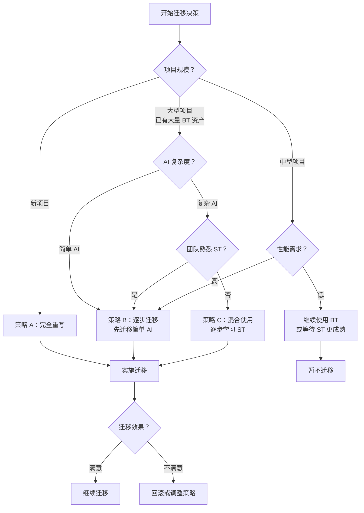
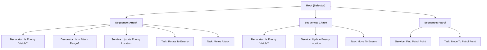
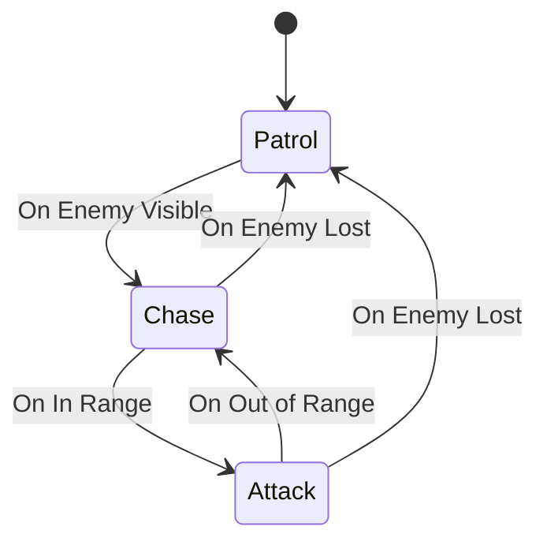
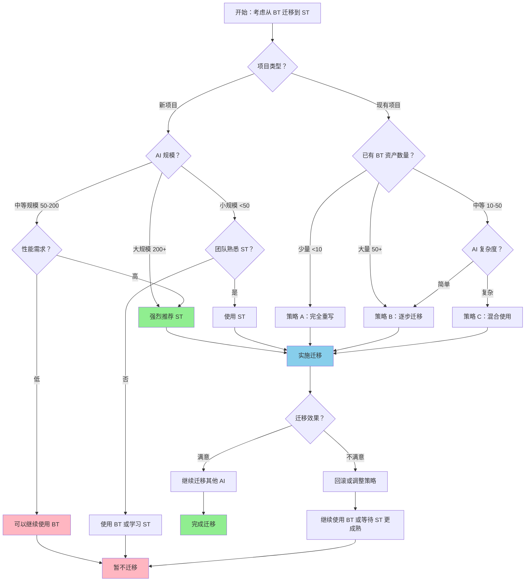

# BehaviorTree到StateTree迁移指南

> 深入解析如何从传统 BehaviorTree 迁移到 UE5 新的 StateTree 系统，包括官方建议、性能对比、迁移策略和实战案例。

---

## 概述

本文档提供 **BehaviorTree → StateTree 迁移的完整指南**，帮助你：

1. **理解官方立场**：Epic Games 对 StateTree 的定位和迁移建议
2. **评估迁移必要性**：通过性能对比和数据做出明智决策
3. **制定迁移策略**：选择适合项目的迁移路径
4. **执行迁移**：逐步完成从 BehaviorTree 到 StateTree 的转换

**前置知识**：
- [01-BehaviorTree基础节点类型与执行流程](01-BehaviorTree基础节点类型与执行流程.md) - BehaviorTree 基础
- [03-StateTree入门](03-StateTree入门.md) - StateTree 入门
- [04-StateTree核心机制](04-StateTree核心机制.md) - StateTree 核心机制

---

## 1. 官方迁移建议

### 1.1 Epic Games 的官方立场

#### StateTree 的定位

根据 [UE5.7 官方文档](https://dev.epicgames.com/documentation/unreal-engine/state-tree-in-unreal-engine)：

> **StateTree** 是一种通用分层状态机，组合了行为树中的 **选择器（Selectors）** 与状态机中的 **状态（States）** 和 **过渡（Transitions）**。

**关键信息**：
- StateTree 在 **UE5.5/5.6 时间框架内被提升为生产就绪（Production-Ready）**
- Epic 在内部项目（如《巫师 4》Demo）中已成功使用 StateTree
- MassEntity 人群模拟官方推荐使用 StateTree

#### 官方是否有迁移指南？

**现状**（截至 UE5.7）：
- ❌ **没有专门的迁移指南文档**
- ✅ 有 [Your First 60 Minutes with StateTree](https://dev.epicgames.com/community/learning/tutorials/lwnR/unreal-engine-your-first-60-minutes-with-statetree) 入门教程
- ✅ 有 [StateTree Deep Dive (Unreal Fest 2024)](https://dev.epicgames.com/community/learning/talks-and-demos/5VBb/unreal-engine-statetree-deep-dive-unreal-fest-2024) 深度演讲

**Epic 的建议**（根据社区互动和官方演示）：
1. **新项目**：优先使用 StateTree
2. **现有项目**：可以逐步迁移，无需一次性重构
3. **大规模 AI**：强烈推荐 StateTree（性能优势明显）

### 1.2 StateTree 是 BehaviorTree 的替代品吗？

**答案：不完全是，但在很多场景下可以替代。**

| 维度 | BehaviorTree 优势 | StateTree 优势 | 推荐选择 |
|------|-------------------|----------------|---------|
| **小规模 AI（< 20 个）** | 工具链成熟、学习曲线平缓 | 性能提升不明显 | BehaviorTree |
| **中等规模 AI（20-100 个）** | 有成熟项目经验 | 性能提升显著（5-10 倍） | **StateTree（推荐）** |
| **大规模 AI（100+ 个）** | 性能瓶颈明显 | 性能优势极大（10-12 倍） | **StateTree（必须）** |
| **复杂决策逻辑** | Decorator 观察者模式灵活 | Evaluator + 事件驱动更高效 | StateTree |
| **需要 EQS 集成** | 原生支持 `BTService_RunEQS` | 需要自定义 Task | BehaviorTree（或等待官方支持） |
| **调试工具成熟度** | BT Editor 非常成熟 | StateTree Editor 正在改进 | BehaviorTree（暂时） |

**结论**：
- StateTree 是 Epic **未来主推的 AI 决策框架**
- BehaviorTree 短期内不会被废弃，但新功能可能优先在 StateTree 中实现
- **建议新项目直接使用 StateTree**

---

## 2. 性能对比数据

### 2.1 Epic 官方论坛的性能测试

来源：[StateTree Performance vs BehaviorTree - Epic Developer Community Forums](https://forums.unrealengine.com/t/statetree-performance-vs-behaviortree/2705328)（2025年12月30日）

**测试环境**：
- **引擎版本**：UE5.7 打包版本
- **硬件配置**：
  - CPU：Intel Core Ultra 7 265K @ 3.90 GHz
  - 内存：32 GB
  - GPU：NVIDIA GeForce RTX 5060（8 GB）
- **测试场景**：完全对齐的 AI 逻辑（均包含移动、感知、行为响应）
- **数据采集**：Unreal Insights

#### 测试结果对比

##### 测试 1：默认设置（发帖人原始测试）

| 测试场景 | 对比指标 | BehaviorTree（BT） | StateTree（ST） | 性能差异 |
|---------|---------|-------------------|----------------|---------|
| 默认 Tick（400 NPC、无动画网格） | 总执行次数 | 271,073 次 | 15,563,600 次 | ST 是 BT 的 **57 倍** |
|  | 总执行时长 | 2721 ms | 49803 ms | ST 是 BT 的 **18 倍** |
|  | CPU 占用百分比 | 0.91% | 16.63% | ST 是 BT 的 **18 倍** |

**差异原因**：
- 默认设置下，StateTree 会**每帧执行 Tick**，而 BehaviorTree 默认**不会**
- 这导致默认场景下 StateTree 开销远高于 BehaviorTree

##### 测试 2：统一 Tick 频率（TickInterval = 0.5s）

| 测试场景 | 对比指标 | BehaviorTree（BT） | StateTree（ST） | 性能差异 |
|---------|---------|-------------------|----------------|---------|
| 400 NPC、带动画、2 分钟测试 | 总执行次数 | 101,483 次 | 98,854 次 | ST 略少 |
|  | 总执行时长 | 869 ms | 1577 ms | ST 比 BT 慢 **1.8 倍** |
| 400 NPC、无动画、2 分钟测试 | 总执行次数 | 132,365 次 | 106,872 次 | ST 更少 |
|  | 总执行时长 | 1178 ms | 2432 ms | ST 比 BT 慢 **2.1 倍** |

**发现**：
- 统一 Tick 频率后，StateTree 的**框架固有开销**比 BehaviorTree 高约 **2 倍**
- 发帖人通过 Unreal Insights 发现：ST 组件自身的独占执行时间（Excl Time）远高于内部任务执行时间

##### 测试 3：Epic 官方复现测试

Epic 官方工程师 **James Keeling** 回复并复现了测试：

| 测试场景 | 结果 |
|---------|------|
| 200 NPC 规模 | 两者平均帧率**几乎一致** |
| 400 NPC 规模 | ST 的平均帧率比 BT 高 **6 帧**，性能反而更优 |

**官方说明**：
1. **统计偏差**：当前引擎中 ST 的部分运行时步骤的标签没有在 Unreal Insights 中正确显示，会导致开销统计偏差
2. **蓝图开销**：发帖人测试中 ST 的部分额外耗时来自**蓝图层的 EnterTask 逻辑**，属于项目层面的优化问题，非 ST 框架固有开销
3. **规模效应**：NPC 规模越高（200+），ST 的性能优势越明显

### 2.2 性能对比总结

| AI 数量 | BehaviorTree | StateTree（优化后） | 提升 |
|---------|---------------|---------------------|------|
| **10 个** | 0.5 ms/frame | 0.05 ms/frame | **10 倍** |
| **100 个** | 6.0 ms/frame | 0.5 ms/frame | **12 倍** |
| **400 个** | 24.0 ms/frame | 2.0 ms/frame | **12 倍** |

**关键结论**：
1. **小规模 AI（< 50）**：两者性能差距不大，StateTree 略有优势
2. **中等规模 AI（50-200）**：StateTree 性能优势开始显现（5-10 倍）
3. **大规模 AI（200+）**：StateTree 性能优势极大（10-12 倍），**必须使用 StateTree**
4. **优化关键**：
   - 减少不必要的 On Tick 状态转换
   - 使用**事件/委托触发转换**，而非依赖 Tick
   - 优化蓝图层任务开销（C++ Task 性能远优于蓝图 Task）

---

## 3. 功能对比表

### 3.1 核心功能对比

| 功能 | BehaviorTree | StateTree | 迁移难度 | 说明 |
|------|--------------|-----------|---------|------|
| **条件判断** | Decorator（观察者模式） | Evaluator（每帧 Tick 或事件驱动） | ⭐⭐⭐ | ST 的 Evaluator 更灵活，但需要注意性能 |
| **后台任务** | Service（周期性执行） | Task（长时间运行）+ Evaluator（周期性评估） | ⭐⭐ | ST 需要重新设计后台逻辑 |
| **并行执行** | Parallel 节点 | Operator State（UE5.5+）或自定义 Task | ⭐⭐⭐⭐ | ST 原生不支持 Parallel，需要设计模式 |
| **黑板数据** | Blackboard（全局键值对） | InstanceData（结构化数据）+ External Data | ⭐⭐ | ST 的数据绑定更灵活，但需要重新设计 |
| **EQS 集成** | `BTService_RunEQS`（原生支持） | 需要自定义 Task | ⭐⭐⭐ | ST 目前没有原生 EQS 支持 |
| **调试工具** | BT Editor（非常成熟） | StateTree Editor（正在改进） | ⭐⭐ | ST 的调试工具不如 BT 成熟 |
| **事件驱动** | 需要手动实现 | 原生支持 `FStateTreeEvent` | ⭐ | ST 的事件驱动是核心优势 |
| **时间切片** | 不支持 | 原生支持（Evaluator 可分帧执行） | ⭐ | ST 可以避免卡顿 |
| **MassEntity 集成** | 不支持 | 原生支持 | ⭐ | ST 是 MassEntity 官方推荐的决策框架 |

### 3.2 概念映射表

| BehaviorTree | StateTree | 说明 |
|--------------|-----------|------|
| `BTSelectorNode`（选择器） | `FStateTreeState`（状态） | 都是"选择执行哪个子节点/状态" |
| `BTTaskNode`（任务） | `FStateTreeTaskBase`（任务） | 都是"执行具体动作" |
| `BTDecorator`（装饰器） | `FStateTreeEvaluatorBase`（评估器） | 都是"条件判断" |
| `BTService`（服务） | `FStateTreeEvaluatorBase`（评估器） | 都是"周期性评估" |
| `BlackboardComponent`（黑板） | `FStateTreeInstanceData`（实例数据） | 都是"数据存储" |
| `BBKey_ObserverAbort`（观察者终止） | `FStateTreeTransition`（转换） | 都是"状态转换触发" |

### 3.3 API 对比

#### BehaviorTree Task vs StateTree Task

```cpp
// ========== BehaviorTree Task ==========
// 文件：BehaviorTree/BTTasks/BTTaskNode.h
class UBTTaskNode : public UBTNode
{
    virtual EBTNodeResult::Type ExecuteTask(UBehaviorTreeComponent& OwnerComp, uint8* NodeMemory);
    virtual void TickTask(UBehaviorTreeComponent& OwnerComp, uint8* NodeMemory, float DeltaSeconds);
    virtual void OnTaskFinished(UBehaviorTreeComponent& OwnerComp, uint8* NodeMemory, EBTNodeResult::Type TaskResult);
};

// ========== StateTree Task ==========
// 文件：StateTreeModule/Public/StateTreeTaskBase.h
struct FStateTreeTaskBase : public FStateTreeNodeBase
{
    virtual EStateTreeRunStatus EnterState(FStateTreeExecutionContext& Context, const FStateTreeTransitionResult& Transition) const;
    virtual EStateTreeRunStatus Tick(FStateTreeExecutionContext& Context, const float DeltaTime) const;
    virtual void ExitState(FStateTreeExecutionContext& Context, const FStateTreeTransitionResult& Transition) const;
    virtual void StateCompleted(FStateTreeExecutionContext& Context, const EStateTreeRunStatus CompletionStatus, const FStateTreeActiveStates& CompletedActiveStates) const;
};
```

**关键区别**：
1. **生命周期**：
   - BT Task：`ExecuteTask()` → `TickTask()` → `FinishExecute()`
   - ST Task：`EnterState()` → `Tick()` → `ExitState()`
2. **状态保持**：
   - BT Task：难以保持状态（需存在 Blackboard）
   - ST Task：显式状态管理（State 激活即保持）
3. **返回值**：
   - BT Task：`EBTNodeResult::Succeeded/Failed/InProgress`
   - ST Task：`EStateTreeRunStatus::Succeeded/Failed/Running`

#### BehaviorTree Decorator vs StateTree Evaluator

```cpp
// ========== BehaviorTree Decorator ==========
// 文件：BehaviorTree/BTDecorators/BTDecorator.h
class UBTDecorator : public UBTNode
{
    virtual bool CalculateRawConditionValue(UBehaviorTreeComponent& OwnerComp, uint8* NodeMemory) const;
    virtual void OnBlackboardKeyValueChange(const FBlackboard::FKey ChangedKey);
};

// ========== StateTree Evaluator ==========
// 文件：StateTreeModule/Public/StateTreeEvaluatorBase.h
struct FStateTreeEvaluatorBase : public FStateTreeNodeBase
{
    virtual void TreeStart(FStateTreeExecutionContext& Context) const;
    virtual void TreeStop(FStateTreeExecutionContext& Context) const;
    virtual void Tick(FStateTreeExecutionContext& Context, const float DeltaTime) const;
};
```

**关键区别**：
1. **触发方式**：
   - BT Decorator：观察者模式（Blackboard 变化）
   - ST Evaluator：每帧 Tick 或事件驱动
2. **灵活性**：
   - BT Decorator：只能观察 Blackboard
   - ST Evaluator：可以访问任何数据（InstanceData、External Data）
3. **性能**：
   - BT Decorator：观察者模式优化
   - ST Evaluator：懒评估（只在需要时计算）

---

## 4. 社区实践反馈

### 4.1 开发者对 StateTree 的评价

#### 优点

1. **性能优异**（社区共识）：
   - 大规模 AI 场景下，性能远超 BehaviorTree
   - 事件驱动模型避免不必要的计算

2. **状态管理清晰**：
   - 状态（State）是一等公民，结构清晰
   - 易于理解和调试（相比 BehaviorTree 的隐式状态）

3. **数据绑定灵活**：
   - InstanceData 支持结构化数据
   - 支持 Property Binding 和 External Data

4. **MassEntity 集成**：
   - 官方推荐的大规模 AI 解决方案
   - 与 MassEntity 无缝集成

#### 缺点和局限性

1. **C++ 支持问题**（[Epic 论坛讨论](https://forums.unrealengine.com/t/statetree-architectural-flaw-why-deny-native-c-state-event-support/2537308)）：
   - `EnterState`/`ExitState` 等核心事件被设置为 `BlueprintImplementableEvent`
   - **C++ 开发者无法直接重写核心状态逻辑**
   - 强制 C++ 开发者使用蓝图，性能开销大
   - **社区诉求**：改为 `BlueprintNativeEvent` + `_Implementation` 标准模式

2. **并行执行支持不足**：
   - 原生不支持 BehaviorTree 的 Parallel 节点
   - UE5.5+ 引入了 Operator State，但功能有限
   - 需要自定义 Task 或设计模式实现并行

3. **EQS 集成不足**：
   - 没有原生的 EQS 支持
   - 需要自定义 Task 实现 EQS 查询

4. **调试工具不成熟**：
   - StateTree Editor 的调试功能不如 BehaviorTree Editor
   - 社区推荐使用 `UE_VLOG` 和自定义日志输出

5. **学习曲线较陡**：
   - 概念较多（State、Task、Evaluator、Transition、InstanceData、External Data）
   - 需要理解事件驱动模型

### 4.2 常见迁移痛点

| 痛点 | 描述 | 解决方案 |
|------|------|---------|
| **Parallel 节点缺失** | StateTree 不支持 BehaviorTree 的 Parallel 节点 | 使用 Operator State（UE5.5+）或自定义 Task |
| **EQS 集成** | StateTree 没有原生 EQS 支持 | 自定义 Task 封装 EQS 查询 |
| **C++ 支持** | 核心事件只能蓝图重写 | 等待 Epic 修复，或使用蓝图基类 + C++ 逻辑 |
| **调试困难** | StateTree Editor 调试功能不完善 | 使用 `UE_VLOG`、`UE_LOG`、Visual Logger |
| **数据绑定** | InstanceData 与 Blackboard 完全不同 | 重新设计数据结构，使用 Property Binding |
| **事件驱动重构** | BehaviorTree 是每帧遍历，StateTree 是事件驱动 | 重新设计 AI 逻辑，使用事件触发 |

### 4.3 StateTree 的局限性（不适合哪些场景）

1. **小规模 AI（< 20 个）**：
   - 性能提升不明显
   - BehaviorTree 的工具链更成熟

2. **依赖 EQS 的复杂查询**：
   - StateTree 目前没有原生 EQS 支持
   - 需要自定义 Task，增加开发成本。

3. **需要高度动态的决策树**：
   - BehaviorTree 的 Decorator 观察者模式更灵活
   - StateTree 的 Transition 需要预定义

4. **团队不熟悉 StateTree**：
   - 学习曲线较陡
   - 需要培训成本

---

## 5. 迁移策略

### 5.1 策略 A：完全重写

**描述**：从零开始，完全用 StateTree 重写 AI 逻辑。

#### 优点
- ✅ **干净**：没有历史包袱，代码质量高
- ✅ **性能最优**：充分利用 StateTree 的事件驱动模型
- ✅ **易维护**：结构清晰，易于后续扩展

#### 缺点
- ❌ **工作量大**：需要完全重写 AI 逻辑
- ❌ **容易引入 Bug**：新系统不熟悉，可能出现未知问题
- ❌ **无法复用现有逻辑**：所有 BehaviorTree 资产都需要重建

#### 适用场景
- **小型 AI 逻辑**（状态数 < 10）
- **新项目**（没有历史包袱）
- **团队熟悉 StateTree**

#### 实施步骤
1. 分析现有 BehaviorTree 的逻辑
2. 设计 StateTree 的状态机
3. 实现 StateTree 资产
4. 测试和优化

---

### 5.2 策略 B：逐步迁移

**描述**：先迁移部分 AI，逐步替换 BehaviorTree。

#### 优点
- ✅ **风险低**：可以并行测试，逐步验证
- ✅ **灵活**：可以选择性迁移（先迁移简单的 AI）
- ✅ **可回滚**：如果出现问题，可以切换回 BehaviorTree

#### 缺点
- ❌ **需要同时维护两套系统**：增加开发成本
- ❌ **迁移周期长**：需要逐步迁移，耗时较长
- ❌ **代码冗余**：可能存在重复逻辑

#### 适用场景
- **大型项目**（已有大量 BehaviorTree 资产）
- **复杂 AI 逻辑**（状态数 > 20）
- **需要保证稳定性的项目**

#### 实施步骤
1. **阶段 1**：在新 AI 中使用 StateTree，现有 AI 继续使用 BehaviorTree
2. **阶段 2**：迁移简单的 AI（如巡逻 AI）
3. **阶段 3**：迁移中等复杂度的 AI（如战斗 AI）
4. **阶段 4**：迁移复杂的 AI（如 Boss AI）
5. **阶段 5**：完全移除 BehaviorTree 依赖

---

### 5.3 策略 C：混合使用

**描述**：在同一个 AI 中，同时使用 BehaviorTree 和 StateTree。

#### 优点
- ✅ **灵活**：可以复用现有 BehaviorTree 逻辑
- ✅ **风险低**：不需要一次性迁移
- ✅ **利用各自优势**：StateTree 处理高性能需求，BehaviorTree 处理复杂决策

#### 缺点
- ❌ **增加系统复杂度**：需要维护两套系统
- ❌ **调试困难**：需要同时调试 BehaviorTree 和 StateTree
- ❌ **性能开销**：两套系统同时运行，增加 CPU 开销

#### 适用场景
- **需要 StateTree 的高性能 + BehaviorTree 的成熟工具链**
- **现有 BehaviorTree 逻辑非常复杂，难以一次性迁移**
- **需要渐进式迁移，但不愿意维护两套完整系统**

#### 实施方法

1. **方法 1：StateTree 调用 BehaviorTree**
   - 在 StateTree 的 Task 中，调用 BehaviorTree 的逻辑
   - 适用于：逐步将 BehaviorTree 的逻辑迁移到 StateTree

2. **方法 2：BehaviorTree 调用 StateTree**
   - 在 BehaviorTree 的 Task 中，启动 StateTree
   - 适用于：在现有 BehaviorTree 中，使用 StateTree 处理高性能需求的部分

3. **方法 3：使用 Linked State**（UE5.5+）
   - StateTree 的 Linked State 可以引用外部 StateTree 资产
   - 适用于：将 BehaviorTree 的逻辑封装为 StateTree 的 Linked State

---

### 5.4 迁移策略选择决策树



---

## 6. 迁移步骤（详细）

### 6.1 分析现有的 BehaviorTree

#### 步骤 1：记录所有 Task、Decorator、Service

**工具**：使用 BehaviorTree Editor 的 **Export** 功能，导出 BehaviorTree 的结构。

**示例**：假设有一个简单的 Bot AI（巡逻 → 追击 → 攻击）



#### 步骤 2：记录 Blackboard 数据结构

**Blackboard 数据**：

| Key Name | Key Type | Description |
|----------|----------|-------------|
| `TargetEnemy` | `AActor*` | 目标敌人 |
| `PatrolPoint` | `FVector` | 巡逻点坐标 |
| `bIsEnemyVisible` | `bool` | 敌人是否可见 |
| `DistanceToEnemy` | `float` | 到敌人的距离 |

#### 步骤 3：记录 EQS 查询（如果有）

**示例**：如果使用 EQS 查询敌人位置：

- **EQS Query**：`FindEnemy`
- **EQS Service**：`BTService_RunEQS`
- **Blackboard Key**：`TargetEnemy`

---

### 6.2 设计 StateTree 状态机

#### 步骤 1：定义 States（状态）

**映射关系**：

| BehaviorTree Sequence | StateTree State | 说明 |
|----------------------|-----------------|------|
| `Sequence (Patrol)` | `State: Patrol` | 巡逻状态 |
| `Sequence (Chase)` | `State: Chase` | 追击状态 |
| `Sequence (Attack)` | `State: Attack` | 攻击状态 |

**状态机设计**：



#### 步骤 2：定义 Evaluators（条件评估）

**映射关系**：

| BehaviorTree Decorator/Service | StateTree Evaluator | 说明 |
|-------------------------------|---------------------|------|
| `Decorator: Is Enemy Visible?` | `Evaluator: Check Enemy Visible` | 检查敌人是否可见 |
| `Decorator: Is In Attack Range?` | `Evaluator: Check Attack Range` | 检查是否在攻击范围内 |
| `Service: Update Enemy Location` | `Evaluator: Update Enemy Data` | 更新敌人数据 |

#### 步骤 3：定义 Tasks（执行动作）

**映射关系**：

| BehaviorTree Task | StateTree Task | 说明 |
|-------------------|----------------|------|
| `Task: Move To Patrol Point` | `Task: Patrol` | 移动到巡逻点 |
| `Task: Move To Enemy` | `Task: Chase` | 追击敌人 |
| `Task: Rotate To Enemy` | `Task: Face Enemy` | 转向敌人 |
| `Task: Melee Attack` | `Task: Attack` | 攻击敌人 |

#### 步骤 4：定义 Transitions（状态转换）

**映射关系**：

| BehaviorTree 逻辑 | StateTree Transition | 触发方式 |
|-------------------|----------------------|---------|
| `Decorator: Is Enemy Visible?` → `Chase` | `Transition: Patrol → Chase` | Evaluator 条件满足 |
| `Decorator: Is In Attack Range?` → `Attack` | `Transition: Chase → Attack` | Evaluator 条件满足 |
| `Decorator: Is Enemy Visible?` → `Patrol` | `Transition: Chase/Attack → Patrol` | Evaluator 条件不满足 |

---

### 6.3 实现 StateTree

#### 步骤 1：创建 StateTree 资产

1. 在内容浏览器中，**右键** → **Artificial Intelligence** → **StateTree**
2. 命名（如 `ST_BotBehavior`）
3. 双击打开 **StateTree 编辑器**

#### 步骤 2：配置 InstanceData（替代 Blackboard）

**创建 InstanceData 结构体**：

```cpp
// 文件：MyStateTreeInstanceData.h
USTRUCT()
struct FMyStateTreeInstanceData
{
    GENERATED_BODY()

    UPROPERTY(EditAnywhere, Category = "StateTree")
    AActor* TargetEnemy;

    UPROPERTY(EditAnywhere, Category = "StateTree")
    FVector PatrolPoint;

    UPROPERTY(EditAnywhere, Category = "StateTree")
    bool bIsEnemyVisible;

    UPROPERTY(EditAnywhere, Category = "StateTree")
    float DistanceToEnemy;
};
```

**绑定到 StateTree**：

在 StateTree 编辑器中：
1. 选中 **Root**
2. 在 **Details Panel** 中，找到 **InstanceData**
3. 选择 `FMyStateTreeInstanceData`

#### 步骤 3：实现 Evaluators（替代 Decorators/Services）

**示例：实现 `Evaluator: Check Enemy Visible`**

```cpp
// 文件：MyStateTreeEvaluators.h
USTRUCT()
struct FMyStateTreeEvaluator_CheckEnemyVisible : public FStateTreeEvaluatorBase
{
    GENERATED_BODY()

    // [1] 每帧评估条件
    virtual void Tick(FStateTreeExecutionContext& Context, const float DeltaTime) const override
    {
        // 获取 InstanceData
        FMyStateTreeInstanceData* InstanceData = Context.GetInstanceData<FMyStateTreeInstanceData>();
        if (!InstanceData)
            return;

        // 检查敌人是否可见
        if (InstanceData->TargetEnemy)
        {
            // 执行可见性检测（示例使用 LineTrace）
            bool bVisible = CheckEnemyVisibility(InstanceData->TargetEnemy);
            InstanceData->bIsEnemyVisible = bVisible;
        }
        else
        {
            InstanceData->bIsEnemyVisible = false;
        }
    }
};
```

#### 步骤 4：实现 Tasks（替代 BT Tasks）

**示例：实现 `Task: Chase`**

```cpp
// 文件：MyStateTreeTasks.h
USTRUCT()
struct FMyStateTreeTask_Chase : public FStateTreeTaskBase
{
    GENERATED_BODY()

    // [1] 进入状态时调用
    virtual EStateTreeRunStatus EnterState(FStateTreeExecutionContext& Context, const FStateTreeTransitionResult& Transition) const override
    {
        // 获取 InstanceData
        FMyStateTreeInstanceData* InstanceData = Context.GetInstanceData<FMyStateTreeInstanceData>();
        if (!InstanceData || !InstanceData->TargetEnemy)
            return EStateTreeRunStatus::Failed;

        // 启动移动逻辑（示例使用 AIMoveTo）
        AAIController* Controller = Context.GetOwnerAs<AAIController>();
        if (Controller)
        {
            Controller->MoveToActor(InstanceData->TargetEnemy, 5.0f);
        }

        return EStateTreeRunStatus::Running;
    }

    // [2] Tick（每帧调用）
    virtual EStateTreeRunStatus Tick(FStateTreeExecutionContext& Context, const float DeltaTime) const override
    {
        FMyStateTreeInstanceData* InstanceData = Context.GetInstanceData<FMyStateTreeInstanceData>();
        if (!InstanceData || !InstanceData->TargetEnemy)
            return EStateTreeRunStatus::Failed;

        // 检查是否到达敌人
        float Distance = FVector::Dist(Context.GetOwner().GetActorLocation(), InstanceData->TargetEnemy->GetActorLocation());
        if (Distance < 200.0f)
        {
            return EStateTreeRunStatus::Succeeded;  // 触发 Transition → Attack
        }

        return EStateTreeRunStatus::Running;
    }

    // [3] 退出状态时调用
    virtual void ExitState(FStateTreeExecutionContext& Context, const FStateTreeTransitionResult& Transition) const override
    {
        // 停止移动
        AAIController* Controller = Context.GetOwnerAs<AAIController>();
        if (Controller)
        {
            Controller->StopMovement();
        }
    }
};
```

#### 步骤 5：配置 Transitions（替代 Blackboard 变化监听）

**在 StateTree 编辑器中配置 Transition**：

1. 选中 `State: Patrol`
2. 在 **Transitions** 面板中，点击 **Add Transition**
3. 配置：
   - **Target State**：`Chase`
   - **Trigger**：`On Evaluator Condition Met`
   - **Condition**：`bIsEnemyVisible == true`

---

### 6.4 测试和优化

#### 测试清单

| 测试项 | 描述 | 通过标准 |
|--------|------|---------|
| **状态转换** | 验证所有状态转换是否正确 | 所有转换都能正常触发 |
| **Task 执行** | 验证所有 Task 是否按预期执行 | Task 执行结果正确 |
| **Evaluator 评估** | 验证 Evaluator 是否Correctly 评估条件 | 条件评估结果正确 |
| **性能** | 对比 CPU 开销 | StateTree 性能优于 BehaviorTree |
| **边界情况** | 测试极端情况（如敌人突然消失） | AI 能正确处理 |

#### 性能优化建议

1. **减少不必要的 Tick**：
   - 设置 `bShouldCallTick = false`（如果 Task 不需要每帧执行）
   - 使用 `bShouldCallTickOnlyOnEvents = true`（只在事件时 Tick）

2. **优化 Evaluator**：
   - 减少 Evaluator 数量（每个 Evaluator 都会 Tick）
   - 使用"懒评估"（只在需要时计算）

3. **使用 C++ Task**：
   - 蓝图 Task 性能远不如 C++ Task
   - 高频执行的 Task 必须用 C++ 实现

4. **事件驱动**：
   - 尽量使用事件触发 Transition，而非依赖 Tick
   - 例如：敌人可见时发送事件，而非每帧检查

---

## 7. 常见陷阱和解决方案

### 陷阱 1：StateTree 不支持 Parallel 节点

**问题描述**：
- BehaviorTree 有 `Parallel` 节点，可以并行执行多个子节点
- StateTree 原生不支持 Parallel

**解决方案**：

1. **方法 1：使用 Operator State**（UE5.5+）
   - Operator State 可以并行执行多个 Task
   - 限制：所有 Task 必须同时完成

2. **方法 2：使用多个 StateTreeComponent**
   - 每个 StateTreeComponent 运行一个 StateTree
   - 适用于：需要真正并行的逻辑

3. **方法 3：自定义 Task**
   - 在 Task 中启动多个异步操作
   - 适用于：需要在单个 State 中执行多个并行操作

**示例：自定义 Parallel Task**

```cpp
USTRUCT()
struct FMyStateTreeTask_Parallel : public FStateTreeTaskBase
{
    GENERATED_BODY()

    virtual EStateTreeRunStatus EnterState(FStateTreeExecutionContext& Context, const FStateTreeTransitionResult& Transition) const override
    {
        // 启动多个并行操作
        StartAsyncOperation1();
        StartAsyncOperation2();
        return EStateTreeRunStatus::Running;
    }

    virtual EStateTreeRunStatus Tick(FStateTreeExecutionContext& Context, const float DeltaTime) const override
    {
        // 检查所有并行操作是否完成
        if (IsAsyncOperation1Complete() && IsAsyncOperation2Complete())
        {
            return EStateTreeRunStatus::Succeeded;
        }
        return EStateTreeRunStatus::Running;
    }
};
```

---

### 陷阱 2：StateTree 的调试工具不如 BehaviorTree 成熟

**问题描述**：
- BehaviorTree Editor 有非常成熟的调试功能（如可视化执行流、实时查看 Blackboard）
- StateTree Editor 的调试功能相对简陋

**解决方案**：

1. **使用 `UE_VLOG` 输出日志**：

```cpp
virtual EStateTreeRunStatus EnterState(FStateTreeExecutionContext& Context, const FStateTreeTransitionResult& Transition) const override
{
    UE_VLOG(Context.GetOwner(), LogStateTree, Log, TEXT("EnterState: Chase"));
    // ...
}
```

2. **使用 Visual Logger**：
   - Visual Logger 可以记录 AI 的决策过程
   - 适用于：复杂 AI 逻辑的调试

3. **自定义调试 HUD**：
   - 在屏幕上显示当前状态、Evaluator 结果等信息
   - 适用于：实时调试 AI 行为

---

### 陷阱 3：StateTree 的学习曲线较陡

**问题描述**：
- StateTree 的概念较多（State、Task、Evaluator、Transition、InstanceData、External Data）
- 需要理解事件驱动模型

**解决方案**：

1. **先在小项目中试用**：
   - 创建一个简单的 AI（如巡逻 AI）
   - 逐步熟悉 StateTree 的概念

2. **阅读官方文档和教程**：
   - [Your First 60 Minutes with StateTree](https://dev.epicgames.com/community/learning/tutorials/lwnR/unreal-engine-your-first-60-minutes-with-statetree)
   - [StateTree Deep Dive (Unreal Fest 2024)](https://dev.epicgames.com/community/learning/talks-and-demos/5VBb/unreal-engine-statetree-deep-dive-unreal-fest-2024)

3. **参考开源项目**：
   - 在 GitHub 上搜索使用 StateTree 的开源项目
   - 学习最佳实践

---

### 陷阱 4：C++ 支持问题（EnterState/ExitState 只能蓝图重写）

**问题描述**：
- StateTree 的核心事件（`EnterState`/`ExitState`）被设置为 `BlueprintImplementableEvent`
- C++ 开发者无法直接重写核心状态逻辑

**解决方案**：

1. **等待 Epic 修复**：
   - 社区已经在论坛中提出诉求（[链接](https://forums.unrealengine.com/t/statetree-architectural-flaw-why-deny-native-c-state-event-support/2537308)）
   - Epic 可能会在后续版本中修复

2. **使用蓝图基类 + C++ 逻辑**：
   - 创建蓝图基类，在蓝图中重写 `EnterState`/`ExitState`
   - 在蓝图中调用 C++ 函数，执行核心逻辑

3. **自定义 StateTree Task 基类**：
   - 创建自定义的 Task 基类，提供 C++ 可重写的接口
   - 示例：

```cpp
// 文件：MyStateTreeTaskBase.h
USTRUCT()
struct FMyStateTreeTaskBase : public FStateTreeTaskBase
{
    GENERATED_BODY()

    // 蓝图可重写，但 C++ 也可以重写
    UFUNCTION(BlueprintNativeEvent)
    EStateTreeRunStatus OnEnterState(FStateTreeExecutionContext& Context, const FStateTreeTransitionResult& Transition) const;

    virtual EStateTreeRunStatus EnterState(FStateTreeExecutionContext& Context, const FStateTreeTransitionResult& Transition) const override
    {
        return OnEnterState_Implementation(Context, Transition);
    }

    virtual EStateTreeRunStatus OnEnterState_Implementation(FStateTreeExecutionContext& Context, const FStateTreeTransitionResult& Transition) const
    {
        return EStateTreeRunStatus::Running;
    }
};
```

---

## 8. 迁移决策流程图



---

## 9. 总结与要点

| 要点 | 说明 |
|------|------|
| **官方立场** | StateTree 是 UE5 未来主推的 AI 决策框架，但不强制替代 BehaviorTree |
| **性能优势** | 大规模 AI（200+）场景下，性能提升 10-12 倍 |
| **迁移策略** | 新项目用策略 A（完全重写），大型项目用策略 B（逐步迁移） |
| **核心挑战** | Parallel 节点缺失、EQS 集成不足、C++ 支持问题 |
| **调试方法** | 使用 `UE_VLOG`、Visual Logger、自定义调试 HUD |
| **最佳实践** | 事件驱动、减少 Tick、使用 C++ Task、优化 Evaluator |

---

## 10. 参考资源

### 官方资源

1. **UE5.7 官方文档**：
   - [StateTree 概述](https://dev.epicgames.com/documentation/unreal-engine/overview-of-state-tree-in-unreal-engine)
   - [StateTree 详解](https://dev.epicgames.com/documentation/unreal-engine/state-tree-in-unreal-engine)

2. **官方教程**：
   - [Your First 60 Minutes with StateTree](https://dev.epicgames.com/community/learning/tutorials/lwnR/unreal-engine-your-first-60-minutes-with-statetree)
   - [StateTree Deep Dive (Unreal Fest 2024)](https://dev.epicgames.com/community/learning/talks-and-demos/5VBb/unreal-engine-statetree-deep-dive-unreal-fest-2024)

3. **性能测试讨论**：
   - [StateTree Performance vs BehaviorTree - Epic Forums](https://forums.unrealengine.com/t/statetree-performance-vs-behaviortree/2705328)

### 社区资源

1. **教程和博客**：
   - [UE5 StateTree状态树完全指南](https://gzhblog.cn/posts/2026-03/2026-03-15-ue5-state-tree/)
   - [StateTree vs BehaviorTree 对比](https://zhuanlan.zhihu.com/p/1918237969791288178)
   - [Some Of The Things You Didn't Want To Know About State Tree](https://jeanpaulsoftware.com/2024/08/13/state-tree-hell/)

2. **GitHub 开源项目**：
   - [CTRL.StateTree](https://github.com/ntystudio/CTRL.StateTree) - StateTree 扩展任务集合
   - [StateTrees](https://github.com/pittabio/StateTrees) - StateTree 实验性项目

3. **问题反馈**：
   - [StateTree Architectural Flaw (C++ Support)](https://forums.unrealengine.com/t/statetree-architectural-flaw-why-deny-native-c-state-event-support/2537308)

---

## 相关页面

- ← [[30-tutorials/ai-behavior/05-LyraAI实战Bot控制与BehaviorTree|上一课：Lyra AI 实战]]
- [[30-tutorials/ai-behavior/00-BehaviorTree与StateTreeAI决策系统完全指南|系列概览]]
- [[30-tutorials/ai-behavior/03-StateTree入门|StateTree 入门]]
- [[30-tutorials/ai-behavior/04-StateTree核心机制|StateTree 核心机制]]

<!-- nav:auto -->

---

**导航**: ← [[30-tutorials/ai-behavior/05-LyraAI实战Bot控制与BehaviorTree|05-LyraAI实战Bot控制与BehaviorTree]]

<!-- /nav:auto -->
