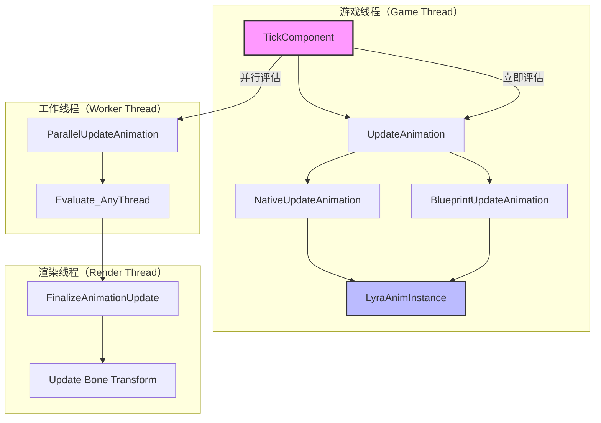
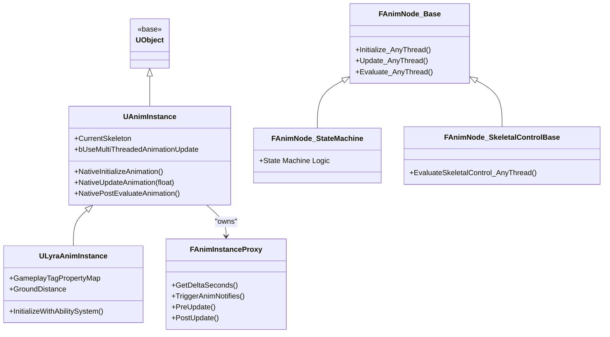
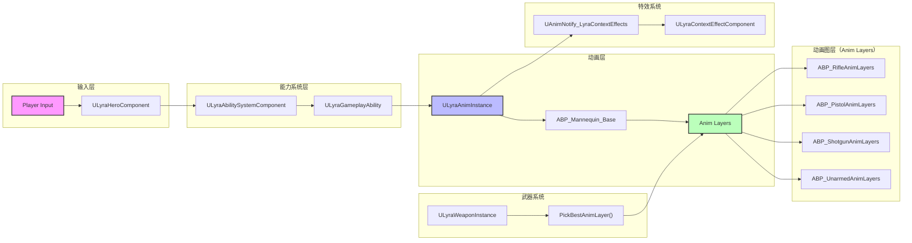
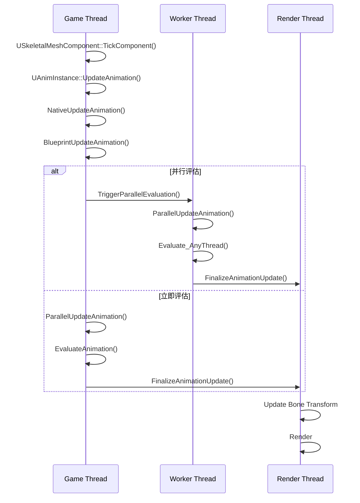

# Lyra动画系统框架深度分析-概览

> 本文档系列旨在深入分析 Unreal Engine 5 动画系统框架，并结合 LyraStarterGame 项目源码，帮助开发者理解动画系统的设计原理、实现细节及最佳实践。

## 文档系列导航

本系列共 8 个专题文档，按**由简到繁、先总体后细节**的原则组织：

| 序号 | 文档 | 内容概要 | 目标读者 |
|------|------|----------|----------|
| 01 | **Overview（本文档）** | 动画系统概览、架构图、术语表 | 初学者 / 系统架构师 |
| 02 | [Engine Foundation](02-UE5动画系统引擎基础框架深度分析.md) | UE5 动画引擎基础框架深度分析 | 中级 / 引擎程序员 |
| 03 | [Animation Resources](03-UE5动画资源与蓝图系统深度分析.md) | 动画资源与蓝图系统 | 中级 / 动画程序员 |
| 04 | [Anim Graph & State Machine](04-UE5动画图与状态机深度分析.md) | 动画图与状态机 | 中级 / 动画设计师 |
| 05 | [IK & Skeletal Control](05-UE5IK解算与骨骼控制深度分析.md) | IK 解算与骨骼控制 | 高级 / 动画程序员 |
| 06 | [Lyra Implementation](06-Lyra动画系统实现详解.md) | Lyra 动画系统实现详解 | Lyra 开发者 / 高级程序员 |
| 07 | [Notify & Effects](07-UE5动画通知与特效系统深度分析.md) | 动画通知与特效系统 | 中级 / 音频特效程序员 |
| 08 | [Advanced Topics](08-UE5动画系统高级主题与性能优化.md) | 高级主题与性能优化 | 高级程序员 / 性能优化工程师 |
| 09 | [Motion Matching](09-MotionMatching运动匹配深度解析.md) | Motion Matching 原理、设置与实战 | 高级 / 动画程序员 |

---

## 一、UE5 动画系统架构概览

### 1.1 核心架构图

### 1.2 核心类层次结构

---

## 二、Lyra 动画系统架构概览

### 2.1 Lyra 动画系统架构图

### 2.2 Lyra 动画系统核心组件

| 组件 | 类/资源 | 职责 |
|------|---------|------|
| **动画实例** | `ULyraAnimInstance` | GAS 集成、GameplayTag 映射、地面距离检测 |
| **英雄组件** | `ULyraHeroComponent` | 输入处理、触发 GAS Ability |
| **Pawn 扩展组件** | `ULyraPawnExtensionComponent` | 初始化 Ability System、连接动画实例 |
| **武器实例** | `ULyraWeaponInstance` | 动画图层选择（`PickBestAnimLayer`） |
| **基础动画蓝图** | `ABP_Mannequin_Base` | 角色基础动画逻辑 |
| **武器动画层** | `ABP_*AnimLayers` | 按武器类型分离的动画逻辑 |
| **上下文特效** | `ULyraContextEffectComponent` | 动画通知触发声音/特效 |

---

## 三、动画更新流程概览

### 3.1 完整更新流程

### 3.2 关键阶段说明

| 阶段 | 位置 | 说明 |
|------|------|------|
| **Tick** | `USkeletalMeshComponent::TickComponent()` | 每帧入口，决定并行或立即评估 |
| **Update** | `UAnimInstance::UpdateAnimation()` | 更新 Montage、调用 `NativeUpdateAnimation` |
| **Evaluate** | `FAnimNode_Root::Evaluate_AnyThread()` | 递归评估动画图，生成最终姿态 |
| **Post Update** | `UAnimInstance::PostUpdateAnimation()` | 后处理，同步数据到游戏线程 |

---

## 四、核心概念术语表

### 4.1 基础概念

| 术语 | 英文 | 说明 |
|------|------|------|
| **动画实例** | AnimInstance | 动画蓝图的基类，管理动画逻辑 |
| **动画蓝图** | Animation Blueprint | 基于 `UAnimInstance` 的可视化动画逻辑 |
| **动画蒙太奇** | AnimMontage | 可分割、可混合的动画资源，支持 Slot 和 Section |
| **混合空间** | BlendSpace | 基于参数（如速度、方向）混合多个动画 |
| **动画通知** | AnimNotify | 在动画特定帧触发事件 |
| **状态机** | State Machine | 管理动画状态转换 |
| **动画层** | Anim Layer | 可动态替换的动画逻辑层 |

### 4.2 高级概念

| 术语 | 英文 | 说明 |
|------|------|------|
| **IK（反向运动学）** | Inverse Kinematics | 根据末端位置计算骨骼链变换 |
| **FABRIK** | Forward And Backward Reaching Inverse Kinematics | UE5 中的 IK 解算算法 |
| **CCD IK** | Cyclic Coordinate Descent IK | 另一种 IK 解算算法 |
| **骨骼控制器** | Skeletal Control | 修改骨骼变换的动画节点 |
| **线程安全代理** | AnimInstanceProxy | 允许在工作线程安全更新动画 |
| **GameplayTag** | Gameplay Tag | UE5 GAS 中的标签系统，Lyra 用于驱动动画 |

### 4.3 Lyra 特有概念

| 术语 | 说明 |
|------|------|
| **GameplayTagPropertyMap** | 将 GameplayTag 自动映射到动画蓝图变量 |
| **AnimLayerSelectionSet** | 根据 CosmeticTags 动态选择动画图层 |
| **CosmeticTags** | 用于化妆和动画选择的标签 |
| **ContextEffects** | 基于上下文（如物理表面）触发特效的系统 |

---

## 五、源码位置索引

### 5.1 引擎源码（UE5）

| 类/结构 | 文件路径 |
|---------|----------|
| `UAnimInstance` | `Engine/Source/Runtime/Engine/Classes/Animation/AnimInstance.h` |
| `FAnimInstanceProxy` | `Engine/Source/Runtime/Engine/Public/Animation/AnimInstanceProxy.h` |
| `FAnimNode_Base` | `Engine/Source/Runtime/Engine/Classes/Animation/AnimNodeBase.h` |
| `FAnimNode_SkeletalControlBase` | `Engine/Source/Runtime/AnimGraphRuntime/Public/BoneControllers/AnimNode_SkeletalControlBase.h` |
| `UBlendSpace` | `Engine/Source/Runtime/Engine/Classes/Animation/BlendSpace.h` |
| `UAnimMontage` | `Engine/Source/Runtime/Engine/Classes/Animation/AnimMontage.h` |

### 5.2 Lyra 源码

| 类/资源 | 文件路径 |
|---------|----------|
| `ULyraAnimInstance` | `Source/LyraGame/Animation/LyraAnimInstance.h/cpp` |
| `ULyraHeroComponent` | `Source/LyraGame/Character/LyraHeroComponent.h/cpp` |
| `ULyraPawnExtensionComponent` | `Source/LyraGame/Character/LyraPawnExtensionComponent.h/cpp` |
| `ULyraWeaponInstance` | `Source/LyraGame/Weapons/LyraWeaponInstance.h/cpp` |
| `FLyraAnimLayerSelectionSet` | `Source/LyraGame/Cosmetics/LyraCosmeticAnimationTypes.h/cpp` |
| `ABP_Mannequin_Base` | `Content/Characters/Heroes/Mannequin/Animations/ABP_Mannequin_Base.uasset` |

---

## 六、后续文档预览

### 6.1 下一篇文档：Engine Foundation

[02-UE5动画系统引擎基础框架深度分析](02-UE5动画系统引擎基础框架深度分析.md) 将深入分析：

1. **UAnimInstance 深度分析**
   - 源码路径：`Engine/Source/Runtime/Engine/Classes/Animation/AnimInstance.h`
   - 核心属性：`CurrentSkeleton`, `bUseMultiThreadedAnimationUpdate`
   - 关键虚函数：`NativeInitializeAnimation()`, `NativeUpdateAnimation()`

2. **FAnimInstanceProxy 线程安全机制**
   - 设计目的：允许在工作线程上安全更新动画
   - 核心方法：`PreUpdate()`, `Update_AnyThread()`, `Evaluate_AnyThread()`

3. **FAnimNode_Base 动画节点基类**
   - 节点执行流程：`Initialize` → `Update` → `Evaluate`
   - 主要派生类：`FAnimNode_AssetPlayerBase`, `FAnimNode_SkeletalControlBase`

### 6.2 文档系列学习路径

### 6.2 文档系列学习路径

```mermaid
graph LR
    A["01 Overview"] --> B["02 Engine Foundation"]
    B --> C["03 Animation Resources"]
    C --> D["04 Anim Graph & State Machine"]
    D --> E["05 IK & Skeletal Control"]
    E --> F["06 Lyra Implementation"]
    F --> G["07 Notify & Effects"]
    G --> H["08 Advanced Topics"]
    H --> I["09 Motion Matching"]

    style A fill:#f9f,stroke:#333,stroke-width:2px
    style I fill:#bfb,stroke:#333,stroke-width:2px
```

**建议学习路径**：
- **初学者**：01 → 03 → 04 → 07
- **中级开发者**：01 → 02 → 04 → 06
- **高级开发者**：02 → 05 → 06 → 08 → 09

---

## 七、参考资料

1. [Unreal Engine 5 官方文档 - 动画系统](https://docs.unrealengine.com/5.0/zh-CN/animation-in-unreal-engine/)
2. [Lyra 示例项目说明](https://docs.unrealengine.com/5.0/zh-CN/lyra-sample-game-in-unreal-engine/)
3. [Gameplay Ability System](https://docs.unrealengine.com/5.0/zh-CN/gameplay-ability-system-for-unreal-engine/)
4. [UE5 Animation System Source Code](https://github.com/EpicGames/UnrealEngine/tree/5.0/Engine/Source/Runtime/Engine/Classes/Animation)

---

> **最后更新**：2026-05-16
> **状态**：current
> **维护者**：AI Agent (project-wiki skill)

<!-- nav:auto -->

---

**导航**: [[30-tutorials/animation/02-UE5动画系统引擎基础框架深度分析|02-UE5动画系统引擎基础框架深度分析]] →

<!-- /nav:auto -->
