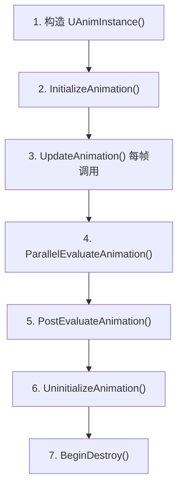
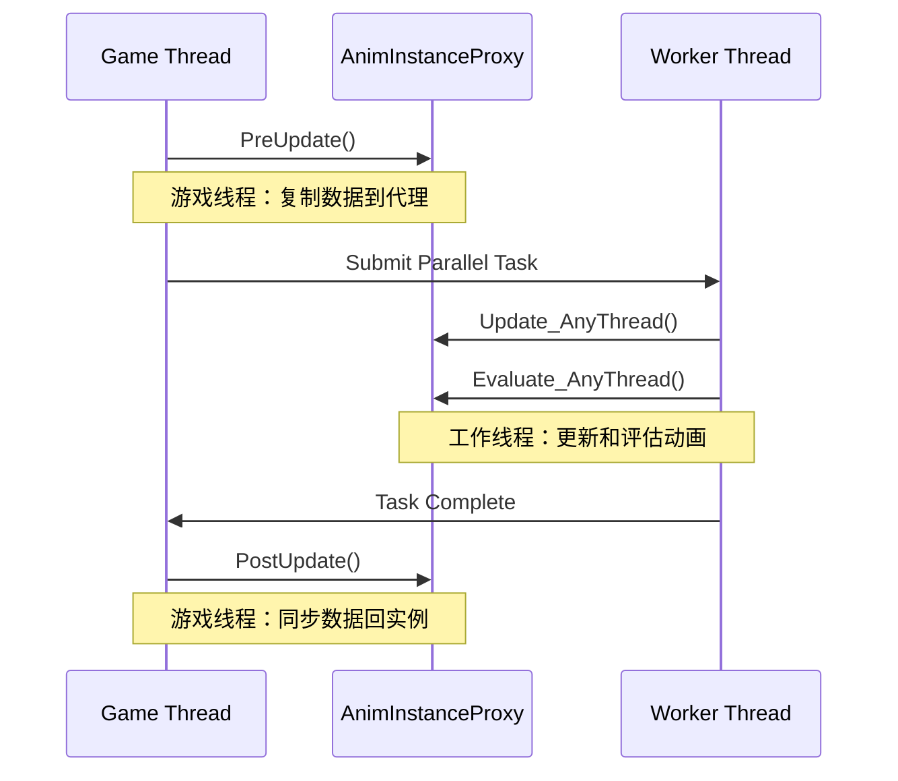
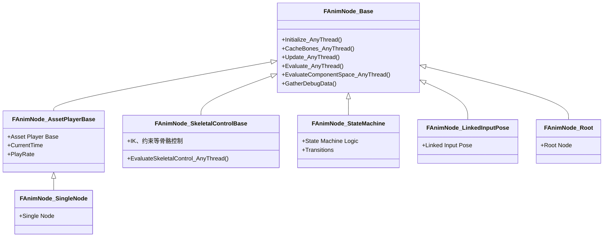
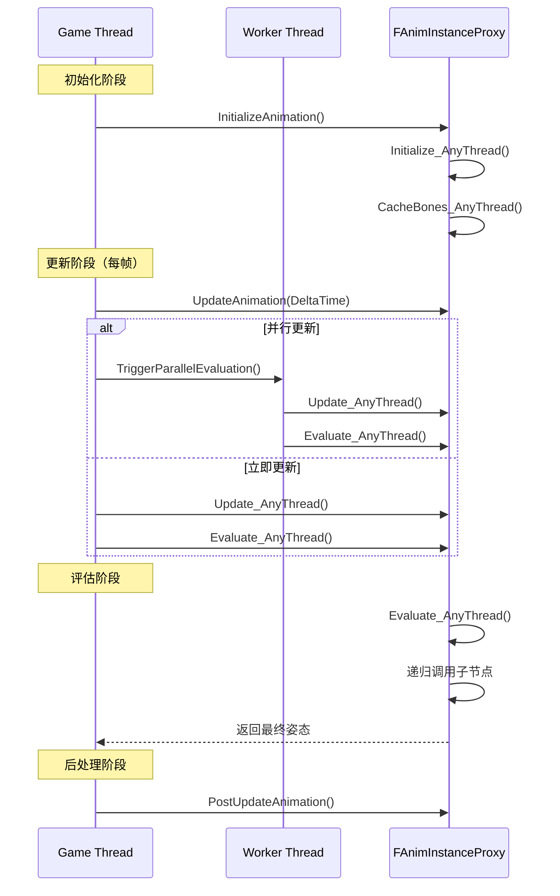

# UE5动画系统引擎基础框架深度分析

> 本文档深入分析 Unreal Engine 5 动画系统的三个核心类：`UAnimInstance`、`FAnimInstanceProxy` 和 `FAnimNode_Base`。

## 文档导航

- **上一篇**：[01-Lyra动画系统框架深度分析-概览](01-Lyra动画系统框架深度分析-概览.md) - 动画系统概览
- **下一篇**：[03-UE5动画资源与蓝图系统深度分析](03-UE5动画资源与蓝图系统深度分析.md) - 动画资源与蓝图系统

---

## 一、UAnimInstance 深度分析

### 1.1 类声明与继承关系

**源码位置**：
- 头文件：`Engine/Source/Runtime/Engine/Classes/Animation/AnimInstance.h`（第 352 行）
- 实现文件：`Engine/Source/Runtime/Engine/Private/Animation/AnimInstance.cpp`

```cpp
UCLASS(transient, Blueprintable, hideCategories=AnimInstance, BlueprintType, Within=SkeletalMeshComponent, MinimalAPI)
class UAnimInstance : public UObject
{
    GENERATED_UCLASS_BODY()
    // ...
};
```

### 1.2 核心属性

| 属性 | 类型 | 说明 |
|------|------|------|
| `CurrentSkeleton` | `TObjectPtr<USkeleton>` | 当前使用的骨骼，在 `InitializeAnimation()` 中设置 |
| `RootMotionMode` | `TEnumAsByte<ERootMotionMode::Type>` | Root Motion 提取模式，默认 `RootMotionFromMontagesOnly` |
| `bUseMultiThreadedAnimationUpdate` | `uint8` | 是否启用多线程动画更新 |
| `bNeedsUpdate` | `uint8` | 标记是否需要更新（并行/非并行） |
| `bCreatedByLinkedAnimGraph` | `uint8` | 是否由 LinkedAnimGraph 创建 |
| `AnimInstanceProxy` | `FAnimInstanceProxy*` | 代理对象，用于线程安全访问 |

### 1.3 关键虚函数（Lyra 覆盖点）

#### 1.3.1 NativeInitializeAnimation()

**调用时机**：`InitializeAnimation()` 中，在 Proxy 初始化和根节点初始化之前

```cpp
// AnimInstance.h 第 1372 行
ENGINE_API virtual void NativeInitializeAnimation();
```

**职责**：
- 初始化自定义变量
- 缓存组件引用（如 `ALyraCharacter`、`UAbilitySystemComponent`）
- 绑定委托

**Lyra 实现**（`Source/LyraGame/Animation/LyraAnimInstance.cpp`）：

```cpp
void ULyraAnimInstance::NativeInitializeAnimation()
{
    Super::NativeInitializeAnimation();

    // 获取 AbilitySystemComponent 并初始化 Tag 映射
    if (AActor* OwningActor = GetOwningActor())
    {
        if (UAbilitySystemComponent* ASC = 
            UAbilitySystemGlobals::GetAbilitySystemComponentFromActor(OwningActor))
        {
            InitializeWithAbilitySystem(ASC);
        }
    }
}
```

---

#### 1.3.2 NativeUpdateAnimation(float DeltaSeconds)

**调用时机**：`UpdateAnimation()` 中，在 Montage 更新之后

```cpp
// AnimInstance.h 第 1375 行
ENGINE_API virtual void NativeUpdateAnimation(float DeltaSeconds);
```

**职责**：
- 更新动画相关的游戏逻辑数据（如速度、方向等）
- 此函数在**游戏线程**调用

**注意**：此函数适合收集数据（如角色速度、地面距离等），复杂逻辑应放在 `NativeThreadSafeUpdateAnimation()` 中。

**Lyra 实现**（`Source/LyraGame/Animation/LyraAnimInstance.cpp`）：

```cpp
void ULyraAnimInstance::NativeUpdateAnimation(float DeltaSeconds)
{
    Super::NativeUpdateAnimation(DeltaSeconds);

    // 获取角色移动组件的地面信息
    const ALyraCharacter* Character = Cast<ALyraCharacter>(GetOwningActor());
    if (Character)
    {
        ULyraCharacterMovementComponent* CharMoveComp = 
            CastChecked<ULyraCharacterMovementComponent>(Character->GetCharacterMovement());
        const FLyraCharacterGroundInfo& GroundInfo = CharMoveComp->GetGroundInfo();
        GroundDistance = GroundInfo.GroundDistance;  // 传递到动画蓝图
    }
}
```

---

#### 1.3.3 NativeThreadSafeUpdateAnimation(float DeltaSeconds)

**调用时机**：在工作线程中，在动画图更新之前

```cpp
// AnimInstance.h 第 1378 行
ENGINE_API virtual void NativeThreadSafeUpdateAnimation(float DeltaSeconds);
```

**职责**：
- 线程安全的更新逻辑
- 可以访问 `UAnimInstance` 的 `UPROPERTY`
- **不能**调用任何游戏线程函数

**注意**：此函数标记为 `BlueprintThreadSafe`，可在动画蓝图中安全调用。

---

#### 1.3.4 NativePostEvaluateAnimation()

**调用时机**：`PostEvaluateAnimation()` 中，在动画评估完成后

```cpp
// AnimInstance.h 第 1380 行
ENGINE_API virtual void NativePostEvaluateAnimation();
```

**职责**：后处理评估后的数据（如应用 IK 结果到物理资产）

---

#### 1.3.5 NativeUninitializeAnimation()

**调用时机**：`UninitializeAnimation()` 开始时

```cpp
// AnimInstance.h 第 1382 行
ENGINE_API virtual void NativeUninitializeAnimation();
```

**职责**：清理本地缓存的引用

---

### 1.4 Blueprint 可调用事件

| 事件 | 说明 | 线程安全 |
|------|------|----------|
| `BlueprintInitializeAnimation()` | 初始化时调用 | 否（游戏线程） |
| `BlueprintUpdateAnimation(float DeltaTimeX)` | 每帧更新 | 否（游戏线程） |
| `BlueprintThreadSafeUpdateAnimation(float DeltaTime)` | 线程安全更新 | **是**（工作线程） |
| `BlueprintPostEvaluateAnimation()` | 评估后调用 | 否（游戏线程） |
| `BlueprintBeginPlay()` | BeginPlay 时调用 | 否（游戏线程） |

**关键区别**：
- `BlueprintUpdateAnimation`：在游戏线程执行，可访问游戏逻辑
- `BlueprintThreadSafeUpdateAnimation`：可在工作线程执行，只能访问线程安全的数据

---

### 1.5 Montage 系统

#### Montage 播放相关函数

```cpp
// 播放 Montage
ENGINE_API float Montage_Play(UAnimMontage* MontageToPlay, float InPlayRate = 1.f, ...);

// 停止 Montage
ENGINE_API void Montage_Stop(float InBlendOutTime, const UAnimMontage* Montage = NULL);

// 暂停/恢复
ENGINE_API void Montage_Pause(const UAnimMontage* Montage);
ENGINE_API void Montage_Resume(const UAnimMontage* Montage);

// 跳转 Section
ENGINE_API void Montage_JumpToSection(FName SectionName, const UAnimMontage* Montage = NULL);
ENGINE_API void Montage_JumpToSectionsEnd(FName SectionName, const UAnimMontage* Montage = NULL);

// 设置下一 Section
ENGINE_API void Montage_SetNextSection(FName SectionNameToChange, FName NextSection, ...);
```

#### Montage 事件委托

```cpp
// Blueprint 可绑定的多播委托
UPROPERTY(BlueprintAssignable)
FOnMontageBlendingOutStartedMCDelegate OnMontageBlendingOut;

UPROPERTY(BlueprintAssignable)
FOnMontageBlendedInEndedMCDelegate OnMontageBlendedIn;

UPROPERTY(BlueprintAssignable)
FOnMontageStartedMCDelegate OnMontageStarted;

UPROPERTY(BlueprintAssignable)
FOnMontageEndedMCDelegate OnMontageEnded;

UPROPERTY(BlueprintAssignable)
FOnAllMontageInstancesEndedMCDelegate OnAllMontageInstancesEnded;

UPROPERTY(BlueprintAssignable)
FOnMontageSectionChangedMCDelegate OnMontageSectionChanged;
```

---

### 1.6 UAnimInstance 生命周期



---

## 二、FAnimInstanceProxy 线程安全机制

### 2.1 设计目的

`FAnimInstanceProxy` 是一个 **非 UObject 的纯 struct**，设计用于在工作线程上安全地访问动画数据，避免直接访问 `UAnimInstance` 的 UObject 属性（UObject 只能在游戏线程访问）。

**源码位置**：
- 头文件：`Engine/Source/Runtime/Engine/Public/Animation/AnimInstanceProxy.h`
- 实现文件：`Engine/Source/Runtime/Engine/Private/Animation/AnimInstanceProxy.cpp`

---

### 2.2 核心属性

| 属性 | 类型 | 说明 |
|------|------|------|
| `AnimInstanceObject` | `UAnimInstance*` | 指向拥有者（仅在游戏线程安全访问） |
| `Skeleton` | `USkeleton*` | 当前骨骼（仅在 Pre/Post Update 期间有效） |
| `SkeletalMeshComponent` | `USkeletalMeshComponent*` | 骨骼网格组件（仅在 Pre/Post Update 期间有效） |
| `CurrentDeltaSeconds` | `float` | 上一帧的 DeltaTime |
| `Sync` | `UE::Anim::FAnimSync` | 同步系统 |
| `RootNode` | `FAnimNode_Base*` | 动画图根节点 |
| `RequiredBones` | `TSharedPtr<FBoneContainer>` | 所需骨骼 |
| `NotifyQueue` | `FAnimNotifyQueue` | 通知队列 |

---

### 2.3 关键方法

#### 2.3.1 PreUpdate(UAnimInstance* InAnimInstance, float InDeltaSeconds)

**调用时机**：在游戏线程调用，准备代理数据。

**主要职责**：
1. 初始化对象引用（缓存 `SkeletalMeshComponent`、`Skeleton` 等）
2. 缓存 `DeltaSeconds` 和 `TimeDilation`
3. 重置 `NotifyQueue`
4. 清除 Slot 节点权重
5. 重置同步器
6. 重置状态/机器权重缓冲区（双缓冲写入端）
7. 运行 `PreUpdate` 节点

**源码位置**：`AnimInstanceProxy.cpp` 第 469-552 行

---

#### 2.3.2 Update_AnyThread(const FAnimationUpdateContext& Context)

**调用时机**：在工作线程调用，更新动画图。

**主要职责**：
1. 更新动画节点
2. 处理 Montage 更新
3. 更新同步组

**注意**：此函数可以安全地从工作线程调用。

**源码位置**：`AnimInstanceProxy.cpp` 第 1222-1374 行

```cpp
void FAnimInstanceProxy::UpdateAnimation()
{
    FAnimationUpdateContext Context(this, CurrentDeltaSeconds, &SharedContext);
    
    // 1. 更新动画节点
    UpdateAnimation_WithRoot(Context, RootNode, NAME_AnimGraph);
    
    // 2. Tick 资源播放器实例（同步组）
    Sync.TickAssetPlayerInstances(*this, CurrentDeltaSeconds);
}
```

---

#### 2.3.3 Evaluate_AnyThread(FPoseContext& Output)

**调用时机**：在工作线程调用，评估最终姿态。

**主要职责**：
1. 从根节点开始递归评估动画图
2. 生成最终的骨骼变换数组
3. 应用曲线数据

**注意**：此函数输出 `FPoseContext`，包含最终的骨骼姿态。

**源码位置**：`AnimInstanceProxy.cpp` 第 1397-1424 行

```cpp
void FAnimInstanceProxy::EvaluateAnimation(FPoseContext& Output)
{
    // 1. 如果需要，缓存骨骼
    CacheBones();
    
    // 2. 如果派生类实现了 Evaluate()，使用它；否则评估节点图
    if (!Evaluate_WithRoot(Output, RootNode))
    {
        EvaluateAnimationNode_WithRoot(Output, RootNode);
    }
}
```

---

#### 2.3.4 PostUpdate(UAnimInstance* InAnimInstance)

**调用时机**：在游戏线程调用，后处理动画更新。

**主要职责**：
1. 将代理数据同步回 `UAnimInstance`
2. 触发后评估事件
3. 清理临时数据
4. 翻转缓冲区索引（`FlipBufferWriteIndex()`）

**源码位置**：`AnimInstanceProxy.cpp` 第 604-682 行

```cpp
void FAnimInstanceProxy::PostUpdate(UAnimInstance* InAnimInstance) const
{
    // 1. 将 Notify 队列传递给 UAnimInstance
    InAnimInstance->NotifyQueue.Append(NotifyQueue);
    InAnimInstance->NotifyQueue.ApplyMontageNotifies(*this);
    
    // 2. 处理根运动（如果提取）
    // ...
    
    // 3. 刷新调试绘制项（游戏线程安全）
#if ENABLE_ANIM_DRAW_DEBUG
    FlushQueuedDebugDrawItems(...);
#endif
}
```

---

### 2.4 线程安全边界



**关键规则**：
- ✅ **游戏线程**：可以访问 `UAnimInstance` 和所有 UObject
- ✅ **工作线程**：只能访问 `FAnimInstanceProxy` 和其缓存的数据
- ❌ **工作线程**：禁止访问 `UAnimInstance` 的 UObject 属性

---

### 2.5 与 UAnimInstance 的关系

#### 获取代理的方式

**UAnimInstance 头文件**（第 1093-1122 行）定义了访问器：

```cpp
// 游戏线程访问 - 会检查 IsInGameThread() 并等待并行任务完成
template <typename T = FAnimInstanceProxy*>
inline T& GetProxyOnGameThread()
{
    check(IsInGameThread());
    if(IsSkeletalMeshComponent(GetOuter()))
    {
        HandleExistingParallelEvaluationTask(GetSkelMeshComponent());
    }
    return *static_cast<T*>(AnimInstanceProxy);
}

// 任何线程访问 - 不会阻塞
template <typename T = FAnimInstanceProxy*>
inline T& GetProxyOnAnyThread()
{
    return *static_cast<T*>(AnimInstanceProxy);
}
```

#### 数据同步时机

```
帧开始:
[游戏线程] UAnimInstance::PreUpdateAnimation()
           -> Proxy.PreUpdate(this, DeltaSeconds)
           -> 缓存 SkeletalMeshComponent, Skeleton
           
[工作线程] UAnimInstance::ParallelUpdateAnimation()
           -> Proxy.UpdateAnimation()
           -> 读取缓存的数据，更新动画图
           
[工作线程] UAnimInstance::ParallelEvaluateAnimation()
           -> Proxy.EvaluateAnimation()
           -> 评估最终姿态
           
[游戏线程] UAnimInstance::PostUpdateAnimation()
           -> Proxy.PostUpdate(this)
           -> 触发 Notify，处理根运动
           -> FlipBufferWriteIndex()
```

---

## 三、FAnimNode_Base 动画节点基类

### 3.1 类声明与继承关系

`FAnimNode_Base` 是一个**纯 struct**，而非 UObject。这是 UE5 动画系统的核心设计决策。

**源码位置**：
- 头文件：`Engine/Source/Runtime/Engine/Classes/Animation/AnimNodeBase.h`（行 851-1081）
- 实现文件：`Engine/Source/Runtime/Engine/Private/Animation/AnimNodeBase.cpp`（行 126-164）

```cpp
/**
 * This is the base of all runtime animation nodes
 *
 * To create a new animation node:
 *   Create a struct derived from FAnimNode_Base - this is your runtime node
 *   Create a class derived from UAnimGraphNode_Base, containing an instance of your runtime node as a member - this is your visual/editor-only node
 */
USTRUCT()
struct FAnimNode_Base
{
    GENERATED_BODY()
    
    // ... 成员函数和属性
};
```

---

### 3.2 继承关系



**主要派生类**：

| 派生类 | 功能描述 | 典型应用 |
|--------|----------|----------|
| `FAnimNode_AssetPlayerBase` | 资源播放器基类 | AnimSequence、BlendSpace、AnimMontage 等 |
| `FAnimNode_SkeletalControlBase` | 骨骼控制基类 | IK、约束、骨骼变换等 |
| `FAnimNode_StateMachine` | 状态机节点 | 角色状态管理 |
| `FAnimNode_LinkedInputPose` | 链接输入姿态节点 | 动画图层、子动画蓝图 |
| `FAnimNode_Root` | 根节点 | 动画图输出 |
| `FAnimNode_SingleNode` | 单节点 | 简单动画播放 |

---

### 3.3 核心属性

#### 3.3.1 LOD 阈值

```cpp
/** 
 * Get the LOD level at which this node is enabled. 
 * Node is enabled if the current LOD is less than or equal to this threshold. 
 */
virtual int32 GetLODThreshold() const { return INDEX_NONE; }
```

**功能**：控制节点在不同 LOD（细节层次）级别的行为。
- `INDEX_NONE`：节点在所有 LOD 级别都启用
- 具体数值：节点仅在 LOD ≤ 该值时启用

**使用示例**：
```cpp
virtual int32 GetLODThreshold() const override
{
    return 2; // 仅在 LOD 0、1、2 时启用此节点
}
```

#### 3.3.2 节点数据

```cpp
private:
    // Reference to the constant/folded data for this node
    const FAnimNodeData* NodeData = nullptr;
```

**功能**：`NodeData` 存储节点的常量/折叠数据，用于提高性能。
- 在编辑器编译时生成
- 包含节点的索引、属性访问器等
- 通过 `GET_ANIM_NODE_DATA` 宏访问

---

### 3.4 关键虚函数

#### 3.4.1 Initialize_AnyThread(const FAnimationInitializeContext& Context)

**调用时机**：
- 动画实例初始化时
- 状态机状态改变时
- Cached Pose 分支激活时
- LOD 切换时

**职责**：
- 初始化节点内部状态
- 设置初始权重、时间等
- 准备节点所需资源

**默认实现**：空实现（`AnimNodeBase.cpp` 第 128-130 行）

---

#### 3.4.2 CacheBones_AnyThread(const FAnimationCacheBonesContext& Context)

**调用时机**：
- 动画蓝图初始化时
- LOD 切换时（骨骼列表改变）
- 骨骼引用需要更新时

**职责**：
- 缓存骨骼索引（将 `FBoneReference` 转换为骨骼索引）
- 准备骨骼变换所需的缓存数据

**默认实现**：空实现（`AnimNodeBase.cpp` 第 132-134 行）

---

#### 3.4.3 Update_AnyThread(const FAnimationUpdateContext& Context)

**调用时机**：
- 每帧更新时（在游戏线程或工作线程）
- 在 `Evaluate_AnyThread` 之前调用
- 递归调用子节点

**职责**：
- 更新节点状态（时间、权重等）
- 处理输入参数（通过 `EvaluateGraphExposedInputs`）
- 配置将影响姿态评估的参数

**默认实现**：空实现（`AnimNodeBase.cpp` 第 136-138 行）

**重要说明**：
- 此函数通常调用 `EvaluateGraphExposedInputs()` 来更新蓝图暴露的输入
- 可以运行在工作线程上（如果 `CanUpdateInWorkerThread()` 返回 true）

---

#### 3.4.4 Evaluate_AnyThread(FPoseContext& Output)

**调用时机**：
- 在 `Update_AnyThread` 之后调用
- 递归调用子节点
- 生成最终的局部空间姿态

**职责**：
- 计算骨骼变换（局部空间）
- 生成姿态、曲线、属性
- 输出到 `FPoseContext`

**默认实现**：空实现（`AnimNodeBase.cpp` 第 140-142 行）

**重要说明**：
- 应该实现 `Evaluate_AnyThread` **或** `EvaluateComponentSpace_AnyThread`，但不要同时实现两者
- 局部空间：骨骼变换相对于父骨骼
- 组件空间：骨骼变换相对于组件空间

---

#### 3.4.5 EvaluateComponentSpace_AnyThread(FComponentSpacePoseContext& Output)

**调用时机**：
- 与 `Evaluate_AnyThread` 类似，但用于组件空间
- 通常用于 IK、骨骼控制等需要组件空间信息的节点

**职责**：
- 计算骨骼变换（组件空间）
- 用于 IK、约束等

**默认实现**：空实现（`AnimNodeBase.cpp` 第 144-146 行）

---

#### 3.4.6 GatherDebugData(FNodeDebugData& DebugData)

**调用时机**：
- 在编辑器中进行动画调试时
- 显示节点权重、时间等信息

**职责**：
- 收集调试信息（权重、时间等）
- 显示在编辑器界面上

**默认实现**：输出警告信息（`AnimNodeBase.h` 第 901-904 行）

---

### 3.5 节点执行流程

#### 3.5.1 完整执行流程



#### 3.5.2 初始化流程

**调用顺序**：
1. `Initialize_AnyThread()` - 初始化节点状态
2. `CacheBones_AnyThread()` - 缓存骨骼索引

**触发条件**：
- 动画实例创建时
- 动画蓝图重新编译时
- LOD 切换时
- 状态机状态改变时

**代码示例**（来自 `FPoseLinkBase::Initialize`，行 203-228 in AnimNodeBase.cpp`）：

```cpp
void FPoseLinkBase::Initialize(const FAnimationInitializeContext& InContext)
{
    // 防止循环引用
#if DO_CHECK
    checkf(!bProcessed, TEXT("..."));
    TGuardValue<bool> CircularGuard(bProcessed, true);
#endif
    
    // 重新链接节点
    AttemptRelink(InContext);
    
    // 调用节点的 Initialize_AnyThread
    if (LinkedNode != nullptr)
    {
        FAnimationInitializeContext LinkContext(InContext);
        LinkContext.SetNodeId(LinkID);
        TRACE_SCOPED_ANIM_NODE(LinkContext);
        UE_DONT_INLINE_CALL LinkedNode->Initialize_AnyThread(LinkContext);
    }
}
```

#### 3.5.3 更新流程

**调用顺序**：
1. `PreUpdate()` - 游戏线程准备工作（可选）
2. `Update_AnyThread()` - 更新节点状态
3. 递归调用子节点的 `Update_AnyThread()`

**触发条件**：
- 每帧调用
- 在 `Evaluate_AnyThread` 之前

**代码示例**（来自 `FPoseLinkBase::Update`，行 296-345 in AnimNodeBase.cpp`）：

```cpp
void FPoseLinkBase::Update(const FAnimationUpdateContext& InContext)
{
    // 防止循环引用
#if DO_CHECK
    checkf(!bProcessed, TEXT("..."));
    TGuardValue<bool> CircularGuard(bProcessed, true);
#endif
    
    // 在编辑器中重新链接节点
#if WITH_EDITOR
    if (GIsEditor)
    {
        if (LinkedNode == nullptr)
        {
            AttemptRelink(InContext);
        }
    }
#endif
    
    // 调用节点的 Update_AnyThread
    if (LinkedNode != nullptr)
    {
        FAnimationUpdateContext LinkContext(InContext.WithNodeId(LinkID));
        TRACE_SCOPED_ANIM_NODE(LinkContext);
        
        // 调用节点函数（InitialUpdate、BecomeRelevant、Update）
        if(LinkedNode->NodeData && LinkedNode->NodeData->HasNodeAnyFlags(EAnimNodeDataFlags::AllFunctions))
        {
            UE::Anim::FNodeFunctionCaller::InitialUpdate(LinkContext, *LinkedNode);
            UE::Anim::FNodeFunctionCaller::BecomeRelevant(LinkContext, *LinkedNode);
            UE::Anim::FNodeFunctionCaller::Update(LinkContext, *LinkedNode);
        }
        
        UE_DONT_INLINE_CALL LinkedNode->Update_AnyThread(LinkContext);
    }
}
```

#### 3.5.4 评估流程

**调用顺序**：
1. `Evaluate_AnyThread()` 或 `EvaluateComponentSpace_AnyThread()` - 评估节点
2. 递归调用子节点的 `Evaluate_AnyThread()`
3. 根据权重混合姿态
4. 输出最终姿态到 `FPoseContext` 或 `FComponentSpacePoseContext`

**触发条件**：
- 在 `Update_AnyThread` 之后调用
- 每帧调用（如果需要渲染）

**代码示例**（来自 `FPoseLink::Evaluate`，行 358-437 in AnimNodeBase.cpp`）：

```cpp
void FPoseLink::Evaluate(FPoseContext& Output)
{
    // 防止循环引用
#if DO_CHECK
    checkf(!bProcessed, TEXT("..."));
    TGuardValue<bool> CircularGuard(bProcessed, true);
#endif
    
    // 调用节点的 Evaluate_AnyThread
    if (LinkedNode != nullptr)
    {
        int32 SourceID = Output.GetCurrentNodeId();
        {
            Output.SetNodeId(LinkID);
            TRACE_SCOPED_ANIM_NODE(Output);
            UE_DONT_INLINE_CALL LinkedNode->Evaluate_AnyThread(Output);
            TRACE_ANIM_NODE_BLENDABLE_ATTRIBUTES(Output, SourceID, LinkID);
        }
    }
    else
    {
        // 没有链接节点，重置为参考姿态
        Output.ResetToRefPose();
    }
}
```

---

### 3.6 上下文结构

#### 3.6.1 FAnimationBaseContext（基础上下文）

**源码位置**：行 158-319 in AnimNodeBase.h`

**核心属性**：
```cpp
struct FAnimationBaseContext
{
    FAnimInstanceProxy* AnimInstanceProxy;  // 动画实例代理
    FAnimationUpdateSharedContext* SharedContext;  // 共享上下文
    bool bIsActive;  // 是否激活（非混合退出）
    int32 CurrentNodeId;  // 当前节点 ID
    int32 PreviousNodeId;  // 前一个节点 ID
};
```

**核心方法**：
- `GetAnimClass()` - 获取动画类接口
- `GetAnimInstanceObject()` - 获取动画实例对象
- `GetMessage<T>()` - 获取消息栈中的消息
- `IsActive()` - 是否激活

---

#### 3.6.2 FAnimationUpdateContext（更新上下文）

**源码位置**：行 353-474 in AnimNodeBase.h`

**核心属性**：
```cpp
struct FAnimationUpdateContext : public FAnimationBaseContext
{
private:
    float CurrentWeight;  // 当前权重
    float RootMotionWeightModifier;  // 根运动权重修饰符
    float DeltaTime;  // 帧间隔时间
};
```

**核心方法**：
- `GetFinalBlendWeight()` - 获取最终混合权重
- `GetRootMotionWeightModifier()` - 获取根运动权重修饰符
- `GetDeltaTime()` - 获取帧间隔时间
- `FractionalWeight()` - 创建 fractional 权重的上下文
- `AsInactive()` - 创建非激活的上下文

**功能性**：
- 携带帧间隔时间（DeltaTime）
- 携带混合权重信息
- 支持权重修饰符（用于混合、分层等）

---

#### 3.6.3 FPoseContext（姿态上下文 - 局部空间）

**源码位置**：行 478-574 in AnimNodeBase.h`

**核心属性**：
```cpp
struct FPoseContext : public FAnimationBaseContext
{
public:
    FCompactPose Pose;  // 紧凑姿态（局部空间）
    FBlendedCurve Curve;  // 混合曲线
    UE::Anim::FStackAttributeContainer CustomAttributes;  // 自定义属性
};
```

**核心方法**：
- `ResetToRefPose()` - 重置为参考姿态
- `ContainsNaN()` - 检查是否包含 NaN
- `IsNormalized()` - 检查是否归一化

**功能性**：
- 存储局部空间姿态
- 存储在栈上（使用 MemStack）
- 包含曲线和属性数据

---

#### 3.6.4 FComponentSpacePoseContext（组件空间姿态上下文）

**源码位置**：行 599-631 in AnimNodeBase.h`

**核心属性**：
```cpp
struct FComponentSpacePoseContext : public FAnimationBaseContext
{
public:
    FCSPose<FCompactPose> Pose;  // 组件空间姿态
    FBlendedCurve Curve;  // 混合曲线
    UE::Anim::FStackAttributeContainer CustomAttributes;  // 自定义属性
};
```

**功能性**：
- 存储组件空间姿态
- 用于 IK、骨骼控制等
- 包含在栈上（使用 MemStack）

---

### 3.7 为什么 FAnimNode_Base 是纯 struct（非 UObject）

#### 3.7.1 性能考虑

**原因 1：减少内存开销**
- UObject 有较大的内存开销（虚函数表、垃圾回收信息等）
- Struct 更轻量，适合大量实例化的节点

**原因 2：提高访问速度**
- Struct 是值类型，存储在栈或连续内存中
- 访问速度更快，缓存友好

**原因 3：支持并行计算**
- Struct 可以安全地在不同线程中访问（无需担心垃圾回收）
- 动画系统支持多线程更新和评估

#### 3.7.2 设计考虑

**原因 4：分离编辑时和运行时**
- `FAnimNode_Base` 是运行时节点（纯数据，无编辑器功能）
- `UAnimGraphNode_Base` 是编辑器节点（提供 UI、编译等功能）
- 这种分离提高了性能，简化了设计

**原因 5：编译时优化**
- 动画蓝图编译时，将编辑器节点转换为运行时节点
- 运行时直接使用 struct，无需 UObject 的开销

#### 3.7.3 实际影响

**优点**：
- 高性能：适合每帧更新的动画系统
- 低内存：适合大量节点实例
- 线程安全：支持多线程评估

**缺点**：
- 无反射支持：无法使用 UE 的反射系统
- 无垃圾回收：需要手动管理内存
- 无编辑器集成：需要单独的编辑器类

**解决方案**：
- 使用 `UAnimGraphNode_Base` 提供反射和编辑器支持
- 使用 `FAnimNodeData` 存储编译后的数据
- 使用 `FPoseLinkBase` 连接节点

---

## 四、Lyra 项目可能使用的功能

### 4.1 UAnimInstance 覆盖函数

基于 Lyra 的架构（GAS、StateTree、Modular Gameplay），以下是可能在 Lyra 中被覆盖的函数：

| 函数 | 用途 |
|------|------|
| `NativeInitializeAnimation()` | 缓存 `ALyraCharacter`、`UAbilitySystemComponent` 引用 |
| `NativeThreadSafeUpdateAnimation()` | 更新移动速度、方向等数据供 AnimGraph 使用 |
| `NativeUpdateAnimation()` | 处理非线程安全的游戏逻辑（如地面距离检测） |
| `NativePostEvaluateAnimation()` | 后处理动画评估结果（如应用 IK 结果） |

---

### 4.2 FAnimInstanceProxy 功能

| 功能 | Proxy 方法 | Lyra 可能用途 |
|------|------------|----------------|
| Montage 管理 | `GetMontageEvaluationData()` | 武器攻击、技能动画 |
| Slot 权重 | `GetSlotNodeGlobalWeight()` | 上下身混合 |
| 状态机访问 | `GetStateMachineInstance()` | Locomotion 状态机 |
| 曲线数据 | `GetAnimationCurves()` | IK 权重、材质参数 |
| Pose 快照 | `SavePoseSnapshot()` | 动画过渡、ragdoll 恢复 |
| 同步组 | `GetSyncGroupMapRead()` | 上下身动画同步 |

---

### 4.3 FAnimNode_Base 派生类

| 节点类型 | 用途 | Lyra 应用示例 |
|----------|------|---------------|
| `FAnimNode_SequencePlayer` | 播放动画序列 | Idle、Walk、Run 等基础动画 |
| `FAnimNode_BlendSpacePlayer` | 播放混合空间 | 根据速度混合行走、奔跑动画 |
| `FAnimNode_AssetPlayer` | 播放动画蒙太奇 | 射击、换弹、技能动画 |
| `FAnimNode_BlendListByBool` | 根据布尔值混合 | 站立/蹲下状态混合 |
| `FAnimNode_LayeredBlendPerBone` | 按骨骼分层混合 | 上半身射击 + 下半身移动 |
| `FAnimNode_Fabrik` | FABRIK IK | 手部 IK（持枪、攀爬） |
| `FAnimNode_TwoBoneIK` | 两骨骼 IK | 脚部 IK（地面适配） |
| `FAnimNode_LookAt` | 看向目标 | 角色看向目标方向 |
| `FAnimNode_StateMachine` | 状态机 | 角色状态管理（Idle、Walk、Run、Jump 等） |
| `FAnimNode_LinkedInputPose` | 链接输入姿态 | 动画图层（按武器类型分离逻辑） |

---

## 五、总结

### 5.1 核心要点

1. **UAnimInstance 是 UObject**，管理动画蓝图的生命周期，提供虚函数供覆盖
2. **FAnimInstanceProxy 是纯 struct**，实现线程安全的数据访问，支持多线程动画更新
3. **FAnimNode_Base 是纯 struct**，所有动画节点的基类，支持高性能并行计算
4. **线程安全边界**：游戏线程访问 `UAnimInstance`，工作线程访问 `FAnimInstanceProxy`
5. **节点执行流程**：`Initialize_AnyThread` → `CacheBones_AnyThread` → `Update_AnyThread` → `Evaluate_AnyThread`

### 5.2 最佳实践

1. **分离 Initialize 和 Update**：Initialize 中只做一次性设置，Update 中处理每帧逻辑
2. **线程安全**：在 `Update_AnyThread` 和 `Evaluate_AnyThread` 中不要访问游戏线程数据
3. **使用 PreUpdate**：需要访问游戏线程数据时，在 `PreUpdate()` 中准备
4. **正确实现 Evaluate**：实现 `Evaluate_AnyThread` 或 `EvaluateComponentSpace_AnyThread`，但不要同时实现两者
5. **处理 LOD**：使用 `IsLODEnabled()` 检查节点是否应该更新

### 5.3 性能优化

1. **减少 Initialize 调用**：避免在每帧都调用 Initialize
2. **使用缓存**：在 `CacheBones_AnyThread` 中缓存骨骼索引
3. **避免动态内存分配**：使用栈分配（MemStack）
4. **支持多线程**：确保节点可以安全运行在工作线程上

---

## 六、参考资料

1. [Unreal Engine 5 官方文档 - 动画实例](https://docs.unrealengine.com/5.0/en-US/anim-instance-in-unreal-engine/)
2. [Unreal Engine 5 官方文档 - 动画节点](https://docs.unrealengine.com/5.0/en-US/animation-nodes-in-unreal-engine/)
3. [Unreal Engine 5 源码 - AnimInstance.h](https://github.com/EpicGames/UnrealEngine/blob/5.0/Engine/Source/Runtime/Engine/Classes/Animation/AnimInstance.h)
4. [Unreal Engine 5 源码 - AnimInstanceProxy.h](https://github.com/EpicGames/UnrealEngine/blob/5.0/Engine/Source/Runtime/Engine/Public/Animation/AnimInstanceProxy.h)
5. [Unreal Engine 5 源码 - AnimNodeBase.h](https://github.com/EpicGames/UnrealEngine/blob/5.0/Engine/Source/Runtime/Engine/Classes/Animation/AnimNodeBase.h)

---

> **最后更新**：2026-05-16
> **状态**：current
> **维护者**：AI Agent (project-wiki skill)

<!-- nav:auto -->

---

**导航**: ← [[30-tutorials/animation/01-Lyra动画系统框架深度分析-概览|01-Lyra动画系统框架深度分析-概览]] · [[30-tutorials/animation/03-UE5动画资源与蓝图系统深度分析|03-UE5动画资源与蓝图系统深度分析]] →

<!-- /nav:auto -->
