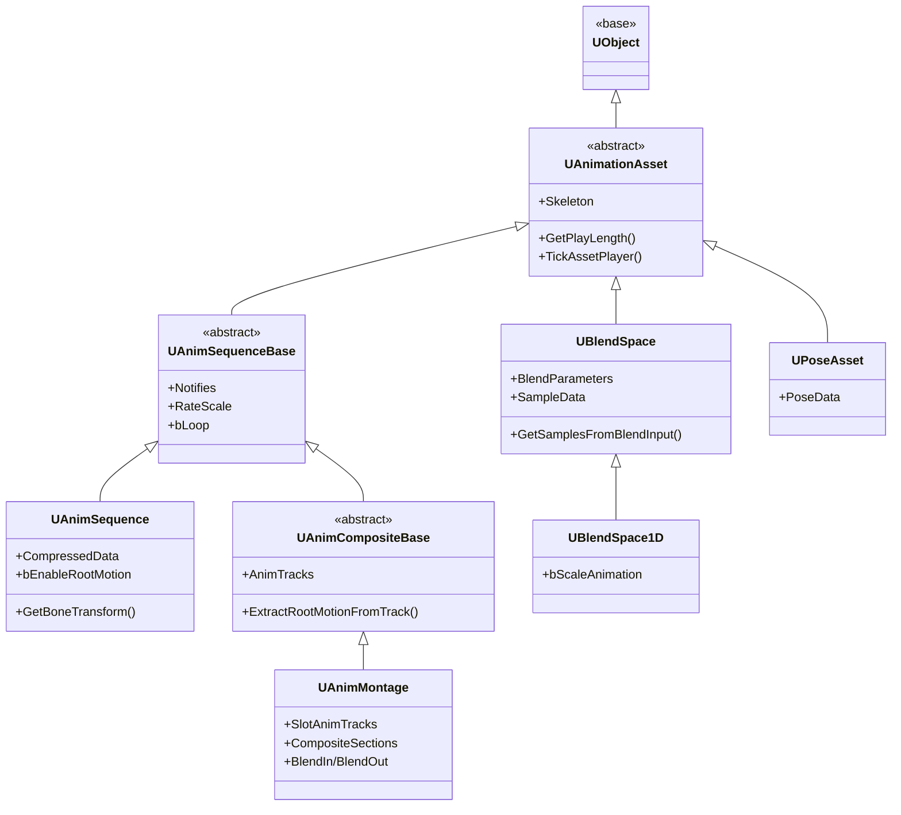
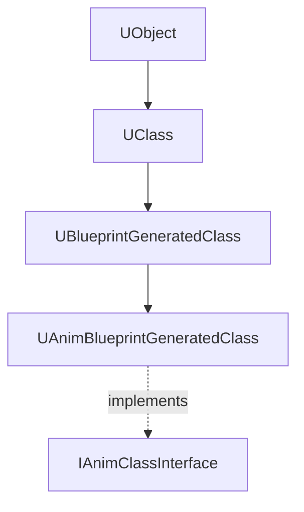
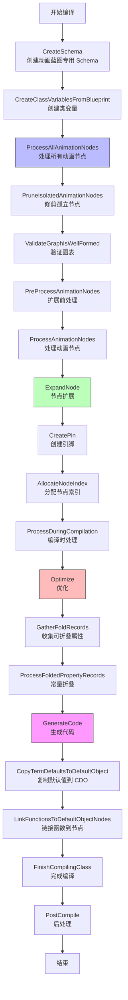
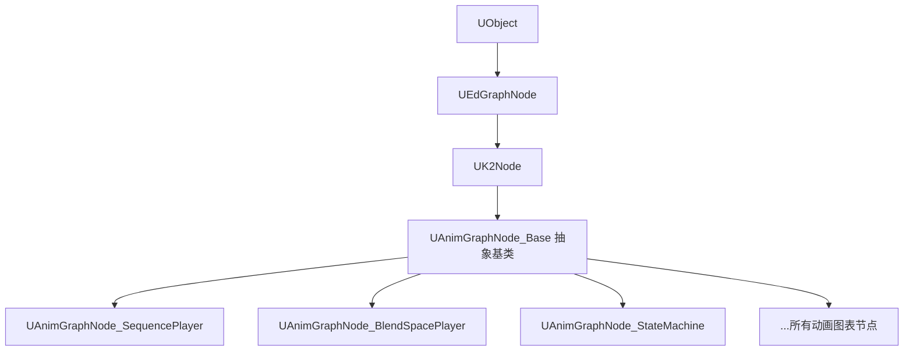
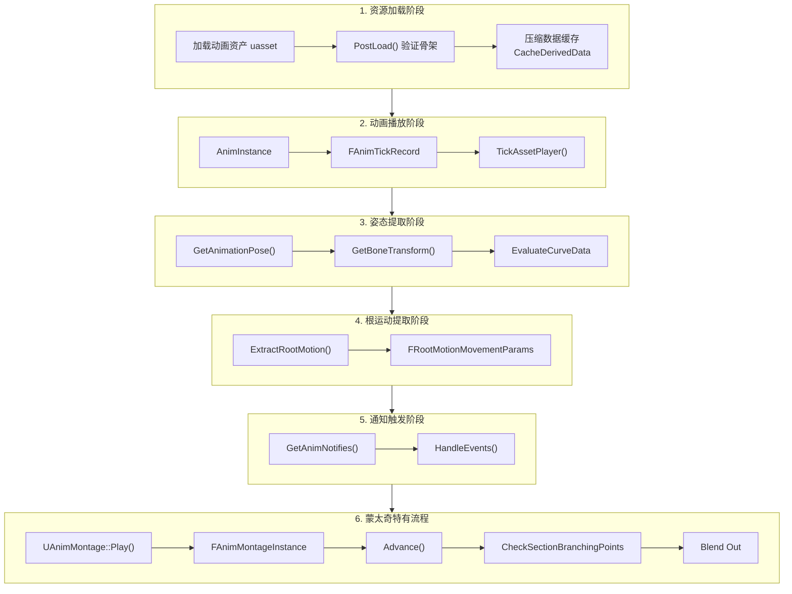

# UE5动画资源与蓝图系统深度分析

> 本文档深入分析 Unreal Engine 5 的动画资源类（`UAnimationAsset`、`UAnimSequence`、`UAnimMontage`、`UBlendSpace`）和动画蓝图编译机制。

## 文档导航

- **上一篇**：[02-UE5动画系统引擎基础框架深度分析](02-UE5动画系统引擎基础框架深度分析.md) - 引擎基础框架
- **下一篇**：[04-UE5动画图与状态机深度分析](04-UE5动画图与状态机深度分析.md) - 动画图与状态机

---

## 一、动画资源类继承关系

### 1.1 类层次结构



### 1.2 核心类说明

| 类 | 功能描述 | 典型应用 |
|------|----------|----------|
| `UAnimationAsset` | 动画资源基类 | 所有动画资源的基类 |
| `UAnimSequenceBase` | 动画序列基类 | 定义通知、播放速率等 |
| `UAnimSequence` | 动画序列 | 基础动画（Idle、Walk、Run 等） |
| `UAnimCompositeBase` | 复合动画基类 | 组合多个动画片段 |
| `UAnimMontage` | 动画蒙太奇 | 技能动画、受击反馈等 |
| `UBlendSpace` | 混合空间 | 根据参数混合多个动画 |
| `UBlendSpace1D` | 1D 混合空间 | 单参数混合（如速度） |
| `UPoseAsset` | 姿态资产 | IK 或姿态匹配 |

---

## 二、UAnimationAsset 基类分析

### 2.1 核心属性

**源码位置**：`Engine/Source/Runtime/Engine/Classes/Animation/AnimationAsset.h`

```cpp
UCLASS(Abstract, BlueprintType)
class UAnimationAsset : public UObject
{
    // 指向可以播放此资产的骨骼
    UPROPERTY()
    TObjectPtr<USkeleton> Skeleton;

    // 骨骼 GUID，如果改变需要重新映射信息
    FGuid SkeletonGuid;

    // 可以与资产一起保存的元数据
    UPROPERTY()
    TArray<TObjectPtr<UAnimMetaData>> MetaData;

    // 存储在资产中的用户数据数组
    UPROPERTY()
    TArray<TObjectPtr<UAssetUserData>> AssetUserData;
};
```

### 2.2 关键方法

| 方法 | 说明 |
|------|------|
| `GetSkeleton()` | 获取关联的骨骼 |
| `GetPlayLength()` | 获取播放长度（虚函数） |
| `TickAssetPlayer()` | 推进资产播放器实例 |
| `ValidateSkeleton()` | 验证存储的数据与骨骼 |
| `AddMetaData()` / `RemoveMetaData()` | 管理元数据 |
| `AddAssetUserData()` / `GetAssetUserDataOfClass()` | 管理用户数据 |

---

## 三、UAnimSequence 动画序列分析

### 3.1 核心属性

**源码位置**：`Engine/Source/Runtime/Engine/Classes/Animation/AnimSequence.h`

| 属性 | 类型 | 说明 |
|------|------|------|
| `BoneCompressionSettings` | `UAnimBoneCompressionSettings*` | 骨骼压缩设置 |
| `CurveCompressionSettings` | `UAnimCurveCompressionSettings*` | 曲线压缩设置 |
| `AdditiveAnimType` | `EAdditiveAnimationType` | 叠加动画类型 |
| `RefPoseType` | `EAdditiveBasePoseType` | 叠加参考姿势类型 |
| `RefPoseSeq` | `UAnimSequence*` | 叠加参考动画 |
| `bEnableRootMotion` | `bool` | 是否启用根运动 |
| `RootMotionRootLock` | `ERootMotionRootLock::Type` | 根运动根锁定类型 |
| `AuthoredSyncMarkers` | `TArray<FAnimSyncMarker>` | 创作的同步标记 |
| `UniqueMarkerNames` | `TArray<FName>` | 此动画序列中的唯一标记名称列表 |
| `CompressedData` | `FCompressedAnimSequence` | 压缩的动画数据 |
| `PlatformTargetFrameRate` | `FPerPlatformFrameRate` | 目标采样帧率 |

### 3.2 关键方法

| 方法 | 说明 |
|------|------|
| `GetBoneTransform()` | 获取指定时间的骨骼变换 |
| `GetAnimationPose()` | 获取动画姿态数据 |
| `ExtractRootMotion()` | 从动画提取根运动变换 |
| `ExtractRootTrackTransform()` | 从根轨道提取变换 |
| `EvaluateCurveData()` | 评估曲线数据 |
| `GetAdditiveBasePose()` | 获取叠加基础姿态 |
| `RetargetBoneTransform()` | 重定向骨骼变换 |
| `SortSyncMarkers()` | 排序同步标记 |
| `GetMarkerIndicesForTime()` | 根据时间获取标记索引 |
| `BeginCacheDerivedDataForCurrentPlatform()` | 开始为当前平台缓存派生数据 |
| `CacheDerivedDataForCurrentPlatform()` | 为当前平台缓存派生数据 |
| `IsCompressedDataValid()` | 检查压缩数据是否有效 |
| `IsCompressedDataOutOfDate()` | 检查压缩数据是否过期 |

### 3.3 动画数据压缩

**FCompressedAnimSequence 结构**：

```cpp
struct FCompressedAnimSequence
{
    // 压缩的骨骼数据
    FUECompressedAnimData CompressedDataStructure;

    // 骨骼压缩编解码器
    TObjectPtr<UAnimBoneCompressionCodec> BoneCompressionCodec;

    // 曲线压缩编解码器
    TObjectPtr<UAnimCurveCompressionCodec> CurveCompressionCodec;

    // 压缩的曲线字节流
    TArray<uint8> CompressedCurveByteStream;

    // 索引曲线名称
    TArray<FAnimCompressedCurveIndexedName> IndexedCurveNames;

    // 压缩轨道到骨骼的映射表
    TArray<FTrackToSkeletonMap> CompressedTrackToSkeletonMapTable;
};
```

**压缩管理**：
- `FAnimationSequenceCompressingManager` - 动画序列压缩管理器
- 支持每平台压缩数据缓存
- 支持异步压缩任务（`FAnimationSequenceAsyncCacheTask`）

---

## 四、UAnimMontage 动画蒙太奇分析

### 4.1 核心属性

**源码位置**：`Engine/Source/Runtime/Engine/Classes/Animation/AnimMontage.h`

| 属性 | 类型 | 说明 |
|------|------|------|
| `BlendModeIn` | `EMontageBlendMode` | 混合入模式 |
| `BlendModeOut` | `EMontageBlendMode` | 混合出模式 |
| `BlendIn` | `FAlphaBlend` | 混合入选项 |
| `BlendOut` | `FAlphaBlend` | 混合出选项 |
| `BlendOutTriggerTime` | `float` | 触发混合出的时间 |
| `SyncGroup` | `FName` | 同步组名称 |
| `SyncSlotIndex` | `int32` | 用于收集同步标记的 Slot 索引 |
| `CompositeSections` | `TArray<FCompositeSection>` | 复合分段 |
| `SlotAnimTracks` | `TArray<FSlotAnimationTrack>` | Slot 数据，每个 slot 包含动画轨道 |
| `BlendProfileIn` | `UBlendProfile*` | 混合配置文件（入） |
| `BlendProfileOut` | `UBlendProfile*` | 混合配置文件（出） |
| `bEnableAutoBlendOut` | `bool` | 是否启用自动混合出 |
| `TimeStretchCurve` | `FTimeStretchCurve` | 时间拉伸曲线 |
| `TimeStretchCurveName` | `FName` | 时间拉伸曲线名称 |
| `BranchingPointMarkers` | `TArray<FBranchingPointMarker>` | 缓存的分支点标记数组 |

### 4.2 关键方法

| 方法 | 说明 |
|------|------|
| `AddSlot()` | 添加 Slot 轨道 |
| `IsValidSlot()` | 检查 Slot 是否有效 |
| `GetSectionIndex()` | 根据名称获取分段索引 |
| `GetSectionName()` | 根据索引获取分段名称 |
| `GetSectionStartAndEndTime()` | 获取分段开始和结束时间 |
| `GetSectionLength()` | 获取分段长度 |
| `CalculateSequenceLength()` | 计算序列长度 |
| `ExtractRootMotionFromTrackRange()` | 从轨道范围提取根运动 |
| `GetGroupName()` | 获取组名称 |
| `CreateSlotAnimationAsDynamicMontage()` | 从动画序列创建动态蒙太奇 |
| `RefreshBranchingPointMarkers()` | 刷新分支点标记 |
| `CanUseMarkerSync()` | 检查是否可以使用标记同步 |

### 4.3 FAnimMontageInstance 结构（蒙太奇实例）

```cpp
struct FAnimMontageInstance
{
    // 蒙太奇引用
    TObjectPtr<class UAnimMontage> Montage;

    // 委托
    FOnMontageEnded OnMontageEnded;
    FOnMontageBlendingOutStarted OnMontageBlendingOutStarted;

    // 是否正在播放
    bool bPlaying;

    // 混合
    FAlphaBlend Blend;

    // 位置
    float Position;

    // 播放速率
    float PlayRate;

    // 同步组名称
    FName SyncGroupName;

    // 播放/停止/暂停
    void Play(float InPlayRate = 1.f);
    void Stop(const FAlphaBlend& InBlendOut, bool bInterrupt=true);
    void Pause();

    // 跳转分段
    bool JumpToSectionName(FName const& SectionName, bool bEndOfSection = false);
    bool SetNextSectionName(FName const& SectionName, FName const& NewNextSectionName);

    // 更新权重和推进
    void UpdateWeight(float DeltaTime);
    void Advance(float DeltaTime, struct FRootMotionMovementParams* OutRootMotionParams, bool bBlendRootMotion);
};
```

### 4.4 Slot 和 Section 的作用

**Slot**：
- Slot 是蒙太奇中的动画轨道，可以放置多个动画序列
- 一个蒙太奇可以有多个 Slot
- Slot 名称用于标识不同的动画轨道（如 "UpperBody"、"FullBody"）

**Section**：
- Section 是蒙太奇中的分段，用于组织动画流程
- 可以在 Section 之间跳转
- 每个 Section 有一个名称，可以通过 `JumpToSectionName()` 跳转

---

## 五、UBlendSpace 混合空间分析

### 5.1 核心属性

**源码位置**：`Engine/Source/Runtime/Engine/Classes/Animation/BlendSpace.h`

#### FBlendParameter 结构（混合参数）

```cpp
USTACT()
struct FBlendParameter
{
    // 轴名称（如 "Speed"、"Direction"）
    FString DisplayName;

    // 轴范围
    float Min;    // 最小值
    float Max;    // 最大值

    // 网格分割数
    int32 GridNum;

    // 是否吸附到网格
    bool bSnapToGrid;

    // 是否循环（输入可超出范围）
    bool bWrapInput;

    // 获取范围
    float GetRange() const { return Max - Min; }

    // 获取网格大小
    float GetGridSize() const { return GetRange() / (float)GridNum; }
};
```

#### FBlendSample 结构（采样点）

```cpp
USTACT()
struct FBlendSample
{
    // 关联的动画序列
    TObjectPtr<class UAnimSequence> Animation;

    // 采样值 (X, Y, Z 对应 BlendParameters[0], [1], [2])
    FVector SampleValue;

    // 播放速率缩放
    float RateScale = 1.0f;

    // 是否使用单帧混合
    bool bUseSingleFrameForBlending = false;

    // 单帧混合的帧索引
    uint32 FrameIndexToSample = 0;
};
```

#### UBlendSpace 核心属性

| 属性 | 类型 | 说明 |
|------|------|------|
| `BlendParameters[3]` | `FBlendParameter` | 三个轴的混合参数（X, Y, Z） |
| `SampleData` | `TArray<FBlendSample>` | 所有采样点数据 |
| `GridSamples` | `TArray<FEditorElement>` | 网格采样元素（编辑器使用） |
| `BlendSpaceData` | `FBlendSpaceData` | 运行时数据（三角化/分段） |
| `InterpolationParam[3]` | `FInterpolationParameter` | 输入平滑参数 |
| `TargetWeightInterpolationSpeedPerSec` | `float` | 采样权重插值速度 |
| `AxisToScaleAnimation` | `EBlendSpaceAxis` | 哪个轴用于缩放动画速度 |
| `bInterpolateUsingGrid` | `bool` | 是否使用网格插值（false=三角化） |
| `DimensionIndices` | `TArray<int32>` | 使用的维度索引（1D={0}, 2D={0,1}） |

### 5.2 关键方法

| 方法 | 说明 |
|------|------|
| `GetSamplesFromBlendInput()` | 根据混合输入获取采样数据 |
| `UpdateBlendSamples()` | 更新缓存的混合采样数据 |
| `GetAnimationPose()` | 获取混合后的动画姿态 |
| `FilterInput()` | 对输入进行平滑过滤 |

### 5.3 混合算法原理

#### 5.3.1 三角化混合（2D BlendSpace）

对于 2D 混合空间，UE5 使用 **Delaunay 三角化** 将采样点连接成三角形：

```cpp
// FBlendSpaceData 包含三角形数据
USTACT()
struct FBlendSpaceTriangle
{
    // 三个顶点的采样索引
    int32 SampleIndices[3];

    // 顶点位置（归一化空间 0-1）
    FVector2D Vertices[3];

    // 边信息（法线、相邻三角形）
    FBlendSpaceTriangleEdgeInfo EdgeInfo[3];
};
```

**混合算法流程**：

1. **归一化输入**：将输入参数转换到 [0, 1] 范围
2. **定位三角形**：找到输入点所在的三角形
3. **重心坐标计算**：计算输入点在三角形内的重心坐标
4. **权重分配**：使用重心坐标作为三个顶点的混合权重

```cpp
// 从三角化数据获取采样
void FBlendSpaceData::GetSamples2D(
    TArray<FWeightedBlendSample>& OutWeightedSamples,
    const TArray<int32>& InDimensionIndices,
    const FVector& InSamplePosition,
    int32& InOutTriangleIndex) const
{
    // 1. 从缓存的三角形索引开始搜索
    // 2. 判断点是否在当前三角形内
    // 3. 计算重心坐标作为权重
    // 4. 返回加权采样数据
}
```

#### 5.3.2 1D 混合（线段插值）

对于 `UBlendSpace1D`，使用 **线段插值**：

```cpp
// 从分段数据获取采样
void FBlendSpaceData::GetSamples1D(
    TArray<FWeightedBlendSample>& OutWeightedSamples,
    const TArray<int32>& InDimensionIndices,
    const FVector& InSamplePosition,
    int32& InOutSegmentIndex) const
{
    // 1. 找到输入点所在的线段
    // 2. 计算在线段上的线性插值比例
    // 3. 返回两个端点的加权采样
}
```

#### 5.3.3 权重插值优化

**目标权重插值**（防止突变）：

```cpp
bool UBlendSpace::InterpolateWeightOfSampleData(
    float DeltaTime,
    const TArray<FBlendSampleData>& OldSampleDataList,
    const TArray<FBlendSampleData>& NewSampleDataList,
    TArray<FBlendSampleData>& FinalSampleDataList) const
{
    // 使用临界阻尼平滑（CriticallyDampedSmoothing）
    // 根据 TargetWeightInterpolationSpeedPerSec 平滑过渡权重
    FMath::CriticallyDampedSmoothing(
        Output, OutputRate, 
        Target, 0.0f, 
        DeltaTime, 
        SmoothingTimeFromSpeed(Speed));
}
```

#### 5.3.4 按骨骼混合（Per-Bone Blending）

```cpp
// 使用按骨骼插值数据混合姿态
if (PerBoneBlendValues.Num() > 0)
{
    if (bAllowMeshSpaceBlending && !bContainsRotationOffsetMeshSpaceSamples)
    {
        // 在网格空间混合（更自然，但更耗性能）
        FAnimationRuntime::BlendPosesTogetherPerBoneInMeshSpace(...);
    }
    else
    {
        FAnimationRuntime::BlendPosesTogetherPerBone(...);
    }
}
```

---

## 六、UBlendSpace1D 类分析

### 6.1 与 UBlendSpace 的区别

**源码位置**：
- `Engine/Source/Runtime/Engine/Classes/Animation/BlendSpace1D.h`
- `Engine/Source/Runtime/Engine/Private/Animation/BlendSpace1D.cpp`

```cpp
UCLASS()
class UBlendSpace1D : public UBlendSpace
{
    // 是否根据输入缩放动画速度
    bool bScaleAnimation;

protected:
    // 返回哪个轴用于缩放（仅 X 轴）
    virtual EBlendSpaceAxis GetAxisToScale() const override
    {
        return bScaleAnimation ? BSA_X : BSA_None;
    }
};
```

**关键区别**：

| 特性 | `UBlendSpace` | `UBlendSpace1D` |
|---------|---------------|---------------|
| 维度 | 2D（X, Y） | 1D（仅 X） |
| 数据结构 | 三角形（Triangles） | 线段（Segments） |
| 动画缩放 | 可指定 X 或 Y 轴 | 仅 X 轴 |
| 用例 | 速度+方向混合 | 仅速度混合 |

---

## 七、动画蓝图编译机制

### 7.1 UAnimBlueprintGeneratedClass 的作用

**源码位置**：
- `Engine/Source/Runtime/Engine/Classes/Animation/AnimBlueprintGeneratedClass.h`
- `Engine/Source/Runtime/Engine/Private/Animation/AnimBlueprintGeneratedClass.cpp`

#### 类继承关系



#### 核心属性

| 属性 | 类型 | 说明 |
|------|------|------|
| `BakedStateMachines` | `TArray<FBakedAnimationStateMachine>` | 烘烤后的状态机数据 |
| `TargetSkeleton` | `TObjectPtr<USkeleton>` | 目标骨骼 |
| `AnimNodeProperties` | `TArray<FStructProperty*>` | 所有动画节点属性 |
| `LinkedAnimGraphNodeProperties` | `TArray<FStructProperty*>` | LinkedAnimGraph 节点 |
| `StateMachineNodeProperties` | `TArray<FStructProperty*>` | 状态机节点 |
| `SyncGroupNames` | `TArray<FName>` | 同步组名称 |
| `AnimNodeData` | `TArray<FAnimNodeData>` | 节点数据存储 |
| `NodeTypeMap` | `TMap<UScriptStruct*, FAnimNodeStructData>` | 节点类型映射 |

### 7.2 编译流程

**编译器上下文**：`FAnimBlueprintCompilerContext`

**源码位置**：`Engine/Source/Editor/AnimGraph/Private/AnimBlueprintCompiler.cpp`

#### 完整编译流程



#### 详细步骤说明

**步骤 1：节点处理（ProcessAnimationNode）**

```cpp
void FAnimBlueprintCompilerContext::ProcessAnimationNode(
    UAnimGraphNode_Base* VisualAnimNode)
{
    // 1. 验证节点类型
    const UScriptStruct* NodeType = VisualAnimNode->GetFNodeType();

    // 2. 创建节点属性（FStructProperty）
    FStructProperty* NewProperty = CreateVariable(...);

    // 3. 创建处理函数属性（常量折叠用）
    FStructProperty* NewHandlerProperty = CreateStructVariable(...);

    // 4. 收集可折叠属性记录
    GatherFoldRecordsForAnimationNode(NodeType, NewProperty, VisualAnimNode);

    // 5. 注册节点到编译数据结构
    AllocatedAnimNodes.Add(VisualAnimNode, NewProperty);
    AllocatedAnimNodeIndices.Add(VisualAnimNode, AllocatedIndex);
}
```

**步骤 2：属性折叠（Constant Folding）**

```cpp
// 标记可折叠的属性
if(SubProperty->HasMetaData("FoldProperty"))
{
    AddFoldedPropertyRecord(
        InVisualAnimNode, 
        InNodeProperty, 
        SubProperty, 
        bAllPinsExposed, 
        bAllPinsDisconnected, 
        bAlwaysDynamic);
}

// 处理折叠属性
void FAnimBlueprintCompilerContext::ProcessFoldedPropertyRecords()
{
    // 将标记的属性从节点结构移动到常量/可变数据结构
    // 减少运行时属性查找开销
}
```

**步骤 3：复制默认值（CopyTermDefaultsToDefaultObject）**

```cpp
void FAnimBlueprintCompilerContext::CopyTermDefaultsToDefaultObject(
    UObject* DefaultObject)
{
    // 1. 从编辑器节点复制数据到 CDO 属性
    for (TFieldIterator<FProperty> It(DefaultObject->GetClass(), ...); It; ++It)
    {
        FProperty* TargetProperty = *It;

        if (UAnimGraphNode_Base* VisualAnimNode = 
            AllocatedNodePropertiesToNodes.FindRef(TargetProperty))
        {
            // 从编辑器节点复制数据到运行时节点
            uint8* DestinationPtr = ...;
            const uint8* SourcePtr = ...;
            Property->CopyCompleteValue(DestinationPtr, SourcePtr);

            // 调用节点的后处理
            VisualAnimNode->CopyTermDefaultsToDefaultObject(...);
        }
    }

    // 2. 应用折叠属性到常量/可变数据区
    PatchDataArea(Constants, ConstantsStruct, ConstantPropertyRecords);
    PatchDataArea(Mutables, MutablesStruct, MutablePropertyRecords);
}
```

---

## 八、UAnimGraphNode_Base 类分析

### 8.1 编辑器节点基类

**源码位置**：
- `Engine/Source/Editor/AnimGraph/Public/AnimGraphNode_Base.h`
- `Engine/Source/Editor/AnimGraph/Private/AnimGraphNode_Base.cpp`

#### 继承关系



### 8.2 与 FAnimNode_Base 的关系

每个 `UAnimGraphNode_Base` 子类都关联一个 `FAnimNode_Base` 子类：

| 编辑器节点（UK2Node） | 运行时节点（FAnimNode_Base） |
|---------------------------|----------------------------|
| `UAnimGraphNode_SequencePlayer` | `FAnimNode_SequencePlayer` |
| `UAnimGraphNode_BlendSpacePlayer` | `FAnimNode_BlendSpacePlayer` |
| `UAnimGraphNode_StateMachine` | `FAnimNode_StateMachine` |

#### 关联机制

```cpp
// UAnimGraphNode_Base 提供获取运行时节点类型的方法
UScriptStruct* UAnimGraphNode_Base::GetFNodeType() const
{
    // 返回关联的 FAnimNode_XXX::StaticStruct()
}

FStructProperty* UAnimGraphNode_Base::GetFNodeProperty() const
{
    // 返回编辑器节点中存储的 FAnimNode_XXX 属性
}
```

### 8.3 编译时的数据处理

```cpp
// 编译期间处理节点数据
void UAnimGraphNode_Base::ProcessDuringCompilation(
    IAnimBlueprintCompilationContext& InCompilationContext,
    IAnimBlueprintGeneratedClassCompiledData& OutCompiledData)
{
    // 子类可重写此函数以添加编译时逻辑
    OnProcessDuringCompilation(InCompilationContext, OutCompiledData);
}

// 复制默认值到 CDO
void UAnimGraphNode_Base::CopyTermDefaultsToDefaultObject(
    IAnimBlueprintCopyTermDefaultsContext& InCompilationContext,
    IAnimBlueprintNodeCopyTermDefaultsContext& InPerNodeContext,
    IAnimBlueprintGeneratedClassCompiledData& OutCompiledData)
{
    // 子类实现具体的数据复制逻辑
    OnCopyTermDefaultsToDefaultObject(...);
}
```

### 8.4 UI 和属性绑定功能

```cpp
// 属性绑定（Pin → 变量/函数）
UPROPERTY()
TObjectPtr<UAnimGraphNodeBinding> Binding;

// 绑定信息结构
USTACT()
struct FAnimGraphNodePropertyBinding
{
    FName PropertyName;           // 属性名称
    FText PathAsText;            // 属性路径文本
    TArray<FString> PropertyPath; // 属性路径
    EAnimGraphNodePropertyBindingType Type; // 绑定类型
    bool bIsBound;               // 是否已绑定
};

// 创建属性绑定 Widget
static TSharedRef<SWidget> MakePropertyBindingWidget(
    const FAnimPropertyBindingWidgetArgs& InArgs);
```

---

## 九、动画资源加载和引用机制

### 9.1 资源加载

动画资源作为 `UObject` 的派生类，使用 UE 的对象系统加载：

```cpp
// 同步加载
UAnimSequence* AnimSeq = LoadObject<UAnimSequence>(nullptr, TEXT("/Game/Animations/RunAnim.RunAnim"));

// 异步加载
FStreamableManager StreamableManager;
StreamableManager.RequestAsyncLoad(AnimPath, FStreamableDelegate::CreateLambda([](){
    // 加载完成回调
}));
```

### 9.2 资源引用

在 Lyra 项目中，动画资源通常通过以下方式引用：

```cpp
// 在 GameplayAbility 中引用 Montage
UPROPERTY(EditDefaultsOnly, Category = "Visuals")
TObjectPtr<UAnimMontage> FailureMontage = nullptr;

// 映射标签到动画蒙太奇
UPROPERTY(EditDefaultsOnly, Category = "Advanced")
TMap<FGameplayTag, TObjectPtr<UAnimMontage>> FailureTagToAnimMontage;
```

### 9.3 内存管理

- **压缩数据管理**: `UAnimSequence` 使用 `FCompressedAnimSequence` 存储压缩后的动画数据
- **每平台数据**: 支持为不同平台缓存不同的压缩数据
- **异步压缩**: 使用 `FAnimationSequenceAsyncCacheTask` 进行异步压缩
- **驻留管理**: 使用 `RequestResidency()` 和 `ReleaseResidency()` 管理内存驻留
- **专用服务器剥离**: 支持在专用服务器上剥离动画数据以节省内存

---

## 十、Lyra 项目可能使用的动画资源类型

根据源码分析和 Lyra 项目的结构，以下动画资源类型可能被使用：

| 资源类型 | 用途 | Lyra 中的可能应用 |
|---------|------|-------------------|
| **UAnimSequence** | 基础动画序列 | 行走、跑步、跳跃等基础动画 |
| **UAnimMontage** | 动画蒙太奇 | 技能播放、受击反馈、武器切换等 |
| **UBlendSpace** | 混合空间 | 移动方向混合、速度混合 |
| **UBlendSpace1D** | 1D 混合空间 | 仅速度混合（如 Walk → Run） |
| **UAnimComposite** | 复合动画 | 组合多个动画序列 |
| **UPoseAsset** | 姿态资产 | 用于 IK 或姿态匹配 |

---

## 十一、动画资源使用流程图

```



---

## 十二、关键源码文件索引

| 文件路径 | 说明 |
|---------|------|
| `Engine/Source/Runtime/Engine/Classes/Animation/AnimationAsset.h` | 动画资产基类定义 |
| `Engine/Source/Runtime/Engine/Private/Animation/AnimationAsset.cpp` | 动画资产基类实现 |
| `Engine/Source/Runtime/Engine/Classes/Animation/AnimSequenceBase.h` | 动画序列基类定义 |
| `Engine/Source/Runtime/Engine/Classes/Animation/AnimSequence.h` | 动画序列类定义 |
| `Engine/Source/Runtime/Engine/Private/Animation/AnimSequence.cpp` | 动画序列类实现 |
| `Engine/Source/Runtime/Engine/Classes/Animation/AnimCompositeBase.h` | 复合动画基类定义 |
| `Engine/Source/Runtime/Engine/Classes/Animation/AnimMontage.h` | 动画蒙太奇类定义 |
| `Engine/Source/Runtime/Engine/Private/Animation/AnimMontage.cpp` | 动画蒙太奇类实现 |
| `Engine/Source/Runtime/Engine/Classes/Animation/BlendSpace.h` | 混合空间类定义 |
| `Engine/Source/Runtime/Engine/Private/Animation/BlendSpace.cpp` | 混合空间类实现 |
| `Engine/Source/Runtime/Engine/Classes/Animation/BlendSpace1D.h` | 1D 混合空间类定义 |
| `Engine/Source/Runtime/Engine/Classes/Animation/AnimBlueprintGeneratedClass.h` | 动画蓝图生成类定义 |
| `Engine/Source/Runtime/Engine/Private/Animation/AnimBlueprintGeneratedClass.cpp` | 动画蓝图生成类实现 |
| `Engine/Source/Editor/AnimGraph/Public/AnimGraphNode_Base.h` | 编辑器节点基类定义 |
| `Engine/Source/Editor/AnimGraph/Private/AnimGraphNode_Base.cpp` | 编辑器节点基类实现 |
| `Engine/Source/Editor/AnimGraph/Private/AnimBlueprintCompiler.cpp` | 动画蓝图编译器实现 |

---

## 十三、总结

1. **UAnimationAsset** 作为基类，定义了骨架关联、元数据和用户数据等基础功能
2. **UAnimSequenceBase** 扩展了通知系统、曲线评估和姿态提取功能
3. **UAnimSequence** 实现了具体的动画序列，支持压缩、叠加动画和重定向
4. **UAnimCompositeBase** 支持将多个动画片段组合成复合动画
5. **UAnimMontage** 提供了高级的动画控制功能，包括 Slot 系统、分段、混合和分支点
6. **UBlendSpace** 使用三角化或网格插值算法在多个动画之间平滑混合
7. **UBlendSpace1D** 是简化版本，仅使用线段插值
8. **动画蓝图编译**通过 `FAnimBlueprintCompilerContext` 将编辑器节点转换为运行时节点，并进行属性折叠等优化
9. **UAnimGraphNode_Base** 作为编辑器节点基类，与运行时的 **FAnimNode_Base** 一一对应

Lyra 项目主要使用 `UAnimMontage` 来驱动角色的技能动画和反馈动画，通过 GameplayAbility 系统集成，利用标签系统来动态选择和播放合适的动画蒙太奇。

---

## 十四、参考资料

1. [Unreal Engine 5 官方文档 - 动画序列](https://docs.unrealengine.com/5.0/en-US/animation-sequences-in-unreal-engine/)
2. [Unreal Engine 5 官方文档 - 动画蒙太奇](https://docs.unrealengine.com/5.0/en-US/animation-montage-in-unreal-engine/)
3. [Unreal Engine 5 官方文档 - 混合空间](https://docs.unrealengine.com/5.0/en-US/blend-spaces-in-unreal-engine/)
4. [Unreal Engine 5 源码 - AnimationAsset.h](https://github.com/EpicGames/UnrealEngine/blob/5.0/Engine/Source/Runtime/Engine/Classes/Animation/AnimationAsset.h)
5. [Unreal Engine 5 源码 - AnimMontage.h](https://github.com/EpicGames/UnrealEngine/blob/5.0/Engine/Source/Runtime/Engine/Classes/Animation/AnimMontage.h)
6. [Unreal Engine 5 源码 - BlendSpace.h](https://github.com/EpicGames/UnrealEngine/blob/5.0/Engine/Source/Runtime/Engine/Classes/Animation/BlendSpace.h)

---

> **最后更新**：2026-05-16
> **状态**：current
> **维护者**：AI Agent (project-wiki skill)

<!-- nav:auto -->

---

**导航**: ← [[30-tutorials/animation/02-UE5动画系统引擎基础框架深度分析|02-UE5动画系统引擎基础框架深度分析]] · [[30-tutorials/animation/04-UE5动画图与状态机深度分析|04-UE5动画图与状态机深度分析]] →

<!-- /nav:auto -->
