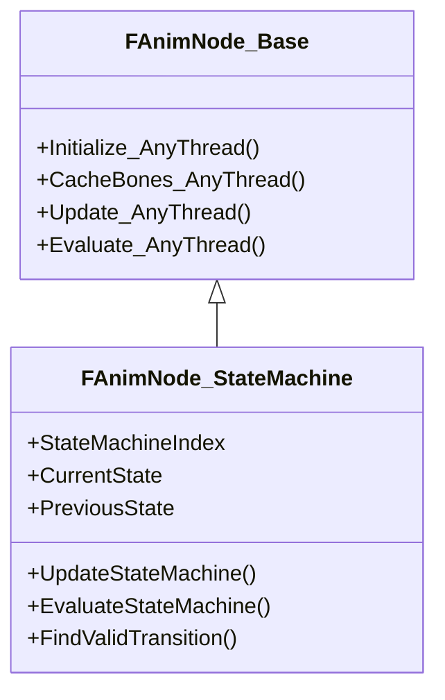
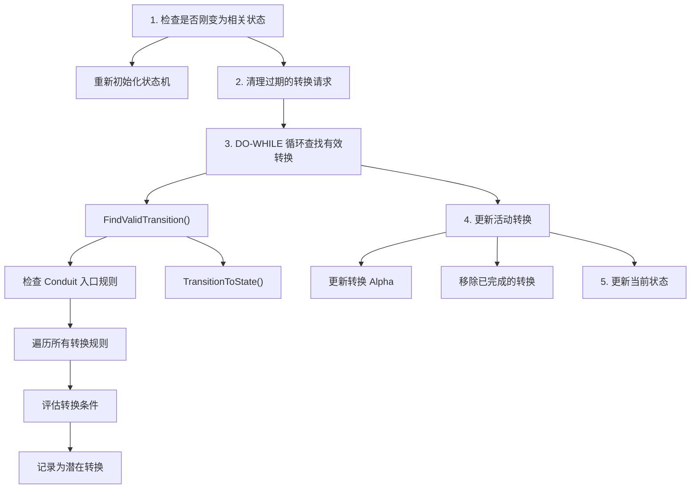
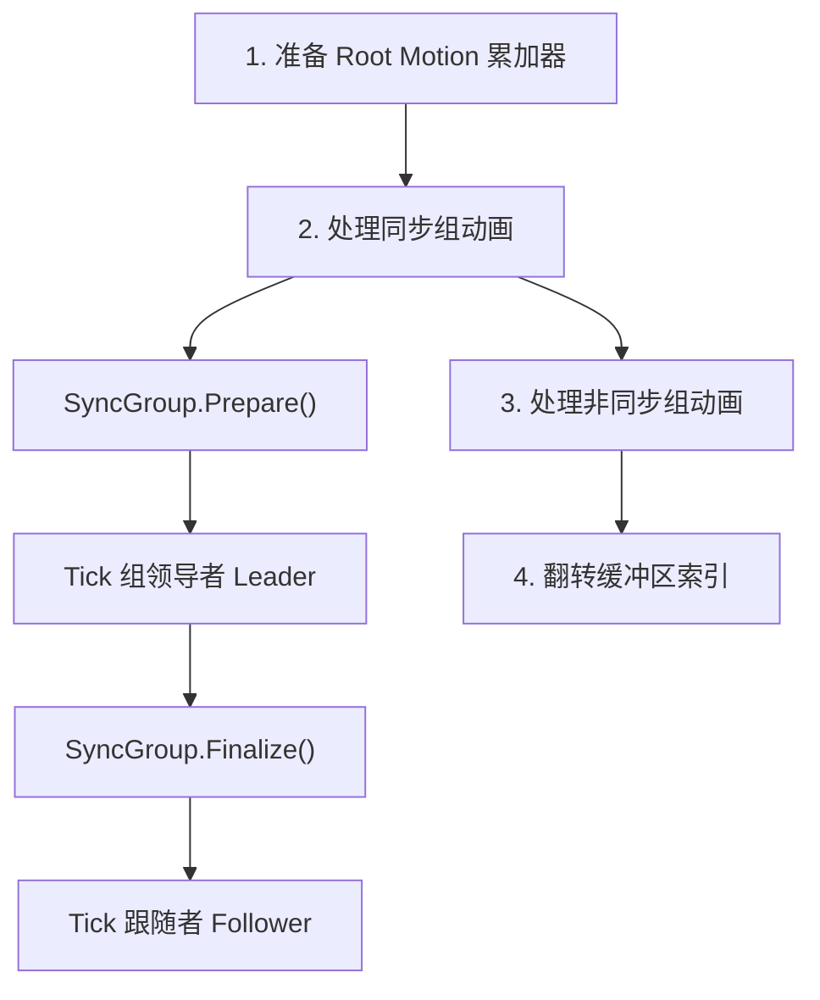
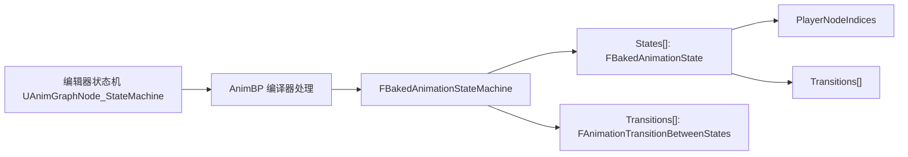
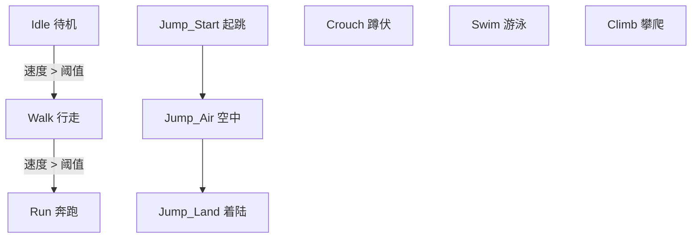
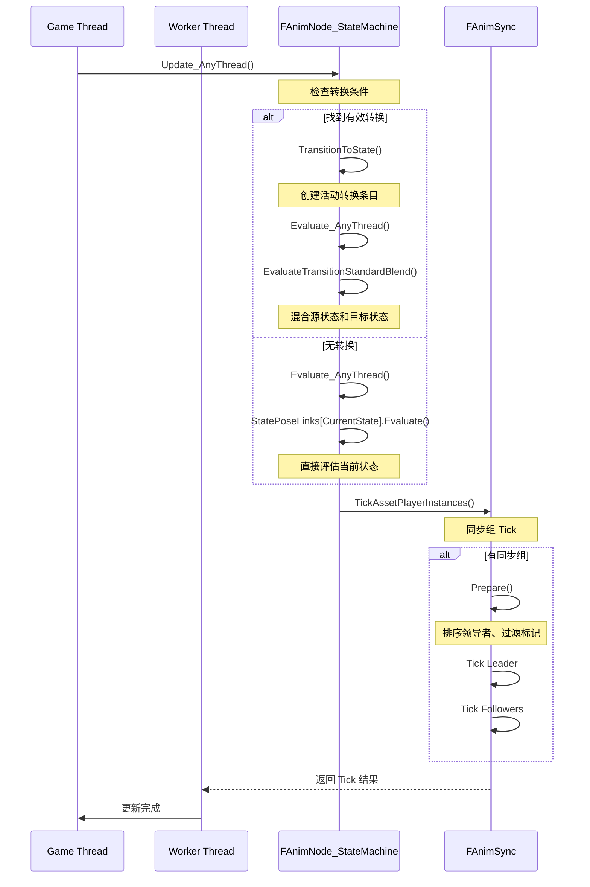

# UE5动画图与状态机深度分析

> 本文档深入分析 Unreal Engine 5 的状态机系统（`FAnimNode_StateMachine`）和同步组机制（`FAnimSync`）。

## 文档导航

- **上一篇**：[03-UE5动画资源与蓝图系统深度分析](03-UE5动画资源与蓝图系统深度分析.md) - 动画资源与蓝图系统
- **下一篇**：[05-UE5IK解算与骨骼控制深度分析](05-UE5IK解算与骨骼控制深度分析.md) - IK 解算与骨骼控制

---

## 一、FAnimNode_StateMachine 状态机节点分析

### 1.1 类继承关系

**源码位置**：
- `Engine/Source/Runtime/Engine/Classes/Animation/AnimNode_StateMachine.h`
- `Engine/Source/Runtime/Engine/Private/Animation/AnimNode_StateMachine.cpp`



---

### 1.2 核心属性

| 属性 | 类型 | 说明 |
|------|------|------|
| `StateMachineIndexInClass` | `int32` | 在 `UAnimBlueprintGeneratedClass` 的 `BakedStateMachines` 数组中的索引 |
| `CurrentState` | `int32` | 当前状态索引 |
| `ElapsedTime` | `float` | 在当前状态的停留时间 |
| `bFirstUpdate` | `bool` | 是否首次更新 |
| `MaxTransitionsPerFrame` | `int32` | 每帧最多执行的转换数（默认 3） |
| `MaxTransitionsRequests` | `int32` | 最大转换请求缓存数（默认 32） |
| `bSkipFirstUpdateTransition` | `bool` | 跳过首次更新的转换 |
| `bReinitializeOnBecomingRelevant` | `bool` | 重新相关时重新初始化 |
| `PRIVATE_MachineDescription` | `const FBakedAnimationStateMachine*` | 状态机描述（烘烤后的数据） |
| `ActiveTransitionArray` | `TArray<FAnimationActiveTransitionEntry>` | 活动转换数组（支持多转换同时进行） |
| `StatePoseLinks` | `TArray<FPoseLink>` | 状态 Pose 链接 |
| `OnGraphStatesEntered` | `TArray<FOnGraphStateChanged>` | 状态进入委托 |
| `OnGraphStatesExited` | `TArray<FOnGraphStateChanged>` | 状态退出委托 |
| `QueuedTransitionEvents` | `TArray<FTransitionEvent>` | 转换请求队列 |

---

### 1.3 关键方法

| 方法 | 功能描述 |
|------|-----------|
| `Initialize_AnyThread()` | 初始化状态机，设置初始状态 |
| `Update_AnyThread()` | 更新状态机，检查并处理转换 |
| `Evaluate_AnyThread()` | 评估当前状态，输出最终 Pose |
| `FindValidTransition()` | 查找有效的转换路径 |
| `TransitionToState()` | 执行状态转换 |
| `SetState()` | 设置当前状态 |
| `GetStateWeight()` | 获取指定状态的权重 |
| `UpdateTransitionStates()` | 更新转换中的状态 |
| `EvaluateTransitionStandardBlend()` | 评估标准混合转换 |
| `EvaluateTransitionCustomBlend()` | 评估自定义混合转换 |

---

## 二、FBakedAnimationStateMachine 烘烤状态机数据

### 2.1 烘烤后的状态机数据

**源码位置**：`Engine/Source/Runtime/Engine/Classes/Animation/AnimStateMachineTypes.h`

```cpp
struct FBakedAnimationStateMachine
{
    // 状态机名称（主要用于调试）
    FName MachineName;

    // 初始状态索引
    int32 InitialState;

    // 所有状态列表
    TArray<FBakedAnimationState> States;

    // 所有转换列表
    TArray<FAnimationTransitionBetweenStates> Transitions;
};
```

---

### 2.2 FBakedAnimationState 结构

```cpp
struct FBakedAnimationState
{
    // 状态中的动画播放节点索引
    TArray<int32> PlayerNodeIndices;

    // 状态中的层节点索引
    TArray<int32> LayerNodeIndices;

    // 从该状态出发的合法转换（已按优先级排序）
    TArray<FBakedStateExitTransition> Transitions;

    // 状态名称
    FName StateName;

    // 状态根节点索引
    int32 StateRootNodeIndex;

    // 通知事件索引
    int32 StartNotify;      // 进入状态时触发
    int32 EndNotify;        // 退出状态时触发
    int32 FullyBlendedNotify; // 完全混合时触发

    // 入口规则节点索引（用于 Conduit）
    int32 EntryRuleNodeIndex;

    // 标志位
    bool bAlwaysResetOnEntry; // 重新进入时总是重置
    bool bIsAConduit;       // 是否为管道状态
};
```

---

### 2.3 FAnimationTransitionBetweenStates 结构

```cpp
struct FAnimationTransitionBetweenStates : public FAnimationStateBase
{
    // 转换相关的混合曲线
    TObjectPtr<UCurveFloat> CustomCurve;
    TObjectPtr<UBlendProfile> BlendProfile;

    // 转换的源状态和目标状态
    int32 PreviousState;
    int32 NextState;

    // 混合参数
    float CrossfadeDuration;      // 混合持续时间
    float MinTimeBeforeReentry;   // 重新进入的最小时间间隔

    // 通知事件
    int32 StartNotify;
    int32 EndNotify;
    int32 InterruptNotify;        // 被中断时触发

    // 混合模式
    EAlphaBlendOption BlendMode; // 混合曲线类型
    ETransitionLogicType LogicType; // 转换逻辑类型

    // 标志位
    uint8 bAllowInertializationForSelfTransitions : 1; // 自转换是否允许惯性化
};
```

---

## 三、状态转换流程详细分析

### 3.1 转换逻辑类型

**源码位置**：`Engine/Source/Runtime/Engine/Classes/Animation/AnimStateMachineTypes.h`

```cpp
enum class ETransitionLogicType : uint8
{
    TLT_StandardBlend,    // 标准混合：两个状态同时更新
    TLT_Inertialization,  // 惯性化：只更新目标状态
    TLT_Custom            // 自定义：使用自定义图表定义混合
};
```

---

### 3.2 转换检测流程

`Update_AnyThread()` 中的核心转换检测逻辑：



---

### 3.3 FAnimationActiveTransitionEntry 活动转换条目

```cpp
struct FAnimationActiveTransitionEntry
{
    // 时间控制
    float ElapsedTime;          // 已进行时间
    float Alpha;                // 当前混合 Alpha
    float CrossfadeDuration;    // 混合持续时间

    // 状态信息
    int32 NextState;           // 目标状态
    int32 PreviousState;        // 源状态

    // 通知
    int32 StartNotify;
    int32 EndNotify;
    int32 InterruptNotify;

    // 自定义转换图表
    FPoseLink CustomTransitionGraph;

    // 混合数据
    FAlphaBlend Blend;                    // Alpha 混合器
    TObjectPtr<UBlendProfile> BlendProfile; // 按骨骼混合配置
    EAlphaBlendOption BlendOption;         // 混合选项

    // Pose 评估器
    TArray<FAnimNode_TransitionPoseEvaluator*> PoseEvaluators;

    // 状态混合数据（用于按骨骼混合）
    TArray<FBlendSampleData> StateBlendData;

    bool bActive;  // 是否活跃
};
```

---

## 四、状态机节点执行流程

### 4.1 初始化阶段 (Initialize_AnyThread)

```cpp
void FAnimNode_StateMachine::Initialize_AnyThread(const FAnimationInitializeContext& Context)
{
    // 1. 重置状态
    ElapsedTime = 0.0f;
    CurrentState = INDEX_NONE;

    // 2. 为每个状态创建 PoseLink
    for (int32 StateIndex = 0; StateIndex < Machine->States.Num(); ++StateIndex)
    {
        // 初始化状态的入口规则和转换规则节点
        if (State.EntryRuleNodeIndex != INDEX_NONE)
        {
            TransitionNode->Initialize_AnyThread(Context);
        }

        for (int32 TransitionIndex = 0; TransitionIndex < State.Transitions.Num(); ++TransitionIndex)
        {
            if (TransitionRule.CanTakeDelegateIndex != INDEX_NONE)
            {
                TransitionNode->Initialize_AnyThread(Context);
            }
        }
    }

    // 3. 设置初始状态
    SetState(Context, Machine->InitialState, false);
}
```

---

### 4.2 更新阶段 (Update_AnyThread)

核心更新逻辑：

1. **记录权重**：`RecordMachineWeight()`
2. **处理重新相关**：检查是否需要重新初始化
3. **清理过期请求**：移除超时的转换请求
4. **查找有效转换**：最多每帧执行 `MaxTransitionsPerFrame` 次转换
5. **更新活动转换**：
   - 更新转换 Alpha
   - 根据转换类型更新对应状态
   - 移除已完成的转换
6. **更新当前状态**：如果没有活动转换，直接更新当前状态

---

### 4.3 评估阶段 (Evaluate_AnyThread)

```cpp
void FAnimNode_StateMachine::Evaluate_AnyThread(FPoseContext& Output)
{
    if (ActiveTransitionArray.Num() > 0)
    {
        // 有活动转换，按类型评估
        for (int32 Index = 0; Index < ActiveTransitionArray.Num(); ++Index)
        {
            FAnimationActiveTransitionEntry& ActiveTransition = ActiveTransitionArray[Index];

            switch (ActiveTransition.LogicType)
            {
            case ETransitionLogicType::TLT_StandardBlend:
                EvaluateTransitionStandardBlend(Output, ActiveTransition, bIntermediatePoseIsValid);
                break;

            case ETransitionLogicType::TLT_Inertialization:
                EvaluateState(ActiveTransition.NextState, Output);
                break;

            case ETransitionLogicType::TLT_Custom:
                EvaluateTransitionCustomBlend(Output, ActiveTransition, bIntermediatePoseIsValid);
                break;
            }
        }
    }
    else
    {
        // 无活动转换，直接评估当前状态
        StatePoseLinks[CurrentState].Evaluate(Output);
    }
}
```

---

### 4.4 标准混合评估

```cpp
void FAnimNode_StateMachine::EvaluateTransitionStandardBlendInternal(
    FPoseContext& Output,
    FAnimationActiveTransitionEntry& Transition,
    const FPoseContext& PreviousStateResult,
    const FPoseContext& NextStateResult)
{
    // 如果有 BlendProfile，执行按骨骼混合
    if (Transition.BlendProfile)
    {
        for (const FCompactPoseBoneIndex TargetBoneIndex : Output.Pose.ForEachBoneIndex())
        {
            // 获取该骨骼的混合权重
            const int32 PerBoneIndex = Transition.BlendProfile->GetPerBoneInterpolationIndex(...);

            // 按权重混合
            Output.Pose[TargetBoneIndex] = PreviousStateResult.Pose[TargetBoneIndex] * FirstWeight;
            Output.Pose[TargetBoneIndex].AccumulateWithShortestRotation(NextStateResult.Pose[TargetBoneIndex], SecondWeight);
        }
    }
    else
    {
        // 整体混合
        for (FCompactPoseBoneIndex BoneIndex : Output.Pose.ForEachBoneIndex())
        {
            Output.Pose[BoneIndex] = PreviousStateResult.Pose[BoneIndex] * (1.0f - Transition.Alpha);
            Output.Pose[BoneIndex].AccumulateWithShortestRotation(NextStateResult.Pose[BoneIndex], Transition.Alpha);
        }
    }

    // 混合曲线和属性
    Output.Curve.Override(PreviousStateResult.Curve, 1.0 - Transition.Alpha);
    Output.Curve.Accumulate(NextStateResult.Curve, Transition.Alpha);
}
```

---

## 五、同步组（Sync Group）机制分析

### 5.1 FAnimSync 结构

**源码位置**：`Engine/Source/Runtime/Engine/Public/Animation/AnimSync.h`

```cpp
// 包装了按组（通过归一化时间）或标记进行同步和 tick 动画的功能
struct FAnimSync
{
    static ENGINE_API const FName Attribute;

    using FSyncGroupMap = TMap<FName, FAnimGroupInstance>;

    // 双缓冲区机制
    TArray<FAnimTickRecord> UngroupedActivePlayerArrays[2];  // 非同步组动画
    FSyncGroupMap SyncGroupMaps[2];                        // 同步组映射
    const UMirrorDataTable* MirrorDataTable = nullptr;
    int32 SyncGroupWriteIndex = 0;                         // 当前写缓冲区索引
};
```

**双缓冲区设计**：
- `SyncGroupMaps[0]` 和 `SyncGroupMaps[1]` 交替读写
- 读索引：`GetSyncGroupReadIndex()` → `1 - SyncGroupWriteIndex`
- 写索引：`GetSyncGroupWriteIndex()` → `SyncGroupWriteIndex`
- 每帧结束后翻转：`TickSyncGroupWriteIndex()`

---

### 5.2 FAnimGroupInstance 结构

**源码位置**：`Engine/Source/Runtime/Engine/Classes/Animation/AnimationAsset.h`（第 640-706 行）

```cpp
struct FAnimGroupInstance
{
    // 本帧将要评估的动画播放器列表
    TArray<FAnimTickRecord> ActivePlayers;

    // 当前组领导者索引
    // 注意：tick 前无效；tick 后应为真实领导者
    int32 GroupLeaderIndex;

    // 同步组的有效标记名称
    TArray<FName> ValidMarkers;

    // 是否可以使用同步标记进行 tick
    bool bCanUseMarkerSync;

    // Montage 领导者权重
    float MontageLeaderWeight;

    // 标记 tick 上下文
    FMarkerTickContext MarkerTickContext;

    // 0-1 范围，表示 tick 前动画播放进度
    float PreviousAnimLengthRatio;

    // 0-1 范围，表示当前动画播放进度
    float AnimLengthRatio;

    // 核心方法
    void TestTickRecordForLeadership(EAnimGroupRole::Type MembershipType);
    void Finalize(const FAnimGroupInstance* PreviousGroup);
    void Prepare(const FAnimGroupInstance* PreviousGroup);
};
```

---

### 5.3 EAnimGroupRole 枚举

**源码位置**：同 `AnimationAsset.h`（第 590-613 行）

```cpp
namespace EAnimGroupRole
{
    enum Type : int
    {
        // 可以是领导者，只要混合权重高于之前的最佳领导者
        CanBeLeader,

        // 永远是跟随者（除非只有跟随者，则第一个 tick 的获胜）
        AlwaysFollower,

        // 永远是领导者（如果多个节点都是 AlwaysLeader，最后 tick 的获胜）
        AlwaysLeader,

        // 混合时排除在同步组外，一旦混合完成就成为同步组领导者直到混合出
        TransitionLeader,

        // 混合时排除在同步组外，一旦混合完成就成为跟随者直到混合出
        TransitionFollower,

        // 永远是领导者，如果无法作为领导者 tick，将作为非分组资产播放器运行
        ExclusiveAlwaysLeader,
    };
}
```

**LeaderScore 计算规则**（来自 `AnimationAsset.cpp` 第 27-28 行）：
```cpp
#define LEADERSCORE_ALWAYSLEADER  2.0f
#define LEADERSCORE_MONTAGE       3.0f

// 优先级：CanBeLeader/TransitionLeader (BlendWeight) < AlwaysLeader/ExclusiveAlwaysLeader (2.0) < Montage (3.0)
```

---

### 5.4 FAnimTickRecord 结构

**源码位置**：同 `AnimationAsset.h`（第 409-510 行）

```cpp
struct FAnimTickRecord
{
    TObjectPtr<class UAnimationAsset> SourceAsset = nullptr;
    float* TimeAccumulator = nullptr;
    float PlayRateMultiplier = 1.0f;
    float EffectiveBlendWeight = 0.0f;
    bool bLooping = false;
    bool bIsEvaluator = false;
    bool bRequestedInertialization = false;
    bool bOverridePositionWhenJoiningSyncGroupAsLeader = false;
    bool bIsExclusiveLeader = false;

    // 标记同步相关数据
    FMarkerTickRecord* MarkerTickRecord = nullptr;
    bool bCanUseMarkerSync = false;
    float LeaderScore = 0.0f;

    // 按 LeaderScore 降序排序
    bool operator < (const FAnimTickRecord& Other) const
    {
        return LeaderScore > Other.LeaderScore;
    }
};
```

---

## 六、FAnimSync 核心方法分析

### 6.1 AddTickRecord() - 添加 Tick 记录

**源码位置**：`Engine/Source/Runtime/Engine/Private/Animation/AnimSync.cpp`（第 49-72 行）

```cpp
void FAnimSync::AddTickRecord(const FAnimTickRecord& InTickRecord, const FAnimSyncParams& InSyncParams)
{
    if (InSyncParams.GroupName != NAME_None)
    {
        // 获取指定的同步组
        FSyncGroupMap& SyncGroupMap = SyncGroupMaps[GetSyncGroupWriteIndex()];
        FAnimGroupInstance& SyncGroupInstance = SyncGroupMap.FindOrAdd(InSyncParams.GroupName);

        // 将动画实例的 tick 记录添加到同步组
        SyncGroupInstance.ActivePlayers.Add(InTickRecord);
        SyncGroupInstance.ActivePlayers.Top().bOverridePositionWhenJoiningSyncGroupAsLeader =
            InSyncParams.bOverridePositionWhenJoiningSyncGroupAsLeader;
        SyncGroupInstance.ActivePlayers.Top().bIsExclusiveLeader =
            InSyncParams.Role == EAnimGroupRole::ExclusiveAlwaysLeader;

        // 为刚添加的 tick 记录设置领导者分数，并确保每组只有一个 montage
        // CanBeLeader 或 TransitionLeader 分数 (BlendWeight) < Always Leader 分数 (2.0) < Montage 领导者分数 (3.0)
        SyncGroupInstance.TestTickRecordForLeadership(InSyncParams.Role);
    }
    else
    {
        // 无同步组，添加到非分组数组
        UngroupedActivePlayerArrays[GetSyncGroupWriteIndex()].Add(InTickRecord);
    }
}
```

---

### 6.2 TickAssetPlayerInstances() - 核心 Tick 逻辑

**源码位置**：同 `AnimSync.cpp`（第 79-411 行）

这是同步组机制的核心函数，负责 tick 所有已注册的动画资源播放器。

**执行流程**：



**关键代码片段分析**（第 110-266 行 - 领导者选举和 Tick）：

```cpp
// [1] Tick 分组动画实例
FSyncGroupMap& SyncGroupMap = SyncGroupMaps[GetSyncGroupWriteIndex()];
const FSyncGroupMap& PreviousSyncGroupMap = SyncGroupMaps[GetSyncGroupReadIndex()];

for (TTuple<FName, FAnimGroupInstance>& SyncGroupPair : SyncGroupMap)
{
    FAnimGroupInstance& SyncGroup = SyncGroupPair.Value;
    if (SyncGroup.ActivePlayers.Num() > 0)
    {
        const FAnimGroupInstance* PreviousGroup = PreviousSyncGroupMap.Find(SyncGroupPair.Key);

        // 准备同步组
        SyncGroup.Prepare(PreviousGroup);
```
然后我们初始化 TickContext 上下文，确保同步数据正确传递：
```cpp
        // [2] 确定我们是否有单个动画上下文
        const bool bOnlyOneAnimationInGroup = SyncGroup.ActivePlayers.Num() == 1;

        // 组的动画上下文（由领导者修改，由跟随者读取）
        FAnimAssetTickContext TickContext(InDeltaSeconds, RootMotionMode,
                                       bOnlyOneAnimationInGroup, SyncGroup.ValidMarkers);

        // 使用前一帧的组信息初始化组上下文
        if (PreviousGroup)
        {
            TickContext.SetPreviousAnimationPositionRatio(PreviousGroup->AnimLengthRatio);
            TickContext.SetAnimationPositionRatio(PreviousGroup->AnimLengthRatio);

            // 从前一组的标记同步结束位置继续
            const FMarkerSyncAnimPosition& EndPosition = PreviousGroup->MarkerTickContext.GetMarkerSyncEndPosition();
            if (EndPosition.IsValid() && ...)
            {
                TickContext.MarkerTickContext.SetMarkerSyncStartPosition(EndPosition);
            }
        }
```
接下来处理组领导者的 Tick，并尝试查找新领导者：
```cpp
        // [3] Tick 组领导者
        int32 GroupLeaderIndex = 0;
        for (; GroupLeaderIndex < SyncGroup.ActivePlayers.Num(); ++GroupLeaderIndex)
        {
            FAnimTickRecord& GroupLeader = SyncGroup.ActivePlayers[GroupLeaderIndex];

            // Tick 领导者资产
            GroupLeader.SourceAsset->TickAssetPlayer(GroupLeader, InProxy.NotifyQueue, TickContext);

            // 检查同步标记并确定最终领导者
            if (TickContext.CanUseMarkerPosition() == false)
            {
                SyncGroup.GroupLeaderIndex = GroupLeaderIndex;
                break;
            }
            else if (TickContext.MarkerTickContext.IsMarkerSyncEndValid())
            {
                SyncGroup.GroupLeaderIndex = GroupLeaderIndex;
                SyncGroup.MarkerTickContext = TickContext.MarkerTickContext;
                break;
            }
        }

        check(SyncGroup.GroupLeaderIndex != INDEX_NONE);
        SyncGroup.Finalize(PreviousGroup);
```
最后，同步其他所有跟随者（Followers）到当前确定的领导者：
```cpp
        // [4] 更新其他所有以跟随领导者
        if (SyncGroup.ActivePlayers.Num() > GroupLeaderIndex + 1)
        {
            TickContext.ConvertToFollower();

            for (int32 TickIndex = GroupLeaderIndex + 1; TickIndex < SyncGroup.ActivePlayers.Num(); ++TickIndex)
            {
                FAnimTickRecord& AssetPlayer = SyncGroup.ActivePlayers[TickIndex];
                if (AssetPlayer.bIsExclusiveLeader) continue; // 跳过独占领导者记录

                // Tick 跟随者的资产播放器（会自动同步到领导者）
                AssetPlayer.SourceAsset->TickAssetPlayer(AssetPlayer, InProxy.NotifyQueue, TickContext);
            }
        }
    }
}
```**源码位置**：`Engine/Source/Runtime/Engine/Private/Animation/AnimationAsset.cpp`（第 117-223 行）

```cpp
void FAnimGroupInstance::Prepare(const FAnimGroupInstance* PreviousGroup)
{
    // [1] 按领导者分数排序资产播放器，高权重的排在前面
    ActivePlayers.Sort();

    // [2] 检查领导者是否有任何动画标记（Markers）
    const TArray<FName>* MarkerNames = ActivePlayers[0].SourceAsset->GetUniqueMarkerNames();
    const bool bLeaderHasMarkers = MarkerNames && !MarkerNames->IsEmpty();

    if (bLeaderHasMarkers)
    {
        ValidMarkers = *MarkerNames;

        // 为领导者和实例组启用基于标记的同步
        ActivePlayers[0].bCanUseMarkerSync = true;
        bCanUseMarkerSync = true;
```
对于组内的其它动画节点，需要过滤它们与组候选领导者不共有的标记：
```cpp
        // [3] 准备资产播放器候选
        for (int32 ActivePlayerIndex = 0; ActivePlayerIndex < ActivePlayers.Num(); ++ActivePlayerIndex)
        {
            FAnimTickRecord& Candidate = ActivePlayers[ActivePlayerIndex];

            // 过滤 Follower 中与组候选领导者不共有的标记
            if (ActivePlayerIndex != 0 && ValidMarkers.Num() > 0)
            {
                const TArray<FName>* PlayerMarkerNames = Candidate.SourceAsset->GetUniqueMarkerNames();
                const bool bFollowerHasMarkers = PlayerMarkerNames && !PlayerMarkerNames->IsEmpty();

                if (bFollowerHasMarkers)
                {
                    Candidate.bCanUseMarkerSync = true;

                    // 移除 Follower 有但 Leader 没有的标记，确保严格按照 Leader 包含的标记执行同步
                    for (int32 ValidMarkerIndex = ValidMarkers.Num() - 1; ValidMarkerIndex >= 0; --ValidMarkerIndex)
                    {
                        FName& MarkerName = ValidMarkers[ValidMarkerIndex];
                        if (!PlayerMarkerNames->Contains(MarkerName))
                        {
                            ValidMarkers.RemoveAtSwap(ValidMarkerIndex, EAllowShrinking::No);
                        }
                    }
                }
            }
        }
        bCanUseMarkerSync = ValidMarkers.Num() > 0;
    }
```
如果没有标记能够用于同步，那么回退到传统的基于动画长度的同步（Length-based sync）：
```cpp
    // [4] 领导者没有标记或所有标记都被过滤掉，回退到基于长度的同步
    if (!bLeaderHasMarkers || !bCanUseMarkerSync)
    {
        bCanUseMarkerSync = false;
        ValidMarkers.Reset();

        for (FAnimTickRecord& AnimTickRecord : ActivePlayers)
        {
            AnimTickRecord.MarkerTickRecord->Reset();
            AnimTickRecord.bCanUseMarkerSync = false;
        }
    }
}
```**源码位置**：同 `AnimationAsset.cpp`（第 36-101 行）

```cpp
void FAnimGroupInstance::TestTickRecordForLeadership(EAnimGroupRole::Type MembershipType)
{
    check(ActivePlayers.Num() > 0);

    const int32 TestIndex = ActivePlayers.Num() - 1;
    FAnimTickRecord& Candidate = ActivePlayers[TestIndex];
```
首先检查正在处理的是不是 AnimMontage，如果是则采用特定权重的策略来清理：
```cpp
    // [1] 处理 Montage 候选
    if (Candidate.SourceAsset->IsA<UAnimMontage>())
    {
        // 检查候选是否有更高权重
        if (Candidate.EffectiveBlendWeight > MontageLeaderWeight)
        {
            // 如果这将成为领导者，清理 ActivePlayers，因为我们不同步多个 montage
            const int32 LastIndex = TestIndex - 1;
            if (LastIndex >= 0) ActivePlayers.RemoveAt(LastIndex, 1);

            check(ActivePlayers.Num() == 1);

            // 覆盖之前的领导者权重和分数
            MontageLeaderWeight = Candidate.EffectiveBlendWeight;
            Candidate.LeaderScore = LEADERSCORE_MONTAGE;  // 3.0
        }
        else
        {
            // 移除低权重的 Montage
            if (TestIndex != 0) ActivePlayers.RemoveAt(TestIndex, 1);
        }
    }
```
对于通常的 Sequence 或 BlendSpace，依据它们指定的同步组角色赋予初始分数：
```cpp
    // [2] 处理 Sequence 或 BlendSpace 候选
    else
    {
        switch (MembershipType)
        {
        case EAnimGroupRole::CanBeLeader:
        case EAnimGroupRole::TransitionLeader:
            Candidate.LeaderScore = Candidate.EffectiveBlendWeight;  // 使用混合权重
            break;
        case EAnimGroupRole::AlwaysLeader:
        case EAnimGroupRole::ExclusiveAlwaysLeader:
            Candidate.LeaderScore = LEADERSCORE_ALWAYSLEADER;  // 2.0
            break;
        default:
        case EAnimGroupRole::AlwaysFollower:
        case EAnimGroupRole::TransitionFollower:
            // 从不设置领导者索引，分数为初始的 0.0
            break;
        }
    }
}
```
### 7.1 基于长度的同步（Length-Based Sync）

当动画没有标记（Marker）或标记不同步时使用。

**原理**：
- 使用归一化的时间比例（0-1）进行同步
- Leader 的 `AnimLengthRatio` 传递给 Follower
- Follower 调整自己的时间以匹配 Leader 的比例

**代码路径**：
```cpp
// AnimSync.cpp 第 229-236 行
if (TickContext.CanUseMarkerPosition() == false)
{
    SyncGroup.PreviousAnimLengthRatio = TickContext.GetPreviousAnimationPositionRatio();
    SyncGroup.AnimLengthRatio = TickContext.GetAnimationPositionRatio();
    SyncGroup.GroupLeaderIndex = GroupLeaderIndex;
    break;  // 不使用标记同步，直接退出
}
```

---

### 7.2 基于标记的同步（Marker-Based Sync）

当动画有同步标记时使用，提供更精确的同步。

**原理**：
- 使用 `FMarkerSyncAnimPosition` 结构：`{PreviousMarkerName, NextMarkerName, PositionBetweenMarkers}`
- Leader 和 Follower 都同步到相同的标记位置
- 支持动画长度不同但标记点对应的同步

**关键结构**：
```cpp
// 表示基于同步标记的当前播放位置
struct FMarkerSyncAnimPosition
{
    FName PreviousMarkerName;  // 已通过的标记
    FName NextMarkerName;      // 正朝向的标记
    float PositionBetweenMarkers;  // 0=在 PreviousMarker, 1=在 NextMarker
};
```

**同步流程**：
1. Leader Tick 后，生成 `MarkerTickContext`
2. Follower 读取 Leader 的标记位置
3. Follower 调整自己的时间，使自己位于相同的标记区间和区间位置

---

## 八、烘烤（Bake）过程分析

### 8.1 从编辑器到运行时的转换

烘烤过程将编辑时的状态机图表转换为运行时高效的 `FBakedAnimationStateMachine` 结构：



---

### 8.2 烘烤数据存储

烘烤后的状态机数据存储在 `UAnimBlueprintGeneratedClass` 中：

```cpp
class UAnimBlueprintGeneratedClass : public UBlueprintGeneratedClass, public IAnimClassInterface
{
    // 烘烤后的状态机数组
    TArray<FBakedAnimationStateMachine> BakedStateMachines;

    // 通知事件数组
    TArray<FAnimNotifyEvent> AnimNotifies;

    // 同步组名称
    TArray<FName> SyncGroupNames;
    // ...
};
```

---

### 8.3 状态机节点如何获取烘烤数据

```cpp
void FAnimNode_StateMachine::CacheMachineDescription(IAnimClassInterface* AnimBlueprintClass)
{
    PRIVATE_MachineDescription =
        AnimBlueprintClass->GetBakedStateMachines().IsValidIndex(StateMachineIndexInClass)
        ? &(AnimBlueprintClass->GetBakedStateMachines()[StateMachineIndexInClass])
        : nullptr;
}
```

---

## 九、转换请求系统

### 9.1 FTransitionEvent 结构

```cpp
struct FTransitionEvent
{
    FName EventName;                              // 事件名称
    double CreationTime;                           // 创建时间
    double TimeToLive;                            // 生存时间
    ETransitionRequestQueueMode QueueMode;        // 队列模式
    ETransitionRequestOverwriteMode OverwriteMode; // 覆盖模式
    TArray<int32> ConsumedTransitions;            // 已消费的转换
};
```

---

### 9.2 队列模式

- `Shared`: 只有一个转换可以处理此请求
- `Unique`: 允许多个转换处理同一请求

---

### 9.3 覆盖模式

- `Append`: 总是添加新请求
- `Ignore`: 如果同名请求已存在则忽略
- `Overwrite`: 覆盖同名请求

---

## 十、Lyra 项目中的应用分析

虽然无法直接访问 Lyra 的蓝图资源文件（.uasset 需要特殊解析），但基于 Lyra 的架构特点，可以推断其状态机使用方式：

### 10.1 Lyra 角色动画状态机可能包含的状态



---

### 10.2 与 GAS 的集成方式

Lyra 通过以下方式与 GAS 集成：

1. **在 AnimInstance 中访问 GAS 数据**：
   ```cpp
   // LyraAnimInstance 中可以访问 AbilitySystemComponent
   UAbilitySystemComponent* ASC = Owner->GetAbilitySystemComponent();

   // 通过 GameplayTags 驱动状态转换
   if (ASC->HasMatchingGameplayTag(JumpTag))
   {
       // 触发跳转状态
   }
   ```

2. **使用 AnimNotifyState 与 GAS 交互**

3. **在状态机转换规则中检查 GAS 状态**

---

## 十一、状态机使用流程图



---

## 十二、关键源码文件索引

| 文件路径 | 说明 |
|---------|----------|
| `Engine/Source/Runtime/Engine/Classes/Animation/AnimNode_StateMachine.h` | FAnimNode_StateMachine 类定义 |
| `Engine/Source/Runtime/Engine/Private/Animation/AnimNode_StateMachine.cpp` | FAnimNode_StateMachine 实现 |
| `Engine/Source/Runtime/Engine/Classes/Animation/AnimStateMachineTypes.h` | 状态机数据类型定义 |
| `Engine/Source/Runtime/Engine/Private/Animation/AnimStateMachineTypes.cpp` | 状态机数据类型实现 |
| `Engine/Source/Runtime/Engine/Public/Animation/AnimSync.h` | FAnimSync 结构定义 |
| `Engine/Source/Runtime/Engine/Private/Animation/AnimSync.cpp` | FAnimSync 实现 |
| `Engine/Source/Runtime/Engine/Classes/Animation/AnimationAsset.h` | FAnimGroupInstance, EAnimGroupRole, FAnimTickRecord 定义 |
| `Engine/Source/Runtime/Engine/Private/Animation/AnimationAsset.cpp` | FAnimGroupInstance 方法实现 |

---

## 十三、总结

Unreal Engine 5 的状态机系统是一个高度优化的运行时系统，核心特点包括：

1. **烘烤优化**：编辑器状态机在编译时转换为高效的 `FBakedAnimationStateMachine` 结构
2. **多转换支持**：通过 `ActiveTransitionArray` 支持多个转换同时进行
3. **灵活的混合模式**：支持标准混合、惯性化和自定义混合
4. **按骨骼混合**：通过 `UBlendProfile` 实现不同骨骼使用不同的混合时间
5. **转换请求队列**：支持缓冲和延迟处理转换请求
6. **Conduit 支持**：允许创建无姿势的中间状态用于复杂转换逻辑
7. **同步组机制**：通过 `FAnimSync` 实现多个动画节点在时间上的精确同步
8. **双缓冲区设计**：使用 `SyncGroupMaps[2]` 避免读写冲突，支持多线程

---

## 十四、参考资料

1. [Unreal Engine 5 官方文档 - 状态机](https://docs.unrealengine.com/5.0/en-US/state-machines-in-unreal-engine/)
2. [Unreal Engine 5 官方文档 - 同步组](https://docs.unrealengine.com/5.0/en-US/animation-sync-groups-in-unreal-engine/)
3. [Unreal Engine 5 源码 - AnimNode_StateMachine.h](https://github.com/EpicGames/UnrealEngine/blob/5.0/Engine/Source/Runtime/Engine/Classes/Animation/AnimNode_StateMachine.h)
4. [Unreal Engine 5 源码 - AnimSync.h](https://github.com/EpicGames/UnrealEngine/blob/5.0/Engine/Source/Runtime/Engine/Public/Animation/AnimSync.h)

---

> **最后更新**：2026-05-16
> **状态**：current
> **维护者**：AI Agent (project-wiki skill)

<!-- nav:auto -->

---

**导航**: ← [[30-tutorials/animation/03-UE5动画资源与蓝图系统深度分析|03-UE5动画资源与蓝图系统深度分析]] · [[30-tutorials/animation/05-UE5IK解算与骨骼控制深度分析|05-UE5IK解算与骨骼控制深度分析]] →

<!-- /nav:auto -->
