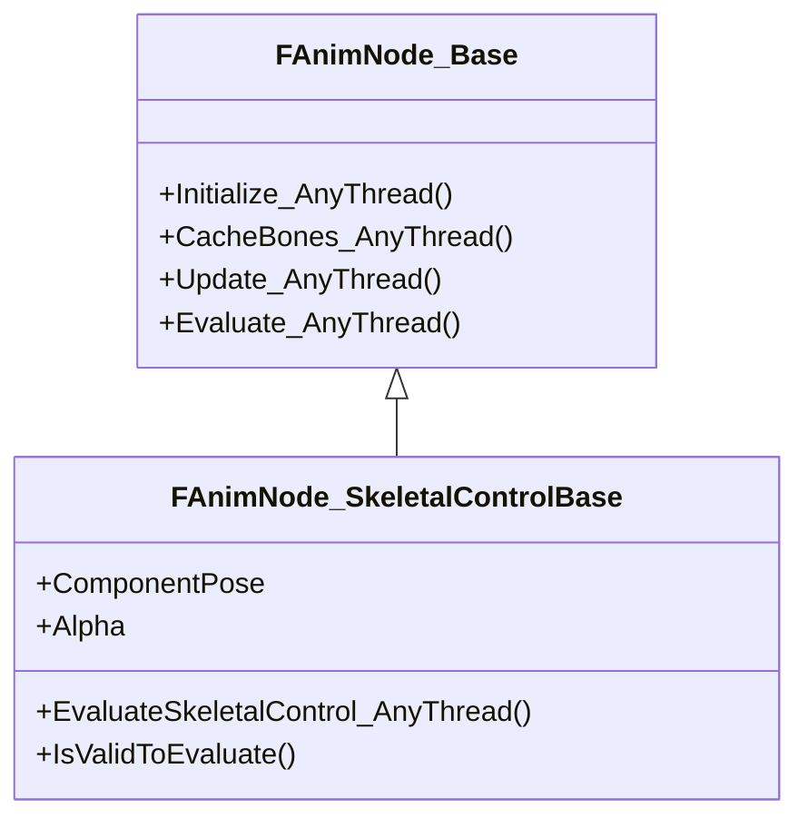
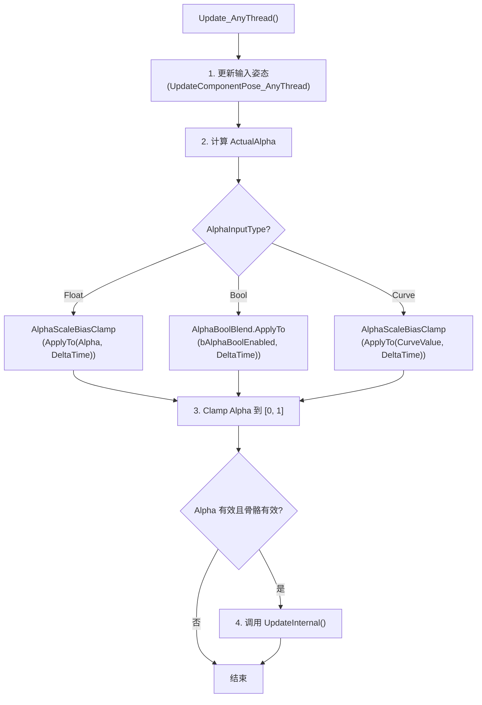
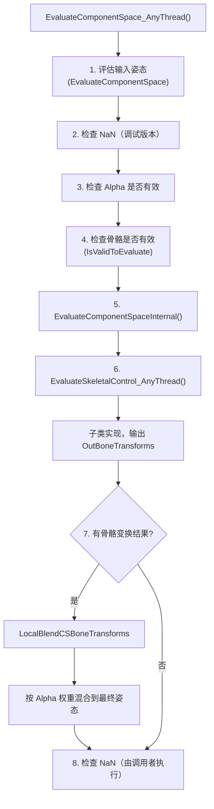
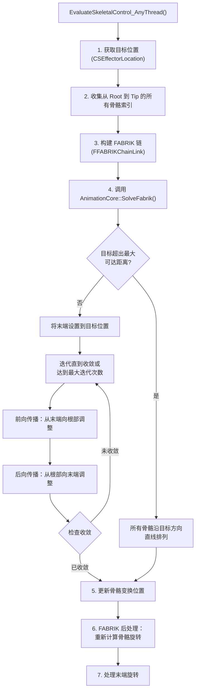
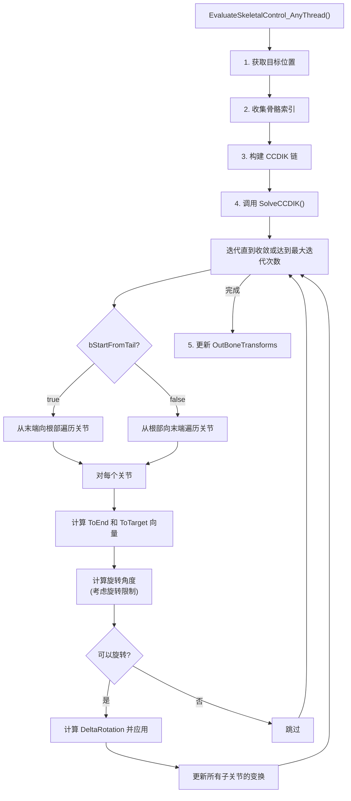
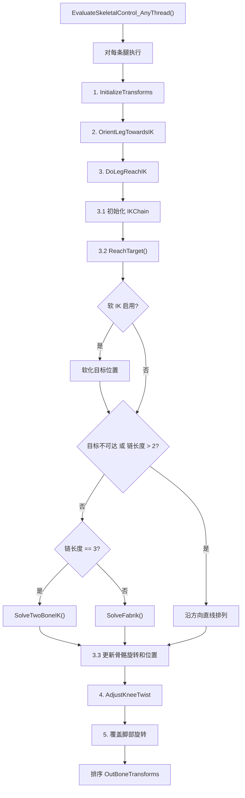
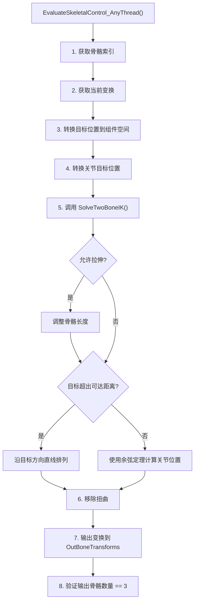
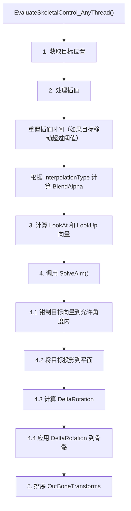
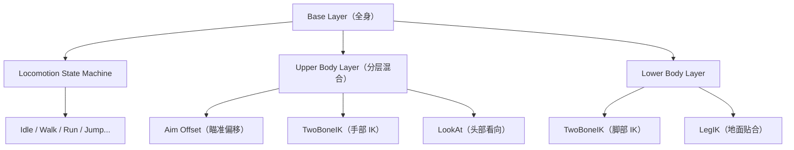

# UE5IK解算与骨骼控制深度分析

> 本文档深入分析 Unreal Engine 5 的骨骼控制基类（`FAnimNode_SkeletalControlBase`）和各类 IK 解算器（FABRIK、CCDIK、LegIK、TwoBoneIK、LookAt）。

## 文档导航

- **上一篇**：[04-UE5动画图与状态机深度分析](04-UE5动画图与状态机深度分析.md) - 动画图与状态机
- **下一篇**：[06-Lyra动画系统实现详解](06-Lyra动画系统实现详解.md) - Lyra 动画系统实现

---

## 一、FAnimNode_SkeletalControlBase 骨骼控制基类分析

### 1.1 继承关系

**源码位置**：
- `Engine/Source/Runtime/AnimGraphRuntime/Public/BoneControllers/AnimNode_SkeletalControlBase.h`
- `Engine/Source/Runtime/AnimGraphRuntime/Private/BoneControllers/AnimNode_SkeletalControlBase.cpp`



---

### 1.2 核心属性

| 属性 | 类型 | 说明 |
|------|----------|------|
| `ComponentPose` | `FComponentSpacePoseLink` | 输入链接，接收上游姿态 |
| `LODThreshold` | `int32` | LOD 阈值，控制节点在哪些 LOD 级别启用 |
| `ActualAlpha` | `float` | 实际 Alpha 值（运行时计算） |
| `AlphaInputType` | `EAnimAlphaInputType` | Alpha 输入类型（Float/Bool/Curve） |
| `bAlphaBoolEnabled` | `bool` | 当 AlphaInputType 为 Bool 时使用的布尔值 |
| `Alpha` | `float` | Alpha 值 |
| `AlphaScaleBias` | `FInputScaleBias` | Alpha 的缩放和偏移 |
| `AlphaBoolBlend` | `FInputAlphaBoolBlend` | 布尔 Alpha 的混合设置 |
| `AlphaCurveName` | `FName` | 曲线名称（当 AlphaInputType 为 Curve 时使用） |
| `AlphaScaleBiasClamp` | `FInputScaleBiasClamp` | 带钳制的缩放偏移 |

---

### 1.3 关键方法

#### 1.3.1 Initialize_AnyThread()

**源码位置**：`AnimNode_SkeletalControlBase.cpp` 第 25-34 行`

```cpp
void FAnimNode_SkeletalControlBase::Initialize_AnyThread(const FAnimationInitializeContext& Context)
{
    DECLARE_SCOPE_HIERARCHICAL_COUNTER_ANIMNODE(Initialize_AnyThread)
    FAnimNode_Base::Initialize_AnyThread(Context);

    ComponentPose.Initialize(Context);

    AlphaBoolBlend.Reinitialize();
    AlphaScaleBiasClamp.Reinitialize();
}
```

**职责**：
- 调用父类初始化
- 初始化输入姿态链接
- 重新初始化 Alpha 混合参数

---

#### 1.3.2 CacheBones_AnyThread()

**源码位置**：`AnimNode_SkeletalControlBase.cpp` 第 36-46 行`

```cpp
void FAnimNode_SkeletalControlBase::CacheBones_AnyThread(const FAnimationCacheBonesContext& Context)
{
#if WITH_EDITOR
    ClearValidationVisualWarnings();
#endif

    DECLARE_SCOPE_HIERARCHICAL_COUNTER_ANIMNODE(CacheBones_AnyThread)
    FAnimNode_Base::CacheBones_AnyThread(Context);
    InitializeBoneReferences(Context.AnimInstanceProxy->GetRequiredBones());
    ComponentPose.CacheBones(Context);
}
```

**职责**：
- 清除编辑器验证警告
- 初始化骨骼引用（`InitializeBoneReferences` - 虚函数，子类实现）
- 缓存输入姿态的骨骼

---

#### 1.3.3 Update_AnyThread()

**源码位置**：`AnimNode_SkeletalControlBase.cpp` 第 59-117 行`

**关键流程**：



**性能关键说明**（第 62-72 行注释）：
> 此函数递归调用，必须最小化栈空间使用。使用 `UE_DONT_INLINE_CALL` 防止编译器去虚拟化内联导致栈溢出。

---

#### 1.3.4 EvaluateSkeletalControl_AnyThread()

**源码位置**：`AnimNode_SkeletalControlBase.cpp` 第 143-202 行`

**骨骼控制流程**：



---

#### 1.3.5 IsValidToEvaluate()

**虚函数**，子类必须实现。用于检查当前骨骼设置是否有效。

**典型实现**（以 FABRIK 为例，`AnimNode_Fabrik.cpp` 第 203-213 行）：

```cpp
bool FAnimNode_Fabrik::IsValidToEvaluate(const USkeleton* Skeleton, const FBoneContainer& RequiredBones)
{
    return
        (
            TipBone.IsValidToEvaluate(RequiredBones)
            && RootBone.IsValidToEvaluate(RequiredBones)
            && Precision > 0
            && RequiredBones.BoneIsChildOf(TipBone.BoneIndex, RootBone.BoneIndex)
        );
}
```

---

#### 1.3.6 InitializeBoneReferences()

**虚函数**，子类实现。用于初始化骨骼引用。

**典型实现**（以 FABRIK 为例，`AnimNode_Fabrik.cpp` 第 230-236 行）：

```cpp
void FAnimNode_Fabrik::InitializeBoneReferences(const FBoneContainer& RequiredBones)
{
    DECLARE_SCOPE_HIERARCHICAL_COUNTER_ANIMNODE(InitializeBoneReferences)
    TipBone.Initialize(RequiredBones);
    RootBone.Initialize(RequiredBones);
    EffectorTarget.InitializeBoneReferences(RequiredBones);
}
```

---

## 二、FAnimNode_Fabrik (FABRIK IK) 分析

### 2.1 算法原理

**FABRIK**（Forward And Backward Reaching Inverse Kinematics）是一种启发式 IK 解算算法，通过前向传播和后向传播两个阶段迭代求解。

**核心论文**：http://www.academia.edu/9165835/FABRIK_A_fast_iterative_solver_for_the_Inverse_Kinematics_problem

**算法步骤**：

1. **前向传播（Forward Reaching）**：
   - 将末端执行器（Effector）移动到目标位置
   - 从末端向根部遍历，每个关节移动到保持骨骼长度的位置

2. **后向传播（Backward Reaching）**：
   - 将根部移回初始位置
   - 从根部向末端遍历，每个关节移动到保持骨骼长度的位置

3. **收敛判断**：
   - 重复上述两步直到末端到达目标位置（误差 < Precision）或达到最大迭代次数

---

### 2.2 核心属性

**源码位置**：`Engine/Source/Runtime/AnimGraphRuntime/Public/BoneControllers/AnimNode_Fabrik.h`

| 属性 | 类型 | 说明 |
|------|----------|------|
| `EffectorTransform` | `FTransform` | 末端执行器目标变换（位置/旋转） |
| `EffectorTarget` | `FBoneSocketTarget` | 如果 EffectorTransformSpace 是骨骼，指定目标骨骼 |
| `TipBone` | `FBoneReference` | 末端骨骼（如手部、脚部） |
| `RootBone` | `FBoneReference` | 根部骨骼（如肩部、髋部） |
| `Precision` | `float` | 收敛精度（距离阈值） |
| `MaxIterations` | `int32` | 最大迭代次数 |
| `EffectorTransformSpace` | `EBoneControlSpace` | 末端执行器变换的参考坐标系 |
| `EffectorRotationSource` | `EBoneRotationSource` | 末端旋转来源（保持局部/复制目标/保持组件空间） |
| `bEnableDebugDraw` | `bool` | 是否绘制调试信息 |

---

### 2.3 解算流程

**源码位置**：`Engine/Source/Runtime/AnimGraphRuntime/Private/BoneControllers/AnimNode_Fabrik.cpp` 第 53-201 行`



---

### 2.4 核心算法实现

**源码位置**：`Engine/Source/Runtime/AnimationCore/Private/FABRIK.cpp`

```cpp
bool SolveFabrik(TArray<FFABRIKChainLink>& InOutChain, const FVector& TargetPosition,
                double MaximumReach, double Precision, int32 MaxIterations)
{
    // 如果目标超出最大可达距离，直线排列
    if (RootToTargetDistSq > FMath::Square(MaximumReach))
    {
        for (int32 LinkIndex = 1; LinkIndex < NumChainLinks; LinkIndex++)
        {
            CurrentLink.Position = ParentLink.Position +
                (TargetPosition - ParentLink.Position).GetUnsafeNormal() * CurrentLink.Length;
        }
    }
    else // 目标在可达范围内
    {
        // 将末端设置到目标位置
        InOutChain[TipBoneLinkIndex].Position = TargetPosition;

        // 迭代求解
        while ((Stop > Precision) && (IterationCount++ < MaxIterations))
        {
            // 前向传播（从末端向根部）
            for (int32 LinkIndex = TipBoneLinkIndex - 1; LinkIndex > 0; LinkIndex--)
            {
                CurrentLink.Position = ChildLink.Position +
                    (CurrentLink.Position - ChildLink.Position).GetUnsafeNormal() * ChildLink.Length;
            }

            // 后向传播（从根部向末端）
            for (int32 LinkIndex = 1; LinkIndex < TipBoneLinkIndex; LinkIndex++)
            {
                CurrentLink.Position = ParentLink.Position +
                    (CurrentLink.Position - ParentLink.Position).GetUnsafeNormal() * CurrentLink.Length;
            }
        }
    }
}
```

---

## 三、FAnimNode_CCDIK (CCD IK) 分析

### 3.1 算法原理

**CCD**（Cyclic Coordinate Descent）是一种迭代 IK 算法，每次迭代将一个关节旋转使其更接近目标。

**算法步骤**：

1. 从末端开始（或从根部开始，取决于 `bStartFromTail`）
2. 对于每个关节：
   - 计算当前末端到目标的向量
   - 计算当前关节到末端的向量
   - 计算旋转轴和角度
   - 应用旋转
3. 重复直到收敛或达到最大迭代次数

---

### 3.2 核心属性

**源码位置**：`Engine/Source/Runtime/AnimGraphRuntime/Public/BoneControllers/AnimNode_CCDIK.h`

| 属性 | 类型 | 说明 |
|------|----------|------|
| `EffectorLocation` | `FVector` | 末端执行器目标位置 |
| `EffectorLocationSpace` | `EBoneControlSpace` | 目标位置的参考坐标系 |
| `EffectorTarget` | `FBoneSocketTarget` | 目标骨骼/插槽 |
| `TipBone` | `FBoneReference` | 末端骨骼 |
| `RootBone` | `FBoneReference` | 根部骨骼 |
| `Precision` | `float` | 收敛精度 |
| `MaxIterations` | `int32` | 最大迭代次数 |
| `bStartFromTail` | `bool` | 是否从末端开始迭代 |
| `bEnableRotationLimit` | `bool` | 是否启用旋转限制 |
| `RotationLimitPerJoints` | `TArray<float>` | 每个关节的旋转限制（度数） |

---

### 3.3 解算流程

**源码位置**：`Engine/Source/Runtime/AnimGraphRuntime/Private/BoneControllers/AnimNode_CCDIK.cpp` 第 50-151 行`



---

### 3.4 核心算法实现

**源码位置**：`Engine/Source/Runtime/AnimationCore/Private/CCDIK.cpp`

```cpp
bool SolveCCDIK(TArray<FCCDIKChainLink>& InOutChain, const FVector& TargetPosition,
               float Precision, int32 MaxIteration, bool bStartFromTail,
               bool bEnableRotationLimit, const TArray<float>& RotationLimitPerJoints)
{
    while ((Distance > Precision) && (IterationCount++ < MaxIteration))
    {
        // 遍历关节
        for (int32 LinkIndex = ...; ...; ...)
        {
            // 计算到末端和到目标的向量
            FVector ToEnd = TipPos - CurrentLinkTransform.GetLocation();
            FVector ToTarget = TargetPos - CurrentLinkTransform.GetLocation();

            // 计算旋转角度
            double Angle = FMath::Acos(FVector::DotProduct(ToEnd, ToTarget));

            // 检查旋转限制
            if (bEnableRotationLimit)
            {
                Angle = FMath::Min(Angle, RotationLimitPerJoint[LinkIndex] * (PI / 180.0));
            }

            // 计算旋转轴并应用旋转
            FVector RotationAxis = FVector::CrossProduct(ToEnd, ToTarget);
            FQuat DeltaRotation(RotationAxis, Angle);
            CurrentLinkTransform.SetRotation(DeltaRotation * CurrentLinkTransform.GetRotation());

            // 更新所有子关节
            for (int32 ChildLinkIndex = LinkIndex + 1; ...; ...)
            {
                ChildIterLink.Transform = ChildIterLink.LocalTransform * CurrentParentTransform;
            }
        }
    }
}
```

---

## 四、FAnimNode_LegIK (Leg IK) 分析

### 4.1 用途

专门用于腿部 IK，使脚部贴合地面。处理了膝关节的旋转限制和膝盖扭曲校正。

---

### 4.2 核心属性

**源码位置**：`Engine/Source/Runtime/AnimGraphRuntime/Public/BoneControllers/AnimNode_LegIK.h`

#### FAnimLegIKDefinition（每条腿的定义）

| 属性 | 类型 | 说明 |
|------|----------|------|
| `IKFootBone` | `FBoneReference` | IK 脚部骨骼 |
| `FKFootBone` | `FBoneReference` | FK 脚部骨骼（动画原始位置） |
| `NumBonesInLimb` | `int32` | 肢体中的骨骼数量 |
| `MinRotationAngle` | `float` | 最小旋转角度（防止腿部向后折叠） |
| `FootBoneForwardAxis` | `EAxis::Type` | 脚部前方向轴 |
| `HingeRotationAxis` | `EAxis::Type` | 铰链旋转轴（膝盖弯曲平面法线） |
| `bEnableRotationLimit` | `bool` | 是否启用旋转限制 |
| `bEnableKneeTwistCorrection` | `bool` | 是否启用膝盖扭曲校正 |
| `TwistOffsetCurveName` | `FName` | 扭曲偏移曲线名称 |

#### FAnimNode_LegIK

| 属性 | 类型 | 说明 |
|------|----------|------|
| `ReachPrecision` | `float` | IK 目标到达精度 |
| `MaxIterations` | `int32` | 最大迭代次数 |
| `SoftPercentLength` | `float` | 软 IK 触发长度百分比（防止膝盖弹出） |
| `SoftAlpha` | `float` | 软 IK 效果混合权重 |
| `LegsDefinition` | `TArray<FAnimLegIKDefinition>` | 腿部定义数组 |

---

### 4.3 解算流程

**源码位置**：`Engine/Source/Runtime/AnimGraphRuntime/Private/BoneControllers/AnimNode_LegIK.cpp`



---

### 4.4 TwoBoneIK 解析解

**源码位置**：`Engine/Source/Runtime/AnimationCore/Private/TwoBoneIK.cpp`

Leg IK 对两骨骼链使用解析解（余弦定理）：

```cpp
void SolveTwoBoneIK(...)
{
    // 使用余弦定理计算关节角度
    const double a = UpperLimbLength;  // 上臂/大腿长度
    const double b = DesiredLength;      // 根部到目标距离
    const double c = LowerLimbLength;  // 下臂/小腿长度

    const double CosC = (a * a + b * b - c * c) / (2 * a * b);
    const double C = FMath::Acos(CosC);  // 根部到目标连线与大腿的夹角

    // 计算膝盖位置
    const FVector NewKneeLoc = RootPos + a * (HipToFootDir * CosC + BendDir * FMath::Sin(C));
}
```

---

## 五、FAnimNode_TwoBoneIK (Two Bone IK) 分析

### 5.1 用途

专门用于两骨骼 IK（如手臂、腿部），使用解析解（余弦定理）而非迭代解，性能更好。

---

### 5.2 核心属性

**源码位置**：`Engine/Source/Runtime/AnimGraphRuntime/Public/BoneControllers/AnimNode_TwoBoneIK.h`

| 属性 | 类型 | 说明 |
|------|----------|------|
| `IKBone` | `FBoneReference` | 要控制的末端骨骼（如手部、脚部） |
| `EffectorLocation` | `FVector` | 末端执行器目标位置 |
| `EffectorTarget` | `FBoneSocketTarget` | 目标骨骼/插槽 |
| `JointTargetLocation` | `FVector` | 关节目标位置（定义膝盖/肘部方向） |
| `JointTarget` | `FBoneSocketTarget` | 关节目标骨骼/插槽 |
| `EffectorLocationSpace` | `EBoneControlSpace` | 目标位置坐标系 |
| `JointTargetLocationSpace` | `EBoneControlSpace` | 关节目标坐标系 |
| `StartStretchRatio` | `double` | 开始拉伸的比例（0.9 = 90% 长度时开始拉伸） |
| `MaxStretchScale` | `double` | 最大拉伸比例（1.2 = 120% 长度） |
| `bAllowStretching` | `uint8` | 是否允许拉伸 |
| `bTakeRotationFromEffectorSpace` | `uint8` | 是否使用末端执行器旋转 |
| `bMaintainEffectorRelRot` | `uint8` | 是否保持末端相对旋转 |
| `bAllowTwist` | `uint8` | 是否允许扭曲 |

---

### 5.3 解算流程

**源码位置**：`Engine/Source/Runtime/AnimGraphRuntime/Private/BoneControllers/AnimNode_TwoBoneIK.cpp` 第 75-197 行`



---

## 六、FAnimNode_LookAt (Look At) 分析

### 6.1 用途

使骨骼看向目标点。常用于头部、眼睛、脊椎等需要朝向目标的骨骼。

---

### 6.2 核心属性

**源码位置**：`Engine/Source/Runtime/AnimGraphRuntime/Public/BoneControllers/AnimNode_LookAt.h`

| 属性 | 类型 | 说明 |
|------|----------|------|
| `BoneToModify` | `FBoneReference` | 要修改的骨骼 |
| `LookAtTarget` | `FBoneSocketTarget` | 看向的目标骨骼/插槽 |
| `LookAtLocation` | `FVector` | 看向的目标位置（偏移量） |
| `LookAt_Axis` | `FAxis` | 看向轴（局部空间） |
| `bUseLookUpAxis` | `bool` | 是否使用向上轴 |
| `LookUp_Axis` | `FAxis` | 向上轴（局部空间） |
| `LookAtClamp` | `float` | 看向钳制角度（度数） |
| `InterpolationTime` | `float` | 插值时间 |
| `InterpolationType` | `EInterpolationBlend::Type` | 插值类型（线性、三次、正弦等） |
| `InterpolationTriggerThreashold` | `float` | 触发插值的阈值距离 |

---

### 6.3 解算流程

**源码位置**：`Engine/Source/Runtime/AnimGraphRuntime/Private/BoneControllers/AnimNode_LookAt.cpp` 第 82-160 行`



---

### 6.4 SolveAim 核心算法

**源码位置**：`Engine/Source/Runtime/AnimationCore/Private/AnimationCoreLibrary.cpp` 第 98-136 行`

```cpp
FQuat SolveAim(const FTransform& CurrentTransform, const FVector& TargetPosition,
              const FVector& AimVector, bool bUseUpVector,
              const FVector& UpVector, float AimClampInDegree)
{
    FVector ToTarget = TargetPosition - NewTransform.GetLocation();
    ToTarget.Normalize();

    // 钳制看向角度
    if (AimClampInDegree > ZERO_ANIMWEIGHT_THRESH)
    {
        double DiffAngle = FMath::Acos(FVector::DotProduct(AimVector, ToTarget));
        if (DiffAngle > AimClampInRadians)
        {
            // 钳制 DeltaTarget
            ToTarget = AimVector + DeltaTarget * (AimClampInRadians / DiffAngle);
            ToTarget.Normalize();
        }
    }

    // 使用向上向量
    if (bUseUpVector)
    {
        ToTarget = FVector::VectorPlaneProject(ToTarget, UpVector);
        ToTarget.Normalize();
    }

    // 计算 Delta Rotation
    return FQuat::FindBetweenNormals(AimVector, ToTarget);
}
```

---

## 七、Lyra 项目中的应用场景（推断）

虽然无法直接访问 Lyra 的蓝图资源文件（.uasset 需要特殊解析），但基于 Lyra 的架构特点，可以推断其骨骼控制使用方式：

### 7.1 手部 IK（持枪、攀爬）

**可能使用的节点**：`FAnimNode_TwoBoneIK` 或 `FAnimNode_Fabrik`

**应用场景**：
- **持枪 IK**：左手握住枪托，右手握住枪柄
- **攀爬 IK**：手部抓住攀爬点

**Lyra 可能实现方式**：
- 在动画蓝图中使用 `FAnimNode_TwoBoneIK` 节点
- 通过 `EffectorLocation` 和 `JointTarget` 控制手部和肘部位置
- 使用曲线控制 IK 权重（如 `IKWeight` 曲线）

---

### 7.2 脚部 IK（地面适配）

**可能使用的节点**：`FAnimNode_LegIK`

**应用场景**：
- **地面贴合**：脚部落地点贴合不平坦地面
- **楼梯行走**：脚部根据楼梯高度调整

**Lyra 可能实现方式**：
- 使用 `FAnimNode_LegIK` 节点
- 通过射线检测获取地面位置
- 设置 `IKFootBone` 和 `FKFootBone`
- 使用 `SoftPercentLength` 和 `SoftAlpha` 防止膝盖弹出

---

### 7.3 Look At（角色看向目标方向）

**可能使用的节点**：`FAnimNode_LookAt`

**应用场景**：
- **Aiming**：射击时头部看向瞄准方向
- **对话**：与其他角色交谈时看向对方

**Lyra 可能实现方式**：
- 使用 `FAnimNode_LookAt` 节点
- 设置 `BoneToModify` 为头部骨骼
- 使用 `LookAtTarget` 或 `LookAtLocation` 指定目标
- 使用 `InterpolationTime` 平滑过渡

---

### 7.4 可能的 AnimGraph 结构



---

## 八、性能优化技巧

### 8.1 LOD 优化

**方法**：使用 `LODThreshold` 属性`

```cpp
// 在较高 LOD 时禁用 IK
UPROPERTY(EditAnywhere, Category = Performance)
int32 LODThreshold = 2;  // 仅当 LOD <= 2 时启用节点
```

**效果**：
- LOD 0-2：启用完整 IK
- LOD 3+：禁用 IK 以提高性能

---

### 8.2 Alpha 优化

**方法**：使用 `Alpha` 控制 IK 权重`

```cpp
// 当不需要 IK 时，设置 Alpha = 0
// 节点会跳过 EvaluateSkeletalControl_AnyThread()
if (FAnimWeight::IsRelevant(ActualAlpha))  // 检查 Alpha 是否有效
{
    // 执行 IK
}
```

---

### 8.3 最大迭代次数优化

**方法**：根据需求调整 `MaxIterations`

```cpp
// FABRIK / CCDIK
MaxIterations = 10;  // 默认值
// 优化：减少到 5 次迭代（如果精度足够）
MaxIterations = 5;
```

**效果**：
- 减少迭代次数 → 减少计算量
- 代价：可能降低 IK 精度

---

### 8.4 使用解析解而非迭代解

**方法**：对于两骨骼链，使用 `FAnimNode_TwoBoneIK`（解析解）而非 `FAnimNode_Fabrik`（迭代解）

**效果**：
- 解析解：O(1) 时间复杂度
- 迭代解：O(n) 时间复杂度（n = 迭代次数）

---

### 8.5 缓存骨骼索引

**方法**：在 `InitializeBoneReferences()` 中缓存骨骼索引`

```cpp
virtual void InitializeBoneReferences(const FBoneContainer& RequiredBones) override
{
    TipBone.Initialize(RequiredBones);  // 缓存骨骼索引
    RootBone.Initialize(RequiredBones);
}
```

**效果**：
- 避免在每帧更新时重复查找骨骼索引
- 使用 `FCompactPoseBoneIndex` 直接访问骨骼变换`

---

### 8.6 避免动态内存分配

**方法**：使用栈分配的数组`

```cpp
// FAnimNode_SkeletalControlBase 使用成员变量重用数组
private:
    TArray<FBoneTransform> BoneTransforms;  // 重用此数组，避免每帧分配
```

**效果**：
- 减少堆分配和垃圾回收压力
- 提高缓存友好性`

---

### 8.7 多线程优化

**方法**：确保节点支持多线程执行`

```cpp
// FAnimNode_Base 的 Update_AnyThread() 和 Evaluate_AnyThread()
// 可以安全运行在工作线程上`
virtual void Update_AnyThread(const FAnimationUpdateContext& Context) override
{
    // 不要访问 UObject 或游戏线程数据
    // 只访问 FAnimInstanceProxy 的缓存数据
}
```

**效果**：
- 利用多核 CPU 并行更新多个动画实例
- 提高整体性能`

---

### 8.8 Soft IK（防止膝盖弹出）

**方法**：使用 `FAnimNode_LegIK` 的 `SoftPercentLength` 和 `SoftAlpha`

```cpp
SoftPercentLength = 0.97f;  // 当腿部伸展到 97% 时开始软化
SoftAlpha = 1.0f;  // 软化强度
```

**效果**：
- 在腿部接近完全伸展时软化 IK 目标
- 防止膝盖突然弹出（popping）

---

## 九、总结`

### 9.1 关键点回顾`

1. **FAnimNode_SkeletalControlBase** 是所有骨骼控制节点的基类，提供了统一的 Alpha 混合和骨骼变换接口。

2. **FABRIK IK** 适用于多骨骼链（>3 个骨骼），通过前向和后向传播迭代求解。

3. **CCD IK** 通过逐个旋转关节迭代求解，支持旋转限制。

4. **Two Bone IK** 使用余弦定理解析求解，性能最优，适用于手臂和腿部。

5. **Leg IK** 是专门用于腿部的 IK，结合了 Two Bone IK 和 FABRIK，支持软 IK 和膝盖扭曲校正。

6. **Look At** 使骨骼看向目标点，支持插值和平滑过渡。

---

### 9.2 选择合适的 IK 解算器`

| 场景 | 推荐 IK | 原因 |
|------|----------|------|
| 手臂 IK（持枪、交互） | Two Bone IK | 解析解，性能好 |
| 腿部 IK（地面贴合） | Leg IK | 专门优化，支持软 IK |
| 尾巴、脊椎（多骨骼） | FABRIK IK | 支持任意长度骨骼链 |
| 需要旋转限制 | CCD IK | 支持逐关节旋转限制 |
| 头部/眼睛看向 | Look At | 专门用于朝向控制 |

---

### 9.3 性能优化检查清单`

- [ ] 使用 LODThreshold 在远距离禁用 IK
- [ ] 使用 Alpha 控制 IK 权重，不需要时设为 0
- [ ] 对于两骨骼链，优先使用 Two Bone IK（解析解）
- [ ] 减少 MaxIterations（如果精度足够）
- [ ] 在 InitializeBoneReferences() 中缓存骨骼索引
- [ ] 避免每帧动态内存分配
- [ ] 确保节点支持多线程执行
- [ ] 使用 Soft IK 防止膝盖弹出`

---

## 十、关键源码文件索引`

| 文件 | 绝对路径 | 说明 |
|------|----------|------|
| `AnimNode_SkeletalControlBase.h` | `Engine/Source/Runtime/AnimGraphRuntime/Public/BoneControllers/AnimNode_SkeletalControlBase.h` | 骨骼控制基类定义 |
| `AnimNode_SkeletalControlBase.cpp` | `Engine/Source/Runtime/AnimGraphRuntime/Private/BoneControllers/AnimNode_SkeletalControlBase.cpp` | 骨骼控制基类实现 |
| `AnimNode_Fabrik.h` | `Engine/Source/Runtime/AnimGraphRuntime/Public/BoneControllers/AnimNode_Fabrik.h` | FABRIK IK 定义 |
| `AnimNode_Fabrik.cpp` | `Engine/Source/Runtime/AnimGraphRuntime/Private/BoneControllers/AnimNode_Fabrik.cpp` | FABRIK IK 实现 |
| `FABRIK.cpp` (核心算法) | `Engine/Source/Runtime/AnimationCore/Private/FABRIK.cpp` | FABRIK 算法实现 |
| `AnimNode_CCDIK.h` | `Engine/Source/Runtime/AnimGraphRuntime/Public/BoneControllers/AnimNode_CCDIK.h` | CCD IK 定义 |
| `AnimNode_CCDIK.cpp` | `Engine/Source/Runtime/AnimGraphRuntime/Private/BoneControllers/AnimNode_CCDIK.cpp` | CCD IK 实现 |
| `CCDIK.cpp` (核心算法) | `Engine/Source/Runtime/AnimationCore/Private/CCDIK.cpp` | CCD IK 算法实现 |
| `AnimNode_LegIK.h` | `Engine/Source/Runtime/AnimGraphRuntime/Public/BoneControllers/AnimNode_LegIK.h` | Leg IK 定义 |
| `AnimNode_LegIK.cpp` | `Engine/Source/Runtime/AnimGraphRuntime/Private/BoneControllers/AnimNode_LegIK.cpp` | Leg IK 实现 |
| `AnimNode_TwoBoneIK.h` | `Engine/Source/Runtime/AnimGraphRuntime/Public/BoneControllers/AnimNode_TwoBoneIK.h` | Two Bone IK 定义 |
| `AnimNode_TwoBoneIK.cpp` | `Engine/Source/Runtime/AnimGraphRuntime/Private/BoneControllers/AnimNode_TwoBoneIK.cpp` | Two Bone IK 实现 |
| `TwoBoneIK.cpp` (核心算法) | `Engine/Source/Runtime/AnimationCore/Private/TwoBoneIK.cpp` | Two Bone IK 算法实现 |
| `AnimNode_LookAt.h` | `Engine/Source/Runtime/AnimGraphRuntime/Public/BoneControllers/AnimNode_LookAt.h` | Look At 定义 |
| `AnimNode_LookAt.cpp` | `Engine/Source/Runtime/AnimGraphRuntime/Private/BoneControllers/AnimNode_LookAt.cpp` | Look At 实现 |
| `AnimationCoreLibrary.cpp` (SolveAim) | `Engine/Source/Runtime/AnimationCore/Private/AnimationCoreLibrary.cpp` | SolveAim 算法实现 |

---

## 十一、参考资料`

1. [Unreal Engine 5 官方文档 - IK 解算器](https://docs.unrealengine.com/5.0/en-US/ik-solvers-in-unreal-engine/)
2. [Unreal Engine 5 官方文档 - 骨骼控制器](https://docs.unrealengine.com/5.0/en-US/skeletal-controllers-in-unreal-engine/)
3. [Unreal Engine 5 源码 - AnimNode_SkeletalControlBase.h](https://github.com/EpicGames/UnrealEngine/blob/5.0/Engine/Source/Runtime/AnimGraphRuntime/Public/BoneControllers/AnimNode_SkeletalControlBase.h)
4. [Unreal Engine 5 源码 - AnimNode_Fabrik.h](https://github.com/EpicGames/UnrealEngine/blob/5.0/Engine/Source/Runtime/AnimGraphRuntime/Public/BoneControllers/AnimNode_Fabrik.h)
5. [Unreal Engine 5 源码 - AnimNode_CCDIK.h](https://github.com/EpicGames/UnrealEngine/blob/5.0/Engine/Source/Runtime/AnimGraphRuntime/Public/BoneControllers/AnimNode_CCDIK.h)
6. [FABRIK 算法论文](http://www.academia.edu/9165835/FABRIK_A_fast_iterative_solver_for_the_Inverse_Kinematics_problem)

---

> **最后更新**：2026-05-16
> **状态**：current
> **维护者**：AI Agent (project-wiki skill)

<!-- nav:auto -->

---

**导航**: ← [[30-tutorials/animation/04-UE5动画图与状态机深度分析|04-UE5动画图与状态机深度分析]] · [[30-tutorials/animation/06-Lyra动画系统实现详解|06-Lyra动画系统实现详解]] →

<!-- /nav:auto -->
