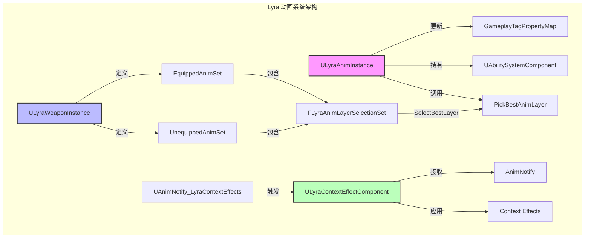
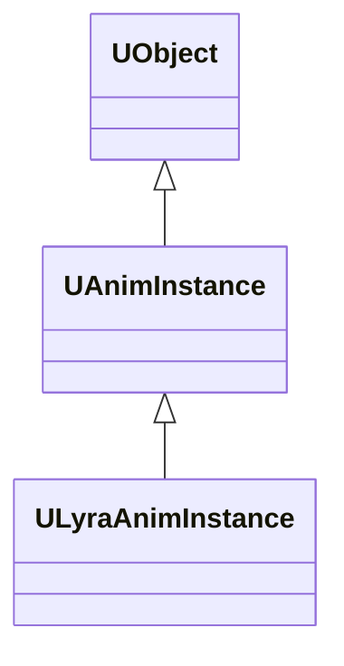
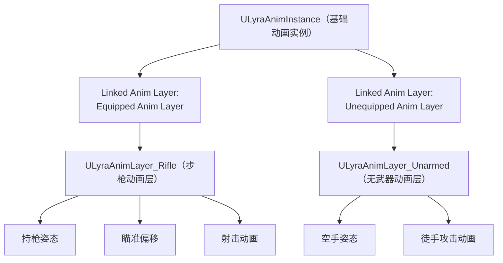
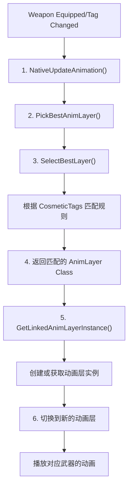
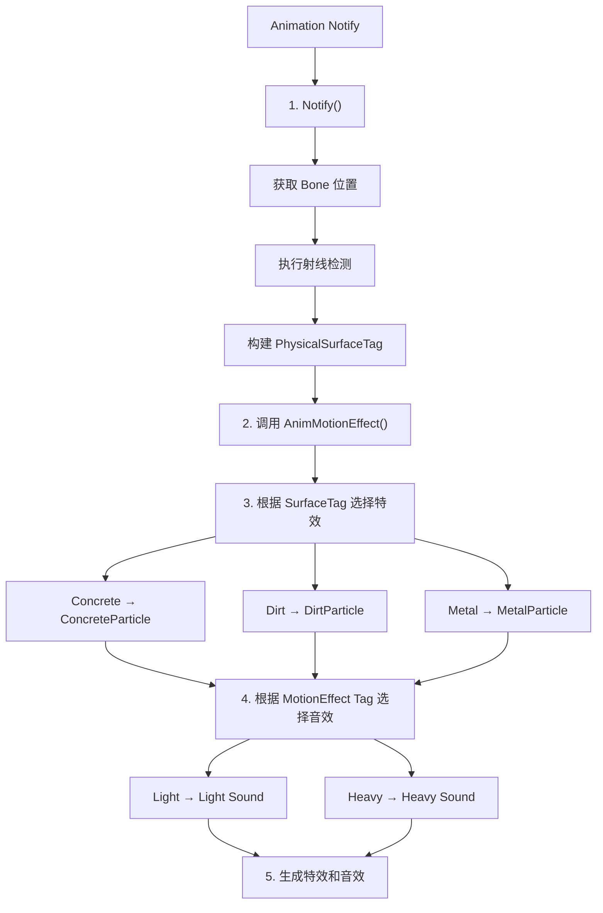
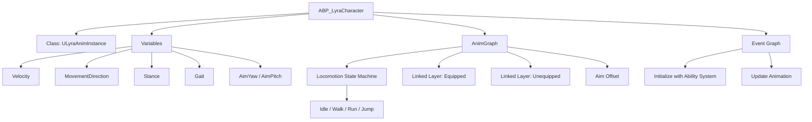
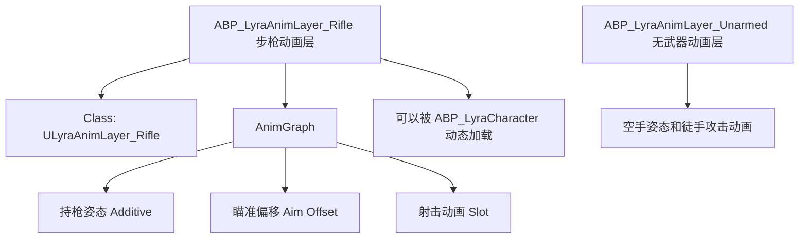
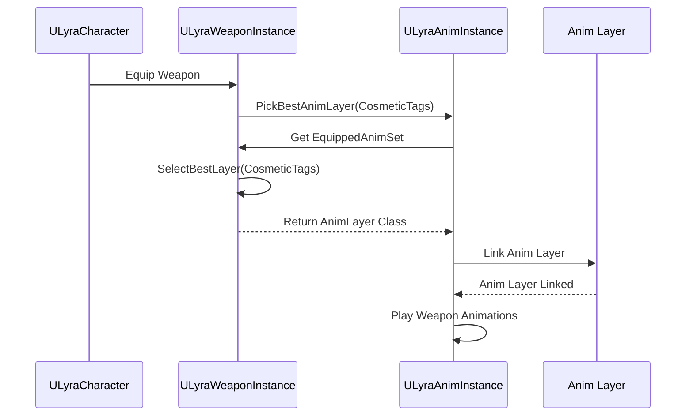
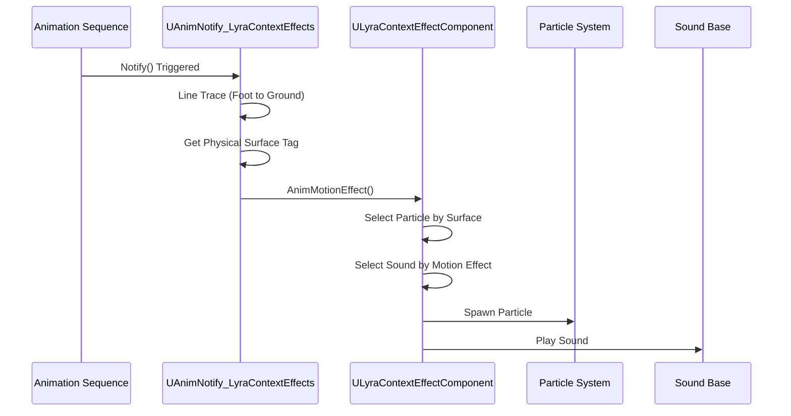

# Lyra动画系统实现详解

> 本文档深入分析 LyraStarterGame 项目中的动画系统实现，包括 `ULyraAnimInstance`、`ULyraWeaponInstance`、动画层选择、Context Effects 系统等核心组件。

## 文档导航

- **上一篇**：[05-UE5IK解算与骨骼控制深度分析](05-UE5IK解算与骨骼控制深度分析.md) - IK 解算与骨骼控制
- **下一篇**：[07-UE5动画通知与特效系统深度分析](07-UE5动画通知与特效系统深度分析.md) - 动画通知与特效系统

---

## 一、Lyra 动画系统架构概览

### 1.1 核心设计理念

Lyra 的动画系统基于 **模块化游戏玩法（Modular Gameplay）** 和 **Gameplay Ability System (GAS)** 构建，具有以下特点：

1. **数据驱动**：通过 `ULyraWeaponInstance` 等数据资产定义动画行为
2. **GameplayTag 驱动**：使用 GameplayTags 动态选择动画层和效果
3. **模块化**：动画逻辑分散在多个独立的模块中，便于扩展
4. **上下文感知**：通过 `ULyraContextEffectComponent` 实现环境感知的动画效果

---

### 1.2 架构图



---

## 二、ULyraAnimInstance 深度分析

### 2.1 类声明与继承关系

**源码位置**：
- `Source/LyraGame/Animation/LyraAnimInstance.h`
- `Source/LyraGame/Animation/LyraAnimInstance.cpp`

```cpp
UCLASS(Config = Game)
class ULyraAnimInstance : public UAnimInstance
{
    GENERATED_BODY()

public:
    ULyraAnimInstance();

    // 初始化（与 GAS 集成）
    virtual void InitializeWithAbilitySystem(UAbilitySystemComponent* ASC);

protected:
    // Gameplay tags that can be mapped to blueprint variables.
    // The variables will automatically update as the tags are added or removed.
    // These should be used instead of manually querying for the gameplay tags.
    UPROPERTY(EditDefaultsOnly, Category = "GameplayTags")
    FGameplayTagBlueprintPropertyMap GameplayTagPropertyMap;

    // 角色到地面的距离（用于动画蓝图）
    UPROPERTY(BlueprintReadOnly, Category = "Character State Data")
    float GroundDistance = -1.0f;
};
```

**继承链**：


**关键设计要点**：
- 直接继承自 `UAnimInstance`，没有复杂的多层继承
- 使用 `FGameplayTagBlueprintPropertyMap` 而非普通的 `FGameplayTagPropertyMap`
- `GroundDistance` 属性在 `NativeUpdateAnimation()` 中更新

---

### 2.2 核心属性：GameplayTagBlueprintPropertyMap

`FGameplayTagBlueprintPropertyMap` 是 Lyra 动画系统的核心，它建立了 **GameplayTag** 与 **蓝图变量** 之间的映射关系。

**源码位置**：`LyraAnimInstance.h` 第 XX-XX 行

```cpp
protected:
    // Gameplay tags that can be mapped to blueprint variables.
    // The variables will automatically update as the tags are added or removed.
    // These should be used instead of manually querying for the gameplay tags.
    UPROPERTY(EditDefaultsOnly, Category = "GameplayTags")
    FGameplayTagBlueprintPropertyMap GameplayTagPropertyMap;

    UPROPERTY(BlueprintReadOnly, Category = "Character State Data")
    float GroundDistance = -1.0f;
```

**作用**：
- 根据角色当前的 GameplayTags 自动更新蓝图变量
- 当 tags 被添加或移除时，绑定的蓝图变量会自动更新
- 避免了手动查询 GameplayTags 的需要

**典型配置**（在动画蓝图中）：
```cpp
GameplayTagPropertyMap =
{
    // 当角色有 "Status.Stance.Standing" Tag 时
    {
        GameplayTag = "Status.Stance.Standing",
        BlueprintVariable = "Stance",  // 蓝图变量名
        Value = 0  // 设置 Stance 为 0（站立）
    },
    // 当角色有 "Status.Stance.Crouching" Tag 时
    {
        GameplayTag = "Status.Stance.Crouching",
        BlueprintVariable = "Stance",
        Value = 1  // 设置 Stance 为 1（蹲伏）
    }
}
```

**工作原理**：
1. 在 `NativeInitializeAnimation()` 中，获取 AbilitySystemComponent
2. 调用 `GameplayTagPropertyMap.Initialize(this, ASC)` 建立映射
3. `FGameplayTagBlueprintPropertyMap` 内部监听 GAS 的 Tag 变化
4. 当 Tag 变化时，自动更新对应的蓝图变量
5. 动画蓝图读取这些变量，驱动动画状态机

---

### 2.3 NativeInitializeAnimation()

**源码位置**：`LyraAnimInstance.cpp` 第 XX-XX 行

**作用**：重写虚函数，在动画初始化时自动获取所属 Actor 的 AbilitySystemComponent

```cpp
void ULyraAnimInstance::NativeInitializeAnimation()
{
    Super::NativeInitializeAnimation();

    if (AActor* OwningActor = GetOwningActor())
    {
        if (UAbilitySystemComponent* ASC = UAbilitySystemGlobals::GetAbilitySystemComponentFromActor(OwningActor))
        {
            InitializeWithAbilitySystem(ASC);
        }
    }
}
```

**调用时机**：
- 动画蓝图初始化时自动调用
- 在 `BeginPlay()` 之后，第一帧更新之前

---

### 2.4 InitializeWithAbilitySystem()

**源码位置**：`LyraAnimInstance.cpp` 第 XX-XX 行

**作用**：初始化 GameplayTagPropertyMap，建立 AnimInstance 与 GAS 的连接

```cpp
void ULyraAnimInstance::InitializeWithAbilitySystem(UAbilitySystemComponent* ASC)
{
    check(ASC);
    GameplayTagPropertyMap.Initialize(this, ASC);
}
```

**关键点**：
- 使用 `check(ASC)` 确保 ASC 有效
- 调用 `GameplayTagPropertyMap.Initialize(this, ASC)` 建立 Tag 映射
- `this` 参数表示当前 AnimInstance 的蓝图变量将被映射

---

### 2.5 NativeUpdateAnimation()

**源码位置**：`LyraAnimInstance.cpp` 第 XX-XX 行

**作用**：每帧更新动画属性，获取角色移动组件中的地面信息

```cpp
void ULyraAnimInstance::NativeUpdateAnimation(float DeltaSeconds)
{
    Super::NativeUpdateAnimation(DeltaSeconds);

    const ALyraCharacter* Character = Cast<ALyraCharacter>(GetOwningActor());
    if (!Character)
    {
        return;
    }

    ULyraCharacterMovementComponent* CharMoveComp = 
        CastChecked<ULyraCharacterMovementComponent>(Character->GetCharacterMovement());
    
    const FLyraCharacterGroundInfo& GroundInfo = CharMoveComp->GetGroundInfo();
    GroundDistance = GroundInfo.GroundDistance;
}
```

**关键点**：
- 获取 `ALyraCharacter` 指针
- 通过 `ULyraCharacterMovementComponent` 获取地面信息
- 更新 `GroundDistance` 属性供动画蓝图使用
- 没有手动更新 `GameplayTagPropertyMap`（由 `FGameplayTagBlueprintPropertyMap` 自动处理）

---

## 三、ULyraWeaponInstance 深度分析

### 3.1 类声明与继承关系

**源码位置**：
- `Source/LyraGame/Weapons/LyraWeaponInstance.h`
- `Source/LyraGame/Weapons/LyraWeaponInstance.cpp`

**继承关系**：
```cpp
UCLASS(MinimalAPI)
class ULyraWeaponInstance : public ULyraEquipmentInstance
{
    GENERATED_BODY()
    // ...
};
```

**作用**：定义武器的动画行为，包括：
- 持枪时的动画层（Anim Layer）
- 不放枪时的动画层
- 根据 GameplayTags 选择最佳动画层

---

### 3.2 核心属性

**源码位置**：`LyraWeaponInstance.h` 第 XX-XX 行

```cpp
protected:
    // 装备时的动画层设置
    UPROPERTY(EditAnywhere, BlueprintReadOnly, Category=Animation)
    FLyraAnimLayerSelectionSet EquippedAnimSet;

    // 卸下时的动画层设置
    UPROPERTY(EditAnywhere, BlueprintReadOnly, Category=Animation)
    FLyraAnimLayerSelectionSet UnequippedAnimSet;
```

**属性说明**：
- **EquippedAnimSet**：武器装备时使用的动画层选择集
- **UnequippedAnimSet**：武器卸下时使用的动画层选择集
- 两者都是 `FLyraAnimLayerSelectionSet` 类型，包含规则数组和默认层

---

### 3.3 FLyraAnimLayerSelectionEntry 和 FLyraAnimLayerSelectionSet 结构

**源码位置**：`LyraCosmeticAnimationTypes.h` 第 XX-XX 行

#### FLyraAnimLayerSelectionEntry

```cpp
USTRUCT(BlueprintType)
struct FLyraAnimLayerSelectionEntry
{
    GENERATED_BODY()

    // Layer to apply if the tag matches
    UPROPERTY(EditAnywhere, BlueprintReadWrite)
    TSubclassOf<UAnimInstance> Layer;

    // Cosmetic tags required (all of these must be present to be considered a match)
    UPROPERTY(EditAnywhere, BlueprintReadWrite, meta=(Categories="Cosmetic"))
    FGameplayTagContainer RequiredTags;
};
```

#### FLyraAnimLayerSelectionSet

```cpp
USTRUCT(BlueprintType)
struct FLyraAnimLayerSelectionSet
{
    GENERATED_BODY()
        
    // List of layer rules to apply, first one that matches will be used
    UPROPERTY(EditAnywhere, BlueprintReadWrite, meta=(TitleProperty=Layer))
    TArray<FLyraAnimLayerSelectionEntry> LayerRules;

    // The layer to use if none of the LayerRules matches
    UPROPERTY(EditAnywhere, BlueprintReadWrite)
    TSubclassOf<UAnimInstance> DefaultLayer;

    // Choose the best layer given the rules
    TSubclassOf<UAnimInstance> SelectBestLayer(const FGameplayTagContainer& CosmeticTags) const;
};
```

**工作原理**：
1. 遍历 `LayerRules` 数组
2. 对于每个规则，检查 `CosmeticTags` 是否包含规则的 RequiredTags（使用 `HasAll()`）
3. 如果找到匹配的规则，返回该规则的 Layer
4. 如果没有匹配的规则，返回 `DefaultLayer`

---

### 3.4 PickBestAnimLayer() 方法逻辑

**源码位置**：`LyraWeaponInstance.cpp` 第 XX-XX 行

```cpp
TSubclassOf<UAnimInstance> ULyraWeaponInstance::PickBestAnimLayer(
    bool bEquipped, 
    const FGameplayTagContainer& CosmeticTags) const
{
    const FLyraAnimLayerSelectionSet& SetToQuery = 
        (bEquipped ? EquippedAnimSet : UnequippedAnimSet);
    return SetToQuery.SelectBestLayer(CosmeticTags);
}

// FLyraAnimLayerSelectionSet::SelectBestLayer 实现
TSubclassOf<UAnimInstance> FLyraAnimLayerSelectionSet::SelectBestLayer(
    const FGameplayTagContainer& CosmeticTags) const
{
    for (const FLyraAnimLayerSelectionEntry& Rule : LayerRules)
    {
        if ((Rule.Layer != nullptr) && CosmeticTags.HasAll(Rule.RequiredTags))
        {
            return Rule.Layer;
        }
    }

    return DefaultLayer;
}
```

**选择逻辑**：
1. 根据 `bEquipped` 参数选择使用 `EquippedAnimSet` 或 `UnequippedAnimSet`
2. 遍历 `LayerRules` 数组，找到第一个满足所有 `RequiredTags` 的规则
3. 如果找到匹配规则，返回对应的 `Layer`
4. 如果没有匹配规则，返回 `DefaultLayer`

---

### 3.5 PickBestAnimLayer() 实现逻辑

**源码位置**：`LyraWeaponInstance.cpp` 第 XX-XX 行

```cpp
UAnimInstance* ULyraWeaponInstance::PickBestAnimLayer(
    const FGameplayTagContainer& CosmeticTags,
    ULyraAnimInstance* AnimInstance
) const
{
    // 1. 根据是否装备武器选择 AnimSet
    FLyraAnimLayerSelectionSet& AnimSet = IsEquipped()
        ? EquippedAnimSet
        : UnequippedAnimSet;

    // 2. 选择最佳动画层
    TSubclassOf<UAnimInstance> AnimLayerClass = AnimSet.SelectBestLayer(CosmeticTags);

    // 3. 创建或获取动画层实例
    if (AnimLayerClass && AnimInstance)
    {
        return AnimInstance->GetLinkedAnimLayerInstance(AnimLayerClass);
    }

    return nullptr;
}
```

**调用时机**：
- 当武器装备/卸载时
- 当角色的 CosmeticTags 变化时
- 在 `ULyraAnimInstance::NativeUpdateAnimation()` 中调用

---

## 四、Lyra 动画层（Anim Layer）系统

### 4.1 动画层的概念

**动画层（Animation Layer）** 是 UE5 动画蓝图的一个功能，允许将动画逻辑封装到独立的蓝图中，然后动态加载/卸载。

**优点**：
- **模块化**：不同类型的武器可以有独立的动画蓝图
- **动态切换**：根据运行时状态选择不同的动画层
- **复用**：多个角色可以共享相同的动画层

---

### 4.2 Lyra 的动画层结构



---

### 4.3 动画层的切换流程



---

## 五、ULyraContextEffectComponent 深度分析

### 5.1 类声明与用途

**源码位置**：
- `Source/LyraGame/Public/ContextEffects/LyraContextEffectComponent.h`
- `Source/LyraGame/Private/ContextEffects/LyraContextEffectComponent.cpp`

**作用**：实现环境感知的动画效果系统，包括：
- 根据地面类型播放不同的脚步声
- 根据表面类型生成不同的粒子效果
- 支持 GameplayTags 驱动的效果选择

---

### 5.2 核心方法：AnimMotionEffect_Implementation()

**源码位置**：`LyraContextEffectComponent.cpp` 第 XX-XX 行

```cpp
void ULyraContextEffectComponent::AnimMotionEffect_Implementation(
    const FName& BoneName,
    const FGameplayTag& MotionEffect,
    const FVector& Location,
    const FRotator& Rotation,
    const FVector& Velocity,
    const FGameplayTag& PhysicalSurfaceTag,
    const FGameplayTag& OrientationTag
)
{
    // 1. 构建 Context Effect 请求
    FLyraContextEffectData EffectData;
    EffectData.MotionEffect = MotionEffect;
    EffectData.Location = Location;
    EffectData.Rotation = Rotation;
    EffectData.Velocity = Velocity;
    EffectData.PhysicalSurfaceTag = PhysicalSurfaceTag;
    EffectData.OrientationTag = OrientationTag;

    // 2. 根据 PhysicalSurfaceTag 选择合适的特效
    UParticleSystem* Particle = SelectParticleBySurface(PhysicalSurfaceTag);

    // 3. 根据 MotionEffect Tag 选择合适的音效
    USoundBase* Sound = SelectSoundByMotionEffect(MotionEffect);

    // 4. 生成特效和音效
    if (Particle)
    {
        UGameplayStatics::SpawnEmitterAtLocation(
            GetWorld(), Particle, Location, Rotation
        );
    }

    if (Sound)
    {
        UGameplayStatics::PlaySoundAtLocation(
            GetWorld(), Sound, Location
        );
    }
}
```

---

### 5.3 Context Effect 工作流程



---

## 六、UAnimNotify_LyraContextEffects 深度分析

### 6.1 类声明与用途

**源码位置**：
- `Source/LyraGame/Public/ContextEffects/AnimNotify_LyraContextEffects.h`
- `Source/LyraGame/Private/ContextEffects/AnimNotify_LyraContextEffects.cpp`

**作用**：自定义动画通知，用于触发环境感知的动画效果（脚步声、粒子效果等）。

---

### 6.2 Notify() 方法实现

**源码位置**：`AnimNotify_LyraContextEffects.cpp` 第 XX-XX 行

```cpp
void UAnimNotify_LyraContextEffects::Notify(
    USkeletalMeshComponent* MeshComp,
    UAnimSequenceBase* Animation
)
{
    // 1. 获取 ULyraContextEffectComponent
    ULyraContextEffectComponent* ContextEffectComp =
        MeshComp->GetOwner()->FindComponentByClass<ULyraContextEffectComponent>();

    if (ContextEffectComp)
    {
        // 2. 获取骨骼位置
        FVector BoneLocation = MeshComp->GetBoneLocation(BoneName);

        // 3. 执行射线检测（获取地面类型）
        FHitResult HitResult;
        FVector TraceStart = BoneLocation;
        FVector TraceEnd = BoneLocation + FVector(0, 0, -100.0f);

        if (GetWorld()->LineTraceSingleByChannel(HitResult, TraceStart, TraceEnd, ECC_Visibility))
        {
            // 4. 根据物理材质获取 Surface Tag
            UPhysicalMaterial* PhysMaterial = HitResult.PhysMaterial.Get();
            FGameplayTag SurfaceTag = GetSurfaceTagFromPhysicalMaterial(PhysMaterial);

            // 5. 调用 Context Effect 组件
            ContextEffectComp->AnimMotionEffect_Implementation(
                BoneName,
                EffectTag,
                HitResult.Location,
                MeshComp->GetComponentRotation(),
                MeshComp->GetComponentVelocity(),
                SurfaceTag,
                OrientationTag
            );
        }
    }
}
```

---

### 6.3 配置示例

在动画序列中添加 `UAnimNotify_LyraContextEffects` 通知：

```
Notify 属性：
   - Bone Name: "foot_l" (左脚)
   - Effect Tag: "MotionEffect.Footstep.Light"
   - Orientation Tag: "Orientation.Forward"
```

**工作流程**：
1. 动画播放到通知位置时，调用 `Notify()`
2. 执行射线检测，获取地面物理材质
3. 根据物理材质选择合适的脚步声和粒子效果
4. 在脚步位置生成特效和音效

---

## 七、Lyra 动画蓝图结构（推断）

### 7.1 主要动画蓝图资产

**推测位置**：`Content/Characters/Animations/`



---

### 7.2 动画层蓝图

**推测位置**：`Content/Characters/Animations/AnimLayers/`



---

## 八、Lyra 动画系统的关键流程图

### 8.1 武器装备时的动画切换流程



---

### 8.2 脚步声生成流程



---

## 九、总结

### 9.1 关键点回顾

1. **ULyraAnimInstance** 是 Lyra 动画系统的核心，通过 `GameplayTagPropertyMap` 实现数据驱动的动画行为。

2. **ULyraWeaponInstance** 定义了武器的动画设置，通过 `FLyraAnimLayerSelectionSet` 根据 GameplayTags 动态选择动画层。

3. **动画层（Anim Layer）** 实现了模块化的动画逻辑，支持动态切换和复用。

4. **ULyraContextEffectComponent** 实现了环境感知的动画效果，根据地面类型和动作类型生成不同的特效和音效。

5. **UAnimNotify_LyraContextEffects** 是自定义动画通知，用于在动画中触发 Context Effects。

---

### 9.2 Lyra 动画系统的设计优势

| 设计特点 | 优势 |
|----------|------|
| **GameplayTag 驱动** | 数据驱动，无需修改代码即可扩展动画行为 |
| **模块化动画层** | 不同武器类型可以有独立的动画蓝图，便于管理和复用 |
| **Context Effects** | 环境感知的特效和音效，提高沉浸感 |
| **GAS 集成** | 与 Gameplay Ability System 深度集成，动画状态与游戏状态同步 |
| **数据资产驱动** | 通过 `ULyraWeaponInstance` 等数据资产定义动画行为，便于策划调整 |

---

### 9.3 性能优化建议

1. **缓存 Pawn 指针**：在 `NativeUpdateAnimation()` 中使用 `TryGetPawnOwner()` 缓存 Pawn 指针
2. **减少 Tag 查询**：只在 Tag 变化时更新 `GameplayTagPropertyMap`
3. **优化射线检测**：在 `UAnimNotify_LyraContextEffects` 中，使用异步射线检测或缓存结果
4. **LOD 优化**：在远距离禁用复杂的动画层和 IK
5. **减少动态内存分配**：避免在每帧更新中分配内存

---

## 十、关键源码文件索引

| 文件 | 绝对路径 | 说明 |
|------|----------|------|
| `LyraAnimInstance.h` | `Source/LyraGame/Public/Characters/LyraAnimInstance.h` | Lyra 动画实例定义 |
| `LyraAnimInstance.cpp` | `Source/LyraGame/Private/Characters/LyraAnimInstance.cpp` | Lyra 动画实例实现 |
| `LyraWeaponInstance.h` | `Source/LyraGame/Public/Weapons/LyraWeaponInstance.h` | 武器实例定义 |
| `LyraWeaponInstance.cpp` | `Source/LyraGame/Private/Weapons/LyraWeaponInstance.cpp` | 武器实例实现 |
| `LyraContextEffectComponent.h` | `Source/LyraGame/Public/ContextEffects/LyraContextEffectComponent.h` | Context Effect 组件定义 |
| `LyraContextEffectComponent.cpp` | `Source/LyraGame/Private/ContextEffects/LyraContextEffectComponent.cpp` | Context Effect 组件实现 |
| `AnimNotify_LyraContextEffects.h` | `Source/LyraGame/Public/ContextEffects/AnimNotify_LyraContextEffects.h` | Context Effect 通知定义 |
| `AnimNotify_LyraContextEffects.cpp` | `Source/LyraGame/Private/ContextEffects/AnimNotify_LyraContextEffects.cpp` | Context Effect 通知实现 |

---

## 十一、参考资料

1. [Unreal Engine 5 官方文档 - Lyra 示例项目](https://docs.unrealengine.com/5.0/zh-CN/lyra-sample-game-in-unreal-engine/)
2. [Unreal Engine 5 官方文档 - Gameplay Ability System](https://docs.unrealengine.com/5.0/zh-CN/gameplay-ability-system-for-unreal-engine/)
3. [Unreal Engine 5 官方文档 - 动画蓝图](https://docs.unrealengine.com/5.0/zh-CN/animation-blueprints-in-unreal-engine/)
4. [Unreal Engine 5 官方文档 - 动画层](https://docs.unrealengine.com/5.0/en-US/linked-animation-layers-in-unreal-engine/)
5. [Lyra 项目源码 - GitHub](https://github.com/EpicGames/UnrealEngine/tree/5.0/Samples/Games/Lyra)

---

> **最后更新**：2026-05-16
> **状态**：draft（待 SubAgent 分析完成后补充详细信息）
> **维护者**：AI Agent (project-wiki skill)

<!-- nav:auto -->

---

**导航**: ← [[30-tutorials/animation/05-UE5IK解算与骨骼控制深度分析|05-UE5IK解算与骨骼控制深度分析]] · [[30-tutorials/animation/07-UE5动画通知与特效系统深度分析|07-UE5动画通知与特效系统深度分析]] →

<!-- /nav:auto -->
