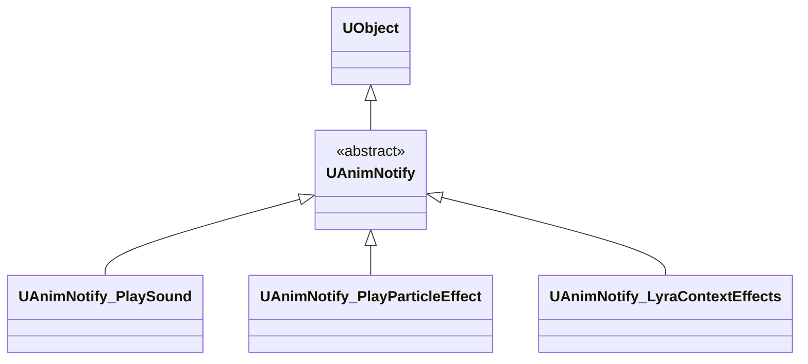
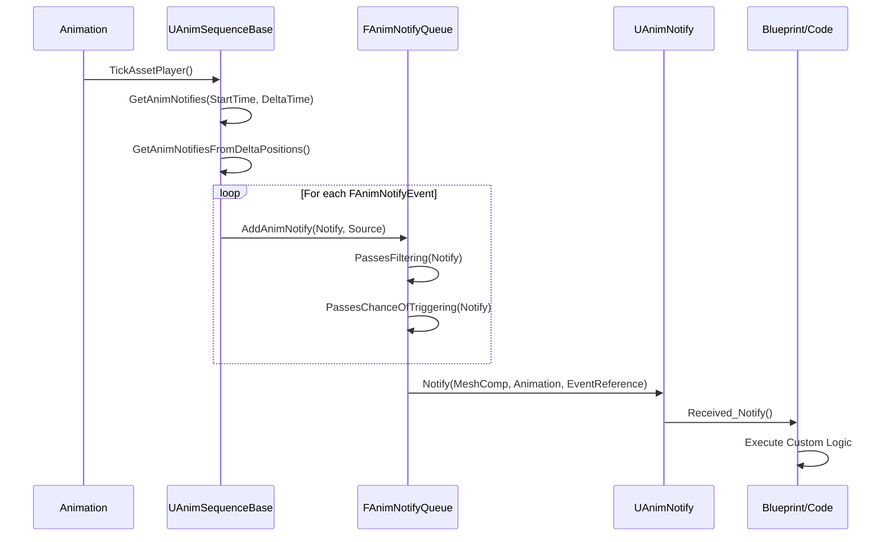

# UE5动画通知与特效系统深度分析

> 本文档深入分析 Unreal Engine 5 的动画通知系统（UAnimNotify、UAnimNotifyState）和 Lyra 的 Context Effects 系统实现。

## 文档导航

- **上一篇**：[06-Lyra动画系统实现详解](06-Lyra动画系统实现详解.md) - Lyra 动画系统实现
- **下一篇**：[08-UE5动画系统高级主题与性能优化](08-UE5动画系统高级主题与性能优化.md) - 高级主题与性能优化

---

## 一、UAnimNotify 和 UAnimNotifyState 基类分析

### 1.1 UAnimNotify 基类

**源码位置**：
- `Engine/Source/Runtime/Engine/Classes/Animation/AnimNotifies/AnimNotify.h`
- `Engine/Source/Runtime/Engine/Private/Animation/AnimNotify.cpp`

**继承关系**：


**核心方法**：
```cpp
// 主要通知方法 (UE5.0+ 新版本)
virtual void Notify(
    USkeletalMeshComponent* MeshComp, 
    UAnimSequenceBase* Animation, 
    const FAnimNotifyEventReference& EventReference
);

// Blueprint 可重写事件
UFUNCTION(BlueprintNativeEvent)
bool Received_Notify(
    USkeletalMeshComponent* MeshComp, 
    UAnimSequenceBase* Animation, 
    const FAnimNotifyEventReference& EventReference
) const;
```

**实现逻辑** (`AnimNotify.cpp` 第 33-42 行)：
```cpp
void UAnimNotify::Notify(
    USkeletalMeshComponent* MeshComp, 
    UAnimSequenceBase* Animation, 
    const FAnimNotifyEventReference& EventReference)
{
    USkeletalMeshComponent* PrevContext = MeshContext;
    MeshContext = MeshComp;
    PRAGMA_DISABLE_DEPRECATION_WARNINGS
    Notify(MeshComp, Animation);  // 兼容旧版本
    PRAGMA_ENABLE_DEPRECATION_WARNINGS
    Received_Notify(MeshComp, Animation, EventReference);  // 调用 Blueprint 事件
    MeshContext = PrevContext;
}
```

---

### 1.2 UAnimNotifyState 基类

**源码位置**：`Engine/Source/Runtime/Engine/Classes/Animation/AnimNotifies/AnimNotifyState.h`

**核心方法**：
```cpp
// 通知开始 (NotifyState 触发时)
virtual void NotifyBegin(
    USkeletalMeshComponent* MeshComp,
    UAnimSequenceBase* Animation, 
    float TotalDuration,
    const FAnimNotifyEventReference& EventReference
);

// 通知 Tick (每帧调用)
virtual void NotifyTick(
    USkeletalMeshComponent* MeshComp,
    UAnimSequenceBase* Animation,
    float FrameDeltaTime,
    const FAnimNotifyEventReference& EventReference
);

// 通知结束
virtual void NotifyEnd(
    USkeletalMeshComponent* MeshComp,
    UAnimSequenceBase* Animation,
    const FAnimNotifyEventReference& EventReference
);
```

**与 UAnimNotify 的关键区别**：
- **UAnimNotify**：单点触发（时间点）
- **UAnimNotifyState**：时间段触发（开始-持续-结束）

---

## 二、通知类型的注册和触发机制

### 2.1 FAnimNotifyEvent 结构分析

**源码位置**：`Engine/Source/Runtime/Engine/Public/Animation/AnimTypes.h` (第 276-447 行)

```cpp
USTRUCT(BlueprintType)
struct FAnimNotifyEvent : public FAnimLinkableElement
{
    // [1] 触发时间和持续时间控制
    UPROPERTY()
    float TriggerTimeOffset;          // 触发时间偏移 (用于精确触发)
    
    UPROPERTY()
    float EndTriggerTimeOffset;       // 结束时间偏移 (NotifyState 使用)
    
    UPROPERTY()
    float Duration;                   // 持续时间 (NotifyState)
```
接下来是针对具体 Blueprint 实例以及类型的数据成员：
```cpp
    // [2] Notify 类型与过滤属性
    UPROPERTY()
    float TriggerWeightThreshold;     // 触发权重阈值 (动画权重达到此值才会触发)
    
    UPROPERTY()
    FName NotifyName;                 // 通知名称 (用于命名和搜索)
    
    UPROPERTY(EditAnywhere, Instanced)
    TObjectPtr<class UAnimNotify> Notify;  // UAnimNotify 实例
    
    UPROPERTY(EditAnywhere, Instanced)
    TObjectPtr<class UAnimNotifyState> NotifyStateClass; // UAnimNotifyState 实例
```
相关的随机性概率与环境过滤触发：
```cpp
    // [3] 环境与系统级过滤
    UPROPERTY()
    float NotifyTriggerChance;        // 触发概率 (0.0-1.0)
    
    UPROPERTY()
    TEnumAsByte<ENotifyFilterType::Type> NotifyFilterType; // LOD 等其他过滤类型
    
    UPROPERTY()
    int32 NotifyFilterLOD;            // 低于此 LOD 时不触发
    
    UPROPERTY()
    bool bTriggerOnDedicatedServer;   // 是否在专属服务器上触发
    
    UPROPERTY()
    bool bTriggerOnFollower;          // 是否在跟随者同步组中触发
    
    UPROPERTY()
    int32 TrackIndex;                 // Track 索引 (编辑器和运行时排序优先级)
};
```**源码位置**：`Engine/Source/Runtime/Engine/Classes/Animation/AnimSequenceBase.h`

```cpp
UCLASS(abstract, BlueprintType, MinimalAPI)
class UAnimSequenceBase : public UAnimationAsset
{
public:
    // 通知数组 - 按时间排序 (最早优先)
    UPROPERTY()
    TArray<struct FAnimNotifyEvent> Notifies;
    
#if WITH_EDITORONLY_DATA
    // 编辑器通知轨道
    UPROPERTY()
    TArray<FAnimNotifyTrack> AnimNotifyTracks;
#endif
};
```

---

### 2.3 通知触发时机和优先级

**触发流程** (`AnimSequenceBase.cpp` 第 809-900 行)：

```cpp
void UAnimSequenceBase::GetAnimNotifies(
    const float& StartTime, 
    const float& DeltaTime, 
    FAnimNotifyContext& NotifyContext) const
{
    // 1. 检查是否有通知
    if (!IsNotifyAvailable()) return;
    
    // 2. 计算位置和循环
    bool const bPlayingBackwards = (DeltaTime < 0.f);
    float PreviousPosition = StartTime;
    float CurrentPosition = StartTime;
    float DesiredDeltaMove = DeltaTime;
    const float PlayLength = GetPlayLength();
    
    // 3. 处理循环
    for (uint32_t i = 0; i < MaxLoopCount; i++)
    {
        // 推进时间
        const ETypeAdvanceAnim AdvanceType = 
            FAnimationRuntime::AdvanceTime(false, DesiredDeltaMove, 
                                         CurrentPosition, PlayLength);
        
        // 4. 获取该时间段内的通知
        GetAnimNotifiesFromDeltaPositions(PreviousPosition, 
                                         CurrentPosition, 
                                         NotifyContext);
        
        // 5. 处理循环
        if ((AdvanceType == ETAA_Finished) && 
            NotifyContext.TickRecord && 
            NotifyContext.TickRecord->bLooping)
        {
            // 继续下一循环
            DesiredDeltaMove -= ActualDeltaMove;
            PreviousPosition = bPlayingBackwards ? PlayLength : 0.f;
            CurrentPosition = PreviousPosition;
        }
    }
}
```

**通知排序优先级** (`AnimTypes.h` 第 461-478 行)：
```cpp
inline bool FAnimNotifyEvent::operator<(const FAnimNotifyEvent& Other) const
{
    float ATime = GetTriggerTime();
    float BTime = Other.GetTriggerTime();

    // 同一时间按 TrackIndex 排序
    if (FMath::IsNearlyEqual(ATime, BTime, UE_SMALL_NUMBER))
    {
        return TrackIndex < Other.TrackIndex;
    }
    else
    {
        return ATime < BTime;
    }
}
```

---

## 三、Lyra 项目的通知实现

### 3.1 UAnimNotify_LyraContextEffects 分析

**源码位置**：
- 头文件：`Source/LyraGame/Feedback/ContextEffects/AnimNotify_LyraContextEffects.h`
- 实现：`Source/LyraGame/Feedback/ContextEffects/AnimNotify_LyraContextEffects.cpp`

**核心特性**：
```cpp
UCLASS(MinimalAPI, const, hidecategories=Object, CollapseCategories, 
       Config = Game, meta=(DisplayName="Play Context Effects"))
class UAnimNotify_LyraContextEffects : public UAnimNotify
{
    // 效果 GameplayTag
    UPROPERTY(EditAnywhere, BlueprintReadWrite)
    FGameplayTag Effect;
    
    // 位置偏移
    UPROPERTY(EditAnywhere, BlueprintReadWrite)
    FVector LocationOffset;
    
    // 旋转偏移
    UPROPERTY(EditAnywhere, BlueprintReadWrite)
    FRotator RotationOffset;
    
    // VFX 属性
    UPROPERTY(EditAnywhere, BlueprintReadWrite)
    FLyraContextEffectAnimNotifyVFXSettings VFXProperties;
    
    // 音频属性
    UPROPERTY(EditAnywhere, BlueprintReadWrite)
    FLyraContextEffectAnimNotifyAudioSettings AudioProperties;
    
    // 是否附加到骨骼
    UPROPERTY(EditAnywhere, BlueprintReadWrite)
    uint32 bAttached : 1;
    
    // 附加的 Socket 名称
    UPROPERTY(EditAnywhere, BlueprintReadWrite)
    FName SocketName;
    
    // 是否执行射线检测
    UPROPERTY(EditAnywhere, BlueprintReadWrite)
    uint32 bPerformTrace : 1;
    
    // 射线检测属性
    UPROPERTY(EditAnywhere, BlueprintReadWrite)
    FLyraContextEffectAnimNotifyTraceSettings TraceProperties;
};
```

---

### 3.2 Notify() 方法实现

**源码位置**：`AnimNotify_LyraContextEffects.cpp` 第 45-200 行

```cpp
void UAnimNotify_LyraContextEffects::Notify(
    USkeletalMeshComponent* MeshComp, 
    UAnimSequenceBase* Animation,
    const FAnimNotifyEventReference& EventReference)
{
    Super::Notify(MeshComp, Animation, EventReference);

    if (MeshComp && MeshComp->GetOwner())
    {
        AActor* OwningActor = MeshComp->GetOwner();
        
        // [1] 执行射线检测 (如果需要 Context 地形数据)
        bool bHitSuccess = false;
        FHitResult HitResult;
        
        if (bPerformTrace)
        {
            FVector TraceStart = bAttached ? 
                MeshComp->GetSocketLocation(SocketName) : 
                MeshComp->GetComponentLocation();
            
            if (UWorld* World = OwningActor->GetWorld())
            {
                bHitSuccess = World->LineTraceSingleByChannel(
                    HitResult, TraceStart, 
                    (TraceStart + TraceProperties.EndTraceLocationOffset),
                    TraceProperties.TraceChannel, QueryParams
                );
            }
        }
```
完成射线检测后收集支持环境感知接口的对象：
```cpp
        // [2] 收集实现了 Context Effects 接口的对象
        TArray<UObject*> LyraContextEffectImplementingObjects;
        
        // 检查 Actor 本身是否实现了接口
        if (OwningActor->Implements<ULyraContextEffectsInterface>())
        {
            LyraContextEffectImplementingObjects.Add(OwningActor);
        }
        
        // 检查所有的组件 (Component) 是否实现了接口
        for (const auto Component : OwningActor->GetComponents())
        {
            if (Component && Component->Implements<ULyraContextEffectsInterface>())
            {
                LyraContextEffectImplementingObjects.Add(Component);
            }
        }
```
触发对应对象的接口调用：
```cpp
        // [3] 遍历调用每个对象暴露的 AnimMotionEffect 事件
        for (UObject* Obj : LyraContextEffectImplementingObjects)
        {
            ILyraContextEffectsInterface::Execute_AnimMotionEffect(
                Obj,
                (bAttached ? SocketName : FName("None")),
                Effect, 
                MeshComp, 
                LocationOffset, 
                RotationOffset,
                Animation, 
                bHitSuccess, 
                HitResult, 
                Contexts, 
                VFXProperties.Scale,
                AudioProperties.VolumeMultiplier, 
                AudioProperties.PitchMultiplier
            );
        }
    }
}
```UPROPERTY(EditAnywhere, BlueprintReadWrite, Category = "AnimNotify", 
          meta = (DisplayName = "Effect", ExposeOnSpawn = true))
FGameplayTag Effect;
```

**Effect Tag 使用流程**：
1. 在动画序列中添加 `UAnimNotify_LyraContextEffects` 通知
2. 设置 `Effect` 属性（如 `"MotionEffect.Footstep.Light"`）
3. 通知触发时，调用所有实现了 `ILyraContextEffectsInterface` 的对象的 `AnimMotionEffect()`
4. 在 `ULyraContextEffectComponent::AnimMotionEffect_Implementation()` 中，使用 `Effect` Tag 查询 `ULyraContextEffectsLibrary`
5. 从 Library 中获取匹配的音频和粒子效果

---

### 3.4 物理表面追踪

**追踪配置结构**：
```cpp
USTRUCT(BlueprintType)
struct FLyraContextEffectAnimNotifyTraceSettings
{
    GENERATED_BODY()

    // 追踪通道
    UPROPERTY(EditAnywhere, BlueprintReadWrite, Category = Trace)
    TEnumAsByte<ECollisionChannel> TraceChannel = ECollisionChannel::ECC_Visibility;

    // 从效果位置的偏移量
    UPROPERTY(EditAnywhere, BlueprintReadWrite, Category = Trace)
    FVector EndTraceLocationOffset = FVector::ZeroVector;

    // 是否忽略此 Actor
    UPROPERTY(EditAnywhere, BlueprintReadWrite, Category = Trace)
    bool bIgnoreActor = true;
};
```

**追踪流程**：
1. 检查 `bPerformTrace` 标志
2. 设置追踪起点（如果附加到 Socket，使用 Socket 位置；否则使用 Component 位置）
3. 计算追踪终点：`TraceStart + TraceProperties.EndTraceLocationOffset`
4. 配置碰撞查询参数，设置 `bReturnPhysicalMaterial = true` 以获取物理材质
5. 调用 `World->LineTraceSingleByChannel()` 执行射线检测
6. 将追踪结果（`bHitSuccess` 和 `HitResult`）传递给 `AnimMotionEffect()`
7. 在 `ULyraContextEffectComponent::AnimMotionEffect_Implementation()` 中，从 `HitResult.PhysMaterial` 获取物理表面类型并转换为 Context Tag

---

## 四、ULyraContextEffectComponent 深度分析

### 4.1 类声明和继承关系

**源码位置**：
- 头文件：`Source/LyraGame/Feedback/ContextEffects/LyraContextEffectComponent.h`
- 实现：`Source/LyraGame/Feedback/ContextEffects/LyraContextEffectComponent.cpp`

**继承关系**：
```cpp
UCLASS(MinimalAPI, ClassGroup=(Custom), hidecategories = (...), CollapseCategories, 
       meta=(BlueprintSpawnableComponent))
class ULyraContextEffectComponent : 
    public UActorComponent, 
    public ILyraContextEffectsInterface
{
    GENERATED_BODY()
    // ...
};
```

组件同时继承自 `UActorComponent` 和 `ILyraContextEffectsInterface` 接口。

---

### 4.2 核心属性

```cpp
public:
    // 是否自动将物理表面类型转换为 Context
    UPROPERTY(EditAnywhere, BlueprintReadOnly)
    bool bConvertPhysicalSurfaceToContext = true;

    // 默认 Contexts
    UPROPERTY(EditAnywhere)
    FGameplayTagContainer DefaultEffectContexts;

    // 默认 Context Effects Libraries
    UPROPERTY(EditAnywhere)
    TSet<TSoftObjectPtr<ULyraContextEffectsLibrary>> DefaultContextEffectsLibraries;
```

---

### 4.3 AnimMotionEffect_Implementation() 核心方法

**源码位置**：`LyraContextEffectComponent.cpp` 第 61-149 行

```cpp
void ULyraContextEffectComponent::AnimMotionEffect_Implementation(
    const FName Bone, const FGameplayTag MotionEffect,
    USceneComponent* StaticMeshComponent,
    const FVector LocationOffset, const FRotator RotationOffset,
    const UAnimSequenceBase* AnimationSequence,
    const bool bHitSuccess, const FHitResult HitResult,
    FGameplayTagContainer Contexts, FVector VFXScale = FVector(1),
    float AudioVolume = 1, float AudioPitch = 1)
{
    // [1] 准备组件数组与聚合当前 Contexts
    TArray<UAudioComponent*> AudioComponentsToAdd;
    TArray<UNiagaraComponent*> NiagaraComponentsToAdd;
    FGameplayTagContainer TotalContexts;

    // 将动画传入的上下文环境与当前缓存的环境相聚合
    TotalContexts.AppendTags(Contexts);
    TotalContexts.AppendTags(CurrentContexts);
```
将检测到的物理材质表面直接转换成对应的 Context tag（例如 `Surface.Wood`）：
```cpp
    // [2] 检查是否需要将物理表面类型转换为 Context
    if (bConvertPhysicalSurfaceToContext)
    {
        TWeakObjectPtr<UPhysicalMaterial> PhysicalSurfaceTypePtr = HitResult.PhysMaterial;
        if (PhysicalSurfaceTypePtr.IsValid())
        {
            TEnumAsByte<EPhysicalSurface> PhysicalSurfaceType = PhysicalSurfaceTypePtr->SurfaceType;
            if (const ULyraContextEffectsSettings* LyraContextEffectsSettings = GetDefault<ULyraContextEffectsSettings>())
            {
                // 读取项目配置中的映射表
                if (const FGameplayTag* SurfaceContextPtr = LyraContextEffectsSettings->SurfaceTypeToContextMap.Find(PhysicalSurfaceType))
                {
                    TotalContexts.AddTag(*SurfaceContextPtr);
                }
            }
        }
    }
```
最后通知对应的 Subsystem，由 Subsystem 的单例代为统一 Spawn 具体资源以复用逻辑：
```cpp
    // [3] 通过 Subsystem 生成 Context Effects (Audio & Niagara)
    if (const UWorld* World = GetWorld())
    {
        if (ULyraContextEffectsSubsystem* LyraContextEffectsSubsystem = World->GetSubsystem<ULyraContextEffectsSubsystem>())
        {
            TArray<UAudioComponent*> AudioComponents;
            TArray<UNiagaraComponent*> NiagaraComponents;

            // 让 Subsystem 基于所处表面 Context 和动作 Effect 获取对应资源，并生成特效实例
            LyraContextEffectsSubsystem->SpawnContextEffects(
                GetOwner(), StaticMeshComponent, Bone,
                LocationOffset, RotationOffset, MotionEffect, TotalContexts,
                AudioComponents, NiagaraComponents, VFXScale, AudioVolume, AudioPitch
            );

            AudioComponentsToAdd.Append(AudioComponents);
            NiagaraComponentsToAdd.Append(NiagaraComponents);
        }
    }

    // [4] 更新并缓存当前活跃组件列表
    ActiveAudioComponents.Empty();
    ActiveAudioComponents.Append(AudioComponentsToAdd);
    ActiveNiagaraComponents.Empty();
    ActiveNiagaraComponents.Append(NiagaraComponentsToAdd);
}
```    D --> E[聚合 Contexts]
    E --> F[转换物理表面为 Context]
    F --> G["调用 Subsystem.SpawnContextEffects()"]
    G --> H[ULyraContextEffectsSubsystem]
    H --> I[查找 Actor 的 Effect Libraries]
    I --> J[从 Library 获取匹配的 Effects]
    J --> K[生成 Audio 和 Niagara 特效]
```

---

## 五、Context Effects 系统架构

### 5.1 ULyraContextEffectsLibrary

**源码位置**：
- `Source/LyraGame/Feedback/ContextEffects/LyraContextEffectsLibrary.h`
- `Source/LyraGame/Feedback/ContextEffects/LyraContextEffectsLibrary.cpp`

**数据结构**：
```cpp
USTRUCT(BlueprintType)
struct FLyraContextEffects
{
    GENERATED_BODY()

    UPROPERTY(EditAnywhere, BlueprintReadOnly)
    FGameplayTag EffectTag;

    UPROPERTY(EditAnywhere, BlueprintReadOnly)
    FGameplayTagContainer Context;

    UPROPERTY(EditAnywhere, BlueprintReadOnly, 
              meta = (AllowedClasses = "/Script/Engine.SoundBase, /Script/Niagara.NiagaraSystem"))
    TArray<FSoftObjectPath> Effects;
};

UCLASS(MinimalAPI, BlueprintType)
class ULyraContextEffectsLibrary : public UObject
{
    GENERATED_BODY()
    
public:
    UPROPERTY(EditAnywhere, BlueprintReadOnly)
    TArray<FLyraContextEffects> ContextEffects;

    UFUNCTION(BlueprintCallable)
    void GetEffects(
        const FGameplayTag Effect, 
        const FGameplayTagContainer Context,
        TArray<USoundBase*>& Sounds, 
        TArray<UNiagaraSystem*>& NiagaraSystems
    );

    UFUNCTION(BlueprintCallable)
    void LoadEffects();
};
```

---

### 5.2 效果匹配逻辑（GetEffects）

```cpp
void ULyraContextEffectsLibrary::GetEffects(
    const FGameplayTag Effect,
    const FGameplayTagContainer Context,
    TArray<USoundBase*>& Sounds,
    TArray<UNiagaraSystem*>& NiagaraSystems)
{
    if (Effect.IsValid() && Context.IsValid() && 
        EffectsLoadState == EContextEffectsLibraryLoadState::Loaded)
    {
        for (const auto& ActiveContextEffect : ActiveContextEffects)
        {
            // 精确匹配 Effect Tag，并且 Context 必须完全包含所需 Tags
            if (Effect.MatchesTagExact(ActiveContextEffect->EffectTag)
                && Context.HasAllExact(ActiveContextEffect->Context)
                && (ActiveContextEffect->Context.IsEmpty() == Context.IsEmpty()))
            {
                Sounds.Append(ActiveContextEffect->Sounds);
                NiagaraSystems.Append(ActiveContextEffect->NiagaraSystems);
            }
        }
    }
}
```

---

### 5.3 ULyraContextEffectsSubsystem

**源码位置**：`Source/LyraGame/Feedback/ContextEffects/LyraContextEffectsSubsystem.h`

```cpp
UCLASS(MinimalAPI)
class ULyraContextEffectsSubsystem : public UWorldSubsystem
{
    // 生成 Context Effects
    void SpawnContextEffects(
        const AActor* SpawningActor,
        USceneComponent* AttachToComponent,
        const FName AttachPoint,
        const FVector LocationOffset,
        const FRotator RotationOffset,
        FGameplayTag Effect,
        FGameplayTagContainer Contexts,
        TArray<UAudioComponent*>& AudioOut,
        TArray<UNiagaraComponent*>& NiagaraOut,
        FVector VFXScale = FVector(1),
        float AudioVolume = 1,
        float AudioPitch = 1
    );

    // 从物理表面类型获取 Context
    bool GetContextFromSurfaceType(
        TEnumAsByte<EPhysicalSurface> PhysicalSurface, 
        FGameplayTag& Context
    );
};
```

---

### 5.4 ULyraContextEffectsSettings

**源码位置**：`Source/LyraGame/Feedback/ContextEffects/LyraContextEffectsSettings.h`

```cpp
UCLASS(MinimalAPI, config = Game, defaultconfig)
class ULyraContextEffectsSettings : public UDeveloperSettings
{
    // 表面类型到 Context 的映射
    UPROPERTY(config, EditAnywhere)
    TMap<TEnumAsByte<EPhysicalSurface>, FGameplayTag> 
        SurfaceTypeToContextMap;
};
```

**配置示例**：
```ini
; DefaultGame.ini
[/Script/LyraGame.LyraContextEffectsSettings]
SurfaceTypeToContextMap=(Key=SurfaceType1,Value="PhysicalSurface.Concrete")
SurfaceTypeToContextMap=(Key=SurfaceType2,Value="PhysicalSurface.Dirt")
SurfaceTypeToContextMap=(Key=SurfaceType3,Value="PhysicalSurface.Metal")
```

---

## 六、音频和特效通知

### 6.1 UAnimNotify_PlaySound

**源码位置**：`Engine/Source/Runtime/Engine/Classes/Animation/AnimNotifies/AnimNotify_PlaySound.h`

```cpp
UCLASS(const, hidecategories=Object, collapsecategories, Config = Game, 
       meta=(DisplayName="Play Sound"))
class UAnimNotify_PlaySound : public UAnimNotify
{
    // 要播放的声音
    UPROPERTY(EditAnywhere, BlueprintReadWrite)
    TObjectPtr<USoundBase> Sound;
    
    // 音量倍数
    UPROPERTY(EditAnywhere, BlueprintReadWrite)
    float VolumeMultiplier;
    
    // 音调倍数
    UPROPERTY(EditAnywhere, BlueprintReadWrite)
    float PitchMultiplier;
    
    // 是否跟随 Owner
    UPROPERTY(EditAnywhere, BlueprintReadWrite)
    uint32 bFollow : 1;
    
    // 附加的 Socket 名称
    UPROPERTY(EditAnywhere, BlueprintReadWrite)
    FName AttachName;
};
```

---

### 6.2 UAnimNotifyState_Trail

**源码位置**：`Engine/Source/Runtime/Engine/Classes/Animation/AnimNotifies/AnimNotifyState_Trail.h`

```cpp
UCLASS(editinlinenew, Blueprintable, const, hidecategories = Object, 
       collapsecategories, meta = (ShowWorldContextPin, DisplayName = "Trail"))
class UAnimNotifyState_Trail : public UAnimNotifyState
{
    // 拖尾粒子系统模板
    UPROPERTY(EditAnywhere, BlueprintReadWrite)
    TObjectPtr<UParticleSystem> PSTemplate;
    
    // 第一个 Socket 名称
    UPROPERTY(EditAnywhere, BlueprintReadWrite)
    FName FirstSocketName;
    
    // 第二个 Socket 名称
    UPROPERTY(EditAnywhere, BlueprintReadWrite)
    FName SecondSocketName;
    
    // 宽度缩放模式
    UPROPERTY(EditAnywhere, BlueprintReadWrite)
    TEnumAsByte<enum ETrailWidthMode> WidthScaleMode;
    
    // 宽度缩放曲线名称
    UPROPERTY(EditAnywhere, BlueprintReadWrite)
    FName WidthScaleCurve;
};
```

---

### 6.3 其他常用通知类型

| 通知类 | 功能 | 类型 |
|--------|------|------|
| `UAnimNotify_PlaySound` | 播放声音 | UAnimNotify |
| `UAnimNotify_PlayParticleEffect` | 播放粒子效果 | UAnimNotify |
| `UAnimNotify_ResetDynamics` | 重置物理模拟 | UAnimNotify |
| `UAnimNotifyState_Trail` | 生成拖尾效果 | UAnimNotifyState |
| `UAnimNotifyState_TimedParticleEffect` | 时间段粒子效果 | UAnimNotifyState |
| `UAnimNotifyState_DisableRootMotion` | 禁用根运动 | UAnimNotifyState |

---

## 七、自定义通知的最佳实践

### 7.1 创建自定义 AnimNotify

**C++ 实现示例**：

```cpp
// MyCustomNotify.h
UCLASS(const, DisplayName="My Custom Notify")
class UMyCustomNotify : public UAnimNotify
{
    GENERATED_BODY()

public:
    UPROPERTY(EditAnywhere, BlueprintReadWrite)
    FString Message;

    virtual void Notify_Implementation(
        USkeletalMeshComponent* MeshComp,
        UAnimSequenceBase* Animation,
        const FAnimNotifyEventReference& EventReference) override
    {
        Super::Notify_Implementation(MeshComp, Animation, EventReference);
        
        if (MeshComp && !Message.IsEmpty())
        {
            UE_LOG(LogTemp, Warning, TEXT("Notify Triggered: %s"), *Message);
            
            // 自定义逻辑
            if (AActor* Owner = MeshComp->GetOwner())
            {
                // 执行游戏逻辑
            }
        }
    }
};
```

**Blueprint 实现**：
1. 在 Content Browser 右键 -> Animation -> AnimNotify
2. 重写 `Received_Notify` 事件
3. 实现自定义逻辑

---

### 7.2 创建自定义 AnimNotifyState

```cpp
// MyCustomNotifyState.h
UCLASS(editinlinenew, DisplayName="My Custom Notify State")
class UMyCustomNotifyState : public UAnimNotifyState
{
    GENERATED_BODY()

public:
    virtual void NotifyBegin_Implementation(
        USkeletalMeshComponent* MeshComp,
        UAnimSequenceBase* Animation,
        float TotalDuration,
        const FAnimNotifyEventReference& EventReference) override
    {
        // 开始逻辑
    }

    virtual void NotifyTick_Implementation(
        USkeletalMeshComponent* MeshComp,
        UAnimSequenceBase* Animation,
        float FrameDeltaTime,
        const FAnimNotifyEventReference& EventReference) override
    {
        // 每帧逻辑
    }

    virtual void NotifyEnd_Implementation(
        USkeletalMeshComponent* MeshComp,
        UAnimSequenceBase* Animation,
        const FAnimNotifyEventReference& EventReference) override
    {
        // 结束逻辑
    }
};
```

---

### 7.3 性能考虑和注意事项

**性能优化建议**：

1. **合理使用 NotifyTriggerChance**
```cpp
// 只有 50% 概率触发 - 用于随机效果
NotifyTriggerChance = 0.5f;
```

2. **LOD 过滤**
```cpp
// 只在 LOD 0 和 1 触发
NotifyFilterType = ENotifyFilterType::LOD;
NotifyFilterLOD = 2;  // LOD2 及以上不触发
```

3. **专属服务器优化**
```cpp
// 不需要在服务器上触发的效果
bTriggerOnDedicatedServer = false;
```

4. **避免在 Notify 中执行耗时操作**
- 不要在 Notify 中执行阻塞操作
- 避免复杂的射线检测
- 使用对象池复用粒子系统

5. **使用 BranchingPoint 谨慎**
- BranchingPoint 会立即触发，影响性能
- 只在需要精确控制（如切换 Section）时使用

---

## 八、通知触发流程图



---

## 九、总结

### 9.1 关键点回顾

1. **UAnimNotify** 是单点触发的通知，**UAnimNotifyState** 是时间段触发的通知

2. **FAnimNotifyEvent** 存储通知的触发时间、持续时间和触发条件

3. **Lyra 的 Context Effects 系统** 通过 `UAnimNotify_LyraContextEffects` 触发，`ULyraContextEffectComponent` 处理，`ULyraContextEffectsSubsystem` 管理

4. **物理表面追踪** 通过射线检测获取 `UPhysicalMaterial`，然后转换为 `GameplayTag`

5. **效果匹配** 通过 `ULyraContextEffectsLibrary` 根据 `Effect Tag` 和 `Context` 精确匹配

---

### 9.2 性能优化检查清单

- [ ] 使用 `NotifyTriggerChance` 控制随机效果触发概率
- [ ] 使用 `NotifyFilterLOD` 在远距离禁用通知
- [ ] 设置 `bTriggerOnDedicatedServer = false` 避免服务器执行客户端效果
- [ ] 避免在 Notify 中执行复杂的射线检测
- [ ] 使用对象池复用粒子系统
- [ ] 谨慎使用 BranchingPoint

---

## 十、关键源码文件索引

| 文件路径 | 说明 |
|----------|------|
| `Engine/Source/Runtime/Engine/Classes/Animation/AnimNotifies/AnimNotify.h` | UAnimNotify 基类定义 |
| `Engine/Source/Runtime/Engine/Private/Animation/AnimNotify.cpp` | UAnimNotify 实现 |
| `Engine/Source/Runtime/Engine/Classes/Animation/AnimNotifies/AnimNotifyState.h` | UAnimNotifyState 基类定义 |
| `Engine/Source/Runtime/Engine/Public/Animation/AnimTypes.h` | FAnimNotifyEvent 结构定义 |
| `Engine/Source/Runtime/Engine/Classes/Animation/AnimSequenceBase.h` | UAnimSequenceBase 定义 |
| `Engine/Source/Runtime/Engine/Private/Animation/AnimSequenceBase.cpp` | 通知触发逻辑实现 |
| `Source/LyraGame/Feedback/ContextEffects/AnimNotify_LyraContextEffects.h` | Lyra Context Effects Notify |
| `Source/LyraGame/Feedback/ContextEffects/LyraContextEffectComponent.h` | Lyra Context Effect 组件 |
| `Source/LyraGame/Feedback/ContextEffects/LyraContextEffectsSubsystem.h` | Lyra Context Effects 子系统 |
| `Source/LyraGame/Feedback/ContextEffects/LyraContextEffectsLibrary.h` | Lyra Context Effects 库 |

---

## 十一、参考资料

1. [Unreal Engine 5 官方文档 - 动画通知](https://docs.unrealengine.com/5.0/en-US/animation-notifies-in-unreal-engine/)
2. [Unreal Engine 5 官方文档 - 动画蓝图通知](https://docs.unrealengine.com/5.0/en-US/animation-blueprint-notifies-in-unreal-engine/)
3. [Lyra 项目源码 - GitHub](https://github.com/EpicGames/UnrealEngine/tree/5.0/Samples/Games/Lyra)
4. [Unreal Engine 5 源码 - AnimNotify.h](https://github.com/EpicGames/UnrealEngine/blob/5.0/Engine/Source/Runtime/Engine/Classes/Animation/AnimNotifies/AnimNotify.h)

---

> **最后更新**：2026-05-16
> **状态**：current
> **维护者**：AI Agent (project-wiki skill)

<!-- nav:auto -->

---

**导航**: ← [[30-tutorials/animation/06-Lyra动画系统实现详解|06-Lyra动画系统实现详解]] · [[30-tutorials/animation/08-UE5动画系统高级主题与性能优化|08-UE5动画系统高级主题与性能优化]] →

<!-- /nav:auto -->
