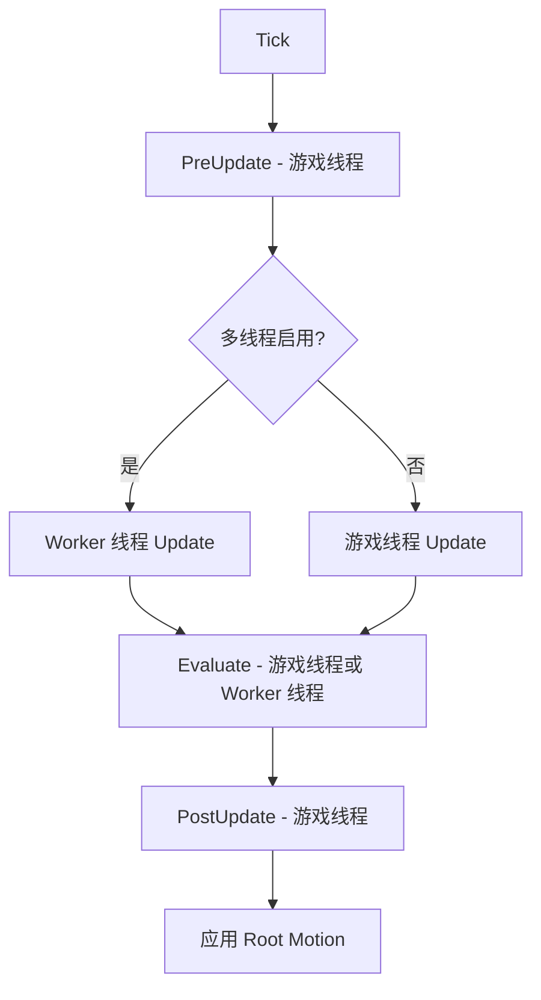
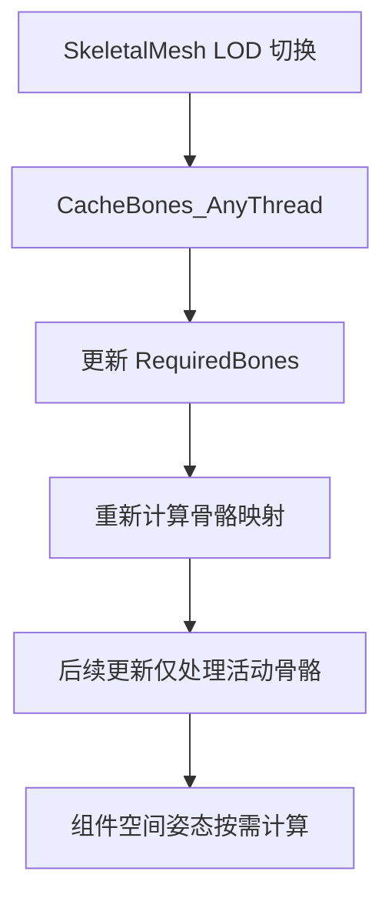

# UE5动画系统高级主题与性能优化

> 本文档深入分析 Unreal Engine 5 动画系统的高级主题，包括动画压缩、LOD 优化、性能优化技术、Root Motion、Control Rig 等。

## 文档导航

- **上一篇**：[07-UE5动画通知与特效系统深度分析](07-UE5动画通知与特效系统深度分析.md) - 动画通知与特效系统
- **返回**：[01-Lyra动画系统框架深度分析-概览](01-Lyra动画系统框架深度分析-概览.md) - 动画系统概览

---

## 一、动画压缩（Animation Compression）

### 1.1 核心数据结构

**源码位置**：`Engine/Source/Runtime/Engine/Public/Animation/AnimCompressionTypes.h`

#### FCompressedAnimDataBase

```cpp
struct FCompressedAnimDataBase
{
    // 压缩轨道偏移数组 [0] Trans0.Offset, [1] Trans0.NumKeys, [2] Rot0.Offset...
    typename ContainerTypeMakerTemplate<int32>::Type CompressedTrackOffsets;
    
    // Scale 偏移数据
    FCompressedOffsetDataBase<typename ContainerTypeMakerTemplate<int32>::Type> CompressedScaleOffsets;
    
    // 压缩字节流
    typename ContainerTypeMakerTemplate<uint8>::Type CompressedByteStream;
    
    // 编解码器接口
    class AnimEncoding* TranslationCodec;
    class AnimEncoding* RotationCodec;
    class AnimEncoding* ScaleCodec;
    
    // 关键帧格式
    enum AnimationKeyFormat KeyEncodingFormat;
    
    // 压缩格式
    AnimationCompressionFormat TranslationCompressionFormat;
    AnimationCompressionFormat RotationCompressionFormat;
    AnimationCompressionFormat ScaleCompressionFormat;
};
```

#### AnimationKeyFormat 枚举

```cpp
enum AnimationKeyFormat : int
{
    AKF_ConstantKeyLerp,      // 常量关键帧插值
    AKF_VariableKeyLerp,      // 可变关键帧插值
    AKF_PerTrackCompression,  // 每轨道压缩
    AKF_MAX,
};
```

---

### 1.2 UAnimCompress 基类

**源码位置**：`Engine/Source/Runtime/Engine/Classes/Animation/AnimCompress.h`

```cpp
UCLASS(abstract, hidecategories=Object, MinimalAPI, EditInlineNew)
class UAnimCompress : public UAnimBoneCompressionCodec
{
    // 压缩格式属性
    UPROPERTY(Category = Compression, EditAnywhere)
    TEnumAsByte<AnimationCompressionFormat> TranslationCompressionFormat;
    
    UPROPERTY(Category = Compression, EditAnywhere)
    TEnumAsByte<AnimationCompressionFormat> RotationCompressionFormat;
    
    UPROPERTY(Category = Compression, EditAnywhere)
    TEnumAsByte<AnimationCompressionFormat> ScaleCompressionFormat;
    
    // 核心虚函数 - 子类实现具体压缩算法
    virtual bool DoReduction(const FCompressibleAnimData& CompressibleAnimData, 
                            FCompressibleAnimDataResult& OutResult) PURE_VIRTUAL;
    
    // 位压缩动画轨道 - 核心压缩函数
    static void BitwiseCompressAnimationTracks(
        const FCompressibleAnimData& CompressibleAnimData,
        FCompressibleAnimDataResult& OutCompressedData,
        AnimationCompressionFormat TargetTranslationFormat,
        AnimationCompressionFormat TargetRotationFormat,
        AnimationCompressionFormat TargetScaleFormat,
        const TArray<FTranslationTrack>& TranslationData,
        const TArray<FRotationTrack>& RotationData,
        const TArray<FScaleTrack>& ScaleData,
        bool IncludeKeyTable = false
    );
};
```

---

### 1.3 压缩算法子类

| 压缩算法 | 头文件 | 特点 |
|------------|----------|------|
| `UAnimCompress_BitwiseCompressOnly` | `AnimCompress_BitwiseCompressOnly.h` | 仅位压缩，不减少关键帧 |
| `UAnimCompress_LeastDestructive` | `AnimCompress_LeastDestructive.h` | 最小破坏性或高保真压缩，`IsHighFidelity() = true` |
| `UAnimCompress_PerTrackCompression` | `AnimCompress_PerTrackCompression.h/cpp` | 每轨道压缩，为每个轨道独立选择最佳压缩格式 |
| `UAnimCompress_RemoveLinearKeys` | `AnimCompress_RemoveLinearKeys.h` | 移除线性关键帧 |
| `UAnimCompress_RemoveEverySecondKey` | `AnimCompress_RemoveEverySecondKey.h` | 间隔移除关键帧 |
| `UAnimCompress_RemoveTrivialKeys` | `AnimCompress_RemoveTrivialKeys.h` | 移除平凡关键帧 |

---

### 1.4 压缩格式选项

**AnimationCompressionFormat 枚举**：

| 格式 | 说明 | 位宽 |
|------|------|--------|
| `ACF_None` | 无压缩 | - |
| `ACF_Float96NoW` | 96位浮点数（无W分量） | 96 bits |
| `ACF_Fixed48NoW` | 48位定点数 | 48 bits |
| `ACF_IntervalFixed32NoW` | 32位区间定点数 | 32 bits |
| `ACF_Fixed32NoW` | 32位定点数 | 32 bits |
| `ACF_Float32NoW` | 32位浮点数 | 32 bits |
| `ACF_Identity` | 恒等变换（无数据） | 0 bits |

---

### 1.5 压缩工具函数

```cpp
// 过滤平凡位置关键帧
static void FilterTrivialPositionKeys(TArray<FTranslationTrack>& Track, float MaxPosDelta);

// 过滤平凡旋转关键帧
static void FilterTrivialRotationKeys(TArray<FRotationTrack>& InputTracks, float MaxRotDelta);

// 预计算最短四元数路径
static void PrecalculateShortestQuaternionRoutes(TArray<FRotationTrack>& RotationData);

// 将原始数据分离为独立轨道
static void SeparateRawDataIntoTracks(
    const TArray<FRawAnimSequenceTrack>& RawAnimData,
    float SequenceLength,
    TArray<FTranslationTrack>& OutTranslationData,
    TArray<FRotationTrack>& OutRotationData,
    TArray<FScaleTrack>& OutScaleData
);
```

---

### 1.6 选择合适的压缩设置

**建议策略**：
1. **高精度需求**：使用 `LeastDestructive` 或 `BitwiseCompressOnly`
2. **平衡质量与大小**：使用 `RemoveLinearKeys` 或 `RemoveTrivialKeys`
3. **最大程度压缩**：使用 `PerTrackCompression`

**平台建议**：

| 平台 | 推荐压缩算法 | 说明 |
|------|--------------|------|
| PC/主机 | PerTrackCompression | 平衡质量和大小 |
| 移动平台 | RemoveLinearKeys | 更激进的压缩 |
| 高精度CG | LeastDestructive | 保持最高质量 |

---

## 二、动画 LOD（Level of Detail）

### 2.1 LOD 系统架构

#### FAnimNode_Base 中的 LOD 支持

```cpp
// 检查 LOD 是否启用
bool IsLODEnabled(FAnimInstanceProxy* AnimInstanceProxy);

// 获取此节点启用的 LOD 阈值
virtual int32 GetLODThreshold() const { return INDEX_NONE; }
```

#### 示例：AnimNode_ApplyMeshSpaceAdditive

```cpp
USTRUCT()
struct FAnimNode_ApplyMeshSpaceAdditive : public FAnimNode_Base
{
    // LOD 阈值 - 节点在此 LOD 级别及以下运行
    // 例如：LODThreshold=2，则在 LOD 0,1,2 运行，LOD3 时停止
    UPROPERTY(EditAnywhere, BlueprintReadWrite, Category = Performance, 
              meta = (DisplayName = "LOD Threshold"))
    int32 LODThreshold;
    
    virtual int32 GetLODThreshold() const override { return LODThreshold; }
};
```

---

### 2.2 骨骼 LOD 优化

**原理**：
- Skeletal Mesh LOD 减少渲染骨骼数量
- 动画系统根据 `FBoneContainer` 的 `RequiredBones` 仅更新活动骨骼
- `FAnimationCacheBonesContext` 在 LOD 切换时重新缓存骨骼索引

**优化建议**：
1. 设置合理的 LOD 阈值
2. 使用 `FBoneContainer` 过滤不需要的骨骼
3. 在动画蓝图中使用 LOD 阈值控制节点激活

---

### 2.3 组件空间姿态 (FA2CSPose)

**位置**：`Engine/Source/Runtime/Engine/Classes/Animation/AnimInstance.h`

```cpp
struct FA2CSPose : public FA2Pose
{
    // 分配局部姿态并转换到组件空间
    void AllocateLocalPoses(const FBoneContainer& InBoneContainer, 
                           const FA2Pose& LocalPose);
    
    // 获取组件空间变换（按需计算）
    FTransform GetComponentSpaceTransform(int32 BoneIndex);
    
    // 获取局部空间变换
    FTransform GetLocalSpaceTransform(int32 BoneIndex);
    
    // 转换回局部姿态
    void ConvertToLocalPoses(FA2Pose& LocalPoses) const;
};
```

---

## 三、性能优化技术

### 3.1 多线程架构

#### UAnimInstance 的多线程支持

```cpp
UCLASS()
class UAnimInstance : public UObject
{
    // 允许在 Worker 线程上更新动画
    // 需要项目设置中启用 "Allow Multi Threaded Animation Update"
    UPROPERTY(meta=(BlueprintCompilerGeneratedDefaults))
    uint8 bUseMultiThreadedAnimationUpdate : 1;
    
    // 检查是否可以运行并行工作
    virtual bool CanRunParallelWork() const { return true; }
    
    // 是否在 Worker 线程上评估
    bool IsRunningParallelEvaluation() const;
    
    // 是否需要更新（并行或非并行）
    bool NeedsUpdate() const;
};
```

#### FAnimNode_Base 的线程安全

```cpp
struct FAnimNode_Base
{
    // 指示此节点是否可以在 Worker 线程中运行 Update()
    // 如果图中任何节点返回 false，则所有节点将在游戏线程上更新
    virtual bool CanUpdateInWorkerThread() const { return true; }
    
    // 指示是否需要在游戏线程上调用 PreUpdate()
    // 用于收集非线程安全的数据
    virtual bool HasPreUpdate() const { return false; }
    
    // 在游戏线程上调用，用于准备非线程安全数据
    virtual void PreUpdate(const UAnimInstance* InAnimInstance) {}
};
```

---

### 3.2 动画图优化 Best Practices

#### 1. 属性折叠 (Property Folding)

**原理**：在编译时将常量属性折叠到 CDO，减少运行时开销

```cpp
// 使用 meta = (FoldProperty) 标记可折叠属性
UPROPERTY(EditAnywhere, Category = Settings, meta = (FoldProperty))
float PlayRate = 1.0f;

// 在 AnimGraphNode 中标记属性为折叠
virtual bool HasFoldedProperties() const override { return true; }
```

#### 2. 缓存 Pose (Cached Pose)

**使用场景**：多个分支需要相同姿态时

```cpp
// SaveCachedPose - 缓存姿态
USTRUCT()
struct FAnimNode_SaveCachedPose : public FAnimNode_Base
{
    // 缓存的名称，供 UseCachedPose 引用
    UPROPERTY()
    FName CacheName;
};

// UseCachedPose - 使用缓存的姿态
USTRUCT()
struct FAnimNode_UseCachedPose : public FAnimNode_Base
{
    // 引用的缓存名称
    UPROPERTY()
    FName CacheName;
};
```

#### 3. 优化建议

1. **减少动画图复杂度**
   - 使用 `SaveCachedPose`/`UseCachedPose` 避免重复计算
   - 合理使用 `Blend Space` 而非多个 `Blend` 节点
   - 避免在动画蓝图中使用复杂的数学运算

2. **控制更新频率**
   - 对于非关键动画，使用 `Update Rate Optimization`
   - 设置合理的 `LOD Threshold`

3. **优化混合**
   - 使用 `Inertialization` 替代传统的 `Crossfade`
   - 减少同时活动的混合数量

---

### 3.3 减少动画蓝图的性能开销

#### 1. 使用 Fast Path

**原理**：当输入属性未被动态修改时，使用快速路径绕过 `EvaluateGraphExposedInputs`

```cpp
// 在 AnimGraphNode 中启用 Fast Path
// 当属性未被蓝图修改时自动启用
```

#### 2. 避免运行时类型检查

```cpp
// 不好的做法
if (MyAnimInstance->IsA<UMyAnimInstance>()) { ... }

// 好的做法 - 使用缓存的指针或 Template
TObjectPtr<UMyAnimInstance> MyAnimInstance;
```

#### 3. 使用常量折叠

```cpp
// 在属性上使用 FoldProperty meta 标签
UPROPERTY(EditAnywhere, meta = (FoldProperty))
float MyConstantValue;
```

---

## 四、动画缓存和预计算

### 4.1 Baked State Machine 数据

**位置**：`Engine/Source/Runtime/Engine/Classes/Animation/AnimStateMachineTypes.h`

```cpp
// Baked 状态机数据 - 编译时预计算
struct FBakedAnimationStateMachine
{
    // 状态数组
    TArray<FBakedAnimationState> States;
    
    // 转换数组
    TArray<FBakedStateExitTransition> Transitions;
    
    // 预计算的转换条件索引
    TArray<int32> TransitionConditionIndices;
};
```

---

### 4.2 动画通知的预计算

**原理**：通知在压缩时预计算时间，运行时快速查找

```cpp
// FAnimNotifyEvent - 动画通知事件
struct FAnimNotifyEvent
{
    // 通知触发时间
    float TriggerTime;
    
    // 通知结束时间（对于 NotifyState）
    float EndTriggerTime;
    
    // 预计算的 NotifyState 时长
    float Duration;
    
    // 通知对象
    TObjectPtr<UAnimNotify> Notify;
    TObjectPtr<UAnimNotifyState> NotifyState;
};
```

---

### 4.3 减少运行时计算

#### 1. 使用 Derived Data Cache (DDC)

```cpp
// 动画压缩使用 DDC 缓存结果
struct FCompressibleAnimData
{
    // 取消压缩的信号（用于取消进行中的压缩）
    FCancelCompressionSignal IsCancelledSignal;
    
    // 获取近似原始数据大小
    int64 GetApproxRawSize() const;
    
    // 获取近似内存使用量
    uint64 GetApproxMemoryUsage() const;
};
```

#### 2. 预计算最短四元数路径

```cpp
// 在压缩前预计算，避免运行时计算
static void PrecalculateShortestQuaternionRoutes(TArray<FRotationTrack>& RotationData);
```

---

## 五、高级动画特性

### 5.1 Root Motion 处理机制

#### ERootMotionMode 枚举

```cpp
UENUM()
enum class ERootMotionMode : uint8
{
    // 从一切提取 Root Motion
    RootMotionFromEverything,
    
    // 仅从 Montage 提取 Root Motion
    RootMotionFromMontagesOnly,
    
    // 忽略 Root Motion
    IgnoreRootMotion,
    
    // 无 Root Motion
    NoRootMotion
};
```

#### UAnimInstance 中的 Root Motion 设置

```cpp
UCLASS()
class UAnimInstance : public UObject
{
    // Root Motion 模式
    UPROPERTY(Category = RootMotion, EditDefaultsOnly)
    TEnumAsByte<ERootMotionMode::Type> RootMotionMode;
    
    // 是否应提取 Root Motion
    bool ShouldExtractRootMotion() const 
    { 
        return RootMotionMode == ERootMotionMode::RootMotionFromEverything || 
               RootMotionMode == ERootMotionMode::IgnoreRootMotion; 
    }
};
```

---

### 5.2 Animation Modifiers（动画修改器）

**位置**：`Engine/Source/Editor/AnimationModifiers/`

**用途**：在导入后自动处理动画序列（如添加通知、修改曲线等）

---

### 5.3 Control Rig 集成

**插件位置**：`Engine/Plugins/Animation/ControlRig/`

**集成方式**：
1. **AnimNode_ControlRig** - 在动画蓝图中使用 Control Rig
2. **ControlRigComponent** - 运行时 Control Rig 评估

---

### 5.4 Pose Search 和 Motion Matching (UE5.1+)

**插件位置**：`Engine/Plugins/Animation/PoseSearch/`

#### 核心文件

```
Engine/Plugins/Animation/PoseSearch/Source/Runtime/Public/PoseSearch/AnimNode_MotionMatching.h
Engine/Plugins/Animation/PoseSearch/Source/Runtime/Public/PoseSearch/PoseSearchDatabase.h
Engine/Plugins/Animation/PoseSearch/Source/Runtime/Public/PoseSearch/PoseSearchIndex.h
Engine/Plugins/Animation/PoseSearch/Source/Runtime/Public/PoseSearch/PoseSearchFeatureChannel_Pose.h
Engine/Plugins/Animation/PoseSearch/Source/Runtime/Public/PoseSearch/PoseSearchFeatureChannel_Trajectory.h
```

#### Motion Matching 工作原理

1. **Pose Search Database** - 包含所有可能的姿态
2. **Feature Channels** - 定义匹配的特征（位置、速度、轨迹等）
3. **Cost Function** - 计算当前姿态与数据库中姿态的距离
4. **Time-based Sampling** - 预测未来姿态以选择最佳匹配

---

## 六、调试和性能分析工具

### 6.1 AnimGraph 调试可视化

#### FNodeDebugData 结构体

```cpp
struct FNodeDebugData
{
    // 添加调试信息
    void AddDebugItem(FString DebugData, bool bPoseSource = false);
    
    // 分支流程（用于调试可视化）
    FNodeDebugData& BranchFlow(float BranchWeight, FString InNodeDescription = FString());
    
    // 获取扁平化调试数据
    TArray<FFlattenedDebugData> GetFlattenedDebugData();
};
```

#### 在节点中使用调试

```cpp
virtual void GatherDebugData(FNodeDebugData& DebugData) override
{
    FString DebugString = FString::Printf(TEXT("MyNode <W:%.1f%%>"), 
                                          DebugData.GetNodeName(this));
    DebugData.AddDebugItem(DebugString);
}
```

---

### 6.2 性能分析器（Profiler）中的动画追踪

#### 使用的宏

```cpp
// 在 AnimNodeBase.h 中定义
#define DECLARE_SCOPE_HIERARCHICAL_COUNTER_ANIMNODE(Method) \
    DECLARE_SCOPE_HIERARCHICAL_COUNTER_FUNC()

// 在节点函数中使用
void FMyAnimNode::Update_AnyThread(const FAnimationUpdateContext& Context)
{
    DECLARE_SCOPE_HIERARCHICAL_COUNTER_ANIMNODE(Update);
    // ... 节点逻辑
}
```

#### 统计命令

```cpp
// 在控制台中使用
stat Animation       // 显示动画系统统计信息
stat AnimGraph       // 显示动画图统计信息
AnimNode.Debug      // 显示指定节点的调试信息
```

---

### 6.3 常见的性能问题和解决方案

#### 问题 1：动画图过于复杂

**症状**：高 CPU 使用率，低帧率

**解决方案**：
1. 使用 `SaveCachedPose`/`UseCachedPose`
2. 简化混合树结构
3. 使用 `LOD Threshold` 禁用远距离角色的复杂动画

#### 问题 2：频繁的动画图重新评估

**症状**：每帧都进行完整的动画图评估

**解决方案**：
1. 使用 `Update Rate Optimization`
2. 对于 UI 或非关键角色，降低更新频率
3. 使用 `Inertialization` 减少混合计算

#### 问题 3：内存占用过高

**症状**：动画资产占用大量内存

**解决方案**：
1. 使用合理的压缩设置
2. 使用 `Streaming` 加载动画
3. 对于移动平台，使用更激进的压缩

---

## 七、实际项目中的应用建议

### 7.1 压缩设置建议

| 平台 | 推荐压缩算法 | 说明 |
|------|--------------|------|
| PC/主机 | PerTrackCompression | 平衡质量和大小 |
| 移动平台 | RemoveLinearKeys | 更激进的压缩 |
| 高精度CG | LeastDestructive | 保持最高质量 |

---

### 7.2 性能优化清单

1. **动画图优化**
   - [ ] 使用 `SaveCachedPose` 缓存共享姿态
   - [ ] 设置合理的 `LOD Threshold`
   - [ ] 使用 `Inertialization` 替代传统混合

2. **多线程优化**
   - [ ] 启用 `bUseMultiThreadedAnimationUpdate`
   - [ ] 确保自定义节点实现 `CanUpdateInWorkerThread()`
   - [ ] 避免在 `Update_AnyThread` 中访问游戏线程对象

3. **内存优化**
   - [ ] 使用合适的压缩格式
   - [ ] 启用动画流送 (Animation Streaming)
   - [ ] 定期审查动画资源大小

4. **调试和剖析**
   - [ ] 使用 `stat Animation` 监控性能
   - [ ] 实现 `GatherDebugData` 便于调试
   - [ ] 使用 `Pose Search` 的调试工具（如适用）

---

## 八、架构图和流程图

### 8.1 动画更新流程



---

### 8.2 动画压缩流程


---

### 8.3 LOD 优化流程



---

## 九、总结

UE5 的动画系统提供了丰富的性能优化机制和高级特性：

**核心优化技术**：
1. 动画压缩 - 选择合适的压缩算法可显著减少内存占用
2. LOD 系统 - 根据距离动态调整动画复杂度
3. 多线程更新 - 利用多核 CPU 提高性能
4. 属性折叠 - 编译时优化常量属性
5. 缓存姿态 - 避免重复计算

**高级特性**：
1. Root Motion - 精细控制角色移动
2. Control Rig - 程序化动画和 IK 解决方案
3. Pose Search/Motion Matching - 数据驱动的动画系统（UE5.1+）

**最佳实践**：
1. 根据目标平台选择合适的压缩设置
2. 合理使用 LOD Threshold 控制动画复杂度
3. 启用多线程更新提高性能
4. 使用调试工具持续监控性能
5. 对于大型项目，考虑使用 Pose Search 实现更流畅的动画过渡

---

## 十、关键源码文件索引

| 文件 | 绝对路径 | 说明 |
|------|----------|------|
| `AnimCompressionTypes.h` | `Engine/Source/Runtime/Engine/Public/Animation/AnimCompressionTypes.h` | 压缩数据类型定义 |
| `AnimCompress.h` | `Engine/Source/Runtime/Engine/Classes/Animation/AnimCompress.h` | 压缩算法基类 |
| `AnimCompress.cpp` | `Engine/Source/Runtime/Engine/Private/Animation/AnimCompress.cpp` | 压缩算法实现 |
| `AnimNodeBase.h` | `Engine/Source/Runtime/Engine/Classes/Animation/AnimNodeBase.h` | 动画节点基类 |
| `AnimInstance.h` | `Engine/Source/Runtime/Engine/Classes/Animation/AnimInstance.h` | 动画实例定义 |
| `AnimStateMachineTypes.h` | `Engine/Source/Runtime/Engine/Classes/Animation/AnimStateMachineTypes.h` | Baked 状态机数据 |
| `PoseSearchDatabase.h` | `Engine/Plugins/Animation/PoseSearch/Source/Runtime/Public/PoseSearch/PoseSearchDatabase.h` | Pose Search 数据库 |

---

## 十一、参考资料

1. [Unreal Engine 5 官方文档 - 动画压缩](https://docs.unrealengine.com/5.0/en-US/animation-compression-in-unreal-engine/)
2. [Unreal Engine 5 官方文档 - 动画优化](https://docs.unrealengine.com/5.0/en-US/optimizing-animation-blueprints-in-unreal-engine/)
3. [Unreal Engine 5 官方文档 - Root Motion](https://docs.unrealengine.com/5.0/en-US/root-motion-in-unreal-engine/)
4. [Unreal Engine 5 官方文档 - Control Rig](https://docs.unrealengine.com/5.0/en-US/control-rig-in-unreal-engine/)
5. [Unreal Engine 5 官方文档 - Pose Search](https://docs.unrealengine.com/5.1/en-US/pose-search-in-unreal-engine/)

---

> **最后更新**：2026-05-16
> **状态**：current
> **维护者**：AI Agent (project-wiki skill)

<!-- nav:auto -->

---

**导航**: ← [[30-tutorials/animation/07-UE5动画通知与特效系统深度分析|07-UE5动画通知与特效系统深度分析]] · [[30-tutorials/animation/09-MotionMatching运动匹配深度解析|09-MotionMatching运动匹配深度解析]] →

<!-- /nav:auto -->
