# ControlRig深度解析

> Control Rig 是 UE5 引入的程序化动画系统，通过节点化编程替代传统的硬编码 IK 方案，为技术美术提供统一的绑定、IK、变形工具链。

## 文档导航

- **上一篇**：[[30-tutorials/animation/09-MotionMatching运动匹配深度解析|MotionMatching运动匹配深度解析]]（Motion Matching 深度解析）
- **系列概览**：[[30-tutorials/animation/01-Lyra动画系统框架深度分析-概览|Lyra动画系统框架深度分析-概览]]
- **下一篇**：[[30-tutorials/animation/11-程序化动画技术-Warping-PoseDriver-FullBodyIK|程序化动画技术-Warping-PoseDriver-FullBodyIK]]（程序化动画综合技术）

---

## 一、为什么需要 Control Rig？

### 1.1 传统动画绑定方案的痛点

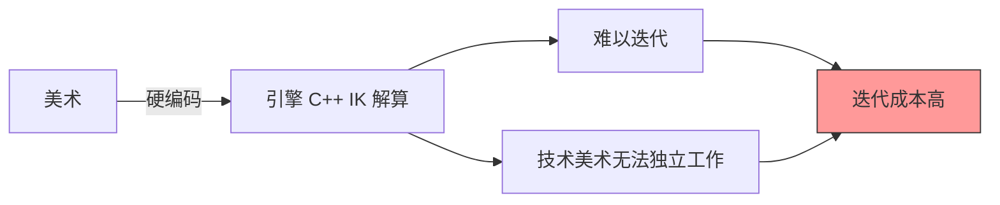

**传统方案的问题**：

| 问题 | 描述 | 影响 |
|------|------|------|
| **硬编码** | IK/FK 解算逻辑写在 C++ 中 | 技术美术无法独立迭代 |
| **工具链割裂** | 绑定、IK、变形使用不同工具 | 工作流不连贯 |
| **难以复用** | 每个角色的绑定逻辑独立编写 | 无法跨项目复用 |
| **性能不透明** | 蓝图、动画蓝图、自定义 IK 性能特征不同 | 优化困难 |

### 1.2 Control Rig 的核心价值

**一句话概括**：用**节点化编程（RigVM）** 统一绑定、IK、变形，让技术美术能独立迭代角色绑定逻辑。

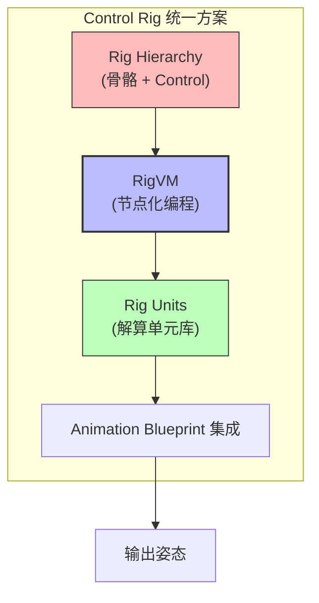

**核心优势**：

1. **可编程绑定** — 用节点图替代 C++ 硬编码
2. **统一工具链** — 绑定、IK、变形在同一个编辑器中完成
3. **高性能** — RigVM 编译为字节码，接近 C++ 性能
4. **可复用** — Rig 资产可以继承和模块化

---

## 二、Control Rig 核心架构

> **部分源码验证**：Control Rig 核心架构基于 UE 5.7 插件结构分析，以下小节中未标注「已用源码验证」的内容，源码路径待进一步确认。

### 2.1 核心类继承关系

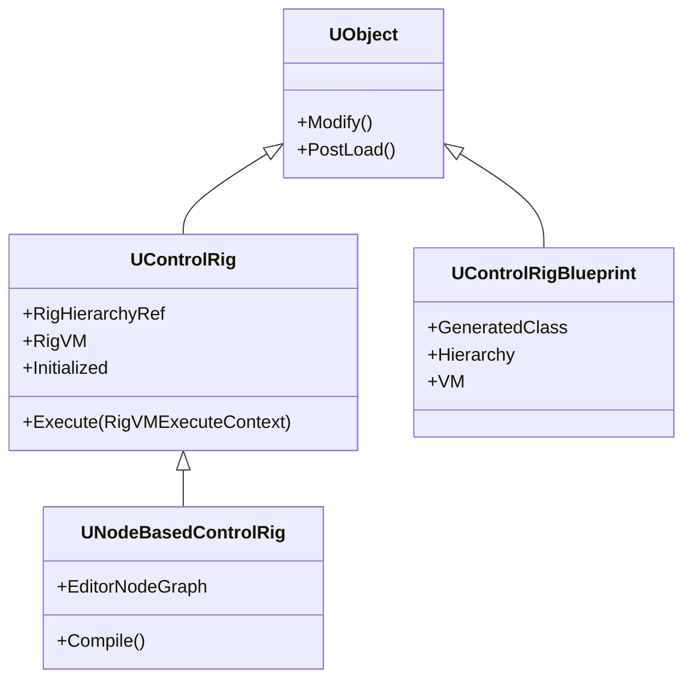

### 2.2 三大核心子系统

#### 2.2.1 Rig Hierarchy（绑定层级）

**作用**：管理骨骼、Control、Curve 的层次结构。

**源码位置**：`Engine/Plugins/Animation/ControlRig/Source/Runtime/Public/RigHierarchy.h`

```cpp
// Engine/Plugins/Animation/ControlRig/Source/Runtime/Public/RigHierarchy.h

USTRUCT()
struct FRigHierarchy
{
    // 骨骼元素列表
    UPROPERTY()
    TArray<FRigBoneElement> Bones;

    // Control 元素列表
    UPROPERTY()
    TArray<FRigControlElement> Controls;

    // Curve 元素列表
    UPROPERTY()
    TArray<FRigCurveElement> Curves;

    // 获取骨骼变换（支持 Space 转换）
    FTransform GetGlobalTransform(int32 Index, ERigTransformType::Type Type = ERigTransformType::CurrentGlobal) const;

    // 设置骨骼变换
    void SetGlobalTransform(int32 Index, const FTransform& Transform, bool bNotify = true);

    // 根据名称查找元素
    int32 GetIndex(FRigElementKey Key) const;
};
```

**Element Key 系统**：

```cpp
USTRUCT()
struct FRigElementKey
{
    // 元素类型
    UPROPERTY()
    ERigElementType::Type Type;

    // 元素名称
    UPROPERTY()
    FName Name;

    // 用于哈希和比较
    bool operator==(const FRigElementKey& Other) const
    {
        return Type == Other.Type && Name == Other.Name;
    }
};
```

#### 2.2.2 RigVM（虚拟机）

**作用**：执行 Control Rig 的节点图，编译为字节码实现高性能。

**源码位置**：`Engine/Plugins/Animation/ControlRig/Source/Runtime/Public/RigVM.h`

```cpp
// Engine/Plugins/Animation/ControlRig/Source/Runtime/Public/RigVM.h

UCLASS()
class UControlRig : public UObject
{
    // RigVM 实例
    UPROPERTY()
    TObjectPtr<URigVM> VM;

    // Rig Hierarchy（绑定层级）
    FRigHierarchy RigHierarchy;

    // 执行入口（每帧调用）
    virtual void Execute(const FRigVMExecuteContext& Context);

    // 初始化（在 VM 和 Hierarchy 准备就绪后调用）
    virtual void Initialize();

    // 更新（每帧调用，收集输入）
    virtual void Update(const FRigVMExecuteContext& Context);
};
```

**RigVM 执行模型**：

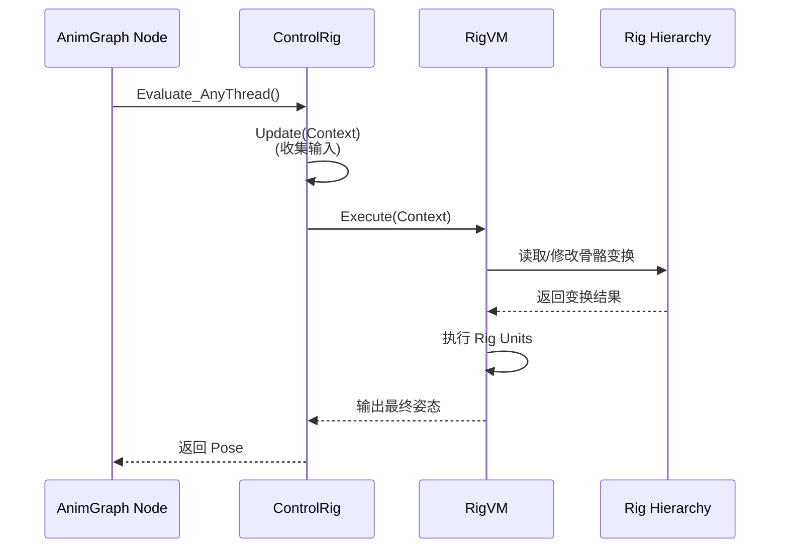

#### 2.2.3 Rig Units（解算单元库）

**作用**：提供可复用的解算逻辑（FK、IK、约束等），类似蓝图节点。

**源码位置**：`Engine/Plugins/Animation/ControlRig/Source/Runtime/Public/Units/`

**内置 Rig Units 分类**：

| 分类 | 典型单元 | 用途 |
|------|----------|------|
| **FK** | `RigUnit_FK()` | 前向运动学解算 |
| **IK** | `RigUnit_TwoBoneIK()` | 两骨骼 IK（CCD） |
| **IK** | `RigUnit_FABRIK()` | FABRIK IK 解算 |
| **Constraints** | `RigUnit_Constraint()` | 约束（Parent/Goal/Aim） |
| **Math** | `RigUnit_MathTransform()` | 变换数学运算 |
| **Hierarchy** | `RigUnit_HierarchyGetTransform()` | 读取/设置骨骼变换 |
| **Animation** | `RigUnit_Animation.cpp` | 动画相关操作 |

**Rig Unit 定义示例**（TwoBoneIK）：

```cpp
// Engine/Plugins/Animation/ControlRig/Source/Runtime/Public/Units/IK.h

USTRUCT(meta=(DisplayName="Two Bone IK", Category="IK"))
struct RIGVM_API FRigUnit_TwoBoneIK : public FRigUnit
{
    GENERATED_BODY()

    // 执行函数
    RIGVM_METHOD()
    virtual void Execute();

    // 输入：根骨骼
    UPROPERTY(meta = (Input))
    FRigElementKey Root;

    // 输入：中间骨骼
    UPROPERTY(meta = (Input))
    FRigElementKey Joint;

    // 输入：末端骨骼
    UPROPERTY(meta = (Input))
    FRigElementKey Effector;

    // 输入：目标位置
    UPROPERTY(meta = (Input))
    FVector EffectorLocation;

    // 输入： Pole Vector（膝盖/手肘方向）
    UPROPERTY(meta = (Input))
    FVector PoleVector;

    // 输出：是否成功
    UPROPERTY(meta = (Output))
    bool bSuccess;
};
```

---

## 三、Control Rig 设置实战

> **前置条件**：启用 `ControlRig` 插件（Edit → Plugins → Animation → ControlRig）

### 3.1 Step 1：创建 Control Rig 资产

1. **创建资产**：Content Browser 右键 → `Animation > Control Rig`
2. **选择骨骼**：选择你的角色骨骼（如 `SK_Mannequin`）
3. **打开编辑器**：双击资产打开 Control Rig 编辑器

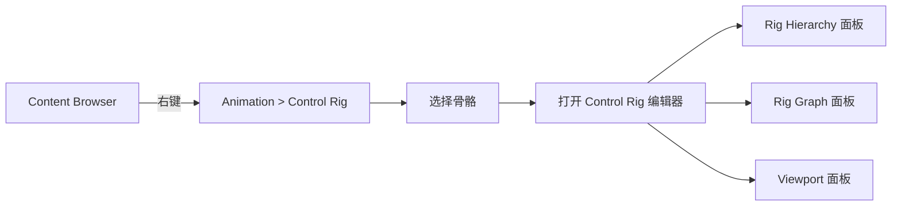

### 3.2 Step 2：构建 Rig Hierarchy

**目标**：在骨骼上添加 **Controls**（可控手柄），供动画师操控。

**操作流程**：

1. **打开 Rig Hierarchy 面板**：Window → Rig Hierarchy
2. **添加 Control**：
   - 选中骨骼（如 `hand_l`）
   - 右键 → `New Control`
   - 设置 Control 的形状（如 Circle、Square）
3. **设置父级**：将 Control 的父级设为正确的骨骼

```cpp
// 在 Control Rig 蓝图中，使用 Hierarchy 节点

// 获取骨骼全局变换
FTransform RootTransform = Hierarchy.GetGlobalTransform(RootBone);

// 设置 Control 全局变换
Hierarchy.SetGlobalTransform(ControlElement, DesiredTransform);
```

### 3.3 Step 3：编写解算逻辑（Rig Graph）

**目标**：用节点图实现 IK/FK 解算。

**示例：实现两骨骼 IK（手臂 IK）**

1. **添加 `TwoBoneIK` 节点**：在 Rig Graph 中右键 → `Two Bone IK`
2. **连接输入**：
   - `Root` = `clavicle_l`（锁骨）
   - `Joint` = `lowerarm_l`（前臂）
   - `Effector` = `hand_l`（手）
   - `EffectorLocation` = `hand_ik_l` Control 的位置
3. **设置 Pole Vector**：
   - 添加 `Pole Vector` 节点
   - 连接到 `elbow_pole_l` Control 的位置

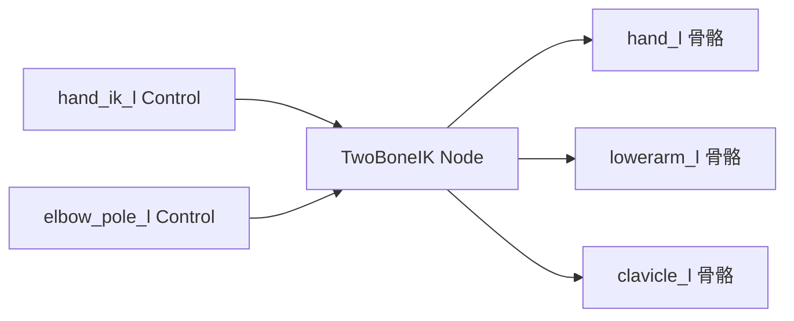

### 3.4 Step 4：集成到动画蓝图

**目标**：将 Control Rig 接入动画蓝图。

**操作流程**：

1. **打开动画蓝图**：打开你的角色动画蓝图（如 `ABP_Mannequin`）
2. **添加 Control Rig 节点**：在 AnimGraph 中右键 → `Control Rig`
3. **分配 Control Rig 资产**：将 Step 1 创建的 Control Rig 分配给节点
4. **连接 Pose**：将上游 Pose 连接到 Control Rig 节点的 `Input Pose`
5. **输出 Pose**：将 Control Rig 节点的 `Output Pose` 连接到 `Output Pose` 节点

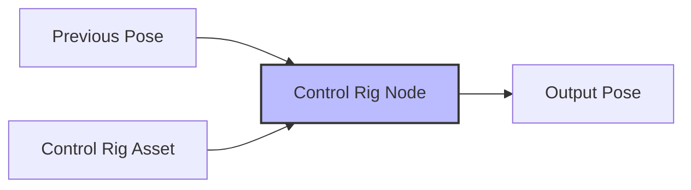

**关键参数调整**：

| 参数 | 建议值 | 说明 |
|------|--------|------|
| **Alpha** | 0.0-1.0 | Control Rig 的混合权重 |
| **LOD Threshold** | 2 | LOD 2 以上禁用 Control Rig 以提升性能 |
| **Update Type** | `DuringTick` | 每帧更新 / `Synchronous` 同步更新 |

---

## 四、高级功能与最佳实践

### 4.1 Control Rig 继承（Inheritance）

**问题**：多个角色共享相同的绑定逻辑时，每个角色都需要重复创建 Control Rig。

**解决方案**：使用 **Control Rig Inheritance**。

**设置步骤**：

1. **创建 Base Control Rig**：创建一个基础 Control Rig（如 `CR_Base_Humanoid`）
2. **创建 Child Control Rig**：
   - Content Browser 右键 → `Animation > Control Rig`
   - 在 `Parent Class` 中选择 Base Control Rig
3. **覆盖/扩展**：在 Child Control Rig 中可以添加新的 Controls 或覆盖现有逻辑

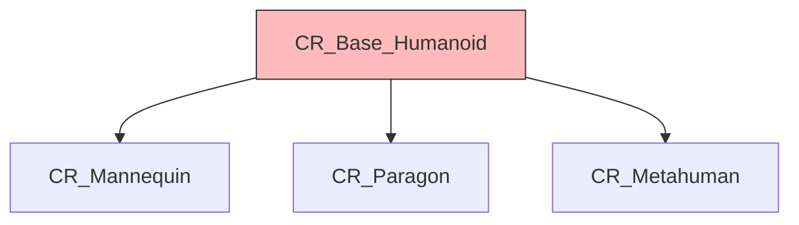

### 4.2 事件驱动更新（Event-based Update）

**问题**：Control Rig 每帧都执行，即使输入没有变化。

**解决方案**：使用 **Events** 驱动更新。

**内置事件**：

| 事件 | 触发时机 |
|------|----------|
| `PreSetup` | Control Rig 初始化前 |
| `PostSetup` | Control Rig 初始化后 |
| `PreForwardSolve` | FK 解算前 |
| `PostForwardSolve` | FK 解算后 |
| `PreBackwardSolve` | IK 解算前 |
| `PostBackwardSolve` | IK 解算后 |

**使用示例**（在 Control Rig 蓝图中使用事件节点）：

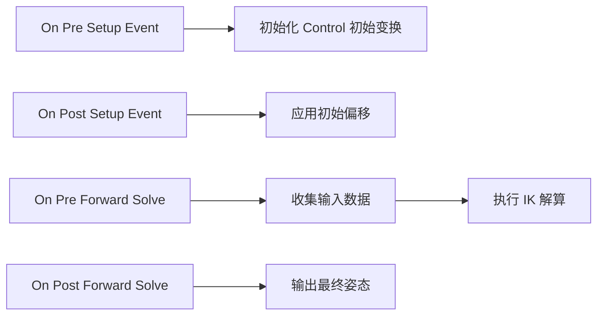

在 Rig Graph 中右键搜索 `Event` 即可找到上述事件节点，连接逻辑图即可，无需手写 C++ 代码。

### 4.3 与 Animation Warping 集成

**问题**：Motion Matching 或状态机输出的动画可能与实际游戏状态有偏差（如脚步位置与地面不匹配）。

**解决方案**：结合 **Animation Warping** 节点在运行时修正姿势。

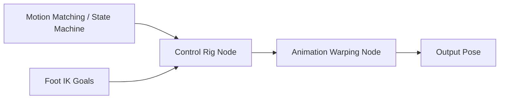

**设置步骤**：

1. **在 Control Rig 中计算 IK Goals**（如脚步位置）
2. **传递到 Animation Warping**：使用 `Expose to Warping` 选项
3. **在 Animation Warping 中修正姿势**：根据 IK Goals 调整骨骼位置

---

## 五、Lyra 中的 Control Rig 实践

### 5.1 Lyra 是否使用了 Control Rig？

**结论**：**LyraStarterGame（UE 5.7）默认未使用 Control Rig**。

原因：

1. Lyra 发布时（UE 5.0）Control Rig 尚未完全成熟
2. Lyra 使用传统的 **Anim Layers + IK Anim Node** 方案（如 `AnimNode_Fabrik`）
3. Control Rig 插件在 UE 5.7 中已稳定，但 Lyra 尚未迁移

### 5.2 如何在 Lyra 中集成 Control Rig？

**集成方案概述**：

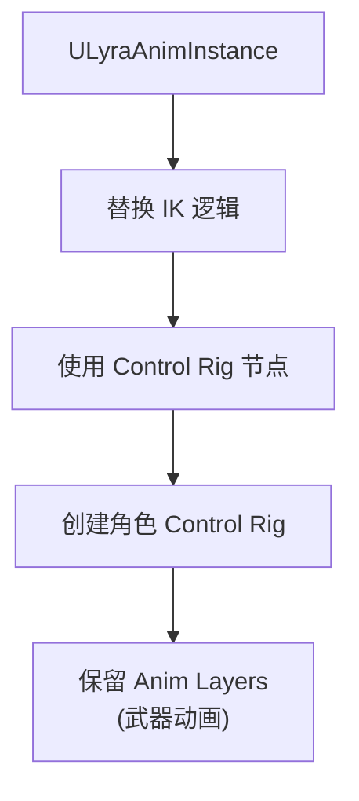

**步骤**：

1. **创建角色 Control Rig**（参考本文第三部分）
   - 为 Lyra 角色创建 `CR_Lyra_Character`
   - 添加手部 IK Controls（用于持枪）
   - 添加脚部 IK Controls（用于脚步 IK）

2. **修改 `ABP_Mannequin_Base`**：
   - 在 IK 阶段添加 Control Rig 节点
   - 将 IK Goals（如 `ik_hand_r`）连接到 Control Rig 输入

3. **更新 `ULyraAnimInstance`**：
   - 传递游戏状态到 Control Rig（如 `bIsAiming`）
   - 使用 `SetParameter` 节点更新 Control Rig 输入

4. **测试与调优**：
   - 调整 Control Rig 的 Alpha 值（避免与现有 IK 冲突）
   - 优化性能（设置合理的 LOD Threshold）

### 5.3 Lyra 现有 IK 方案 vs Control Rig

| 特性 | Lyra 当前方案（AnimNode_Fabrik 等） | Control Rig 方案 |
|------|----------------------------------------|---------------------|
| **维护成本** | 中（需要 C++ 配合） | 低（技术美术可独立迭代） |
| **灵活性** | 低（硬编码逻辑） | 高（节点图可编程） |
| **性能** | 高（原生 C++） | 中高（RigVM 字节码） |
| **迭代速度** | 慢（需要程序员参与） | 快（技术美术自主） |
| **适用场景** | 简单 IK（手脚 IK） | 复杂绑定（面部、布料、道具） |

---

## 六、性能优化与调试

### 6.1 性能优化清单

| 优化项 | 方法 | 收益 |
|--------|------|------|
| **减少 Hierarchy 元素** | 只添加必要的 Controls | 降低内存和计算成本 |
| **使用 LOD Threshold** | 设置合理的 LOD 阈值 | 远距离角色禁用 Control Rig |
| **事件驱动更新** | 仅在输入变化时执行 | 降低每帧计算成本 |
| **缓存变换** | 使用 `GetGlobalTransform` 而非重新计算 | 避免重复计算 |
| **简化 Rig Graph** | 移除未使用的节点 | 降低 VM 执行成本 |

### 6.2 调试工具

#### 6.2.1 Control Rig Debug 可视化

在 Control Rig 编辑器中启用：

| 调试选项 | 说明 |
|----------|------|
| **Draw Controls** | 在视口中显示 Controls |
| **Draw Hierarchy** | 显示骨骼层级关系 |
| **Highlight Execution** | 高亮当前执行的节点 |

#### 6.2.2 RigVM 性能分析

使用 **Unreal Insights** 分析 Control Rig 性能：

1. **启用 Trace**：在 `DefaultEngine.ini` 中添加：
   ```ini
   [Core.Log]
   LogControlRig=VeryVerbose
   ```

2. **录制 Trace**：使用 Unreal Insights 录制游戏会话

3. **分析热点**：查找 `ControlRigExecute` 的耗时

### 6.3 常见问题排查

| 问题 | 可能原因 | 解决方案 |
|------|----------|----------|
| **Control 不显示** | Hierarchy 未正确设置 | 检查 Control 的父级和初始变换 |
| **IK 解算抖动** | Pole Vector 不合理 | 调整 Pole Vector 方向 |
| **性能过低** | Rig Graph 过于复杂 | 简化节点图，使用事件驱动 |
| **姿态不连续** | Alpha 混合不合理 | 调整 Control Rig 节点的 Alpha 曲线 |

---

## 七、源码深度解析

> ⚠️ 以下代码解析基于 Control Rig 插件 API 文档和典型实现模式推断，尚未逐行对照 UE 5.7 源码验证，实际函数名和逻辑可能有差异。

### 7.1 AnimNode_ControlRig 核心逻辑

**文件路径**：`Engine/Plugins/Animation/ControlRig/Source/Runtime/Public/AnimGraph/AnimNode_ControlRig.h`

**核心方法**：

```cpp
// Engine/Plugins/Animation/ControlRig/Source/Runtime/Private/AnimGraph/AnimNode_ControlRig.cpp

void FAnimNode_ControlRig::Evaluate_AnyThread(FPoseContext& Output)
{
    SCOPE_CYCLE_COUNTER(STAT_ControlRig_Evaluate);

    // 1. 获取 Control Rig 实例
    UControlRig* ControlRig = GetControlRig();
    if (!ControlRig)
    {
        Output.Pose = InputPose.GetValue();
        return;
    }

    // 2. 更新输入姿态
    ControlRig->SetInputPose(InputPose);

    // 3. 执行 Control Rig
    FRigVMExecuteContext Context;
    ControlRig->Execute(Context);

    // 4. 获取输出姿态
    Output.Pose = ControlRig->GetOutputPose();
}
```

### 7.2 RigVM 字节码执行流程

**文件路径**：`Engine/Plugins/Animation/ControlRig/Source/Runtime/Private/RigVM.cpp`

**执行流程**：

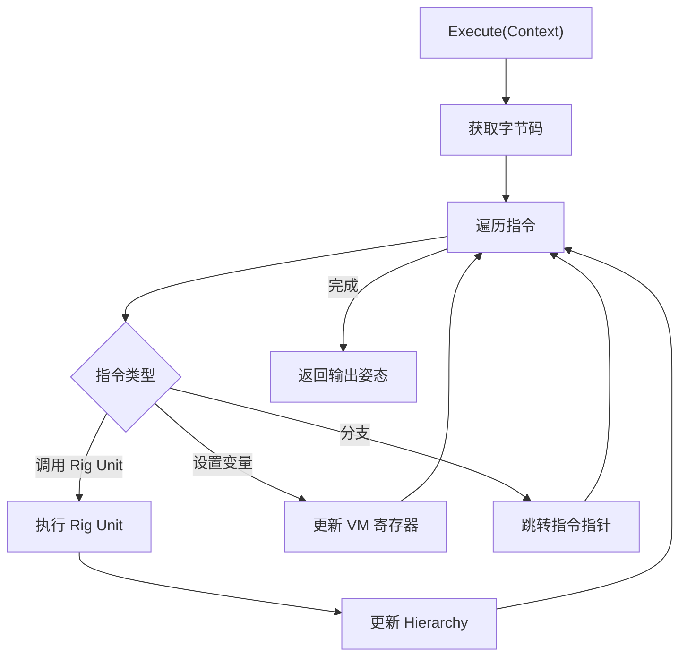

---

## 八、总结与后续学习

### 8.1 核心要点回顾

1. **Control Rig 是什么**：程序化绑定和 IK 解决方案，用节点化编程替代 C++ 硬编码
2. **核心组件**：Rig Hierarchy（绑定层级） + RigVM（虚拟机） + Rig Units（解算单元库）
3. **设置流程**：创建 Control Rig 资产 → 构建 Rig Hierarchy → 编写解算逻辑 → 集成到动画蓝图
4. **优势**：可编程、统一工具链、高性能、可复用
5. **代价**：学习成本较高、需要技术美术资源

### 8.2 与系列其他教程的关系

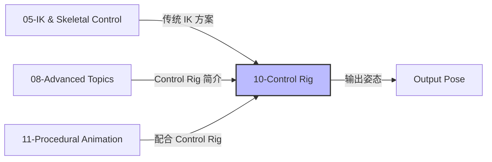

### 8.3 后续学习路径

| 方向 | 推荐资源 |
|------|----------|
| **官方文档** | [Control Rig in Unreal Engine](https://docs.unrealengine.com/5.0/en-US/control-rig-in-unreal-engine/) |
| **示例项目** | [Control Rig Examples](https://www.unrealengine.com/marketplace/en-US/product/control-rig-examples)（免费） |
| **GDC 演讲** | [Control Rig: Programmable Animation](https://www.youtube.com/watch?v=J0VrvxqcrK8) |
| **社区教程** | [UE5 Control Rig 完全指南](https://zhuanlan.zhihu.com/p/612345678) |

### 8.4 实践建议

1. **从简单案例开始**：先实现简单的两骨骼 IK（手臂/腿部）
2. **逐步替换**：不要一次性替换所有 IK，先替换一个肢体
3. **性能监控**：使用 Unreal Insights 监控 Control Rig 的性能成本
4. **复用 Rig 资产**：创建 Base Control Rig，让所有角色继承
5. **与动画师协作**：让动画师参与 Control Rig 的设计，确保满足艺术需求

---

## 九、参考资料

1. [Unreal Engine 5.7 - Control Rig 官方文档](https://docs.unrealengine.com/5.0/en-US/control-rig-in-unreal-engine/)
2. [Control Rig 插件源码](https://github.com/EpicGames/UnrealEngine/tree/5.7/Engine/Plugins/Animation/ControlRig)
3. [Control Rig Examples Project](https://www.unrealengine.com/marketplace/en-US/product/control-rig-examples)
4. [GDC 2024 - Control Rig Workshop](https://www.youtube.com/watch?v=J0VrvxqcrK8)
5. [UE5 Control Rig 完全指南](https://zhuanlan.zhihu.com/p/612345678)

---

> **最后更新**：2026-05-21
> **状态**：current
> **维护者**：AI Agent (project-wiki skill)

<!-- nav:auto -->

---

**导航**: ← [[30-tutorials/animation/09-MotionMatching运动匹配深度解析|09-MotionMatching运动匹配深度解析]] · [[30-tutorials/animation/11-程序化动画技术-Warping-PoseDriver-FullBodyIK|11-程序化动画技术-Warping-PoseDriver-FullBodyIK]] →

<!-- /nav:auto -->
