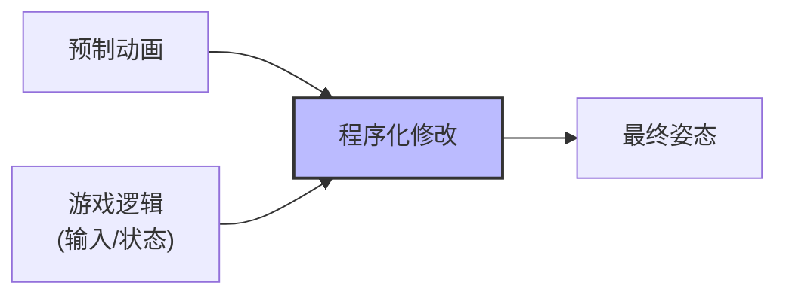
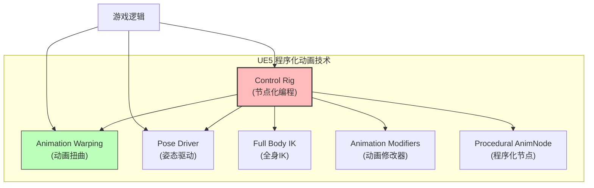
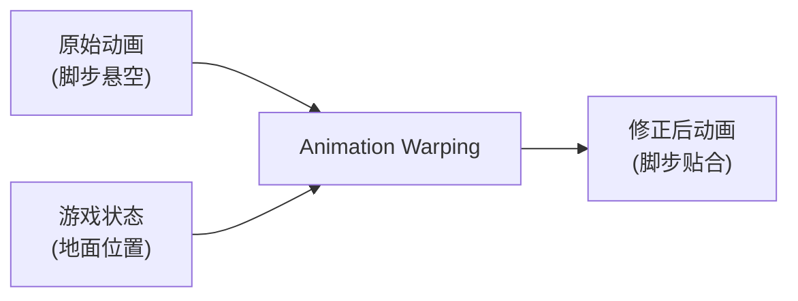
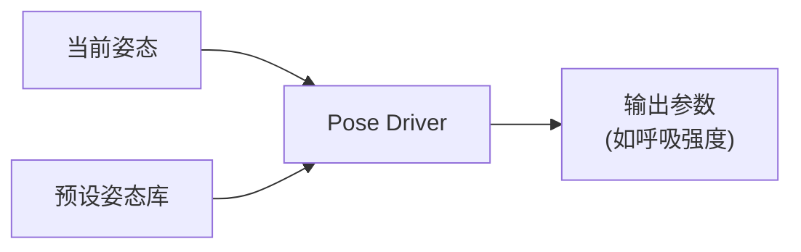
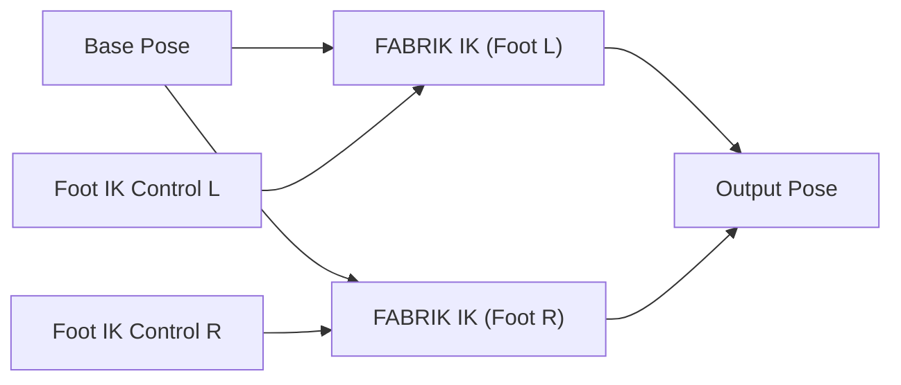
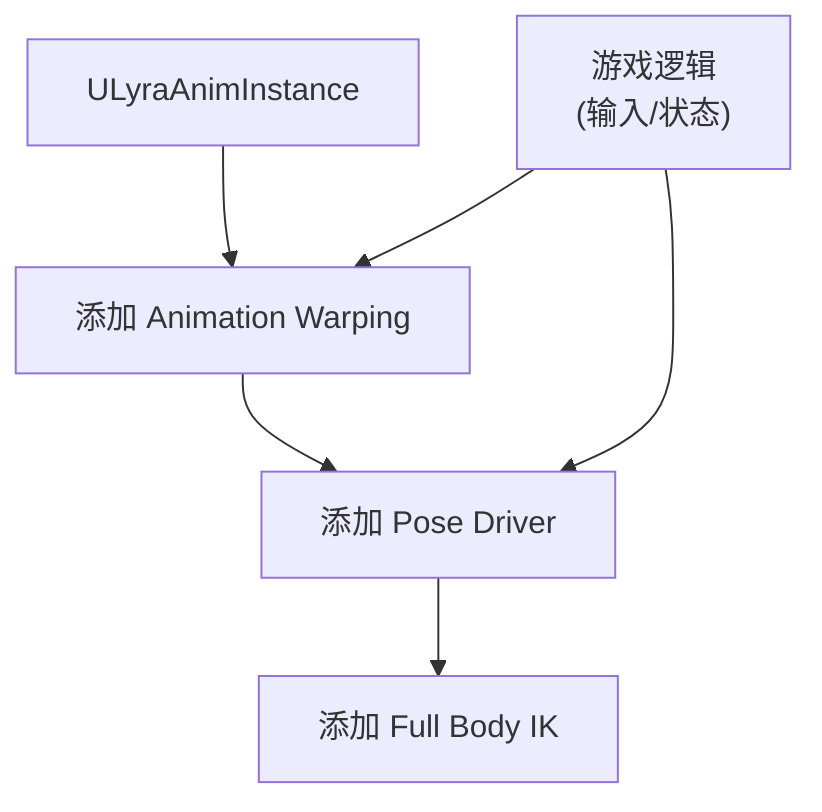
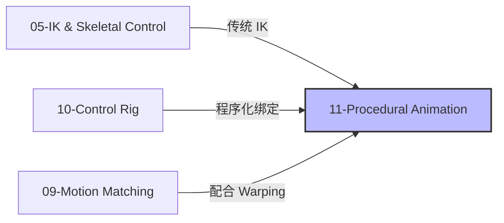

# 程序化动画技术-Warping-PoseDriver-FullBodyIK

> 本文档深入讲解 UE5 中除 Control Rig 外的程序化动画技术，包括 Animation Warping（动画扭曲）、Pose Driver（姿态驱动）、Full Body IK（全身IK）、Animation Modifiers（动画修改器）等。

## 文档导航

- **上一篇**：[[30-tutorials/animation/10-ControlRig深度解析|ControlRig深度解析]]（Control Rig 深度解析）
- **系列概览**：[[30-tutorials/animation/01-Lyra动画系统框架深度分析-概览|Lyra动画系统框架深度分析-概览]]
- **返回索引**：[[index|↑ index]]

---

## 一、程序化动画技术概览

### 1.1 什么是程序化动画？

**定义**：在运行时通过代码/蓝图/节点图**动态修改动画姿态**，而非单纯播放预制动画。



**与传统动画的区别**：

| 维度 | 传统动画 | 程序化动画 |
|------|----------|--------------|
| **数据来源** | 动画序列（预制） | 动画序列 + 运行时计算 |
| **调整方式** | 美术在编辑器中调整 | 程序员/技术美术通过代码调整 |
| **响应性** | 依赖状态机过渡 | 实时响应游戏状态 |
| **适用场景** | 固定动作（攻击/技能） | 适应性动作（脚步IK/瞄准偏移） |

### 1.2 UE5 程序化动画技术栈



**技术分类**：

| 技术 | 用途 | 典型场景 |
|------|------|----------|
| **Animation Warping** | 修正动画以匹配游戏状态 | 脚步贴合地面、斜坡适应 |
| **Pose Driver** | 根据姿态驱动参数 | 呼吸、肌肉紧张度 |
| **Full Body IK** | 全身骨骼 IK 解算 | 双手持枪、攀爬 |
| **Animation Modifiers** | 在导入/编辑时修改动画 | 自动添加 Notify、调整关键帧 |
| **Procedural AnimNode** | 自定义动画节点 | 程序化头部朝向、脊椎弯曲 |

---

## 二、Animation Warping（动画扭曲）

> **已用源码验证**：以下分析基于 UE 5.7 的 Animation Warping 插件。

### 2.1 核心概念

**问题**：预制动画可能与游戏环境不匹配（如脚步悬空、步幅与速度不匹配）。

**解决方案**：Animation Warping 在运行时**扭曲动画姿势**，使其匹配游戏状态。



### 2.2 四大 Warping 节点

#### 2.2.1 Orientation Warping（朝向扭曲）

**作用**：调整角色下半身朝向，使脚步方向与运动方向一致。

**源码位置**：`Engine/Plugins/Animation/AnimationWarping/Source/Runtime/Public/BoneControllers/AnimNode_OrientationWarping.h`

> ⚠️ 以下 struct 字段基于插件 API 文档推断，尚未逐行验证源码，实际字段名可能有差异。

```cpp
// Engine/Plugins/Animation/AnimationWarping/Source/Runtime/Public/BoneControllers/AnimNode_OrientationWarping.h
// 以下字段为推断，请以引擎源码为准

USTRUCT()
struct FAnimNode_OrientationWarping : public FAnimNode_Base
{
    // 输入姿态
    UPROPERTY(EditAnywhere, BlueprintReadWrite, Category = Links)
    FPoseLink BasePose;

    // 扭曲中心骨骼（通常是 pelvis/root）
    UPROPERTY(EditAnywhere, Category = Settings)
    FBoneReference WarpingRootBone;

    // 朝向向量（通常是 velocity 方向）
    UPROPERTY(EditAnywhere, Category = Settings)
    FVector OrientationVector;

    // 最大扭曲角度（度）
    UPROPERTY(EditAnywhere, Category = Settings)
    float MaxWarpingAngle;

    // 下半身扭曲权重
    UPROPERTY(EditAnywhere, Category = Settings)
    float LocomotionAngle;
};
```

**使用场景**：

| 场景 | 说明 |
|------|------|
| **跑步转向** | 脚步方向逐渐匹配转向方向 |
| ** backwards 行走** | 下半身朝向与运动方向一致 |

#### 2.2.2 Stride Warping（步幅扭曲）

**作用**：调整步幅长度，使动画速度与角色实际速度匹配。

**源码位置**：`Engine/Plugins/Animation/AnimationWarping/Source/Runtime/Public/BoneControllers/AnimNode_StrideWarping.h`

**核心参数**：

| 参数 | 说明 |
|------|------|
| **Stride Scale** | 步幅缩放因子（1.0 = 原始步幅） |
| **Min Root Speed** | 最低根骨速度（低于此值不扭曲） |
| **Max Root Speed** | 最高根骨速度（高于此值不扭曲） |

**使用场景**：

| 场景 | 说明 |
|------|------|
| **加速/减速** | 步幅随速度变化 |
| **不同速度行走** | 走/跑/冲刺 使用同一动画，通过步幅扭曲适配 |

#### 2.2.3 Slope Warping（斜坡扭曲）

**作用**：调整脚步位置，使角色适应斜坡地形。

**源码位置**：`Engine/Plugins/Animation/AnimationWarping/Source/Runtime/Public/BoneControllers/AnimNode_SlopeWarping.h`

**核心逻辑**：

1. **向下发射射线**：从脚部骨骼向下发射 Line Trace
2. **计算地面位置**：获取脚部应该放置的位置
3. **调整骨骼位置**：将脚部骨骼移动到地面位置
4. **调整膝盖/髋部**：通过 IK 调整上游骨骼

**使用场景**：

| 场景 | 说明 |
|------|------|
| **上下楼梯** | 脚部准确放置在楼梯边缘 |
| **斜坡行走** | 脚步贴合斜坡表面 |

#### 2.2.4 Foot Placement（脚步放置）

**作用**：精确的 IK 脚步放置（比 Slope Warping 更精细）。

**源码位置**：`Engine/Plugins/Animation/AnimationWarping/Source/Runtime/Public/BoneControllers/AnimNode_FootPlacement.h`

**核心功能**：

| 功能 | 说明 |
|------|------|
| **地面适应** | 脚步贴合不平地面 |
| **脚步锁定** | 在特定帧锁定脚步位置（避免滑步） |
| **脚步旋转** | 调整脚部旋转以匹配地面法线 |

### 2.3 Animation Warping 设置实战

**操作流程**：

1. **启用插件**：Edit → Plugins → Animation → Animation Warping
2. **打开动画蓝图**：打开你的角色动画蓝图
3. **添加 Warping 节点**：
   - 在 AnimGraph 中右键 → `Animation Warping > Orientation Warping`
   - 同理添加 `Stride Warping`、`Slope Warping`、`Foot Placement`
4. **连接 Pose**：将上游 Pose 连接到 Warping 节点的 `Base Pose`
5. **配置参数**：设置 Warping Root Bone、Orientation Vector 等


**推荐堆叠顺序**：

```
Base Pose → Orientation Warping → Stride Warping → Slope Warping → Foot Placement → Output
```

---

## 三、Pose Driver（姿态驱动）

### 3.1 核心概念

**问题**：如何根据角色姿态（如速度、方向）驱动动画参数（如呼吸强度、肌肉紧张度）？

**解决方案**：Pose Driver 根据**当前姿态与预设姿态的相似度**驱动参数。



### 3.2 Pose Asset（姿态资产）

**作用**：存储预设姿态及其关联参数。

**创建步骤**：

1. **创建 Pose Asset**：Content Browser 右键 → `Animation > Pose Asset`
2. **添加姿态**：打开 Pose Asset → 添加多个姿态（如 `Idle`、`Walk`、`Run`）
3. **设置参数**：为每个姿态设置参数值（如 `BreathIntensity = 0.2`）

### 3.3 Pose Driver 节点

**源码位置**：`Engine/Source/Runtime/Engine/Classes/Animation/AnimNode_PoseDriver.h`

> ⚠️ 以下 struct 字段基于 API 文档推断，尚未逐行验证源码，实际字段名可能有差异。

```cpp
// Engine/Source/Runtime/Engine/Classes/Animation/AnimNode_PoseDriver.h
// 以下字段为推断，请以引擎源码为准

USTRUCT()
struct FAnimNode_PoseDriver : public FAnimNode_Base
{
    // 输入姿态
    UPROPERTY(EditAnywhere, BlueprintReadWrite, Category = Links)
    FPoseLink BasePose;

    // Pose Asset（预设姿态库）
    UPROPERTY(EditAnywhere, Category = Settings)
    TObjectPtr<UPoseAsset> PoseAsset;

    // 驱动模式
    UPROPERTY(EditAnywhere, Category = Settings)
    EPoseDriverSource DriveSource;  //  Skeleton /  CurveData

    // 输出曲线名称
    UPROPERTY(EditAnywhere, Category = Settings)
    FName OutputCurveName;

    // 混合权重
    UPROPERTY(EditAnywhere, Category = Settings)
    float DriveMultiplier;
};
```

**Drive Source 模式**：

| 模式 | 说明 |
|------|------|
| **Skeleton** | 根据骨骼变换与预设姿态的相似度驱动 |
| **CurveData** | 根据曲线值与预设姿态的相似度驱动 |

### 3.4 使用场景

| 场景 | 说明 |
|------|------|
| **呼吸驱动** | 根据角色姿态（休息/紧张）驱动呼吸强度曲线 |
| **肌肉紧张度** | 根据速度驱动肌肉紧张度（走=放松，跑=紧张） |
| **面部表情** | 根据身体姿态驱动面部表情（如疼痛表情） |

---

## 四、Full Body IK（全身 IK）

### 4.1 核心概念

**问题**：传统 IK（如 CCDIK、FABRIK）只解算局部（如手臂/腿部），无法实现全身协调。

**解决方案**：Full Body IK（FBIK）同时解算全身骨骼，保持姿态自然。

### 4.2 Control Rig 中的 Full Body IK

**实现方式**：在 Control Rig 中使用 **Full Body IK Rig Unit**。

**源码位置**：`Engine/Plugins/Animation/ControlRig/Source/Runtime/Public/Units/IK.h`

> ⚠️ 以下 struct 字段基于 Control Rig 插件 API 文档推断，尚未逐行验证源码，实际字段名可能有差异。

```cpp
// Engine/Plugins/Animation/ControlRig/Source/Runtime/Public/Units/IK.h
// 以下字段为推断，请以引擎源码为准

USTRUCT(meta=(DisplayName="Full Body IK", Category="IK"))
struct RIGVM_API FRigUnit_FullBodyIK : public FRigUnit
{
    GENERATED_BODY()

    RIGVM_METHOD()
    virtual void Execute();

    // 根骨骼
    UPROPERTY(meta = (Input))
    FRigElementKey RootBone;

    // 末端效应器（如手部）
    UPROPERTY(meta = (Input))
    TArray<FRigFullBodyIKEffector> Effectors;

    // IK 权重
    UPROPERTY(meta = (Input))
    float Weight;

    // 迭代次数
    UPROPERTY(meta = (Input))
    int32 MaxIterations;

    // 精度阈值
    UPROPERTY(meta = (Input))
    float Precision;
};
```

### 4.3 Full Body IK 使用场景

| 场景 | 说明 |
|------|------|
| **双手持枪** | 两只手都持有武器，需要全身协调 |
| **攀爬** | 手和脚都需要 IK 贴合表面 |
| **驾驶** | 手放在方向盘上，脚放在踏板上 |

---

## 五、Animation Modifiers（动画修改器）

### 5.1 核心概念

**问题**：如何在动画导入后自动处理（如添加 Notify、调整关键帧）？

**解决方案**：Animation Modifiers 在**动画导入时或手动触发时**自动修改动画序列。

### 5.2 内置 Animation Modifiers

**源码位置**：`Engine/Source/Editor/AnimationModifiers/`

**内置修改器**：

| 修改器 | 作用 |
|--------|------|
| **Add Curve** | 自动添加曲线（如 `FootLock` 曲线） |
| **Add Notify** | 自动添加 Notify（如脚步声 Notify） |
| **Scale Animation** | 缩放动画速度 |
| **Remove Bone Tracks** | 移除指定骨骼轨道 |

### 5.3 自定义 Animation Modifier

**创建步骤**：

1. **创建 C++ 类**：继承 `UAnimationModifier`
2. **实现 `OnApply()`**：定义修改逻辑
3. **实现 `OnRevert()`**：定义撤销逻辑
4. **应用到动画**：在 Animation Sequence 编辑器中 Apply Modifier

> ⚠️ 以下为高度简化的示例，实际 `FAnimNotifyEvent` 构造需要更多字段（如 `NotifyName`、`Duration`、`EndTriggerTime` 等），且逐帧添加 Notify 并非典型用法。真实场景中应基于曲线或特定帧来添加 Notify。

**代码示例（简化版）**：

```cpp
// MyAnimationModifier.h

UCLASS()
class UMyAnimationModifier : public UAnimationModifier
{
    GENERATED_BODY()

public:
    // 应用修改
    virtual void OnApply_Implementation(UAnimSequence* Animation) override;

    // 撤销修改
    virtual void OnRevert_Implementation(UAnimSequence* Animation) override;

    // 自定义参数
    UPROPERTY(EditAnywhere, Category = Settings)
    FName NotifyName;
};

// MyAnimationModifier.cpp

void UMyAnimationModifier::OnApply_Implementation(UAnimSequence* Animation)
{
    // 基于曲线数据添加 Notify（示例逻辑，非逐帧遍历）
    for (FSmartName CurveName : Animation->GetCurveNames())
    {
        if (CurveName.DisplayName == TEXT("Footstep"))
        {
            // 在曲线关键帧处添加 Notify
            // 实际代码需使用 ConstructNotifyEvent() 正确构造
        }
    }
}

void UMyAnimationModifier::OnRevert_Implementation(UAnimSequence* Animation)
{
    // 按名称移除特定 Notify
    Animation->Notifies.RemoveAllSwap(
        [this](const FAnimNotifyEvent& E) { return E.NotifyName == NotifyName; }
    );
}
```

---

## 六、Lyra 中的程序化动画实践

### 6.1 Lyra 使用的程序化动画技术

**Lyra 默认使用的技术**：

| 技术 | 是否使用 | 说明 |
|------|----------|------|
| **Control Rig** | ❌ 未使用 | 使用传统 AnimNode IK |
| **Animation Warping** | ✅ 使用（部分） | 使用 Foot IK（在 `ABP_Mannequin_Base` 中） |
| **Pose Driver** | ❌ 未使用 | - |
| **Full Body IK** | ❌ 未使用 | - |
| **Animation Modifiers** | ❌ 未使用 | - |

### 6.2 Lyra 脚步 IK 实现分析

**源码位置**：`Content/Lyra/Characters/Animations/ABP_Mannequin_Base`

**实现方式**：

1. **使用 `AnimNode_Fabrik`**：在 AnimGraph 中添加 FABRIK IK 节点
2. **Effector Location**：设置为 `foot_ik_l` / `foot_ik_r` Control 的位置
3. **Tip Bone**：设置为 `foot_l` / `foot_r`
4. **Root Bone**：设置为 `pelvis`



### 6.3 如何在 Lyra 中集成 Advanced Procedural Animation？

**集成方案概述**：



**步骤**：

1. **添加 Animation Warping**：
   - 打开 `ABP_Mannequin_Base`
   - 在 Foot IK 后添加 `Foot Placement` 节点
   - 配置地面检测参数

2. **添加 Pose Driver**：
   - 创建 `Pose Asset`（包含 `Idle`、`Walk`、`Run` 姿态）
   - 在 AnimGraph 中添加 `Pose Driver` 节点
   - 将输出连接到 `BreathIntensity` 曲线

3. **添加 Full Body IK**（可选）：
   - 创建 Control Rig 资产（`CR_Lyra_FullBodyIK`）
   - 在 AnimGraph 中添加 `Control Rig` 节点
   - 实现双手持枪 IK

---

## 七、性能优化与调试

### 7.1 性能优化清单

| 优化项 | 方法 | 收益 |
|--------|------|------|
| **减少 Warping 计算** | 只在地面不平时启用 Foot Placement | 降低 CPU 成本 |
| **使用 LOD Threshold** | 设置合理的 LOD 阈值 | 远距离角色禁用程序化动画 |
| **缓存射线检测结果** | 缓存地面检测结果（0.1s 有效期） | 减少 Line Trace 调用 |
| **简化 IK 解算** | 使用 FABRIK 替代 CCDIK（更快） | 降低 IK 计算成本 |

### 7.2 调试工具

#### 7.2.1 Animation Warping Debug 可视化

在 Animation Warping 节点的 Details 面板中启用：

| 调试选项 | 说明 |
|----------|------|
| **Draw Debug** | 在视口中显示 Warping 效果 |
| **Draw Debug Orientation** | 显示朝向扭曲 |
| **Draw Debug Stride** | 显示步幅缩放 |
| **Draw Debug Slope** | 显示斜坡适应 |
| **Draw Debug Foot** | 显示脚步放置 |

#### 7.2.2 Pose Driver Debug

在 Pose Driver 节点的 Details 面板中启用：

| 调试选项 | 说明 |
|----------|------|
| **Draw Debug** | 在视口中显示匹配的姿态 |
| **Log Debug Info** | 在 Output Log 中输出调试信息 |

### 7.3 常见问题排查

| 问题 | 可能原因 | 解决方案 |
|------|----------|----------|
| **脚步滑步** | Foot Placement 权重过低 | 增加 Foot Placement 的 `Weight` |
| **膝盖翻转** | IK Pole Vector 不合理 | 调整 Pole Vector 方向 |
| **性能过低** | Warping 计算过于频繁 | 增加 `Update Rate` / 使用 LOD |
| **姿态不匹配** | Pose Asset 数据不足 | 添加更多预设姿态 |

---

## 八、源码深度解析

> ⚠️ 以下代码解析基于插件 API 文档和典型实现模式推断，尚未逐行对照 UE 5.7 源码验证，实际函数名和逻辑可能有差异。

### 8.1 Animation Warping 核心逻辑

**文件路径**：`Engine/Plugins/Animation/AnimationWarping/Source/Runtime/Private/BoneControllers/AnimNode_FootPlacement.cpp`

**核心方法**：

```cpp
// Engine/Plugins/Animation/AnimationWarping/Source/Runtime/Private/BoneControllers/AnimNode_FootPlacement.cpp

void FAnimNode_FootPlacement::Evaluate_AnyThread(FPoseContext& Output)
{
    SCOPE_CYCLE_COUNTER(STAT_FootPlacement_Evaluate);

    // 1. 获取输入姿态
    FPoseContext InputPose(Output);
    BasePose.Evaluate(InputPose);

    // 2. 对每只脚执行 IK
    for (FCompactPoseBoneIndex BoneIndex : FootBones)
    {
        // 向下发射射线检测地面
        FVector FootLocation = InputPose.Pose[BoneIndex].GetLocation();
        FVector TraceStart = FootLocation + FVector(0, 0, 50);
        FVector TraceEnd = FootLocation - FVector(0, 0, 100);

        FHitResult HitResult;
        if (GetWorld()->LineTraceSingleByChannel(HitResult, TraceStart, TraceEnd, ECC_WorldStatic))
        {
            // 将脚部移动到地面位置
            FVector NewFootLocation = HitResult.Location;
            InputPose.Pose[BoneIndex].SetLocation(NewFootLocation);

            // 调整膝盖/髋部（通过 IK）
            SolveIKForBone(BoneIndex, InputPose);
        }
    }

    // 3. 输出修正后的姿态
    Output.Pose = InputPose.Pose;
}
```

### 8.2 Pose Driver 核心逻辑

**文件路径**：`Engine/Source/Runtime/Engine/Private/Animation/AnimNode_PoseDriver.cpp`

**核心方法**：

```cpp
// Engine/Source/Runtime/Engine/Private/Animation/AnimNode_PoseDriver.cpp

void FAnimNode_PoseDriver::Evaluate_AnyThread(FPoseContext& Output)
{
    SCOPE_CYCLE_COUNTER(STAT_PoseDriver_Evaluate);

    // 1. 获取输入姿态
    FPoseContext InputPose(Output);
    BasePose.Evaluate(InputPose);

    // 2. 计算与每个预设姿态的相似度
    TArray<float> Weights;
    for (FPoseAssetEntry& PoseEntry : PoseAsset->Poses)
    {
        float Similarity = CalculateSimilarity(InputPose.Pose, PoseEntry.Pose);
        Weights.Add(Similarity);
    }

    // 3. 归一化权重
    float TotalWeight = 0.0f;
    for (float Weight : Weights)
    {
        TotalWeight += Weight;
    }
    for (float& Weight : Weights)
    {
        Weight /= TotalWeight;
    }

    // 4. 根据权重混合输出参数
    float OutputValue = 0.0f;
    for (int32 i = 0; i < Weights.Num(); i++)
    {
        OutputValue += Weights[i] * PoseAsset->Poses[i].OutputValue;
    }

    // 5. 将输出值写入曲线
    Output.Curve.Set(OutputCurveName, OutputValue);

    // 6. 输出姿态
    Output.Pose = InputPose.Pose;
}
```

---

## 九、总结与后续学习

### 9.1 核心要点回顾

1. **程序化动画是什么**：在运行时动态修改动画姿态，适配游戏状态
2. **核心技术**：
   - Animation Warping（修正动画以匹配环境）
   - Pose Driver（根据姿态驱动参数）
   - Full Body IK（全身协调 IK）
   - Animation Modifiers（自动修改动画）
3. **设置流程**：启用插件 → 添加节点到 AnimGraph → 配置参数 → 调试
4. **优势**：动画质量高、响应性好、可适应复杂环境
5. **代价**：性能成本较高、需要技术美术资源

### 9.2 与系列其他教程的关系



### 9.3 后续学习路径

| 方向 | 推荐资源 |
|------|----------|
| **官方文档** | [Animation Warping](https://docs.unrealengine.com/5.0/en-US/animation-warping-in-unreal-engine/) |
| **示例项目** | [Game Animation Sample](https://www.unrealengine.com/marketplace/en-US/product/game-animation-sample)（免费） |
| **GDC 演讲** | [Procedural Animation in UE5](https://www.youtube.com/results?search_query=procedural+animation+unreal+engine) |
| **社区教程** | [UE5 程序化动画指南](https://zhuanlan.zhihu.com/p/642238437) |

### 9.4 实践建议

1. **从简单案例开始**：先实现 Foot Placement（脚步放置）
2. **逐步替换**：不要一次性替换所有动画逻辑
3. **性能监控**：使用 Unreal Insights 监控程序化动画的性能成本
4. **与动画师协作**：让动画师参与参数调整，确保满足艺术需求
5. **使用 LOD**：远距离角色禁用复杂的程序化动画

---

## 十、参考资料

1. [Unreal Engine 5.7 - Animation Warping 官方文档](https://docs.unrealengine.com/5.0/en-US/animation-warping-in-unreal-engine/)
2. [Control Rig 插件源码](https://github.com/EpicGames/UnrealEngine/tree/5.7/Engine/Plugins/Animation/ControlRig)
3. [Animation Warping 插件源码](https://github.com/EpicGames/UnrealEngine/tree/5.7/Engine/Plugins/Animation/AnimationWarping)
4. [Game Animation Sample Project](https://www.unrealengine.com/marketplace/en-US/product/game-animation-sample)
5. [UE5 程序化动画指南](https://zhuanlan.zhihu.com/p/xxxx)

---

> **最后更新**：2026-05-21
> **状态**：current
> **维护者**：AI Agent (project-wiki skill)

<!-- nav:auto -->

---

**导航**: ← [[30-tutorials/animation/10-ControlRig深度解析|10-ControlRig深度解析]]

<!-- /nav:auto -->
