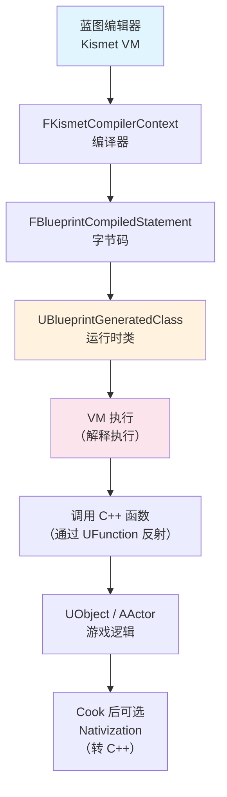
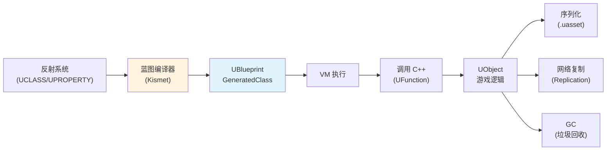

# UE蓝图系统从入门到实战

> 蓝图是 UE 的可视化脚本系统——它让设计师无需编写 C++ 代码就能实现游戏逻辑。但蓝图不是"简化版 C++"，而是一套完整的 **虚拟机（VM）+ 字节码** 系统。本系列将带你从"怎么用蓝图"深入到"蓝图是怎么工作的"。

## 概述

蓝图（Blueprint Visual Scripting）是 UE 的核心脚本系统，它有两条关键认知路线：

1. **设计师路线**：在蓝图编辑器中拖节点、连线，快速实现游戏逻辑（不需要 C++）
2. **程序员路线**：理解蓝图底层是 **Kismet VM 执行的字节码**，能与 C++ 双向调用，性能有特定开销

本系列覆盖**两条路线**：
- 前 3 篇：蓝图基础 + 底层架构（VM、编译、运行时类）
- 中 4 篇：C++ ↔ 蓝图交互、性能优化、高级主题
- 末 1 篇：Lyra 项目中的蓝图实战

## 蓝图在 UE 架构中的位置

蓝图系统与 UE 的其他核心系统有紧密的依赖关系：

| 系统 | 与蓝图的关系 |
|------|-------------|
| **反射系统（UHT）** | `UCLASS` / `UPROPERTY` / `UFUNCTION` 宏决定哪些 C++ 类/函数/属性可被蓝图访问；蓝图编译器依赖反射数据生成绑定代码 |
| **UObject 体系** | 蓝图的运行时类 `UBlueprintGeneratedClass` 继承自 `UClass`；蓝图实例是 `UObject` |
| **序列化系统** | 蓝图的节点图、属性默认值通过反射序列化到 `.uasset` 文件 |
| **网络复制** | 蓝图中的 `Replicated` 变量通过反射系统实现复制（与 C++ 完全一致） |
| **GC（垃圾回收）** | 蓝图中的属性引用通过 `UPROPERTY` 被 GC 追踪 |

## 本系列与其他教程系列的关系

| 系列 | 与本系列的关系 |
|------|----------------|
| **[[30-tutorials/ue-reflection/00-UE反射系统从入门到实战|UE 反射系统]]** | 本系列的**前置知识**。反射系统决定了"哪些 C++ 能被蓝图调用"。本系列从蓝图视角看反射，反射系列从 C++ 视角看暴露 |
| **[[30-tutorials/ue-framework/00-UE框架概述|UE 框架系列]]** | 蓝图是 `UObject`/`AActor` 体系的一部分。理解 `UObject` 生命周期有助于理解蓝图的 `BeginPlay`/`EndPlay` 等事件 |
| **[[30-tutorials/animation/02-UE5动画系统引擎基础框架深度分析|动画系统]]** | `UAnimInstance` 的派生类（`Animation Blueprint`）是蓝图的一种特殊类型，有独立的编译路径 |
| **[[30-tutorials/gas/00-GAS系统总览|GAS 系列]]** | GAS 的 `UGameplayAbility` 可用 C++ 或蓝图编写；本系列的 C++/蓝图交互篇会用到 GAS 作为案例 |

## 系列阅读指南

### 阶段一：基础概念（建议先读）

- **[[30-tutorials/blueprint-system/00-UE蓝图系统从入门到实战|📖 概览]]**（本课）**：**系列导航，蓝图全景图
- **[[30-tutorials/blueprint-system/01-蓝图基础概念|01 — 蓝图基础概念]]**：蓝图是什么、有哪些类型（Actor/Object/Widget/Anim Blueprint）、编辑器界面、从创建到运行的基本流程

### 阶段二：核心机制（理解底层）

- **[[30-tutorials/blueprint-system/02-蓝图VM与字节码|02 — 蓝图 VM 与字节码]]**：蓝图虚拟机原理、`FKismetCompilerContext` 编译流程、字节码结构、`EKismetCompiledStatementType`、Cook 后的 Nativization
- **[[30-tutorials/blueprint-system/03-UBlueprintGeneratedClass深度解析|03 — UBlueprintGeneratedClass 深度解析]]**：`UBlueprintCore` vs `UBlueprintGeneratedClass`、运行时类生成流程、CDO 与蓝图默认值、`SkeletonClass` 与 `ReinstanceData`

### 阶段三：C++ 交互与性能（实战关键）

- **[[30-tutorials/blueprint-system/04-C++与蓝图交互|04 — C++ 与蓝图交互]]**：从蓝图视角看 C++ 交互（`Call Function` 节点如何找到 C++ 函数）、`UFunction` 的 `FunctionFlags`、`FBlueprintFunctionLibrary` 设计模式、`Cast<>` 原理
- **[[30-tutorials/blueprint-system/05-蓝图继承与接口|05 — 蓝图继承与接口]]**：蓝图继承链、`GeneratedClass` 父子关系、Blueprint Interface、`IBlueprintNativeInterface`、多继承限制
- **[[30-tutorials/blueprint-system/06-蓝图性能分析与优化|06 — 蓝图性能分析与优化]]**：VM 执行开销、`Natvize Blueprint`（蓝图转 C++）、性能对比数据、何时用 C++ 替代蓝图
- **[[30-tutorials/blueprint-system/07-高级主题与常见陷阱|07 — 高级主题与常见陷阱]]**：蓝图宏（`BlueprintMacroLibrary`）、蓝图函数库、`Construction Script`、`Event Graph` vs `Function Graph`、常见编译错误

### 阶段四：Lyra 实战（综合应用）

- **[[30-tutorials/blueprint-system/08-Lyra项目中的蓝图实践|08 — Lyra 项目中的蓝图实践]]**：Lyra 的蓝图使用策略（C++ 负责底层，蓝图负责数据配置）、分析 `B_LyraGameInstance`、`B_LyraGameMode` 等蓝图资产、Lyra 如何避免蓝图性能瓶颈

## 前置知识

本系列假设你已经了解：

- **UE 框架基础**：`UObject`/`AActor`/`UWorld` 的基本概念（如果不了解，请先阅读 [[30-tutorials/ue-framework/40-actor-system/00-AActor架构概述|AActor 架构概述]]）
- **UE 反射系统**：`UCLASS`/`UPROPERTY`/`UFUNCTION` 宏的作用（如果不了解，请先阅读 [[30-tutorials/ue-reflection/01-反射是什么从C++到UHT|反射是什么]]）
- **基本 C++ 语法**：类、继承、指针、宏

## 核心概念速查

| 概念 | 说明 | 关键词 |
|------|------|--------|
| **UBlueprintCore** | 编辑器中的蓝图资产（`.uasset`），存储节点图和属性默认值 | `UBlueprint`, `UBlueprintGeneratedClass` |
| **UBlueprintGeneratedClass** | 编译后生成的运行时类，继承自 `UClass`，VM 执行时使用 | `GetBlueprintGeneratedClass()`, `GeneratedClass` |
| **Kismet VM** | 蓝图虚拟机，解释执行字节码（`FBlueprintCompiledStatement`） | `EKismetCompiledStatementType` |
| **FKismetCompilerContext** | 蓝图编译器核心，将节点图编译为字节码 | `Compile()`, `FKismetCompilerOptions` |
| **Nativization** | Cook 时将蓝图转换为 C++ 代码，消除 VM 开销 | `bNativizeBlueprint`, `Natvize Blueprint` |
| **Blueprint Interface** | 蓝图接口，定义函数签名供多个蓝图实现（类似 C++ 的纯虚函数） | `UBlueprintInterface`, `IBlueprintNativeInterface` |

## 相关页面

- [[30-tutorials/ue-reflection/00-UE反射系统从入门到实战|UE 反射系统概览]] — 前置知识：反射系统
- [[30-tutorials/ue-framework/40-actor-system/00-AActor架构概述|AActor 架构概述]] — 前置知识：UObject 体系
- [[30-tutorials/animation/02-UE5动画系统引擎基础框架深度分析|动画引擎基础框架]] — 动画蓝图的特殊编译路径
- [[30-tutorials/gas/01-GA简介与配置|GAS Ability 简介]] — GAS 与蓝图的交互案例

<!-- nav:auto -->

---

**导航**: [[30-tutorials/blueprint-system/01-蓝图基础概念|01-蓝图基础概念]] →

<!-- /nav:auto -->
