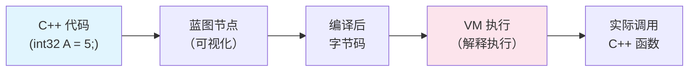
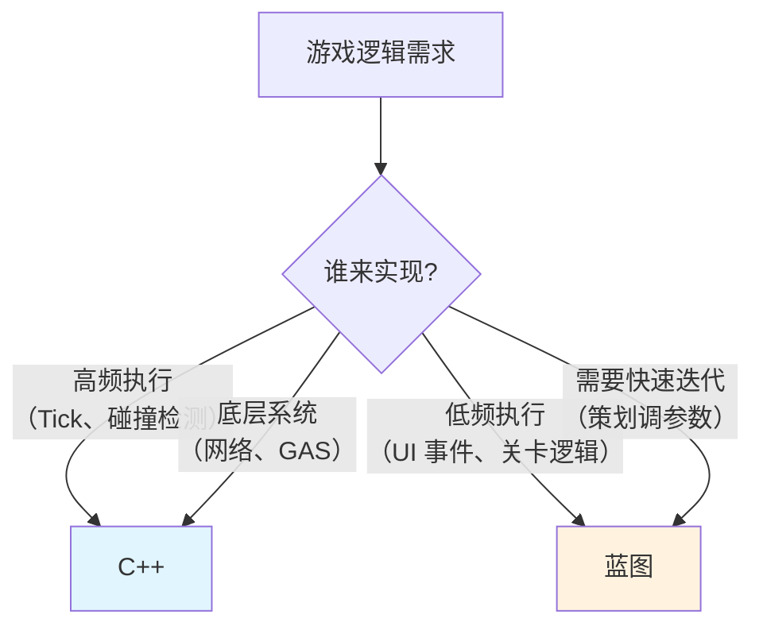
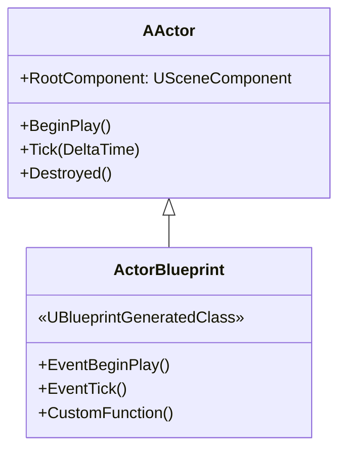
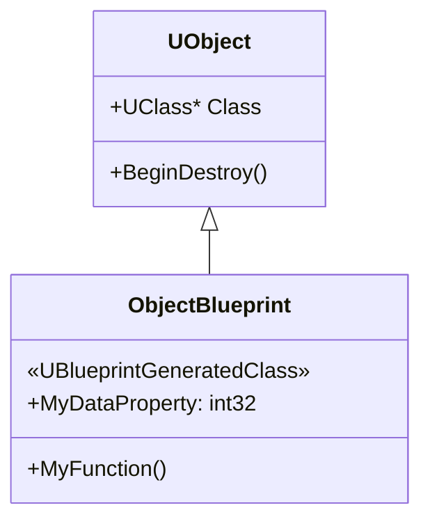
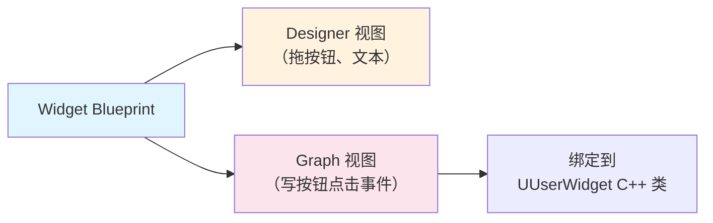
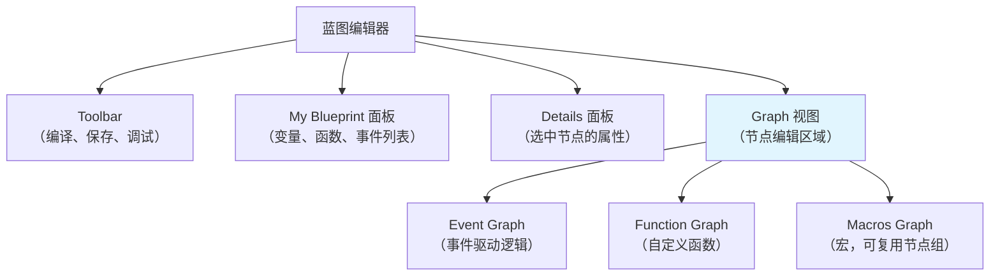
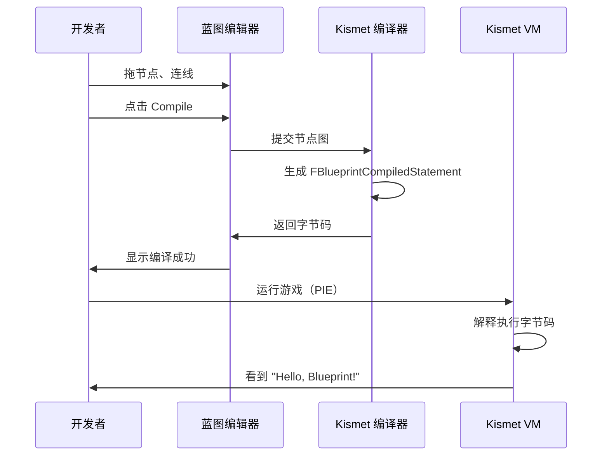
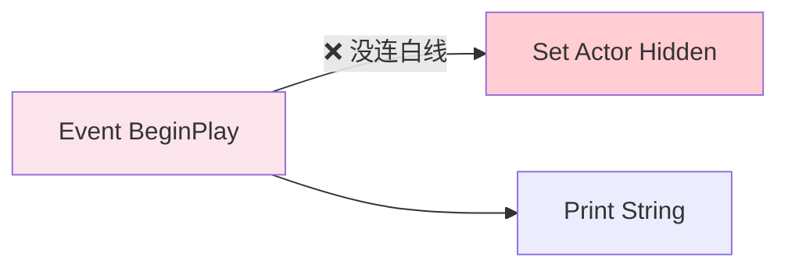
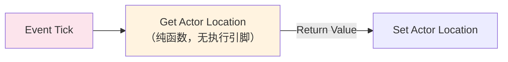

# 蓝图基础概念

> 蓝图不是"简化版 C++"——它是 UE 的可视化脚本系统，底层是一套完整的 **虚拟机（VM）+ 字节码** 架构。本课带你理解"蓝图是什么"，以及有哪些类型的蓝图。

## 概述

学完本课你将能够：
- 解释蓝图与 C++ 的关系（不是替代，是协作）
- 识别 4 种主要蓝图类型（Actor/Object/Widget/Anim）并知道何时使用哪种
- 理解蓝图编辑器的基本界面（节点、引脚、执行线）
- 创建并运行你的第一个蓝图

## 蓝图是什么？

### 概念直觉：蓝图 = 可视化的 C++ 函数调用图

如果把 C++ 代码看作"菜谱"（文本指令），蓝图就是"流程图"（可视化节点 + 连线）。



**关键认知**：
- 蓝图**不是**一种新编程语言
- 蓝图的每个节点，背后都是**对 C++ 函数/属性的调用**
- 蓝图编译后生成的是 **Kismet VM 字节码**，不是机器码

### 蓝图 vs C++：不是"谁更好"，是"各司其职"

| 维度 | 蓝图 | C++ |
|------|------|-----|
| **编写速度** | 快（拖节点、连线） | 慢（编译周期） |
| **执行速度** | 慢（VM 解释执行，约 C++ 的 10-50x 开销） | 快（原生机器码） |
| **适合人群** | 设计师、原型开发 | 程序员、底层系统 |
| **调试** | 节点高亮、断点 | Visual Studio 调试器 |
| **版本控制** | 二进制 `.uasset`（Diff 困难） | 文本文件（Diff 友好） |
| **Cook 后优化** | 可 Nativize（转 C++） | 本来就是 C++ |



## 蓝图类型：4 种主要类型

UE 中有多种蓝图类，最核心的是以下 4 种：

### 1. Actor 蓝图（最常用）

- **父类**：`AActor`（或派生类如 `ACharacter`、`APawn`）
- **用途**：可以放入关卡的实体（角色、武器、道具、触发器…）
- **特点**：有 `RootComponent`、`Tick`、`BeginPlay` 等事件
- **创建路径**：Content Browser → 右键 → **Blueprint Class** → 选择父类



### 2. Object 蓝图（数据容器）

- **父类**：`UObject`（或派生类）
- **用途**：纯数据对象、管理器、无法放入关卡的逻辑
- **特点**：没有 `Tick`，没有 `Transform`（位置/旋转）
- **创建路径**：Content Browser → 右键 → **Blueprint Class** → 搜索 `Object` 子类



### 3. Widget 蓝图（UMG UI）

- **父类**：`UUserWidget`
- **用途**：游戏 UI（血条、菜单、HUD）
- **特点**：有独立的 **Designer 视图**（拖 UI 控件）+ **Graph 视图**（写逻辑）
- **创建路径**：Content Browser → 右键 → **User Interface** → **Widget Blueprint**



### 4. Animation Blueprint（动画专用）

- **父类**：`UAnimInstance`（或 `UAnimInstance` 派生类）
- **用途**：控制 Skeletal Mesh 的动画状态机、混合空间
- **特点**：有 **Anim Graph**（动画节点图）+ **Event Graph**（逻辑）
- **创建路径**：Content Browser → 右键 → **Animation** → **Anim Blueprint**

> **注意**：Animation Blueprint 有独立的编译路径（`FAnimBlueprintCompilerContext`），与普通蓝图不同。详见 [[30-tutorials/animation/02-UE5动画系统引擎基础框架深度分析|动画引擎基础框架]]。

### 类型选择指南

| 需求 | 用哪种蓝图 |
|------|------------|
| "我想在关卡里放一个可交互物体" | Actor 蓝图 |
| "我想存储游戏数据（背包物品、任务状态）" | Object 蓝图（或 C++ `UObject` + `UPROPERTY`） |
| "我想做游戏 UI" | Widget 蓝图（UMG） |
| "我想控制角色动画（走、跑、跳）" | Animation Blueprint |
| "我想做 GameInstance 持久化逻辑" | Actor 蓝图（选 `GameInstance` 为父类）或 C++ |

## 蓝图编辑器界面速览

打开一个蓝图（双击 `.uasset`），你会看到：



### 核心概念：节点（Node）、引脚（Pin）、执行线（Exec Wire）

| 元素 | 外观 | 作用 |
|------|------|------|
| **节点（Node）** | 圆角矩形 | 表示一个函数调用或事件 |
| **执行引脚（Exec Pin）** | 白色箭头 | 控制执行顺序（`▶` 输入 → `▶` 输出） |
| **数据引脚（Data Pin）** | 彩色圆点 | 传递参数（输入引脚 = 参数，输出引脚 = 返回值） |
| **执行线（Exec Wire）** | 白线 | 连接执行引脚，表示"先执行 A，再执行 B" |

```mermaid
graph LR
    A["Event BeginPlay\n（事件节点）"] -->|"▶ 执行线"| B["Print String\n（函数节点）"]
    B -->|"In String\n（数据引脚）"| C["\"Hello!\"\n（字面量）"]

    style A fill:#fce4ec
    style B fill:#e1f5fe
    style C fill:#fff3e0
```

**关键规则**：
- 白线（执行线）决定**执行顺序**
- 彩色线（数据线）决定**参数值**
- 没有连白线的节点**不会执行**（除非是纯函数节点）

## 从创建到运行：完整流程

### 步骤 1：创建蓝图

1. Content Browser → 右键 → **Blueprint Class**
2. 选择父类（如 `Actor`）
3. 命名（如 `BP_MyActor`）
4. 双击打开编辑器

### 步骤 2：添加逻辑

1. 在 **Event Graph** 中右键 → 搜索 `Event BeginPlay`
2. 拖出 `▶` 引脚 → 搜索 `Print String`
3. 在 `In String` 引脚输入 `"Hello, Blueprint!"`
4. 点击 **Compile**（工具栏上的齿轮图标）



### 步骤 3：放入关卡并运行

1. 保存蓝图（Ctrl+S）
2. 拖入关卡（从 Content Browser 拖到视口）
3. 点击 **Play**
4. 观察输出（屏幕左上角或 Output Log）

## Lyra 中的蓝图：实战观察

Lyra 项目使用蓝图的方式是 **"C++ 负责底层，蓝图负责数据配置"**。

### 观察 1：`B_LyraGameInstance`

在 Content 根目录，你能找到 `B_LyraGameInstance.uasset`：

- **父类**：`ULyraGameInstance`（C++ 类）
- **作用**：处理游戏实例级事件（初始化、Shutdown、Online 子系统）
- **特点**：主要重写 `Init()` 和 `Shutdown()` 事件，调用 C++ 函数

```cpp
// 这是 C++ 父类（LyraGameInstance.h）
UCLASS()
class ULyraGameInstance : public UGameInstance
{
    GENERATED_BODY()
public:
    // 蓝图可重写的虚函数
    UFUNCTION(BlueprintImplementableEvent, Category="Lyra|GameInstance")
    void OnPreLogin();
};
```

蓝图中的对应节点：
```
Event Init → （蓝图逻辑） → Call C++ Function
```

### 观察 2：为什么 Lyra 不用蓝图写核心逻辑？

Lyra 的核心系统（GAS、网络复制、武器系统）都是 C++：

| 系统 | C++ | 蓝图 |
|------|-----|------|
| 角色 | `ALyraCharacter`（C++） | 少量派生蓝图（如 `B_Hero_ShooterGun`） |
| 武器 | `ULyraWeaponInstance`（C++） | 数据配置蓝图（`BP_Weapons` 系列） |
| GAS | `ULyraGameplayAbility`（C++） | 简单 Ability 可用蓝图，但 Lyra 全用 C++ |
| UI | `ULyraUIManagerComponent`（C++） | Widget 蓝图（UMG） |

**原因**：性能 + 版本控制 + 类型安全。

## 常见问题与陷阱

### 陷阱 1：白线没连，节点不执行



**解决**：确保所有需要执行的节点都有白线连接。

### 陷阱 2：纯函数节点没有执行引脚

`Get Actor Location`、`+（int）` 等**纯函数**没有白色执行引脚：
- 它们只在**数据线**被连接时才执行
- 它们不会出现在执行流中



### 陷阱 3：蓝图继承链混乱

如果一个蓝图继承自另一个蓝图（如 `BP_Parent` → `BP_Child`）：
- 子蓝图**不能**删除父蓝图的变量/函数
- 子蓝图**可以**重写（Override）父蓝图的函数
- 修改父蓝图 → **所有子蓝图受影响**

**最佳实践**：核心逻辑用 C++，蓝图只做数据覆盖（很像 Unity 的 Prefab 覆盖）。

## 总结与要点

| 要点 | 说明 |
|------|------|
| **蓝图 = 可视化 C++ 调用图** | 每个节点背后都是 C++ 函数 |
| **4 种主要类型** | Actor（放关卡）、Object（数据）、Widget（UI）、Anim（动画） |
| **白线 = 执行顺序** | 没连白线的节点不会执行 |
| **编译 = 生成字节码** | `FKismetCompilerContext` 将节点图编译为 `FBlueprintCompiledStatement` |
| **Lyra 的策略** | C++ 写核心，蓝图做数据配置 |

## 相关页面

- [[30-tutorials/blueprint-system/00-UE蓝图系统从入门到实战|蓝图系统概览]] — 系列导航
- [[30-tutorials/ue-reflection/02-核心宏详解|核心宏详解]] — `UCLASS`/`UPROPERTY` 如何暴露给蓝图
- [[30-tutorials/ue-framework/40-actor-system/00-AActor架构概述|AActor 架构概述]] — Actor 蓝图的 C++ 父类
- [[30-tutorials/animation/02-UE5动画系统引擎基础框架深度分析|动画引擎基础框架]] — Animation Blueprint 的独立编译路径

---
> 最后更新：2026-05-19

<!-- nav:auto -->

---

**导航**: ← [[30-tutorials/blueprint-system/00-UE蓝图系统从入门到实战|00-UE蓝图系统从入门到实战]] · [[30-tutorials/blueprint-system/02-蓝图VM与字节码|02-蓝图VM与字节码]] →

<!-- /nav:auto -->
