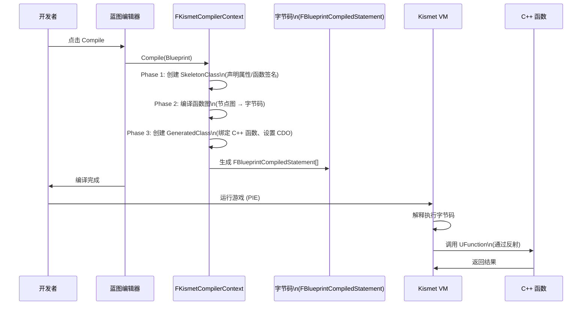
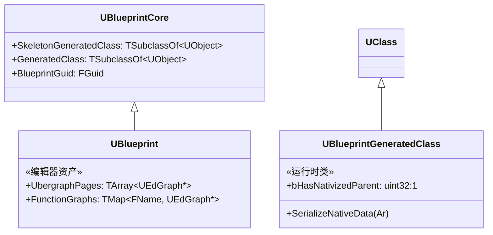
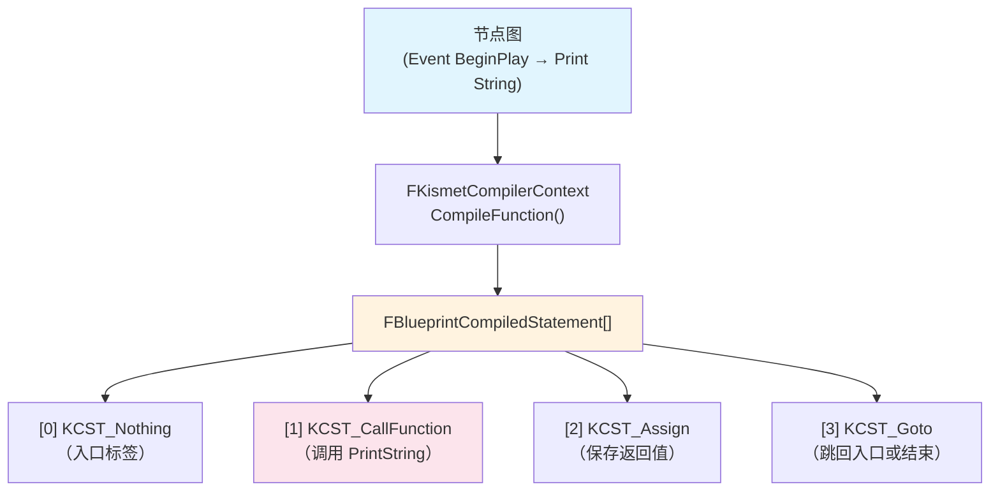
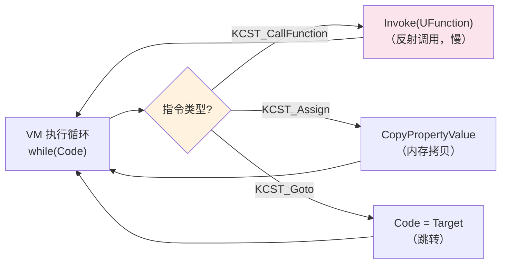
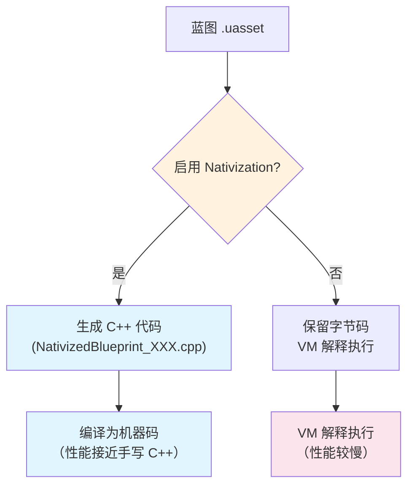

# 蓝图VM与字节码

> 蓝图不是"解释执行节点图"——编译时，Kismet 编译器将节点图转换为 **字节码（`FBlueprintCompiledStatement`）**，运行时由 **Kismet VM** 解释执行。本课深入蓝图编译的全流程。

## 概述

学完本课你将能够：
- 解释蓝图从"节点图"到"字节码"的完整编译流程
- 理解 `FKismetCompilerContext` 的核心作用
- 识别常见的 `EKismetCompiledStatementType`（字节码指令类型）
- 知道 Cook 时的 **Nativization**（蓝图转 C++）是如何工作的

## 蓝图编译全流程

蓝图编译不是"保存节点图"——它是一个**多阶段编译管道**，最终产出可供 VM 执行的字节码。



### 3 个关键产物

编译完成后，你会得到：

| 产物 | 类型 | 作用 | 生命周期 |
|-------|------|------|----------|
| **SkeletonClass** | `TSubclassOf<UObject>` | 声明属性/函数签名（编译早期生成，供编辑器反射） | 编辑器内临时，每次编译重建 |
| **GeneratedClass** | `UBlueprintGeneratedClass*` | **运行时实际使用的类**，包含字节码和 CDO | 保存到 `.uasset`，运行时加载 |
| **CDO** | `UObject*` | Class Default Object，存储属性的编译时默认值 | 与 GeneratedClass 一起加载 |



## FKismetCompilerContext：编译器核心

`FKismetCompilerContext` 是蓝图编译器的核心类，定义在 `Engine/Source/Editor/KismetCompiler/Public/KismetCompiler.h`。

### 核心成员解读

```cpp
// 文件：Engine/Source/Editor/KismetCompiler/Public/KismetCompiler.h
// 行号：约 L78-L200（基于 UE 5.7）

class FKismetCompilerContext : public FGraphCompilerContext
{
protected:
    // [1] 当前编译的蓝图
    UBlueprint* Blueprint;

    // [2] 新生成的运行时类（编译产物）
    UBlueprintGeneratedClass* NewClass;

    // [3] 上一次编译的旧类（用于热重载）
    UBlueprintGeneratedClass* OldClass;

    // [4] 节点处理器映射：UEdGraphNode 类型 → 编译处理函数
    TMap<TSubclassOf<UEdGraphNode>, FNodeHandlingFunctor*> NodeHandlers;

    // [5] 已编译的函数列表（每个函数对应一组字节码）
    TIndirectArray<FKismetFunctionContext> FunctionList;

    // [6] 合并后的事件图（Ubergraph）
    UEdGraph* ConsolidatedEventGraph;

    // [7] 编译选项（是否生成中间文件、是否跳过某些阶段等）
    FKismetCompilerOptions CompileOptions;
};
```

**关键设计**：
- **NodeHandlers**：每种节点类型（如 `UK2Node_CallFunction`、`UK2Node_IfThenElse`）都有对应的编译处理函数，编译器通过查表分派
- **FunctionList**：蓝图中的每个自定义函数 + Event Graph 都会被编译为一个 `FKismetFunctionContext`，包含该函数的字节码数组
- **ConsolidatedEventGraph**：所有 Event Graph 节点会被合并为一个"Ubergraph"（通过 `KismetTerm` 的 `StatementIndex` 实现跳转）

### 编译主流程（`Compile()` 函数）

```cpp
// 伪代码，展示编译主流程
void FKismetCompilerContext::Compile()
{
    // [1] 创建 SkeletonClass（声明属性/函数）
    CreateSkeletonClass();

    // [2] 编译所有函数图（节点图 → 字节码）
    for (UEdGraph* FunctionGraph : Blueprint->FunctionGraphs)
    {
        FKismetFunctionContext& FunctionContext = CreateFunctionContext(FunctionGraph);
        CompileFunction(FunctionContext);  // 核心：生成字节码
    }

    // [3] 处理 Event Graph（合并为 Ubergraph）
    ConsolidateEventGraphs();
    CompileUbergraph();

    // [4] 创建 GeneratedClass（绑定 C++ 函数、设置 CDO）
    CreateGeneratedClass();

    // [5] 热重载（替换旧类的所有实例）
    ReinstantiateOldInstances();
}
```

## 字节码：`FBlueprintCompiledStatement`

编译的核心产物是 **`FBlueprintCompiledStatement` 数组**——这就是蓝图的"机器码"。

### 字节码指令类型（`EKismetCompiledStatementType`）

UE 5.7 中定义了约 **40+ 种** 字节码指令，常见的有：

| 指令类型 | 作用 | 示例节点 |
|---------|------|---------|
| `KCST_Nothing` | 空指令（占位/对齐） | - |
| `KCST_CallFunction` | 调用 UFunction（C++ 或蓝图函数） | `Call Function` 节点 |
| `KCST_Assign` | 赋值（将 RHS 赋给 LHS） | `Set` 节点 |
| `KCST_Goto` | 跳转（条件/无条件） | `Branch` 节点 |
| `KCST_SwitchValue` | 多路分支 | `Switch` 节点 |
| `KCST_CallDelegate` | 调用委托 | `Bind` / `Call Delegate` 节点 |
| `KCST_CreateArray` / `CreateSet` / `CreateMap` | 创建容器 | `Make Array` 等节点 |
| `KCST_AddMulticastDelegate` | 绑定多播委托 | `Assign` 节点 |



### 字节码在内存中的表示

```cpp
// 简化表示（实际结构更复杂）
struct FBlueprintCompiledStatement
{
    EKismetCompiledStatementType Type;  // 指令类型
    FKismetTerm* LHS;                     // 左值（赋值目标）
    FKismetTerm* RHS;                     // 右值（源值）
    TArray<FKismetTerm*> FunctionInputs;  // 函数参数
    UFunction* FunctionToCall;            // 要调用的 C++ 函数
    int32 TargetOffset;                  // 跳转目标（Goto 用）
};
```

**关键点**：
- 每个 `FKismetTerm` 代表一个"值"：可以是字面量、变量引用、函数返回值
- `FunctionToCall` 是 `UFunction*`（C++ 反射数据），VM 通过它调用实际函数
- 字节码是**线性数组**，通过 `Goto` 指令实现循环/分支

## Kismet VM：运行时执行

编译后的字节码由 **Kismet VM** 解释执行。

### 执行流程（`UObject::ProcessInternal()`）

```cpp
// 伪代码，展示 VM 执行流程
void UObject::ProcessInternal(FFrame& Stack, RESULT_DECL)
{
    while (Stack.Code != nullptr)
    {
        FBlueprintCompiledStatement* Statement = Stack.Code;
        Stack.Code++;  // 移动到下一条指令

        switch (Statement->Type)
        {
            case KCST_CallFunction:
                // 通过反射调用 UFunction
                Statement->FunctionToCall->Invoke(Stack.Obj, Stack, RESULT_PARAM);
                break;

            case KCST_Assign:
                // 将 RHS 的值赋给 LHS
                CopyPropertyValue(Statement->LHS, Statement->RHS);
                break;

            case KCST_Goto:
                // 跳转：修改 Stack.Code 指针
                Stack.Code = &Stack.Code[Statement->TargetOffset];
                break;

            // ... 处理其他 40+ 种指令
        }
    }
}
```

**性能瓶颈**：
- 每条字节码指令都需要 VM 解释（switch-case 分发）
- 函数调用通过 `UFunction::Invoke()`（反射），比直接 C++ 调用慢 **10-50x**
- 这就是为什么"高频执行逻辑（Tick、碰撞检测）应该用 C++ 写"



## Nativization：Cook 时蓝图转 C++

UE 提供了 **Nativization**（原生化）功能：Cook 时将蓝图编译为**真正的 C++ 代码**，消除 VM 开销。

### 原理

```
蓝图节点图 → Kismet 编译器 → 字节码 → [Nativization] → C++ 代码 .cpp → 编译为机器码
```

### 启用方式

1. **项目设置** → **Blueprint Nativization** → 设置为 `Always Enabled` 或 `Enabled with Exceptions`
2. 单个蓝图：Details 面板 → `Class Settings` → `Nativize Blueprint`

### 限制

| 限制 | 说明 |
|------|------|
| **不支持所有节点** | 部分复杂节点（动态类型、反射调用）无法完全转换 |
| **调试困难** | Nativize 后的代码难以对应回蓝图节点 |
| **Cook 时间增加** | 需要额外的 C++ 编译步骤 |
| **Lyra 不使用** | Lyra 核心逻辑全用 C++，不需要 Nativization |



## Lyra 中的实践：为什么不用蓝图写核心逻辑？

Lyra 的策略是 **"C++ 写底层，蓝图只做数据配置"**。

### 观察：`B_LyraGameInstance`

在 Content 根目录的 `B_LyraGameInstance.uasset`：
- **父类**：`ULyraGameInstance`（C++）
- **蓝图中的逻辑**：只重写 `Init()` / `Shutdown()` 等事件，调用 C++ 函数
- **没有复杂计算**：循环、数组操作等全部在 C++ 中

```cpp
// LyraGameInstance.h（C++ 父类）
UCLASS()
class ULyraGameInstance : public UGameInstance
{
    GENERATED_BODY()

public:
    // [1] 蓝图可重写的事件（没有实现，蓝图提供实现）
    UFUNCTION(BlueprintImplementableEvent, Category="Lyra|GameInstance")
    void OnPreLogin();

    // [2] 蓝图可调用的函数（C++ 实现）
    UFUNCTION(BlueprintCallable, Category="Lyra|GameInstance")
    void TransitionToMainMenu();

    // [3] 蓝图可重写的虚函数（C++ 有默认实现）
    UFUNCTION(BlueprintNativeEvent, Category="Lyra|GameInstance")
    void Init();
};
```

蓝图中的对应：
```
Event Init → （蓝图逻辑：初始化 Online 子系统） → Call TransitionToMainMenu
```

### 性能对比：蓝图 vs C++

| 操作 | 蓝图（VM） | C++（原生） | 倍数 |
|------|------------|------------|------|
| 简单函数调用 | ~50 ns | ~5 ns | **10x** |
| 属性访问（Get/Set） | ~30 ns | ~1 ns | **30x** |
| 循环 1000 次 | ~50 μs | ~5 μs | **10x** |
| `Tick`（每帧） | 显著开销 | 可忽略 | **N/A** |

> **结论**：蓝图适合"低频执行 + 需要快速迭代"的逻辑（UI 事件、关卡脚本）；C++ 适合"高频执行"的核心系统（GAS、网络、物理）。

## 常见问题与陷阱

### 陷阱 1：编译后"实例不更新"

**原因**：蓝图编译后，场景中的实例默认**不会自动更新**到新版本。

**解决**：
1. 点击工具栏的 **Refresh All Nodes**
2. 或删除旧实例，重新拖入

### 陷阱 2：Nativization 后蓝图打不开

**原因**：Nativize 后的蓝图，编辑器无法再"反编译"回节点图。

**解决**：保留一份**未 Nativize 的备份**。

### 陷阱 3：字节码限制（256 个局部变量）

单个函数的字节码中，局部变量数量**不能超过 256 个**（VM 使用 `uint8` 索引）。

**解决**：拆分函数为多个小函数。

## 总结与要点

| 要点 | 说明 |
|------|------|
| **编译 = 节点图 → 字节码** | `FKismetCompilerContext` 将节点图编译为 `FBlueprintCompiledStatement[]` |
| **VM 解释执行** | `ProcessInternal()` 逐条解释字节码，性能比 C++ 慢 10-50x |
| **GeneratedClass 是运行时类** | `UBlueprintCore::GeneratedClass` 指向实际的运行时类 |
| **Nativization 可优化性能** | Cook 时转 C++，但 Lyra 不用（核心逻辑本来就是 C++） |
| **Lyra 的策略** | C++ 写底层，蓝图做数据配置 |

## 相关页面

- [[30-tutorials/blueprint-system/00-UE蓝图系统从入门到实战|蓝图系统概览]] — 系列导航
- [[30-tutorials/blueprint-system/01-蓝图基础概念|蓝图基础概念]] — 蓝图编辑器与基本使用
- [[30-tutorials/blueprint-system/03-UBlueprintGeneratedClass深度解析|UBlueprintGeneratedClass 深度解析]] — 运行时类的详细分析
- [[30-tutorials/ue-reflection/02-核心宏详解|核心宏详解]] — `UCLASS`/`UFUNCTION` 如何暴露给蓝图

---
> 最后更新：2026-05-19

<!-- nav:auto -->

---

**导航**: ← [[30-tutorials/blueprint-system/01-蓝图基础概念|01-蓝图基础概念]] · [[30-tutorials/blueprint-system/03-UBlueprintGeneratedClass深度解析|03-UBlueprintGeneratedClass深度解析]] →

<!-- /nav:auto -->
