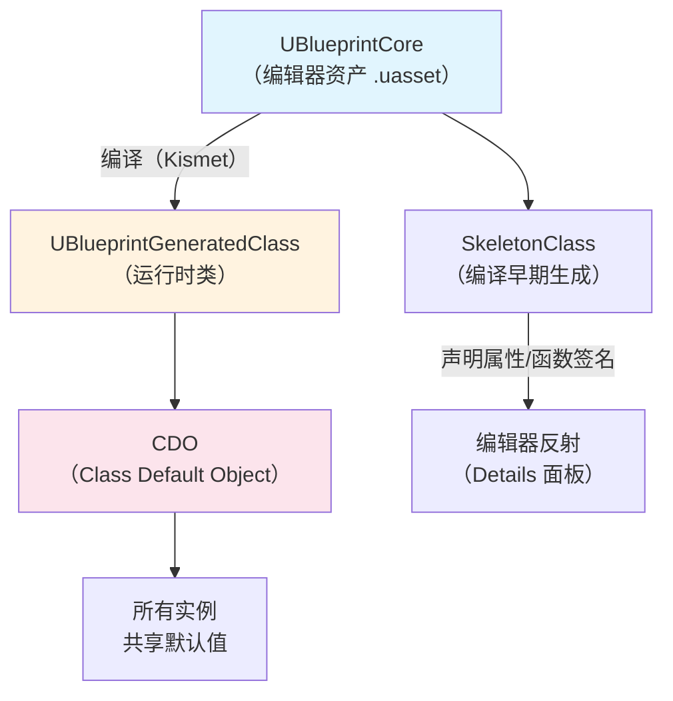
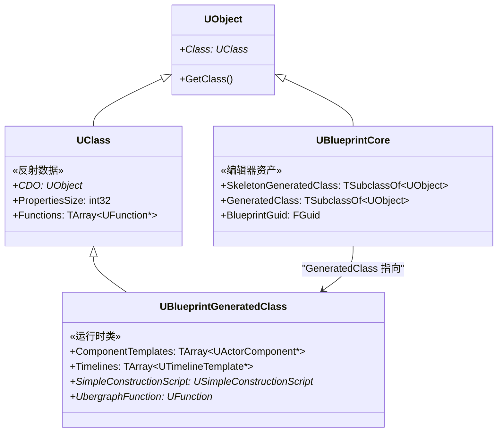
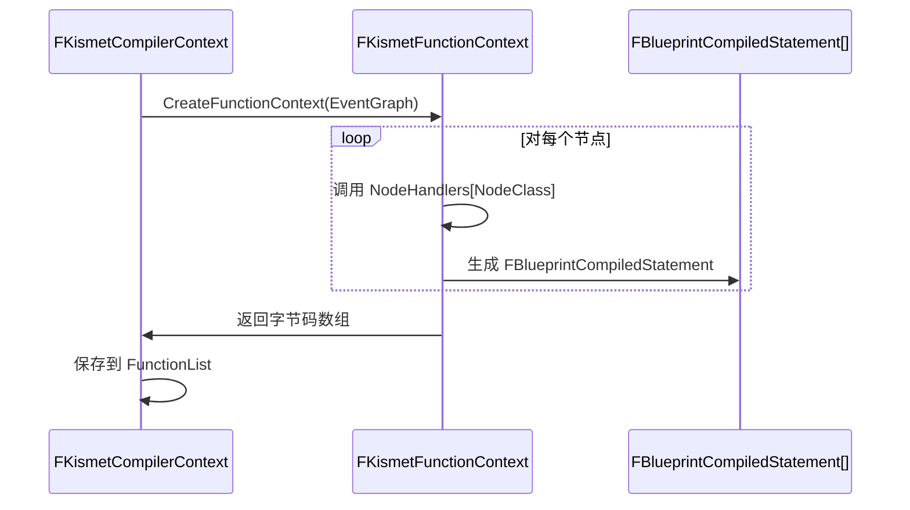
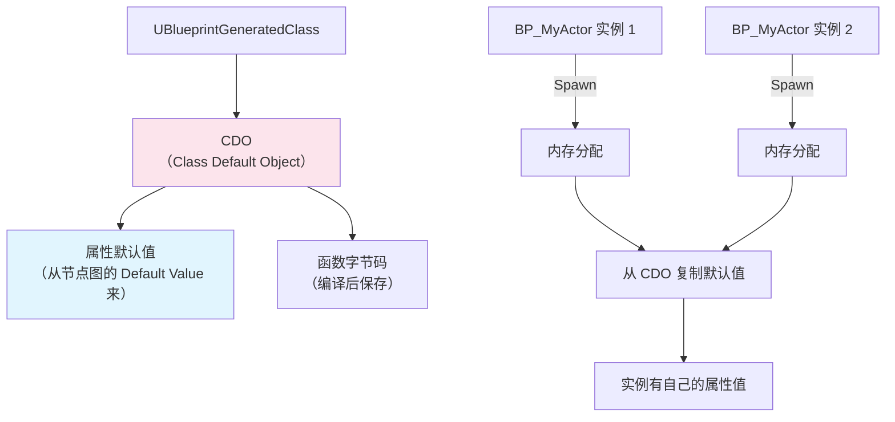
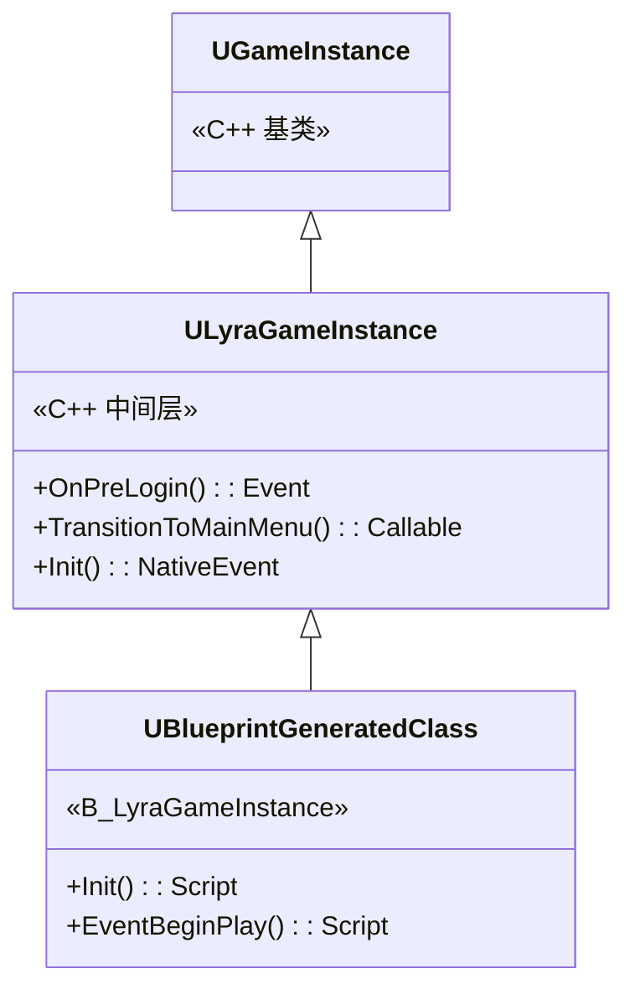

# UBlueprintGeneratedClass深度解析

> `UBlueprintCore` 是编辑器中的蓝图资产（`.uasset`），而 `UBlueprintGeneratedClass` 是**编译后生成的运行时类**。本课深入这两个类的关系，以及运行时蓝图如何执行。

## 概述

学完本课你将能够：
- 区分 `UBlueprintCore`（编辑器）与 `UBlueprintGeneratedClass`（运行时）
- 理解 `SkeletonClass` vs `GeneratedClass` 的作用
- 解释 CDO（Class Default Object）在蓝图中的角色
- 追踪从"点击 Compile"到"运行时执行"的完整链路

## UBlueprintCore vs UBlueprintGeneratedClass

这是蓝图系统中**最容易被混淆**的一对概念。

### 概念类比

| 如果你熟悉 C++ | 蓝图对应物 | 说明 |
|------------|------------|------|
| `.h` + `.cpp`（源码） | `UBlueprintCore`（`.uasset`） | 编辑器中的"源码" |
| 编译器输出的 `.o`/`.exe` | `UBlueprintGeneratedClass` | 编译后的"可执行代码" |
| 全局默认对象 | CDO（Class Default Object） | 存储属性默认值 |



### 类继承关系



**关键点**：
- `UBlueprintCore` 继承自 `UObject`（它是资产）
- `UBlueprintGeneratedClass` 继承自 `UClass`（它是类，可以 `GetDefaultObject()`）
- `UBlueprintCore::GeneratedClass` 指向 `UBlueprintGeneratedClass`

## 编译三阶段：Skeleton → GeneratedClass → CDO

蓝图编译不是"一步完成"——它分 **3 个阶段**，每个阶段产出不同的产物。

### 阶段 1：创建 SkeletonClass（声明阶段）

**目的**：让编辑器**知道**蓝图有哪些属性/函数（不需要实现），用于：
- Details 面板显示属性
- 其他蓝图可以引用此类
- 脚本编写时的自动补全

```cpp
// 文件：Engine/Source/Editor/KismetCompiler/Private/KismetCompiler.cpp
// 约 L200-L300（基于 UE 5.7）

void FKismetCompilerContext::CreateSkeletonClass()
{
    // [1] 创建或复用已有的 SkeletonClass
    UBlueprintGeneratedClass* SkeletonClass = Blueprint->SkeletonGeneratedClass->GetDefaultObject<UBlueprintGeneratedClass>();
    
    // [2] 声明所有 UPROPERTY（分配 Property 内存偏移）
    for (TFieldIterator<FProperty> It(Blueprint->SkeletonGeneratedClass); It; ++It)
    {
        FProperty* Prop = *It;
        // 计算属性在对象内存中的偏移
        Prop->SetOffset_Internal(NextOffset);
        NextOffset += Prop->GetSize();
    }

    // [3] 声明所有 UFUNCTION（创建 UFunction 对象）
    for (UEdGraph* FunctionGraph : Blueprint->FunctionGraphs)
    {
        UFunction* NewFunction = NewObject<UFunction>(SkeletonClass);
        SkeletonClass->AddFunctionToMap(NewFunction);
    }
}
```

**特点**：
- **不生成字节码**（函数体是空的）
- **不绑定 C++ 函数**（只知道"有这个函数"，不知道"函数做什么"）
- 每次添加/删除变量时**重新生成**

### 阶段 2：编译函数图（字节码生成阶段）

**目的**：将节点图转换为 `FBlueprintCompiledStatement` 字节码数组。



**产物**：
- `FKismetFunctionContext` 中的 `CompiledStatements` 数组
- `UbergraphContext`（所有 Event Graph 合并后的上下文）

### 阶段 3：创建 GeneratedClass（绑定阶段）

**目的**：创建**完整的运行时类**，包含：
- 所有属性的真实内存布局
- 所有函数的字节码
- CDO（Class Default Object）

```cpp
// 文件：Engine/Source/Editor/KismetCompiler/Private/KismetCompiler.cpp
// 约 L500-L700（基于 UE 5.7）

void FKismetCompilerContext::CreateGeneratedClass()
{
    // [1] 创建或复用 GeneratedClass
    UBlueprintGeneratedClass* NewClass = Blueprint->GeneratedClass->GetDefaultObject<UBlueprintGeneratedClass>();

    // [2] 从 SkeletonClass 复制属性布局
    NewClass->CopyPropertiesForUnrelatedObjects(SkeletonClass, false);

    // [3] 绑定字节码到 UFunction
    for (FKismetFunctionContext& FunctionContext : FunctionList)
    {
        UFunction* TargetFunction = FunctionContext.Function;
        // 将编译后的字节码保存到函数的 Script 属性
        TargetFunction->Script = FunctionContext.CompiledStatements;
    }

    // [4] 创建 CDO（Class Default Object）
    NewClass->GetDefaultObject();  // 触发 CDO 创建

    // [5] 从 Blueprint 的节点图初始化 CDO 的默认值
    InitializeCDODefaults(NewClass->GetDefaultObject());
}
```

## CDO（Class Default Object）：蓝图的"默认值容器"

CDO 是 UE 反射系统的核心概念，蓝图也依赖它。

### CDO 的作用



**关键点**：
- **所有实例共享同一个 CDO**
- **新实例 spawn 时，从 CDO 复制默认值**
- 在蓝图中设置"Default Value"（选中变量 → Details 面板 → 输入值），这个值会被保存到 CDO

### 蓝图如何初始化 CDO？

编译时，`FKismetCompilerContext` 会：
1. 创建一个**新的临时 CDO**（`NewCDO`）
2. 执行所有**构造脚本**（Construction Script）
3. 将结果保存到 `GeneratedClass->CDO`

```cpp
// 伪代码
void InitializeCDODefaults(UObject* NewCDO)
{
    // [1] 先复制父类的 CDO
    CopyFromParentCDO(NewCDO);

    // [2] 执行构造脚本（Construction Script）
    UFunction* CtorFunction = NewCDO->FindFunction(TEXT("ConstructionScript"));
    if (CtorFunction)
    {
        FFrame Stack(NewCDO, CtorFunction, nullptr);
        NewCDO->ProcessInternal(Stack, RESULT_NONE);
    }

    // [3] 应用蓝图节点图中设置的默认值
    ApplyEditorPropertyDefaults(NewCDO);
}
```

## 运行时执行流程

当游戏运行时，蓝图是如何被调用的？

### 完整调用链

```mermaid
sequenceDiagram
    participant World as UWorld::Tick
    participant Actor as AActor::Tick
    participant VM as Kismet VM\nProcessInternal()
    participant Func as UFunction::Script\n(FBlueprintCompiledStatement[])
    participant Cpp as C++ 函数\n（如 SetActorLocation）

    World->>Actor: Tick(DeltaTime)
    Actor->>VM: ProcessInternal(Stack, RESULT)
    loop 逐条解释字节码
        VM->>Func: 读取下一条 Statement
        alt Statement.Type == KCST_CallFunction
            VM->>Cpp: Invoke(UFunction)
            Cpp->>VM: 返回
        else Statement.Type == KCST_Assign
            VM->>VM: 复制属性值
        else Statement.Type == KCST_Goto
            VM->>VM: 跳转到目标偏移
        end
    end
    VM->>Actor: Tick 完成
```

### 关键：`UFunction::Script`

每个蓝图函数在编译后，`UFunction::Script` 会被设置为指向 `FBlueprintCompiledStatement` 数组：

```cpp
// 文件：Engine/Source/Runtime/CoreUObject/Private/UObject/Class.cpp
// 约 L3000-L3050（基于 UE 5.7）

void UObject::ProcessInternal(FFrame& Stack, RESULT_DECL)
{
    while (Stack.Code != nullptr)
    {
        FBlueprintCompiledStatement* Statement = Stack.Code;
        Stack.Code++;  // 移动到下一条指令

        switch (Statement->Type)
        {
            case KCST_CallFunction:
            {
                // [1] 通过反射找到 UFunction
                UFunction* FunctionToCall = Statement->FunctionToCall;
                
                // [2] 调用函数（可能是 C++ 函数，也可能是另一个蓝图函数）
                if (FunctionToCall->Script.Num() > 0)
                {
                    // 蓝图函数：递归调用 ProcessInternal
                    FFrame NewStack(Stack.Obj, FunctionToCall, ...);
                    Stack.Obj->ProcessInternal(NewStack, RESULT_PARAM);
                }
                else
                {
                    // C++ 函数：直接调用 NativeFuncPtr
                    FunctionToCall->Invoke(Stack.Obj, Stack, RESULT_PARAM);
                }
                break;
            }

            case KCST_Assign:
            {
                // 将 RHS 的值复制到 LHS
                CopySingleProperty(Statement->LHS, Statement->RHS);
                break;
            }

            case KCST_Goto:
            {
                // 跳转：修改 Code 指针
                Stack.Code = &Stack.Code[Statement->TargetOffset];
                break;
            }

            // ... 处理其他 40+ 种指令
        }
    }
}
```

## Lyra 中的实践：C++ 父类 + 蓝图子类

Lyra **不用**蓝图写核心逻辑，但允许蓝图**派生**自 C++ 类。

### 案例：`ULyraGameInstance`（C++）→ `B_LyraGameInstance`（蓝图）

```cpp
// 文件：Source/LyraGame/LyraGameInstance.h
// Lyra 的 C++ 父类

UCLASS()
class ULyraGameInstance : public UGameInstance
{
    GENERATED_BODY()

public:
    // [1] 蓝图可重写的事件（蓝图提供实现）
    UFUNCTION(BlueprintImplementableEvent, Category="Lyra|GameInstance")
    void OnPreLogin();

    // [2] 蓝图可调用函数（C++ 提供实现）
    UFUNCTION(BlueprintCallable, Category="Lyra|GameInstance")
    void TransitionToMainMenu();

    // [3] 蓝图可重写的虚函数（C++ 有默认实现，蓝图可覆盖）
    UFUNCTION(BlueprintNativeEvent, Category="Lyra|GameInstance")
    void Init();
};
```

编译后：
- `ULyraGameInstance` 的 `UClass` 中声明了 `OnPreLogin`、`TransitionToMainMenu`、`Init`
- `B_LyraGameInstance` 的 `UBlueprintGeneratedClass` 中：
  - 如果蓝图重写了 `Init`，`Init` 函数的 `Script` 数组会被设置为蓝图字节码
  - 如果蓝图没有重写，`Init` 会调用 C++ 的 `Init_Implementation()`



## 常见问题与陷阱

### 陷阱 1：修改 C++ 父类后，蓝图不更新

**原因**：蓝图编译时保存了 `GeneratedClass` 的**快照**。C++ 父类改动后，需要**重新编译蓝图**。

**解决**：
1. 在编辑器中打开蓝图
2. 点击 **Refresh All Nodes**（工具栏）
3. 重新编译

### 陷阱 2：蓝图继承链过深，性能下降

**原因**：每次函数调用，VM 都需要**逐层查找** `UFunction`（类似 C++ 的 vtable 查找，但更慢）。

**解决**：
- 继承链不要超过 **3 层**（Grandparent → Parent → Child）
- 核心逻辑用 C++，蓝图只做数据覆盖

### 陷阱 3：Construction Script 在运行时执行

**原因**：`Construction Script` 在**每次 Spawn** 时执行（不仅是编辑器放置时）。

**解决**：
- 高频 Spawn 的 Actor（子弹、粒子），**不要用 Construction Script**
- 用 `BeginPlay` 替代

## 总结与要点

| 要点 | 说明 |
|------|------|
| **UBlueprintCore = 编辑器资产** | 存储节点图、属性默认值（`.uasset`） |
| **UBlueprintGeneratedClass = 运行时类** | 编译产物，包含字节码和 CDO |
| **SkeletonClass = 声明** | 让编辑器知道有哪些属性/函数（无实现） |
| **GeneratedClass = 完整类** | 包含字节码、CDO、Component 模板 |
| **CDO = 默认值容器** | 所有实例共享，Spawn 时复制默认值 |
| **Lyra 的策略** | C++ 写核心，蓝图做数据配置 + 事件重写 |

## 相关页面

- [[30-tutorials/blueprint-system/00-UE蓝图系统从入门到实战|蓝图系统概览]] — 系列导航
- [[30-tutorials/blueprint-system/02-蓝图VM与字节码|蓝图 VM 与字节码]] — 字节码生成详解
- [[30-tutorials/ue-reflection/03-反射API实战|反射 API 实战]] — `UClass`/`UFunction` 反射 API
- [[30-tutorials/ue-framework/40-actor-system/00-AActor架构概述|AActor 架构概述]] — Actor Spawn 与 CDO 复制

---
> 最后更新：2026-05-19

<!-- nav:auto -->

---

**导航**: ← [[30-tutorials/blueprint-system/02-蓝图VM与字节码|02-蓝图VM与字节码]] · [[30-tutorials/blueprint-system/04-C++与蓝图交互|04-C++与蓝图交互]] →

<!-- /nav:auto -->
