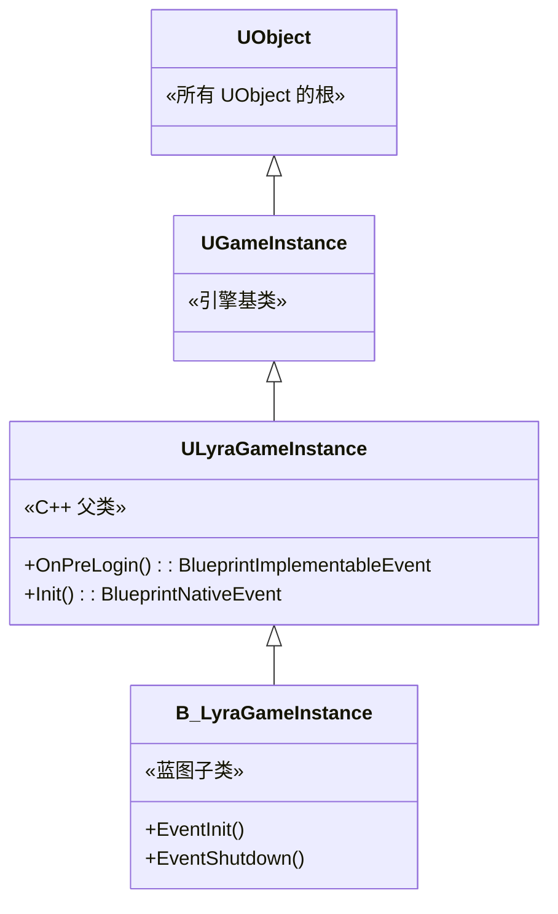
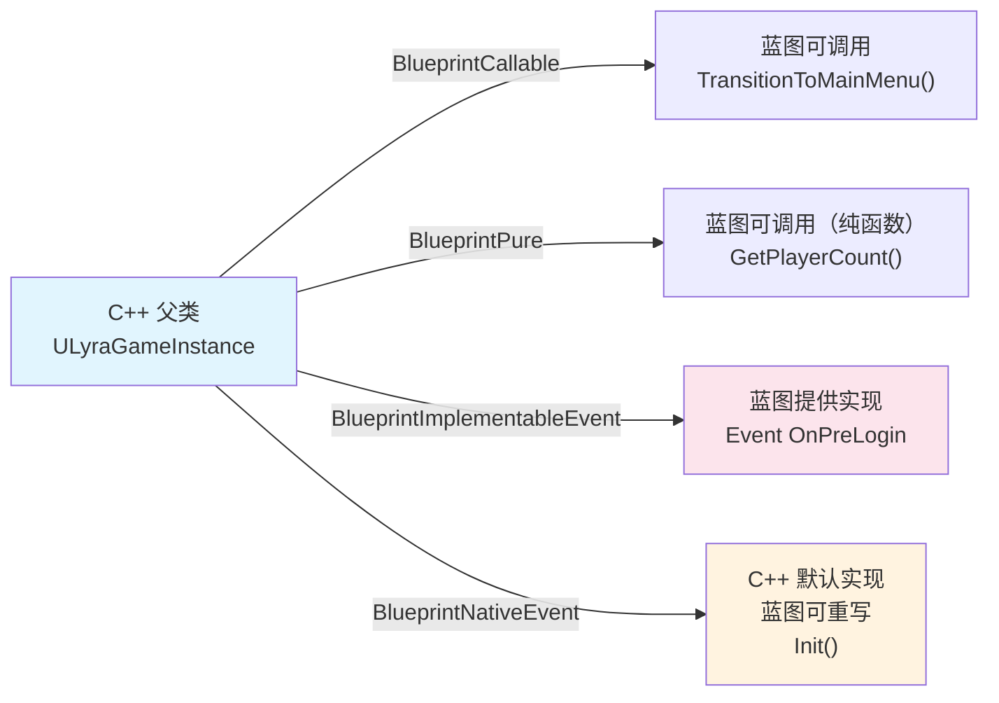
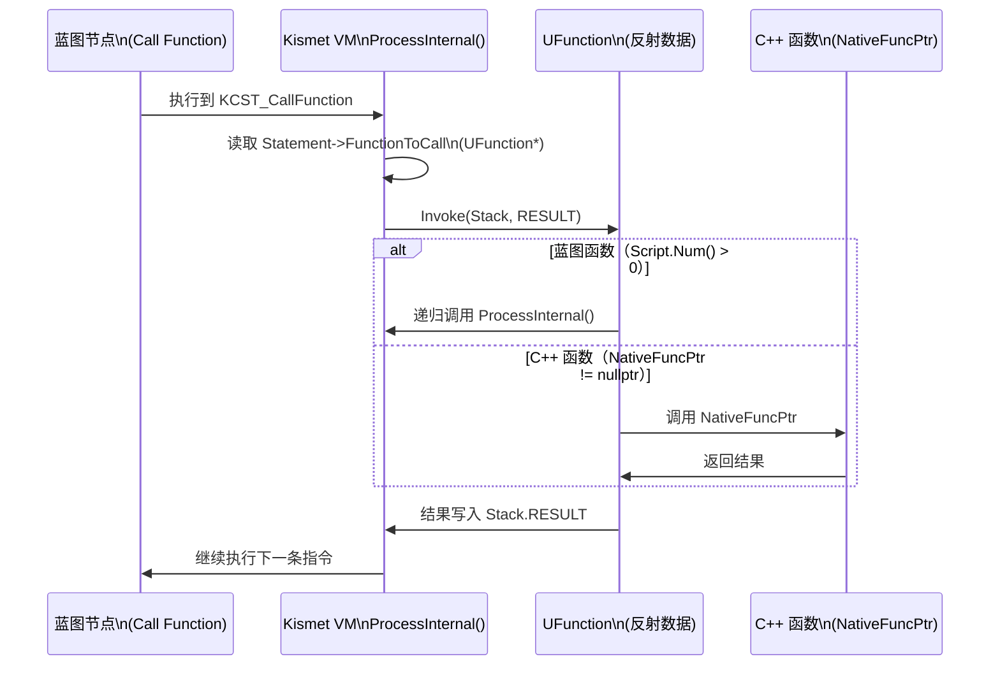
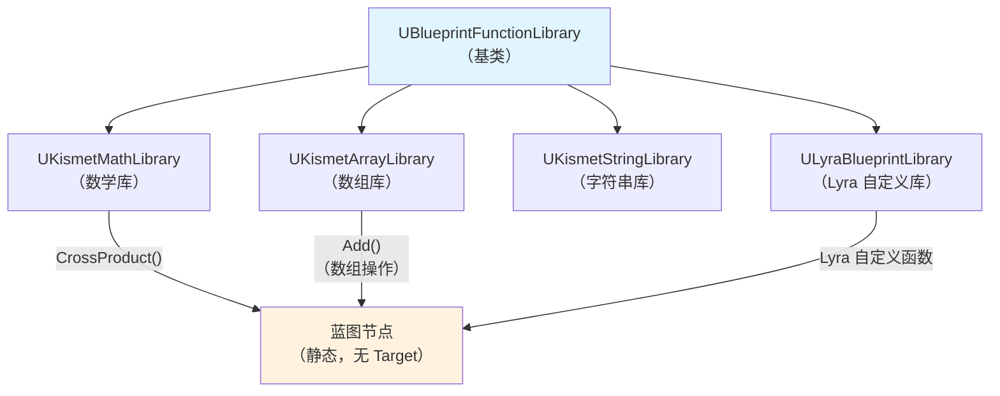
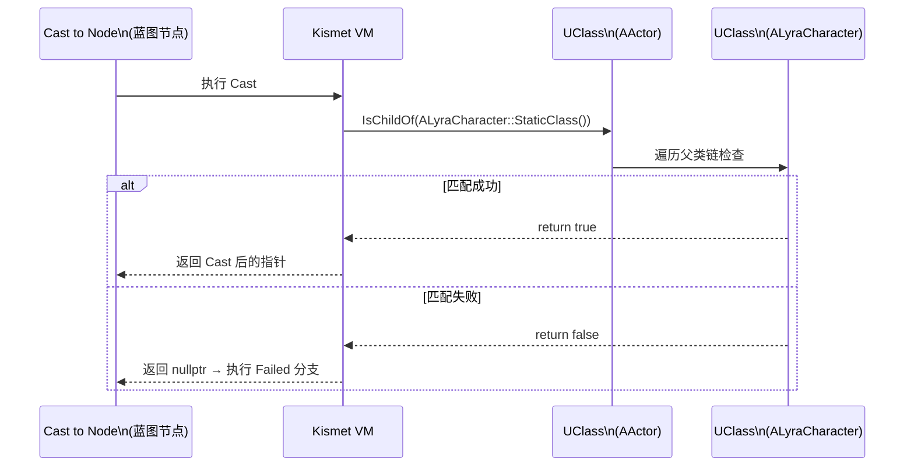
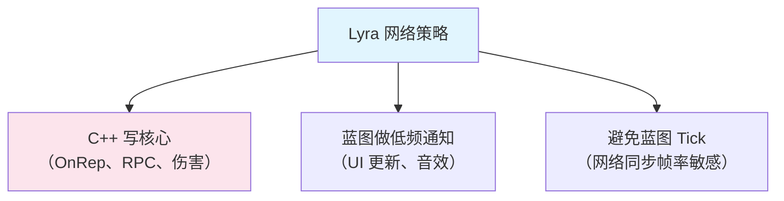
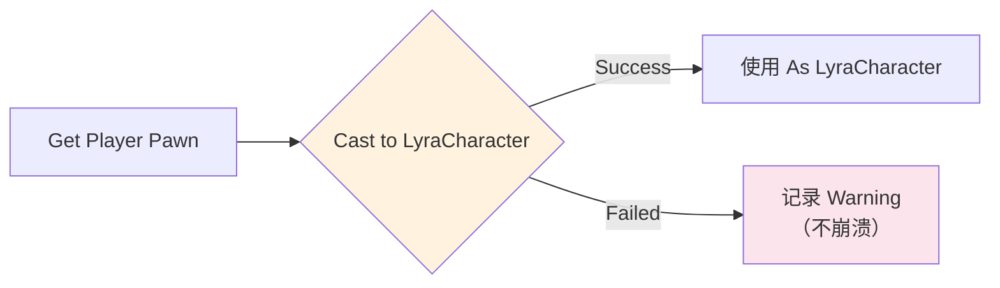

# C++与蓝图交互

> 蓝图与 C++ 的交互是**双向**的：C++ 可以暴露函数和属性给蓝图（通过宏），蓝图也可以调用 C++ 函数（通过 VM + 反射）。本课深入这两条路径。

## 概述

学完本课你将能够：
- 用 `UCLASS`/`UPROPERTY`/`UFUNCTION` 宏暴露 C++ 给蓝图
- 解释蓝图节点如何找到并调用 C++ 函数（反射 + VM）
- 使用 `UBlueprintFunctionLibrary` 模式创建蓝图可调用的静态函数库
- 理解 `Cast<>` 在蓝图中的工作原理（运行时类型检查）

## C++ → 蓝图：暴露接口

C++ 通过 **UHT 宏**告诉蓝图："这些函数和属性可以被调用/读写"。

### UCLASS：让类可被蓝图继承

```cpp
// 文件：Source/LyraGame/LyraGameInstance.h
// 约 L10-L20（基于 UE 5.7）

// [1] Blueprintable = 蓝图可以继承此类
// [2] MinimalAPI = 导出符号（跨模块调用）
UCLASS(Blueprintable, MinimalAPI)
class ULyraGameInstance : public UGameInstance
{
    GENERATED_BODY()
    // ...
};
```

| `UCLASS` 修饰符 | 作用 |
|--------------|------|
| `Blueprintable` | 蓝图可以继承此类 |
| `BlueprintType` | 此类可作为蓝图变量类型（不一定可继承） |
| `Abstract`, `BlueprintType` | 蓝图不能继承，但可以作为变量类型 |
| `MinimalAPI` | 导出符号（跨模块调用需要） |



### UPROPERTY：暴露属性给蓝图

```cpp
UCLASS(Blueprintable)
class ULyraGameInstance : public UGameInstance
{
    GENERATED_BODY()

public:
    // [1] BlueprintReadOnly = 蓝图可以读取，不能修改
    UPROPERTY(BlueprintReadOnly, Category="Lyra|GameInstance")
    int32 PlayerCount = 0;

    // [2] BlueprintReadWrite = 蓝图可以读写
    UPROPERTY(BlueprintReadWrite, EditAnywhere, Category="Lyra|GameInstance")
    float MaxHealth = 100.0f;

    // [3] 不标记 Blueprint* = 蓝图不可访问（仅 C++ 可用）
    UPROPERTY()
    TObjectPtr<UClass> PrivateData;
};
```

| `UPROPERTY` 修饰符 | 蓝图访问权限 |
|--------------|--------------|
| `BlueprintReadOnly` | 只读（`Get` 节点） |
| `BlueprintReadWrite` | 读写（`Get`/`Set` 节点） |
| （无 Blueprint 标记） | 蓝图不可访问 |

### UFUNCTION：暴露函数给蓝图

这是**最核心**的交互方式。

```cpp
UCLASS(Blueprintable)
class ULyraGameInstance : public UGameInstance
{
    GENERATED_BODY()

public:
    // [1] BlueprintCallable = 蓝图可以调用此函数
    UFUNCTION(BlueprintCallable, Category="Lyra|GameInstance")
    void TransitionToMainMenu();

    // [2] BlueprintPure = 纯函数（无执行引脚，仅数据引脚）
    UFUNCTION(BlueprintPure, Category="Lyra|GameInstance")
    int32 GetPlayerCount() const { return PlayerCount; }

    // [3] BlueprintImplementableEvent = C++ 声明，蓝图提供实现
    UFUNCTION(BlueprintImplementableEvent, Category="Lyra|GameInstance")
    void OnPreLogin();

    // [4] BlueprintNativeEvent = C++ 有默认实现，蓝图可重写
    UFUNCTION(BlueprintNativeEvent, Category="Lyra|GameInstance")
    void Init();

protected:
    // [4 续] BlueprintNativeEvent 的 C++ 默认实现（_Implementation 后缀）
    virtual void Init_Implementation();
};
```

| `UFUNCTION` 修饰符 | 作用 | 蓝图中的表现 |
|--------------|------|--------------|
| `BlueprintCallable` | 蓝图可调用 | 有执行引脚的节点 |
| `BlueprintPure` | 蓝图可调用，**无执行引脚**（纯函数） | 只有数据引脚的节点 |
| `BlueprintImplementableEvent` | C++ 声明，**蓝图提供实现** | 事件节点（如 `Event Init`） |
| `BlueprintNativeEvent` | C++ 有默认实现，**蓝图可重写** | 可重写的事件节点 |
| `BlueprintStatic` | 静态函数，蓝图可调用 | 静态节点（无需 Target） |



## 蓝图 → C++：调用流程

当蓝图节点"调用 C++ 函数"时，底层发生了什么？

### 完整调用链



### 关键：`UFunction::Invoke()`

```cpp
// 文件：Engine/Source/Runtime/CoreUObject/Private/UObject/Class.cpp
// 约 L3500-L3600（基于 UE 5.7）

void UFunction::Invoke(UObject* Obj, FFrame& Stack, RESULT_DECL)
{
    if (Script.Num() > 0)
    {
        // [1] 蓝图函数：递归调用 VM
        Obj->ProcessInternal(Stack, RESULT_PARAM);
    }
    else if (NativeFuncPtr != nullptr)
    {
        // [2] C++ 函数：直接调用 NativeFuncPtr
        // 这是 BlueprintCallable / BlueprintPure 的调用路径
        NativeFuncPtr(Obj, Stack, RESULT_PARAM);
    }
    else
    {
        // [3] 接口函数 / 事件：需要子类实现
        // BlueprintImplementableEvent 会走到这里
    }
}
```

**性能关键点**：
- `NativeFuncPtr` 是**函数指针**（直接调用），性能接近普通 C++ 调用
- 但 VM 的**分发开销**（switch-case、参数打包）依然存在
- 这就是为什么"高频调用"应该用 C++ 直接写，不用蓝图节点

## UBlueprintFunctionLibrary 模式

如果你有一组**静态工具函数**（如数学计算、数组操作），应该继承 `UBlueprintFunctionLibrary`。

### 示例：`UKismetMathLibrary`

```cpp
// 文件：Engine/Source/Runtime/Engine/Classes/Kismet/KismetMathLibrary.h
// 约 L50-L100（基于 UE 5.7）

UCLASS()
class UKismetMathLibrary : public UBlueprintFunctionLibrary
{
    GENERATED_BODY()

public:
    // [1] 必须是 static 函数
    // [2] 标记为 BlueprintCallable（蓝图可调用）
    UFUNCTION(BlueprintCallable, Category="Math|LinearAlgebra")
    static FVector CrossProduct(const FVector& A, const FVector& B)
    {
        return A ^ B;  // C++ 操作符重载
    }

    // [3] BlueprintPure = 纯函数（无执行引脚）
    UFUNCTION(BlueprintPure, Category="Math|LinearAlgebra")
    static float DotProduct(const FVector& A, const FVector& B)
    {
        return A | B;
    }
};
```

**为什么用 `UBlueprintFunctionLibrary`？**
- 不需要实例化对象（静态函数）
- 在蓝图节点列表中**分类清晰**（`Category` 决定位置）
- 性能比"成员函数"稍好（无需传递 `Target` 指针）



## `Cast<>` 原理：运行时类型检查

蓝图中常用的 `Cast to` 节点，底层是 **`UClass::IsChildOf()`** 检查。

### C++ 中的 `Cast<>`

```cpp
// 伪代码，展示 Cast<> 原理
template<typename To>
To* Cast(UObject* From)
{
    if (From && From->GetClass()->IsChildOf(To::StaticClass()))
    {
        return (To*)From;  // 类型安全，强制转换
    }
    return nullptr;  // 类型不匹配
}
```

### 蓝图中的 `Cast to` 节点

```
[Object 引脚] → Cast to LyraCharacter → [Success?] → [As LyraCharacter]
```

**底层流程**：
1. VM 执行 `KCST_CallFunction`（调用 `CastClass` 函数）
2. `CastClass` 内部调用 `UClass::IsChildOf()`
3. 如果匹配，返回转换后的指针；否则返回 `nullptr`



## 蓝图中的网络同步

> 如果您的游戏涉及多人联机，蓝图中的网络同步是必须理解的主题。

### Replicated 变量

在蓝图中，将变量标记为 `Replicated` 的方式：

1. 选中变量 → Details 面板 → **Replication** → 勾选 `Replicated`
2. 编译后，该变量会在服务端修改时自动同步到所有客户端

**底层原理**：通过 `UPROPERTY(Replicated)` 宏标记，网络模块在 `UObject::ReplicateProperties()` 中自动同步。

### OnRep 函数（复制通知）

当 `Replicated` 变量在客户端收到更新时，您可以执行自定义逻辑：

1. 在蓝图中选中 `Replicated` 变量
2. Details 面板 → **Replication** → **On Rep Notify** → 选择一个自定义事件（如 `OnHealthChanged`）
3. 编写该事件的逻辑（如更新 UI 血条）

**底层原理**：`UPROPERTY(ReplicatedUsing=OnHealthChanged)` 宏会生成一个 `UFunction`，网络层在变量更新后自动调用它。

| 对比 | C++（`ReplicatedUsing=OnRep_Health`） | 蓝图（On Rep Notify） |
|------|--------------------------------|---------------------------|
| 性能 | 快（直接函数指针调用） | 慢（VM 解释执行） |
| 适用场景 | 高频同步（血量、位置） | 低频同步（UI 更新、音效） |

### RPC（远程过程调用）

蓝图支持三种 RPC 节点：

| RPC 类型 | 蓝图节点 | 底层宏 | 调用方向 |
|----------|----------|----------|----------|
| **Server** | `Server` 前缀函数 | `UFUNCTION(Server)` | 客户端 → 服务端 |
| **Client** | `Client` 前缀函数 | `UFUNCTION(Client)` | 服务端 → 客户端 |
| **Multicast** | `Multicast` 前缀函数 | `UFUNCTION(NetMulticast)` | 服务端 → 所有客户端 |

**创建 Server RPC 的步骤**（蓝图）：
1. 在 My Blueprint 面板 → **Functions** → **Override** → 选择 `Server` 函数
2. 或创建新函数 → Details 面板 → **Replication** → `Run on Server`

> ⚠️ **性能警告**：RPC 的底层是网络序列化 + VM 执行，比 C++ 的 RPC 慢 **10-30x**。Lyra 的所有网络逻辑全用 C++ 实现。

### Lyra 的网络策略

| 网络功能 | C++ | 蓝图 | 原因 |
|----------|-----|------|------|
| 伤害同步 | `ULyraHealthComponent::OnRep_Health()` | 无 | OnRep 高频调用，必须快 |
| 射击 RPC | `ULyraWeaponInstance::Server_Fire()` | 无 | RPC 每帧可能触发，VM 开销不可接受 |
| 道具拾取通知 | `ULyraPickup::OnRep_bPicked()` | 可选蓝图通知（低频） | 低频事件可以用蓝图 |



### 最佳实践

1. **高频同步（血量、位置）→ 必须用 C++**（OnRep 每帧可能触发）
2. **低频通知（UI、音效）→ 可以用蓝图**（OnRep Notify）
3. **RPC（Server/Client）→ 必须用 C++**（序列化 + VM 开销太大）
4. **不要信任客户端**：Server RPC 中必须验证输入合法性

```

## Lyra 中的实践：C++/蓝图职责划分

Lyra **严格区分** C++ 和蓝图的职责。

### 规则 1：核心逻辑全用 C++

| 系统 | C++ | 蓝图 |
|------|-----|------|
| 角色 | `ALyraCharacter` | 无（或用 C++ 派生类） |
| 武器 | `ULyraWeaponInstance` | 数据配置（`BP_Weapon_XXX`） |
| GAS | `ULyraGameplayAbility` | 无（Lyra 全用 C++ Ability） |
| UI | `ULyraUIManagerComponent` | Widget 蓝图（UMG） |

### 规则 2：蓝图只做数据配置

```cpp
// 示例：Lyra 的武器数据资产（C++ 定义）
USTRUCT(BlueprintType)
struct FLyraWeaponData
{
    GENERATED_BODY()

    // [1] 蓝图可配置这些属性
    UPROPERTY(EditAnywhere, BlueprintReadWrite)
    float Damage = 10.0f;

    UPROPERTY(EditAnywhere, BlueprintReadWrite)
    TSubclassOf<ULyraWeaponInstance> WeaponClass;
};

// [2] 蓝图实例化这个结构体，填充数据
// Content/Weapons/BP_Weapon_Rifle.uasset → 设置 Damage = 25.0
```

### 规则 3：`BlueprintImplementableEvent` 用于"编辑器事件"

```cpp
// LyraGameInstance.h
UCLASS()
class ULyraGameInstance : public UGameInstance
{
    GENERATED_BODY()

public:
    // [1] 蓝图可重写的事件（用于编辑器逻辑）
    UFUNCTION(BlueprintImplementableEvent, Category="Lyra|GameInstance")
    void OnMainMenuLoaded();

    // [2] C++ 调用点
    void OnPostLoadMap()
    {
        // ... C++ 逻辑 ...
        OnMainMenuLoaded();  // 调用蓝图实现
    }
};
```

蓝图中的对应：
```
Event OnMainMenuLoaded → （蓝图逻辑：播放动画、初始化 UI）
```

## 常见问题与陷阱

### 陷阱 1：`BlueprintCallable` 函数太频繁调用

**问题**：Tick 中调用 `BlueprintCallable` 函数，性能瓶颈。

**解决**：将逻辑移到 C++，蓝图只做"配置"。

### 陷阱 2：`Cast<>` 失败返回 `nullptr`

**问题**：蓝图中 `Cast to` 失败后，继续使用 `As XXX` 指针 → 崩溃。

**解决**：**Always 连接 `Failed` 引脚**，处理类型不匹配的情况。



### 陷阱 3：`BlueprintImplementableEvent` 在 C++ 中没有实现

**问题**：C++ 调用 `OnPreLogin()`，但蓝图没有重写 → **无效果，不报错**。

**解决**：用 `BlueprintNativeEvent` 替代（C++ 有默认实现，蓝图可选重写）。

## 总结与要点

| 要点 | 说明 |
|------|------|
| **C++ → 蓝图：宏暴露** | `UCLASS(Blueprintable)` / `UPROPERTY(BlueprintReadWrite)` / `UFUNCTION(BlueprintCallable)` |
| **蓝图 → C++：VM 调用** | `UFunction::Invoke()` → `NativeFuncPtr`（函数指针） |
| **UBlueprintFunctionLibrary** | 静态函数库模式，适合工具函数（数学、数组操作） |
| **Cast<> 原理** | `UClass::IsChildOf()` 运行时类型检查 |
| **Lyra 的策略** | C++ 写核心，蓝图做数据配置 + 编辑器事件 |

## 相关页面

- [[30-tutorials/blueprint-system/00-UE蓝图系统从入门到实战|蓝图系统概览]] — 系列导航
- [[30-tutorials/ue-reflection/02-核心宏详解|核心宏详解]] — `UCLASS`/`UPROPERTY`/`UFUNCTION` 详解
- [[30-tutorials/blueprint-system/02-蓝图VM与字节码|蓝图 VM 与字节码]] — VM 执行流程详解
- [[30-tutorials/ue-framework/40-actor-system/00-AActor架构概述|AActor 架构概述]] — `Cast<>` 的 `UClass` 基础

---
> 最后更新：2026-05-19

<!-- nav:auto -->

---

**导航**: ← [[30-tutorials/blueprint-system/03-UBlueprintGeneratedClass深度解析|03-UBlueprintGeneratedClass深度解析]] · [[30-tutorials/blueprint-system/05-蓝图继承与接口|05-蓝图继承与接口]] →

<!-- /nav:auto -->
