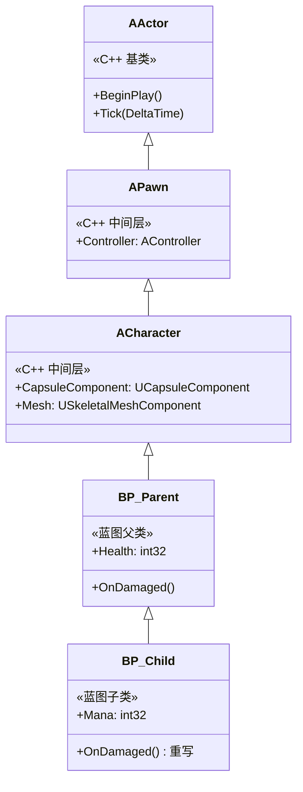
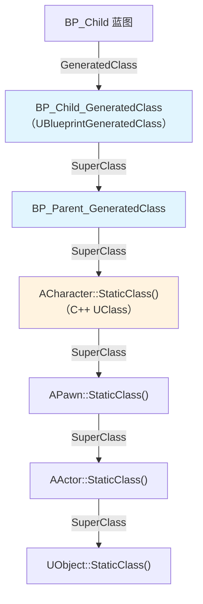
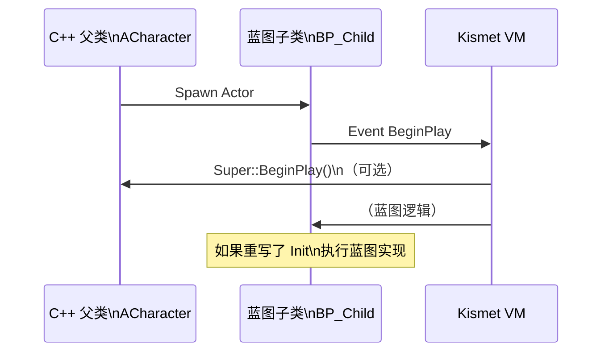
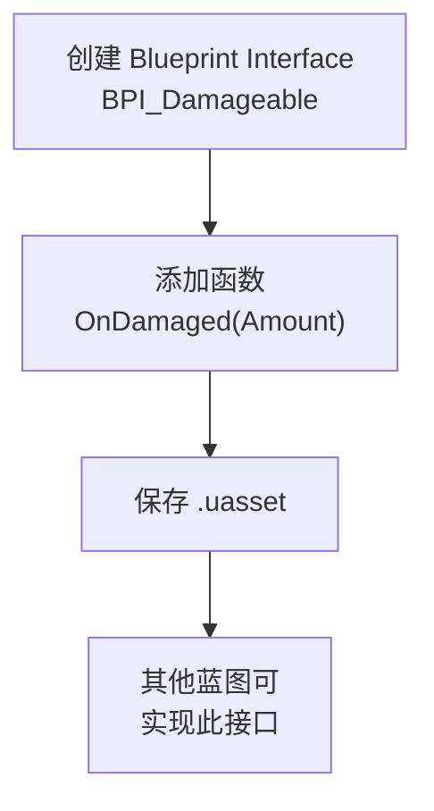
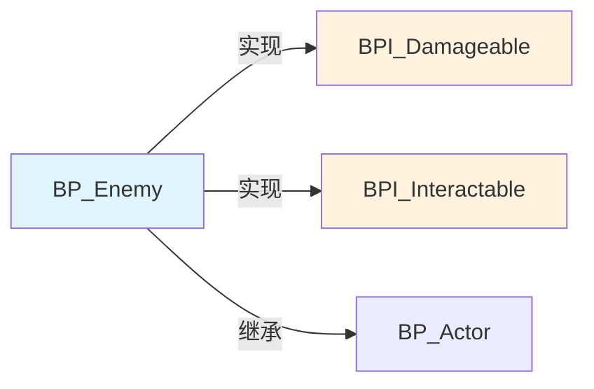
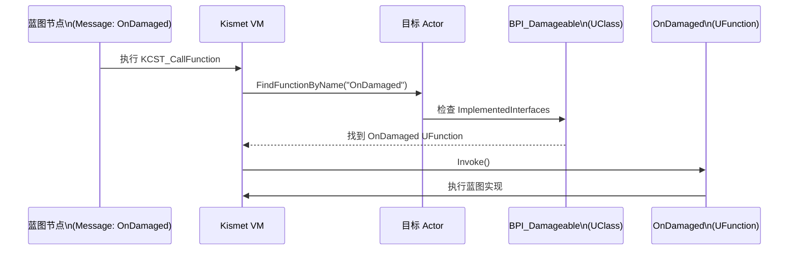
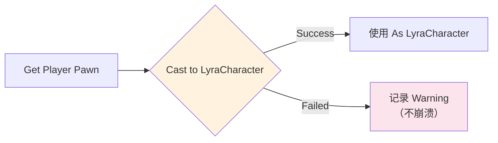
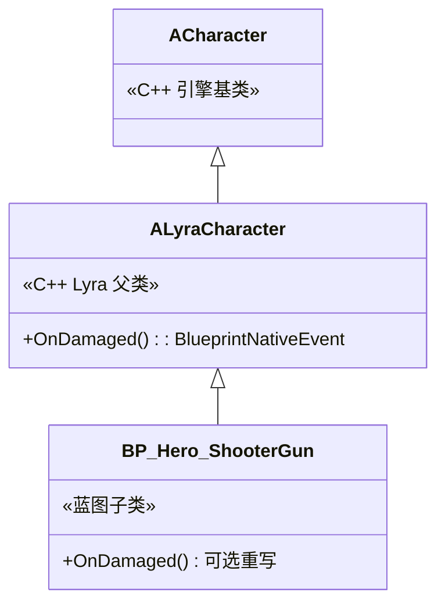

# 蓝图继承与接口

> 蓝图支持**单继承**（像 C++ 的 `UObject` 体系），但可以通过 **Blueprint Interface** 实现"多接口"的效果。本课深入继承链、接口实现、以及 `Cast<>` 的底层原理。

## 概述

学完本课你将能够：
- 解释蓝图继承链（`GeneratedClass` 的父子关系）
- 创建并使用 Blueprint Interface（类似 C++ 的纯虚函数）
- 理解为什么 UE **不支持**真正的多继承
- 在蓝图中正确实现 `Cast<>` 做类型检查

## 蓝图继承：单继承链

蓝图继承和 C++ 一样，是**单继承**（一个子类只能有一个直接父类）。

### 继承链示例



**关键点**：
- 蓝图可以继承自 **C++ 类**（如 `ACharacter`）
- 蓝图可以继承自 **另一个蓝图**（如 `BP_Parent` → `BP_Child`）
- 继承链上限推荐 **3 层**（性能 + 可维护性）

### `GeneratedClass` 的继承关系

编译后，`UBlueprintGeneratedClass` 的继承链与蓝图编辑器中的"Parent Class"一致：

```cpp
// 伪代码，展示 GeneratedClass 继承链
UClass* BP_Child_GeneratedClass = BP_Child->GeneratedClass;

// [1] 获取父类（C++ 或蓝图）
UClass* ParentClass = BP_Child_GeneratedClass->GetSuperClass();  // → BP_Parent_GeneratedClass

// [2] 继续向上
UClass* GrandparentClass = ParentClass->GetSuperClass();  // → ACharacter::StaticClass()

// [3] 检查类型（Cast 的底层实现）
bool bIsCharacter = BP_Child_GeneratedClass->IsChildOf(ACharacter::StaticClass());  // → true
```



### 继承链中的函数重写

| 场景 | C++ 父类 | 蓝图子类 | 调用结果 |
|------|----------|----------|----------|
| **重写事件**（BlueprintNativeEvent） | `Init()` 有默认实现 | 蓝图重写 `Event Init` | 调用子类实现（如果蓝图重写了） |
| **重写纯事件**（BlueprintImplementableEvent） | `OnDamaged()` 无实现 | **必须**提供实现 | 调用蓝图实现 |
| **新增函数** | - | 蓝图定义 `MyFunction()` | 只有子类有此函数 |



## Blueprint Interface：实现"多接口"效果

UE **不支持**真正的多继承（一个类不能同时继承 A 和 B），但可以用 **Blueprint Interface** 实现类似效果。

### 什么是 Blueprint Interface？

| C++ 概念 | Blueprint 对应物 |
|------------|------------|
| 纯虚函数（`virtual void Foo() = 0`） | Blueprint Interface 中的函数 |
| 多接口实现（`class D : public B, public C`） | 一个蓝图实现多个 Interface |
| `IDamageable` 接口 | `BPI_Damageable` Blueprint Interface |

### 创建与使用流程

**步骤 1：创建 Blueprint Interface**

1. Content Browser → 右键 → **Blueprint Interface**
2. 命名（如 `BPI_Damageable`）
3. 打开，添加函数（如 `OnDamaged(Amount)`）



**步骤 2：在蓝图中实现 Interface**

1. 打开蓝图（如 `BP_Enemy`）
2. Class Settings → **Implemented Interfaces** → 添加 `BPI_Damageable`
3. My Blueprint 面板 → **Interfaces** → 双击 `OnDamaged`
4. 编写实现逻辑



**步骤 3：调用 Interface 函数**

在蓝图中：
```
[目标 Actor] → Message: OnDamaged(Amount)
```

底层通过 `UClass::FindFunctionByName()` 查找函数，然后调用。

### 底层实现：`UInterface` 与 `ImplementedInterfaces`

```cpp
// 文件：Engine/Source/Runtime/CoreUObject/Public/UObject/Class.h
// 约 L500-L520（基于 UE 5.7）

class UClass : public UField
{
    // [1] 存储此类实现的接口列表
    TArray<UInterface> ImplementedInterfaces;

    // [2] 检查是否实现了某个接口
    bool IsChildOf(const UClass* Other) const;

    // [3] 查找函数（包含接口函数）
    UFunction* FindFunctionByName(FName Name) const;
};

struct FImplementedInterface
{
    UClass* Class;       // 接口的 UClass
    int32 Offset;         // 偏移（多接口时需要）
};
```

**调用 Interface 函数的流程**：



## `Cast<>`：运行时类型检查

蓝图中的 `Cast to` 节点，底层是 **`UClass::IsChildOf()`** 检查。

### C++ 中的 `Cast<>`

```cpp
template<typename To>
To* Cast(UObject* From)
{
    if (From && From->GetClass()->IsChildOf(To::StaticClass()))
    {
        return (To*)From;  // 类型安全转换
    }
    return nullptr;  // 类型不匹配
}
```

### 蓝图中的 `Cast to` 节点

```
[Actor 引脚] → Cast to LyraCharacter → [Success?] → [As LyraCharacter]
                                     ↓ Failed
                                  （执行 Failed 分支）
```

**底层流程**：

```mermaid
sequenceDiagram
    participant Node as Cast to Node
    participant VM as Kismet VM
    participant ClassA as Actor::StaticClass()
    participant ClassB as ALyraCharacter::StaticClass()

    Node->>VM: 执行 Cast
    VM->>ClassA: IsChildOf(ALyraCharacter::StaticClass())
    ClassA->>ClassA: 遍历 SuperClass 链
    alt 匹配成功
        ClassA-->>VM: return true
        VM-->>Node: 返回 Cast 后的指针
    else 匹配失败
        ClassA-->>VM: return false
        VM-->>Node: 返回 nullptr → 执行 Failed 分支
    end
```



### 性能注意

`Cast<>` 需要**遍历继承链**（`SuperClass` 指针链），开销比 C++ 的 `dynamic_cast<>` 小，但依然有成本。

**最佳实践**：
- 高频调用（Tick 中）**避免**反复 `Cast<>`
- 在 `BeginPlay` 中 Cast 一次，缓存结果

```cpp
// C++ 最佳实践
void AMyActor::BeginPlay()
{
    Super::BeginPlay();

    // [1] 缓存 Cast 结果
    CachedCharacter = Cast<ALyraCharacter>(GetOwner());
}

void AMyActor::Tick(float DeltaTime)
{
    // [2] 使用缓存，避免反复 Cast
    if (CachedCharacter)
    {
        CachedCharacter->DoSomething();
    }
}
```

## 常见问题与陷阱

### 陷阱 1：继承链过深，性能下降

**问题**：每次函数调用，VM 都需要**逐层查找** `UFunction`（类似 C++ 的 vtable 查找，但更慢）。

**解决**：
- 继承链不要超过 **3 层**（Grandparent → Parent → Child）
- 核心逻辑用 C++，蓝图只做数据覆盖

### 陷阱 2：`Cast<>` 失败后继续使用指针

**问题**：`Cast to` 失败后，`As XXX` 指针是 `nullptr`，继续使用 → 崩溃。

**解决**：**Always 连接 `Failed` 引脚**。



### 陷阱 3：Blueprint Interface 函数"找不到"

**问题**：调用 `Message: OnDamaged`，但目标没有实现此接口 → **无效果，不报错**。

**解决**：
1. 在调用前用 `Does Implement Interface` 节点检查
2. 或在 C++ 中用 `ImplementsInterface()` 检查

```cpp
// C++ 中检查是否实现接口
if (TargetActor->GetClass()->ImplementsInterface(UBPI_Damageable::StaticClass()))
{
    IDamageable::Execute_OnDamaged(TargetActor, Amount);
}
```

## Lyra 中的实践：C++ 父类 + 蓝图子类

Lyra **不用** Blueprint Interface（性能原因），而是用 **C++ 虚函数** 实现多态。

### 案例：`ALyraCharacter`（C++）→ `BP_Hero_ShooterGun`（蓝图）

```cpp
// 文件：Source/LyraGame/LyraCharacter.h
// Lyra 的 C++ 父类

UCLASS()
class ALyraCharacter : public ACharacter
{
    GENERATED_BODY()

public:
    // [1] 蓝图可重写的虚函数
    UFUNCTION(BlueprintNativeEvent, Category="Lyra|Character")
    void OnDamaged(float Amount);

    // [2] C++ 默认实现
    virtual void OnDamaged_Implementation(float Amount);
};
```

蓝图子类 `BP_Hero_ShooterGun`：
- 继承 `ALyraCharacter`
- 可选重写 `Event OnDamaged`（如果不需要特殊逻辑，不重写）
- 调用 `Super::OnDamaged`（调用 C++ 默认实现）



## 总结与要点

| 要点 | 说明 |
|------|------|
| **蓝图 = 单继承** | 一个蓝图只能有一个 Parent Class（C++ 或蓝图） |
| **Interface = 多接口效果** | 一个蓝图可以实现多个 Blueprint Interface |
| **Cast<> 底层** | `UClass::IsChildOf()` 遍历继承链 |
| **性能最佳实践** | 高频调用避免反复 Cast<>，缓存结果 |
| **Lyra 的策略** | 用 C++ 虚函数代替 Blueprint Interface（性能更好） |

## 相关页面

- [[30-tutorials/blueprint-system/00-UE蓝图系统从入门到实战|蓝图系统概览]] — 系列导航
- [[30-tutorials/blueprint-system/03-UBlueprintGeneratedClass深度解析|UBlueprintGeneratedClass 深度解析]] — `GeneratedClass` 继承链
- [[30-tutorials/blueprint-system/04-C++与蓝图交互|C++ 与蓝图交互]] — `UFUNCTION(BlueprintNativeEvent)` 详解
- [[30-tutorials/ue-reflection/02-核心宏详解|核心宏详解]] — `UCLASS` 继承与 `GENERATED_BODY()`

---
> 最后更新：2026-05-19

<!-- nav:auto -->

---

**导航**: ← [[30-tutorials/blueprint-system/04-C++与蓝图交互|04-C++与蓝图交互]] · [[30-tutorials/blueprint-system/06-蓝图性能分析与优化|06-蓝图性能分析与优化]] →

<!-- /nav:auto -->
