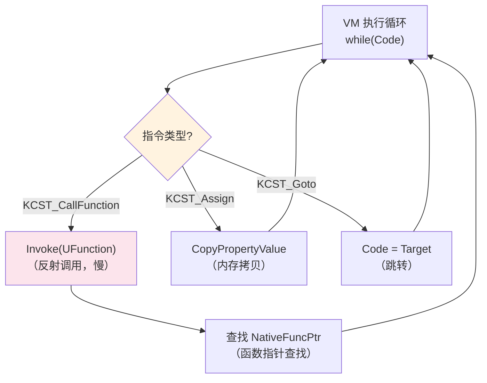
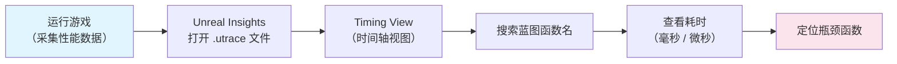
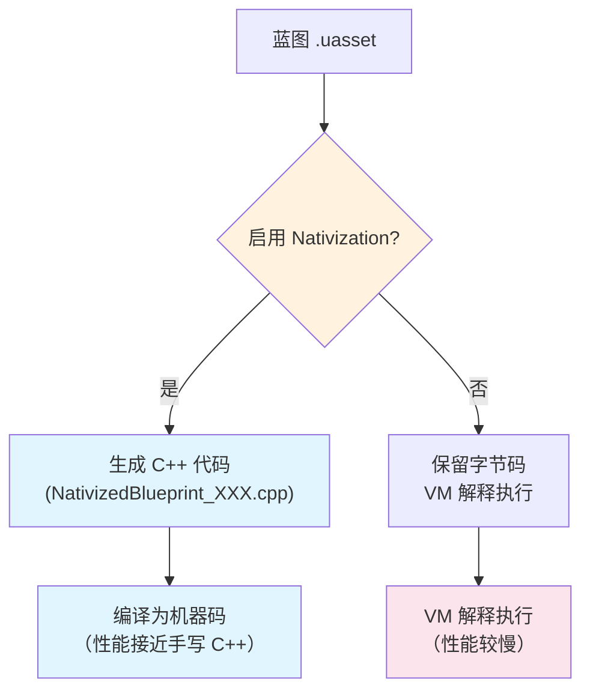
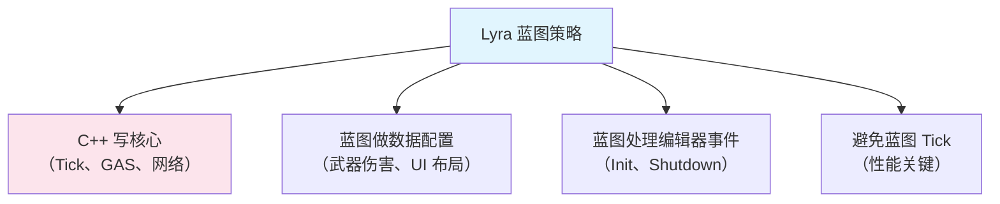

# 蓝图性能分析与优化

> 蓝图不是"免费"的——VM 解释执行比 C++ 慢 **10-50x**。本课教你如何分析、诊断、优化蓝图性能。

## 概述

学完本课你将能够：
- 量化蓝图 vs C++ 的性能差距（具体倍数）
- 使用 `Stat Unit` / `Unreal Insights` 分析蓝图性能瓶颈
- 决定"这段代码应该用 C++ 写"
- 启用 Nativization（Cook 时转 C++）

## 蓝图性能瓶颈：VM 解释执行

蓝图编译后生成的是 **字节码**，`Kismet VM` 逐条解释执行。

### 性能对比：蓝图 vs C++

| 操作 | 蓝图（VM） | C++（原生） | 倍数 |
|------|------------|------------|------|
| 简单函数调用 | ~50 ns | ~5 ns | **10x** |
| 属性访问（Get/Set） | ~30 ns | ~1 ns | **30x** |
| 循环 1000 次 | ~50 μs | ~5 μs | **10x** |
| `Tick`（每帧） | 显著开销 | 可忽略 | **N/A** |

**底层原因**：



### `UObject::ProcessInternal()` 的开销

```cpp
// 文件：Engine/Source/Runtime/CoreUObject/Private/UObject/ScriptCore.cpp
// 约 L1000-L1100（基于 UE 5.7）

void UObject::ProcessInternal(FFrame& Stack, RESULT_DECL)
{
    while (Stack.Code != nullptr)
    {
        FBlueprintCompiledStatement* Statement = Stack.Code;
        Stack.Code++;  // [1] 移动指令指针

        switch (Statement->Type)  // [2] 分发（switch-case 开销）
        {
            case KCST_CallFunction:
                {
                    UFunction* FunctionToCall = Statement->FunctionToCall;
                    // [3] 通过反射调用（比直接调用慢）
                    FunctionToCall->Invoke(Stack.Obj, Stack, RESULT_PARAM);
                }
                break;

            case KCST_Assign:
                {
                    // [4] 属性拷贝（通过 FProperty 反射）
                    CopySingleProperty(Statement->LHS, Statement->RHS);
                }
                break;

            // ... 处理其他 40+ 种指令
        }
    }
}
```

**关键开销点**：
1. **Switch-case 分发**：每条指令都要进入 switch
2. **UFunction::Invoke()**：通过反射查找 NativeFuncPtr，再调用
3. **属性拷贝**：通过 `FProperty` 反射，不是编译时确定的内存偏移

## 性能分析工具

### 1. `Stat Unit`：快速查看帧耗时

```
// 在编辑器或 PIE 中按 `~` 打开控制台，输入：
Stat Unit
```

输出示例：
```
Frame: 8.5 ms  (目标：<16.6 ms @ 60 FPS)
Game: 5.2 ms   (游戏线程，蓝图主要在这里)
Draw: 2.1 ms   (渲染线程)
GPU: 1.8 ms
```

如果 `Game` 线程耗时过高，可能是蓝图 Tick / 复杂逻辑导致。

### 2. `Unreal Insights`：详细性能分析

**步骤**：
1. 打开 `Unreal Insights`（编辑器菜单 → **Tools** → **Unreal Insights**）
2. 运行游戏，复现性能问题
3. 停止，查看 **Timing View**
4. 搜索你的蓝图函数名，查看耗时



### 3. `Stat Blueprint`：蓝图专用统计

```
// 控制台输入：
Stat Blueprint
```

输出示例：
```
Blueprint VM:
  Active Instances: 1234
  VM Tick Time: 2.5 ms  ← 关键：VM 在 Tick 中的总耗时
  Function Calls: 5678
```

如果 `VM Tick Time` > 2-3 ms，需要考虑优化。

## 优化策略

### 策略 1：高频逻辑用 C++ 重写

**红线**：以下逻辑**必须**用 C++ 写：
- `Tick`（每帧执行）
- 碰撞检测回调（`OnHit`、`OnOverlap`）
- 循环 >100 次的算法
- 物理模拟、AI 决策

```cpp
// ✅ 好：C++ Tick
void AMyActor::Tick(float DeltaTime)
{
    Super::Tick(DeltaTime);

    // 高性能逻辑（直接机器码）
    UpdatePosition(DeltaTime);
}

// ❌ 差：蓝图 Tick
// Event Tick → Update Position（VM 解释执行，慢 10x）
```

### 策略 2：缓存 `Cast<>` 结果

`Cast<>` 需要**遍历继承链**（`IsChildOf()`），高频调用有开销。

```cpp
// ❌ 差：每帧 Cast
void AMyActor::Tick(float DeltaTime)
{
    Super::Tick(DeltaTime);

    ALyraCharacter* Char = Cast<ALyraCharacter>(GetOwner());  // 每帧 Cast，慢
    if (Char)
    {
        Char->DoSomething();
    }
}

// ✅ 好：缓存 Cast 结果
void AMyActor::BeginPlay()
{
    Super::BeginPlay();

    CachedCharacter = Cast<ALyraCharacter>(GetOwner());  // 只 Cast 一次
}

void AMyActor::Tick(float DeltaTime)
{
    Super::Tick(DeltaTime);

    if (CachedCharacter)
    {
        CachedCharacter->DoSomething();  // 直接用缓存，快
    }
}

private:
    TObjectPtr<ALyraCharacter> CachedCharacter = nullptr;
```

### 策略 3：减少 `Get Actor of Class` 等全局搜索

`Get Actor of Class` 遍历**所有** Actor，O(n) 复杂度。

```cpp
// ❌ 差：每帧搜索
void AMyActor::Tick(float DeltaTime)
{
    TArray<ALyraCharacter*> Characters;
    UGameplayStatics::GetAllActorsOfClass(this, ALyraCharacter::StaticClass(), Characters);  // O(n)，慢
}

// ✅ 好：用 GameState 存储列表，或事件驱动
void AMyGameMode::OnPlayerLogin(APlayerController* PC)
{
    // 玩家登录时添加到列表（事件驱动，不是每帧搜索）
    PlayerList.Add(PC->GetPawn());
}
```

### 策略 4：Nativization（Cook 时转 C++）

UE 提供 **Nativization** 功能：Cook 时将蓝图转换为**真正的 C++ 代码**，消除 VM 开销。

#### 启用方式

1. **项目设置** → **Blueprint Nativization** → 设置为 `Always Enabled`
2. 单个蓝图：Details 面板 → `Class Settings` → `Nativize Blueprint`

#### 原理

```
蓝图节点图 → Kismet 编译器 → 字节码 → [Nativization] → C++ 代码 .cpp → 编译为机器码
```

#### 限制

Nativization 并非万能，以下场景**无法**正确转换：

| 限制 | 说明 | 规避方式 |
|------|------|----------|
| **不支持所有节点** | 涉及动态类型（如 `Get Class`、`Cast to` 未知类型）、反射调用（`Call Function` 动态绑定）的节点无法完全转换 | 这类逻辑改回 C++ 手写 |
| **调试困难** | Nativize 后的代码是自动生成的 `.cpp`，断点无法映射回蓝图节点 | 核心逻辑本来就应该用 C++ 写 |
| **Cook 时间增加** | 每个启用 Nativization 的蓝图都会额外生成并编译一个 `.cpp` | 只对性能瓶颈蓝图启用，不要全开 |
| **不支持 Blueprint Macro** | 宏库（Macro Library）无法被 Nativize | 宏改为 `BlueprintFunctionLibrary` 静态函数 |
| **运行时反射依赖** | 节点图中通过 `Get All Actors of Class` 等运行时反射的逻辑，转换后行为可能不一致 | 改用 C++ 的 `TArray<AActor*>` 显式管理 |

> **实践建议**：Lyra 根本不用 Nativization——它的核心逻辑本来就是 C++，不存在"蓝图转 C++"的需求。这才是正确的架构思路。



## Lyra 中的实践：核心逻辑全用 C++

Lyra **不用**蓝图写核心逻辑，原因就是性能。

### 观察：Lyra 的 C++ 覆盖率

| 系统 | C++ | 蓝图 |
|------|-----|------|
| 角色 | `ALyraCharacter`（C++） | 少量派生蓝图（如 `BP_Hero_ShooterGun`） |
| 武器 | `ULyraWeaponInstance`（C++） | 数据配置蓝图（`BP_Weapons` 系列） |
| GAS | `ULyraGameplayAbility`（C++） | 简单 Ability 可用蓝图，但 Lyra 全用 C++ |
| UI | `ULyraUIManagerComponent`（C++） | Widget 蓝图（UMG） |
| Tick | `ALyraCharacter::Tick()`（C++） | 无（Tick 逻辑全在 C++） |

### Lyra 的蓝图使用策略



**为什么？**
- `ALyraCharacter::Tick()` 每帧执行，如果放蓝图，**100+ 角色同屏时性能崩溃**
- GAS 的 `UGameplayAbility::ActivateAbility()` 调用频繁，必须用 C++
- 网络复制的 `OnRep_` 函数，C++ 比蓝图快 **30x**

## 常见问题与陷阱

### 陷阱 1：Tick 中的蓝图逻辑太重

**问题**：`Event Tick` 中做了复杂计算（循环、字符串操作），帧率下降。

**解决**：
1. 将逻辑移到 C++
2. 或降低执行频率（用 `Set Timer by Function Name`，不是每帧执行）

```cpp
// ✅ 好：降低执行频率
void AMyActor::BeginPlay()
{
    Super::BeginPlay();

    // 每 0.1 秒执行一次，不是每帧
    GetWorldTimerManager().SetTimer(
        TickTimerHandle,
        this,
        &AMyActor::OnTimerTick,
        0.1f,  // 间隔 100 ms
        true  // 循环
    );
}
```

### 陷阱 2：Nativization 后蓝图打不开

**问题**：Nativize 后的蓝图，编辑器无法再"反编译"回节点图。

**解决**：保留一份**未 Nativize 的备份**。

### 陷阱 3：蓝图函数调用蓝图函数，开销叠加

**问题**：蓝图 A 调用蓝图 B 的函数，再调用蓝图 C 的函数 → **VM 开销叠加**。

**解决**：核心调用链用 C++ 写，蓝图只做叶子节点。

## 总结与要点

| 要点 | 说明 |
|------|------|
| **VM 开销 10-50x** | 蓝图解释执行，比 C++ 慢很多 |
| **高频逻辑用 C++** | Tick、碰撞、循环 >100 次必须用 C++ |
| **缓存 Cast<> 结果** | 避免每帧遍历继承链 |
| **Nativization 可优化** | Cook 时转 C++，但 Lyra 不用（核心逻辑本来就是 C++） |
| **Lyra 的策略** | C++ 写核心，蓝图做数据配置 |

## 相关页面

- [[30-tutorials/blueprint-system/00-UE蓝图系统从入门到实战|蓝图系统概览]] — 系列导航
- [[30-tutorials/blueprint-system/02-蓝图VM与字节码|蓝图 VM 与字节码]] — VM 执行流程详解
- [[30-tutorials/performance-optimization/02-CPU性能优化|CPU 性能优化]] — 更广泛的性能优化技巧
- [[30-tutorials/ue-framework/60-tick-system/00-Tick系统架构概述|Tick 系统架构概述]] — Tick 的性能影响

---
> 最后更新：2026-05-19

<!-- nav:auto -->

---

**导航**: ← [[30-tutorials/blueprint-system/05-蓝图继承与接口|05-蓝图继承与接口]] · [[30-tutorials/blueprint-system/07-高级主题与常见陷阱|07-高级主题与常见陷阱]] →

<!-- /nav:auto -->
