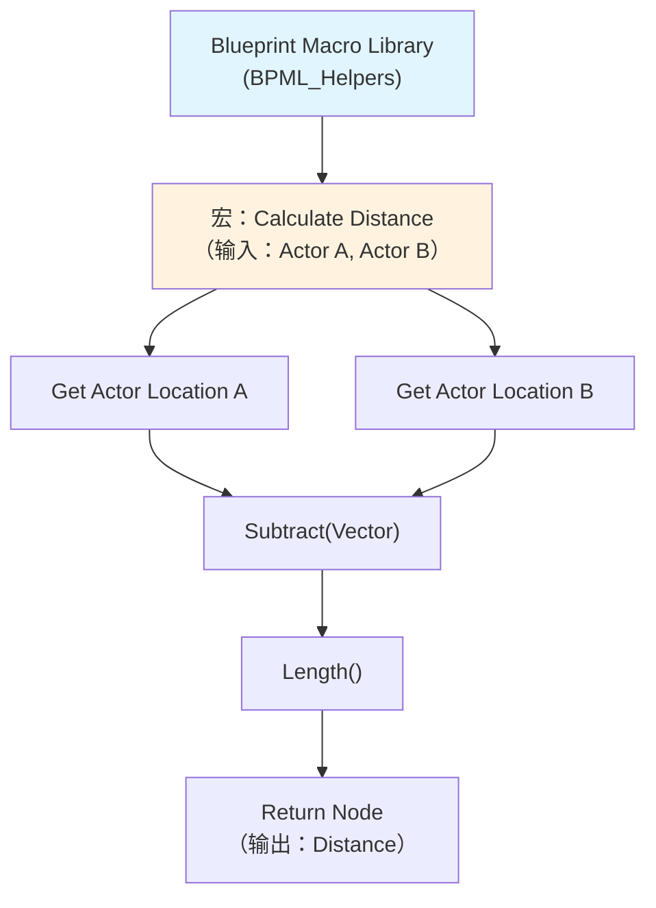
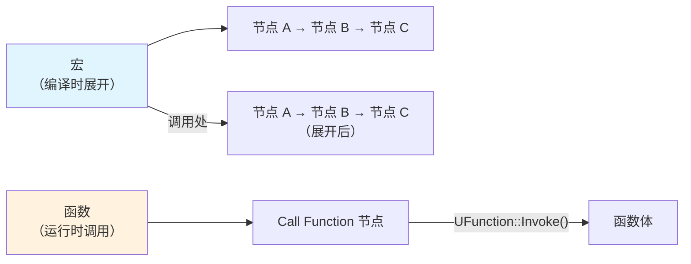
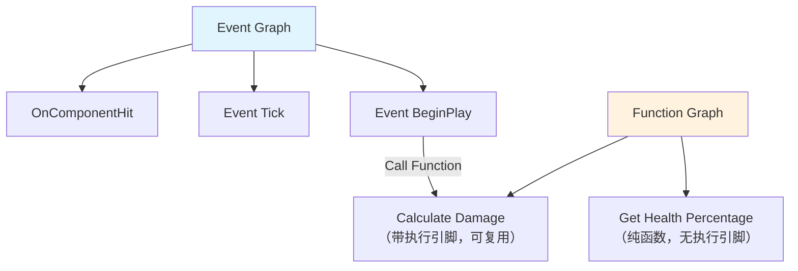
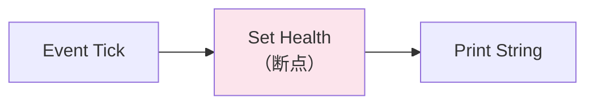
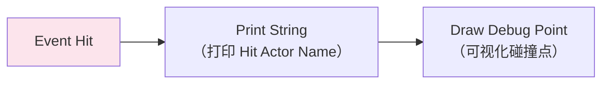
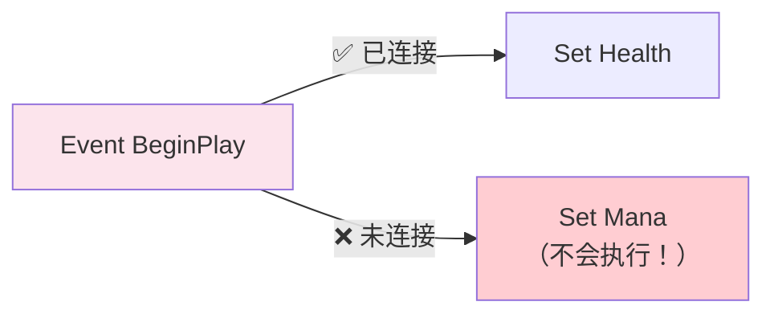
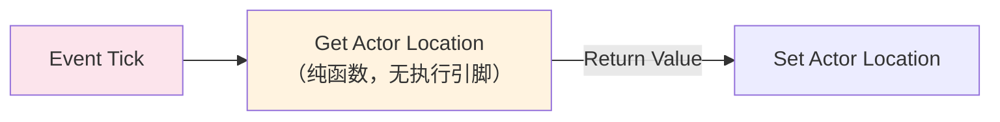
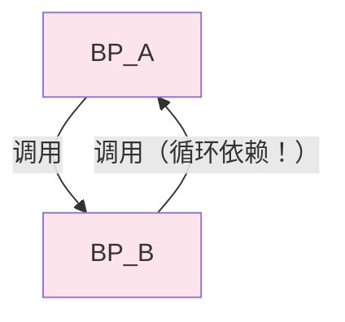
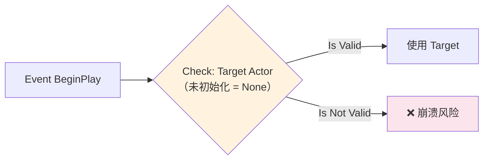

# 高级主题与常见陷阱

> 本课覆盖蓝图的高级用法（宏、Construction Script、调试）以及**最容易踩的坑**。学会这些，你的蓝图将更稳健、更易维护。

## 概述

学完本课你将能够：
- 创建和使用蓝图宏（Macro）——可复用节点组
- 理解 `Construction Script` 的执行时机与性能陷阱
- 使用蓝图调试器（断点、监视、单步执行）
- 识别和避免常见陷阱（循环依赖、未连接执行线、高频 Tick）

## 蓝图宏（Blueprint Macro）

宏是**可复用节点组**，类似 C++ 的 `inline` 函数（编译时展开）。

### 创建宏库

1. Content Browser → 右键 → **Blueprint Class** → **Blueprint Macro Library**
2. 选择父类（通常选 `Object`）
3. 命名（如 `BPML_Helpers`）
4. 打开，添加宏（My Blueprint 面板 → **Macros** → **Add New Macro**）



### 宏 vs 函数

| 维度 | 宏（Macro） | 函数（Function） |
|------|------------|--------------|
| **执行时机** | 编译时展开（类似 C++ inline） | 运行时调用（有调用开销） |
| **可以包含** | 执行节点（有白色执行引脚） | 只能有纯函数节点（无执行引脚） |
| **Latent Action** | ✅ 支持（如 `Delay`） | ❌ 不支持 |
| **复用性** | 跨蓝图复用（Macro Library） | 仅当前蓝图可用 |
| **性能** | 展开后代码更大，但无调用开销 | 有 VM 调用开销 |



### 最佳实践

- **用宏封装"需要 Latent Action"的复用逻辑**（如"等待 1 秒后执行 X"）
- **用函数封装"纯计算"逻辑**（无执行引脚，性能更好）
- **宏库（Macro Library）放在 Content 根目录**，方便所有蓝图引用

## Construction Script：构造时执行

`Construction Script` 在以下时机执行：
1. **编辑器放置时**（拖入关卡）
2. **每次属性修改时**（在 Details 面板改值 → 实时预览）
3. **运行时 Spawn 时**（创建 Actor 实例）

```mermaid
sequenceDiagram
    participant Editor as 编辑器
    participant Actor as MyActor\n（Construction Script）
    participant Runtime as 运行时\n（Spawn Actor）

    Editor->>Actor: 拖入关卡
    Actor->>Actor: 执行 Construction Script\n（预览效果）

    Editor->>Actor: 修改属性（如 Size）
    Actor->>Actor: 再次执行 Construction Script\n（实时更新）

    Runtime->>Actor: Spawn Actor
    Actor->>Actor: 执行 Construction Script\n（运行时初始化）
```

### 性能陷阱

**问题**：`Construction Script` 在**每次属性修改**时执行。如果有**复杂计算**或**Spawn 其他 Actor**，编辑器会卡顿。

```cpp
// ❌ 差：Construction Script 中 Spawn 大量 Actor
// 每次改属性 → 重新 Spawn → 编辑器卡顿

// ✅ 好：用 BeginPlay 替代（只在运行时执行一次）
Event BeginPlay → （初始化逻辑）
```

### Lyra 的做法

Lyra **不用** `Construction Script` 做复杂初始化，而是用 C++ 的 `PostInitProperties()` 或 `OnComponentCreated()`。

## Event Graph vs Function Graph

蓝图中有两种"函数图"：

| 类型 | 执行引脚 | 调用方式 | 适用场景 |
|------|----------|----------|------------|
| **Event Graph** | 有（`Event BeginPlay` 等） | 由引擎事件触发 | 事件驱动逻辑（输入、重叠、伤害） |
| **Function Graph** | 无（纯函数）或 有（带执行引脚） | 其他节点调用 | 可复用逻辑（计算、数据转换） |



### 最佳实践

- **事件驱动逻辑** → 放 `Event Graph`（`BeginPlay`、`Tick`、`OnHit`）
- **可复用计算** → 放 `Function Graph`（纯函数，无状态）
- **需要 Latent Action** → 放 `Event Graph` 或 **宏**（函数不支持 Latent Action）

## 蓝图调试技巧

### 1. 断点（Breakpoint）

在节点上 **右键 → Toggle Breakpoint**，运行时会在该节点暂停。



**操作**：
1. PIE（Play）→ 触发断点 → 编辑器暂停
2. 悬停节点引脚 → 查看当前值
3. **F10** 单步执行（Step Over）
4. **F11** 进入函数（Step Into）

### 2. 监视变量（Watch）

在变量上 **右键 → Watch this value**，实时查看变量变化。

### 3. 打印调试（Print String / Draw Debug）



**最佳实践**：
- 用 `Print String` 快速调试（屏幕显示）
- 用 `UE_LOG` 写入日志文件（C++ 函数，蓝图可调用 `Print String` 的 `bPrint To Log` 选项）

## 常见陷阱与解决方案

### 陷阱 1：执行线未连接，节点不执行



**解决**：确保所有需要执行的节点都有**白色执行线**连接。

### 陷阱 2：纯函数节点没有执行引脚

`Get Actor Location`、`+（int）` 等**纯函数**没有白色执行引脚：
- 它们只在**数据线**被连接时才执行
- 它们不会出现在执行流中



### 陷阱 3：循环依赖（Circular Dependency）

**问题**：蓝图 A 调用蓝图 B 的函数，蓝图 B 又调用蓝图 A 的函数 → **编译错误**。



**解决**：
1. 用 **C++ 父类** 定义接口，蓝图 A/B 都调用 C++ 函数
2. 或用 **Blueprint Interface** 解耦

### 陷阱 4：Tick 中的蓝图逻辑太重

**问题**：`Event Tick` 中做了复杂计算（循环、字符串操作），帧率下降。

**解决**：
1. 将逻辑移到 **C++**（性能提升 10-50x）
2. 或降低执行频率（用 `Set Timer by Function Name`，不是每帧执行）

```cpp
// ✅ 好：降低执行频率
void AMyActor::BeginPlay()
{
    Super::BeginPlay();

    // 每 0.1 秒执行一次，不是每帧
    GetWorldTimerManager().SetTimer(
        TickTimerHandle,
        this,
        &AMyActor::OnTimerTick,
        0.1f,  // 间隔 100 ms
        true  // 循环
    );
}
```

### 陷阱 5：未初始化变量，默认值 `None`

**问题**：蓝图变量未初始化（默认 `None`/`0`/`false`），运行时访问导致错误。



**解决**：
1. 在 **变量声明时** 设置默认值（Details 面板）
2. 或在 `Event BeginPlay` / `Construction Script` 中初始化

## Lyra 中的实践：避免蓝图陷阱

Lyra 的蓝图使用严格遵守以下规则：

### 规则 1：核心逻辑全用 C++

| 系统 | C++ | 蓝图 |
|------|-----|------|
| 角色 | `ALyraCharacter`（C++） | 少量派生蓝图（如 `BP_Hero_ShooterGun`） |
| 武器 | `ULyraWeaponInstance`（C++） | 数据配置蓝图（`BP_Weapons` 系列） |
| GAS | `ULyraGameplayAbility`（C++） | 简单 Ability 可用蓝图，但 Lyra 全用 C++ |

### 规则 2：蓝图只做数据配置

```cpp
// 示例：Lyra 的武器数据资产（C++ 定义）
USTRUCT(BlueprintType)
struct FLyraWeaponData
{
    GENERATED_BODY()

    // [1] 蓝图可配置这些属性
    UPROPERTY(EditAnywhere, BlueprintReadWrite)
    float Damage = 10.0f;

    UPROPERTY(EditAnywhere, BlueprintReadWrite)
    TSubclassOf<ULyraWeaponInstance> WeaponClass;
};

// [2] 蓝图实例化这个结构体，填充数据
// Content/Weapons/BP_Weapon_Rifle.uasset → 设置 Damage = 25.0
```

### 规则 3：用 C++ 虚函数代替 Blueprint Interface

（性能更好，避免接口查找开销）

## 总结与要点

| 要点 | 说明 |
|------|------|
| **宏 = 可复用节点组** | 支持 Latent Action，但编译时展开（代码更大） |
| **Construction Script = 编辑器中执行** | 每次属性修改时执行，避免复杂计算 |
| **Event Graph = 事件驱动** | `BeginPlay`、`Tick`、`OnHit` 等 |
| **Function Graph = 可复用逻辑** | 纯函数（无状态）或带执行引脚的函数 |
| **调试：断点 + 监视** | 悬停引脚查看值，F10/F11 单步执行 |
| **Lyra 的策略** | C++ 写核心，蓝图做数据配置 + 编辑器事件 |

## 相关页面

- [[30-tutorials/blueprint-system/00-UE蓝图系统从入门到实战|蓝图系统概览]] — 系列导航
- [[30-tutorials/blueprint-system/04-C++与蓝图交互|C++ 与蓝图交互]] — `UFUNCTION(BlueprintCallable)` 详解
- [[30-tutorials/blueprint-system/06-蓝图性能分析与优化|蓝图性能分析与优化]] — Tick 性能优化
- [[30-tutorials/ue-framework/60-tick-system/00-Tick系统架构概述|Tick 系统架构概述]] — Tick 的性能影响

---
> 最后更新：2026-05-19

<!-- nav:auto -->

---

**导航**: ← [[30-tutorials/blueprint-system/06-蓝图性能分析与优化|06-蓝图性能分析与优化]] · [[30-tutorials/blueprint-system/08-Lyra项目中的蓝图实践|08-Lyra项目中的蓝图实践]] →

<!-- /nav:auto -->
