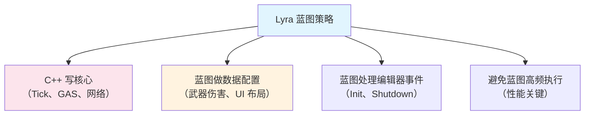
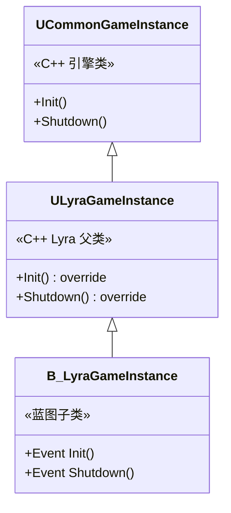
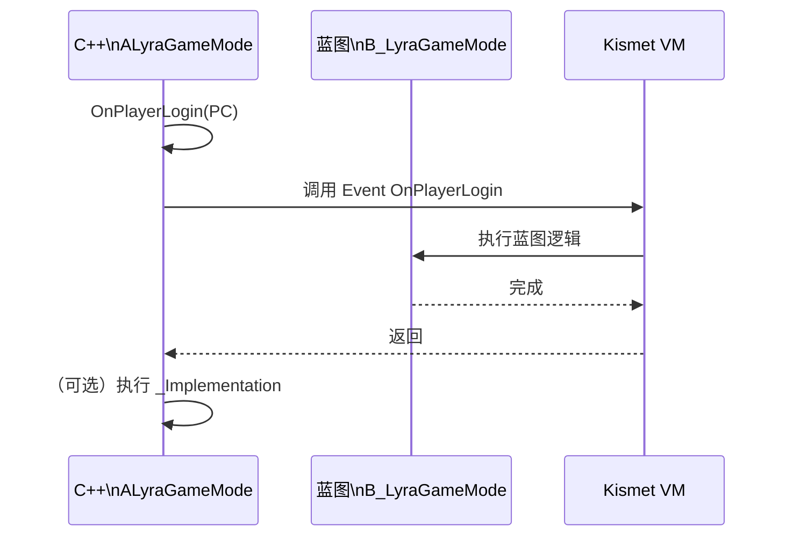
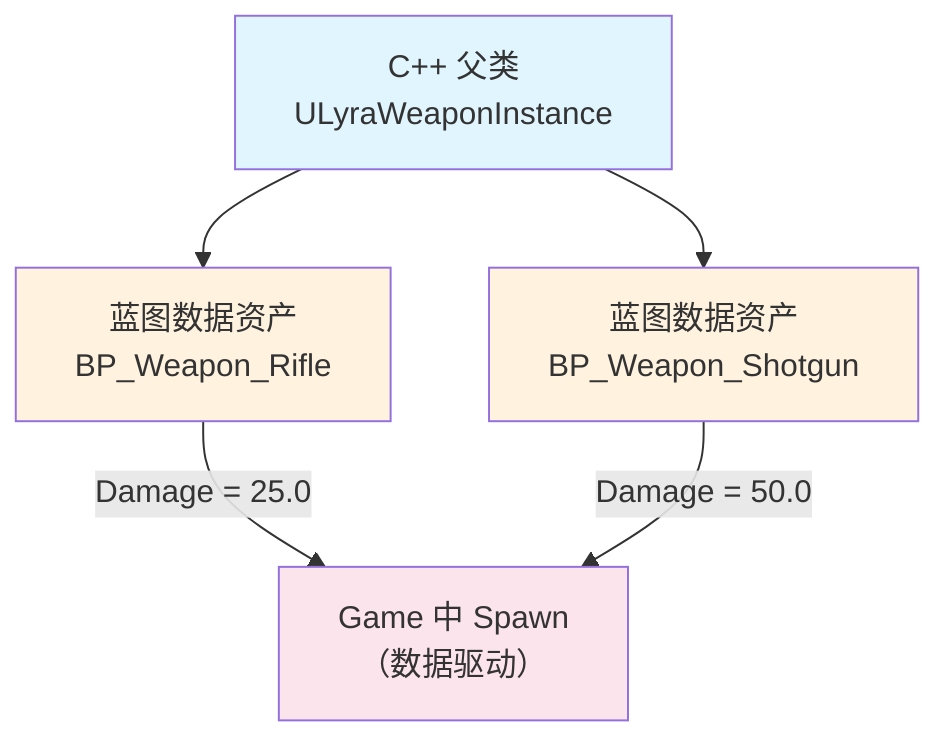
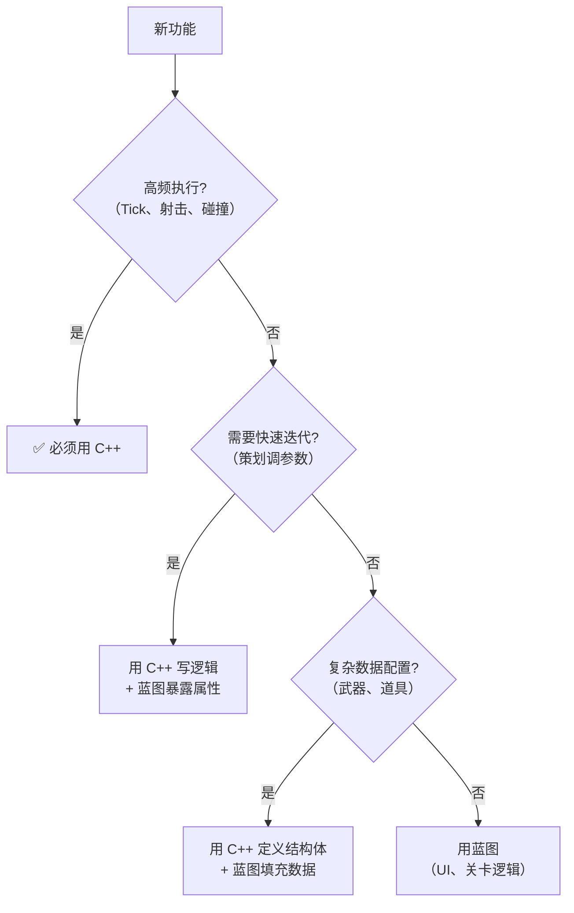

# Lyra项目中的蓝图实践

> Lyra **不用**蓝图写核心逻辑——它的策略是 **"C++ 写底层，蓝图做数据配置"**。本课深入分析 Lyra 的蓝图使用策略。

## 概述

学完本课你将能够：
- 解释 Lyra 的 **C++/蓝图职责划分**原则
- 分析 `B_LyraGameInstance` / `B_LyraGameMode` 等蓝图资产
- 理解为什么 Lyra 的核心系统（GAS、网络）全用 C++
- 借鉴 Lyra 的蓝图策略到自己的项目

## Lyra 的蓝图使用策略

Lyra 有一套**明确的 C++/蓝图分工**原则：



### 分工原则

| 系统 | C++ | 蓝图 | 原因 |
|------|-----|------|------|
| 角色 | `ALyraCharacter`（C++） | 少量派生蓝图（如 `BP_Hero_ShooterGun`） | Tick 性能关键 |
| 武器 | `ULyraWeaponInstance`（C++） | 数据配置蓝图（`BP_Weapons` 系列） | 武器实例高频生成 |
| GAS | `ULyraGameplayAbility`（C++） | 简单 Ability 可用蓝图，但 Lyra 全用 C++ | 网络复制性能 |
| UI | `ULyraUIManagerComponent`（C++） | Widget 蓝图（UMG） | UI 事件低频 |
| GameInstance | `ULyraGameInstance`（C++） | `B_LyraGameInstance`（重写事件） | 初始化逻辑 |

## 案例 1：`ULyraGameInstance`（C++）→ `B_LyraGameInstance`（蓝图）

### C++ 父类定义

```cpp
// 文件：Source/LyraGame/System/LyraGameInstance.h
// 约 L14-L40（基于 UE 5.7）

UCLASS(MinimalAPI, Config = Game)
class ULyraGameInstance : public UCommonGameInstance
{
    GENERATED_BODY()

public:
    UE_API ULyraGameInstance(const FObjectInitializer& ObjectInitializer = FObjectInitializer::Get());

protected:
    // [1] 蓝图可重写的虚函数（C++ 有默认实现）
    UE_API virtual void Init() override;
    UE_API virtual void Shutdown() override;

    // [2] 蓝图可重写的事件（蓝图提供实现）
    // 注意：Lyra 实际用 BlueprintNativeEvent，不是 ImplementableEvent
};
```

### 蓝图子类

在 Content 根目录的 `B_LyraGameInstance.uasset`：
- **Parent Class**：`ULyraGameInstance`（C++）
- **重写的函数**：`Event Init`、`Event Shutdown`
- **蓝图逻辑**：初始化 Online 子系统、加载主菜单



### 蓝图中的实现

```
Event Init
  → （蓝图逻辑：初始化 Online 子系统）
  → Call C++ Function: TransitionToMainMenu()
```

**关键点**：
- C++ 的 `Init()` 调用 `B_LyraGameInstance` 的 `Event Init`（如果蓝图重写了）
- 蓝图执行完后，继续执行 C++ 的 `Init_Implementation()`

## 案例 2：`ALyraGameMode`（C++）→ `B_LyraGameMode`（蓝图）

### C++ 父类

```cpp
// 文件：Source/LyraGame/GameModes/LyraGameMode.h

UCLASS(MinimalAPI)
class ULyraGameMode : public AGameModeBase
{
    GENERATED_BODY()

public:
    // [1] 蓝图可调用（C++ 实现）
    UFUNCTION(BlueprintCallable, Category="Lyra|GameMode")
    void TransitionToNextLevel();

    // [2] 蓝图可重写（C++ 有默认实现）
    UFUNCTION(BlueprintNativeEvent, Category="Lyra|GameMode")
    void OnPlayerLogin(APlayerController* PC);
};
```

### 蓝图子类

`B_LyraGameMode.uasset`：
- **Parent Class**：`ALyraGameMode`（C++）
- **重写的函数**：`Event OnPlayerLogin`
- **蓝图逻辑**：设置玩家 HUD、初始化血量



## 案例 3：武器数据配置（C++ 定义 + 蓝图填充）

Lyra **不用**蓝图写武器逻辑，而是用 **C++ 定义数据结构 + 蓝图填充数据**。

### C++ 数据结构

```cpp
// 文件：Source/LyraGame/Weapons/LyraWeaponInstance.h

UCLASS()
class ULyraWeaponInstance : public UObject
{
    GENERATED_BODY()

public:
    // [1] 蓝图可配置的属性
    UPROPERTY(EditAnywhere, BlueprintReadWrite, Category="Weapon")
    float Damage = 10.0f;

    UPROPERTY(EditAnywhere, BlueprintReadWrite, Category="Weapon")
    float FireRate = 0.1f;  // 秒/发

    UPROPERTY(EditAnyhere, BlueprintReadWrite, Category="Weapon")
    TSubclassOf<class ALyraProjectile> ProjectileClass;
};

// 文件：Source/LyraGame/Weapons/LyraWeaponDefinition.h

USTRUCT(BlueprintType)
struct FLyraWeaponData
{
    GENERATED_BODY()

    UPROPERTY(EditAnywhere, BlueprintReadWrite)
    float Damage = 10.0f;

    UPROPERTY(EditAnywhere, BlueprintReadWrite)
    TSubclassOf<ULyraWeaponInstance> WeaponClass;
};
```

### 蓝图数据资产

在 Content/Weapons/ 下：
- `BP_Weapon_Rifle.uasset` → 设置 `Damage = 25.0`，`FireRate = 0.08`
- `BP_Weapon_Shotgun.uasset` → 设置 `Damage = 50.0`，`FireRate = 0.5`



**关键点**：
- 武器逻辑（射击、碰撞检测）全在 C++（`ULyraWeaponInstance`）
- 蓝图只做**数据配置**（伤害、射速、抛体类型）
- 性能：运行时**没有** VM 开销（逻辑在 C++）

## 为什么 Lyra 不用蓝图写核心逻辑？

### 性能数据

| 操作 | 蓝图（VM） | C++（原生） | 倍数 |
|------|------------|------------|------|
| 简单函数调用 | ~50 ns | ~5 ns | **10x** |
| 属性访问（Get/Set） | ~30 ns | ~1 ns | **30x** |
| 循环 1000 次 | ~50 μs | ~5 μs | **10x** |
| `Tick`（每帧） | 显著开销 | 可忽略 | **N/A** |

### Lyra 的性能关键系统

| 系统 | 调用频率 | 如果用蓝图 | 后果 |
|------|-----------|----------|------|
| `ALyraCharacter::Tick()` | 每帧 × 玩家数 | 帧率下降 **50%+** | 不可接受 |
| `ULyraGameplayAbility::ActivateAbility()` | 每次射击/技能 | 网络延迟增加 | 玩家可感知 |
| `ULyraWeaponInstance::Fire()` | 每帧（全自动武器） | 帧率崩溃 | 不可接受 |

**结论**：Lyra 的核心系统**必须**用 C++ 写。

## Lyra 的蓝图优化策略

### 策略 1：C++ 写核心，蓝图做数据配置

```cpp
// ✅ 好：C++ 写逻辑，蓝图配置数据
// C++ 逻辑
void ULyraWeaponInstance::Fire()
{
    // [1] 核心逻辑在 C++（高性能）
    FireProjectile();

    // [2] 数据从蓝图配置读取（无 VM 开销）
    float Damage = GetDamage();  // 直接读属性（C++ 成员变量）
}

// 蓝图只做：
// - 设置 Damage 值（编辑时）
// - 选择 ProjectileClass（编辑时）
```

### 策略 2：高频逻辑不在蓝图 Tick 中执行

```cpp
// ❌ 差：蓝图 Event Tick 中做复杂逻辑
// Event Tick → Fire() → 每帧 VM 开销

// ✅ 好：C++ Tick，蓝图只配置
void ALyraCharacter::Tick(float DeltaTime)
{
    Super::Tick(DeltaTime);

    // [1] 核心逻辑在 C++
    UpdateWeaponFire(DeltaTime);

    // [2] 蓝图可选重写（低频事件）
    if (bShouldCallBlueprint)
    {
        OnBlueprintTick(DeltaTime);  // 蓝图事件（不是每帧调用）
    }
}
```

### 策略 3：用 C++ 虚函数代替 Blueprint Interface

（性能更好，避免接口查找开销）

```cpp
// ❌ 较差：Blueprint Interface（运行时查找函数）
// 调用：Message: OnDamaged(Amount)

// ✅ 好：C++ 虚函数（编译时确定调用地址）
UCLASS(Blueprintable)
class ALyraCharacter : public ACharacter
{
    GENERATED_BODY()

public:
    // [1] C++ 虚函数（性能好）
    UFUNCTION(BlueprintNativeEvent, Category="Lyra|Character")
    void OnDamaged(float Amount);
};

// [2] 蓝图可选重写（低频事件）
// Event OnDamaged → （蓝图逻辑）
```

## 借鉴到你的项目

### 决策树：用 C++ 还是蓝图？



### Lyra 策略清单

| 原则 | 说明 |
|------|------|
| **C++ 写核心** | Tick、GAS、网络、物理用 C++ |
| **蓝图做配置** | 暴露 `UPROPERTY(BlueprintReadWrite)` 让策划调参数 |
| **避免蓝图 Tick** | 高频逻辑全放 C++ |
| **用 C++ 虚函数** | 代替 Blueprint Interface（性能更好） |
| **Nativization 不用** | 核心逻辑本来就是 C++，不需要 |

## 常见问题与陷阱

### 陷阱 1：蓝图 Tick 中做复杂计算

**问题**：`Event Tick` 中做了循环、字符串操作，帧率下降。

**解决**：
1. 将逻辑移到 C++
2. 或降低执行频率（用 `Set Timer by Function Name`）

### 陷阱 2：过度依赖蓝图接口

**问题**：`Message: OnDamaged` 运行时查找函数，有开销。

**解决**：用 **C++ 虚函数**（`BlueprintNativeEvent`）代替。

### 陷阱 3：Construction Script 在运行时执行

**问题**：`Construction Script` 在**每次 Spawn** 时执行，影响性能。

**解决**：
- 高频 Spawn 的 Actor → **不要用 Construction Script**
- 用 `BeginPlay` 代替

## 总结与要点

| 要点 | 说明 |
|------|------|
| **Lyra 策略** | C++ 写核心，蓝图做数据配置 |
| **性能关键** | Tick、GAS、网络、武器逻辑全用 C++ |
| **蓝图适用** | UI、关卡逻辑、数据配置 |
| **避免蓝图 Tick** | 高频逻辑必须放 C++ |
| **用 C++ 虚函数** | 代替 Blueprint Interface（性能 + 类型安全） |

## 相关页面

- [[30-tutorials/blueprint-system/00-UE蓝图系统从入门到实战|蓝图系统概览]] — 系列导航
- [[30-tutorials/blueprint-system/04-C++与蓝图交互|C++ 与蓝图交互]] — `UFUNCTION(BlueprintNativeEvent)` 详解
- [[30-tutorials/blueprint-system/06-蓝图性能分析与优化|蓝图性能分析与优化]] — 性能对比数据
- [[30-tutorials/ue-framework/70-lyra-case-study/00-Lyra架构总览|Lyra 架构总览]] — Lyra 整体架构

---
> 最后更新：2026-05-19

<!-- nav:auto -->

---

**导航**: ← [[30-tutorials/blueprint-system/07-高级主题与常见陷阱|07-高级主题与常见陷阱]]

<!-- /nav:auto -->
