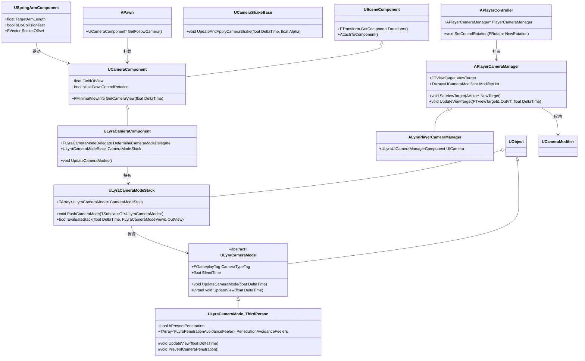

# UE摄像机-Camera系统从入门到实战

> 系统学习 UE5 摄像机系统的核心概念、引擎层实现，以及 Lyra 项目中的完整实战应用。

## 概述

在 UE 中，**摄像机（Camera）** 是玩家观察游戏世界的「眼睛」。无论是在第三人称游戏中跟随角色的摄像机，还是第一人称视角中 attachment 在头部的摄像机，本质都由 `UCameraComponent` 产出一帧的视图参数（`FMinimalViewInfo`），再由 `APlayerCameraManager` 在每帧将这些参数推送到渲染线程。

本系列不局限于「怎么用」，而是通过**逐层递进**的方式，从引擎底层类的设计讲起，一直深入到 Lyra 项目中 Epic 官方推荐的多人游戏摄像机架构：

```
引擎层（通用机制）
  ├── UCameraComponent（视图参数生成）
  ├── APlayerCameraManager（视图管理、混合、CameraModifier）
  ├── USpringArmComponent（第三人称手臂）
  └── UCameraShakeBase（相机震动）

Lyra 层（多人游戏最佳实践）
  ├── ULyraCameraComponent（扩展 UCameraComponent，引入 CameraMode 栈）
  ├── ULyraCameraMode（摄像机模式抽象基类）
  ├── ULyraCameraModeStack（多模式混合栈）
  └── ULyraCameraMode_ThirdPerson（具体第三人称实现，含穿透避免）
```

学习完本系列后，你将能够：
- 理解 UE 摄像机视图的完整计算流程（从 Component 到渲染）
- 独立实现类似 Lyra 的「摄像机模式栈」架构，支持多模式平滑混合
- 在自有项目中正确集成摄像机系统（与 Pawn/Controller/Experience 的配合）
- 识别和解决常见的摄像机问题（穿透、抖动、混合不自然）

---

## 核心类关系全景图



---

## 与 Lyra 项目的关系

Lyra 没有直接使用引擎默认的 `APlayerCameraManager::UpdateViewTarget()` 逻辑，而是引入了一套**摄像机模式（Camera Mode）栈系统**，这是 Epic 为多人游戏设计的推荐架构。

| 引擎层概念 | Lyra 中的实现 | 所在文件 |
|-----------|----------------|---------|
| `UCameraComponent` | `ULyraCameraComponent` 扩展，引入 `CameraModeStack` | `Source/LyraGame/Camera/LyraCameraComponent.h` |
| `APlayerCameraManager` | `ALyraPlayerCameraManager`，重写 `UpdateViewTarget` | `Source/LyraGame/Camera/LyraPlayerCameraManager.h` |
| （引擎无对应概念） | `ULyraCameraMode`（抽象模式基类） | `Source/LyraGame/Camera/LyraCameraMode.h` |
| （引擎无对应概念） | `ULyraCameraModeStack`（模式混合栈） | `Source/LyraGame/Camera/LyraCameraMode.h` |
| （引擎无对应概念） | `ULyraCameraMode_ThirdPerson`（具体第三人称模式，含穿透避免） | `Source/LyraGame/Camera/LyraCameraMode_ThirdPerson.h` |
| `UPawnData`（Experience 系统） | `ULyraPawnData::DefaultCameraMode` 配置默认摄像机模式 | `Source/LyraGame/Camera/LyraPawnData.h` |

**设计亮点**：Lyra 的摄像机系统通过 `DetermineCameraModeDelegate` 委托动态选择当前最合适的 CameraMode，使得不同动作状态（行走/瞄准/驾驶）可以无缝切换不同的摄像机行为，且通过栈的混合权重实现平滑过渡。

---

## 系列阅读指南

本系列分三个阶段，建议按顺序阅读。

### 第一阶段：引擎层基础（01-05）

建立对 UE 原生摄像机系统的完整理解，覆盖「视图从哪来、怎么算、怎么混合、怎么震动」的完整链路。

| 篇目 | 标题 | 学完能理解什么 |
|------|------|----------------|
| 01 | ACameraActor 与 UCameraComponent 基础 | CameraComponent 如何挂载到 Actor、FOV/Projection 的核心属性、`GetCameraView()` 的职责 |
| 02 | APlayerCameraManager 详解 | ViewTarget 是什么、CameraManager 如何在每帧更新视图、CameraModifier 栈的工作原理 |
| 03 | USpringArmComponent 深度解析 | 弹簧臂的 Lag 插值、碰撞穿透检测、Socket Offset 的用法 |
| 04 | 摄像机视图计算与投影 | `FMinimalViewInfo` 结构、Perspective/Ortho 投影矩阵、视锥体裁剪基础 |
| 05 | CameraShake 与 CameraModifier | 相机震动的曲线驱动原理、自定义 CameraModifier 的方法 |

### 第二阶段：Lyra 层架构（06-08）

深入 Lyra 的摄像机模式栈设计，这是本系列的**核心价值**所在。

| 篇目 | 标题 | 学完能理解什么 |
|------|------|----------------|
| 06 | LyraCameraComponent 深度解析 | `DetermineCameraModeDelegate` 的工作机制、CameraModeStack 的更新时机、`GetCameraView()` 的重写逻辑 |
| 07 | Lyra 摄像机模式系统 | `ULyraCameraMode` 的生命周期、`ULyraCameraModeStack` 的混合算法、`ULyraCameraMode_ThirdPerson` 的穿透避免射线检测 |
| 08 | Lyra 摄像机与 Experience/PawnData 集成 | `ULyraPawnData::DefaultCameraMode` 如何配置、Experience 加载时 CameraMode 的注入路径、`ULyraPawnExtensionComponent` 的桥接作用 |

### 第三阶段：高级主题与综合案例（09-10）

| 篇目 | 标题 | 学完能理解什么 |
|------|------|----------------|
| 09 | 高级主题与常见陷阱 | 多摄像机切换、Cinematic Camera（Sequencer 驱动）、网络同步注意事项、性能优化（LOD/UpdateRate） |
| 10 | Lyra 摄像机系统完整案例分析 | 从 Pawn Spawn → CameraComponent 初始化 → Mode 选择 → View 计算的全链路 mermaid 时序图 |

---

## 相关页面

- [[30-tutorials/ue-framework/50-player-system/00-APawn与ACharacter详解]] - APawn 与 ACharacter 详解（前置知识）
- [[30-tutorials/ue-framework/50-player-system/01-AController详解]] - AController 详解（前置知识）
- [[30-tutorials/modular-gameplay/02-核心类详解]] - Modular Gameplay 核心类（Lyra 篇前置知识）

<!-- nav:auto -->

---

**导航**: [[30-tutorials/camera-system/01-ACameraActor与UCameraComponent基础|01-ACameraActor与UCameraComponent基础]] →

<!-- /nav:auto -->
