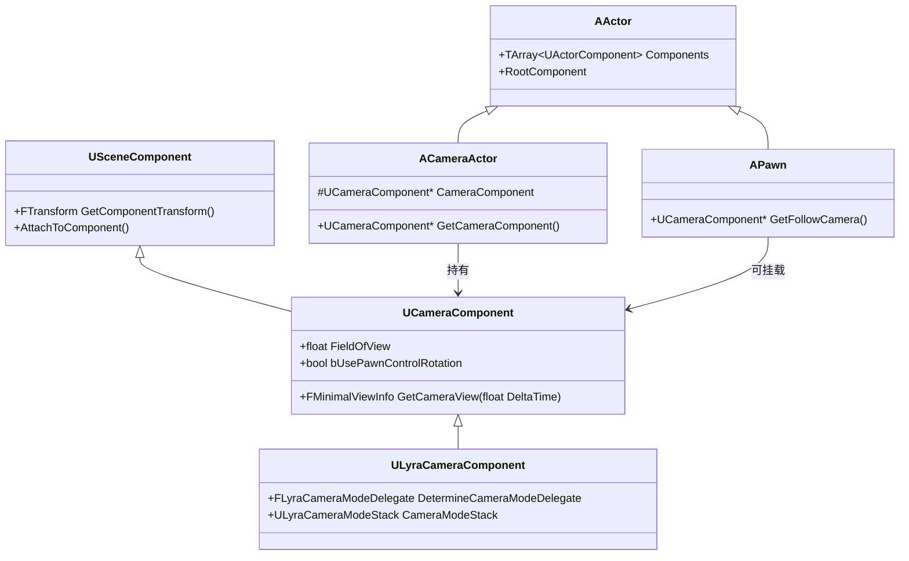

# ACameraActor与UCameraComponent基础

> 摄像机系统的起点：`UCameraComponent` 是如何从 `USceneComponent` 继承而来，又是如何产出每一帧的视图参数的。

## 概述

本课学习 `UCameraComponent` 和 `ACameraActor` 的基本工作机制。学完本课你将理解：
- `UCameraComponent` 在 UE 摄像机系统中的角色
- 摄像机视图参数（`FMinimalViewInfo`）由哪些字段组成
- `ACameraActor` 作为独立摄像机实体的使用场景
- 摄像机 Component 如何挂载到 Pawn 上，以及 `bUsePawnControlRotation` 的工作原理

---

## 核心概念

### 什么是 UCameraComponent？

`UCameraComponent` 是 UE 中**产出摄像机视图参数**的核心组件，继承自 `USceneComponent`。

```
USceneComponent          （提供 Transform / Attach / 坐标系变换）
  └── UCameraComponent  （在 USceneComponent 基础上增加：
                           - FieldOfView（视角范围）
                           - Projection 类型（Perspective / Ortho）
                           - PostProcess Override
                           - GetCameraView() 视图计算入口）
```

**直觉理解**：把 `UCameraComponent` 想象成一个「虚拟相机」——它有位置（Location）、朝向（Rotation）、视野角度（FOV），每帧它算出一组视图参数（`FMinimalViewInfo`），交给 `APlayerCameraManager` 去渲染。

### ACameraActor 是什么？

`ACameraActor` 是一个**独立的 Actor**，内部自带一个 `UCameraComponent`。

使用场景：
- **Cinematic Camera**：用 Sequencer 驱动摄像机运动
- **多摄像机切换**：场景中放置多个 CameraActor，通过 `SetViewTarget()` 切换
- **静态观察点**：如观战摄像机、监控摄像头



---

## 源码深度分析

### `UCameraComponent` 关键属性

文件：`Engine/Source/Runtime/Engine/Classes/Camera/CameraComponent.h`

```cpp
// [1] 水平视野角度（Perspective 模式下有效）
// 典型值：90.0（第三人称）、70.0（第一人称）
UPROPERTY(Interp, EditAnywhere, BlueprintReadWrite, Category = CameraSettings)
float FieldOfView;

// [2] 正交视图宽度（Orthographic 模式下有效，如 RTS 游戏俯视视角）
UPROPERTY(Interp, EditAnywhere, BlueprintReadWrite, Category = CameraSettings)
float OrthoWidth;

// [3] 是否让 Pawn 的 ControlRotation 直接驱动本 Component 的 Rotation
// ★ 第一人称游戏的关键开关
UPROPERTY(EditAnywhere, BlueprintReadWrite, Category = CameraSettings)
uint32 bUsePawnControlRotation : 1;

// [4] 是否用 Camera 的 Rotation 来驱动 Pawn 的 ControlRotation
// 与 bUsePawnControlRotation 方向相反，用于「相机转向驱动角色转向」的场景
UPROPERTY(EditAnywhere, BlueprintReadWrite, Category = CameraSettings)
uint32 bUseControlRotation : 1;

// [5] PostProcess 效果覆盖（可让某个摄像机单独配置景深/色差/曝光等）
UPROPERTY(EditAnywhere, BlueprintReadWrite, Category = CameraSettings)
FPostProcessSettings PostProcessSettings;
UPROPERTY(EditAnywhere, BlueprintReadWrite, Category = CameraSettings, meta = (ClampMin = "0.0", ClampMax = "1.0"))
float PostProcessBlendWeight;
```

**设计决策分析**：为什么 `FieldOfView` 是 `float` 而不是 `int`？
> UE 的 Camera 系统支持**帧间插值**（Interp 标记），FOV 可以在两帧之间平滑过渡，用 `float` 才能实现亚像素级的平滑变化。这也是为什么 `UPROPERTY(Interp)` 标记存在——它告诉引擎这个属性支持插值驱动（由 Sequencer 或 CameraModifier 驱动）。

### `GetCameraView()` —— 视图计算的核心入口

`UCameraComponent::GetCameraView()` 是**每帧被调用的核心函数**，产出 `FMinimalViewInfo`。

文件：`Engine/Source/Runtime/Engine/Private/Camera/CameraComponent.cpp`

```cpp
// [1] GetCameraView 是虚函数，子类（如 ULyraCameraComponent）可以重写
// [2] 默认实现只是把 Component 的 Transform + FOV 填入 FMinimalViewInfo
void UCameraComponent::GetCameraView(float DeltaTime, FMinimalViewInfo& DesiredView)
{
    // [2-1] 位置：取 Component 的世界坐标
    DesiredView.Location = GetComponentLocation();

    // [2-2] 旋转：如果 bUsePawnControlRotation，则用 Controller 的 ControlRotation
    //       否则用 Component 自身的 Rotation
    if (bUsePawnControlRotation)
    {
        AController* OwningController = GetOwningController();
        if (OwningController)
        {
            DesiredView.Rotation = OwningController->GetControlRotation();
        }
    }
    else
    {
        DesiredView.Rotation = GetComponentRotation();
    }

    // [2-3] FOV：直接取成员变量
    DesiredView.FOV = FieldOfView;

    // [2-4] 投影类型：Perspective 或 Orthographic
    DesiredView.ProjectionMode = bOrthographic ? ECameraProjectionMode::Orthographic : ECameraProjectionMode::Perspective;
    DesiredView.OrthoWidth = OrthoWidth;
}
```

**为什么 Lyra 要重写 `GetCameraView()`？**
> 因为 Lyra 引入了 `CameraModeStack`——多个 CameraMode 可以叠加混合（如：奔跑模式 + 受伤眩晕模式），需要在 `GetCameraView()` 中先让 Stack 评估出混合后的 `FLyraCameraModeView`，再填入 `DesiredView`。这是 Lyra 摄像机架构的核心扩展点。

### `FMinimalViewInfo` —— 视图参数的最小集合

```cpp
// 文件：Engine/Source/Runtime/Engine/Public/Camera/CameraTypes.h
struct FMinimalViewInfo
{
    FVector Location;           // 摄像机世界坐标位置
    FRotator Rotation;         // 摄像机世界旋转（Pitch/Yaw/Roll）
    float   FOV;               // 水平视野角度（度）
    ECameraProjectionMode ProjectionMode; // Perspective 或 Orthographic
    float   OrthoWidth;        // 正交模式下的视口宽度
    float   AspectRatio;       // 宽高比（通常由 Viewport 决定）
    FPostProcessSettings PostProcessSettings; // 后处理覆盖
};
```

---

## Lyra 实践

### Lyra 中的 CameraComponent 挂载方式

Lyra 的 Pawn 并不硬编码 CameraComponent，而是通过 **`ULyraPawnData`** 配置默认 CameraMode，运行时由 `ULyraCameraComponent` 动态决定使用哪个 CameraMode。

挂载位置：`ALyraCharacter` 的组件树中，`ULyraCameraComponent` 作为 `ALyraCharacter` 的一个 Component 存在（通过 Blueprint 配置）。

```
ALyraCharacter (C++ 基类)
  ├── CapsuleComponent       (碰撞)
  ├── ArrowComponent         (编辑器指示箭头)
  ├── Mesh                  (骨骼网格体)
  ├── ULyraCameraComponent  (★ 摄像机组件)
  └── UArrowComponent       (其他编辑器辅助)
```

### `ULyraCameraComponent` 扩展了什么？

对比引擎基类，`ULyraCameraComponent` 新增了：

| 新增成员 | 作用 |
|---------|------|
| `DetermineCameraModeDelegate` | 委托，用于动态选择当前最合适的 CameraMode（如：行走/瞄准/驾驶对应不同模式） |
| `CameraModeStack`（`ULyraCameraModeStack*`） | 持有当前激活的 CameraMode 栈，支持多模式按权重混合 |
| `FieldOfViewOffset` | 单帧有效的 FOV 偏移（用于临时效果，如开镜时的 FOV 变化） |
| `UpdateCameraModes()` | 每帧调用，更新 CameraMode 栈（Push/Pop/Blend） |

```cpp
// 文件：Source/LyraGame/Camera/LyraCameraComponent.h
// [1] DetermineCameraModeDelegate 是 Lyra 摄像机系统的「调度中枢」
//     它允许 Gameplay 代码（如 Ability）动态影响摄像机模式选择
DECLARE_DELEGATE_RetVal(TSubclassOf<ULyraCameraMode>, FLyraCameraModeDelegate);

// [2] CameraModeStack 是 ULyraCameraComponent 的核心成员
//     每次 GetCameraView() 被调用时，Stack 会被 Evaluate，
//     产出混合后的 FLyraCameraModeView
UPROPERTY()
TObjectPtr<ULyraCameraModeStack> CameraModeStack;
```

### Lyra 为什么不直接用 `APlayerCameraManager` 的 CameraModifier 系统？

| 方案 | 优点 | 缺点 |
|------|------|------|
| 引擎原生 `CameraModifier` 栈（`APlayerCameraManager::ModifierList`） | 简单，与引擎深度集成 | Modifier 是**全局叠加**，不支持「同一 Pawn 的不同状态下完全替换摄像机行为」 |
| Lyra 的 `CameraModeStack` | 每个 Mode 可以完全定义自己的 View 计算逻辑（位置/旋转/FOV），支持按权重 Blend | 需要自行实现，代码量更大 |

Lyra 的选择：**CameraMode 定义「摄像机的行为模式」，CameraModeStack 管理「多个模式的混合权重」**，这比 CameraModifier 的「全局后处理」范式更灵活。

---

## 常见问题与陷阱

### 1. `bUsePawnControlRotation` 不生效？

**原因**：`UCameraComponent` 只有在拥有 `AController` 时才能获取到 `ControlRotation`。如果 Pawn 尚未被 PlayerController Possess，或 Controller 为 `nullptr`，则回退到使用 Component 自身 Rotation。

**排查步骤**：
```cpp
// 在 Pawn 的 BeginPlay 或 OnPossess 后检查：
APlayerController* PC = Cast<APlayerController>(GetController());
check(PC); // 如果断言失败，说明还未被 Possess
```

### 2. CameraComponent 的位置和 Pawn Mesh 的头部位置不一致？

**原因**：`UCameraComponent` 的 `GetComponentLocation()` 返回的是**组件自身的坐标**（相对于 Attach 父节点），而不是骨架 Mesh 的头部 Socket 位置。

**解决**：将 CameraComponent Attach 到 Mesh 的头部 Socket，或在每帧用 `SkelMesh->GetSocketLocation(HeadSocketName)` 手动更新 CameraComponent 的位置。

### 3. 多个 CameraComponent 同时存在时，引擎用哪一个？

`APlayerCameraManager` 默认使用 **ViewTarget（通常是 Pawn）上找到的第一个 CameraComponent**。如果你有多个，需要：
- 通过 `SetViewTarget()` 切换 ViewTarget，或
- 在 Pawn 的 `FindCameraComponent()` 中自定义选择逻辑

---

## 总结与要点

| # | 要点 | 说明 |
|---|------|------|
| 1 | `UCameraComponent` 是视图参数的**生产者** | 不是「摄像机本身」，而是产出 `FMinimalViewInfo` 的组件 |
| 2 | `ACameraActor` 是独立的摄像机实体 | 用于 Cinematic、多机位切换场景 |
| 3 | `bUsePawnControlRotation` 连接 Controller 和 Camera | 第一人称游戏的关键属性，让鼠标移动直接驱动摄像机旋转 |
| 4 | `GetCameraView()` 是每帧视图计算入口 | 虚函数，Lyra 重写了它以接入 CameraModeStack |
| 5 | Lyra 用 CameraMode + Stack 替代 CameraModifier | 更灵活，支持不同状态下完全替换摄像机行为 |

---

## 相关页面

- [[30-tutorials/camera-system/00-UE摄像机-Camera系统从入门到实战]] ← 上一课：系列概览
- [[30-tutorials/camera-system/02-APlayerCameraManager详解]] → 下一课：APlayerCameraManager 详解
- [[30-tutorials/ue-framework/50-player-system/00-APawn与ACharacter详解]] — APawn 与 ACharacter 详解（前置知识）

<!-- nav:auto -->

---

**导航**: ← [[30-tutorials/camera-system/00-UE摄像机-Camera系统从入门到实战|00-UE摄像机-Camera系统从入门到实战]] · [[30-tutorials/camera-system/02-APlayerCameraManager详解|02-APlayerCameraManager详解]] →

<!-- /nav:auto -->
