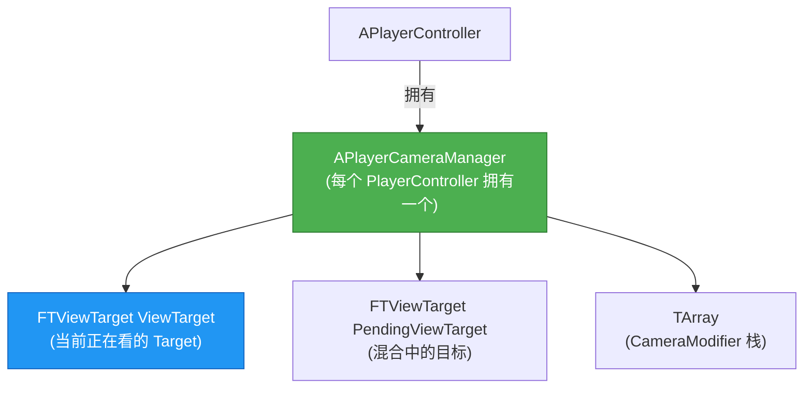
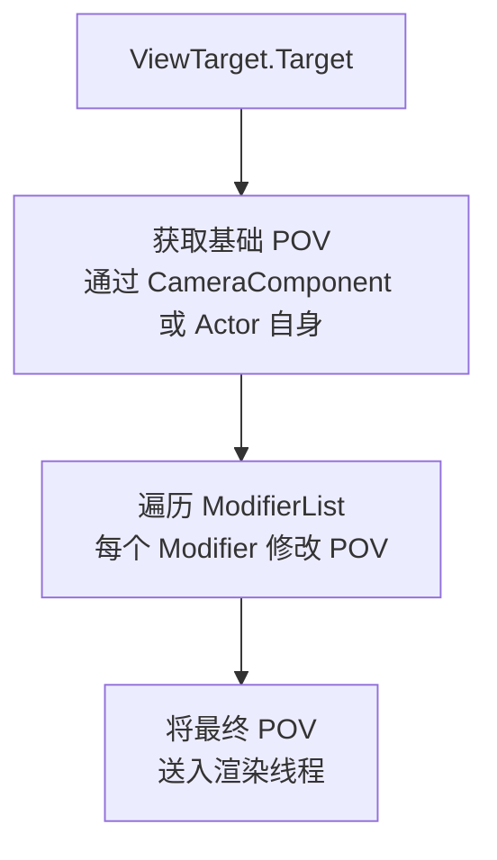

# APlayerCameraManager详解

> 引擎中负责「每帧决定玩家看到什么」的核心类，管理 ViewTarget、CameraModifier 栈和视图混合。

## 概述

本课深入 `APlayerCameraManager` 的工作机制。学完本课你将理解：
- `ViewTarget` 是什么，以及它如何决定玩家看到的画面
- `UpdateViewTarget()` 每帧的执行流程
- `CameraModifier` 栈的工作原理和自定义方法
- `SetViewTarget()` 的视图混合（Blend）机制
- Lyra 如何重写 `UpdateViewTarget()` 以接入 CameraMode 系统

---

## 核心概念

### APlayerCameraManager 的角色定位

`APlayerCameraManager` 是 `APlayerController` 持有的一个**特殊 Actor**，它不直接出现在场景中，而是负责：

1. **管理 ViewTarget**：决定当前玩家「看向谁」
2. **每帧更新视图**：调用 `UpdateViewTarget()` 产出最终的 `FMinimalViewInfo`
3. **应用 CameraModifier**：在视图计算完成后，允许 Modifier 后处理视图参数
4. **处理 ViewTarget 切换时的混合（Blend）**：平滑过渡 between two ViewTargets



### ViewTarget 是什么？

`FTViewTarget` 是一个**结构体**，记录了「当前摄像机在看谁」。

```cpp
// 文件：Engine/Source/Runtime/Engine/Classes/Camera/PlayerCameraManager.h
struct FTViewTarget
{
    // [1] 被观察的 Actor（通常是 Pawn，也可以是 CameraActor）
    TObjectPtr<AActor> Target;

    // [2] 计算出的视图参数（由 Target 身上的 CameraComponent 或 Target 本身产出）
    FMinimalViewInfo POV;

    // [3] 关联的 PlayerState（观战时用于持续跟踪同一玩家）
    TObjectPtr<APlayerState> PlayerState;
};
```

**直觉理解**：`ViewTarget = 摄像机要拍谁`。`POV` 字段就是这个 Actor 「自己认为的摄像机参数」——如果 Target 是 `ACameraActor`，直接用 `CameraComponent` 的参数；如果 Target 是 `APawn`，则找它身上的 `UCameraComponent` 来产出 `POV`。

### CameraModifier 是什么？

`UCameraModifier` 是一个**后处理步骤**，在 `UpdateViewTarget()` 产出基础 `POV` 之后，允许对 `POV` 进行额外修改（如镜头震动、边缘扭曲等）。



---

## 源码深度分析

### `UpdateViewTarget()` —— 每帧视图更新的核心

文件：`Engine/Source/Runtime/Engine/Private/Camera/PlayerCameraManager.cpp`

```cpp
// [1] UpdateViewTarget 是 APlayerCameraManager 每帧调用的核心函数
//     它决定最终的 POV（Position/Orientation/FOV）并送入渲染管线
void APlayerCameraManager::UpdateViewTarget(FTViewTarget& OutVT, float DeltaTime)
{
    // [1-1] 如果正在 Blend（切换 ViewTarget 过程中）
    if (PendingViewTarget.Target != nullptr)
    {
        // 计算 Blend 进度（基于 BlendTime 和 BlendFunction）
        float BlendPct = (CurrentTime - BlendStartTime) / BlendTime;

        // 在 OldViewTarget 和 PendingViewTarget 之间插值
        FMinimalViewInfo NewPOV = BlendViewTargets(
            ViewTarget.POV,
            PendingViewTarget.POV,
            BlendPct,
            BlendFunc   // VTBlend_Linear / VTBlend_Cubic / VTBlend_EaseIn 等
        );

        OutVT.POV = NewPOV;

        // Blend 完成后，切换到 PendingViewTarget
        if (BlendPct >= 1.0f)
        {
            ViewTarget = PendingViewTarget;
            PendingViewTarget.Target = nullptr;
        }
        return;
    }

    // [1-2] 没有 Blend，直接获取 ViewTarget 的 POV
    AActor* TargetActor = OutVT.Target;
    if (TargetActor)
    {
        // 如果 Target 是 CameraActor，直接用它的 CameraComponent
        // 如果 Target 是 Pawn，找它身上的 CameraComponent
        // 逻辑在 APlayerCameraManager::GetCameraViewPoint() 中
        FMinimalViewInfo DesiredView;
        TargetActor->CalcCameraView(DeltaTime, DesiredView);
        OutVT.POV = DesiredView;
    }

    // [1-3] ★ 关键：应用 CameraModifier 栈
    //     这是 CameraShake 等效果生效的地方
    ApplyCameraModifiers(DeltaTime);
}
```

**设计决策分析**：为什么 `ApplyCameraModifiers()` 放在 `UpdateViewTarget()` 里，而不是 `UCameraComponent::GetCameraView()` 里？
> 因为 CameraModifier 是**全局的**（作用于整个 Player 的视图），而 `UCameraComponent` 是**局部的**（只负责一个 Component 的视图计算）。将 Modifier 放在 Manager 层，可以确保所有视图修改都经过统一的后处理链路。

### `SetViewTarget()` 与视图混合

```cpp
// [2] SetViewTarget 用于切换玩家看到的 Actor
//     支持平滑混合（Blend）
void APlayerCameraManager::SetViewTarget(
    AActor* NewTarget,
    const FViewTargetTransitionParams& TransitionParams = FViewTargetTransitionParams())
{
    // [2-1] 如果 TransitionParams.BlendTime > 0，则启动混合流程
    if (TransitionParams.BlendTime > 0.0f)
    {
        // 将当前 ViewTarget 保存为「混合源」
        // 设置 PendingViewTarget 为混合目标
        PendingViewTarget.Target = NewTarget;
        PendingViewTarget.POV = ...; // 获取 NewTarget 的 POV
        BlendStartTime = GetWorld()->GetTimeSeconds();
        BlendTime = TransitionParams.BlendTime;
        BlendFunc = TransitionParams.BlendFunction;
    }
    else
    {
        // 立即切换，无混合
        ViewTarget.Target = NewTarget;
    }
}
```

**混合函数类型**（`EViewTargetBlendFunction`）：

| 枚举值 | 效果 |
|--------|------|
| `VTBlend_Linear` | 线性插值，最简单 |
| `VTBlend_Cubic` | 轻微缓入缓出（固定曲线） |
| `VTBlend_EaseIn` | 快速启动，慢速收尾（由 `BlendExp` 控制） |
| `VTBlend_EaseOut` | 慢速启动，快速收尾 |
| `VTBlend_EaseInOut` | 缓入缓出 |
| `VTBlend_PreBlended` | 游戏摄像机系统已预先混合，引擎不再混合（UE5.6+ Gameplay Cameras 插件使用） |

### `ApplyCameraModifiers()` —— CameraModifier 栈的执行

```cpp
// [3] 遍历 ModifierList，每个 Modifier 有机会修改 POV
void APlayerCameraManager::ApplyCameraModifiers(float DeltaTime)
{
    for (UCameraModifier* Modifier : ModifierList)
    {
        if (Modifier && Modifier->bEnabled)
        {
            // 每个 Modifier 的 ProcessViewRotation() 可以修改 Rotation
            // 每个 Modifier 的 ModifyCamera() 可以修改完整的 POV
            Modifier->ModifyCamera(DeltaTime, ViewTarget.POV);
        }
    }
}
```

---

## Lyra 实践

### Lyra 为什么重写 `UpdateViewTarget()`？

文件：`Source/LyraGame/Camera/LyraPlayerCameraManager.h/cpp`

Lyra 的 `ALyraPlayerCameraManager` 重写了 `UpdateViewTarget()`，原因是：

> Lyra 使用 `ULyraCameraComponent` 的 **CameraModeStack** 来产出视图，而不是让 `APlayerCameraManager` 直接调用 `TargetActor->CalcCameraView()`。

```cpp
// 文件：Source/LyraGame/Camera/LyraPlayerCameraManager.cpp
void ALyraPlayerCameraManager::UpdateViewTarget(FTViewTarget& OutVT, float DeltaTime)
{
    // [Lyra-1] 如果 ViewTarget 是 Pawn，且 Pawn 有 ULyraCameraComponent
    //     则让 LyraCameraComponent 计算视图（通过 CameraModeStack）
    if (ALyraCharacter* LyraChar = Cast<ALyraCharacter>(OutVT.Target))
    {
        if (ULyraCameraComponent* LyraCam = LyraChar->FindCameraComponent())
        {
            // 让 LyraCameraComponent 计算最终视图
            // 这会触发 CameraModeStack::EvaluateStack()
            FMinimalViewInfo LyraView;
            LyraCam->GetCameraView(DeltaTime, LyraView);
            OutVT.POV = LyraView;
            return;
        }
    }

    // [Lyra-2] 回退到默认行为（如观察 CameraActor 时）
    Super::UpdateViewTarget(OutVT, DeltaTime);
}
```

**为什么这是更好的架构？**

| 方案 | 优点 | 缺点 |
|------|------|------|
| 引擎默认（Manager 直接调 `CalcCameraView()`） | 简单直接 | View 计算逻辑分散在 Actor/Component 中，难以统一管理 |
| Lyra（Manager 委托给 `LyraCameraComponent`） | Camera 逻辑集中在 Component 中，支持 CameraMode 栈和混合 | 需要重写 `UpdateViewTarget()` |

### `ULyraUICameraManagerComponent` —— UI 相机的分离

Lyra 还引入了一个独立的 `ULyraUICameraManagerComponent`（挂在 `ALyraPlayerCameraManager` 上），用于：

- 在显示 UI 时切换到独立的「UI 摄像机」（避免 World 摄像机被 UI 动画干扰）
- 管理 UI 层的 PostProcess 效果

这是 Lyra 架构中「**World 相机**」和「**UI 相机**」分离的设计，值得在自己项目中借鉴。

---

## 常见问题与陷阱

### 1. `SetViewTarget()` 后画面没有平滑过渡？

**原因**：`TransitionParams.BlendTime` 为 0（默认值），表示立即切换。

**解决**：
```cpp
FViewTargetTransitionParams Transition;
Transition.BlendTime = 1.0f;          // 1 秒过渡
Transition.BlendFunction = VTBlend_EaseInOut;
Transition.BlendExp = 2.0f;
PlayerCameraManager->SetViewTarget(NewTarget, Transition);
```

### 2. CameraShake 不生效？

**原因**：CameraShake 需要通过 `APlayerCameraManager::StartCameraShake()` 启动，它会创建一个 `UCameraModifier_CameraShake` 加入 `ModifierList`。

**排查**：
```cpp
// 确认 PlayerCameraManager 存在
APlayerCameraManager* CamMgr = GetController<APlayerController>()->PlayerCameraManager;
check(CamMgr);

// 启动 CameraShake
CamMgr->StartCameraShake(USomeCameraShake::StaticClass());
```

### 3. `UpdateViewTarget()` 每帧被调用两次？

**原因**：`APlayerCameraManager` 的 Tick 顺序在 `APlayerController` 之后，但 `CalcCameraView()` 也可能被 Rendering Thread 触发。确保逻辑幂等（多次调用结果一致）。

---

## 总结与要点

| # | 要点 | 说明 |
|---|------|------|
| 1 | `APlayerCameraManager` 是视图管家的角色 | 不直接渲染，而是每帧产出 `FMinimalViewInfo` 交给渲染管线 |
| 2 | `ViewTarget` 决定「看谁」 | `POV` 字段由 Target Actor 身上的 CameraComponent 产出 |
| 3 | `CameraModifier` 栈是后处理链路 | CameraShake 等效果通过 Modifier 修改最终 POV |
| 4 | `SetViewTarget()` 支持平滑混合 | 通过 `FViewTargetTransitionParams` 配置混合时间和曲线 |
| 5 | Lyra 重写 `UpdateViewTarget()` | 将视图计算委托给 `ULyraCameraComponent::GetCameraView()`，实现 CameraMode 栈架构 |

---

## 相关页面

- [[30-tutorials/camera-system/01-ACameraActor与UCameraComponent基础]] ← 上一课：ACameraActor 与 UCameraComponent 基础
- [[30-tutorials/camera-system/03-USpringArmComponent深度解析]] → 下一课：USpringArmComponent 深度解析

<!-- nav:auto -->

---

**导航**: ← [[30-tutorials/camera-system/01-ACameraActor与UCameraComponent基础|01-ACameraActor与UCameraComponent基础]] · [[30-tutorials/camera-system/03-USpringArmComponent深度解析|03-USpringArmComponent深度解析]] →

<!-- /nav:auto -->
