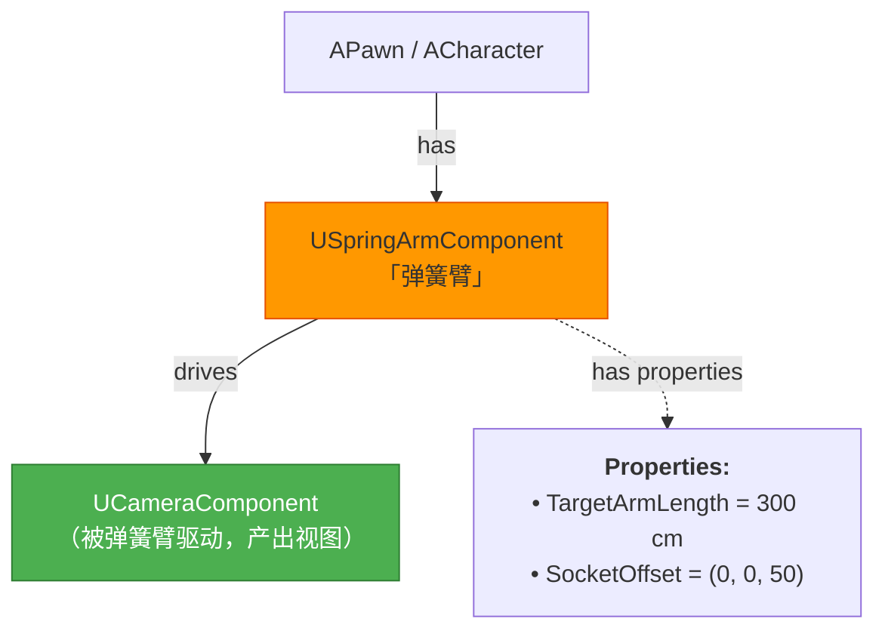
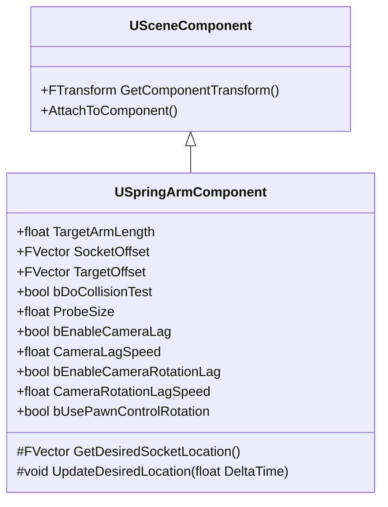

# USpringArmComponent深度解析

> 弹簧臂组件：为第三人称摄像机提供自然的「弹性跟随」和「碰撞穿透避免」能力。

## 概述

本课深入 `USpringArmComponent` 的工作机制。学完本课你将理解：
- `USpringArmComponent` 的「自拍杆」设计理念
- Lag（滞后）系统的插值原理
- 碰撞穿透避免（Collision Avoidance）的实现方式
- `SocketOffset` / `TargetOffset` 的区别与使用场景
- 为什么 Lyra **没有**使用 `USpringArmComponent`（而是自行实现穿透避免）

---

## 核心概念

### 什么是 USpringArmComponent？

`USpringArmComponent` 是一个**间接驱动子组件位置**的 `USceneComponent`。它本身不渲染任何东西，而是每帧计算一个「理想位置」，然后将**子组件**（通常是 `UCameraComponent`）移动到该位置。



**直觉理解**：把 `USpringArmComponent` 想象成一根**有弹性的自拍杆**——
- 一端固定在角色身上（`AttachParent`）
- 另一端挂着 Camera（`ChildComponent`）
- 角色移动时，Camera 不会立即跟随，而是有**滞后（Lag）**
- 如果中间有墙，弹簧会**缩短（Collision Avoidance）**，防止 Camera 穿墙

### 核心属性总览



| 属性 | 类型 | 作用 |
|------|------|------|
| `TargetArmLength` | `float` | 弹簧臂的自然长度（cm），碰撞时会缩短 |
| `SocketOffset` | `FVector` | 臂**末端**（Camera 位置）的局部偏移 |
| `TargetOffset` | `FVector` | 臂**起始端**（角色端）的世界坐标偏移 |
| `bDoCollisionTest` | `bool` | 是否做碰撞检测（防止穿墙） |
| `ProbeSize` | `float` | 碰撞检测球的半径 |
| `ProbeChannel` | `ECollisionChannel` | 碰撞检测使用的通道（默认 `ECC_Camera`） |
| `bEnableCameraLag` | `bool` | 是否启用位置滞后（平滑跟随） |
| `CameraLagSpeed` | `float` | 位置滞后的速度（越大越紧跟） |
| `bEnableCameraRotationLag` | `bool` | 是否启用旋转滞后 |
| `CameraRotationLagSpeed` | `float` | 旋转滞后的速度 |

---

## 源码深度分析

### `UpdateDesiredLocation()` —— 每帧位置计算的核心

文件：`Engine/Source/Runtime/Engine/Private/GameFramework/SpringArmComponent.cpp`

```cpp
// [1] UpdateDesiredLocation 是每帧调用的核心函数
//     它计算「理想位置」，然后应用 Lag 插值，最后设置子组件位置
void USpringArmComponent::UpdateDesiredLocation(float DeltaTime)
{
    // [1-1] 计算「理想位置」——臂的末端应该在哪
    FVector DesiredLoc = GetDesiredSocketLocation();

    // [1-2] ★ 碰撞检测：如果中间有墙，缩短臂长
    if (bDoCollisionTest)
    {
        FHitResult HitResult;
        FVector TraceStart = /* 臂起始位置 */;
        FVector TraceEnd = DesiredLoc;

        // 用球形 Trace 检测碰撞
        // ProbeSize 是球半径，ProbeChannel 是碰撞通道
        GetWorld()->LineTraceSingleByChannel(
            HitResult, TraceStart, TraceEnd, ProbeChannel);

        if (HitResult.bBlockingHit)
        {
            // 碰撞了！把 Camera 拉到碰撞点附近
            DesiredLoc = HitResult.Location + HitResult.Normal * ProbeSize;
        }
    }

    // [1-3] ★ Lag 插值：让 Camera 位置不是立即跟上，而是「滞后」
    if (bEnableCameraLag && DeltaTime > 0.0f)
    {
        // 指数衰减插值：Velocity * (1 - e^(-Speed * DeltaTime))
        // 这比线性插值更自然（起步快、接近时慢）
        FVector CurrentLoc = GetComponentLocation();
        FVector NewLoc = FMath::VInterpTo(
            CurrentLoc, DesiredLoc, DeltaTime, CameraLagSpeed);
        DesiredLoc = NewLoc;
    }

    // [1-4] 设置子组件（CameraComponent）的最终位置
    if (UCameraComponent* ChildCam = GetChildCameraComponent())
    {
        ChildCam->SetWorldLocation(DesiredLoc);
    }
}
```

**设计决策分析**：为什么 Lag 用 `VInterpTo()`（指数衰减）而不是线性插值？
> 线性插值（Lerp）的问题是「速度恒定」，看起来像「滑动」而不是「跟随」。指数衰减模拟了**弹簧物理**——离目标远时速度快，接近时速度慢，看起来更自然。这也是为什么 `CameraLagSpeed` 的含义是「速度」而不是「时间」。

### `GetDesiredSocketLocation()` —— 理想位置的计算

```cpp
// [2] 计算「没有碰撞、没有 Lag」时 Camera 应该在的位置
FVector USpringArmComponent::GetDesiredSocketLocation() const
{
    // [2-1] 起始点 = 组件位置 + TargetOffset（世界坐标偏移）
    FVector BaseLoc = GetComponentLocation() + TargetOffset;

    // [2-2] 方向 = 组件旋转（受 bUsePawnControlRotation 等影响）
    FRotator DesiredRot = GetTargetRotation();

    // [2-3] 理想位置 = 起始点 + 方向 * TargetArmLength + SocketOffset
    FVector DesiredLoc = BaseLoc + DesiredRot.Vector() * TargetArmLength;
    DesiredLoc += DesiredRot.RotateVector(SocketOffset);

    return DesiredLoc;
}
```

**`SocketOffset` vs `TargetOffset` 的区别**：

```
TargetOffset（起始端偏移，世界坐标）
    ↓
    [弹簧臂，长度 = TargetArmLength]
    ↓
SocketOffset（末端偏移，局部坐标，相对于臂方向）
    ↓
    [CameraComponent]
```

---

## Lyra 实践

### 为什么 Lyra 没有使用 `USpringArmComponent`？

查看 Lyra 的 `Source/LyraGame/Camera/` 目录，你会发现 **Lyra 完全没有使用 `USpringArmComponent`**。

**原因**：`USpringArmComponent` 的穿透避免是「**缩短臂长**」策略——碰撞时 Camera 直接被拉到角色旁边，会导致「穿墙时 Camera 钻进角色体内」的问题。

Lyra 采用的方案：`ULyraCameraMode_ThirdPerson` **自行实现穿透避免**，使用**多条射线（PenetrationAvoidanceFeelers）** 检测障碍物，并平滑地将 Camera 推离障碍物，而不是简单地缩短臂长。

```
USpringArmComponent 方案：
  角色 ———————[Camera]  （正常）
  角色 —[Camera]          （穿墙时：臂长缩短，Camera 被拉近）

Lyra 方案（更精细）：
  角色 ———————[Camera]  （正常）
  角色 —————[Camera]      （穿墙时：Camera 被横向推开 + 部分缩短，保持可见性）
```

### `ULyraCameraMode_ThirdPerson` 的穿透避免算法

```cpp
// 文件：Source/LyraGame/Camera/LyraCameraMode_ThirdPerson.h
UPROPERTY(EditDefaultsOnly, Category = "Collision")
TArray<FLyraPenetrationAvoidanceFeeler> PenetrationAvoidanceFeelers;

// [3] 多条射线检测
// Index 0  ：主射线（正前方）
// Index 1+ ：预测射线（bDoPredictiveAvoidance，提前检测可能的障碍物）
void ULyraCameraMode_ThirdPerson::PreventCameraPenetration(
    const AActor& ViewTarget,
    const FVector& SafeLoc,   // 无碰撞时的理想位置
    FVector& CameraLoc,       // [in/out] Camera 当前位置（会被修改）
    float const& DeltaTime,
    float& DistBlockedPct,
    bool bSingleRayOnly)
{
    // 对每条 Feeler 射线做 Line Trace
    // 如果命中，计算「需要缩进多少」
    // 用指数衰减平滑过渡（PenetrationBlendInTime / PenetrationBlendOutTime）
}
```

**设计决策分析**：为什么 Lyra 用多条射线而不是 `USpringArmComponent` 的单球 Trace？
> 单球 Trace 只能检测「最近的一个障碍物」，容易在墙角出现抖动。多条射线可以：
> 1. **主射线**：检测正前方的障碍物
> 2. **预测射线**：检测「如果玩家转向，可能会碰到的障碍物」，提前推开 Camera（防止突然穿墙）
> 3. **权重混合**：多条射线的结果取「最需要缩进」的那个，更稳定。

---

## 常见问题与陷阱

### 1. Camera 穿过地板（ Floor Penetration）？

**原因**：`USpringArmComponent` 的碰撞检测只检测 `ProbeChannel`（默认 `ECC_Camera`），而地板可能不在这个通道上。

**解决**：在 Project Settings → Collision → Preset 中，确保 World Static / World Dynamic 响应 `ECC_Camera` 为 `Block`。

### 2. Lag 插值在某些情况下「卡住」？

**原因**：`VInterpTo()` 在帧率波动时可能不够平滑。UE 5.3+ 引入了 `bUseCameraLagSubstepping`，将 Lag 计算分成多个子步骤。

**解决**：
```cpp
SpringArm->bUseCameraLagSubstepping = true;
SpringArm->CameraLagMaxTimeStep = 1.0f / 60.0f; // 以 60fps 为基准分步
```

### 3. SocketOffset 和 CameraComponent 自身的 RelativeLocation 有什么区别？

**SocketOffset**：由 `USpringArmComponent` **统一管理的末端偏移**，保证 Offset 始终沿着臂的方向。

**CameraComponent.RelativeLocation**：是组件自身的局部偏移，**不受臂方向影响**。

**建议**：用 `SocketOffset` 来配置「Camera 相对于角色的位置」，不要用 `RelativeLocation`——否则当臂旋转时，Offset 方向不会跟着转。

---

## 总结与要点

| # | 要点 | 说明 |
|---|------|------|
| 1 | `USpringArmComponent` 是「间接驱动」 | 它不直接渲染，而是每帧计算子 CameraComponent 的理想位置 |
| 2 | Lag 用指数衰减而非线性插值 | 模拟弹簧物理，看起来更自然 |
| 3 | 碰撞检测用球形 Line Trace | `ProbeSize` 控制球半径，`ProbeChannel` 控制碰撞通道 |
| 4 | Lyra 未使用 `USpringArmComponent` | 自行实现 `PenetrationAvoidanceFeelers`，多条射线检测更稳定 |
| 5 | `SocketOffset` 沿臂方向偏移 | 与 `TargetOffset` 配合，保证 Camera 始终沿臂方向，不受臂旋转影响 |
|---|---|---|

## 常见问题与陷阱

<!-- nav:auto -->

---

**导航**: ← [[30-tutorials/camera-system/02-APlayerCameraManager详解|02-APlayerCameraManager详解]] · [[30-tutorials/camera-system/04-摄像机视图计算与投影|04-摄像机视图计算与投影]] →

<!-- /nav:auto -->
