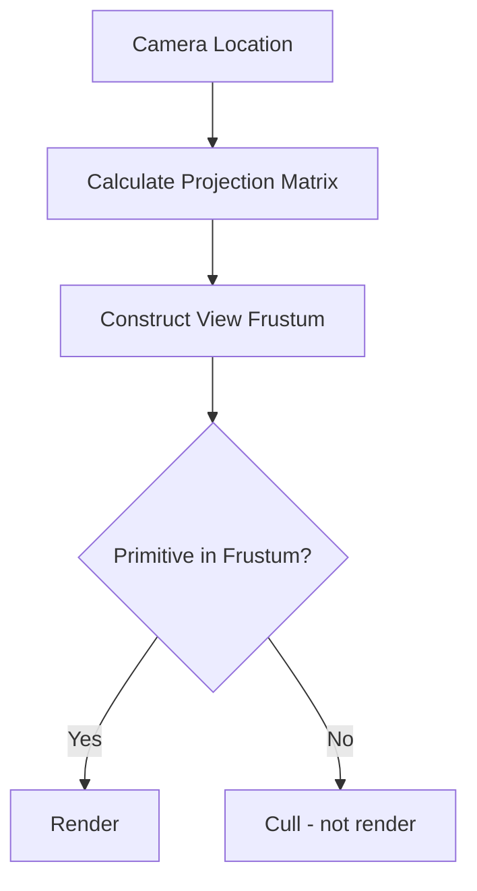

# 摄像机视图计算与投影

> 深入理解 UE 每帧是如何把「Camera 的世界坐标 + 旋转 + FOV」变成最终渲染画面的。

## 概述

本课深入摄像机视图计算的完整流程。学完本课你将理解：
- `FMinimalViewInfo` 的每个字段的含义
- Perspective 和 OrthoGraphic 两种投影模式的数学原理
- `UCameraComponent::GetCameraView()` 的默认实现逻辑
- 视锥体（View Frustum）的裁减原理
- Lyra 如何通过 `CameraModeStack` 改写视图计算流程

---

## 核心概念

### `FMinimalViewInfo` —— 视图的最小描述

`FMinimalViewInfo` 是 UE 中**描述一个摄像机视图所需的最小字段集合**，它是 `UCameraComponent::GetCameraView()` 的输出，也是 `APlayerCameraManager` 送入渲染管线的输入。

```cpp
// 文件：Engine/Source/Runtime/Engine/Public/Camera/CameraTypes.h
struct FMinimalViewInfo
{
    FVector             Location;           // 摄像机世界坐标位置
    FRotator           Rotation;           // 摄像机世界旋转（Pitch/Yaw/Roll）
    float               FOV;                // 水平视野角度（度，Perspective 模式下有效）
    ECameraProjectionMode ProjectionMode;   // Perspective 或 OrthoGraphic
    float               OrthoWidth;         // 正交模式下的视口宽度（cm）
    float               AspectRatio;        // 宽高比（通常由 Viewport 决定）
    FPostProcessSettings PostProcessSettings; // 后处理覆盖
    float               PostProcessBlendWeight; // 后处理混合权重
};
```

**直觉理解**：把 `FMinimalViewInfo` 想象成**拍照参数**——
- `Location` = 站在哪
- `Rotation` = 朝哪看
- `FOV` = 镜头广角（数值大 = 广角，数值小 = 长焦）
- `ProjectionMode` = 用「透视投影」（近大远小）还是「正交投影」（等比例，用于 RTS 俯视）

### 投影模式详解

#### Perspective（透视投影）

```
         /|   Camera（Location）
        / |   ↖  FOV（水平视野角）
       /  |
      /   |
     /    |
    /     |
   /______|
  Near   Far
  Clip    Clip
  Plane   Plane
```

数学本质：用**视锥体（Frustum）** 描述可见空间，近大远小。

```cpp
// 引擎根据 FOV + AspectRatio + Near/Far Clip Plane 构造投影矩阵
// 在 ProjectSettings → Engine → Rendering → Camera 中可配置默认 Near/Far
```

#### OrthoGraphic（正交投影）

```
─────────  ↑
|         |  | OrthoWidth（视口宽度，世界单位）
|  Camera |  |
|  (方向) |  ↓
─────────
```

数学本质：用**立方体（Box）** 描述可见空间，物体大小不随距离变化。

**使用场景**：RTS 游戏俯视视角、2D 横版游戏、CAD 建模工具。

---

## 源码深度分析

### `UCameraComponent::GetCameraView()` 默认实现

文件：`Engine/Source/Runtime/Engine/Private/Camera/CameraComponent.cpp`

```cpp
// [1] GetCameraView 是虚函数，每帧被 APlayerCameraManager 调用
//     输出 DesiredView（FMinimalViewInfo）
void UCameraComponent::GetCameraView(float DeltaTime, FMinimalViewInfo& DesiredView)
{
    // [1-1] 位置：取组件的 World Location
    DesiredView.Location = GetComponentLocation();

    // [1-2] 旋转：根据 bUsePawnControlRotation 决定来源
    if (bUsePawnControlRotation)
    {
        // 用 Controller 的 ControlRotation（鼠标/手柄输入驱动）
        AController* OwningController = GetOwningController();
        if (OwningController)
        {
            DesiredView.Rotation = OwningController->GetControlRotation();
        }
    }
    else
    {
        // 用组件自身的 Rotation（Blueprint 或 Attach 决定）
        DesiredView.Rotation = GetComponentRotation();
    }

    // [1-3] FOV：直接取成员变量（支持 Interp 插值）
    DesiredView.FOV = FieldOfView;

    // [1-4] 投影模式
    DesiredView.ProjectionMode = bOrthographic ? ECameraProjectionMode::Orthographic
                                               : ECameraProjectionMode::Perspective;
    DesiredView.OrthoWidth = OrthoWidth;

    // [1-5] 后处理设置（覆盖）
    DesiredView.PostProcessSettings = PostProcessSettings;
}
```

**设计决策分析**：为什么 `FOV` 是 `float` 且支持 `Interp`？
> 因为 Camera 的 FOV 变化（如开镜时的 Zoom）需要**平滑过渡**，而不是突变。`UPROPERTY(Interp)` 标记让 Sequencer 和 CameraModifier 可以对 FOV 做帧间插值。

### 投影矩阵的计算入口

文件：`Engine/Source/Runtime/Engine/Private/Camera/CameraComponent.cpp`

```cpp
// [2] 引擎在渲染线程根据 FMinimalViewInfo 构造投影矩阵
//     这个函数通常在 SceneView.cpp 中被调用
FMatrix FMinimalViewInfo::CalculateProjectionMatrix() const
{
    if (ProjectionMode == ECameraProjectionMode::Perspective)
    {
        // Perspective 投影矩阵
        // 公式：根据 FOV、AspectRatio、NearClipPlane、FarClipPlane 构造
        return FPerspectiveMatrix(
            FMath::DegreesToRadians(FOV),
            AspectRatio,
            1.0f,       // 近平面高度缩放（通常为 1）
            NearClipPlane,
            FarClipPlane
        );
    }
    else
    {
        // OrthoGraphic 投影矩阵
        // 公式：根据 OrthoWidth、AspectRatio、Near/Far 构造
        float OrthoHeight = OrthoWidth / AspectRatio;
        return FOrthoMatrix(
            -OrthoWidth * 0.5f,   // Left
             OrthoWidth * 0.5f,    // Right
            -OrthoHeight * 0.5f,  // Bottom
             OrthoHeight * 0.5f,   // Top
             NearClipPlane,
             FarClipPlane
        );
    }
}
```

### 视锥体裁减（View Frustum Culling）



**原理**：GPU 在 Vertex Shader 之后、Rasterization 之前，会判断每个三角形的顶点是否在视锥体内。完全在外面的，直接丢弃（Culling）。

**UE 的优化**：除了 GPU 端的视锥体裁减，UE 还有**预裁减（Pre-Culling）**——
- `ULevel->GetWorld()->GetFirstPlayerController()->GetHitResultAtScreenPosition()` 等函数会使用视锥体信息
- `SceneViewFrustumCull()` 在渲染线程做批量裁减

---

## Lyra 实践

### `ULyraCameraComponent::GetCameraView()` 重写

文件：`Source/LyraGame/Camera/LyraCameraComponent.cpp`

```cpp
// [3] Lyra 重写了 GetCameraView()，核心差异：
//     在取用 Component 自身 Transform 之前，先让 CameraModeStack 评估
void ULyraCameraComponent::GetCameraView(float DeltaTime, FMinimalViewInfo& DesiredView)
{
    // [3-1] ★ 核心：更新 CameraMode 栈
    //     Push/Pop CameraMode，计算各 Mode 的混合权重
    UpdateCameraModes();

    // [3-2] 让 Stack 评估出混合后的视图
    FLyraCameraModeView BlendedView;
    if (CameraModeStack->EvaluateStack(DeltaTime, BlendedView))
    {
        // Stack 有激活的 CameraMode：用混合后的结果
        DesiredView.Location = BlendedView.Location;
        DesiredView.Rotation = BlendedView.Rotation;
        DesiredView.FOV      = BlendedView.FieldOfView;
    }
    else
    {
        // Stack 为空：回退到默认行为（和引擎基类一样）
        Super::GetCameraView(DeltaTime, DesiredView);
    }

    // [3-3] 应用单帧 FOV 偏移（如开镜时的临时 FOV 变化）
    DesiredView.FOV += FieldOfViewOffset;
    FieldOfViewOffset = 0.0f; // 用完即清
}
```

**为什么要把 CameraModeStack 放在 `GetCameraView()` 里更新？**
> 因为 `GetCameraView()` 每帧**必定被调用**，是更新 Stack 最可靠的时机。如果把更新放在 Tick 里，可能因为 Tick 顺序问题导致一帧的延迟。

### `ULyraCameraModeStack::EvaluateStack()` —— 混合算法

```cpp
// [4] EvaluateStack 遍历当前激活的 CameraMode 列表
//     按 BlendWeight 混合它们的 View
bool ULyraCameraModeStack::EvaluateStack(float DeltaTime, FLyraCameraModeView& OutView)
{
    // [4-1] 如果没有激活的 CameraMode，返回 false
    if (CameraModeStack.Num() == 0) return false;

    // [4-2] 从栈顶（最后 Push 的）开始，按权重混合
    FLyraCameraModeView CombinedView = ZeroInitializedView;
    float TotalWeight = 0.0f;

    for (ULyraCameraMode* Mode : CameraModeStack)
    {
        if (Mode->GetBlendWeight() <= 0.0f) continue;

        FLyraCameraModeView ModeView;
        Mode->UpdateCameraMode(DeltaTime);  // 让 Mode 计算自己的 View
        ModeView = Mode->GetCameraModeView();

        // 按权重线性混合（Location / Rotation / FOV）
        CombinedView.Location = CombinedView.Location * (1 - Mode->GetBlendWeight())
                                   + ModeView.Location * Mode->GetBlendWeight();
        // ... 同理处理 Rotation 和 FOV

        TotalWeight += Mode->GetBlendWeight();
    }

    OutView = CombinedView;
    return true;
}
```

---

## 常见问题与陷阱

### 1. FOV 变化时有明显的「跳变」？

**原因**：直接设置 `FieldOfView = NewFOV`，没有用插值。

**解决**：用 `SetFieldOfView()` 配合 `UPROPERTY(Interp)` 的插值系统，或用 Timeline / Curve 驱动。

### 2. 正交模式下 `OrthoWidth` 和 `AspectRatio` 的关系？

**公式**：`OrthoHeight = OrthoWidth / AspectRatio`

如果想让视野覆盖固定的世界单位范围，需要同时设置 `OrthoWidth` 和确保 `AspectRatio` 正确（通常由 Viewport 大小决定）。

### 3. Near Clip Plane 太小导致「闪烁（Z-Fighting）」？

**原因**：Near Clip Plane 越小，深度缓冲的精度分布越差，远处的物体会出现 Z-Fighting。

**建议值**：Perspective 模式下，`NearClipPlane` 不小于 `10.0`（cm）。在 Project Settings → Engine → Rendering → Camera 中配置。

---

## 总结与要点

| # | 要点 | 说明 |
|---|------|------|
| 1 | `FMinimalViewInfo` 是视图的最小描述 | Location + Rotation + FOV + ProjectionMode |
| 2 | Perspective = 近大远小，OrthoGraphic = 等比例 | 根据游戏类型选择 |
| 3 | `GetCameraView()` 是每帧视图计算的入口 | 虚函数，Lyra 重写了它 |
| 4 | Lyra 用 CameraModeStack 混合多个视图 | 比引擎的 CameraModifier 更灵活 |
| 5 | 投影矩阵由渲染线程根据 `FMinimalViewInfo` 构造 | 开发者通常不需要手动构造 |

---

## 相关页面

- [[30-tutorials/camera-system/03-USpringArmComponent深度解析]] ← 上一课：USpringArmComponent 深度解析
- [[30-tutorials/camera-system/05-CameraShake与CameraModifier]] → 下一课：CameraShake 与 CameraModifier

<!-- nav:auto -->

---

**导航**: ← [[30-tutorials/camera-system/03-USpringArmComponent深度解析|03-USpringArmComponent深度解析]] · [[30-tutorials/camera-system/05-CameraShake与CameraModifier|05-CameraShake与CameraModifier]] →

<!-- /nav:auto -->
